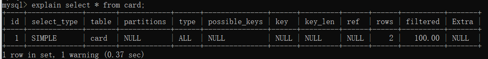
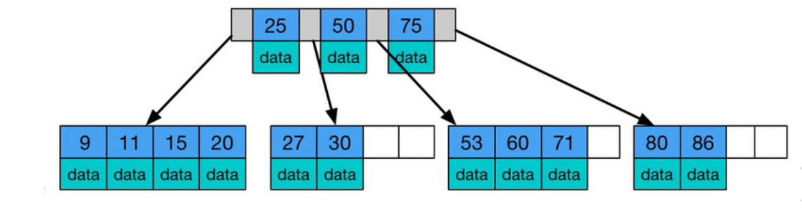
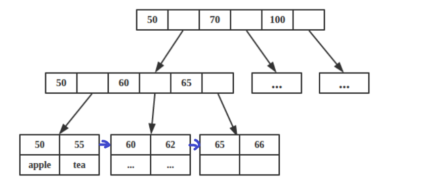
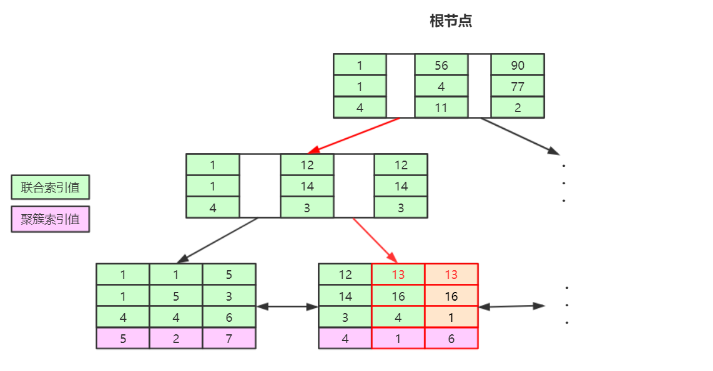

快照读Mysql学习
===


1.安装Mysql
===

## 1.1 关于密码的一些事

**登录mysql**：

1.  `mysql -uroot -p` 
2. 回车，输入密码

**修改密码的常见方法**：

- set password命令：

  1. 登录mysql

  2. `set password for 用户名@localhost = password(‘新密码’);`

     例如：`set password for root@localhost = password(‘123’);`

- 用mysqladmin

  1. `mysqladmin -u用户名 -p旧密码 password 新密码`

- 用Update直接编辑user表

  1. 登录mysql
  2. `use mysql;`
  3. `update user set password=password(‘新密码’) where user=‘root’ and host=‘localhost’;`
  4. `flush privileges;`

**忘记root密码的情况下修改密码：(以window为例)**

1. 关闭正在运行的Mysql服务。
2. 打开DOS窗口，转到mysql\bin目录。
3. 输入`mysqld --skip-grant-tables `，**--skip-grant-tables**代表启动Mysql服务的时候跳过权限表认证。
4. 再打开一个DOS窗口（注意不要关闭之前的窗口），转到mysql\bin目录
5. 输入`mysql`
6. 连接权限数据库：`use mysql;`
7. 改密码：`update user set password=password(‘新密码’) where user=‘root’;`
8. 刷新权限：`flush privileges;`
9. 关闭窗口。再重新打开DOS窗口，转到mysql\bin目录
10. 使用新密码登录

## 1.2 卸载mysql

1. 双击安装包。点击下一步。点击remove。(此时只是卸载了软件)
2. 手动删除mysql目录。（默认是C:\Program Files下）
3. 手动删除ProgramData目录(此目录为隐藏目录)下的Mysql


# 2. Mysql概述

## 2.1 sql、DB、DBMS分别是什么？

- DB ： DataBase(数据库，以文件的形式存在于硬盘)
- DBMS：DataBase Management System(数据库管理系统，常见的有Mysql oracle SQLserver)
- SQL：结构化查询语言。标准的sql适用于所有的数据库产品。
- 三者关系：DBMS - (执行)-> SQL - (操作)- > DB


## 2.2 表

表是数据库的基本组成单元，是一个结构化文件。其包括

- 行：数据/记录
- 列：字段。每个字段都可以有：字段名、字段数据类型、字段约束、字段长度。


## 2.3 sql分类

1. **DQL**(数据查询语言)：查询语句，凡是`select`的都是DQL
2. **DML**(数据操作语言)：增删改查，`insert、delete、update`
3. **DDL**(数据定义语言)：新修改**表的结构** `create、drop、alter`
4. **TCL**(事务控制语言)：**commit 提交事务；rollback回滚事务**；
5. **DCL**(数据控制语言)：**grant授权**、**revoke撤销权限**


## 2.4 Mysql常见命令

- 登录：`mysql -uroot -p密码`
- 查看数据库：`show databases;` 
- 创建数据库：`create database 数据库名字;`
- 删除数据库：`drop database 数据库名字;`
- 使用/切换数据库：`use 数据库名字;` 
- 查看当前数据库的表：`show tables;` 
- 导入数据：`source 文件路径;` 
- 导出整个数据库：`mysqldump 数据库名;` 
- 导出指定库下的某个表：`musqldump 数据库名 表名;` 
- 查看表结构：`desc 表名;` 
- 退出：`exit` 


## 2.5 查询操作

### 2.5.1 简单查询

查询一个字段：`select 字段名 from 表名;`

***tips: 所有的sql语句都要以`;`结尾。并且sql不区分大小写。***

查询多个字段：

- `select 字段名1,字段名2... from 表名`;

查询全部字段：

- `select * from 表名;` 

给字段起别名：

- `select 字段名 as 别名 from 表名;` 
-  `select 字段名 别名 from 表名;` (以空格分隔其别名)

字段进行简单运算：

- 在工资表中查询工资并乘以10 `select money*10 from wages;`

对重复字段进行去重：`使用distinct关键字`

```
select dinstinct job from emp;

tips:
	1、dinstinct只能放在所有字段的最前面。代表将select的字段看		成一组再进行过滤。
	2、可以跟分组函数一起使用。
```

**tips：当参与运算的字段为NULL时，计算的结果始终为NULL。**

```
补充：空处理函数
ifnull(可能为null的数据，被当做什么处理) 
如：ifnull(ewage,0) 表示当ewage为null时结果变成0
```


###  2.5.2 条件查询

格式：

```
select 字段,字段,字段...
from 表名
where 条件;
```

**执行顺序：from-->where-->-select**

| 比较操作符： | = , < , > , >= , <= , <>或!= |
| ------------ | ---------------------------- |
| 字符串比较： | LIKE , NOE LIKE              |
| 逻辑操作符： | AND , OR , NOT               |
| 值的域：     | BETWEEN , NOT BETWEEN        |
| 值的列表:    | IN , NOT IN                  |
| 未知的值：   | IS NULL , IS NOT NULL        |

- 查询工资等于5000的员工名字：`select ename from emp where ewage=5000;`

- 查询工资在3000~5000的员工名字：
  - `select ename from emp where ewage>=3000 and ewage<=5000;`
  - `select ename from emp where ewage between 3000 and 5000;`
  
- 查找没有津贴的员工名字：
  
  - `select ename from emp where comm is null;`
  
- 找出工资大于1000且编号是20或30的员工：

  - `select ename from emp where ewage>1000 and (eno=20 or eno=30);`

    **tips：当运算符不确定时，加个小括号**

- 找出岗位是MANAGE和SALESMAN的员工:

  - `select ename from where job in ('MANAGE','SALESMAN');`

- 模糊查找：`like 、not like`

  - 需掌握两个符号：
    - `%`：匹配任意多个字符
    - `_`：匹配单个字符
  - 找出名字中含有O的员工：
    - `select ename from emp where ename like ‘%O%’;`
  - 找出名字中第二个字母是A的员工：
    - `select ename from emp where ename like ‘_A%’;`
  - 找出名字中含有下划线的：(此时 `_` 是有特殊含义的，需要使用`\`转义)
    - `select ename from emp where ename like ‘%\_%’;`


## 2.6 排序数据

格式：

```
select 字段名
from 表名
[where 条件]
order by 要排序字段1,字段2，字段3... [asc|desc];   
```

**asc：表示升序排序。desc表示降序排序。如不指定则默认升序排序**

**tips：**上面格式的执行顺序为：`from --> where --> select --> order by`

- 根据工资进行排序：
  - `select * from emp order by ewage; `  升序
  - `select * from emp order by ewage asc;`  升序
  - `select * from emp order by ewage desc;`  降序
- 在SALESMENT部门根据工资进行降序排序，工资相同时按名字升序排序：
  - `select * from emp where job='SALESMENT' order by ewage desc,ename asc;`


## 2.7 分组函数

> 分组函数又叫多行处理函数、聚合函数。
>
> 分组函数都是对某一组数据进行操作

| count | 计算数据条数 |
| ----- | :----------- |
| sum   | 求和         |
| avg   | 求平均值     |
| max   | 求最大值     |
| min   | 求最小值     |

**分组函数的特点：**

1. 自动忽略null
2. 不可以出现在where后面

使用：

- 查询工资总和：`select sum(ewage) from emp;`
- 找出最高工资：`select max(ewage) from emp;`
- 找出总人数：`select count(*) from emp;`

 **思考1：count(*)和count(某个字段)的区别：**

```
count(*) 是统计记录总条数
count(某个字段) 是统计这个字段不为null的数据总数
```

**思考2：**

```
如果要找出工资大于平均工资的员工：可否使用下面这个语句
select ename from emp where ewage > avg(ewage);

答案是不可以。因为分组函数不能用在where后面。为什么呢？在分组查询那里揭晓。
```


## 2.8 分组查询

```
select 字段名1,字段名2...
from 表名
[where 条件]
group by 要分组的字段
[having 分组后过滤的条件];
```

**执行顺序：from --> where --> group by --> having --> select**

**tips：** 

1. **分组函数一定要跟group by一起使用，这也就是它为什么分组函数的原因。**
2. **分组函数都是在group by分完组之后执行的。这就是它为什么不能放在where之后的原因**
3. **当sql语句中没有group by时，整张表的数据会自动组成一组。**
4. **当sql语句有group by时，select后面只能跟分组函数或参与分组的字段。**

案例：

- 找出每个工作岗位的最高工资：`select max(ewage) from emp group by job;`
- 找出每个部门不同工作岗位的最高工资：
  - `select depino,job,max(ewage) from emp group by deptno,job; `
- 找出最高工资大于2900的部门：
  - `select deptno from emp group by deptno having max(ewage)>2900;` 
  - `select deptno from emp where ewage>2900 group by deptno;`
  - 以上两种都可以实现，但第二种性能更好，所以以后可以用where的就不用having
- 找出平均工资大于2000的部门:
  - `select deptno,avg(ewage) from emp group by deptno having avg(ewage)>2000;`

**思考下面这条语句是否正确：**

```
select ename,max(ewage),job from emp group by job;

答案:错误。因为ename没有进行分组。
```

解决分组函数部分留下的问题：

```
找出工资大于平均工资的员工
select ename from emp where ewage > (select avg(ewage) from emp);
```


## 2.9 小结

一个完整的sql语句格式：

```
								  执行顺序
select 字段							5
from 表名			 				    1
where 条件							2
group by 要分组字段			   		  3
having 再次过滤的条件					 4
order by 排序字段;				   	   6
```


## 3.0 连接查询

根据**语法**来分：

- SQL92：旧的语法。
  - 格式：`from A,B where A.字段=B.字段`
  - 缺点：表的连接条件与数据的筛选条件混合
- SQL99：新的语法。
  - 格式：`from B join A on 表的连接条件 where 数据筛选条件` 
  - 优点：表的连接条件与数据的筛选条件分明

根据**表的连接方式**来分：

- 内连接：`inner` 
  - 等值连接：表连接的条件是等量关系。
  - 非等值连接：表连接的条件是不是等量关系。
  - 自连接：自己跟自己连接。此时必须给表起别名。
- 外连接：`outer`
  - 左(外)连接：左边的表是主表
  - 右(外)连接：右边的表是主表
- 全连接（用的少）

> 在表的连接查询方面有一种现象被称为**笛卡尔积现象**。即两张表连接的时候没有进行条件限制，导致最终结果是两张表记录条数的乘积。
>
> 说白了就是第一张表的每条数据会跟第二张表的每条数据连接，然后形成一张大表。

```
如何避免笛卡尔积？  
答：增加条件限制

避免了笛卡尔积现象会减少匹配次数吗。 
答：不会，因为两张表的每条数据还是要带着条件一一匹配，匹配成功则显示。
```

***

**`内连接跟外连接的区别`**：

- `内连接`：假设A表和B表进行内连接，凡是AB表同时匹配上的记录都会被查询出来。
- `外连接`：假设A表和B表进行外连接，那么AB表中有一个是主表，有一个是副表，而查询主要查主表内容，捎带着查询B表而已。即A表中的数据全部会显示，B表中的数据只有跟A表中的数据匹配上时才会显示，否则为null。


### 3.0.1 等值连接---案例：

- 查询每个员工的部门名称，显示员工名和部门名。

  - ```
    SQL92写法:
    select e.ename,d.dname 
    from emp e,dept d 
    where e.deptno=d.deptno;
    ```

  - ```
    SQL99写法：推荐
    select e.name,d.dname
    from emp e
    [inner] join dept d
    on e.deptno=d.deptno;
    ```

### 3.0.2 非等值连接---案例：

- 找出员工的工资等级，显示员工名、工资、工资等级

  - ```
    select e.name,e.ewage,e.range
    from emp e
    join erange r
    on e.ewage>=r.lowwage and e.ewage < r.highwage
    ```

### 3.0.3 自连接---案例

- 找出每个员工的上级领导，显示员工名和对应的领导名

  - ```
    select e.ename,e.boss
    from emp a
    join emp b
    on a.boss = b.eno;
    
    //弊端就是当此员工没有上级领导时不显示
    ```

### 3.0.4 左连接---案例

- 找出每个员工的上级领导，显示员工名和对应的领导名

  - ```
    select e.ename,e.boss
    from emp a
    left [outer] join emp b
    on a.boss = b.eno;
    
    //好处是当此员工没有上级领导时正常显示
    ```

### 3.0.5 右连接---案例

- 找出没有员工的部门

  - ```
    select d.*
    from emp e
    join dept d
    on e.deptno = d.deptno
    where e.ename!=null;
    ```


### 3.0.6 多表联查

- 找出每个员工的部门名称、工资等级以及上级领导

  - ```
    select e.ename,d.dname,w.range,e.boss
    from emp e
    join dept d
    on e.deptno=d.deptno
    join wage w
    on e.ewage between w.lowwage and w.highwage
    left join emp e1
    on e.boss = e1.empno;
    ```


## 3.1 子查询

> sql语句中可以嵌套select语句，嵌套的select语句就是**子查询**。
>

子查询可以出现在哪里：

```
select ..(select)
from ..(select)
where ..(select)
```

- 在from中嵌套子查询

  - 找出每个部门平均工资的薪水等级

    - ```
      select t.*,w.range
      from (select deptno,avg(ewage) as sal from emp group by deptno) as t
      join wage w
      on t.sal between w.lowwage and w.highwage;
      ```


## 3.2 union

union作用：**可以将两个不相干的表的查询结果集相加。**

```sql
select ename from emp
union
select dname from dept;
```


## 3.3 limit --- Mysql特有

语法：`limit startIndex,length` 

`startIndex`代表**起始位置(不指定默认为0)**。`length`代表**长度**。

- 取出工资前5名的员工：
  - `select ename from emp order by ewage desc limit 5;`
  - `select ename from emp order by ewage desc limit 0,5;`
- 找出工资排名在第4到第9之间的员工
  - `select ename from emp order by ewage limit 3,6;` 

**通用的标准分页sql：**

```
设每页显示 5条数据
第一页:limit 0,5
第二页:limit 5,5
第三页:limit 10,5
第四页:limit 15,5
。。。。。。
```

**结论：设每页显示**Size**条数据，则第**N**页要显示的数据为：`limit (N-1)*Size,Size`**


## 3.4 创建表

格式：

```
create table 表名(
	字段名1 数据类型 [约束条件],
	字段名2 数据类型 [约束条件],
	字段名3 数据类型 [约束条件],
	....
);
```

如创建学生表（学号，姓名，班级，班级编号，生日）

```
drop table if exists t_student; //t_student存在的话就删除
create table t_student(
	sno bigint,
	name varchar(255),
	sex char(1)
);
```


## 3.5 插入数据

格式：`insert into 表名(字段1,字段2...) values(值1,值2...);`

字段的数量跟值得数量要相等，且类型要对应相同。

若不指定具体字段则表示全部字段。

- 插入一行数据：
  - `insert into t_student values(1,'codekiang','1');`
  - `insert into t_student(sno,name,sex) values(1,'codekiang','1');`
- 一次插入多行:
  - `insert into t_student values(2,'hang','1'),(3,'meinv','0');`
- 插入某个字段：(此时没插入的字段自动为null)
  - `insert into t_student(name) values('hhh');`


## 3.6 修改数据

格式：`update 表名 set 字段1=值1,字段2=值2... where 条件;`

**tips：若不指定条件则对整张表的数据全部更新**

- 将部门10的LOC修改为SHANGHAI
  - `update dept set loc='shanghai' where deptno=10;`


## 3.7 删除数据

格式：`delete from 表名 where 条件;`

**tips：没有条件则全部删除**

- 删除部门10的数据
  - `delete from dept where deptno=10;`

**删除大表(不可恢复)**

通过delete的方式删除数据后还可以恢复。但如何永久删除数据呢？

1. `truncate table 表名;`   表给截断，不可回滚
2. `delete table 表名;` 


## 3.8 约束

常见约束：

- `not null`：非空约束，表示该字段不能为空
- `unique`：唯一约束，表示该字段不能重复
- `primary key`：主键约束，表示该字段不能为空也不能为重复
- `foreign key`：外键约束，


### 3.8.1 非空约束 not null

```sql
drop table if exists t_user;
create table t_user(
	id int not null,
	name varchar(255),
);
```


### 3.8.2 唯一约束 unique

- 给某一列添加unique（列级约束）

  - ```sql
    drop table if exists t_user;
    create table t_user(
    	id int unique,
    	name varchar(255),
    );
    ```

- 给多列分别添加unique

  - ```sql
    drop table if exists t_user;
    create table t_user(
    	id int unique,
        sno int unique,
    	name varchar(255)
    ); //每个id不可以重复，每个sno不可以重复
    ```

- 给多列添加unique（表级约束）

  - ```sql
    drop table if exists t_user;
    create table t_user(
    	id int,
        sno int,
    	name varchar(255),
        unique(id,sno),
    );//id跟sno联合起来不可以重复，如id=1，sno=2跟id=1，sno=3是不违背unique的。
    ```


### 3.8.3 主键约束 primary key

> 一般一张表就一个主键，不建议多个。
>
> 主键的作用：作为每条记录的唯一标识。

```sql
drop table if exists t_user;
create table t_user(
	id int primary key,
	name varchar(255),
);
```

**主键分类**：

- 根据关键字段的字段数量来分：
  - `单一主键`：就一个主键。(推荐)
  - `复合主键`：多个字段联合起来形成一个主键。（违背三范式）
- 根据主键性质来分：
  - `自然主键`：主键值不跟业务挂钩。（推荐使用）
  - `业务主键`：主键值跟业务挂钩，如身份证，银行卡。

**自增主键：auto_increment **

```sql
drop table if exists t_user;
create table t_user(
	id int auto_increment, //该字段自动维护一个自增的数字，从1开始，每次递增1
	name varchar(255),
)
```


### 3.8.4 外键约束 foreign key

**A表的`a`字段参考B表的某个`唯一`字段，则`a字段`被称为`外键`**

**tips：**

1. 外键值可以为null。

2. 被引用值不一定是主键，但一定要唯一。

3. 外键值 必须 跟 被引用字段中的 其中一个的值 相等。

   | address表           | user表(dno为外键，参考address的id字段)                       |
   | ------------------- | :----------------------------------------------------------- |
   | id          address | sno    name      dno                                         |
   | 101         广州    | 1        李四        208           **`正确`，dno = 208 = id** |
   | 208         深圳    | 2        张三        555           **`不正确`，dno = 555 != id** |
   | 304         梅州    | 3        王五        208           **`正确`，dno = 208 =id** |
   | 401         佛山    | 4        杭杭        304           **`正确`，dno = 304 = id** |

格式：

```sql
create table student(
	sno int,
    sname varchar(255),
    classno int,
    foreign key(classno) references t_class(cno)
);
```


## 3.9 存储引擎(了解)

`存储引擎`：mysql存储表的机制。

在建表的时候可以指定存储引擎和字符集。如`create table s (id int) ENGINE=InnoDB DEFAULT CHARSET=UTF8;`

mysql默认使用的存储引擎是`InnoDB`，默认字符集是`UTF8`。

**mysql常见存储引擎**：

- `MyISAM` 
  - 采用三个文件来组织一个表
    - **`.frm`文件（存储表的结构）** 
    - **`.MYD`文件（存储表的数据）** 
    - **`.MYI`文件（存储表的索引）** 
  - 优点：可被压缩，**节省存储空间**
  - 缺点：**不支持事务**。
- `InnoDB` 
  - 表的结构存放在**`.frm`文件** 
  - 数据跟索引存储在**`.idb文件`** 
  - 优点：支持事务、行级锁、外键等，**安全性好**，可自动恢复。
  - 缺点：**无法被压缩**，无法转换成只读。
- `MEMORY` 
  - 每个表结构放在`.frm`文件中
  - 数据跟索引放在内存中
  - 优点：**查询速度最快**。
  - 缺点：**不支持事务，容易丢失数据**。


## 4.0 事务 （Transaction）

> 一个事务是一个完整的业务逻辑，不可再分。
>
> 事务的存在使数据更加的安全，完整。

例如：银行账户转账，从A账户向B账户转账1000，需要执行两条DML语句`update t_act set money=money-1000 where actno='A';`跟`update t_act set money=money+1000 where actno='B'; `。此时需要保证这两条更新语句必须同时成功或同时失败。

**tips：**

- **事务只跟DML语句有关。** 
- **如果要让多条DML语句同时执行成功或执行失败，则需要使用`事务`。**

**`事务执行流程`：**

1. 开启事务机制
2. 执行一条或多条DML语句（在缓存中执行，不直接影响文件）
3. 提交或回滚事务
   - `commit;` 提交事务。缓存区的内容更新到文件，清空缓存区
   - `rollback;` 回滚事务。清空缓存区。

***

`事务的特性：ACID`

- 原子性（Atomicity）：事务是最小的工作单元，不可再分。
- 一致性（Consistency）：保证多条DML语句同时成功或失败。
- 隔离性（Isolation）：每个事务之间具有隔离。
- 持久性（Durability）：必须将最终数据必须持久化保存在硬盘文件中。

***

事物的`隔离性`分为`4`个等级：

1. **读未提交**（read uncommitted）
   - A事务还没有提交，B事务就可以读取A事务未提交时的数据。
   - 缺点：存在 脏读现象，即随时会读到不确定的数据。
2. **读已提交**（read committed）
   - B事务提交之后，A事务才可以读取到B事务提交之后的数据。
   - 缺点：不可重复读，即只要对方一提交事务，数据立马变化。
3. **可重复读**（repeatable）
   - 只要不退出当前事务，则数据永远是进入事务前的数据。不会随着别的事务的提交而发生数据改变。
   - 缺点：读取到的数据是假象。
4. **序列化读**（serialize）
   - 只有等当前事务结束时，另一个事务才可以执行。
   - 缺点：效率低，需要事务排队。

**tips：**

- `oracle`默认使用的隔离级别是：`读已提交`
- `mysql`默认使用的隔离级别是：`可重复读`
- mysql的事务是自动提交的，只要执行一条DML就提交一次。
- mysql使用`start transaction;`可关闭自动提交机制。


## 4.1 索引

> 索引就相当于书目录，通过它可快速查找到数据。
>
> 添加索引是只给某个或某些字段添加索引。

数据库查找数据有两种检索机制：

1. 全表扫描
2. 通过索引检索


创建索引：`create index 索引名 on 表名(字段名);` 或 `alter table 表名 add index(字段名);` 

删除索引：`drop index 索引名 on 表名;` 


**tips：**

1. 主键和unique约束的字段自动添加索引。
2. 索引查找快的**最根本的原理**是**缩小了查找范围**。添加了索引的字段中的数据一旦修改，索引需要重新排序。所以不可一味的给字段添加索引

那什么时候考虑加索引呢：

- 数据量庞大
- 该字段很少DML操作
- 该字段经常出现在where中

索引分类：`单一索引`、`复合索引`、`主键索引`、`唯一索引`

***

索引底层采用的**数据结构**：**`B+树`** 

索引**实现原理**：

通过B+树缩小扫描范围，底层会对`索引字段`**(携带着该字段在表中的物理位置)**进行排序分区（可能是按大小，也可能按字母），当索引检索到数据之后获取到该数据的物理位置，通过物理位置直接定位到表中的数据。

**索引什么时候会失效？当模糊查找且第一个位是通配符时。**


3.Mysql面试
===

执行计划
---

执行计划，就是一条SQL语句，在数据库中实际执行的时候，一步步分别都做了什么。也就是我们用 `EXPLAIN` 分析一条SQL语句时展示出来的那些信息。

`EXPLAIN` 命令是查看 查询优化器 是如何执行查询的，从它的查询结果中可以知道一条SQL语句每一步是如何执行的，都经历了些什么，有没有用到索引，哪些字段用到了什么样的索引，这些信息都是我们SQL优化的依据。

语法：`explain select语句` 



***

**执行计划中的列** 

explain 显示的每个列都有不同的含义：

| 列名          | 含义                                                         |
| :------------ | :----------------------------------------------------------- |
| id            | 表示查询中执行select子句的顺序。id值大的先执行，若id相等则从上往下优先执行。 |
| select_type   | 查询的类型，主要是用于区分普通查询、联合查询、子查询等复杂的查询。 |
| table         | 表明对应行正在访问的是哪个表。                               |
| partitions    | 查询涉及到的分区。                                           |
| type          | 查找数据使用的方式。                                         |
| possible_keys | 查询可以使用的索引。如果使用的是覆盖索引，则不会显示；       |
| key           | 实际使用的索引，如果为NULL，则没有使用索引。                 |
| key_len       | 查询中使用的索引的字节数（最大可能长度），并非实际使用长度，理论上长度越短越好。 |
| ref           | 显示该表的索引字段关联的字段。                               |
| rows          | 大致估算出找到所需行所需要读取的行数。                       |
| filtered      | 返回结果的行数占读取行数的百分比，值越大越好。               |
| Extra         | 额外信息，十分重要。                                         |

type：表的连接类型，性能由高到底排列如下：

- system，表中只有一行记录，比如系统表；
- const，通过索引一次命中，匹配一行数据；主键置于where列表中：
  - `select * from stu where id = 1;` 
- eq_ref，唯一性索引扫描，对于每个索引键，表中只有一条记录与之匹配；
  - `select A.* from A,B where A.id=B.id` 
- ref，非唯一性索引扫描，返回匹配某个单独值的所有行，用于=、<或>操作符带索引的列；
  - `select * from stu where teacher_id = 123;` 
- range，只检索给定范围的行，使用一个索引来选择行，一般用于between、<、>；
  - `select * from stu where id between 1 and 10` 
- index，只遍历索引树；跟all差不多，只不过index查的字段就是索引。
  - `select id from stu;` 
- all，全表扫描；
  - `select * from stu;` 


extra常见的值如下：

- using filesort，MySQL会对数据使用一个外部索引排序，而不是按照表内索引顺序进行读取，若出现该值，则应优化SQL语句；
- using temporary，使用临时表缓存中间结果，常见于order by和group by。若出现该值，则应优化SQL；
- using index，表示select操作使用了覆盖索引，避免了访问表的数据行；
- using where，使用了where过滤；
- using join buffer，使用连接缓存；
- distinct，发现第一个匹配后，停止搜索更多的行；


索引
---

索引可以提高sql的查询效率，相当于书的目录，通过它可快速查找到数据。在InnoDB和MyISAM的引擎下，索引和实际的数据都是存储在磁盘的，只不过进行数据读取的时候会优先把索引加载到内存中。而memory引擎的话数据跟索引都是放在内存中。

索引底层采用的**数据结构**：`B+树`。3~4层的B+树足以支持千万级别的数据量存储。

索引的**设计原则**：使key尽可能的小的占用内存空间。选int还是varchar？因为varchar占用的内存是可变的，而int是固定占用4B，所以当varchar大于4B的时候用int，小于4B的时候用varchar。

> B树：类似普通的平衡二叉树，不同的一点是B树允许每个节点有更多的子节点。
>
> 
>
> B+树是B-树的变体，也是一种多路搜索树, 它与 B- 树的不同之处在于:
>
> 1. 所有关键字存储在叶子节点,内部节点(非叶子节点并不存储真正的data，在mysql中非叶子节点存储的是索引)
> 2. 为所有叶子结点增加了一个链指针
> 3. 拥有两个头指针，一个指向根节点，一个指向data最小的节点。
>
> 
>
> 使用B+树的好处：
>
> 1. 因为非叶子节点没有存数据，每个节点能索引的范围更大更精确，可以减少树的高度。
> 2. B+树的叶子节点两两相连大大增加了区间访问性，可很好的进行范围查询等


### 前缀索引

当索引是很长的字符序列时，这个索引将会很占内存，而且会很慢，这时候就会用到前缀索引。前缀索引就是选择索引的前面几个字符作为索引，但是要尽量降低索引的重复率。

1. 首先查看不使用前缀索引时，不重复索引对整个记录的占比。

   ```sql
   mysql> select 1.0*count(distinct name)/count(*) from test;
   +-----------------------------------+
   | 1.0*count(distinct name)/count(*) |
   +-----------------------------------+
   |                           1.00000 |
   +-----------------------------------+
   1 row in set (0.00 sec)
   ```

2. 查看截取前**两个**字符作为索引时，不重复索引对整个记录的占比。

   ```sql
   mysql> select 1.0*count(distinct left(name,2))/count(*) from test;
   +-------------------------------------------+
   | 1.0*count(distinct left(name,2))/count(*) |
   +-------------------------------------------+
   |                                   0.75000 |
   +-------------------------------------------+
   1 row in set (0.00 sec)
   ```

3. 查看截取前**三个**字符作为索引时，不重复索引对整个记录的占比。

   ```sql
   mysql> select 1.0*count(distinct left(name,3))/count(*) from test;
   +-------------------------------------------+
   | 1.0*count(distinct left(name,3))/count(*) |
   +-------------------------------------------+
   |                                   0.75000 |
   +-------------------------------------------+
   1 row in set (0.00 sec)
   ```

4. 查看截取前**四个**字符作为索引时，不重复索引对整个记录的占比。

   ```sql
   mysql> select 1.0*count(distinct left(name,4))/count(*) from test;
   +-------------------------------------------+
   | 1.0*count(distinct left(name,4))/count(*) |
   +-------------------------------------------+
   |                                   1.00000 |
   +-------------------------------------------+
   1 row in set (0.00 sec)
   ```

5. 查看截取前**五个**字符作为索引时，不重复索引对整个记录的占比。

   ```sql
   mysql> select 1.0*count(distinct left(name,5))/count(*) from test;
   +-------------------------------------------+
   | 1.0*count(distinct left(name,5))/count(*) |
   +-------------------------------------------+
   |                                   1.00000 |
   +-------------------------------------------+
   1 row in set (0.00 sec)
   ```

可以看到截取前4个字符的时候就达到了1的占比，所以可以截取前四个字符作为索引。

left 为 字符串截取函数。

创建前缀索引：`alter table 表名 add index(字段名(n));` n为要截取的字符长度


### 聚簇索引和非聚簇索引

数据和索引存储在一起的叫做聚簇索引，分开存储的叫非聚簇索引。

聚簇索引的叶子节点存放的是数据，而非聚簇索引的叶子节点存放的是聚簇索引的值。（非聚簇索引最后还是要找回聚簇索引）

innodb存储引擎在进行数据插入的时候，数据必须跟某个索引字段存储在一起，这个字段可以是主键，如果没有主键，选择唯一键，如果没有唯一键，选择6B的id进行存储。

而innodb中B+树的每个节点都是16K的大小，因此可以放很多的索引。

innodb既有聚簇索引又有非聚簇索引。

myisam中只有非聚簇索引。


### 主键索引和非主键索引的区别

1. 主键索引的叶子节点存放着数据，普通索引的叶子节点存放着主键索引的值（这是在innodb中。如果myisam中，主键索引和普通索引是没有区别的都是直接索引着数据）
2. 进行主键查询的话可以一次性取到数据，而进行非主键查询的话需要进行回表才能拿到数据。


### 组合索引在B+树中是如何存储的

多个列形成一个索引，放入节点中。进行索引查找的时候先对第一个列进行索引查找，然后拿查找出来的索引数据 从 第二列开始往后逐个匹配。

例：`select * from table where b = 13 and c = 16 and d = 1;` 



利用第一个索引字段b，找到b=13的索引，然后从找出的索引中继续匹配c=16的索引，最后匹配d=1的索引数据，于是找到该组合索引下的聚簇索引值为**6**，再从聚簇索引树上找到最终数据。可以看到只有**第一个索引字段**b是排好序的，其他剩余的字段都是没排好序的。


### 名词解释

- 回表：先根据非聚簇索引找到聚簇索引的值，然后根据聚簇索引找到数据。
  - id主键，name为普通索引
  - `select * from table where name = ‘zhangsan’;` 
- 索引覆盖：查询的字段全都是索引
  - `select id，name from table where name = ‘zhangsan’;`
- 最左匹配：针对组合索引，只要查询条件与组合索引**从左到右部分字段的顺序**相匹配，该次查询就可以使用组合索引进行搜索。
  - 例如现有联合索引（x,y,z）
  - 如果查询条件是 `WHERE x=1 AND y=2 AND z=3;` 组合索引的完全匹配。
  - 如果查询条件是 `WHERE x=1 AND y=2;` 符合最左匹配原则
  - 如果查询条件是 `WHERE y=2 AND x=1;` 符合最左匹配原则
  - 如果查询条件是 `WHERE y=2 AND z=3;` 不符合最左匹配原则，无法使用组合索引
  - 如果查询条件是 `WHERE x=1 AND z=3;` 不符合最左匹配原则，无法使用组合索引。但会先使用索引x找到x=1的数据，然后再在找到的数据中匹配z=3的数据。
- 索引下推：利用出现在where中的组合索引字段都筛选完之后才返回到server层。
  - `mysq> select * from tuser where name like '张%' and age=18 and ismale=1;` 其中 (name, age)是组合索引。
  - 使用索引下推时，会先找到 name以张开头 的数据，然后再匹配 age=18的数据，最后将最后匹配到的数据返回到server，在server层中再筛选出 ismale=1的数据
  - 不使用索引下推时，找到 name以张开头 的数据后直接返回到server层，然后再在server层做数据的筛选。


数据库调优
---

平时在项目中有做过一些优化，首先是数据库设计的时候会先考虑到优化问题，比如表的字段类型、长度等，以及创建合适的索引。其次是在生产环境下出现sql问题后进行优化，再这个阶段我会考虑调整sql语句，索引的创建或修改，尽量减少回表的操作。或者根据性能监控来进行调优，这部分的只是我还在学习中。

比如 `select id, name, sex where name = 'zhangsan' ;` 可将name跟sex组成联合索引，来避免回表。


MVCC
---

MVCC(Mutil-Version Concurrency Control)，就是多版本并发控制。MVCC是一种并发控制的方法，一般在数据库管理系统中，实现对数据库的并发访问。主要适用于Mysql的RC, RR隔离级别。

好处：提高数据库并发性能，使用不加锁，非阻塞方式去处理读-写冲突。


### 当前读和快照读

当前读：读取的一定是数据的最新版本，读取时还要保证其他并发事务不能修改当前数据，会对读取的数据进行==加锁==。

- 像`select lock in share mode`(共享锁)、 `select for update` 、`update`、`insert` 、`delete`(排他锁) 这些操作都是一种当前读

快照读：读取的不一定是数据的最新版本，可能是历史版本的记录。比如：不加锁的select操作。 

- 快照读前提是隔离级别小于串行级别，串行级别下的快照读会退化成当前读；


### 实现原理

它的实现原理主要是依赖记录中的 **3个隐式字段**，**undolog** ，**Read View** 来通过保存数据在某个时间点的快照来实现的。

特点：

1. 每行数据都存在一个版本，每次数据更新时都更新版本号。
2. 修改时Copy出当前版本到当前事务，各个事务之间无干扰。
3. 保存时比较版本号，如果成功，则覆盖原记录（commit）；失败则放弃覆盖（rollback）

***

#### 隐藏字段


