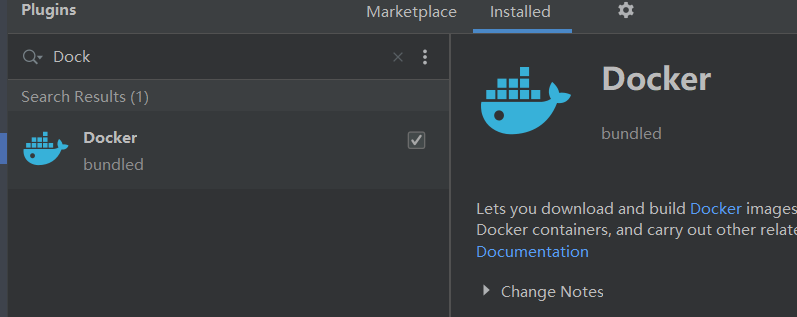
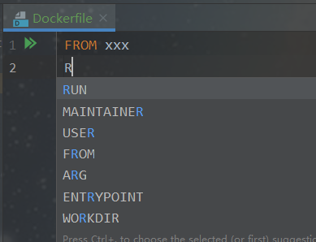
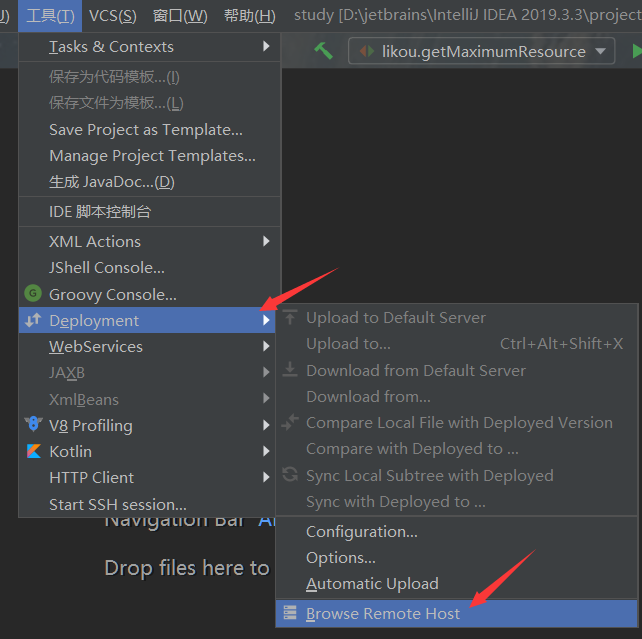
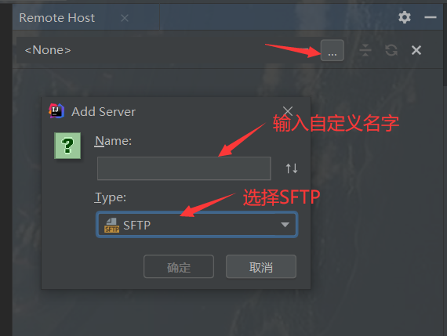
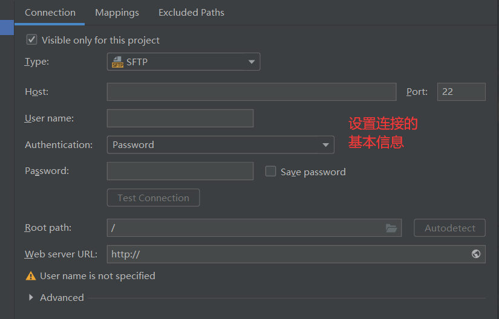
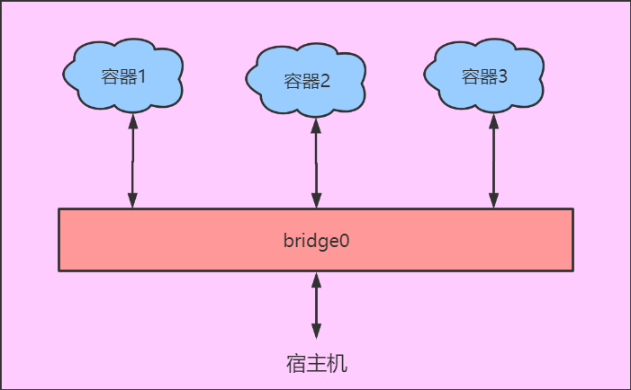

Docker学习
===

一、docker介绍
---

### docker简介

Docker是一个基于go语言的容器化的技术，让开发者打包他们的应用以及依赖包到一个轻量级、可移植的容器中，然后发布到任何流行的 Linux 机器上，也可以实现虚拟化。

也就是说我们只需要考虑在docker上安装开发环境需要的各种软件跟容器，然后部署的时候只需要在服务器下载docker即可，**无需再手动在服务器配置运行环境**。此外docker非常适合 **持续集成CI** 和 **持续交付目CD**，即程序员只需要push一下，服务器就会自动更新。

***

容器化技术与虚拟机技术的**区别**：

- 不是一个完整的操作系统，而是直接运行在操作系统之上
- 每个容器之间是相互隔离的


### docker的核心概念

docker中有几个核心概念：

- 镜像：一个镜像代表一个软件
- 容器：运行着的镜像就叫做容器
- 仓库：存储docker所有镜像的具体位置。分为远程仓库跟本地仓库

当需要用到镜像时，使用`docker image pull 镜像名:版本` 命令从远程仓库拉取镜像到本地仓库，如果不指定版本则默认拉取最新的版本。

使用`docker run 镜像名` 运行镜像。


### 镜像配置

> docker有类似maven的[仓库网站](https://registry.hub.docker.com/)，可以查看对应镜像的版本号：
>
> 

由于远程仓库是在国外，每次拉取的速度比较慢，所以可以使用国内的镜像仓库地址：

```json
"registry-mirrors": [
    "https://hub-mirror.c.163.com",
    "https://dockerhub.azk8s.cn",
    "https://reg-mirror.qiniu.com",
    "https://registry.docker-cn.com",
    "https://nrbewqda.mirror.aliyuncs.com"
  ]
```


二、docker入门
---

### helloworld案例

docker为我们提供了一个hello-world案例，我们只需要通过`docker run hello-world ` 即可运行，如下图：


根据前面我们知道，**run的是一个镜像**，所以可以知道hello-world是一个镜像，所以我们第一次run的时候docker会**先从本地中找该镜像，找不到该镜像就会去远程仓库拉取**，远程仓库没有则报错。


### 常见镜像命令

- `docker images [image]`：查看本地的镜像，可以指定镜像名称
- `docker pull image:version`：拉取远程仓库的image
- `docker rmi [-f] image:version`：删除本地仓库的image，-f参数表示强制删除


### 容器相关操作

#### 查看容器信息

- `docker load -i xx.tar`：将被打包成jar包的镜像文件导入本地仓库

- `docker ps [-a] [-q]`：查看当前正在运行的容器。
  - **-a**：表示显示全部，包括结束和正在运行的容易。
  - **-q**：查询正在运行的**容器id**。
- `docker inspect 容器名称/id`：查看容器的详细信息，如容器状态、端口映射、IP地址等。


#### 运行容器

- `docker run [-p hostPort:imagePort ] [-d] [--name name] image:tag`：运行容器。如果不加-p参数，主机访问不到该容器。**容器可以多次执行，相互没有影响，即使容器端口一样，但是主机端口不能一样**。
  - **-p hostPort:hostPort**：将主机端口跟容器端口进行映射。例如 `docker run -p 8080:8080 tomcat`：启动tomcat容器，且映射到主机端口。
  - **-d**：表示后台运行。
  - **--name name**：指定容器启动的名字（唯一）
- `docker start 容器名称/id`：启动容器
- `docker restart 容器名称/id`：重启容器
- `docker stop 容器名称/id`：停止容器
- `docker rm [-f] 容器名称/id `：删除容器
  - `docker rm -f $(docker ps -aq)`：删除所有的容器


#### 查看容器日志

- `docker logs [-f] [-t] 容器名称/id`：查看容器运行日志。
  - -f：实时查看日志
  - -t：显示时间


#### 容器内操作

- 查看容器内进程：`docker top 容器名称/id` 
- 进入容器终端：`docker exec -it 容器名称 bash`
  - **exit命令**，退出容器终端


#### 容器与宿主机的文件拷贝

宿主机到容器的文件拷贝：`docker cp 主机文件 容器名称:文件路径` 

容器到宿主机的文件拷贝：`docker cp容器名称:文件 主机文件路径 ` 


#### 数据卷

数据卷(volume)是一个可供一个或多个容器使用的特殊的**宿主机目录**。数据卷是被设计用来**持久化数据**的。

- 宿主机和容器之间，多个容器之间可通过数据卷进行数据共享
- 对数据卷的修改会立马生效。

创建数据卷的方式很简单，就在容器启动的时候指定目录就可以了，即加上`-v 数据卷路径:容器文件路径`。数据卷路径等同于数据卷名称

完整启动路径：

```bash
docker run -d -p 8080:8080 --name tomcat -v /myDemo:/usr/local/tomcat/webapps tomcat:latest
```

- 宿主机目录不存在时，会自动创建
- 如果挂载一个**空的数据卷**到**容器的非空目录**中，那么这个目录下的文件会被复制到数据卷中。
- 如果挂载一个**非空的数据卷**到**容器中的目录**中，那么容器中的目录中原有的内容会被隐藏掉，只显示数据卷中的数据。

***

查看所有数据卷：`docker volume ls` 

查看容器的数据卷：`docker volume inspect volume名` 

删除数据卷：`docker volume rm volume名`


三、镜像分层原理
---

一个镜像为什么这么大？因为一个镜像不仅包括某个软件要运行的代码，还包括其运行环境以及其他软件包依赖。

正是因为镜像大，所以把镜像分成一层层的，一个镜像由若干个镜像组成，而这些小的镜像还可以去组合其他的镜像，依次达到复用的效果。


四、启动mysql
---

`docker run -d -p 3308:3306 -e MYSQL_PASSWORD=密码 --name mysql mysql:8.0.17` 


五、Dockerfile
---

### Dockerfile 简介

Dockerfile 是一个用来构建镜像的**文本文件**，文本内容包含了一条条构建镜像所需的**指令**。Docker通过读取`Dockerfile`中的指令自动生成镜像。

> Dockerfile 所在的目录称为上下文目录

使用 `docker build -t image:tag 路径` 命令构建镜像，例如：

```bash
docker build -t nginx:v3 . # 点表示当前目录
```

**构建过程**：

1. 对上下文目录中<u>所有的内容</u>进行打包然后发送给docker的server
2. server对dockerfile中的指令一行行的解析，每一行指令都会在缓存中生成一个image层
3. 每行的指令都在之前的image层上构建image层，直到最后一行指令执行完才是完整的image

> 可在上下文目录中创建`.dockerignore` 文件，在文件中声明的文件 不会被docker打包


### 基础结构

Dockerfile 一般分为四部分：<u>基础镜像信息</u>、<u>维护者信息</u>、<u>镜像操作指令</u> 和 <u>容器执行指令</u>。且**基础镜像信息必须位于文件的第一行**。


#### 基础镜像信息

**FROM**：指定基础镜像，即构建的镜像是依赖于哪一个基础镜像的。<u>必须位于第一行</u>。

格式：

```dockerfile
FROM <image>
FROM <image>:<tag>
FROM <image>@<digest>
```

tag或digest是可选的，如果不使用这两个值时，会使用latest版本的基础镜像

示例：`FROM mysql:5.6` 


#### 维护者信息

**MAINTAINER**：声明维护者信息

格式：

```dockerfile
MAINTAINER <name>
```

示例：`MAINTAINER Jasper Xu`


#### 镜像操作指令

**RUN**：构建镜像时执行的命令

格式：

```dockerfile
RUN <命令行命令>
或者
RUN ["可执行文件", "param1", "param2"]
```

RUN指令创建的中间镜像会被缓存，并会在下次构建中使用。如果不想使用这些缓存镜像，可以在构建时指定`--no-cache`参数，如：`docker build --no-cache` 

示例：`RUN yum install vim`、`RUN ["yum ", "install ", "vim"]`

***

**ADD**：将本地文件添加到容器中，tar类型文件会自动解压(网络压缩资源不会被解压)，并且可以访问网络资源

> COPY：功能类似ADD，但是其只会进行文件拷贝

格式：

```
ADD <src>... <dest>
```

示例：`ADD hom* /mydir/` 把 所有以"hom"开头的文件 添加到mydir下

***

**EXPOSE**：指定于外界交互的端口，只有暴露了端口，外界才可以绑定该端口

格式：

```dockerfile
EXPOSE <port> [<port>...]
```

示例：`EXPOSE 80 443` 


#### 容器执行指令

**CMD**：类似于 RUN 指令，用于运行程序。但二者运行的时间点不同：CMD用于指定在**容器启动时**所要执行的命令，而RUN用于**镜像构建时**所要执行的命令。

格式：

```dockerfile
CMD ["param1","param2"]  #作为 ENTRYPOINT 的参数
或
CMD command param1 param2  # 执行shell内部命令
```

> 如果有多个CMD命令，则只有最后一个CMD命令才有效

***

**ENTRYPOINT**：指定容器启动时执行的命令。

> 可配合CMD使用，ENTRYPOINT命令作为容器启动后的第一个命令，而CMD指令作为第一个命令的默认参数。

格式：

```dockerfile
ENTRYPOINT command param1 param2
```

示例：默认查看当前路径下的所有文件

```dockerfile
ENTRYPOINT ["ls", "-a"]
CMD ["."]
```

***

**VOLUME**：指定可与主机挂载的目录

格式：

```dockerfile
VOLUME ["/path"]
```

***

**WORKDIR**：容器启动后，终端默认所在的目录。<u>如果目录不存在会自动创建</u>。

格式：

```dockerfile
WORKDIR /path/to/workdir
# 可以写多行（相对路径方式），如果写多行则每一行都以前面的路径为相对路径
```

示例：

```dockerfile
WORKDIR /a  # 这时工作目录为 /a
WORKDIR b  # 这时工作目录为 /a/b
WORKDIR c  # 这时工作目录为 /a/b/c
```

***

**ENV**：设置环境变量

格式：

```dockerfile
ENV <key1> <value1> ... 
```

示例：

```dockerfile
ENV BASE_DIR /data
WORKDIR $BASE_DIR  # 其他地方可以使用$获取环境变量值
```


### 综合案例-部署springboot项目

步骤：

1. 打包开发好的springboot项目

2. 在服务器上创建dockerfile上下文

3. 创建dockerfile并编写，例如：

   ```dockerfile
   FROM openjdk:8-jre
   WORKDIR /app
   ADD 项目的jar包 /app
   EXPOSE 访问项目的端口
   ENTRYPOINT ["java", "-jar"]
   CMD ["项目名.jar"]
   ```

4. 构建镜像：`docker build -t 镜像名:tag .` 

5. 执行容器：`docker run -d -p 8081:8081 --name 镜像名:tag` 

***

> idea中可以安装 `Docker` 插件，用于辅助我们编写dockerfile文件。






> 可以使用idea来连接远程服务器，可以**直接拖动**或点击**远程文件在idea中编写**。








六、网络配置
---

Docker启动时，自动在主机上创建**虚拟网桥**docker0，并随机分配一个<u>本地空闲私有网段</u>的一个地址给docker0接口。虚拟网桥docker0在内核层连通了其他的物理或虚拟网卡，将所有容器和本地主机都放到同一个网络。

> **Bridge**是容器启动的默认网络模式。

当创建一个Docker容器时，容器会自动获得Bridge网段的一个<u>空闲IP地址</u>，并使用docker0接口的IP地址作为容器的默认网关，从而建立了主机和容器之间的一个虚拟共享网络。

==主机与容器，容器与容器之间的通信，都是通过docker0网桥来实现的==。

可使用`docker network ls` 查看网桥配置。



***

试想一下，如果每个项目所需要的容器都在同一个bridge上进行通信，那么桥上是不是会很用拥堵，而且其他容器也没必要接收到非本项目的信息。

所以我们可以自己创建bridge，然后在容器启动的时候指定所属的bridge：

- 创建网桥：`docker create 网桥名字` 等价于 `docker create -d bridge 网桥名字` 
- 容器启动时指定网桥：`docker run --network 网桥名字 image:tag` 

> 当手动创建并指定网桥后，容器的名字相当于域名，相同网桥的容器之间可通过容器的名字进行网络通信。


七、Docker-compose
---

Compose 是用于定义和运行多个容器的工具。通过 Compose，可以**使用 YML 文件来项目所需要的所有服务**，配置好之后使用一个命令就可以从 YML 文件配置中创建并启动所有服务。

【注意】yml文件的命名最好为 `docker-compose.yml` 

在compose中有两个重要的概念：

- **服务**：项目启动所需要的容器，在compose中称为服务。
- **项目**：就是需要部署的项目，一个配置文件对应一个项目。


### compose安装

> window中自动带有compose

linux下安装：

1.  Github 上下载它的二进制包

   `sudo curl -L "https://github.com/docker/compose/releases/download/1.24.1/docker-compose-$(uname -s)-$(uname -m)" -o /usr/local/bin/docker-compose` 如果要下载其他版本请替换掉1.24.1 

2. 将可执行权限应用于二进制文件：`sudo chmod +x /usr/local/bin/docker-compose` 

3. 创建软链接：`sudo ln -s /usr/local/bin/docker-compose /usr/bin/docker-compose` 

4. 测试是否安装成功：`docker-compose --version` 


### Docker-compose模板文件

需要配置模板文件（YML）来配置项目要启动的所需容器。**一个模板文件对应一个项目**。

使用步骤：

1. 在 `docker-compose.yml` 中使用 ==模板命令== 来定义构成应用程序的服务，这样它们可以在隔离环境中一起运行。
2. 最后，执行 `docker-compose up` 命令来启动并运行整个应用程序。

模板文件如下：

```yml
version: '0.1.1'  # 首先指定项目的版本

services:  # 项目启动所需要的服务
  tomcat:  # 服务名，区别于容器名
    image: tomcat:8.0-jre8  # 服务所依赖的镜像
    container_name: tomcat  # 容器名
    ports:  # 绑定端口
      - "8081:8080"
    volumes:  # 数据卷
      - /root/apps:/usr/local/tomcat/webapps  # 路径绑定
      - demoapps:/usr/local/tomcat/webapps  # 别名绑定，需要先在下方创建
    networks:  # 网桥，需要先在下方创建
      - aa
    cmd:  # 容器启动后执行的命令
      ls .
  
  mysql: # 服务名，区别于容器名
    image: mysql:8.0.17
    container_name: mysql
    ports: 
      - "3308:3306"
    networks:
      - aa
    environment:  # 容器运行时的环境参数
      - MYSQL_ROOT_PASSWORD=mysql密码

volumes:
  demoapps:  # 创建数据卷
    # 如果不指定为外部卷，则数据卷的名称为 项目名_demoapps 而不是 demoapps
    external: true

networks:
  aa:  # 同上
    external: true
```

其实模板命令就是docker run命令的参数。

如果不通过 `docker-compose -p  name up`指定项目名的话，**默认使用当前所在目录为项目名**。

***

env_file：模板文件还有个模板指令为`env_file` ，其作用等同于environment，只不过environment是直接将参数写到yml中，而env_file是将参数写到一个`.env`文件中，然后在yml中指令`.env`文件的位置。

```yml
env_file:  # 通常env文件跟compose文件放在同个目录下
      - ./bbb.env
```

bbb.env的内容为：

```
MYSQL_ROOT_PASSWORD=mysql密码
```


build：将dockerfile打包成镜像并启动。

```yml
version: "0.1.1"

services:
  demo:  # 服务名
    build:  # 打包dockerfile
      context: ./demo  # 指定dockerfile所在的目录
      dockfile: dockfile  # dockfile
    container_name: demo
```


depends_on：设置依赖关系。当项目启动的时候，以依赖性顺序启动服务

在以下示例中，先启动 db 和 redis ，才会启动 web

```yml
version: "0.1.1"
services:
  web:
    build: .
    depends_on:  # 设置依赖关系
      - db
      - redis
  redis:
    image: redis
  db:
    image: postgres
```


### compose指令

docker-compose 

