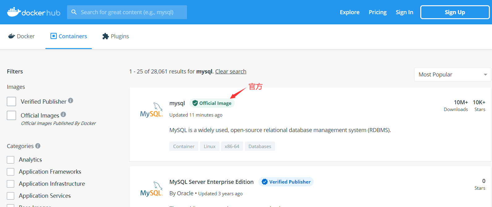
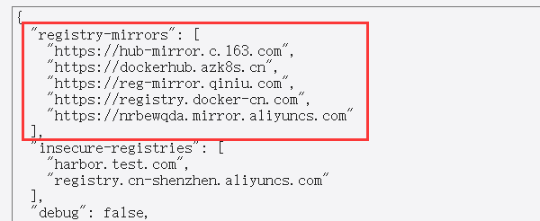
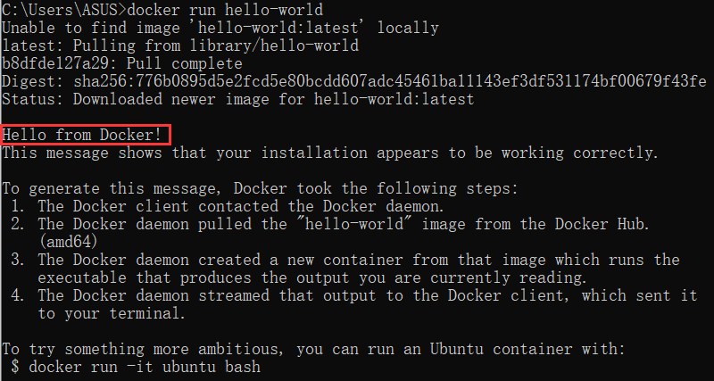

Docker学习
===

一、docker介绍
---

### docker简介

Docker是一个基于go语言的容器化的技术，让开发者打包他们的应用以及依赖包到一个轻量级、可移植的容器中，然后发布到任何流行的 Linux 机器上，也可以实现虚拟化。

也就是说我们只需要考虑在docker上安装开发环境需要的各种软件跟容器，然后部署的时候只需要在服务器下载docker即可，**无需再手动在服务器配置运行环境**。此外docker非常适合 **持续集成CI** 和 **持续交付目CD**，即程序员只需要push一下，服务器就会自动更新。

***

容器化技术与虚拟机技术的**区别**：

- 不是一个完整的操作系统，而是直接运行在操作系统之上
- 每个容器之间是相互隔离的


### docker的核心概念

docker中有几个核心概念：

- 镜像：一个镜像代表一个软件
- 容器：运行着的镜像就叫做容器
- 仓库：存储docker所有镜像的具体位置。分为远程仓库跟本地仓库

当需要用到镜像时，使用`docker image pull 镜像名:版本` 命令从远程仓库拉取镜像到本地仓库，如果不指定版本则默认拉取最新的版本。

使用`docker run 镜像名` 运行镜像。


### 镜像配置

> docker有类似maven的[仓库网站](https://registry.hub.docker.com/)，可以查看对应镜像的版本号：
>
> 

由于远程仓库是在国外，每次拉取的速度比较慢，所以可以使用国内的镜像仓库地址：

```json
"registry-mirrors": [
    "https://hub-mirror.c.163.com",
    "https://dockerhub.azk8s.cn",
    "https://reg-mirror.qiniu.com",
    "https://registry.docker-cn.com",
    "https://nrbewqda.mirror.aliyuncs.com"
  ]
```




二、docker入门
---

### helloworld案例

docker为我们提供了一个hello-world案例，我们只需要通过`docker run hello-world ` 即可运行，如下图：



根据前面我们知道，**run的是一个镜像**，所以可以知道hello-world是一个镜像，所以我们第一次run的时候docker会**先从本地中找该镜像，找不到该镜像就会去远程仓库拉取**，远程仓库没有则报错。


### 常见镜像命令

- `docker images [image]`：查看本地的镜像，可以指定镜像名称
- `docker pull image:version`：拉取远程仓库的image
- `docker rmi [-f] image:version`：删除本地仓库的image，-f参数表示强制删除


### 容器相关操作

#### 查看容器信息

- `docker load -i xx.tar`：将被打包成jar包的镜像文件导入本地仓库
- `docker info`：展示docker信息

- `docker ps [-a] [-q]`：查看当前正在运行的容器。
  - **-a**：表示显示全部，包括结束和正在运行的容易。
  - **-q**：查询正在运行的**容器id**。


#### 运行容器

- `docker run [-p hostPort:imagePort ] [-d] [--name] image:tag`：运行容器。如果不加-p参数，主机访问不到该容器。**容器可以多次执行，相互没有影响，即使容器端口一样，但是主机端口不能一样**。
  - **-p hostPort:hostPort**：将主机端口跟容器端口进行映射。例如 `docker run -p 8080:8080 tomcat`：启动tomcat容器，且映射到主机端口。
  - **-d**：表示后台运行。
  - **--name**：指定容器启动的名字（唯一）
- `docker start 容器名称/id`：启动容器
- `docker restart 容器名称/id`：重启容器
- `docker stop 容器名称/id`：停止容器
- `docker rm [-f] 容器名称/id `：删除容器
  - `docker rm -f $(docker ps -aq)`：删除所有的容器


#### 查看容器日志

- `docker logs [-f] [-t] 容器名称/id`：查看容器运行日志。
  - -f：实时查看日志
  - -t：显示时间


#### 查看容器内进程

`docker top 容器名称/id`


