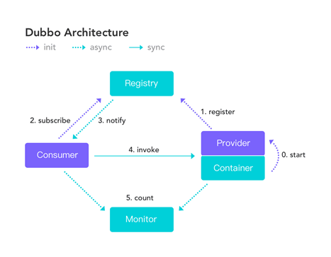

# Dubbo学习

## 基础知识

### dubbo简介

Dubbo是一款高性能、轻量级的开源Java RPC框架，它提供了三大核心能力：面向接口的远程方法调用，智能容错和负载均衡，以及服务自动注册和发现。


### RPC简介

RPC【Remote Procedure Call】是指远程过程调用，是一种进程间通信方式，他是一种技术的思想，而不是规范。它允许程序调用另一个地址空间（通常是共享网络的另一台机器上）的过程或函数，而不用程序员显式编码这个远程调用的细节。即程序员无论是调用本地的还是远程的函数，本质上编写的调用代码基本相同。

RPC两个核心模块：通讯，序列化。


### dubbo基本概念



- 服务提供者（Provider）：服务提供方，服务提供者在启动时，向注册中心注册自己提供的服务。
- 服务消费者（Consumer）：调用远程服务，服务消费者在启动时，向注册中心订阅自己所需的服务，服务消费者从提供者地址列表中，基于软负载均衡算法，选择一台服务提供者进行调用，如果调用失败，再选另一台调用。
- 注册中心（Registry）：返回服务提供者地址列表给服务消费者，如果有变更，注册中心将基于长连接推送变更数据给消费者
- 监控中心（Monitor）：监控 服务消费者 和 提供者 在内存中累计调用次数和调用时间，定时每分钟发送一次统计数据到监控中心

调用关系说明：

- 服务容器负责启动，加载，运行 服务提供者。
- 服务提供者在启动时，向注册中心注册自己提供的服务。
- 服务消费者在启动时，向注册中心订阅自己所需的服务。
- 注册中心返回服务提供者地址列表给消费者，如果有变更，注册中心将基于长连接推送变更数据给消费者。
- 服务消费者 从提供者地址列表中，基于软负载均衡算法，选一台服务提供者进行调用，如果调用失败，再选另一台调用。
- 服务消费者和提供者，在内存中累计调用次数和调用时间，定时每分钟发送一次统计数据到监控中心。


## dubbo-helloworld

某个电商系统，**订单服务**需要调用**用户服务**获取某个用户的所有地址；

此时需要创建两个服务模块进行测试 

| 模块                | 功能           |
| ------------------- | -------------- |
| 订单服务web模块     | 创建订单等     |
| 用户服务service模块 | 查询用户地址等 |

订单服务web模块在A服务器，用户服务模块在B服务器，A可以远程调用B的功能。

> 建议将服务接口，服务模型，服务异常等通用的类/接口提取到一个公用模块中，每个服务使用的之后引入公用模块即可。


### Spring整合dubbo

1. 在公用模块中定义服务消费者、服务提供者各自的接口，以及实体类等。

2. 在服务提供者中引入dubbo以及公用模块的maven

   ```xml
   <dependency>
     <groupId>org.apache.dubbo</groupId>
     <artifactId>dubbo</artifactId>
     <version>2.7.16</version>
   </dependency>
   
   <dependency>
     公用模块的地址
   </dependency>
   
   <!-- 由于我们使用zookeeper作为注册中心，所以需要引入zkclient和curator操作zookeeper -->
   <dependency>
       <groupId>com.101tec</groupId>
       <artifactId>zkclient</artifactId>
       <version>0.10</version>
   </dependency>
   <!-- curator-framework -->
   <dependency>
       <groupId>org.apache.curator</groupId>
       <artifactId>curator-framework</artifactId>
       <version>2.12.0</version>
   </dependency>
   ```

3. 将提供者注册到注册中心

   ```xml
   <!-- 当前应用的名字 -->
   <dubbo:application name="gmall-user"></dubbo:application>
   <!-- 指定注册中心的地址 -->
   <dubbo:registry address="zookeeper://118.24.44.169:2181" />
   <!-- 使用dubbo协议，将服务暴露在20880端口  -->
   <dubbo:protocol name="dubbo" port="20880" />
   <!-- 指定需要暴露的服务 ref：服务真正实现的对象 -->
   <dubbo:service interface="com.gmall.service.UserService" ref="userServiceImpl" />
   <!-- 将UserServiceImpl实现类放入容器中 -->
   <bean id="userServiceImpl" classs="com.gmall.service.impl.UserServiceImpl"></bean>
   ```

4. 在消费者中引入dubbo以及公用模块的maven

5. 使用消费者订阅服务

   ```xml
   <!-- 应用名 -->
   <dubbo:application name="gmall-order"></dubbo:application>
   <!-- 指定注册中心地址 -->
   <dubbo:registry address="zookeeper://118.24.44.169:2181" />
   <!-- 
   	生成远程服务代理，可以和本地bean一样使用xxxService
   	check属性默认为true。表示程序在启动时会检查依赖的服务是否可用，如果不可用则抛出异常。
   	timeout属性表示超时时间，默认是1000，单位是ms。如果调用时间超过此时间还未返回，则抛出异常。 
   	retries属性表示当服务调用失败后重试调用的次数.默认值是0.对于非幂等操作时不允许进行重试。
   	version属性表示当前服务的版本，消费者在调用时可以根据指定的版本来调对应的服务。如果值为*，则表示可以调用任何版本。
    -->
   <dubbo:reference id="userService" interface="com.gmall.service.UserService" check="true" timeout="1000" retries="3" version="1.0.0"></dubbo:reference>
   ```

6. 在消费者的service类中可以直接使用@Autowired获取到提供者所提供的service

> **幂等**：多次重试后的结果一样。例如查询、删除、修改。
>
> **非幂等**：多次重试后的结果不一样。例如插入。


### Springboot整合dubbo

1. 在提供者与消费者中都引入dubbo的start依赖以及zk的依赖

   ```xml
   <dependency>
       <groupId>com.alibaba.boot</groupId>
       <artifactId>dubbo-spring-boot-starter</artifactId>
       <version>0.2.0</version>
   </dependency>
   <dependency>
       <groupId>org.apache.dubbo</groupId>
       <artifactId>dubbo</artifactId>
       <version>2.7.7</version>
   </dependency>
   <dependency>
       <groupId>org.apache.zookeeper</groupId>
       <artifactId>zookeeper</artifactId>
       <version>3.4.8</version>
       <exclusions>
           <exclusion>
               <groupId>org.slf4j</groupId>
               <artifactId>slf4j-log4j12</artifactId>
           </exclusion>
       </exclusions>
   </dependency>
   ```

2. 在提供者的配置文件中加上dubbo配置

   ```yml
   dubbo:
     application:
       name: dubbo-springboot-demo-provider
     protocol:
       name: dubbo
       port: 20880
     registry:
       id: zk-registry
       address: zookeeper://127.0.0.1:2181
     config-center:
       address: zookeeper://127.0.0.1:2181
     metadata-report:
       address: zookeeper://127.0.0.1:2181
   ```

3. 提供者中在暴露的服务类上加上`@DubboService`注解，注意，此注解是dubbo的注解而不是spring。并且在提供者的启动类上加`@EnableDubbo` 开启基于dubbo的功能

   ```java
   import com.alibaba.dubbo.config.annotation.Service;
   import org.apache.logging.log4j.LogManager;
   import org.apache.logging.log4j.Logger;
   import org.qunar.api.Service.GisService;
   import org.qunar.api.base.Result;
   
   /**
    * @author jianhang.huang
    */
   @DubboService
   public class GisServiceImpl implements GisService {
   
       private Logger logger = LogManager.getLogger(GisServiceImpl.class);
   
       @Override
       public Result<String> addUserLatitude(String userLatitude) {
           logger.info("GisServiceImpl");
           // 进行数据库增加操作
           return new Result().ok("增加成功", null);
       }
   
       @Override
       public Result<String> updateUserLatitude(String userLatitude) {
           return null;
       }
   }
   ```

4. 在消费者的配置文件中加上dubbo配置

   ```yaml
   dubbo:
     application:
       name: dubbo-springboot-demo-consumer
     registry:
       id: zk-registry
       address: zookeeper://127.0.0.1:2181
     config-center:
       address: zookeeper://127.0.0.1:2181
     metadata-report:
       address: zookeeper://127.0.0.1:2181
   ```

5. 在消费者中，定义提供者服务的属性上加上`@DubboReference` 。并且在消费者的启动类上加`@EnableDubbo` 开启基于dubbo的功能。

   ```java
   @RestController
   @RequestMapping(value = "/user")
   public class UserController {
   
       private static final Logger logger = LogManager.getLogger(UserController.class);
   
       @DubboReference
       GisService gisService;
   
       @GetMapping("/addUserLatitude")
       public Result<String> addUserLatitude(){
           logger.info("进入方法");
           Result<String> stringResult = gisService.addUserLatitude(JSON.toJSONString(new UserLatitude()));
           logger.info("结束方法");
           return stringResult;
       }
   
   }
   ```

tips：RPC传对象参数时需要对该对象进行序列化，并且返回结果的对象需要实现`Serializable`接口（Springboot会自动帮我们序列化）


## 配置文件

dubbo中可以使用三个方式来设置dubbo的配置：（**优先级依次递减**）

1. 虚拟机参数：`-Ddubbo.protocol.port=20880` 
2. xml文件/ 项目的配置文件（yml/properties）
3. dubbo.properties文件（一般用于dubbo的公共配置）


在同个方式下的不同级别的配置属性，会根据以下规则进行覆盖：

- 方法级的属性设置 > 接口级的属性设置 > 全局属性配置

  - ```xml
    全局超时配置
    <dubbo:consumer timeout="5000" />
    
    指定接口超时配置
    <dubbo:reference interface="com.foo.BarService" timeout="2000">
        特定方法超时配置（最后会以此配置为准）
        <dubbo:method name="sayHello" timeout="3000" />
    </dubbo:reference>
    ```

- 如果级别一样，则消费方的属性设置 > 提供方的属性设置


## 本地存根

远程服务后，客户端通常只剩下接口，而实现全在服务器端，但提供方有些时候想在客户端也执行部分逻辑，比如：做ThreadLocal缓存，提前验证参数，调用失败后伪造容错数据等等，此时就需要在API中带上Stub,客户端生成Proxy实例，会把Proxy通过构造函数传给Stub,然后把Stub暴露给用户，Stub可以决定要不要去调Proxy。

使用步骤：

1. 创建Stub类

   ```java
   public class UserServiceStub implements UserService{
       // 远程服务对象
       private final UserService userService;
       
       public UserServiceStub(UserService userService){
           this.userService = userService;
       }
       
       // 重写方法
       @Override
       public String sayHello(String name){
           // 调用远程方法前进行一些逻辑的处理
           if(name != null){
               // 调用远程服务
               return userService.sayHello(name);
           }
           return "name为null";
       }
   }
   ```

2. 在消费者的配置文件中配置本地存根

   ```xml
   <dubbo:reference id="userService" interface="com.gmall.service.UserService" stub="com.gmall.UserServiceStub"></dubbo:reference>
   ```


## dubbo直连

远程服务之间也可以不使用注册中心，实现消费者和提供者dubbo直连。

```java
// 如果指定url则跳过注册中心，直接连接远程服务
@DubboReference(url = "127.0.0.1:8081")
GisService gisService;
```


## 异步调用

### dubbo异步调用配置

通常不会在provider端设置异步，都是在consumer端进行异步设置:

1. 对整个consumer端所有服务和方法进行异步：在配置文件中`dubbo.reference.async=true`，很少这样使用。

2. 对某个具体引用服务所有方法异步：在属性上添加`@DubboReference(async = true)`，使用较少

3. 对某些服务使用异步：在属性上添加 `@DubboReference(methods={@Method(name=“方法名1”,async = true), @Method(name=“方法名2”,async = true)})`，dubbo常用异步配置

4. 在consumer端的调用内设置`RpcContext.getContext().setAttachment(Constants.ASYNC_KEY, “true”);` 优先级最高。

```java
@DubboReference(retries = 0, timeout = 2000, methods = {@Method(name="findProduct",async = true)})
private ProductService productService;


@Override
public Result<ProductVO> getProduct(ProductDTO dto) {
    Result<ProductVO> result = productService.findProduct(dto);//dubbo异步调用，此时输出result是null
    Future<Object> future = RpcContext.getContext().getFuture();//获取异步执行结果Future
    //do othder something
    try {
        result = (Result<ProductVO>) future.get();//获取具体的异步执行结果
    } catch (InterruptedException | ExecutionException e) {
        e.printStackTrace();
    }
    return result;
}
```


## 高可用设计

### 宕机影响

当zookeeper注册中心宕机，还可以消费dubbo暴露的服务。

- 监控中心宕掉不影响使用，只是丢失部分采样数据
- 数据库宕掉后，注册中心仍能通过缓存提供服务列表查询，但不能注册新服务

- 注册中心全部宕掉后，服务提供者和服务消费者仍能通过**本地缓存**通讯
- 服务提供者无状态，任意一台宕掉后，不影响使用。当服务提供者全部宕掉后，服务消费者应用将无法使用，并无限次重连等待服务提供者恢复


### 集群下dubbo的负载均衡配置

在集群负载均衡时，Dubbo 提供了多种均衡策略，默认是random 随机调用。

- **random**：随机策略，按权重设置随机概率。  在一个截面上碰撞的概率高，但调用量越大分布越均匀，而且按概率使用权重后也比较均匀，有利于动态调整提供者权重。
- **roundrobin**：轮循策略，按公约后的权重设置轮循比率。存在慢的提供者累积请求的问题，比如：第二台机器很慢，但没挂，当请求调到第二台时就卡在那，久而久之，所有请求都卡在调到第二台上。 
- **leastactive**：最少活跃调用数，相同活跃数的随机，活跃数指调用前后计数差。  使慢的提供者收到更少请求，因为越慢的提供者的调用前后计数差会越大。
- **consistenthash**：一致性 Hash，相同参数的请求总是发到同一提供者。


### 集群容错

在集群调用失败时，Dubbo 提供了多种容错方案，默认为 **failover**重试。

- **Failover Cluster**：失败自动切换。当我们在调用Dubbo服务时出现失败，容错策略会重试其它服务器 。可以指定`retries="2"`重试次数。对于一些必达性要求高的服务调用，但是服务提供方要求做幂等处理 。
- **Failfast Cluster**：快速失败.只发起一次调用，失败立即报错。通常用于非幂等性的写操作，比如新增记录。     
- **Failsafe Cluster**：失败安全，出现异常时，直接忽略。通常用于写入审计日志等操作。
- **Failback Cluster**：失败自动恢复，后台记录失败请求，定时重发。通常用于消息通知操作
- **Forking Cluster**：并行调用多个服务器，只要一个成功即返回。通常用于实时性要求较高的**读**操作，但需要浪费更多服务资源。可通过`forks="2"`来设置最大并行数。
- **Broadcast Cluster**：广播调用所有提供者，逐个调用，任意一台报错则报错。通常用于通知所有提供者更新缓存或日志等本地资源信息。

我们在配置集群容错模式有两种方式：一种是在消费端配置、另一种是在提供者配置。下面分别是消费端配置和服务端配置，两种方式选择一种即可：

```xml
消费端配置
<dubbo:reference cluster="failover" retries="2"/>
或者
提供者配置
<dubbo:service cluster="failover" retries="2"/>
```

