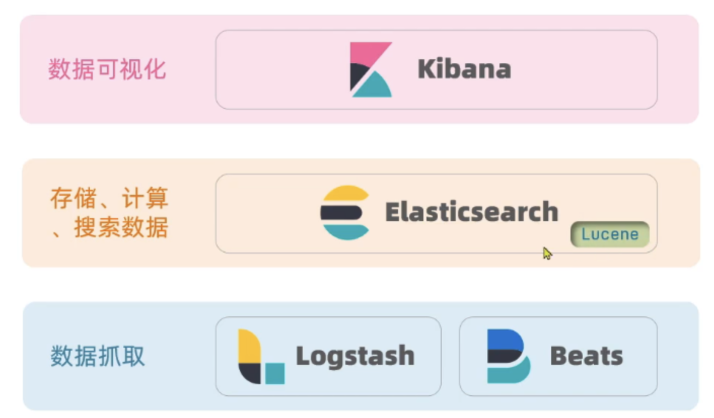
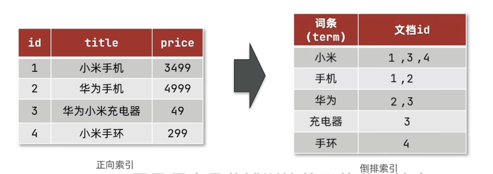
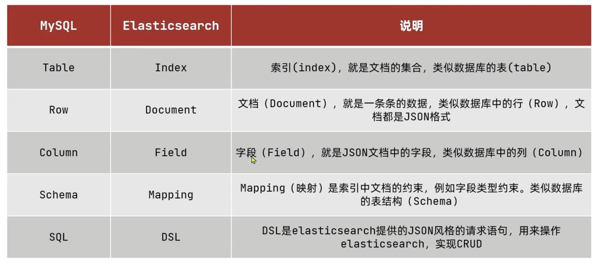

# ES学习

## Elasticsearch简介

Elasticsearch是一个分布式查询引擎，可以在海量数据以及复杂的查询条件中有良好的性能。elasticsearch结合kibana、Logstash组成了elastic stack：

elasticsearch负责数据的存储，检索和分析。

kibana提供了数据的可视化。

Logstash提供了数据的抓取功能，即将数据按照自定义格式写入es中。

## 正向索引和倒排索引

传统数据库（例如mysql）使用的索引就是**正向索引**，即将正排索引是按照数据的内容进行排序，数据的存储结构可以有b树、b+树。**缺点是如果进行模糊查询时效率比较低**。

es使用的是**倒排索引**，倒排索引中会用到**词条**以及**文档**：

- 文档：每行记录就是一个文档

- 词条：将指定的索引的内容按照语句分成一个个词语

## ES和mysql的区别

MySql：擅长事务类型操作，可以确保数据的安全和一致性

Elasticsearch：擅长海量数据的搜索、分析、计算

## mapping

mapping是对索引库中文档的约束，常见的mapping属性包括：

- type：字段数据类型，常见的简单类型有：
  字符串：text(可分词的文本)、keyword(精确值，不进行分词）
  数值：long、integer、.short、byte、double、foat
  布尔：boolean
  日期：date
  对象：obiect

- index：是否创建索引，默认true

- analyzer：使用哪种分词器

- properties：该字段的子字段

## 分词器

es在创建倒排索引时需要对索引分词；在搜索时，需要对用户输入内容分词。但默认的分词规则对中文处理并不友好，此时可以使用**IK分词器**。

DSL

Elasticsearch提供了基于JSON的DSL（Domain Specific Language）来定义查询。常⻅的查询类型包括：

查询所有：查询出所有数据，⼀般测试⽤。例如：match_all

全⽂检索（full text）查询：利⽤分词器对⽤户输⼊内容分词，然后去倒排索引库中匹配。例如：

match_query

multi_match_query

精确查询：根据精确词条值查找数据，⼀般是查找keyword、数值、⽇期、boolean等类型字段。例如：ids，range，term

地理（geo）查询：根据经纬度查询。例如 geo_distance geo_bounding_box

**复合（compound）查询：**复合查询可以将上述各种查询条件组合起来，合并查询条件。例如：bool,function_score
