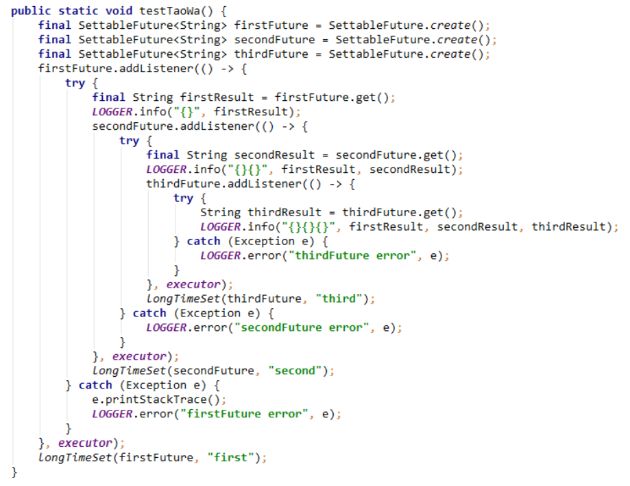
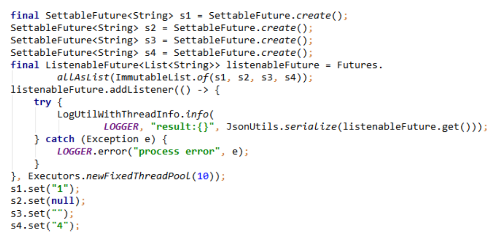
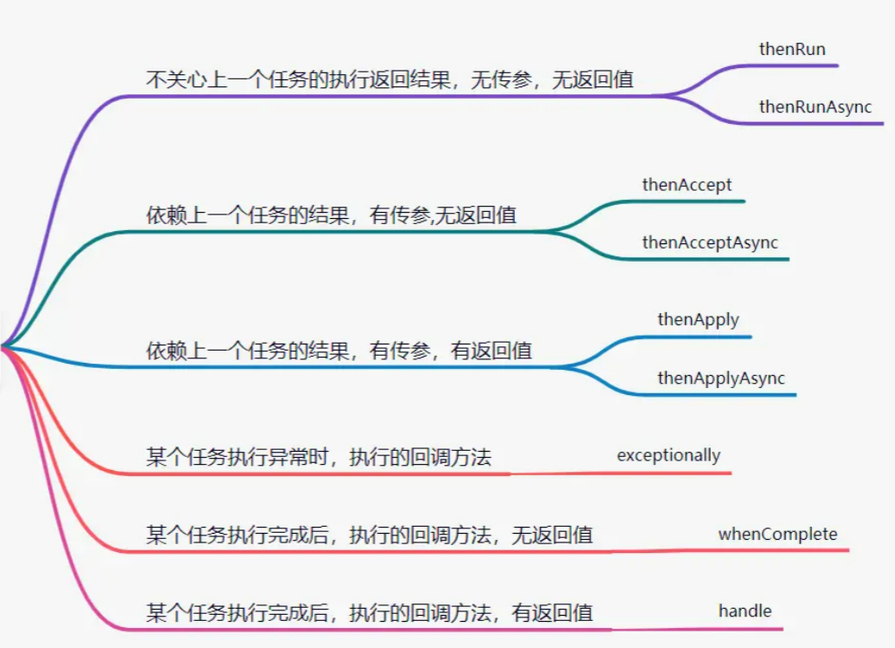
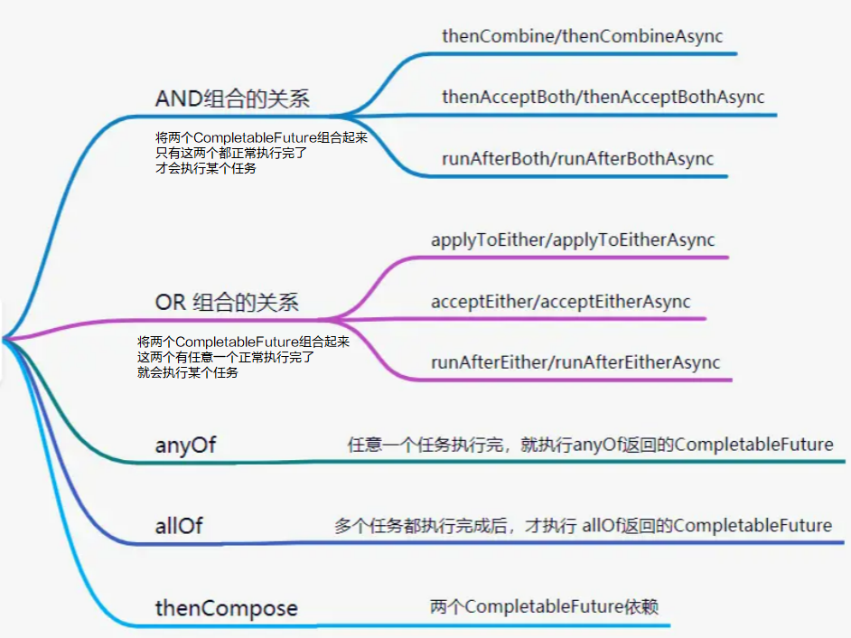

# Future

## 同步、异步与阻塞、非阻塞

根据**进程等待函数调用时的状态**，函数可以分为阻塞和非阻塞：

- 阻塞：在得到函数返回值之前，该进程处于==挂起==状态，不会占用CPU资源。
- 非阻塞：进程调用函数之后，无论是否返回结果，进程都会继续运行，进程仍处于可运行状态。

根据**进程和函数之间的通信机制**，函数可以分为异步和同步。

- 同步：进程调用函数后，需要等待函数执行完成之后，才可以往下继续进行。
- 异步：进程调用函数后，函数会直接返回收到，等到处理完成，函数会通过回调或通知的方式，将结果发送给进程。

---

阻塞、非阻塞与同步、异步两两组合之后，函数的调用机制如下：

- **同步阻塞**：进程调用函数后，进程需要等待函数的返回值，在等待的时候，该进程处于挂起状态，当函数返回之后，系统切换为内核态，将该进程改变为就绪态，等待CPU调度。

  ```java
  int a = aObject.getA();
  // do something
  ```

- **异步阻塞**：和同步类似，但进程只需等待函数返回收到，即可将进程转换为可运行状态，进程和函数约好使用回调或通知方式进行通信，等到处理完成，函数通过约好的方式将结果发送给进程。

  ```java
  FutureTask<String> future = task();
  executorService.execute(future); // 不用等待execute执行完
  // do something
  String s = future.get(); // 如果执行完则不用阻塞，否则阻塞等待结果
  System.out.println(s);
  ```

- **同步非阻塞**：进程调用函数后，进程会继续运行，但由于函数在没有执行完成之前没有返回值，进程只能通过轮询进程或函数共享资源的方式来知道函数是否完成。

  ```java
  while(true){
      // 等待某个条件成立才往下执行，否则继续while
      if(XXX == null){
          continue;
      }
      // do something
  }
  ```

- **异步非阻塞**：进程调用函数后，进程会继续运行，进程和函数约好使用回调或通知方式进行通信，等到处理完成，函数通过约好的方式将结果发送给进程。


## Future模式

Future模式是异步阻塞的，它得到这个返回结果后并不急于对其进行处理而是调用其他业务逻辑，当之后需要用到返回结果时才去获取。

它有个具体的实现类：`FuntureTask`类。

`Future`接口提供了一些操作方法：

```java
// 取消任务
public boolean cancel(boolean mayInterruptIfRunning);
// 是否已经取消
public boolean isCancelled();
// 是否已经完成
public boolean isDone();
// 取得返回对象
public V get() throws InterruptedException, ExecutionException;
// 取得返回结果，如果超时时间则不继续等待
public V get(long timeout, TimeUnit unit);
```

例子：

```java
public class futureTask {

    public static void main(String[] args) throws ExecutionException, InterruptedException {
        
        ExecutorService executorService = Executors.newFixedThreadPool(5);
        FutureTask<String> future = task();
        executorService.execute(future);
        // do something
        String s = future.get();
        System.out.println(s);
    }

    static FutureTask<String> task(){
        return new FutureTask<>(()-> "aaa");
    }
}
```


## ListenableFuture

Future要获取异步任务执行的结果，需要通过轮询或者阻塞等待的方式，这样的方式不太“完美”，比较好的做法应该是异步执行结束后，通知用户异步任务结束了，你可以通过Future来获取执行结果了。

guava的ListenableFuture中添加了监听器，可以帮我们检测Future是否完成了，如果完成了就自动调用监听器中的回调函数，这样可以减少并发程序的复杂度。

```java
ExecutorService executors = Executors.newFixedThreadPool(5);
ListenableFutureTask<String> future = lFuturetask();
executors.execute(future);
// 添加监听器去获取返回值，就不用进行阻塞了
future.addListener(()->{
    try {
        System.out.println(future.get());
    } catch (InterruptedException | ExecutionException e) {
        e.printStackTrace();
    }
}, MoreExecutors.directExecutor());
```


**串联**

当有多个任务需要按照顺序依次执行，且每个任务都需要依赖上一个任务的结果，此时需要对多个listener进行串联：




**并联** 

当有多个任务需要按照一起执行，但是不要求顺序，此时需要对多个listener进行并联：




## CompletableFuture

CompletableFuture是java8中添加的一个类，其结合了Future的优点，提供了非常强大的Future的扩展功能，简化了异步编程的复杂性，提供了函数式编程的能力，可以通过回调的方式处理计算结果，并且提供了转换和组合CompletableFuture的方法。

使用场景有：

- 创建异步任务
- 简单异步回调
- 多个任务组合（串联/并联）


### 创建异步任务

CompletableFuture创建异步任务，一般有supplyAsync和runAsync两个方法：

- supplyAsync：有返回值
- runAsync：无返回值

```java
public class FutureTest {
    public static void main(String[] args) {
        // 可以自定义线程池
        ExecutorService executor = Executors.newCachedThreadPool();
        // runAsync的使用
        CompletableFuture<Void> runFuture = CompletableFuture.runAsync(() -> System.out.println("runAsync"),executor);
        // supplyAsync的使用
        CompletableFuture<String> supplyFuture = CompletableFuture.supplyAsync(() -> "supplyAsync", executor);
        // runAsync的future没有返回值，输出null
        System.out.println(runFuture.join());
        // supplyAsync的future，有返回值
        System.out.println(supplyFuture.join());
        executor.shutdown(); // 线程池需要关闭
    }
}
//输出
runAsync
null
supplyAsync
```


### 简单异步回调



**tips**：有Async跟没有Async的区别是：没有Async的方法是跟前面的方法公用一个线程池（如果没有则使用默认的线程池），有Async的方法可以使用指定的线程池。


**串联**

```java
public class FutureThenRunTest {
    public static void main(String[] args) throws ExecutionException, InterruptedException {
        CompletableFuture<String> future = CompletableFuture
       .supplyAsync(()->{
           System.out.println("one");
           return "one";
        }, executor)
       .thenApply((s) -> {
           System.out.println(s + "two");
           return s+"two";
        })
        .whenComplete((s, throwable) -> {
            if(throwable == null){
                System.out.println("s为上个任务的返回值："+s);
            }
        })
        System.out.println("future.get()获取的是最后一个任务的返回值："+future.get());
    }
}
// 输出
one
onetwo
s为上个任务的返回值：eonetwo
future.get()获取的是最后一个任务的返回值：onetwo
```


**并联**

```java
private static void binglian() throws ExecutionException, InterruptedException {
    CompletableFuture<String> one = CompletableFuture.supplyAsync(()->{
        System.out.println("111");
        return "111";
    });
    CompletableFuture<String> two = CompletableFuture.supplyAsync(()->{
        System.out.println("222");
        return "222";
    });
    CompletableFuture<String> three = CompletableFuture.supplyAsync(()->{
        System.out.println("333");
        return "333";
    });
    // 将三个任务并联在一起
    CompletableFuture
            .allOf(one, two, three)
            .whenCompleteAsync((s, throwable)-> {
                System.out.println("s："+s);
                try {
                    System.out.println("one：" + one.get());
                    System.out.println("two：" + two.get());
                    System.out.println("three：" + three.get());
                } catch (InterruptedException | ExecutionException e) {
                    e.printStackTrace();
                }
            }，executor);
    executor.shutdown();
}
```


### 多个任务组合处理



```java
public class ThenCombineTest {

    public static void main(String[] args) throws InterruptedException, ExecutionException, TimeoutException {

        CompletableFuture<String> first = CompletableFuture.completedFuture("第一个异步任务");
        ExecutorService executor = Executors.newFixedThreadPool(10);
        CompletableFuture<String> future = CompletableFuture
                .supplyAsync(() -> "第二个异步任务", executor)
                .thenCombineAsync(first, (s, w) -> {
                    System.out.println(w);
                    System.out.println(s);
                    return "两个异步任务的组合";
                }, executor);
        System.out.println(future.join());
        executor.shutdown();

    }
}
//输出
第一个异步任务
第二个异步任务
两个异步任务的组合
```


## CompletableFuture注意点

1. Future获取返回值时才能获取异常信息，如果不使用 `get()/join()`方法，看不到异常信息。
2. CompletableFuture的`get()`方法是阻塞的，如果使用它来获取异步调用的返回值，需要添加超时时间。
3. CompletableFuture代码中使用的默认线程池，处理的线程个数是`电脑CPU核数-1`。在大量请求过来的时候，处理逻辑复杂的话，响应会很慢。一般建议使用自定义线程池，优化线程池配置参数。
4. 当使用自定义线程池时，注意饱和策略，防止任务丢失。


