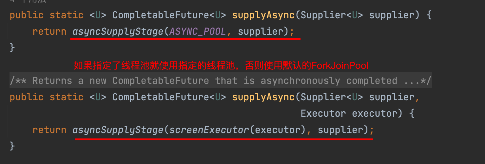

# 异步知识学习

疑问1：异步任务是并发执行还是并行执行？

- 如果是单核CPU，那么异步任务之间是并发执行的；如果是多核CPU，则异步任务就可能是并行执行的。

疑问2：执行异步任务，如果get超时了异步任务就结束了吗？

- 异步任务会一直执行直到结束，即使你使用get(1, TimeUint.Seconds)；如果任务需要执行两秒，那么1秒的时候主线程就不会继续等待了，但此时异步任务仍然会继续执行。所以异步任务是不受控制的，会浪费不必要的资源，并不是越多越好。

## Future模式

Future模式是异步阻塞的，它得到这个返回结果后并不急于对其进行处理而是调用其他业务逻辑，当之后需要用到返回结果时才去获取。

它有个具体的实现类：`FuntureTask`类。

`Future`接口提供了一些操作方法：

```java
// 取消任务
public boolean cancel(boolean mayInterruptIfRunning);
// 是否已经取消
public boolean isCancelled();
// 是否已经完成
public boolean isDone();
// 取得返回对象
public V get() throws InterruptedException, ExecutionException;
// 取得返回结果，如果超时时间则不继续等待
public V get(long timeout, TimeUnit unit);
```

例子：

```java
public class futureTask {

    public static void main(String[] args) throws ExecutionException, InterruptedException {

        ExecutorService executorService = Executors.newFixedThreadPool(5);
        FutureTask<String> future = task();
        executorService.execute(future);
        // do something
        String s = future.get();
        System.out.println(s);
    }

    static FutureTask<String> task(){
        return new FutureTask<>(()-> "aaa");
    }
}
```

## ListenableFuture

Future要获取异步任务执行的结果，需要通过轮询或者阻塞等待的方式，这样的方式不太“完美”，比较好的做法应该是异步执行结束后，通知用户异步任务结束了，你可以通过Future来获取执行结果了。

guava的ListenableFuture中添加了监听器，可以帮我们检测Future是否完成了，如果完成了就自动调用监听器中的回调函数，这样可以减少并发程序的复杂度。

```java
ExecutorService executors = Executors.newFixedThreadPool(5);
ListenableFutureTask<String> future = lFuturetask();
executors.execute(future);
// 添加监听器去获取返回值，就不用进行阻塞了
future.addListener(()->{
    try {
        System.out.println(future.get());
    } catch (InterruptedException | ExecutionException e) {
        e.printStackTrace();
    }
}, MoreExecutors.directExecutor());
```

**串联**

当有多个任务需要按照顺序依次执行，且每个任务都需要依赖上一个任务的结果，此时需要对多个listener进行串联：


**并联** 

当有多个任务需要按照一起执行，但是不要求顺序，此时需要对多个listener进行并联：


## CompletableFuture

CompletableFuture是java8中添加的一个类，其结合了Future的优点，提供了非常强大的Future的扩展功能，简化了异步编程的复杂性，提供了函数式编程的能力，可以通过回调的方式处理计算结果，并且提供了转换和组合CompletableFuture的方法。

使用场景有：

- 创建异步任务
- 简单异步回调
- 多个任务组合（串联/并联）

### 创建异步任务

CompletableFuture创建异步任务，一般有supplyAsync和runAsync两个方法：

- supplyAsync：有返回值
- runAsync：无返回值

```java
public class FutureTest {
    public static void main(String[] args) {
        // 可以自定义线程池
        ExecutorService executor = Executors.newCachedThreadPool();
        // runAsync的使用
        CompletableFuture<Void> runFuture = CompletableFuture.runAsync(() -> System.out.println("runAsync"),executor);
        // supplyAsync的使用
        CompletableFuture<String> supplyFuture = CompletableFuture.supplyAsync(() -> "supplyAsync", executor);
        // runAsync的future没有返回值，输出null
        System.out.println(runFuture.join());
        // supplyAsync的future，有返回值
        System.out.println(supplyFuture.join());
        executor.shutdown(); // 线程池需要关闭
    }
}
//输出
runAsync
null
supplyAsync
```

### 简单异步回调


**tips**：有Async跟没有Async的区别是：没有Async表明当前任务是跟前面的异步任务共用一个线程池（如果没有则使用默认的线程池），有Async的可以使用指定的线程池，表明当前任务单独使用这个指定的线程池。

**串联**

```java
public class FutureThenRunTest {
    public static void main(String[] args) throws ExecutionException, InterruptedException {
        CompletableFuture<String> future = CompletableFuture
       .supplyAsync(()->{
           System.out.println("one");
           return "one";
        }, executor)
       .thenApply((s) -> {
           System.out.println(s + "two");
           return s+"two";
        })
        .whenComplete((s, throwable) -> {
            if(throwable == null){
                System.out.println("s为上个任务的返回值："+s);
            }
        })
        System.out.println("future.get()获取的是最后一个任务的返回值："+future.get());
    }
}
// 输出
one
onetwo
s为上个任务的返回值：eonetwo
future.get()获取的是最后一个任务的返回值：onetwo
```

**并联**

```java
private static void binglian() throws ExecutionException, InterruptedException {
    CompletableFuture<String> one = CompletableFuture.supplyAsync(()->{
        System.out.println("111");
        return "111";
    });
    CompletableFuture<String> two = CompletableFuture.supplyAsync(()->{
        System.out.println("222");
        return "222";
    });
    CompletableFuture<String> three = CompletableFuture.supplyAsync(()->{
        System.out.println("333");
        return "333";
    });
    // 将三个任务并联在一起
    CompletableFuture
            .allOf(one, two, three)
            .whenCompleteAsync((s, throwable)-> {
                System.out.println("s："+s);
                try {
                    System.out.println("one：" + one.get());
                    System.out.println("two：" + two.get());
                    System.out.println("three：" + three.get());
                } catch (InterruptedException | ExecutionException e) {
                    e.printStackTrace();
                }
            }，executor);
    executor.shutdown();
}
```

### 多个任务组合处理


```java
public class ThenCombineTest {

    public static void main(String[] args) throws InterruptedException, ExecutionException, TimeoutException {

        CompletableFuture<String> first = CompletableFuture.completedFuture("第一个异步任务");
        ExecutorService executor = Executors.newFixedThreadPool(10);
        CompletableFuture<String> future = CompletableFuture
                .supplyAsync(() -> "第二个异步任务", executor)
                .thenCombineAsync(first, (s, w) -> {
                    System.out.println(w);
                    System.out.println(s);
                    return "两个异步任务的组合";
                }, executor);
        System.out.println(future.join());
        executor.shutdown();

    }
}
//输出
第一个异步任务
第二个异步任务
两个异步任务的组合
```

## CompletableFuture注意点

1. Future获取返回值时才能获取异常信息，如果不使用 `get()/join()`方法，看不到异常信息。
2. CompletableFuture的`get()`方法是阻塞的，如果使用它来获取异步调用的返回值，需要添加超时时间。
3. CompletableFuture代码中使用的默认线程池，处理的线程个数是`电脑CPU核数-1`。在大量请求过来的时候，处理逻辑复杂的话，响应会很慢。一般建议使用自定义线程池，优化线程池配置参数。
4. 当使用自定义线程池时，注意饱和策略，防止任务丢失。

## 如何合理的设置线程池中的线程数

问题1：IO密集型任务和CPU密集型任务的区别？ 

- CPU密集型也叫计算密集型，此时，系统运行时大部分的状况是CPU占用率近乎100%，IO在很短的时间就可以完成，而CPU还有许多运算要处理，CPU 使用率很高。比如说要计算1+2+3+..+ 10万亿、天文计算、圆周率后几十位等，都是属于CPU密集型程序。 CPU密集型任务的特点：大量计算，CPU占用率一般都很高，IO时间很短。

- IO密集型指大部分的状况是CPU在等IO（硬盘/内存） 的读写操作，但CPU的使用率不高。 简单的说，就是需要大量的输入输出，例如读写文件、传输文件、网络请求。 IO密集型任务的特点：大量网络请求，文件操作，CPU运算少，很多时候CPU在等待资源才能进一步操作。 

问题2：既然要控制线程池的数量，多少合适呢？ (以下Ncpu 表示核心数)

- 如果是CPU密集型任务，就需要尽量压榨CPU，参考值可以设为 **Ncpu+1**

- 如果是IO密集型任务，参考值可以设置为**2 * Ncpu**

## get超时和orTimeout的区别与使用场景

`CompletableFuture.get(1, TimeUnit.MILLISECONDS)` 和 `CompletableFuture.orTimeout(1, TimeUnit.MILLISECONDS)` 都是 Java 中 `CompletableFuture` 类的方法，用于实现任务超时机制。它们的具体应用场景如下：

1. `CompletableFuture.get(timeout, unit)` 的使用场景
   
   `CompletableFuture.get(timeout, unit)` 方法用于获取 `CompletableFuture` 的执行结果，如果执行时间超过了指定的 timeout 时间，方法将抛出 `TimeoutException` 异常。因此，**适用于需要等待任务执行结果的场景**，并且希望在一定时间内获取到任务执行结果的情况。
   
   例如，在网络请求中，我们希望在一定时间内获得请求结果，如果超时，则抛出异常：
   
   ```java
   Executor executor = Executors.newFixedThreadPool(10);
   CompletableFuture<String> future = CompletableFuture.supplyAsync(() -> {
       // 模拟网络请求
       try {
           Thread.sleep(2000L);
       } catch (InterruptedException e) {
           e.printStackTrace();
       }
       return "result";
   }, executor);
   
   try {
       String result = future.get(1, TimeUnit.SECONDS);
   } catch (InterruptedException | ExecutionException | TimeoutException e) {
       System.out.println("请求超时");
       future.cancel(true);
   }
   ```
   
   在这个例子中，我们使用 `get()` 方法等待异步任务的执行结果，并设置了 1 秒时间限制，如果超时则抛出 `TimeoutException` 异常。

2. `CompletableFuture.orTimeout(timeout, unit)` 的使用场景
   
   `CompletableFuture.orTimeout(timeout, unit)` 方法用于设置 `CompletableFuture` 的执行超时时间，如果执行时间超过了指定的 timeout 时间，它会以特定的异常来取消执行，并且返回一个新的 `CompletableFuture` 对象，以前的操作不会进行任何修改。因此，**适用于超时就不再等待的情况**，例如，通过发送异步消息通知其他系统进行异步处理，不需要等待异步操作完成，只需要在特定时间内通知即可：
   
   ```java
   Executor executor = Executors.newFixedThreadPool(10);
   CompletableFuture<Void> future = CompletableFuture.runAsync(() -> {
       // 发送异步消息
       try {
           Thread.sleep(2000L);
       } catch (InterruptedException e) {
           e.printStackTrace();
       }
       System.out.println("消息已发送");
   }, executor);
   
   CompletableFuture<Void> newFuture = future.orTimeout(1, TimeUnit.SECONDS);
   newFuture.whenComplete((result, exception) -> {
       if (exception != null) {
           System.out.println("消息发送失败");
       } else {
           System.out.println("消息发送成功");
       }
   });
   ```
   
   在这个例子中，我们使用 `orTimeout()` 方法设置了异步操作的超时时间为 1 秒，在超时后会取消异步操作，并返回新的 `CompletableFuture` 对象

# 原理解析

## CompletableFuture结构

```java
public class CompletableFuture<T> implements Future<T>, CompletionStage<T> {
    volatile Object result; // 执行的结果或者异常
    volatile Completion stack; // 链表模拟栈操作，保存了所有依赖这个future的后续动作

    // 使用cas+自旋 将后续需要执行的CompletableFuture放在链表的头部，即模拟入栈
    final void pushStack(Completion c) {
        do {} while (!tryPushStack(c));
    }    

    final boolean tryPushStack(Completion c) {
        Completion h = stack;
        NEXT.set(c, h);
        return STACK.compareAndSet(this, h, c);
    }

    // 当前CompletableFuture执行完之后需要处理stack中CompletableFuture
    final void postComplete() {
        CompletableFuture<?> f = this; Completion h;
        while ((h = f.stack) != null ||
               (f != this && (h = (f = this).stack) != null)) {
            CompletableFuture<?> d; Completion t;
            if (STACK.compareAndSet(f, h, t = h.next)) {
                if (t != null) {
                    if (f != this) {
                        pushStack(h);
                        continue;
                    }
                    NEXT.compareAndSet(h, t, null); // try to detach
                }
                f = (d = h.tryFire(NESTED)) == null ? this : d;
            }
        }
    }

    // 内部类，当CompletableFuture执行出错时会将错误信息封装成AltResult对象，并赋值给result
    static final class AltResult {
        final Throwable ex;
        AltResult(Throwable x) { this.ex = x; }
    }
}
```

## supplyAsync源码阅读

这里主要介绍supplyAsync的源码阅读，其他runAsync的源码跟supplyAsync差不多，可以说CompletableFuture每个阶段的整体执行步骤是差不多的，类似于模版方法+策略，具体的执行步骤由子类决定。

首先看CompletableFuture的创建

```java
CompletableFuture.supplyAsync(() -> {
     try {
        Thread.sleep(1000000);
     } catch (InterruptedException e) {
         throw new RuntimeException(e);
     }
     return "a";
});
```



由上可知，supplyAsync使用了Supplier函数式接口提供参数给CompletableFuture，后续会看到CompletableFuture使用了所有类型的函数式接口，这些类型的函数式接口都可以通过CompletableFuture对应的api的名字推断。

```java
static <U> CompletableFuture<U> asyncSupplyStage(Executor e,
                                                 Supplier<U> f) {
    if (f == null) throw new NullPointerException();
    // 创建一个新的CompletableFuture作为返回结果
    CompletableFuture<U> d = new CompletableFuture<U>();
    // 封装成AsyncSupply对象并丢到指定的线程池中执行
    // AsyncSupply本质是一个Runnable，所以得看下AsyncSupply的run方法做了什么
    e.execute(new AsyncSupply<U>(d, f));
    return d;
}
```

> supplyAsync方法会将参数封装成AsyncSupply对象，runAsync会将参数封装成AsyncRun对象，CompletableFuture里面有许多方法都是类似这样命名的。

```java
static final class AsyncSupply<T> extends ForkJoinTask<Void> implements Runnable, AsynchronousCompletionTask {
        CompletableFuture<T> dep; Supplier<? extends T> fn;

        AsyncSupply(CompletableFuture<T> dep, Supplier<? extends T> fn) {
            this.dep = dep; this.fn = fn;
        }

        public final Void getRawResult() { return null; }
        public final void setRawResult(Void v) {}
        public final boolean exec() { run(); return false; }

        public void run() {
            CompletableFuture<T> d; Supplier<? extends T> f;
            if ((d = dep) != null && (f = fn) != null) {
                dep = null; fn = null;
                // 如果还没有结果则执行
                if (d.result == null) {
                    try {
                        // 使用Supplier的返回值作为CompletableFuture的结果
                        d.completeValue(f.get());
                    } catch (Throwable ex) {
                        // 如果出错则将错误作为结果
                        d.completeThrowable(ex);
                    }
                }
                // 完成当前CompletableFuture的后置操作，例如后续还有CompletableFuture会在此执行
                d.postComplete();
            }
        }
    }
```

CompletableFuture.supplyAsync里会先创建一个空的CompletableFuture对象作为返回结果，然后把任务跟这个CompletableFuture对象跟绑定后放在线程池中异步执行，然后直接返回空的CompletableFuture对象，此时任务继续运行，当任务运行完成之后会将结果写入到原先的CompletableFuture对象的result字段中。


## thenAccept源码阅读

知道了supplyAsync的原理之后再看看CompletableFuture的链式调用是什么样的。

```java
CompletableFuture.supplyAsync(() -> {
     try {
        Thread.sleep(1000000);
     } catch (InterruptedException e) {
         throw new RuntimeException(e);
     }
     return "a";
})
.thenAccept((res) -> {
    log.info("supplyAsync result is " + res);
})
.thenRun(() -> {
    log.info("this is thenRun");
});
```

直接进入：

```java
public CompletableFuture<Void> thenAccept(Consumer<? super T> action) {
    return uniAcceptStage(null, action);
}
```


## 执行链路

代码1：futureChain相当于一个整体，这一个整体会先执行supplyAsync，再执行thenAccept，最后thenRun。

```java
CompletableFuture<Void> futureChain = CompletableFuture.supplyAsync(() -> "test CompletableFuture.")
  .thenAccept(System.out::println)
  .thenRun(() -> {});
```

代码2：futureChain相当于三个整体，先执行supplyAsync的整条链，再执行thenAccept整条链，最后thenRun。

```java
CompletableFuture<String> futureChains = CompletableFuture.supplyAsync(() -> "test CompletableFuture.");
futureChains.thenAccept(System.out::println);
futureChains.thenRun(() -> {});
```

代码3：futureChains相当于两个整体，第一个整体先执行supplyAsync跟thenAccept，第二个整体执行thenRun。

```java
CompletableFuture<Void> futureChains = CompletableFuture.supplyAsync(() -> "test CompletableFuture.")
  .thenAccept(System.out::println);

futureChains.thenRun(() -> { });
```

## 源码解析
