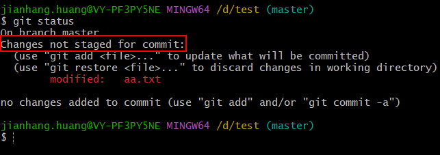
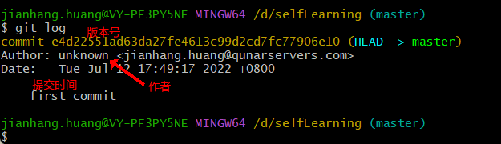

# Git学习

## Git简介

Git是一个开源的**分布式版本控制**系统，可以有效、高速的处理项目版本的管理。

> 什么是 **版本控制** ?
>
> 版本控制是一种记录一个或若干文件内容变化，以便将来查阅特定版本修订情况的系统。 除了项目源代码，你可以对任何类型的文件进行版本控制。

版本控制分为集中式跟分布式，集中式版本控制常见的就是svn。git与svn二者的区别：

- 存储方式的不同：SVN存储的是每个文件的变化，而git存储的是完整的文件快照。当需要频繁对分支或者版本进行操作时，svn的效率会很慢。
- 与服务器通讯的不同：SVN的操作都需要与服务器通讯，而git的操作很多都可以在本地完成。当服务器不稳定时，svn将无法进行版本控制。
- 版本号的不同：svn采用递增的编号作为版本号，而git是使用SHA-1 hash算法对文件内容进行计算，生成一个版本号。


## 集中式和分布式版本控制的区别

集中式版本控制系统：版本库集中的存放于中央服务器。每次操作都要先去中央服务器里获取最新的版本，操作完之后再将自己的版本上传到中央服务器。当没网或者服务器宕机时将无法进行操作。

分布式版本控制系统：该系统中没有绝对的中央服务器，每个人的电脑上都有一个本地仓库，使用的时候不需要联网。当多人合作时，只需要利用一个中间服务器就可以进行多人一起操作。


## 工作区、缓存区、本地仓库和远程仓库的理解

工作区：`.git`文件夹所在的目录就是工作区，也就是`git init`命令时所在的目录。

缓存区：存在于`.git`文件夹里，用于暂时存放文件版本内容的地方，称为stage。

本地仓库：即`.git`文件夹，存放文件版本内容的地方，可以与远程仓库进行交互。

远程仓库：在服务器中存放版本内容的地方。


工作区又可以细分为：未缓存区（修改但未add）跟原区。


## HEAD的理解

有一个名为 HEAD 的指针，它会出现在一些命令里面，那它代表着什么呢？它指向了你当前工作分支。当切换分支时，HEAD的指向就会改变。


## Git安装

[windows下git镜像下载链接](https://registry.npmmirror.com/binary.html?path=git-for-windows/) ，下载exe后傻瓜式安装即可。


## Git常用命令

### git init

- `git init`：创建一个空的本地仓库或者重新初始化一个已经存在的本地仓库.

如何判断已经形成一个本地仓库？在该文件夹下存在一个**.git文件夹**。

.git文件夹里面存放的就是版本库。


### git add

git add命令的作用是将指定文件的内容添加到缓存区中。

- `git add 文件名1.后缀 文件名2.后缀...`：将工作区指定的内容提交到暂存区。
- `git add . `： 将当前 目录下的所有文件添加到暂存区
- `git add 文件夹名称`：将指定目录添加到暂存区，包括子目录


### git commit

- `git commit -m "提交备注"`：将暂存区的内容提交到本地仓库
- `git commit -am "备注"`：等价于add命令+commit命令 

> 一个简单的操作步骤：
>
> 1. git init - 初始化仓库。
> 2. git add . - 添加文件到暂存区。
> 3. git commit - 将暂存区内容添加到仓库中


### git diff

- `git diff`：显示**工作区域跟暂存区域**之间所有文件的差别。
  - `git diff --cached`：显示**暂存区域跟本地仓库**之间所有文件的差别。
  - `git diff 版本1 版本2`：显示**工作区域跟暂存区域**之间版本1对于版本2的差异。
  - `git diff 分支1 分支2`：显示**工作区域跟暂存区域**之间分支1对于分支2的差异。


### git status

`git status`：查看工作区域的当前状态。

比如执行add命令，但还未commit到本地仓库




### git log

`git log`：记录提交操作的日志（仅仅只包含提交操作）。远程仓库跟本地仓库都保存一份，每次提交都会同步提交日志。




### git reflog

`git reflog`：记录所有分支的所有操作的日志（包含所有操作）。只存在于本地仓库。


### git branch

git branch命令用于管理分支。

- `git branch`：查看所有分支的名称（以*标注且颜色加深的分支为当前所在分支）。
- `git branch -v`：查看所有分支的详细信息，包括分支名称、版本号、提交的备注信息。
- `git branch -d 分支名`：删除指定分支


### git checkout

git checkout命令用于切换分支和撤销工作区中的文件。

- `git checkout -b 分支`：创建分支并立即切换到该分支上。
- `git checkout 分支`：切换到指定分支
- `git checkout -- 文件名 `：将工作区中指定的文件内容退回到缓存区中该文件的当前版本的内容。
- `git checkout HEAD 文件名 `：同上。
- `git checkout HEAD~ 文件名 `：退回到缓存区中上一个版本。
- `git checkout HEAD~n 文件名 `：退回到缓存区中上n个版本。
- `git checkout 版本号 文件名 `：退回到缓存区中指定版本。

**tips**：凡是可以使用HEAD或者HEAD~n的地方都可以指定版本号。


### git push

- `git push`：将本地仓库的内容推送到远程仓库
  - `git push -u 远程仓库别名 分支名`：将指定分支与远程仓库进行绑定并推送内容（第一次提交到远程仓库时需要加上**-u**参数）。
  - `git push 远程仓库别名 分支名`：无-u参数，表示将指定分支上内容推送到远程仓库。


### git remote

git remote命令用于管理跟远程仓库的操作

- `git remote -v `：查看相关联的远程仓库详情信息。

- `git remote add 别名 远程仓库地址`：关联一个远程仓库，以后操作该远程仓库时使用别名即可。关联了远程仓库之后才可以将本地仓库的内容推送到远程仓库。

  ```bash
  git remote add origin 远程仓库地址
  # 将orgin重命名为o
  git remote rename origin o
  # 删除与该远程仓库的连接
  git remote remove o
  ```

**tips**：仓库地址可以是HTTP的，也可以是SSH的（如下图）。如果使用HTTP，则需要每次操作使用到你的账号密码。如果使用SSH，则需要先在远程仓库中添加你本机的密钥，然后每次操作都可以直接进行。


### git clone

`git clone 远程仓库的地址`：克隆远程仓库的内容到本地目录。


### git merge

- `git merge 分支`：将指定分支的内容合并到**当前分支**。
  - `git merge --abort 分支`：取消冲突合并，回到合并前的状态。
  - 解决冲突：当远程仓库的版本与本地仓库当前的版本不同且改动的部分是相同的，此时会出现冲突。


### git fetch

- `git fetch`：拉取远程仓库到本地仓库。


### git pull

- `git pull`：拉取远程仓库到本地仓库并合并到本地分支（git fetch + git merge）。


### git config

`git config`：修改git配置信息

- `git config --add user.name 用户名`：设置当前作者的名称
- `git config --add user.email 邮箱`：设置当前作者的邮箱


### git reset

git reset命令可以回退版本，可以指定退回某一次提交的版本

- `git reset`：将工作区的内容回退到缓存区中的内容。
- `git reset HEAD~` 或 `git reset --mixed HEAD~`：在本地仓库中将当前提交指向上一次提交，并将上一次提交的内容拷贝到缓存区（工作区不会改变）。
- `git reset --hard HEAD~`： 在本地仓库中将当前提交指向上一次提交，并将上一次提交的内容拷贝到缓存区和工作区。
- `git reset --hard 版本号`： 在本地仓库中将当前提交指向指定版本的提交，并将指定版本的提交的内容拷贝到缓存区和工作区。
- `git reset --soft HEAD~`：在本地仓库中将当前提交指向上一次提交。（工作区和缓存区都不会改变）

**tips**：使用了reset命令之后，指定回退版本之后的提交的版本都会被清除，除非加上soft参数。


### git revert

git revert命令用于撤销一些已经存在的提交。此操作后会被当成一次提交，生成一个版本号。

- `git revert 版本号`：撤销指定版本号的提交。
  - 与`git reset --hard 版本号` 的区别：reset 命令不会生成一个版本号，并且在指定版本之后提交的版本都会被清楚。


### git cherry-pick

git cherry-pick命令用于把某次提交的内容合并到当前分支。

- `git cherry-pick 版本号`：将指定版本的内容合并到当前分支。

与git merge的区别，git merge会将所有提交的内容都合并到当前分支，而 git cherry-pick只会将指定版本的内容合并到当前分支。


## Git远程仓库交互

> 在跟远程仓库交互的前提，需要使用到你的账号密码或者本机生成的密钥，远程仓库才可以知道你的身份。

### 添加密钥

1. `ssh-keygen -t rsa -C "你的邮箱地址"`创建公钥，一直回车即可。
2. `cat ~/.ssh/id_rsa.pub` 查看公钥（windows的话，需要进入C盘的用户目录找到.ssh文件夹进去就可以看到）。
3. 进入代码管理平台，比如github或gitlab。
3. 点击“Add SSH Key”，然后把刚才ssh公钥`id_rsa.pub`的内容拷贝进去。不需要填title，title会自动生成。
3. 添加完密钥之后才可以使用clone命令。

> 如果不想使用密钥的方式拉取远程仓库的内容，可以使用HTTPS的方式：如下图。
>
> 


