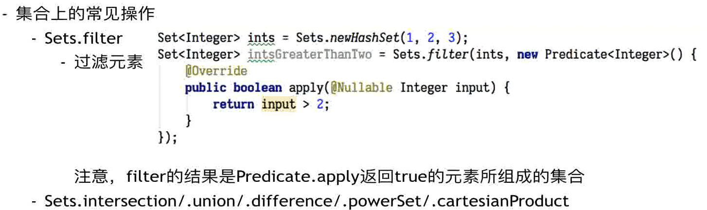
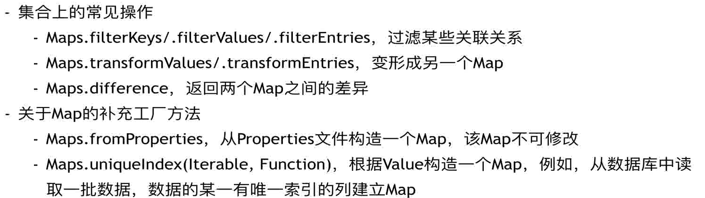

Guava学习
=========

**Guava**是由Google开发的基于Java的开源库，包含许多Google核心库，它有助于最佳编码实践，并有助于减少编码错误。它为[集合](https://so.csdn.net/so/search?q=集合&spm=1001.2101.3001.7020)[collections]、缓存[caching]、原生类型支持[primitives support]、并发库[concurrency libraries]、通用注解[common annotations]、字符串处理[string processing]、I/O等等提供实用程序方法。

引入Guava
---------

```xml
<dependency>
    <groupId>com.google.guava</groupId>
    <artifactId>guava</artifactId>
    <version>25.1-jre</version>
</dependency>
```


Utilites
--------

### Joiner连接器

joiner可以将一个数组中的元素按照某个指定的符号拼接在一起形成字符串。

```java
private final List<String> list1 = Arrays.asList("Google", "java", "guava");
private final List<String> list2 = Arrays.asList("python", "c", null);


@Test
public void testJoin(){
    String join = Joiner.on("#").join(list1);
    System.out.println(join);
}
```

如果数组中有null，则可以选择忽略或者采用默认值进行拼接。

```java
@Test
public void testJoinWithNull(){
    String join = Joiner.on("#").skipNulls().join(list2);
    System.out.println(join);
    String aaa = Joiner.on("#").useForNull("aaa").join(list2);
    System.out.println(aaa);
}
```

常用方法如下：

- on(String)：静态工厂方法，生成一个新的 Joiner 对象，参数为连接符
- skipNulls()：如果元素为空，则跳过
- useForNull(String)：如果元素为空，则用这个字符串代替
- join(T)：要连接的数组/链表
- withKeyValueSeparator(String)：得到MapJoiner，先根据指定符号连接Map的键、值，然后在根据on中的指定符号拼接。
- appendTo(T, Colletion)：在第一个参数后面新加上由Colletion拼接后的字符串。
  - 此方法可以将拼接后的字符写入文件：`Joiner.on("#").appendTo(writer, list1)` 


### Splitter拆分器

| 方法                              | 描述                                                         |
| --------------------------------- | ------------------------------------------------------------ |
| **Splitter.on(char)**             | 按单个字符拆分                                               |
| **Splitter.on(CharMatcher)**      | 按字符匹配器拆分                                             |
| **Splitter.on(String)**           | 按字符串拆分                                                 |
| **Splitter.on(Pattern)**          | 按正则表达式拆分                                             |
| **Splitter.onPattern(String)**    | 按正则表达式拆分                                             |
| **Splitter.fixedLength(int)**     | 按固定长度拆分；最后一段可能比给定长度短，但不会为空。       |
| **omitEmptyStrings()**            | 从结果中自动忽略空字符串                                     |
| **trimResults()**                 | 移除结果字符串的前导空白和尾部空白                           |
| **trimResults(CharMatcher)**      | 给定匹配器，移除结果字符串的前导匹配字符和尾部匹配字符       |
| **limit(int)**                    | 限制拆分出的字符串的数量，即只会拆分成int个字符串            |
| **withKeyValueSeparator(String)** | 得到 **MapSplitter**，拆分成Map的键、值。 注意，这个对被拆分字符串格式有严格要求，否则会抛出异常 |
| **splitToList(String)**           | 对字符串拆分后形成List                                       |


## Ints

Ints用于补充Integer和Arrays中对int类型的操作。

一些常用的静态方法如下：

|             方法              |                      描述                       |
| :---------------------------: | :---------------------------------------------: |
|     compare(int a, int b)     | 比较a和b的大小。1表示a>b；0表示a=b；-1表示a<b； |
| contains(int[] a, int target) |          判断数组a中是否包含target元素          |
|       max(int... array)       |             返回数组array中的最大值             |
|       min(int... array)       |             返回数组array中的最小值             |
|      asList(int[] array)      | 将数组变成List，但是变成List后不可以进行add操作 |


## Strings

| 方法                                                     | 描述                                                         |
| -------------------------------------------------------- | ------------------------------------------------------------ |
| **nullToEmpty(String s)**                                | 如果s为null则转为空字符串                                    |
| **emptyToNull(String s)**                                | 如果s为空字符串则转为null                                    |
| **isNullOrEmpty(String string)**                         | 判断字符串为null或空字符串                                   |
| **padStart(String string, int minLength, char padChar)** | 如果string的长度小于minLength，在string前添加padChar，直到字符串长度为minLeng |
| **padEnd(String string, int minLength, char padChar)**   | 和padStart类似，不过是在尾部添加新字符串                     |
| **repeat(String s, int count)**                          | 将s重复拼接count次                                           |
| **commonPrefix(CharSequence a, CharSequence b)**         | 返回共同的前缀                                               |
| **commonSuffix(CharSequence a, CharSequence b)**         | 返回共同的后缀                                               |
| **lenientFormat(String template,Object… args)**          | 用args中的参数代替template中的%s，参数的个数与%s的个数要相同  |

```java
@Test
public void StringsTest(){
    System.out.println(Strings.emptyToNull("pp"));
    String[] args = {"a","b","c"};
    String result = Strings.lenientFormat("11%s22%s33%s", args); // 11a22b33c
}
```


Optional
----------

Optional用于包含**非空对象**的**不可变**对象。 Optional对象，用不存在值表示null。这个类有各种实用的方法，以方便代码来处理为可用或不可用，而不是检查null值。

创建Optional实例：

| 方法                         | 描述                                               |
| ---------------------------- | -------------------------------------------------- |
| **Optional.of(T)**           | 创建指定引用的Optional实例，若引用为null则快速失败 |
| **Optional.fromNullable(T)** | 创建指定引用的Optional实例，若引用为null则表示缺失 |
| **Optional.absent()**        | 创建引用缺失的Optional实例                         |

Optional实例查询引用：

| 方法                    | 描述                                                         |
| ----------------------- | ------------------------------------------------------------ |
| **boolean isPresent()** | 如果Optional包含非null的引用（引用存在），返回true           |
| **T get()**             | 返回Optional所包含的引用，若引用缺失，则抛出异常             |
| **T or(T)**             | 返回Optional所包含的引用，若引用缺失，返回指定的值           |
| **T orNull()**          | 返回Optional所包含的引用，若引用缺失，返回null               |
| **Set asSet()**         | 返回Optional所包含引用的单例不可变集。 如果引用存在，返回一个只有单一元素的集合，如果引用缺失，返回一个空集合。 |

```java
@Test
public void OptionalTest(){
    Integer a = null;
    Optional<Integer> of = Optional.fromNullable(a);
    // 如果是null则返回默认值
    System.out.println(of.or(0));
}
```


Objects
-------

`Objects.equal(a, b)`：当一个对象中的字段可以为null时，实现 **Object.equals** 会很痛苦，因为不得不分别对它们进行null检查。使用 **Objects.equal** 帮助你执行null敏感的equals判断，从而避免抛出NullPointerException。

`Objects.hashcode(Object... a)`：计算多个值的hashcode。


## CharMatcher

CharMatcher提供了多种对字符串处理的方法, 它的主要意图有:

1. 找到匹配的字符
2. 处理匹配的字符，例如 remove(), replace(), trim(), retain()等等。

 

CharMatcher本身提供了很多CharMatcher实现类: 

|          方法           |                             描述                             |
| :---------------------: | :----------------------------------------------------------: |
|   **anyOf(String s)**   |           返回能够匹配sequence中任一字符的Matcher            |
|   **is(char match)**    |                  返回匹配指定字符的Matcher                   |
|  **isNot(char match)**  |                 返回不匹配指定字符的Matcher                  |
|    **whitespace()**     |                  返回匹配空格字符的Matcher                   |
| **inRange(char, char)** | 表明你想匹配的一个字符范围，例如：CharMatcher.inRange('a', 'z') |

对于处理匹配字符的常用方法：

|                    方法                     |                    描述                    |
| :-----------------------------------------: | :----------------------------------------: |
|         **countIn(CharSequence c)**         |            字符序列c出现的次数             |
|         **indexIn(CharSequence c)**         |         字符序列c第一次出现的下标          |
|       **matchesAllOf(CharSequence)**        |            字符序列是否全部匹配            |
|       **matchesAnyOf(CharSequence)**        |            字符序列是否任意匹配            |
|       **matchesNoneOf(CharSequence)**       |             字符序列是否不匹配             |
|    **collapseFrom(CharSequence, char)**     | 将一组连续匹配的字符串替换为一个指定的字符 |
|        **removeFrom(CharSequence)**         |            将匹配的字符序列移除            |
|        **retainFrom(CharSequence)**         |            将留下匹配的字符序列            |
|         **trimFrom(CharSequence)**          |          去除开头和结尾匹配的部分          |
| **replaceFrom(CharSequence, CharSequence)** |        将匹配的字符替换为给定的序列        |

```java
public void test(){
    String s = "abc123";
    CharMatcher any = CharMatcher.anyOf("abc");
    String s1 = any.removeFrom(s); // 删除abc
    System.out.println(s1); // 123
}

public void test(){
    String s = "abc123";
    CharMatcher any = CharMatcher.anyOf("abc").or(CharMatcher.is('2'));
    String s1 = any.removeFrom(s);
    System.out.println(s1); //13
}
```


## Ordering

排序器 Ordering 是 Guava流畅风格比较器 Comparator 的实现，它可以用来为构建复杂的比较器，以完成集合排序的功能

**创建排序器**

| 方法             | 描述                                                 |
| ---------------- | ---------------------------------------------------- |
| natural()        | 对可排序类型做自然排序，如数字按大小，日期按先后排序 |
| usingToString()  | 按对象的字符串形式做字典排序                         |
| from(Comparator) | 把给定的 Comparator 转化为排序器                     |


**衍生其它排序器** 

| 方法                 | 描述                                                      |
| -------------------- | --------------------------------------------------------- |
| reverse()            | 获取语义相反的排序器                                      |
| nullsFirst()         | 使用当前排序器，额外把 null 值排到最前面                  |
| nullsLast()          | 使用当前排序器，额外把 null 值排到最后面                  |
| compound(Comparator) | 合成另一个比较器，以处理当前排序器中的相等情况            |
| onResultOf(Function) | 对集合中元素调用 Function，再按**返回值用当前排序器排序** |

使用：sortedCopy(list)创建新list接收排序后的结果

```java
List<String> list = Lists.newArrayList("a", "b", "c");
List<String> strings = Ordering.natural().reverse().sortedCopy(list);
System.out.println(strings);
```


Collections
-----------

### Lists

Lists是Guava Collections中提供的用于处理List实例的实用类，翻开源代码，我们看到，其内部使用了静态工厂方法代替构造器，提供了许多用于List子类构造和操作的静态方法：

| 方法                                               | 描述                                              |
| -------------------------------------------------- | ------------------------------------------------- |
| **newArrayList()**                                 | 构造一个可变的、空的ArrayList实例                 |
| **newArrayList(E… elements)**                      | 构造一个可变的包含传入元素elements的ArrayList实例 |
| **newLinkedList()**                                | 构造一个空的LinkedList实例                        |
| **newCopyOnWriteArrayList()**                      | 构造一个空的CopyOnWriteArrayList实例              |
| **newArrayListWithCapacity(int initialArraySize)** | 构造一个分配 指定空间大小的ArrayList实例          |

**Lists** 为List类型的对象提供了若干工具方法：

| 方法                               | 描述                                                         |
| ---------------------------------- | ------------------------------------------------------------ |
| **reverse(List list)**             | 返回一个传入List内元素倒序后的List                           |
| **asList(E first, E[] rest)**      | 返回一个不可变的List                                         |
| **partition(List list, int size)** | 形成二维List，每个维度的List长度为size                       |
| **charactersOf(String string)**    | 将传进来的String分割为单个的字符，并存入到一个新的List对象中返回 |
| **transform(list, function)**      | 返回一个经过function处理后的List，处理后的List不支持add操作  |


### Sets

可以过滤元素，Set之间做 交并补 以及 笛卡尔积。




### Maps



```java
Map<Integer, User> userMap = Maps.uniqueIndex(users, (u) -> {u.getId}); 
```


### Multiset

Multiset 是 **guava** 包下一种新的集合，可以方便的统计集合中重复元素出现的次数。

Multiset 有以下实现类：

- HashMultiset：元素存放于 HashMap
- ListMultimap：元素存放于 List
- TreeMultiset：元素被排序存放于TreeMap

场景：统计一份名单中每个名字出现的**次数**。

```java
List<String> nameList = Arrays.asList("张三", "李四", "王五", "乔二娃", "张三", "李四", "Tom");
//创建一个 Multiset
Multiset<String> nameMultiset = HashMultiset.create();

nameMultiset.addAll(nameList);

Integer count = nameMultiset.count("张三");//2
```


### ImmutableXXX

ImmutableXXX比如：ImmutableList、ImmutableMultiset等，都是不可改变的，其返回的对象是原容器的一份拷贝。

- 提供不可修改容器的功能：原容器的增/删元素不会影响ImmutableXXX。但**原容器对元素的内容的修改会影响ImmutableXXX**（因为是浅拷贝）
- 对不可靠的客户代码库来说，它使用安全，可以在未受信任的类库中安全的使用这些对象
- 线程安全：Immutable对象在多线程下安全，没有竞态条件
- 不需要支持可变性，可以尽量节省空间和时间的开销。所有的不可变集合实现都比可变集合更加有效的利用内存
- 可以被使用为一个常量，并且期望在未来也是保持不变的

**tips**：这里所说的不可修改是指不可以修改容器指针的指向，并不是说不能修改元素的内容。

> `Collections.unmodifiableXXX`也是不可改变的，它返回的是原来容器的**视图**。返回容器无法修改但对原有容器的修改，会影响返回容器的内容
> **视图**：透过视图查看容器的内容，容器内容的变更也会通过视图展现出来。


### BiMap

JDK提供的Map只提供根据Key查找Value,无法通过Value查找Key
有些场景，需要根据Value查找Key。例如：根据城市Code查询城市名称，同时还需要根据名称查询Code

Guava提供BiMap，使得Key-Value均可以查询：

- `BiMap.get()`：根据Key查询Value
- `BiMap.inverse().get()`：先转换Key-Value顺序，再通过根据Value使用get查询Key

**tips**：使用BiMap时，Key和Value必须都是唯一的，即所有的Value也必须互不相同。


### RangeSet

用于存放区间(Range)的容器，并提供诸如区间合并，区间分裂等功能。

```java
RangeSet<Integer> rangeSet = TreeRangeSet.create();
// 添加闭区间[1, 10] --- 结果为[1, 10]
rangeSet.add(Range.closed(1, 10));
// 添加开区间(5, 6) --- 结果为[1, 10]，因为包含了
rangeSet.add(Range.open(5, 6));
// 添加开区间(11, 13] --- 结果为[1, 10], (11, 13]
rangeSet.add(Range.openClosed(11, 13));
System.out.println(rangeSet);
```


### RangeMap

在RangeSet基础上实现Range=>Value的映射关系，但不提供区间合并的功能，但会进行区间拆分。

```java
RangeMap<Integer, String> rangeSet = TreeRangeMap.create();
// [1..10]=aa
rangeSet.put(Range.closed(1, 10), "aa");
// [1..5)=aa, [5..6]=bb, (6..10]=aa
rangeSet.put(Range.closedOpen(5, 6), "bb");
System.out.println(rangeSet);
```


### AtomicLongMap

AtomicLongMap可以对Map中的Value进行原子的更新，常用来进行统计，例如，监控系统可以使用AtomicLongMap记录各项监控数据等（每一个Key都是一个监控的名称，Value都是监控值）

- `addAndGet()/getAndAdd()`：增加然后获取值/获取完值之后增加
- `incrementAndGet()/decrementAndGet()/getAndIncrement()/getAndDecrement()`：依次对应`++i/--i/i++/i--` 
- `removeAllZeroes()`：去除所有**值为零**的entry，非原子操作。
- `sum()`：计算map中所有value的总和


## Cache

如果要设计一个cache的话需要考虑一下几个问题：

- 存储的数据结构（一般使用hashmap）
- 缓存容量大小（设置最大容量）
- 缓存有效期（记录访问时间）
- 容量不够时的清理策略（LRU/FIFO/LFU）
- 缓存统计相关指标（命中率，命中次数，miss率等）

---

在guava中提供了缓存类，简化我们对于cache的使用：

- 线程安全。内部实现类似于ConcurrentHashMap
- 可以自动加载、定时更新缓存
- 容量不够时LRU清理
- 记录访问时间用于计算是否有效
- Key/value支持多种引用类型
- 统计缓存访问数据
- 缓存被移除或失效时可以被“监听”

```java
public static void main(String[] args) throws ExecutionException {
    LoadingCache<String, demoEntity> cache = CacheBuilder.newBuilder()
            .maximumSize(1000)
            .expireAfterAccess(20, TimeUnit.MINUTES) // 指定过期时间
            .refreshAfterWrite(10, TimeUnit.MINUTES) // 刷新缓存时间间隔
            .removalListener(notification -> { // 元素被移除时的回调函数
                System.out.println(notification.getCause());
            })
            .build(new CacheLoader<String, demoEntity>() {
                // miss时执行的方法
                @Override
                public demoEntity load(String key) {
                    return fetchFromDB(key);
                }
            });
    cache.get("1");
}

// 从数据库中获取数据
static demoEntity fetchFromDB(Object key){
    return new demoEntity(1, "a");
}
```


即使guava提供的cache类功能很丰富，但它只是运行时的本地缓存，数据并没有持久化存放到文件或外部服务器。并且受机器内存限制，重启应用缓存数据会丢失。应用分布式部署会出现缓存数据不一致。


## I/O

ByteStreams：提供了处理**字节**流的工具方法。

CharStreams：提供了处理**字符**流的工具方法。

Files：提供了处理file的工具方法

Resources：提供了处理URL资源文件的工具方法

上述四个对独特的数据源进行操作其实是有共同特性的，只是操作的对象不一样，此时我们可以将这些对象抽象成一个**源或汇**，然后进行统一的处理。

|      | 字节       | 字符       |
| ---- | ---------- | ---------- |
| 读   | ByteSource | CharSource |
| 写   | ByteSink   | CharSink   |

例如：

```java
public void test(){
	CharSource fileSource = Files.asCharSource(new File("/test.txt"), Charset.defaultCharset());
	CharSource urlSource = Resources.asCharSource(Resources.getResource("/test.txt"), Charset.defaultCharset());
    List<String> l1 = read(fileSource);
    List<String> l2 = read(urlSource);
}

public List<String> read(CharSource source){
    return source.readlines();
}
```


