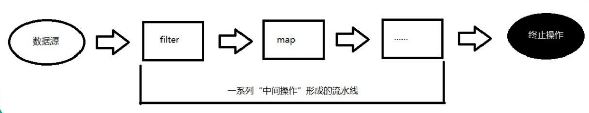

JDK1.8新特性
===

1. Lambda 表达式
2. 函数式接口
3. 方法引用与构造器引用
4. Stream API
5. 接口中的默认方法

> jdk1.8还有一些改动，例如将永久代替换成元空间，永久代处于堆中，而元空间处于本地内存中，并且将运行时常量池中的字符串常量池部分从元空间移到了堆中。


Lambda 表达式
---

Lambda表达式相当于一个没有名字的“快餐”函数，跟匿名内部类差不多，只在定义处使用，不过Lambda表达式要比匿名内部类更加简洁，高效。

- 基本语法：`(参数1, 参数2 ....) -> { 逻辑代码 }` 
- 无参  一个语句：`() -> 返回值/一句代码` （方法体的大括号可省略）
- 一个参数 多个语句：`s1 -> { 多行代码 }` （参数的小括号可省略）
- 多个参数 多个语句：`(多个参数) -> { 多行代码 }` （小括号跟大括号都不能省略）

```java
import java.util.Arrays;

public class test {
    public static void main(String[] args) {
        // 定义字符串数组
        String[] books = new String[]{"java基础", "python程序设计", "C语言", "C++编程设计"};
		// 使用Lambda表达式排序，参数可以不写类型
		Arrays.sort(books, (s1, s2) -> s1.length() - s2.length());
        System.out.println(Arrays.toString(books));
        // 结果：[C语言, java基础, C++编程设计, python程序设计]
    }
}
```

 lambda中的 **返回值跟参数的类型** java都会自动根据上下文推断出来。

```java
(s1, s2) -> s1.length() - s2.length()
等价于：
(String s1, String s2) -> {
    return s1.length() - s2.length()
}
```


函数式接口
---

我们来看看Lambda表达式是怎么实现它的功能的。

看源码可以发现`Arrays.sort(T[] a, Comparator<? super T> c)`，sort方法接收的是一个数组跟一个Comparator对象，也就是说，Lambda此时就是一个Comparator对象。

空说无凭，show you the code.

```java
Comparator<String> c = (s1, s2) -> s1.length() - s2.length();
Arrays.sort(books, c);
```

把Lambda表达式赋值给一个Comparator对象，仍然是可以排序的，所以可以证明此时的Lambda表达式就是一个Comparator对象。

那问题来了，Lambda表达式是如何变成Comparator对象的。

下面看看Comparator接口的源码（如下），可以发现该接口中有一个未实现的compare方法。

```java
public interface Comparator<T> {
	int compare(T o1, T o2);
}
```

没错，Lambda表达式会自动填充到这个方法（**等价于下段代码**），正好Lambda没有名字但是有实现，而抽象方法有名字但没有实现，两者很配。

```java
Comparator<String>() {
    @Override
    int compare(String s1, String s2){
        return s1.length() - s2.length();
    }
}
```

填充完之后，编译器自己创建对象`new Comparator<String>` 。此时就有了Comparator对象。

> Lambda与匿名内部类最大的区别就是不会多生成一个class文件

***

我们来小结一下，使用Lambda时，编译器会自动帮我们创建接口的对象，且Lambda表达式会自动填充到该接口中未实现的方法。

像Comparator这样的接口我们就叫做**函数式接口**。

要称为函数式接口必须满足以下条件：

1. 是一个 **接口** 
2. 只包含 **一个公共抽象方法** 


### 自定义函数式接口

```java
@FunctionalInterface // 添加注解，告诉编译器这是函数式接口
public interface FuntionalInterfaceTest {
    boolean strCheck(String s);
}
```

添加了`@FunctionalInterface` 注解之后编译器会检查该接口是否只包含一个未实现的公共方法。

使用：

```java
public class test {
    public static void main(String[] args) {
        // 定义字符串数组
        String[] books = new String[]{"java基础", "python程序设计", "C语言", "C++编程设计"};
        // 利用lambda创建对象
        FuntionalInterfaceTest fun = s -> s.length() % 2 == 0;
        for(String book: books){
            // 调用函数
            if(fun.strCheck(book)){
                System.out.println(book + " 的长度是偶数");
            }
        }
    }
}
```

使用lambda时就是创建了一个接口实现类的对象，接口实现类的方法为lambda中的方法。


### 自带的函数式接口

自定义函数式接口虽简洁，但不要大量使用，因为每个类就那几行代码，一旦大量使用就会使得源码膨胀。

那我们又需要用到自定义的函数式接口该怎么办呢？别怕，**系统有自带的函数式接口**。我们只需要根据这些接口的功能挑着来用就可以了，当自带的函数式接口实在不能满足要求的时候，再自己定义。

系统自带的函数式接口都位于`java.util.function`包中

|           接口           | 参数 | 返回值  | 未实现的方法 |            实例             |
| :----------------------: | :--: | :-----: | :----------: | :-------------------------: |
| Consumer\<T> 消费型接口  |  T   |  void   | accept\<T t> |    接收一个参数,无返回值    |
| Supplier\<T> 供给型接口  | None |    T    |  get\<T t>   |    无参数，返回一个参值     |
| Function<T,R> 函数型接口 |  T   |    R    | apply\<T t>  |   接收一个参数,返回一个值   |
| Predicate\<T> 断言型接口 |  T   | Boolean |  test\<T t>  | 接收一个参数,返回一个布尔值 |

消费型接口：输出数组中的元素

```java
String[] books = new String[]{"java基础", "python程序设计", "C语言", "C++编程设计"};

Consumer<String> cs = s -> System.out.println(s);
for (String book: books){
    cs.accept(book);
}
```

供给型接口：随机输出数组中的元素。

```java
String[] books = new String[]{"java基础", "python程序设计", "C语言", "C++编程设计"};

Supplier<String> sp = () -> books[(int) Math.floor(Math.random()*4)];
System.out.println(sp.get());
```

函数型接口：将一个数乘10

```java
Function<Integer, Integer> f = s -> s*10;
System.out.println(f.apply(10));
```

断言型接口：输出长度是偶数的字符串

```java
String[] books = new String[]{"java基础", "python程序设计", "C语言", "C++编程设计"};

Predicate<String> pd = s -> s.length() % 2 == 0;
System.out.println("长度为偶数的元素有:");
for (String book: books){
    if(pd.test(book)){
        System.out.println(book + " ");
    }
}
```

当然，jdk8还提供了许多函数式接口，有需要的时候查文档选择就行啦！


方法引用
---

方法引用可以说是一个更加便捷的Lambda表达式。**Lambda表达式可以自定义抽象方法的实现代码，方法引用则是直接使用已实现的方法**。它的语法为`::`。

> 要实现的抽象方法的参数列表，必须与已实现方法的参数列表保持一致，才可以使用方法引用。

简单应用：(输出数组中的元素)

```java
List books = Arrays.asList("java基础", "python程序设计", "C语言", "C++编程设计");
// 方法引用 String::println
books.forEach(System.out::println);
```

`System.out::println` 等价于 `(e) -> System.out.println(e);` 

因为println方法要接收一个参数，而lambda实现也是一个参数。所以将lambda改成方法引用。

***

常见的五种方法引用格式：

- 对象方法引用：`对象::实例方法` ，如 `System.out::println` 

  - `this::实例方法` 调用自身已有的方法
  - `super::实例方法` 调用父类已有的方法

- 静态方法引用：`类::静态方法` ，如 `Math::abs` 

- 实例方法引用：`类::实例方法` ，如 `String::compareTo` 

- 构造方法引用：

  - `类::new` 调用某类构造函数（单个对象）

    ```java
    Supplier<Person> s = Person::new; // 无参构造
    Person p = s.get();
    System.out.println(p.toString());
    ```

  - `类[]::new` 调用某类的构造函数（数组对象）

    ```java
    Function<Integer, Person[]> s = Person[]::new;
    Person[] pa = s.apply(5);  // 等价于 new Person[5];
    System.out.println(pa.length);
    ```

***

`对象::实例方法` 跟 `类::实例方法` 的区别：

`类::实例方法` 的**第一个参数** 作为**方法的执行者**，例如上面的`String::compareTo` 的第一个参数就是方法的执行体，第二个参数作为方法的形参。


Stream
---

流Stream，可以让你以一种声明的方式处理数据。Stream 使用一种类似用 SQL 语句从数据库查询数据的直观方式来提供一种对 Java 集合运算和表达的高阶抽象。



使用步骤：

1. 创建流
2. 指定中间操作链
3. 终止操作，真正执行中间操作链

特点：

- 不是数据结构，不会存储元素。 
- 不会改变源对象，而是返回一个持有结果的新Stream。 
- Stream操作是延迟执行的，即等到需要结果的时候才执行。


### 创建流

创建流的方式有以下几种：

1. Collection接口类.stream() 或 Collection接口类.parallelStream()

   ```java
   List<String> list = Arrays.asList(strArray);
   Stream stream = list.stream();
   ```

2. Arrays.stream(T[] array)

   ```java
   String [] strArray = new String[] {"a", "b", "c"};
   Stream stream = Arrays.stream(strArray);
   ```

3. Stream.generate(Supplier\<T> s)：创建无限流

   ```java
   Stream stream = Stream.generate(() -> Math.random());
   ```


### 中间操作

多个**中间操作**可以连接起来形成一个**操作连**，除非操作连上触发终止操作，否则**中间操作不会执行任何的处理**！因为只会在 **终止操作时一次性全部处理** ，所以称为“惰性求值”

筛选与切片

|        方法         |                     描述                     |
| :-----------------: | :------------------------------------------: |
| filter(Predicate p) |                   过滤元素                   |
|     distinct()      | 根据元素的hashCode() 和 equals()去除重复元素 |
|  limit(long size)   |                获取size个元素                |
|    skip(long n)     |            跳过n个元素后开始获取             |

```java
Stream<Integer> stream = Stream.of(6, 4, 6, 7, 3, 9, 8, 10, 12, 14, 14);
 
Stream<Integer> newStream = stream.filter(s -> s > 5) // 6 6 7 9 8 10 12 14 14
        .distinct() // 6 7 9 8 10 12 14
        .skip(2) // 9 8 10 12 14
        .limit(2); // 9 8
newStream.forEach(System.out::println);
```


映射

|        方法         |                      描述                      |
| :-----------------: | :--------------------------------------------: |
|   map(Function f)   | 接收一个函数作为参数，该函数会被应用到每个元素 |
| flatMap(Function f) |          将所有的元素加入到同一个流中          |

```java
List<String> list = Arrays.asList("a,b,c", "1,2,3");
// 将每个元素转成一个新的且不带逗号的元素
list.stream()
    .map(s -> s.replaceAll(",", ""));
	.forEach(System.out::println); // [abc 123]
 
Stream<String> s3 = list.stream().flatMap(s -> {
    String[] split = s.split(",");
    // 将每个元素转换成一个stream
    Stream<String> s2 = Arrays.stream(split);
    return s2;
});
s3.forEach(System.out::println); // [a b c 1 2 3]
```


排序

|         方法         |            描述            |
| :------------------: | :------------------------: |
| sorted(Comparator c) | 按比较器顺序排序，默认升序 |


### 终止操作

终端操作会从流的流水线生成结果，其结果可以是stream、List、Integer等值。

查找与匹配类方法：

- allMatch(Predicate p)：是否匹配所有元素

  ```java
  List<Integer> list = Arrays.asList(1, 2, 3, 4, 5);
  boolean m1 = list.stream().allMatch(e -> e > 3); //false
  ```

- anyMatch(Predicate p)：是否匹配任一元素

  ```java
  boolean m2 = list.stream().anyMatch(e -> e > 3); //true
  ```

- noneMatch(Predicate p)：是否匹配不到元素

- findFirst()：返回第一个元素

- count()：返回流中元素总数

- max(Comparator c)：流中最大值

  ```java
  Integer max = list.stream().max(Integer::compareTo).get();
  ```

- min(Comparator c)：流中最小值

- foreach(Consumer c)：遍历元素

归约类方法：

- reduce(T start, BinaryOperatorb)：

- reduce(BinaryOperatorb)：

- collect(Collector c)：将流中元素收集成另外一个数据结构，如list、set

  ```java
  // 将元素转成list存储
  List<Integer> ages = list
      .stream()
      .map(Student::getAge)
      .collect(Collectors.toList());
  ```

  ```java
  // 字符串分隔符连接
  String joinName = list
      .stream()
      .map(Student::getName)
      .collect(Collectors.joining(",", "(", ")")); // (aa,bb,cc)
  ```


