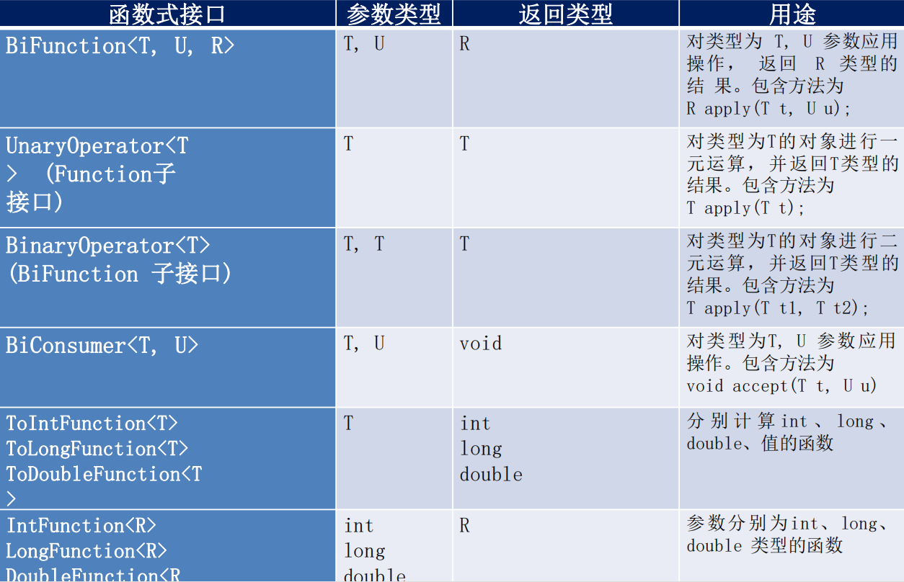

JDK1.8新特性
===

1. Lambda 表达式
2. 函数式接口
3. 方法引用与构造器引用
4. Stream API
5. 接口中的默认方法

> jdk1.8还有一些改动，例如将永久代替换成元空间，永久代处于堆中，而元空间处于本地内存中，并且将运行时常量池中的字符串常量池部分从元空间移到了堆中。


Lambda 表达式
---

Lambda表达式相当于一个没有名字的“快餐”函数，跟匿名内部类差不多，只在定义处使用，不过Lambda表达式要比匿名内部类更加简洁，高效。

- 基本语法：`(参数1, 参数2 ....) -> { 逻辑代码 }` 
- 无参  一个语句：`() -> 返回值/一句代码` （方法体的大括号可省略）
- 一个参数 多个语句：`s1 -> { 多行代码 }` （参数的小括号可省略）
- 多个参数 多个语句：`(多个参数) -> { 多行代码 }` （小括号跟大括号都不能省略）

```java
import java.util.Arrays;

public class test {
    public static void main(String[] args) {
        // 定义字符串数组
        String[] books = new String[]{"java基础", "python程序设计", "C语言", "C++编程设计"};
		// 使用Lambda表达式排序，参数可以不写类型
		Arrays.sort(books, (s1, s2) -> s1.length() - s2.length());
        System.out.println(Arrays.toString(books));
        // 结果：[C语言, java基础, C++编程设计, python程序设计]
    }
}
```

 lambda中的 **返回值跟参数的类型** java都会自动根据上下文推断出来。

```java
(s1, s2) -> s1.length() - s2.length()
等价于：
(String s1, String s2) -> {
    return s1.length() - s2.length()
}
```


函数式接口
---

我们来看看Lambda表达式是怎么实现它的功能的。

看源码可以发现`Arrays.sort(T[] a, Comparator<? super T> c)`，sort方法接收的是一个数组跟一个Comparator对象，也就是说，Lambda此时就是一个Comparator对象。

空说无凭，show you the code.

```java
Comparator<String> c = (s1, s2) -> s1.length() - s2.length();
Arrays.sort(books, c);
```

把Lambda表达式赋值给一个Comparator对象，仍然是可以排序的，所以可以证明此时的Lambda表达式就是一个Comparator对象。

那问题来了，Lambda表达式是如何变成Comparator对象的。

下面看看Comparator接口的源码（如下），可以发现该接口中有一个未实现的compare方法。

```java
public interface Comparator<T> {
	int compare(T o1, T o2);
}
```

没错，Lambda表达式会自动填充到这个方法（**等价于下段代码**），正好Lambda没有名字但是有实现，而抽象方法有名字但没有实现，两者很配。

```java
Comparator<String>() {
    @Override
    int compare(String s1, String s2){
        return s1.length() - s2.length();
    }
}
```

填充完之后，编译器自己创建对象`new Comparator<String>` 。此时就有了Comparator对象。

> Lambda与匿名内部类最大的区别就是不会多生成一个class文件

***

我们来小结一下，使用Lambda时，编译器会自动帮我们创建接口的对象，且Lambda表达式会自动填充到该接口中未实现的方法。

像Comparator这样的接口我们就叫做**函数式接口**。

要称为函数式接口必须满足以下条件：

1. 是一个 **接口** 
2. 只包含 **一个公共抽象方法** 


### 自定义函数式接口

```java
@FunctionalInterface // 添加注解，告诉编译器这是函数式接口
public interface FuntionalInterfaceTest {
    boolean strCheck(String s);
}
```

添加了`@FunctionalInterface` 注解之后编译器会检查该接口是否只包含一个未实现的公共方法。

使用：

```java
public class test {
    public static void main(String[] args) {
        // 定义字符串数组
        String[] books = new String[]{"java基础", "python程序设计", "C语言", "C++编程设计"};
        // 利用lambda创建对象
        FuntionalInterfaceTest fun = s -> s.length() % 2 == 0;
        for(String book: books){
            // 调用函数
            if(fun.strCheck(book)){
                System.out.println(book + " 的长度是偶数");
            }
        }
    }
}
```

使用lambda时就是创建了一个接口实现类的对象，接口实现类的方法为lambda中的方法。


### 自带的函数式接口

自定义函数式接口虽简洁，但不要大量使用，因为每个类就那几行代码，一旦大量使用就会使得源码膨胀。

那我们又需要用到自定义的函数式接口该怎么办呢？别怕，**系统有自带的函数式接口**。我们只需要根据这些接口的功能挑着来用就可以了，当自带的函数式接口实在不能满足要求的时候，再自己定义。

系统自带的函数式接口都位于`java.util.function`包中

|           接口           | 参数 | 返回值  | 未实现的方法 |            实例             |
| :----------------------: | :--: | :-----: | :----------: | :-------------------------: |
| Consumer\<T> 消费型接口  |  T   |  void   | accept\<T t> |    接收一个参数,无返回值    |
| Supplier\<T> 供给型接口  | None |    T    |  get\<T t>   |    无参数，返回一个参值     |
| Function<T,R> 函数型接口 |  T   |    R    | apply\<T t>  |   接收一个参数,返回一个值   |
| Predicate\<T> 断言型接口 |  T   | Boolean |  test\<T t>  | 接收一个参数,返回一个布尔值 |

消费型接口：输出数组中的元素

```java
String[] books = new String[]{"java基础", "python程序设计", "C语言", "C++编程设计"};

Consumer<String> cs = s -> System.out.println(s);
for (String book: books){
    cs.accept(book);
}
```

供给型接口：随机输出数组中的元素。

```java
String[] books = new String[]{"java基础", "python程序设计", "C语言", "C++编程设计"};

Supplier<String> sp = () -> books[(int) Math.floor(Math.random()*4)];
System.out.println(sp.get());
```

函数型接口：将一个数乘10

```java
Function<Integer, Integer> f = s -> s*10;
System.out.println(f.apply(10));
```

断言型接口：输出长度是偶数的字符串

```java
String[] books = new String[]{"java基础", "python程序设计", "C语言", "C++编程设计"};

Predicate<String> pd = s -> s.length() % 2 == 0;
System.out.println("长度为偶数的元素有:");
for (String book: books){
    if(pd.test(book)){
        System.out.println(book + " ");
    }
}
```

当然，jdk8还提供了许多函数式接口，有需要的时候查文档选择就行啦！




方法引用
---

方法引用可以说是一个更加便捷的Lambda表达式。**Lambda表达式可以自定义抽象方法的实现代码，方法引用则是直接使用已实现的方法**。它的语法为`::`。

简单应用：(按首字母排序)

```java
// 定义字符串数组
String[] books = new String[]{"java基础", "python程序设计", "C语言", "C++编程设计"};
// 方法引用 String::compareTo
Arrays.sort(books, String::compareTo);
System.out.println(Arrays.toString(books));
```

`String::compareTo` 等价于 `(s1, s2) -> s1.compareTo(s2);` 


Stream API
---