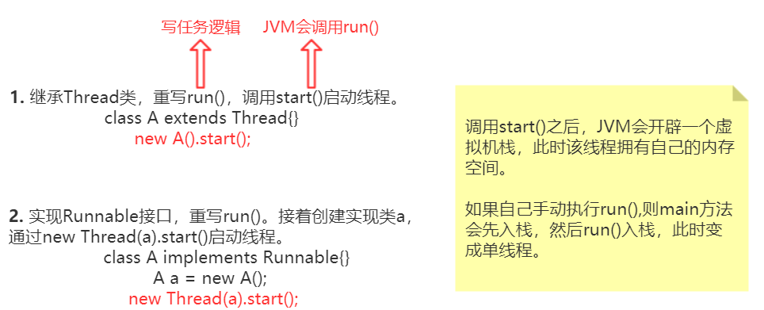
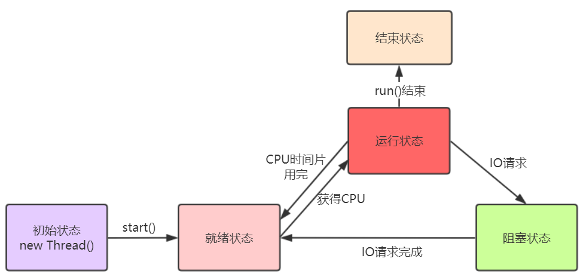
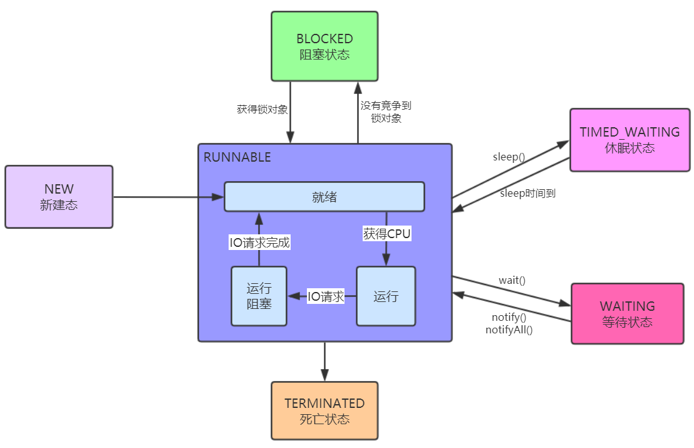
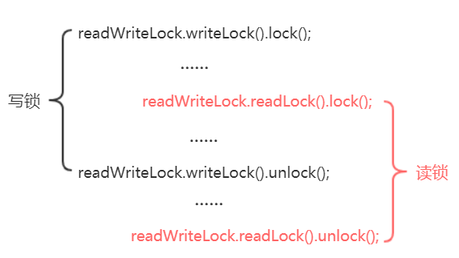
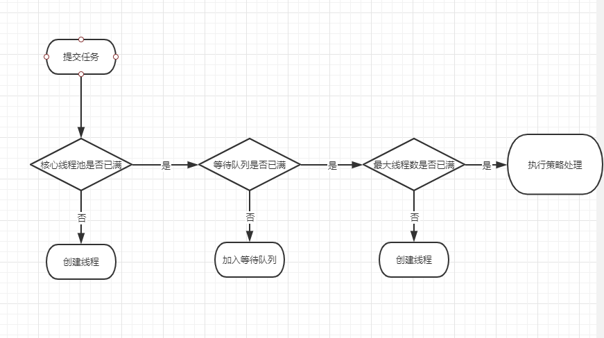
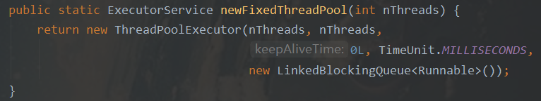
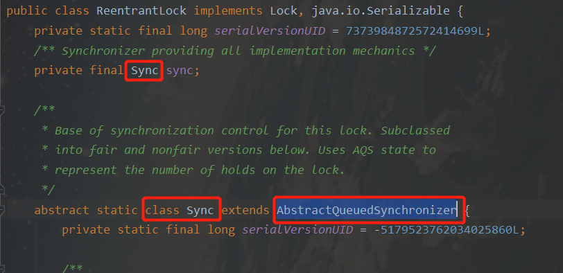
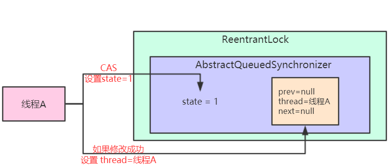
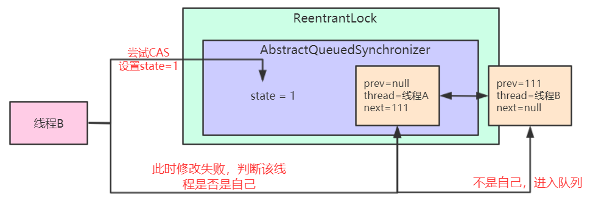

JUC 学习
===

JUC就是 java.util.concurrent 工具包的简称。这是从JDK 1.5 开始出现的一个处理线程的工具包。


多线程
---

### 串行、并行、并发

串行：多个任务按顺序执行。比如打开电视后才可以切换频道。

并行：多个任务同个时刻执行。比如边看电视边喝奶茶

并发：多个任务同个时间段执行。比如左手按下电视遥控器的时候，右手按下空调遥控器。哪个手先看下无所谓，这两个动作完成的时间很短。


### 创建多线程的方式



还有后面讲到的实现Callable接口、线程池方式也可以创建线程。


### 线程的状态

#### 操作系统层面

计算机底层线程是有5种状态的：初始态、就绪态、运行态、阻塞态、结束态。




#### java层面

在Java层面，线程是有六种状态的，分别是：新建态、可运行态、阻塞态、等待态、休眠状态、终止态。

需要注意的是，**可运行态中包含了 就绪、运行阻塞和运行态**。




Synchronized
---

synchronized 是 Java 中的关键字，是一种同步锁。当一个线程获取了锁对象，其他线程就要等待该对象的释放（执行完代码块或出现异常）。由于要频繁的获取锁、释放锁、判断锁，所以性能会降低。

Synchronized还可以通过 `wait()` 跟 `notify()/notifyAll()` 进行线程间通信。

>  原理看JVM。

它可以修饰代码块，普通方法和静态方法。

当**修饰代码块**时，锁对象可以是**任意对象**，但多线程用的锁对象必须是同一个。

```java
synchronized(锁对象){
    可能出现安全问题的代码
}
```

当**修饰普通方法**时，锁对象是**this**，即本类对象。

```java
synchronized(this){
    可能出现安全问题的代码
}
```

当**修饰静态方法**时，锁对象是**类的class对象**。因为this是对象创建之后产生的，而静态方法比对象先进入内存。

```java
synchronized(xxx.class){
    可能出现安全问题的代码
}
```


Lock 接口
---

lock是一个接口，需要手动的加锁和释放锁，并且在发生异常时不会自动释放锁，因此通常把释放锁的操作放在finally中。


### ReentrantLock

ReentrantLock是lock实现类，它是可重入锁，其可以通过 `lock()` 加锁，`unlock()` 解锁。

```java
public void insert(Thread thread) {
    Lock lock = new ReentrantLock();
    // 加锁
    lock.lock();
    System.out.println(thread.getName()+"得到了锁");
    // 释放锁
    lock.unlock();
}
```

> 可重入锁是指一个线程获得锁之后，该线程可以再次获取该锁而无需等待。
>
> 例如：
>
> ```java
> // 加锁
> lock.lock();
> System.out.println(thread.getName()+"得到了锁");
> // 再加一次锁
> lock.lock();
> lock.unlock();
> // 释放锁
> lock.unlock();
> ```


### Condition

Condition 类也是lock接口的实现类，其可以实现线程间的通信。

`lock.newCondition()`：获取Condition对象。

`await()`：会使当前线程等待，同时会释放锁，当其他线程调用signal()时，线程会重新获得锁并继续执行。

`signal()`：用于唤醒一个**指定的**正在等待的线程。区别于notify()，notify是随机唤醒一个。

- 比如`a.signal()` 就只会唤醒Condition a对象。

`signalAll()`：唤醒所有等待的线程。


### 线程间通信

```java
import java.util.concurrent.locks.Condition;
import java.util.concurrent.locks.Lock;
import java.util.concurrent.locks.ReentrantLock;

class DemoClass{
    // 共享对象
    private int number = 0;
    // 声明锁
    private Lock lock = new ReentrantLock();
    // 声明Condition
    private Condition condition = lock.newCondition();
    
    /**
    * 加 1
    */
    public void increment() {
        try {
            lock.lock();
            // 注意这里是while
            while (number != 0){
                condition.await();
            }
            number++;
            condition.signalAll();
        }catch (Exception e){
            e.printStackTrace();
        }finally {
            lock.unlock();
        }
    }
    
    /**
     * 减一
     */
    public void decrement(){
        try {
            lock.lock();
            while (number == 0){
                condition.await();
            }
            number--;
            condition.signalAll();
        }catch (Exception e){
            e.printStackTrace();
        }finally {
            lock.unlock();
        }
    } 
}
```

【注意】代码中判断条件是while，而不是if，需要在唤醒之后再次判断条件成不成立，不然signalAll的时候全都被唤醒，即使条件不成立也会往下执行，这也叫做**虚假唤醒**。


CopyOnWriteArrayList
---

在很多应用场景中，读操作可能会远远大于写操作。由于读操作不会修改原有的数据，因此如果每次读操作都进行加锁，这其实是一种资源浪费。

ArrayList是非线程安全的，CopyOnWriteArrayList是线程安全的。

CopyOnWriteArrayList类底层是通过 **写时复制技术** 实现线程安全的。

写时复制技术 就是对list进行修改时，不直接在原有list中进行写操作，而是将list拷贝一份，在新的list中进行写操作（此过程会加锁），写完之后，再将原来指向的list指针指到新的list。

```java
List<Integer> list = new CopyOnWriteArrayList<>();
list.add(1);
System.out.println(list);
```


CopyOnWriteArrayList添加新元素是否需要扩容？
---

CopyOnWriteArrayList 底层并非动态扩容数组，而是每次添加的时候都往新数组中添加。

当向 CopyOnWriteArrayList 添加元素时，线程获取锁的执行权后，`add` 方法中会新建一个容量为 **旧数组容量+1** 的数组，然后将旧数组数据拷贝到新数组中，并将新加入的数据放入新数组尾部，接着使用新数组替换旧数组。

代码如下：

```java
public boolean add(E e) {
    final ReentrantLock lock = this.lock;
    lock.lock();
    try {
        Object[] elements = getArray();
        int len = elements.length;
        Object[] newElements = Arrays.copyOf(elements, len + 1);
        newElements[len] = e;
        setArray(newElements);
        return true;
    } finally {
        lock.unlock();
    }
}
```

> CopyOnWriteArrayList 适用于 读多写少的情况。因为每次进行写操作都需要重新创建数组，性能低。


CopyOnWriteArraySet
---

set集合是非线程安全的，而CopyOnWriteArraySet是线程安全的。

CopyOnWriteArraySet是通过CopyOnWriteArrayList实现的，即去重的时候是遍历list看有无该元素，没有该元素才放入。


公平锁和非公平锁
---

**公平锁**：多个线程按照申请锁的**顺序**去获得锁。线程会直接进入队列去排队，只有队列的第一个线程才能得到锁。

- 优点：所有的线程都能得到资源，不会饿死在队列中。
- 缺点：吞吐量会下降很多

**非公平锁**：多个线程同时获取锁，不讲究顺序。

- 优点：整体的吞吐效率会高点
- 缺点：可能导致队列中间的某些线程一直获取不到锁或者长时间获取不到锁，导致饿死。

> 通俗来讲就是公平锁要排队，非公平锁是抢。

在ReentrantLock的构造方法中可以指定公平锁和非公平锁。

`new ReentrantLock(true)`：设置为公平锁。默认是非公平锁。


死锁
---

死锁：两个或两个以上的进程（线程）在执行过程中，因为争夺资源而造成相互等待状态，若无外力作用，它们都将永远无法执行下去。

形成死锁的四个**必要条件**：

- 互斥：一个资源只能被一个线程(进程)占用
- 请求与保持：一个线程(进程)因请求被占用资源而发生阻塞时，对已获得的资源保持不放。
- 不可剥夺：线程(进程)已获得的资源在末使用完之前不能被其他线程强行剥夺
- 环路等待：所等待的线程(进程)必定会形成一个环路，造成永久阻塞。

**解决**死锁的办法：

| 死锁条件   | 解决方案                                       |
| ---------- | ---------------------------------------------- |
| 互斥       | 无法解决                                       |
| 请求与保持 | 一次性申请所有的资源                           |
| 不可剥夺   | 申请不到资源时，主动释放占有的资源（超时机制） |
| 环路等待   | 顺序执行（注意加锁顺序）                       |


Callable&FutureTask
---

实现Callable接口是创建线程的第三种方式，只不过不能像Runanble接口的实现类一样直接new然后放到Thread中。要借助**FutureTask** 类来进行适配。

Callable 接口的特点如下：

- 实现 Callable 而必须重写 call 方法。call()相当于run()。
- call()有返回值，且可以引发异常

```java
//新类 MyThread 实现 callable 接口
class MyThread implements Callable<Integer>{
    @Override
    public Integer call() throws Exception {
        return 200; 
    }
}
```

***

FutureTask：常用于后台完成任务。

- 在主线程中需要执行比较耗时的操作，但又不想阻塞主线程时，可以把这些作业交给 FutureTask对象在后台完成
- 一般 FutureTask 多用于耗时的计算，主线程可以在完成自己的任务后，再去获取结果 `get()` 。如果结果尚未完成，则阻塞 get 方法。

```java
// future-callable
FutureTask<Integer> ft = new FutureTask(new MyThread());
// 启动线程
new Thread(ft, "线程ft").start();
for (int i = 0; i < 10; i++) {
    // 获取到call方法的返回值200
    System.out.println(ft.get());
}
```


JUC 三大辅助类
---

JUC 中提供了三种常用的辅助类，通过这些辅助类可以很好的解决线程数量过多时 Lock 锁的频繁操作。


### CountDownLatch

它是一个同步工具类，通过设置一个计数器，然后通过 countDown方法 来进行 减1 的操作，然后使用 await方法 让线程处于等待状态，当计数器为0时自动唤醒等待线程。

- CountDownLatch(int count)：构造函数中的count为计数器。**这个值只能被设置一次，而且不能重新设置**；
- await()：调用该方法的线程会被阻塞，直到 count 减到 0 ；
- countDown()：使 count 值 减 1；

***

场景1：让多个线程等待，一个线程任务完成后，多个线程一起执行。

模拟并发，让并发线程一起执行。

```java
CountDownLatch countDownLatch = new CountDownLatch(1);
for (int i = 0; i < 5; i++) {
    new Thread(() -> {
        try {
            // 线程等待计数器为0
            countDownLatch.await();
            String parter = "【" + Thread.currentThread().getName() + "】";
            System.out.println(parter + "开始冲刺……");
        } catch (InterruptedException e) {
            e.printStackTrace();
        }
    }).start();
}
Thread.sleep(2000);
countDownLatch.countDown();  // 计数器减一
```

可以把 所有的线程 比作 跑步运动员 ，线程阻塞比作 运动员在跑线等待裁判鸣枪，当计数器为0时（裁判响哨），所有运动员冲刺。

***

场景2：让单个线程等待，多个线程(任务)完成后，让单个线程执行汇总合并。

当并发任务存在前后依赖关系时；比如数据详情页需要同时调用多个接口获取数据，并发请求获取到数据后、需要进行结果合并；或者多个数据操作完成后，需要数据check；这其实都是：在多个线程(任务)完成后，单个线程进行汇总合并的场景。

```java
CountDownLatch countDownLatch = new CountDownLatch(5);
for (int i = 0; i < 5; i++) {
    new Thread(() -> {
        try {
            System.out.println("处理完毕");
            countDownLatch.countDown();
        } catch (InterruptedException e) {
            e.printStackTrace();
        }
    }).start();
}

countDownLatch.await(); // 主线程在阻塞，当计数器==0，就唤醒主线程往下执行。
System.out.println("主线程:在所有任务运行完成后，进行结果汇总");
```


### CyclicBarrier

CyclicBarrier 的构造方法第一个参数是目标障碍数，每次执行 await方法 障碍数会加一，如果达到了目标障碍数，才会执行 cyclicBarrier.await()之后的语句。

CyclicBarrier 跟CountdownLatch不一样的是，**CountdownLatch是一次性的，而CycliBarrier是可以重复使用的**，只需调用一下`reset方法`。

- ` CyclicBarrier(int parties, Runnable barrierAction)`：指定目标障碍数和到达目标障碍数时要做的事情
-  `await()`：障碍数加一，线程等待。
- `reset()`：重置CyclicBarrier

模拟多人到达会议后进行开会：

```java
// 会议需要三个人
CyclicBarrier cyclicBarrier = new CyclicBarrier(3,  new Runnable() {
    @Override
    public void run(){
        // 三个人都到齐之后 开会
        System.out.println("三个人都已到达会议室，开会！")
    }
});

for (int i = 0; i < 3; i++) {
    new Thread(new Runnable() {
        @Override
        public void run() {
            // 线程i到达
            cyclicBarrier.await();
        }
    }, String.valueOf(i)).start();
}
```


### Semaphore

Semaphore通过分配和回收令牌，使线程达到同步的效果。Semaphore 信号量通常用于那些资源有**明确访问数量限制**的场景，常用于**限流** 。

- Semaphore(int n)：构造方法，指定令牌数
- acquire()：获取一个令牌，运行执行。在获取到令牌之前线程一直处于阻塞状态。
- release()：释放一个令牌，唤醒一个需要获取令牌的线程。
- availablePermits()：返回可用的令牌数量

***

案例1：用semaphore 实现停车场停车

```java
public class TestCar {
    public static void main(String[] args) {
        // 停车场有10个停车位
		Semaphore semaphore = new Semaphore(10);
        
        // 模拟100辆车进入停车场
        for(int i=0; i<100; i++){
            new Thread(new Runnable() {
                public void run() {
                    try { 
                        if(semaphore.availablePermits() == 0){
                            System.out.println("车位不足，请耐心等待");
                        }
                        semaphore.acquire(); // 获取令牌尝试进入停车场
                        System.out.println(Thread.currentThread().getName() + "成功进入停车场");
                        Thread.sleep(new Random().nextInt(5000)); // 模拟车辆在停车场停留的时间
                    } catch (InterruptedException e) {
                        e.printStackTrace();
                    } finally{
                        System.out.println(Thread.currentThread().getName() + "驶出停车场");
                        semaphore.release(); // 释放令牌，腾出停车场车位
                    }
                }
            }, i+"号车").start();
        }
    }
}
```


读写锁
---

在很多场景下，读操作往往比写操作要更多，如果因为一个资源可能被修改而去加锁，那么一个线程读取这个资源的时候其他线程就不能读取，这样效率会很低。所以出现了读写锁，一个线程在读的时候，其他线程也可以读，但一个线程在写的时候，其他线程就需要阻塞。

JUC 提供了读写锁ReentrantReadWriteLock来实现这个功能。

ReentrantReadWriteLock表示它表示两个锁，一个是读操作相关的锁，称为共享锁；一个是写相关的锁，称为排他锁。

**互斥原则**：

- 多个线程可以同时进行读操作
- 一个线程进行读操作的时候，其他线程不允许写操作
- 一个线程进行写操作的时候，其他线程不允许读操作
- 一个线程进行写操作的时候，其他线程不允许写操作

***

```java
class MyData{
    private volatile Map<String ,String> map = new HashMap<>();
    // 读写锁
    ReadWriteLock readWriteLock = new ReentrantReadWriteLock();

    public void put(String key,String value) {
        try {
            // 加写锁
            readWriteLock.writeLock().lock();
            System.out.println(Thread.currentThread().getName() + " 正在写入");
            try {
                Thread.sleep(200);
            } catch (InterruptedException e) {
                e.printStackTrace();
            }
            map.put(key,value);
            System.out.println(Thread.currentThread().getName() + " 写入完成");
        } finally {
            // 释放写锁
            readWriteLock.writeLock().unlock();
        }
    }

    public String get(String key) {
        try {
            // 加读锁
            readWriteLock.readLock().lock();
            System.out.println(Thread.currentThread().getName() + " 正在读取");
            try {
                Thread.sleep(200);
            } catch (InterruptedException e) {
                e.printStackTrace();
            }
            String v = map.get(key);
            System.out.println(Thread.currentThread().getName() + " 读取完成,读到数据：" + v);
            return v;
        } finally {
            // 释放读锁
            readWriteLock.readLock().unlock();
        }
    }
}
```


### 锁降级

在线程持有写锁的情况下，该线程可以继续获取读锁。如果在写锁的区间内获取了读锁，然后在读锁的区间内释放了写锁，这个过程就叫做锁降级。



**锁降级目的是保证数据可见性**，如果当前的线程A在修改完数据后，没有获取读锁而是直接释放了写锁，那么假设此时另一个线程B获取了写锁并修改了数据，那么A线程无法感知到数据已被修改，则数据出现错误。如果遵循锁降级的步骤，线程A在释放写锁之前获取读锁，那么线程B在获取写锁时将被阻塞，直到线程A完成数据处理过程，释放读锁。

> 锁降级只能是 写锁 中加 读锁，不能 读锁 中加 写锁。因为多个线程在读，突然其实一个线程加写锁的话，就会打算其他线程的读操作。


阻塞队列
---

BlockingQueue当队列满/空闲的时候会自动帮我们阻塞和唤醒线程，而无需我们手动的操作。

当队列中没有数据的情况下，消费者端的所有线程都会被自动阻塞（挂起），直到有数据放入队列。

当队列中填满数据的情况下，生产者端的所有线程都会被自动阻塞（挂起），直到队列中有空的位置，线程被自动唤醒。

常用方法：

|    方法    | 抛出异常  | 返回特殊值 | 一直阻塞 |      超时退出      |
| :--------: | :-------: | :--------: | :------: | :----------------: |
|  插入元素  |  add(e)   |  offer(e)  |  put(e)  | offer(e,time,unit) |
| 移除首元素 | remove()  |   poll()   |  take()  |  poll(time,unit)   |
| 查看首元素 | element() |   peek()   |  不可用  |       不可用       |

1、放入数据

- add(e)：队列没满时正常添加，否则报错
- offer(e)：队列没满时，正常添加然后返回 true，否则返回 false.
- put(e)：队列没满时正常添加，否则进行阻塞
- offer(e, time, unit)：若指定时间内不能添加元素，则返回false

2、获取数据

- remove()：取走队列的首元素，若队列为空报错
- poll()：取走队列的首元素，若队列为空则返回false
- take()：取走队列的首元素，若队列为空则阻塞，直到队列有元素。
- poll(time, unit)：取走队列的首元素，若队列为空则等待time，若等待time后还没有元素则返回false

```java
public class BlockingQueueDemo {
    static ArrayBlockingQueue<String> abq = new ArrayBlockingQueue(3);

    public static void main(String[] args) {
        // 生产者
        for (int i = 0; i < 3; i++) {
            new Thread(() -> producer(), "producer" + i).start();
        }
        // 消费者
        for (int i = 0; i < 3; i++) {
            new Thread(() -> consumer(), "consumer" + i).start();
        }
    }

    private static void consumer() {
        while (true) {
            try {
                String msg = abq.take();
                System.out.println(Thread.currentThread().getName() + " ->receive msg:" + msg);
            } catch (InterruptedException e) {
                e.printStackTrace();
            }
        }
    }

    private static void producer() {
        for (int i = 0; i < 100; i++) {
            try {
                abq.put("[" + i + "]");
                System.out.println(Thread.currentThread().getName() + " ->send msg:" + i);
            } catch (InterruptedException e) {
                e.printStackTrace();
            }
        }
    }
}
```


ThreadPool 线程池
---

线程池维护着多个线程，当有任务需要分配线程的时候直接去线程池中获取线程，任务结束之后再把线程放到池中，避免频繁的创建销毁线程。

优点：

1. 降低性能消耗，增加响应速度
2. 提高线程的可管理性
3. 将线程和任务逻辑解耦


### 常用线程池

Java中的线程池是通过Executor框架实现的。

- `Executors.newCachedThreadPool()`：可缓存线程池。该线程池的**线程数**可以根据任务数量**随时改变**，因为它的线程最大值是在初始化的时候设置为 Integer.MAX_VALUE 所以它容易造成堆内存溢出。
- `Executors.newFixedThreadPool(n)`：定长线程池，可控制线程池的**最大线程数**，超出这个数的任务会在队列中等待。**在线程池空闲时，不会释放工作线程**，因为他们都是核心线程。
- `Executors.newSingleThreadExecutor()`：单线程化的线程池，它只会用**一个工作线程**来执行任务，保证所有任务按照指定顺序(FIFO, 优先级)执行。速度慢。


### 参数

**core_pool_size**：核心线程数，正常情况下创建的线程数，只有线程池关闭的时候才会销毁。

**max_pool_size**：线程池中允许的最大线程数，核心线程数+临时线程数=最大线程数。

**keep_alive_time**：临时线程的最大存活时间。

**work_queue**：任务队列。存放待执行的任务，是一个阻塞队列。

**ThreadFactory**：线程工厂，生产执行任务的线程。

**Handler**：拒绝策略。当线程池没有能力处理任务的时候，会启动拒绝策略。

1. AbortPolicy：不执行新任务，直接抛出异常，提示线程池已满
2. DisCardPolicy：不执行新任务，也不抛出异常
3. DisCardOldSetPolicy：将消息队列中的第一个任务替换为当前新进来的任务执行
4. CallerRunsPolicy：直接调用execute来执行当前任务

> newFixedThreadPool 和 newSingleThreadExecutor 底层使用的阻塞队列为：LinkedBlockingQueue。
>
> newCachedThreadPool底层使用的阻塞队列为：SynchronousQueue


### 执行流程

有任务来的时候，线程池会先判断当前线程是否达到核心线程数，若没达到则创建线程去执行，否则将任务放入工作队列中。当工作队列满的时候，会创建临时线程处理任务，当达到最大线程数且等待队列满的时候会启动拒绝策略。




### 自定义线程池

线程池的底层都是使用ThreadPoolExecutor这个对象来实现的。当框架提供的线程池无法解决我们的需求时，我们可以自定义线程池。



自定义线程池：

```java
ExecutorService threadPool = new ThreadPoolExecutor(
    2, // core_pool_size
    9, // max_pool_size
    2L, // keep_alive_time
    TimeUnit.SECONDS, // keep_alive_time
    new LinkedBlockingQueue<Runnable>(), // work_queue
    Executors.defaultThreadFactory(), // ThreadFactory
    new ThreadPoolExecutor.CallerRunsPolicy() // Handler
);
```


多线程面试
===

sleep跟wait区别
---

1. sleep是Thread的本地静态方法，wait是Object的静态方法
2. sleep不会释放锁，但wait会
3. sleep不依赖于synchronized，但wait依赖
4. sleep不需要被唤醒，wait需要


什么是线程上下文切换
---

cpu通过时间片分配算法来循环执行任务，当前线程执行一个时间片后切换到下一个线程。但是，在切换前会保存上一个线程的状态，下次切换回此线程时可以重新回到保存的状态。这一过程就是上下文切换。


Synchronized和Lock区别
---

1. Synchronized是关键字；lock是接口
2. Synchronized会自动上锁和释放锁；lock要手动，即使发生异常时lock也不会自动释放锁。
3. Synchronized可以锁代码块和方法；lock只能锁代码块
4. Synchronized获取到锁之后其他线程会一直等待下去；而lock锁不一定会等待下去。
5. Synchronized是可重入锁、非公平；lock也是重入锁，但是可以设置使用公平锁或者非公平锁。


AQS
---

AQS，全称为 **AbstractQueuedSynchronizer，抽象队列同步器**。AQS是java并发包的基础类，很多API都是基于AQS来实现加锁和释放锁的功能。其内部维护了state跟node节点等变量来实现锁的功能。

比如ReentrantLock的属性中就包括了AQS子类：




### 加/解锁原理

AQS是如何实现加锁解锁的呢？其内部维护了两个属性：state、Node。

- state表示是否有线程加锁，0表示没有，非0表示有线程正在使用锁。
- Node其实是双向链表的节点，包含了前后指针、Thread（使用锁的线程）。多个Node节点形成的双向链表，我们称之为等待队列。

> 公平锁和非公平锁利用**等待队列**来实现


**加锁**的实现步骤：

1. 当一个线程使用lock()方法加锁的时候，会使用 <u>CAS操作将state从0变成1</u>。如果修改成功则将 节点中的Thread设置为自己。
2. 如果修改失败说明当前有线程正在使用该锁，此时这个线程会 <u>判断这个锁是不是属于自己</u>，是的话允许加锁，然后state值加一；**这也是可重入锁的实现。** 
3. 若不是属于自己，则该线程使用 <u>CAS操作进入到等待队列</u>中，然后调用 LockSupport.park(this) 进入阻塞
4. 当锁对象释放之后，会重新尝试去获取。

**解锁**实现步骤：

1. state减一。如果state值变为0，会将Thread变量设置为null，完成锁的释放。如果当前线程不是最后一个节点的话，则调用 LockSupport.unpark(s.thread); 

> LockSupport提供的是一个许可，如果存在许可，线程在调用`park`的时候，会立马返回，此时 许可 会被消费掉变成不可用。如果没有许可，则会阻塞。调用unpark的时候，许可变成可用。
>
> **注意，许可只有一个，不可累加。** 

***

图示加锁过程：






### 公平和非公平锁的原理

这两者的实现是靠AQS的**阻塞队列**。使用公平锁的情况下，线程获取锁的时候会先判断获取到当前节点的下一个节点是不是自己，是的话才尝试加锁，不是的话就继续阻塞。

而使用非公平锁时，直接就尝试加锁。


手动实现阻塞队列
---

```java
import java.util.concurrent.locks.Condition;
import java.util.concurrent.locks.Lock;
import java.util.concurrent.locks.ReentrantLock;
 
public class BlockQueue<T> {
 
    private int size; // 阻塞队列的容量
    private Object[] queue; // 存放元素
 
    private Lock lock = new ReentrantLock();
    private Condition full = lock.newCondition();
    private Condition empty = lock.newCondition();
 
    private int index; // 添加元素时的下标
    private int removeIndex; // 删除元素时的下标
    private int currLen;
 
    public BlockQueue() {
        this(10);
    }
 
    public BlockQueue(int size) {
        this.index = 0;
        this.removeIndex = 0;
        this.currLen = 0;
        this.size = size;
        queue = new Object[size];
    }
 
    public void push(T element) throws InterruptedException {
        lock.lock();
        try {
            while (currLen == size) {
                System.out.println("队列满。。。");
                full.await();
            }
            queue[index] = element;
            index = ++index%size;
            currLen++;
            empty.signal();
        } finally {
            lock.unlock();
        }
    }
 
    public T pop() throws InterruptedException {
        lock.lock();
        try {
            while (currLen == 0) {
                System.out.println("队列空。。。");
                empty.await();
            }
            Object obj = queue[removeIndex];
            removeIndex = ++removeIndex % size;
            currLen--;
            full.signal();
            return (T) obj;
        } finally {
            lock.unlock();
        }
    }
 
    public static void main(String[] args) throws InterruptedException {
        BlockQueue<Integer> blockQueue = new BlockQueue<Integer>(3);
        blockQueue.push(1);
        System.out.println(blockQueue.pop());
        blockQueue.push(2);
        System.out.println(blockQueue.pop());
        blockQueue.push(3);
        System.out.println(blockQueue.pop());
        blockQueue.push(5);
        blockQueue.push(5);
        System.out.println(blockQueue.pop());
    }
 
}
```

