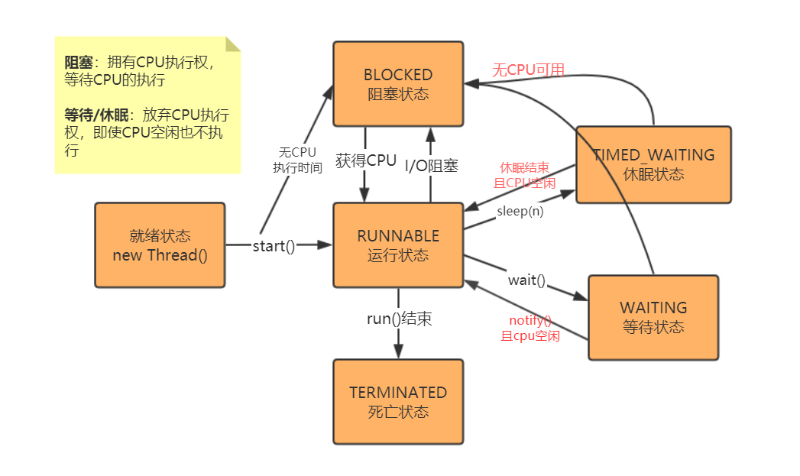

JUC学习
===

什么是JUC
---

JUC就是 java.util.concurrent 工具包的简称。这是从JDK 1.5 开始出现的一个处理线程的工具包。

多线程面试
===

什么是线程上下文切换
---

cpu通过时间片分配算法来循环执行任务，当前线程执行一个时间片后切换到下一个线程。但是，在切换前会保存上一个线程的状态，下次切换回此线程时可以重新回到保存的状态。这一过程就是上下文切换。

线程的状态
---

公平锁和非公平锁
---

Lock的底层实现
---