# JVM学习日记


## 1.什么是JVM？

JVM：Java Virtual Machine的简写。是java程序的运行环境（字节码文件的运行环境）。

**好处**：

- 使java程序可以一次编写，到处运行。
- 提供了垃圾自动回收功能


### JVM、JRE、JDK的区别

JRE：java运行时环境，是Java Runtime Environment的简写。

JDK：java开发工具，是Java Development Kit的简写。

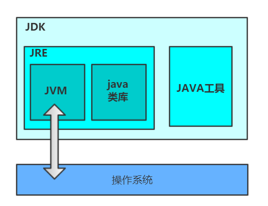


### JVM整体体系

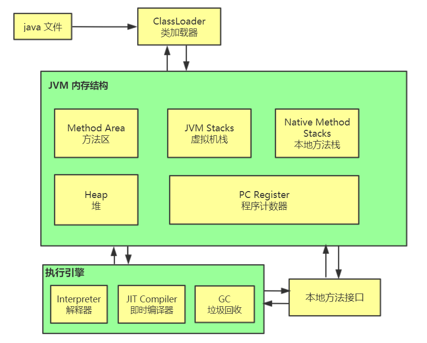

类加载器：将java文件加载到jvm。

java内存结构：内存结构也叫**运行时数据区**。是JVM对内部存储区域的一种划分方式，从逻辑存储上来支持class文件的运行。包括堆，方法区，程序计数器，虚拟机栈，本地方法栈。

执行引擎：是从内存中(也可以是运行时数据区)获取相关数据来执行，执行后在把数据返还到内存中。

本地方法接口：调用底层操作系统提供的功能方法。


### 类的加载过程

类的加载过程就是将静态存储结构转化为方法区的运行时数据结构

一个类的加载过程为：加载 -> 链接（检验、准备、解析） -> 初始化

1. 加载：使用类加载器查找并加载类的二进制文件
   - BootstrapClassLoader：是 ExtClassLoader 的父类加载器，所谓父类加载器并不是直接的继承关系，而是在parent属性中指定。默认加载 `%JAVA_HOME%/lib` 目录下的 jar包和class文件
   - ExtClassLoader：是 AppClassLoader 的父类加载器，默认加载`%JAVA_HOME%/lib/ext` 下的jar包和java类
   - AppClassLoader：是自定义加载器的父类加载器，负责加载classpath下的文件
2. 检验：确保被加载的类的正确性
   - 格式验证：验证是否符合class文件规范
   - 语义验证：final修饰的类是否有子类等
3. 准备：为类的静态变量分配空间并且赋予默认值
4. 解析：将常量池的符号引用变成直接引用
5. 初始化：给类的静态变量赋值、调用构造器


### 双亲委派机制

每个类加载器都有自己的缓存空间和加载路径，加载一个类的时候会从AppClassLoader 开始向上查找每个加载器的缓存中是否加载了该类，如果加载了则直接返回，若到了BootstrapClassLoader 都没有找到，则会查找 BootstrapClassLoader 的加载路径是否包含该类，如果包含则直接返回，否则继续往下查找，直到找到为止。这就是**双亲委派机制**。 向上找缓存，向下找加载路径。

> 如果相同的class文件被不同的加载器所加载就属于不同的类。

好处：

1. 避免了类的重复加载
2. 保证了安全性


## 2. JVM 内存结构

### 程序计数器

jvm指令交给解释器执行成机器码后会交给CPU执行，而程序计数器的作用就是**记住下一条jvm指令的执行地址**。

特点：

- 线程私有
- 不会存在内存溢出


### 虚拟机栈

虚拟机栈：每个线程运行时需要的内存空间。

每次调用方法都将该方法压入栈中，每个方法运行时在栈中需要的内存称为**栈帧**。正在执行的方法对应的栈帧称为**活动栈帧**。

> **栈帧** 
>
> 一个栈帧需要分配多少内存，不会受到程序运行期变量数据的影响，而仅仅取决于具体的虚拟机实现。
>
> **局部变量表（Local Variable Table）** 
>
> - 用于存储方法参数和方法内的局部变量的变量值。
> - 局部变量表的容量以 变量槽 为最小单位，每个变量槽都可以存储 32 位长度的内存空间。基本类型数据、引用和返回地址占用一个变量槽，long 和 double 需要两个。
>
> **操作数栈（Operand Stack）** 
>
> - 临时存放方法执行过程中用到的变量值，经常进行入栈出栈操作。例如算术运算、方法参数的传递、返回结果的存放
>
> **动态链接（Dynamic Linking）** 
>
> - 每个栈帧都包含一个指向 运行时常量池 中该栈帧所属方法的引用。
>
> **返回地址（Return Address） ** 
>
> - 返回到上一个方法的调用的地方。
> - 方法开始执行后只有 2 种方式可以退出：方法返回指令，异常退出。

每个新线程都会开辟属于自己的虚拟机栈，也就是说虚拟机栈是线程私有的，里面放的都是局部变量，记录着返回值、返回地址等。

**tips**：`-Xss` 可设置虚拟机栈的大小，如`-Xss10m` 将虚拟机栈设为10m

- [ ] 问题：方法内的局部变量是否线程安全？
  1. 如果这个局部变量是**形参**或者**函数返回值**，那么可能是非线程安全的。
  2. 如果这个局部变量引用了对象，并且该对象逃离了方法的作用域，则可能是非线程安全的。


#### 线程运行诊断

案例1：判断CPU占用大

1. top命令查看各个进程占用cpu的情况，找出占用cpu最多的进程。
2. ps命令查看该进程下的各个线程占用cpu情况
   - `ps -eo pid,tid,%cpu | grep pid`  -eo 后面跟要显示的信息；grep pid是过滤其他进程
3. `jstack pid` 查看当前java进程的堆栈状态
   - 根据第二步查询到的线程编号查找该进程中对应的线程（需将十六进制转为十进制）
   - 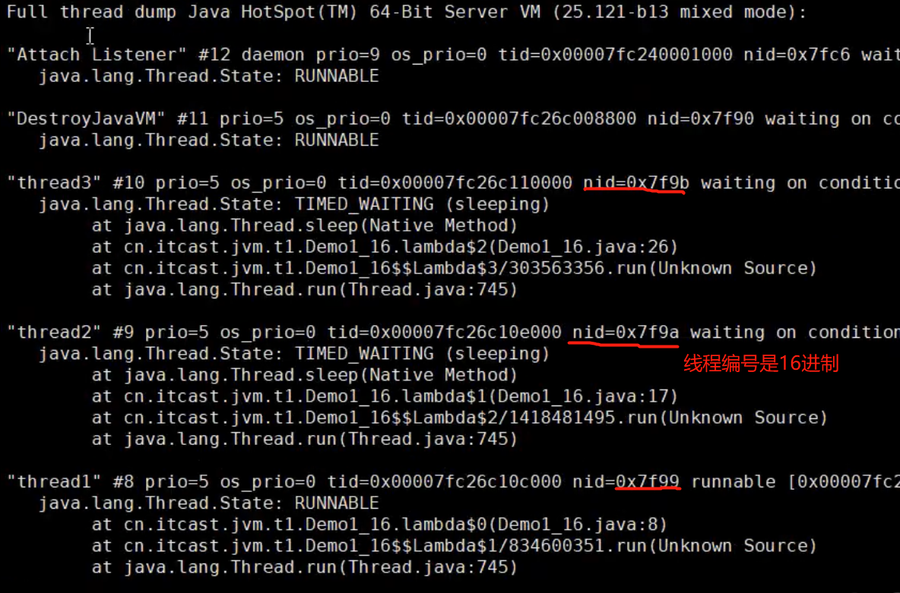


### 本地方法栈

本地方法：非java代码编写的方法。因为java代码不能直接与操作系统底层API打交道，需要c或c++。在java类中用native修饰的方法就是本地方法。

本地方法栈：给本地方法提供内存空间。


### 堆

堆中存放着非静态全局变量和对象的实际位置（即new的对象都放在这里）。

特点：

- 线程共享
- 存在垃圾回收机制

**tips**：`-Xmx` 可设置堆的大小


#### 堆内存诊断 

- jps 跟 jmap 命令
  
  - jps：查看当前系统中有哪些java进程
  - jmap：查看堆内存占用情况。一般使用 `jmap -heap pid` 命令查看对象进程的堆内存使用情况
  
  ```cmd
  C:\Users\jjs>jmap -heap 5932
  Attaching to process ID 5932, please wait...
  Debugger attached successfully.
  Server compiler detected.
  JVM version is 25.91-b15
  
  using thread-local object allocation.
  Parallel GC with 4 thread(s)
  
  Heap Configuration:
     MinHeapFreeRatio         = 0
     MaxHeapFreeRatio         = 100
     MaxHeapSize              = 1073741824 (1024.0MB)
     NewSize                  = 42991616 (41.0MB)
     MaxNewSize               = 357564416 (341.0MB)
     OldSize                  = 87031808 (83.0MB)
     NewRatio                 = 2
     SurvivorRatio            = 8
     MetaspaceSize            = 21807104 (20.796875MB)
     CompressedClassSpaceSize = 1073741824 (1024.0MB)
     MaxMetaspaceSize         = 17592186044415 MB
     G1HeapRegionSize         = 0 (0.0MB)
  
  Heap Usage:
  PS Young Generation
  Eden Space:
     capacity = 60293120 (57.5MB)
     used     = 44166744 (42.120689392089844MB)
     free     = 16126376 (15.379310607910156MB)
     73.25337285580842% used
  From Space:
     capacity = 5242880 (5.0MB)
     used     = 0 (0.0MB)
     free     = 5242880 (5.0MB)
     0.0% used
  To Space:
     capacity = 14680064 (14.0MB)
     used     = 0 (0.0MB)
     free     = 14680064 (14.0MB)
     0.0% used
  PS Old Generation
     capacity = 120061952 (114.5MB)
     used     = 19805592 (18.888084411621094MB)
     free     = 100256360 (95.6119155883789MB)
     16.496143590935453% used
  
  20342 interned Strings occupying 1863208 bytes.
  ```
  
- jconsole命令

  - jdk自带的查看堆内存情况的图形化界面，功能多，可以来连续监测

    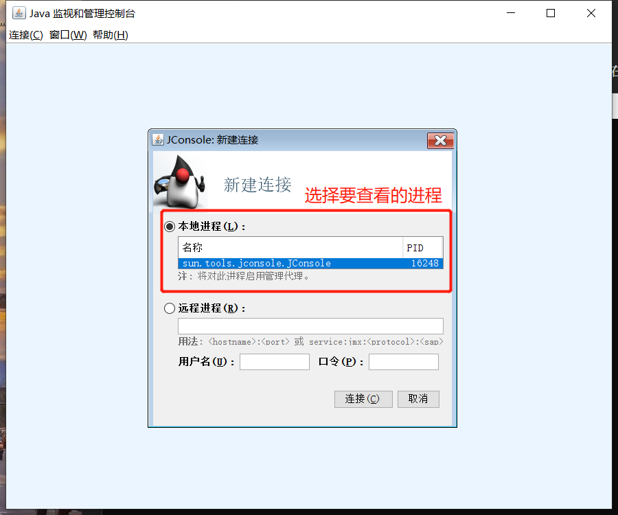

- jvisualvm 命令

  - 比jconsole更直观好用的可视化工具

    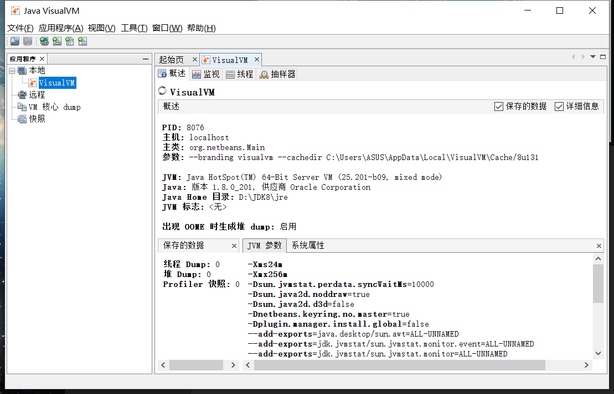


### 方法区

方法区是线程共享的，存储着类信息（构造方法/接口定义）、常量池以及静态域。

这里有个常量池需要解释一下，常量池不仅仅是存放常量（final修饰）的地方。

Java有三种常量池，即**字符串常量池、class文件常量池、运行时常量池**。

方法区只是个**概念**，具体的实现还需要根据每个厂商来决定。在1.8以前，**永久代**是方法区的实现，存在于jvm的内存结构中。1.8以后移除了永久代，取代它的是**元空间**。元空间存在于**本地内存**中，并且将运行时常量池中的字符串常量池部分从元空间移到了堆中。

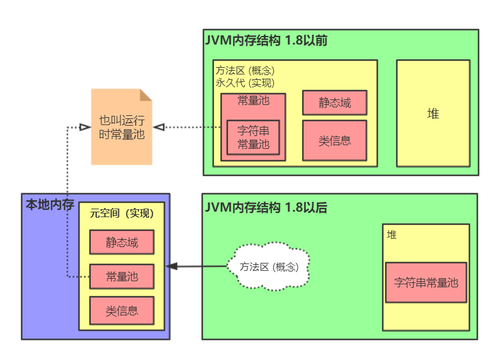


#### **1. class文件常量池**

class文件常量池指的就是二进制字节码文件（类信息）中的常量池，包含了要执行的类名、方法名、参数类型、字面量（final修饰的变量，基本类型的值等）等。


#### **2.运行时常量池**

当某个类被加载时，它的class文件常量池信息就会内存中，此时称为运行时常量池。图中的常量池就是运行时常量池。


#### **3.字符串常量池**

jvm中只有一个字符串常量池，它使用StringTable存放字符串常量。

问题来了？何为字符串常量，答：`“abc”` 这个就叫做字符串常量，而`new String("abc")` 并不是字符串常量。

**常见面试题**：

```java
String s1 = "a";
String s2 = "b";
String s3 = "ab";
String s4 = s1+s2; // 两个变量
String s5 = "a"+"b"; // 两个常量
String s6 = new String("ab");

System.out.println(s3 == s4); // false
System.out.println(s3 == s5); // true
System.out.println(s4 == s6); // false
System.out.println(s3 == s6.intern()); // true
```

s4 = s1+s2的底层实现为：new StringBuilder().append(“a”).append(“b”).toString()，而toString()方法的底层为new String()。所以s4实际为new String()，存在于堆中。

s5 = "a"+"b"，编译期间会优化直接变成“ab”，所以会直接去StringTable找“ab”。

【总结】两个字符串变量拼接使用StringBuilder，两个字符串常量拼接直接优化。


在jdk1.7后，`intern()`方法是尝试将调用的对象的值的引用放入StringTable中，然后返回。如果StringTable中已存在该值，则不会放入直接将StringTable中的值返回。

```java
String s3 = "ab";
String s6 = new String("ab");
System.out.println(s3 == s6.intern()); // true
```

因为字符串常量池中已存在ab，所以用s6的值去找的时候就会返回字符串常量池中的ab。

****

```java
String s7 = "a" + new String("b");
s7.intern();
System.out.println(s7 == "ab"); // true
```

第一步将a放入字符串常量池中，第二步将b放入字符串常量池中，接着创建字符串对象b（位于堆中），第三步a与b拼接，放入堆。也就是说现在字符串常量池有[ a, b ]，堆中有[ b, ab ]

然后调用intern方法将s7值的引用放入字符串常量中，此时字符串常量池有[ a, b, ab ]，堆中有[ b, ab ]，所以比较时候的ab是s7的值的引用，最后会找到s7。

如果把第二行注释掉，最后字符串常量池有[ a, b, ab ]，堆中有[ b, ab ]，但字符串常量池中的ab不是堆中的ab。

***

```java
String s8 = new String("ab");
System.out.println(s8 == "ab"); // false
```

第一步将ab放入字符串常量池中，第二步创建字符串对象ab放入堆中。此时字符串常量池有[ ab ]，堆中有[ ab ]。但是这两个ab不是一样的。

> 在jdk1.7之前，`intern()`判断值存不存在，若存在直接放该值；若不存在，先在字符串常量池中创建一份然后再返回。堆中的值跟常量池中的值始终不是同一个。


#### 4. StringTable介绍

StringTable底层是hashmap，其内部也会发生垃圾回收。

在1.8以前存在于运行时常量池中。1.8以后存在于堆中。

如果系统中字符串常量很多，可以使用 `-XX:StringTableSize=桶个数` 来设置hashmap的数组大小，以减少hash冲突。

如果系统中字符串很多，而且很多**重复**，可以使用intern方法让其进入StringTable，可大大降低内存开销。


### 直接内存

Java中的内存分为两个部分，一部分是直接内存，也被称为堆外内存；另一部分是jvm内存（由jvm管理）。**直接内存**就是把内存对象分配在JVM内存以外的内存区域，这部分内存不是虚拟机管理，而是由**操作系统**来管理，这样可以减少垃圾回收对应用程序的影响。

因为直接内存是由操作系统管理的，所以读写性能高，但分配回收成本较高。常通过NIO来进行操作这块区域。

> NIO（New input/output）是JDK1.4中新加入的类，引入了一种基于通道（channel）和缓冲区（buffer）的I/O方式，它可以使用Native函数库直接分配堆外内存，然后通过堆上的**DirectByteBuffer**对象对这块内存进行引用和操作。

```java
import sun.nio.ch.DirectBuffer;
import java.nio.ByteBuffer;

public class Main {
    public static void main(String[] args) throws Exception {
        // 分配直接内存的大小
        ByteBuffer bb = ByteBuffer.allocateDirect(1024 * 1024 * 128);
        Thread.sleep(10000);
        // 需手动清除直接内存
        ((DirectBuffer)bb).cleaner().clean();
        Thread.sleep(10000);
    }
}
```

在没有使用直接内存进行读写文件的情况下，需要将磁盘文件先读到系统缓冲区，然后jvm再从系统缓冲区读到java堆中的缓冲区。

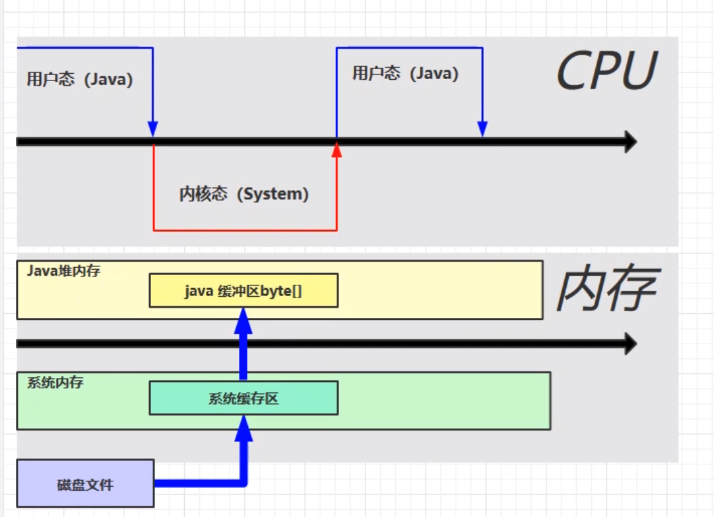

在使用直接内存进行读写文件的情况下，则可以直接将磁盘文件读取到直接内存，java堆内存跟系统内存都可以直接访问这块空间。

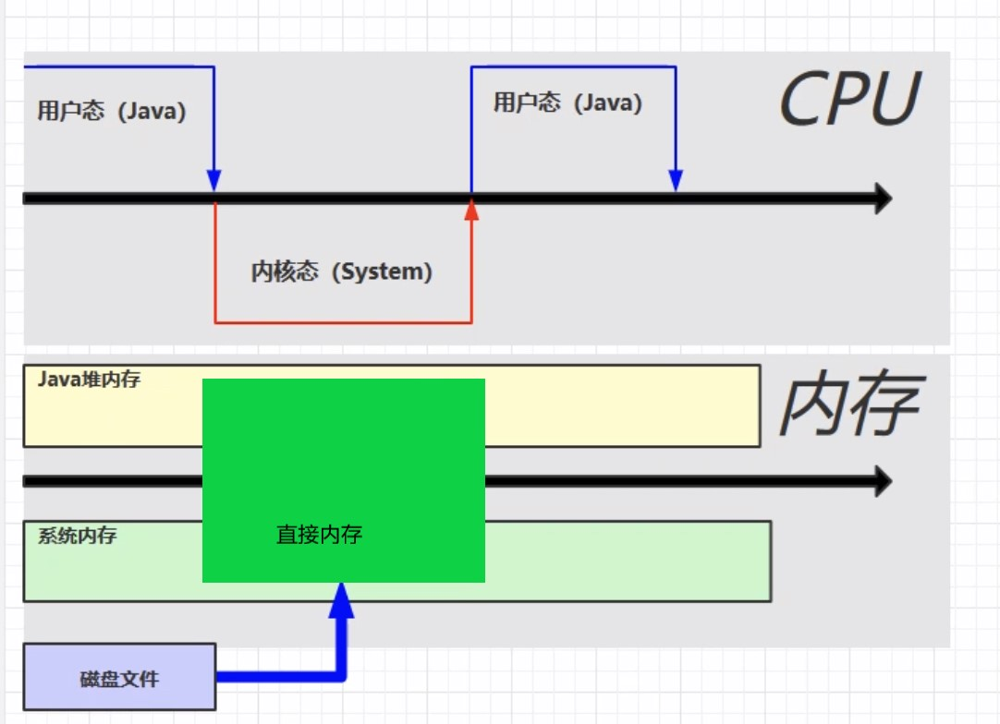


## 3. 垃圾回收

### 判断对象是否可回收

常用于判断对象是否可回收的算法有两种：引用计数法 跟 可达性分析。

**引用计数法**：每个对象都有一个计数属性，若此对象被其他变量引用一次，计数属性就加一，、、不再引用则减一。为0时表示该对象为可回收对象。这种方式有个弊端，就是a引用b，b引用a，这时就会出现内存泄露。

**可达性分析**：从GC Roots开始向下搜索，所走过的路径称为引用链。当一个对象到GC Roots没有任何引用链时，则说明此对象是可回收的。

那么问题来了，GC Roots是什么？GC Roots就是那些一定不是垃圾的对象。

常见的GC Roots有：

1. 虚拟机栈中引用的对象
2. 方法区中静态属性引用的对象
3. 方法区中常量引用的对象
4. JVM自动调用的方法中引用的对象


### 四种引用

在java中，引用现在被分为四个等级，分别为强引用，软引用，弱引用以及虚引用。

**强引用** 

如果一个对象具有强引用，它就不会被垃圾回收器回收。即使当前内存空间不足，JVM也不会回收它，而是抛出 `OutOfMemoryError` 错误，使程序异常终止。

平时代码中 ==对象的赋值== 都是强引用。如果想中断强引用跟某个对象的关联，可以显式地将引用赋值为null。

```java
String str = "hello";    // 强引用
str = null;              // 取消强引用
```

***

**软引用 SoftReference** 

一个对象仅仅被软引用时，如果内存的空间足够则该对象不会被回收。若内存空间不足时，软引用引用的对象才会被垃圾回收器回收。

> 软引用很适合做缓存。1

```java
SoftReference<String> softName = new  SoftReference<>("codekiang");
System.out.println(softName.get()); // codekiang
```

softName对象就是被软引用给引用了。虽然后面softName对象会被回收，但是软引用对象本身也会占用一点内存，此时可以**配合引用队列来释放软引用自身**。

```java
ReferenceQueue<String> queue = new ReferenceQueue<>();
// 软引用关联
SoftReference<String> softName = new SoftReference<>("codekiang", queue);
System.out.println("1:"+softName.get());
// 当软引用引用的对象被吗， 垃圾回收时，软引用对象会进入引用队列
// 从队列的中获取无用的软引用对象并移除（队列的头部开始取）
Reference<? extends String> poll = queue.poll();
// 如果队里有元素
while (poll != null){
    System.out.println("2:"+poll.get());
}
```

***

**弱引用 WeakRefernce**  

一个对象仅仅被弱引用引用时，只要发生垃圾回收，无论内存充不充足该对象都会被回收。跟软引用一样，可以配合引用队列来释放弱引用自身。

***

**虚引用 PhantomReference** 

如果一个对象与虚引用关联，则跟没有引用一样，在任何时候都可能被垃圾回收器回收。

要注意的是，**虚引用必须和引用队列关联使用**，当垃圾回收器准备回收一个对象时，如果发现它还有虚引用，就会把这个虚引用加入到与之关联的引用队列中，然后此对象的内存被回收之前可以采取必要的行动，如直接内存的释放。


### 回收算法

#### 标记清除

分为”标记“和”清除“两个阶段：首先标记出所有需要回收的对象，在标记完成后统一回收所有被标记的对象。

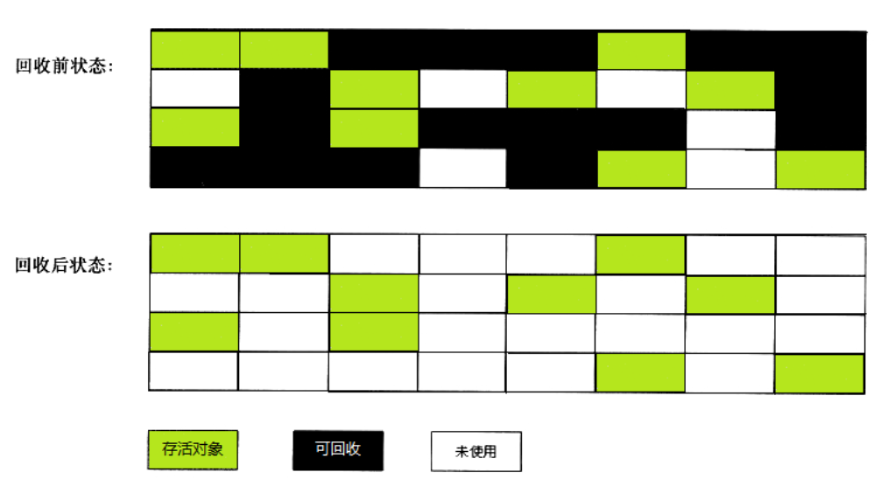

这里所谓的清除并不是真的置空,而是把**需要清除的对象地址保存在空闲的地址列表**里。下次有新对象需要加载时,判断空闲的位置空间是否足够,如果够,就存放。

优点：速度较快。

缺点：容易出现内存碎片。


#### 标记整理

在清除过程中把存活的对象都整理到一块，从而很大程度避免了内存碎片。

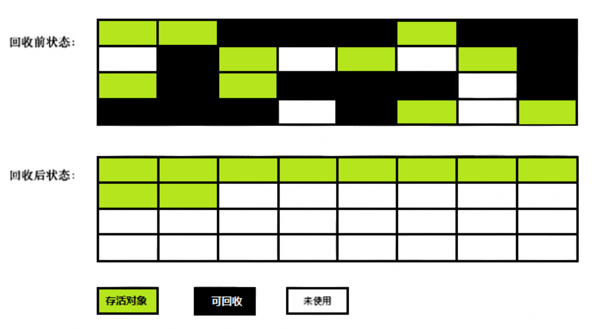

优点：避免出现内存碎片

缺点：由于整理过程中需要改变地址，所以耗时久。


#### 复制

把内存分为2块等同大小的内存空间（From和To），**存放对象的始终是From内存**，当From内存快不足以分配对象而引起垃圾回收时，就会把存活的对象从From内存块放到To内存块中，然后把From内存块中的对象全部清除，此时From内存块和To内存块进行角色互换。如此循环。

优点：避免出现内存碎片

缺点：占用两倍的内存，空间的使用率较低。


## 4. 分代收集算法

分代指的是把对象按辈分分代，不同辈分的对象在不同的位置。为什么要带分代？分代的唯一理由就是优化GC性能。

如果没有分代，所有的对象都在一块，GC的时候我们要找到哪些对象是垃圾，这样就要对堆的所有区域进行扫描。而往往我们的很多对象的生命周期都是很短的，用完就回收，没必要重复扫描他们这样性能很低。如果分代的话，我们可以把新创建的对象与使用率高的对象分开，当GC的时候先对存放新对象的区域进行回收，这样性能就会提高。

在JVM分代回收机制中，将堆内存分为年轻代和老年代，又将年轻代分为Eden区，Survivor区（分为Survivor From区跟Survivor To区），他们的比例默认为`8:1:1`。

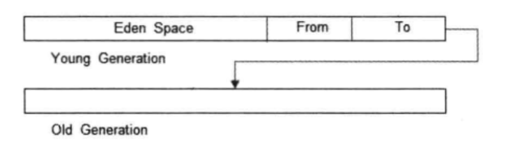

一般情况下，新创建的对象都会分配到Eden区，当Eden区内存不足时会发生GC（年轻代的GC叫 Minor GC，统称GC），在Eden区存活下来的对象都会通过 **复制算法** 移动到Survivor To区，然后To区跟From区互换角色。对象在Survivor区中每熬过一次Minor GC，年龄就会增加1岁，当它的年龄增加到一定程度时（最大15），就会被移动到老年代中。如果老年代的内存快要用完的时候会先进行Minor GC，如果还不够内存则会进行Full GC对全局进行垃圾回收。

引用网上的一段话来形容对象的一生：

> 我是一个普通的java对象，我出生在Eden区，在Eden区看到很多和我长的很像的小兄弟，我们在Eden区中玩了挺长时间。有一天Eden区中的人实在是太多了，我就被迫去了Survivor区的“From”区，自从去了Survivor区，我就开始漂泊了，有时候在Survivor的“From”区，有时候在Survivor的“To”区，居无定所。直到我15岁的时候，爸爸说我长大了，该去社会上闯闯了。于是我就去了老年代那边，那里人很多，并且年龄都挺大的，我在这里也认识了很多人，然后某一天就被回收了。

minor GC 跟 full GC的过程中会引发**STW**（stop the world），即在发生GC时暂停所有用户线程，让垃圾回收线程先执行完毕。因为**GC过程中对象的地址会发生改变**，如果不暂停其他用户线程，那么访问对象的时候会造成地址混乱。

***

**Minor GC触发机制**：
当Eden区内存不足时就会触发Minor GC。注意：只有Survivor内存不足时并**不会**引发GC。


**对象进入老年代的几种种情况：** 

1. 长期存活的对象会进入老年代
2. 大对象直接进入老年代：刚创建的对象的内存大于Eden区时，并且老年代内存空间足够的情况下会直接晋升到老年代。
3. 如果在From空间中，所有相同年龄的对象的大小总和大于Survivor空间的一半，那么大于等于该年龄的对象就会被移动到老年代


### GC相关参数

| 含义                               | 参数                                                         | 参数解读      |
| ---------------------------------- | ------------------------------------------------------------ | ------------- |
| 堆初始大小                         | -Xms                                                         | 例：-Xms8m    |
| 堆最大大小                         | -Xmx 或 -XX:MaxHeapSize=size                                 | 例：-Xmx8m    |
| 新生代大小<br>(初始跟最大同时指定) | -Xmn                                                         | 例：-Xmn8m    |
| 幸存区比例(动态)                   | -XX:InitialSurvivorRatio=ratio 和<br>-XX:+UseAdaptiveSizePolicy | +表示打开开关 |
| 幸存区比例                         | -XX:SurvivorRatio=ratio                                      |               |
| 晋升阈值                           | -XX:MaxTenuringThreshold=th                                  |               |
| 晋升详情                           | -XX:+PrintTenuringDistribution                               |               |
| GC详情                             | -XX:+PrintGCDetails -verbose:gc                              |               |
| FullGC前进行MinorGC                | -XX:+ScavengeBeforeFullGC                                    |               |


## 5. 垃圾回收器

> 前面我们介绍的所有回收算法都是为实现垃圾回收器服务的，而垃圾回收器就是内存回收的具体实现。

几个相关概念：

**并行收集**：指多条垃圾收集线程并行工作，但此时用户线程仍处于等待状态。

**并发收集**：指用户线程与垃圾收集线程同时工作（不一定是并行的可能会交替执行）。用户程序在继续运行，而垃圾收集程序运行在另一个CPU上。

**吞吐量**：即CPU运行用户代码的时间与CPU总消耗时间的比值（吞吐量 = 运行用户代码时间 / ( 运行用户代码时间 + 垃圾收集时间 )）。例如：虚拟机共运行100分钟，垃圾收集器花掉1分钟，那么吞吐量就是99%。


### 串行回收器

**特点**：单线程、单核CPU情况下高效。收集器进行垃圾回收时，必须暂停其他所有的用户线程，直到它结束（Stop The World）。适合堆内存较小，个人电脑。

串行（Serial）垃圾收集器有两种，Serial与Serial Old，一般两者搭配使用。新生代采用**Serial**，是利用**复制**算法；**老年代**使用Serial Old采用**标记-整理**算法。

使用`-XX:+UseSerialGC=Serial+SerialOld` 命令打开串行回收器。

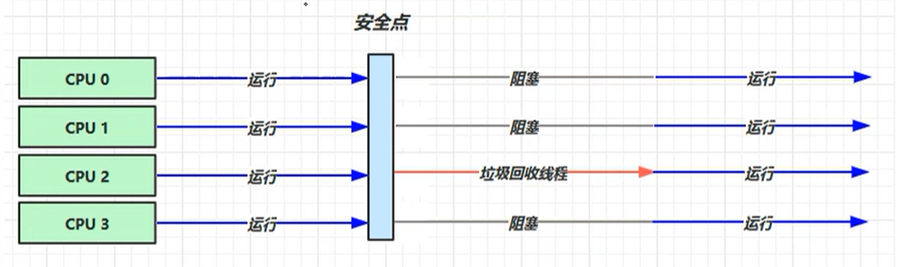


### 吞吐量优先回收器

吞吐量优先垃圾回收是多线程版本的串行回收器，即可以进行并行收集。==由Parallel Scavenge + Parallel Old 组成，是jdk1.8默认的垃圾回收器。== 

吞吐量要优先，那GC回收时间占比（ 1/(1+ratio) ）就要降低。

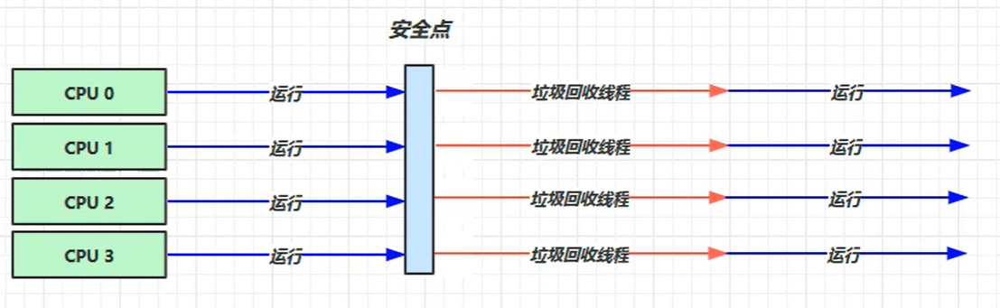


### CMS收集器

CMS（Concurrent Mark Sweep）收集器也叫响应时间优先收集器，是一种以获得**最短回收停顿**时间为目标的收集器。

> 吞吐量优先是使整个回收时间尽量的短；CMS是使每次回收时候的STW时间尽可能短。

CMS是使用标记-清除算法的。但是它比一般的标记-清除算法要复杂一些，分为以下4个阶段：

1. 初始标记：标记GC Roots能**直接关联**到的对象，会“Stop The World”。
2. 并发标记：GC Roots Tracing即从GC Roots开始，找到它引用的所有其它对象，此阶段可以和用户线程并发执行。
3. 重新标记：修正并发标记期间因用户程序继续执行而导致标记产生变动的那一部分对象的标记记录。执行时间相对并发标记短，会“Stop The World”。
4. 并发清除：清除对象,可以和用户线程并发执行。此时用户线程并发运行着，伴随程序运行自然还会有新的垃圾不断产生，这一部分垃圾（浮动垃圾）出现在标记过程之后，CMS无法在本次GC中处理掉它们，只能留到下一次GC时再清理掉。

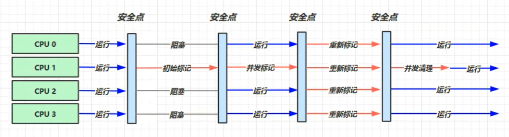

由于CMS是基于标记-清除算法的，所以就无法避免空间碎片的产生，加上CMS收集器无法处理浮动垃圾（Floating Garbage），所以可能出现“Concurrent Mode Failed”而导致**发生一次Full GC的产生**。


### G1收集器

> G1（Garbadge First）作为一款JVM最新的垃圾收集器，解决了CMS中因浮动垃圾太多而导致 Concurrent Mode Failed 的问题，在G1进行垃圾回收的时候完成内存压缩，降低内存碎片的生成。G1在**超大堆内存**的时候表现出比较**高的吞吐量**和**短暂的停顿时间**，而且已成为Java 9的默认收集器。

#### Region

G1的内存结构和传统的内存空间划分有一些不同。G1将内存划分成了多个大小相等的Region（大小只能是$2^n$），Region逻辑上连续，物理内存地址不连续。每个Region被标记成E、S、O、H，分别表示Eden、Survivor、Old、Humongous。其中E、S属于年轻代，O与H属于老年代。

Humongous表示大的对象。**当分配的对象大于等于Region大小的一半**的时候就会被认为是巨型对象。巨型对象默认分配在老年代，GC的时候不会对巨型对象进行拷贝。如果发现堆内存容不下巨型对象的时候，会触发一次GC操作。

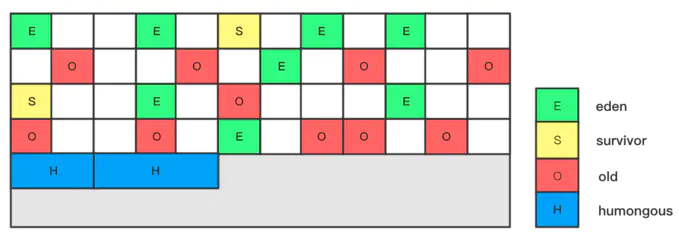


#### Card

在每个region内部又被分成了若干个大小为512Byte卡片(Card)，用于标识堆内存最小可用单位，分配的对象会占用物理上连续的若干个卡片。**每次对内存的回收，都是对指定分区的Card进行处理**。


#### GC模式

##### Young GC

Young GC 回收的是所有年轻代的Region，**当E区内存不足时触发**。

首先使用可达性分析算法找出存活对象，此时E区的存活对象会移动到S区，当S区空间不够的时候，E区的对象会直接晋升到O区，同时S区的数据移动到新的S区，如果S区的部分对象到达一定年龄，会晋升到O区。此过程**会出现STW。** 

这时，我们需要考虑一个问题，如果仅仅GC 新生代对象，我们如何找到所有的根对象呢？ 因为根对象可能存在于老年代或新生代中，如果都扫描这两个区域则会耗费大量的时间。于是，G1引进了RSet的概念。于是可以在扫描年轻代对象的同时会将 RS 的外部引用（对老年代的引用）作为扫描存活对象的入口。这样就可以在不用扫描O区的情况下，找出了所有的根。

> 它的全称是Remembered Set，为了**在回收垃圾region的时候不必对整个堆内存的对象进行扫描**（单个region中的对象可能被其他region中的对象引用）而引入了RS数据结构。RS使得G1可以在年轻代回收的时候不必去扫描老年代的对象，从而提高了性能。每一个region都对应一个RS，==RS保存了来自其他region内的对象对于此region的引用==。对于属于年轻代的region（E区和S区）来说，**RS只保存来自O区的对象的引用**。这是因为Young GC是针对全部年轻代的对象，即所有年轻代的对象之间的引用关系都会被完全扫描，所以RS不需要保存来自年轻代对象之间的引用。对于O区的RS来说，也只会保存来自O区对象的引用，这是因为老年代的回收之前会先进行年轻代的回收，G1会在回收过程中扫描年轻代对象到O区对象的引用。
>
> RS里的引用信息是怎么样填充和维护的呢？简而言之就是每个对象的引用关系发生改变时，JVM会把引用关系更新到RS中。但是这个RS的更新并不是实时的。G1维护了一个Dirty Card Queue。JVM会在引用关系发生改变时执行特殊的操作，即在dirty card queue中入队一个保存了对象引用信息的card。在年轻代回收的时候，G1会对Dirty Card Queue中所有的card进行处理，以更新RS，保证RS实时准确的反映引用关系。
>
> 那为什么不在引用赋值语句处直接更新RS呢？这是为了性能的需要，RS的处理需要线程同步，开销会很大，使用队列性能会好很多。


##### Mixed GC

Mixed GC也叫混合回收。之所以叫混合是因为它回收 **所有年轻代**的Region + **部分老年代**的Region。

==为什么是部分老年代的Region？== G1收集过程对停顿时间是有要求的，使用参数`-XX:MaxGCPauseMillis`指定这个停顿时间的值（默认值200ms），当然这只是一个期望值。G1的强大之处在于他有一个停顿预测模型，为了尽量满足停顿时间，他会有选择的挑选垃圾尽可能多的O区进行扫描，而不会每次都选择全部的O区。

==什么时候触发Mixed GC?==  当老年代占整个堆大小的百分比达到阈值时会触发。这个阈值默认为45%。`-XX:InitiatingHeapOccupancyPercent` 可设置这个阈值。


Mixed GC主要可以分为两个阶段：

**1. 全局并发标记**：

- 初始标记。它标记了从GC Root直接可达的对象。初始标记阶段跟young GC同时进行，因而没有额外的、单独的暂停阶段。
- 并发标记。从GC Roots开始，找到它引用的所有其它对象，此阶段可以和用户线程并发执行。
- 重新标记。修正在并发标记期间标记产生变动的那一部分对象的标记记录。使用SATB技术，此过程会“Stop The World”。
- 并发清除。如果发现region里都没有存活对象时，就会将其整体回收到可分配region列表中。

**2. 拷贝存活对象**：把一部分region里的活对象拷贝到空region里去（并行拷贝），然后回收原本的region的空间。这一部分的region也是根据G1的停顿预测模型来确定的。此过程会“Stop The World”。

> SATB的全称（Snapshot At The Beginning）字面意思是开始GC前存活对象的一个快照。SATB的作用是保证在**并发标记**阶段的正确性。
>
> 假设有对象A，B和C，一开始的时候B.c=C，A.c=null。当A先被扫描标记，接下来开始扫描B对象，此时标记线程被应用程序线程抢占后停下来，应用程序把A.c=C，B.c=null。当标记线程恢复执行的时候C对象已经脱离了B，但实际是存活的，这种情形被称作对象丢失。
>
> G1解决的方法是在对象引用被设置为空的语句时（比如B.c=null)，把原先指向的对象（C对象）保存到一个队列，代表它可能是存活的。然后会有一个重新标记（Remark）过程处理这些对象，重新标记过程是Stop-The-World的，所以可以保证标记的正确性。上述这种标记方法被称为开始时快照技术（SATB）。
>
> 这种方式会造成某些垃圾对象也被当做是存活的，所以G1会使得占用的内存比实际需要的内存大。


##### Full GC

G1的垃圾回收过程是和应用程序并发执行的，当Mixed GC的速度赶不上程序申请内存的速度的时候，Mixed GC就会降级到Full GC，使用的是Serial GC。Full GC会导致长时间的STW，应该要尽量避免。

导致G1 Full GC的原因可能有两个：

1. 拷贝存活对象的时候没有足够的Serviver To区存放对象；
2. 垃圾回收速度赶不上垃圾产生的速度。


JMM内存模型
===

JVM**内存结构**指的是JVM的内存分区；而JVM**内存模型**是一种虚拟机规范。

JMM定义了一套在多线程读写共享数据时，对数据的可见性、有序性和原子性的规则。同时也可以屏蔽掉不同操作系统中内存的差异性来保持并发的一致性。

- 可见性原则：多个线程访问同一变量时，其中一个线程对其修改后，其他线程应立即看到修改。
- 有序性原则：在执行程序时为了提高性能，编译器和处理器常常会对那些改变执行顺序之后对结果没有产生影响的指令进行重排序。多线程下会出现安全问题。
- 原子性原则：一条java语句可能有多条JVM指令执行，而原子性就是保证这些JVM指令要么同时成功要么同时失败。可以使用synchronize来保证原子性。

***

JMM将jvm内存抽象成主内存跟工作内存，共享变量处于主内存中，而每个线程需要的内存称为工作内存或本地内存。而每个工作内存都有一个存放共享变量副本的地方，只为了能更快速的对共享变量进行操作。

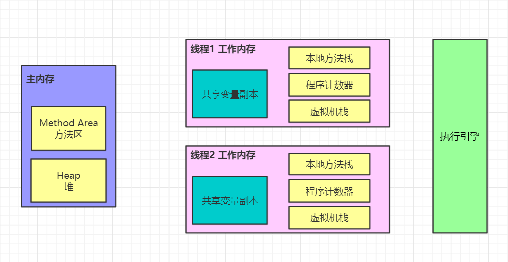

线程不能直接读写主内存的变量，而是只能操作自己工作内存中的变量，然后再同步到主内存中。主内存是多个线程共享的，线程之间不直接进行通信，如果线程间需要通信，必须借助主内存完成。


可见性
---

CPU中运行的线程从主存中拷贝共享数据到它的工作内存，并在之后对这个变量在工作内存中做了修改，但这个修改对运行在其他CPU中的线程是不可见的，因为这个修改还没有更新到主存中。要解决这个可见性问题，我们可以使用**volatile**关键字。

> volatile的作用：保证多个线程之间变量副本的相互可见性以及在指令序列中插入**内存屏障**禁止指令重排序。

了解volatile底层工作原理时需要先了解数据在底层时如何变化的。

关于一个变量如何从主内存拷贝到工作内存、如何从工作内存同步到主内存的实现细节，Java内存模型定义了以下八种操作来完成：

- **lock（锁定）**：作用于主内存的变量，把变量标识为线程独占状态。
- **unlock（解锁）**：作用于主内存变量，解除变量的线程独占状态标识。
- **read（读取）**：作用于主内存变量，把变量值从主内存传输到线程的工作内存中，等待load的执行。
- **load（载入）**：作用于工作内存的变量，把read操作得到的变量值载入工作内存的变量副本中，此时该变量可以正常使用。
- **use（使用）**：作用于工作内存的变量，把工作内存中的变量值传递给执行引擎。
- **assign（赋值）**：作用于工作内存的变量，把从执行引擎返回到的值赋值给工作内存的变量。
- **store（存储）**：作用于工作内存的变量，把工作内存中的变量的值传送到主内存中，等待write的执行。
- **write（写入）**：作用于主内存的变量，把store操作得到的变量值写入到主内存的变量中。

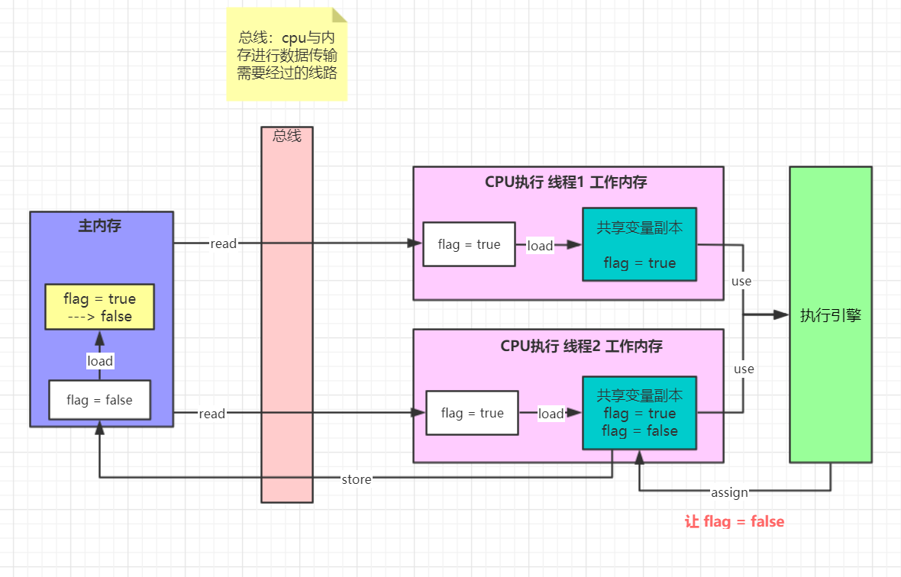

总线中有个`MESI缓存一致协议` ：当某个线程修改了共享副本里的数据同步回主内存时，一旦通过总线，总线会通知其他线程共享变量副本中的该变量失效，重新去主内存读取数据。

而volalite就是让总线**开启MESI缓存一致协议**，从而使变量可以及时的同步，实际就是变量一旦被修改就立马store跟write。

==store跟load的过程会加锁。== 


有序性
---

在执行程序时为了提高性能，编译器和处理器常常会对指令做重排序，指令重排序使得代码在**多线程**执行时会出现一些问题。

其中最著名的案例便是在**初始化单例时**由于**可见性**和**重排序**导致的错误。

案例1：

```java
public class Singleton {
    private static Singleton singleton;
    private Singleton() {}
    public static Singleton getInstance() {
        if (singleton == null) {
            singleton = new Singleton();
        }
        return singleton;
    }
}
```

在多线程的情况下，多个线程有可能会同时进入`if (singleton == null)` ，从而执行了多次`singleton = new Singleton()`，从而破坏单例。

***

案例2：

```java
public class Singleton {
    private static Singleton singleton;
    private Singleton() {
    }
    public static Singleton getInstance() {
        if (singleton == null) {
            synchronized (Singleton.class) {
                if (singleton == null) {
                    singleton = new Singleton();
                }
            }
        }
        return singleton;
    }
}
```

以上代码在检测到`singleton`为null后，会在同步块中再次判断，可以保证同一时间只有一个线程可以初始化单例。但仍然存在问题，原因就是Java中`singleton = new Singleton()`语句并不是一个**原子指令**，而是由三步组成：

1. 为对象分配内存
2. 初始化对象
3. 将对象的内存地址赋给引用

但是当经过**指令重排序**后，会变成：

1. 为对象分配内存
2. 将对象的内存地址赋给引用（会使得singleton != null）
3. 初始化对象

即线程A已经将内存地址赋给引用，但**实例对象并没有完全初始化**，同时线程B判断`singleton`已经不为null，就会导致B线程**访问到未初始化完全的变量**从而产生错误。

***

案例3：

```java
public class Singleton {
    // volatile修饰
    private static volatile Singleton singleton;
    private Singleton() {
    }
    public static Singleton getInstance() {
        if (singleton == null) {
            synchronized (Singleton.class) {
                if (singleton == null) {
                    singleton = new Singleton();
                }
            }
        }
        return singleton;
    }
}
```

以上代码对`singleton`变量添加了`volatile`修饰，可以阻止**局部指令重排序**。


JVM面试
===

对象的创建过程
---

1. 分配空间，给成员变量赋默认值
2. 调用构造方法，初始化对象
3. 将对象的内存地址赋给引用


对象一定分配在堆中吗？逃逸分析？
---

不一定。**因为JVM通过逃逸分析，能够分析出一个新对象的使用范围，并以此确定是否要将这个对象分配到堆上**。

何为**逃逸分析**？简单点说就是判断一个方法内的局部变量是否逃离了本方法的作用域内。比如这个局部变量是**形参**或者**函数返回值** 则可能被其他线程修改，或者这个局部变量引用了对象，并且该对象逃离了方法的作用域，则可能是非线程安全的。

如果没有逃逸出去的对象，则JVM会把它分配到栈中，这样可以减少垃圾回收的频率。

逃逸分析的好处：

1. 栈上分配对象，可以降低垃圾回收的频率。
2. 同步消除，如果发现某个对象只能从一个线程可访问，那么在这个对象上的操作可以不需要同步（对于synchronized而言）。


对象在内存中的存储布局
---

对象在内存中的存储布局为：markword、 类型指针、实例数据和对齐。如果是数组则会多一个数组长度。

- markword 和 类型指针 组成对象头。
  - markword记录了锁信息、gc信息和hashcode值。
  - 类型指针指向了这个类的类型
- 实例数据就是成员变量
- 对齐作为补充位，使对象的内存大小可以被8整除

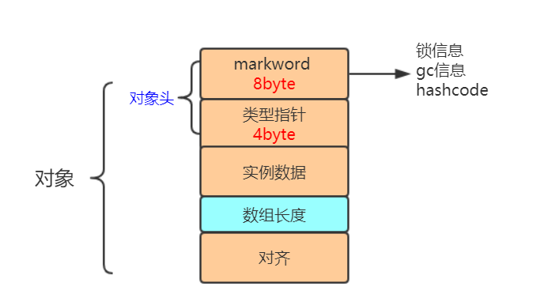

其中markword一般为8个字节、类型指针占4个字节。

那么问题来了？`Object o = new Object();` 占多少字节。

因为对象头占了12字节，实例数据0字节，因为要凑齐8的倍数，所以对齐占4字节。所以这个o对象占16字节。


对象怎么定位
---

1. 句柄：Java 堆中将会划分出一块内存来作为句柄池，此时reference存储的就是对象的句柄地址，而句柄中包含了对象实例数据与对象类型数据的具体地址信息

   gc的时候，对象的地址改变时，reference的指向不用改变。

2. 直接指针： reference存储的直接就是对象的地址。

   访问速度快。


synchronized原理
---

synchronized并非一开始就给对象加上重量级锁，而是从偏向锁，轻量级锁（自旋锁），再到重量级锁升级的过程。

锁可以升级但不能降级。

synchronized的优化过程与markword的最低的三位有关。

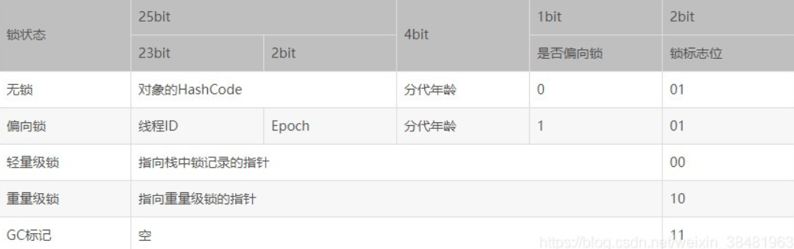


### 偏向锁

当锁对象第一次被线程获取的时候，虚拟机把对象头中的 偏向锁标志位 设置为“1”，锁标记位 设置为“01”，同时使用CAS操作把这个线程ID 记录在对象的MarkWord中。如果CAS操作成功，持有这把锁的线程以后每次都可以直接进入这个锁。操作失败则表示还有其他线程对这个对象进行操作，此时会撤销偏向锁，升级为轻量级锁。


### 轻量级锁

虚拟机首先在当前线程的栈帧中建立一个名为 锁记录（Lock Record）的空间，用于存储锁对象当前的MarkWord的拷贝。然后JVM会尝试使用 CAS操作 将 markWord 更新为指向栈帧中的锁记录的空间指针。

如果更新成功，那么这个线程就拥有了该对象的锁，并且将标志位转变为“00”，表示此对象处于轻量级锁定状态；

如果更新失败，该线程会进行CAS操作不断的去尝试获取锁，当CAS操作达到一定数量的时候会升级为重量级锁。

> 在不断进行CAS的时候会消耗CPU资源，所以CAS不能操作太多次。


### 重量级锁

Synchronized的重量级锁是通过对象内部的监视器锁（monitor）来实现的，监视器锁本质又是依赖于操作系统的Mutex Lock（互斥锁）来实现的。此时竞争失败的线程就会进入==阻塞状态，不耗费CPU资源==。**阻塞或者唤醒一个线程时，需要从用户态切换到内核态**，切换成本非常高。

> 内核态：拥有最高的访问权限，CPU可以访问内存所有数据, 包括外围设备, 例如硬盘, 网卡。
>
> 用户态：只能受限的访问内存。


### 锁消除

锁消除是指去掉不可能发生竞争的数据的锁。


### 锁粗化

如果虚拟机检测到有一串零碎的操作都对同一个对象加锁，将会把加锁同步的范围扩展（粗化）到整个操作序列的外部。


### 可重入锁的实现

> 锁的可重入是指 当一个线程获得一个对象锁后，再次请求该对象锁时可以获得该对象锁。比如synchronized方法里面又调用了synchronized方法。

每个锁都会关联一个线程持有者和一个计数器。当计数器为0时表示该锁没有被任何线程持有，那么任何线程都可能获得该锁。当一个线程请求成功后，JVM会记下持有锁的线程，并将计数器计为1。此时其他线程请求该锁，则必须等待。而该持有锁的线程如果再次请求这个锁，就可以再次拿到这个锁，同时计数器会递增。当线程退出一个synchronized方法/块时，计数器会递减，如果计数器为0则释放该锁。