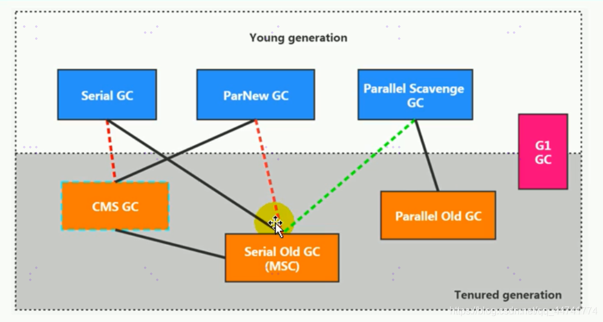
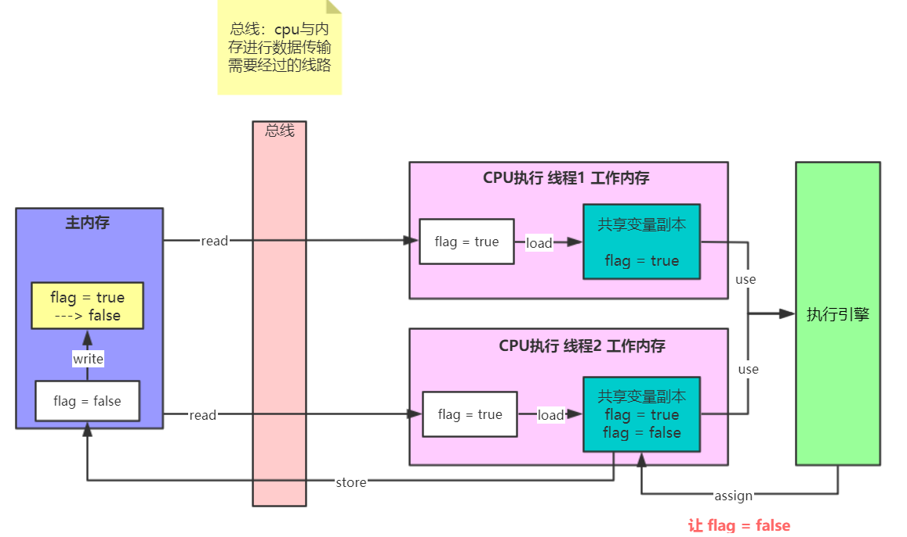
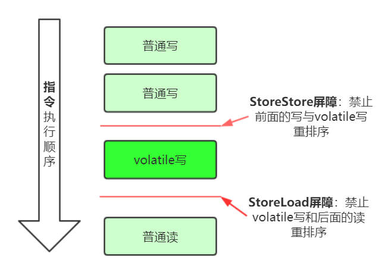
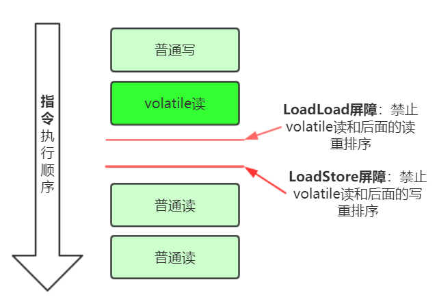
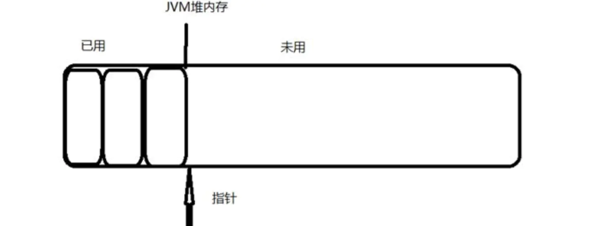
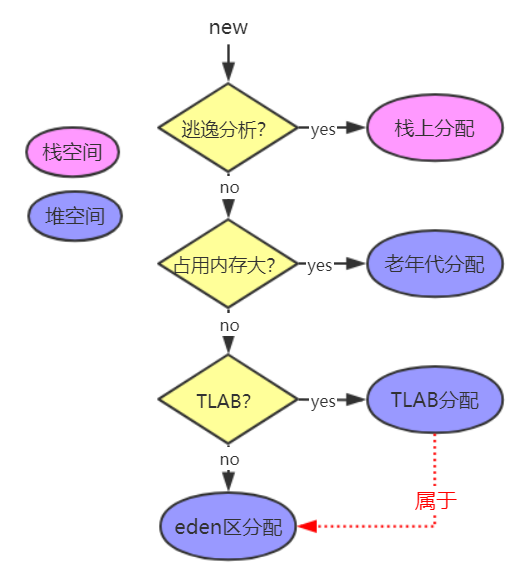
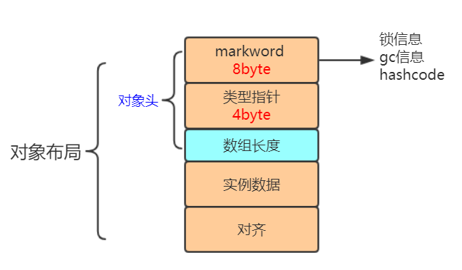
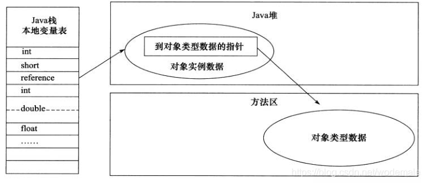

JVM学习日记
===

## 1.什么是JVM？

JVM：Java Virtual Machine的简写。是java程序的运行环境（字节码文件的运行环境）。

**好处**：

- 使java程序可以一次编写，到处运行。
- 提供了垃圾自动回收功能


### JVM、JRE、JDK的区别

JRE：java运行时环境，是Java Runtime Environment的简写。

JDK：java开发工具，是Java Development Kit的简写。


### JVM整体体系


类加载器：将java文件加载到jvm。

java内存结构：内存结构也叫**运行时数据区**。是JVM对内部存储区域的一种划分方式，从逻辑存储上来支持class文件的运行。包括堆，方法区，程序计数器，虚拟机栈，本地方法栈。

执行引擎：从内存或者运行时数据区中获取相关数据来执行，执行后在把数据返还。

本地方法接口：调用底层操作系统提供的功能方法。


### 类的加载过程

人们常说的"Class文件"并非特指某个存在于磁盘中的文件，而是一串**二进制字节流**。

一个类从被加载到虚拟机内存中开始，到移除内存，整个生命周期将会经历：加载、校验、准备、解析、初始化、使用、卸载。这七个步骤会依次开始，但并不会等待上一个步骤结束才进行下一个步骤。在特殊情况下，解析阶段会在初始化阶段之后开始，为了支持Java语言的动态绑定特性。

> 类加载过程为：加载 -> 连接（校验、准备、解析）-> 初始化


#### 加载

类加载器根据类的全限定名称获取类的二进制字节流，将二进制字节流所代表的**静态存储结构**转化为方法区的**运行时数据结构**，最后在内存中生成一个代表此类的`java.lang.Class`对象，作为这个类在方法区的访问入口。

对于数组而言，情况有些不同，数组类本身不通过类加载器创建，而是由虚拟机在内存中动态创建，但数组的元素类型仍然依赖类加载器完成加载。一个数组类的创建过程遵循以下规则：

- 如果数组C的元素类型是引用类型，则加载该类型的时候，数组C会被标识在<u>加载该类型的类加载器</u>的类名称空间上。
- 如果数组C的元素类型不是引用类型（如int[]的int），则加载该类型的时候，数组C会被标识在<u>启动类加载器</u>的类名称空间上。
- 数组类的可访问性与它的元素类型的可访问性一致，如果元素类型不是引用类型，则数组类的访问性默认为public。


#### 校验

确保被加载的Class文件字节流中包含的信息符合虚拟机规范的要求以及保证这些信息被当成代码运行后不会危害虚拟机-+

自身的安全校验阶段大致分为四个阶段：文件格式校验、元数据校验、字节码校验和符号引用校验。

- 文件格式验证：基于二进制字节流，验证字节流是否符合class文件规范，如是否以魔数0xCAFEBABE开头。
- 元数据验证：基于方法区的存储结构，对类的元数据信息进行语义分析，保证其满足虚拟机的要求，如检查final修饰的类是否有子类、类中的属性、方法是否与父类产生矛盾等
- 字节码验证：基于方法区的存储结构，对类的方法体进行校验，保证语法是合法的。如类型转换是否有效，跳转的指令是否超过方法体的范围等。
- 符号引用验证：基于方法区的存储结构，在符号引用转化为直接引用的时候发生，即**发生在解析阶段**。对常量池中的各种符号引用进行校验，如通过类全限定名是否可以找到对应的类、判断符号引用是否可以被当前类访问等。


#### 准备

为类的**静态变量**分配空间并且赋予零值（如`int i;`此时i的零值为0），为类的**静态常量**分配空间并且赋予初始值。


#### 解析

将常量池的符号引用变成直接引用。

- 符号引用：描述所引用目标的一组符号。引用的目标不一定是已经加载到虚拟机内存当中的内容。与虚拟机实现的内存布局无关。
- 直接引用：直接指向目标的指针或者定位到目标的句柄。引用的目标必定是已经加载到虚拟机内存当中的内容。


#### 初始化

初始化阶段就是执行 类构造器`<clinit>()`方法 的过程，主要是给类的静态变量赋初始值。如果有static代码块就执行static代码块中定义的所有操作。如果父类的static代码块没有执行则**优先执行**父类的static代码块。

> JVM必须确保一个类在初始化的过程中，只能允许一个线程对其执行初始化操作，其他线程都需要阻塞等待。

对于初始化阶段，以下情况必须立即对类进行初始化（加载、校验等也需要在初始化前进行）：

1. 使用new关键字实例化对象时。
2. 读取或设置一个类的静态字段时（被final修饰的静态字段除外）。
3. 调用一个类的静态方法时。
4. 使用reflect包的方法对一个类进行反射调用的时候。
5. 初始化类时，如果其父类没有初始化过，则需要先对其父类进行初始化。但接口除外，只有真正用到父接口的时候（如引用接口中定义的常量）才会初始化父接口。
6. 当虚拟机启动时，会初始化主类。
7. 一个接口包含default方法，此接口的实现类进行初始化时，该接口需要在其之前初始化。

以上情况称为对某个类型的进行**主动引用**。除此之外，当调用某个类型的所有方法和属性都不会触发其初始化时，称为**被动引用**。

1. 通过子类引用父类的静态字段，不会导致子类初始化。

   ```java
   public static void main(String[] args){
       // a是在SubClass的父类中定义的静态字段
       System.out.println(SubClass.a);
   }
   ```

2. 通过数组定义类引用类，不会触发此类的初始化。

   ```java
   public static void main(String[] args){
       // a是在SubClass的父类中定义的静态字段
       SubClass[] ss = new SubClass[10];
   }
   ```

3. 在编译阶段，常量会从 定义常量的类中 存入到 调用类的常量池，本质上没有直接引用到定义常量的类，因此不会触发定义常量的类的初始化。


### 类加载器

> 启动类加载器是用C++写的，在java中的表示为null。

类加载器（ClassLoader）用来加载 Java 类到 Java 虚拟机中。基本上所有的类加载器都是 `java.lang.ClassLoader` 类的一个实例。

java.lang.ClassLoader类的基本职责就是**根据类的全限定名称**，找到或者生成其对应的字节码文件，然后从这些字节码文件中定义出一个 Java 类，即该类的Class对象。除此之外，ClassLoader还负责加载 Java 应用所需的资源，如图像文件和配置文件等。

***

在Java中包含着三层加载器：

- 启动类加载器（BootstrapClassLoader）：是 ExtClassLoader 的父类加载器，所谓父类加载器并不是直接的继承关系，而是在`ClassLoader parent`属性中指定。默认加载 `%JAVA_HOME%/lib` 目录下的核心类库。
- 扩展类加载器（ExtensionClassLoader）：是 AppClassLoader 的父类加载器，默认加载`%JAVA_HOME%/lib/ext` 下所有的类库。
- AppClassLoader：是自定义加载器的父类加载器，负责加载`classpath下的文件` 

> 类库指的就是java包中的类。

***

为了完成加载类的职责，ClassLoader提供了一系列的方法：

| 方法                                                 | 说明                                                         |
| ---------------------------------------------------- | ------------------------------------------------------------ |
| getParent()                                          | 返回该类加载器的父类加载器                                   |
| loadClass(String name)                               | 加载名称为name的类，返回的结果是java.lang.Class类的实例      |
| findClass(String name)                               | 查找名称为name的类，返回的结果是java.lang.Class类的实例      |
| findLoadedClass(String name)                         | 在已经被加载过的类中查找name类，返回的结果是java.lang.Class类的实例 |
| defineClass(String name, byte[] b, int off, int len) | 把字节数组b中的内容转换成 Java 类，返回的结果是 java.lang.Class类的实例。这个方法被声明为final的 |
| resolveClass(Class c)                                | 链接指定的 Java 类                                           |

每一个类加载器，都拥有一个独立的**类名称空间**。对于任意一个类，都是由加载它的类加载器和这个类本身来确定唯一性的，即**如果相同的class文件被不同的加载器所加载就属于不同的类**。

> 比较两个类是否相等，只有在这两个类是由同一个类加载器加载的前提下才有意义。


### 双亲委派机制

每个类加载器都有自己的缓存空间和加载路径，加载一个类的时候会从AppClassLoader 开始向上查找每个加载器的缓存，判断缓存中是否加载了该类（**findLoadedClass**），如果加载了则直接返回，若到了BootstrapClassLoader（**parent == null**）都没有找到，则会查找 BootstrapClassLoader 的加载路径是否包含该类（**findClass**），如果包含则直接返回，否则继续往下查找，直到找到为止。

这就是**双亲委派机制**， 向上找缓存，向下找加载路径。

好处：

1. 避免了类的重复加载
2. 保证了安全性

***

双亲委派机制的java实现（每个类加载器都是以loadClass方法开始加载类）

```java
protected Class<?> loadClass(String name, boolean resolve)
    throws ClassNotFoundException
{
    synchronized (getClassLoadingLock(name)) {
        // 1、检查请求的类是否已经被加载过了
        Class c = findLoadedClass(name);
        // 没有被加载过
        if (c == null) {
            try {
                if (parent != null) {
                    c = parent.loadClass(name, false);
                } else {
                    c = findBootstrapClassOrNull(name);
                }
            } catch (ClassNotFoundException e) {
            }
            // 在父类加载器无法加载的时候，再调用本身的findClass方法来进行类加载
            if (c == null) {
                c = findClass(name);
            }
        }
        if (resolve) {
            resolveClass(c);
        }
        return c;
    }
}
```

> 综上，只要重写**loadClass**方法，在里面实现自己的加载逻辑，就可以破坏**双亲委派机制**。


### 动态加载类的两种方式

动态加载类有两种方式：**反射** 跟 **类加载器**。

1. 反射：

   ```java
   Class student = Class.forName("com.load.Student");
   student.newInstance();
   ```

2. 类加载器

   ```java
   Class student = ClassLoader.getSystemClassLoader().loadClass("com.load.Student");
   student.newInstance()
   ```

> **new关键字实例化** 的方式和 **反射** 的方式 使用的都是当前类加载器，即this.getClass.getClassLoader，只能在当前类路径或者导入的类路径下寻找类。而**ClassLoader** 方式可以从使用双亲委派机制寻找类。
>
> `Class.forName`的方式动态加载类时，会立即对该类进行初始化。而`ClassLoader`加载类时不会立即对类进行初始化。


### 自定义类加载器

> 继承ClassLoader，重新findClass方法，在该方法中读取字节码文件并使用defineClass构建java类即可。

```java
class MyClassLoader extends ClassLoader {
    private String classPath;

    public MyClassLoader(String classPath) {
        this.classPath = classPath;
    }

    private byte[] loadByte(String name) throws Exception {
        name = name.replaceAll("\\.", "/");
        FileInputStream fis = new FileInputStream(classPath + "/" + name
                + ".class");
        int len = fis.available();
        byte[] data = new byte[len];
        fis.read(data);
        fis.close();
        return data;
    }

    protected Class<?> findClass(String name) throws ClassNotFoundException {
        try {
            // 读取字节码文件
            byte[] data = loadByte(name);
            // 返回java类
            return defineClass(name, data, 0, data.length);
        } catch (Exception e) {
            e.printStackTrace();
            throw new ClassNotFoundException();
        }
    }
}
```


## 2. JVM 内存结构

### 程序计数器

jvm指令交给解释器执行成机器码后会交给CPU执行，而程序计数器的作用就是**记住下一条jvm指令的执行地址**。

特点：

- 线程私有
- 唯一一个不会出现内存溢出的区域


### 虚拟机栈

虚拟机栈：每个线程运行方法时需要的内存空间。

每次调用方法都将该方法压入栈中，每个方法运行时在栈中需要的内存称为**栈帧**。正在执行的方法对应的栈帧称为**活动栈帧**。

每个新线程都会开辟属于自己的虚拟机栈，也就是说虚拟机栈是线程私有的，里面放的都是局部变量，记录着返回值、返回地址等。

**tips**：`-Xss` 可设置虚拟机栈的大小，如`-Xss10m` 将虚拟机栈设为10m

- [ ] 问题：方法内的局部变量是否线程安全？
  1. 如果这个局部变量是**形参**或者**函数返回值**，那么可能是非线程安全的。
  2. 如果这个局部变量引用了对象，并且该对象逃离了方法的作用域，则可能是非线程安全的。


#### 栈帧

每一个栈帧都包括了局部变量表、操作数栈、动态连接、方法返回地址和一些额外的附加信息。

一个栈帧需要分配多少内存，不会受到程序运行期变量数据的影响，而仅仅取决于具体的虚拟机实现。

**局部变量表（Local Variable Table）** 

- 存储方法参数和方法内的局部变量。
- 局部变量表的容量以 <u>变量槽</u> 为最小单位，每个变量槽占用长度由具体虚拟机决定。基本类型数据、对象引用占用一个变量槽，long 和 double 需要两个。
- 如果执行的是实例方法，那么局部变量表中的第0个变量槽默认是方法所属对象实例的引用（this）。其他参数按照顺序排列。

**操作数栈（Operand Stack）** 

- 临时存放方法执行过程中用到的变量值，如方法参数的传递、返回结果的存放；也会经常进行入栈出栈操作，例如算术运算。

**动态链接（Dynamic Linking）** 

- 每个栈帧都包含一个指向 运行时常量池 中该栈帧所属方法的引用。

**返回地址（Return Address） ** 

- 返回到上一个方法的调用的地方。方法开始执行后只有两种方式可以退出：方法返回指令，异常退出。

**附加信息** 

- 存放一些虚拟机规范里没有的描述信息，例如与调试、性能收集相关的信息。


#### 线程运行诊断

案例1：判断CPU占用大

1. top命令查看各个进程占用cpu的情况，找出占用cpu最多的进程。
2. ps命令查看该进程下的各个线程占用cpu情况
   - `ps -eo pid,tid,%cpu | grep pid`  -eo 后面跟要显示的信息；grep pid是过滤出pid的进程
3. `jstack pid` 查看当前java进程的各线程状态
   - 根据第二步查询到的线程编号查找该进程中对应的线程（需将十六进制转为十进制）
   - 


### 本地方法栈

本地方法：非java代码编写的方法。因为java代码不能直接与操作系统底层API打交道，需要c或c++。==在java类中用native修饰的方法就是本地方法==。

本地方法栈：给本地方法提供内存空间。


### 堆

堆中存放着“几乎”所有的对象实例（即new的对象大部分都放在这里）。Java堆可以处于物理上不连续的内存空间中，但在逻辑上他是连续的。

> 因为**非静态成员变量**随着对象的建立而建立，随着对象的消失而消失，存在于对象所在的**堆内存**中。

从垃圾回收角度来看，堆中划分了eden区、servivor区（包含From和To区）还有old区，年轻代都在eden区和servivor区，达到一定年龄的对象会进入old区。

从分配内存的角度来看，堆中可以划分成多个线程私有的分配缓冲区（简称TLAB，后面会介绍到），用以提升对象分配时的效率。

特点：

- 线程共享
- 存在垃圾回收机制

**tips**：`-Xmx` 可设置堆的大小


#### 堆内存诊断 

- jps 跟 jmap 命令
  
  - jps：查看当前系统中有哪些java进程
  - jmap：查看堆内存占用情况。一般使用 `jmap -heap pid` 命令查看对象进程的堆内存使用情况
  
  ```bash
  C:\Users\jjs>jmap -heap 5932
  Attaching to process ID 5932, please wait...
  Debugger attached successfully.
  Server compiler detected.
  JVM version is 25.91-b15
  
  using thread-local object allocation.
  Parallel GC with 4 thread(s)
  
  Heap Configuration:
     MinHeapFreeRatio         = 0
     MaxHeapFreeRatio         = 100
     MaxHeapSize              = 1073741824 (1024.0MB)
     NewSize                  = 42991616 (41.0MB)
     MaxNewSize               = 357564416 (341.0MB)
     OldSize                  = 87031808 (83.0MB)
     NewRatio                 = 2
     SurvivorRatio            = 8
     MetaspaceSize            = 21807104 (20.796875MB)
     CompressedClassSpaceSize = 1073741824 (1024.0MB)
     MaxMetaspaceSize         = 17592186044415 MB
     G1HeapRegionSize         = 0 (0.0MB)
  
  Heap Usage:
  PS Young Generation
  Eden Space:
     capacity = 60293120 (57.5MB)
     used     = 44166744 (42.120689392089844MB)
     free     = 16126376 (15.379310607910156MB)
     73.25337285580842% used
  From Space:
     capacity = 5242880 (5.0MB)
     used     = 0 (0.0MB)
     free     = 5242880 (5.0MB)
     0.0% used
  To Space:
     capacity = 14680064 (14.0MB)
     used     = 0 (0.0MB)
     free     = 14680064 (14.0MB)
     0.0% used
  PS Old Generation
     capacity = 120061952 (114.5MB)
     used     = 19805592 (18.888084411621094MB)
     free     = 100256360 (95.6119155883789MB)
     16.496143590935453% used
  
  20342 interned Strings occupying 1863208 bytes.
  ```
  
- jconsole命令

  - jdk自带的查看堆内存情况的图形化界面，功能多，可以用来连续监测

    

- jvisualvm 命令

  - 比jconsole更直观好用的可视化工具

    


### 方法区

方法区是线程共享的，存储着被虚拟机加载的类信息（构造方法/接口定义）、常量池以及静态域。方法区的回收目标主要是<u>针对常量的回收</u> 和 <u>对类型的卸载</u>，当方法区无法满足新的内存需求时，会抛出OutOfMemoryError异常。

> 针对常量的回收跟回收堆中的对象类似，当没有任何一个对象引用此常量时，此常量会被回收。
>
> 而判断一个类型是否需要卸载就比较麻烦了，需要同时满足以下三个条件：
>
> - 该类所有的实例都已经被回收
> - 该类的Class对象没有被引用
> - 加载该类的类加载器已经被回收

这里有个常量池需要解释一下，常量池不仅仅是存放常量（final修饰）的地方。

Java有三种常量池，即**字符串常量池、class文件常量池、运行时常量池**。

方法区只是个**概念**，具体的实现还需要根据每个厂商来决定。在1.8以前，**永久代**是方法区的实现，存在于jvm的内存结构中。1.8以后移除了永久代，取代它的是**元空间**，位于**本地内存**中，并且将运行时常量池中的 字符串常量池 从元空间移到了堆中。


#### **1. class文件常量池**

class文件常量池指的就是二进制字节码文件（类信息）中的常量池，包含了要执行的类名、方法名、参数类型、字面量（final修饰的变量，基本类型的值等）等。


#### **2.运行时常量池**

当某个类被加载时，它的class文件常量池信息就会在加载到内存中，此时称为运行时常量池。图中的常量池就是运行时常量池。


#### **3.字符串常量池**

jvm中只有一个字符串常量池，它使用StringTable存放字符串常量。

问题来了，何为字符串常量？答：`“abc”` 这个就叫做字符串常量，而`new String("abc")` 并不是字符串常量。

**常见面试题**：

```java
String s1 = "a";
String s2 = "b";
String s3 = "ab";
String s4 = s1+s2; // 两个变量
String s5 = "a"+"b"; // 两个常量
String s6 = new String("ab");

System.out.println(s3 == s4); // false
System.out.println(s3 == s5); // true
System.out.println(s4 == s6); // false
System.out.println(s3 == s6.intern()); // true
```

s4 = s1+s2的底层实现为：`new StringBuilder().append("a").append("b").toString()`，而toString() 的底层为new String()。所以s4实际为new String()，存在于堆中。

s5 = "a"+"b"，编译期间会优化直接变成“ab”，所以会直接去StringTable找“ab”。

【总结】至少有一个**字符串变量**拼接使用StringBuilder，两个**字符串常量**拼接直接优化。


#### 4.intern解析

在jdk1.7后，`intern()`方法是尝试将调用的对象的值的引用放入StringTable中，然后返回。如果StringTable中已存在该值，则不会放入直接将StringTable中的值返回。

```java
String s3 = "ab";
String s6 = new String("ab");
System.out.println(s3 == s6.intern()); // true
```

因为字符串常量池中已存在ab，所以用s6的值去找的时候就会返回字符串常量池中的ab。

****

```java
String s7 = "a" + new String("b");
s7.intern();
System.out.println(s7 == "ab"); // true
```

第一步将a放入字符串常量池中，第二步将b放入字符串常量池中，接着创建字符串对象b（位于堆中），第三步a与b拼接，放入堆。也就是说现在字符串常量池有[ a, b ]，堆中有[ b, ab ]

然后调用intern方法将s7值的引用放入字符串常量中，此时字符串常量池有[ a, b, ab ]，堆中有[ b, ab ]，所以比较时候的ab是s7的值的引用，最后会找到s7。

如果把第二行注释掉，最后字符串常量池有[ a, b, ab ]，堆中有[ b, ab ]，但字符串常量池中的ab不是堆中s7的ab，而是常量“ab”的ab。

***

```java
String s8 = new String("ab");
System.out.println(s8 == "ab"); // false
```

第一步将ab放入字符串常量池中，第二步创建字符串对象ab放入堆中。此时字符串常量池有[ ab ]，堆中有[ ab ]。但是这两个ab不是一样的。

> 在jdk1.7之前，`intern()`判断值存不存在，若存在直接放该值；若不存在，先在字符串常量池中创建一份然后再返回。堆中的值跟常量池中的值始终不是同一个。


#### 5. StringTable介绍

StringTable底层是**hashmap**，其内部也**会发生垃圾回收**。

在1.8以前存在于运行时常量池中。1.8以后存在于堆中。

如果系统中字符串常量很多，可以使用 `-XX:StringTableSize=桶个数` 来设置hashmap的数组大小，以减少hash冲突。

如果系统中字符串很多，而且很多**重复**，可以使用intern()让其进入StringTable，可大大降低内存开销。


### 直接内存

Java中的内存分为两个部分，一部分是直接内存，也被称为堆外内存；另一部分是jvm内存（由jvm管理）。**直接内存**就是把内存对象分配在JVM内存以外的内存区域，这部分内存不是虚拟机管理，而是由**操作系统**来管理，这样可以减少垃圾回收对应用程序的影响。

因为直接内存是由操作系统管理的，所以读写性能高，但分配回收成本较高。常通过NIO来进行操作这块区域。

> NIO（New input/output）是JDK1.4中新加入的类，引入了一种基于通道（channel）和缓冲区（buffer）的I/O方式，它可以使用Native函数库直接分配堆外内存，然后通过堆上的**DirectByteBuffer**对象对这块内存进行引用和操作。

```java
import sun.nio.ch.DirectBuffer;
import java.nio.ByteBuffer;

public class Main {
    public static void main(String[] args) throws Exception {
        // 分配直接内存的大小
        ByteBuffer bb = ByteBuffer.allocateDirect(1024 * 1024 * 128);
        Thread.sleep(10000);
        // 需手动清除直接内存
        ((DirectBuffer)bb).cleaner().clean();
        Thread.sleep(10000);
    }
}
```

在没有使用直接内存进行读写文件的情况下，需要将磁盘文件先读到系统缓冲区，然后jvm再从系统缓冲区读到java堆中的缓冲区。


在使用直接内存进行读写文件的情况下，则可以直接将磁盘文件读取到直接内存，java堆内存跟系统内存都可以直接访问这块空间。


## 3. 垃圾回收

### 判断对象是否可回收

常用于判断对象是否可回收的算法有两种：引用计数法 跟 可达性分析。

**引用计数法**：每个对象都有一个计数属性，若此对象被其他变量引用一次，计数属性就加一，不再引用则减一，为0时表示该对象为可回收对象。这种方式有个弊端，就是a引用b，b引用a，这时就会出现内存泄露。

**可达性分析**：从GC Roots开始向下搜索，所走过的路径称为引用链。当一个对象到GC Roots没有任何引用链时，则说明此对象是可回收的。

那么问题来了，==GC Roots是什么==？GC Roots就是那些一定不是垃圾的对象。

常见的**GC Roots**有：

1. 栈中引用的对象
2. 方法区中静态属性引用的对象
3. 方法区中常量引用的对象
4. JVM自动调用的方法中引用的对象
5. Native方法中引用的对象
6. 被同步锁（synchronized关键字）持有的对象

> 在进行根节点枚举或在垃圾回收的时候，为了防止对象的移动，需要暂停用户程序，这个行为叫做 "**Stop The World**"。


#### OopMap

除了以上固定的GC Roots集合外，还可以有其他对象临时的加到GC Roots中（比如执行方法时局部变量A引用了对象B，此时变量A为GC Root，而对象B是不能被回收的），面对这个问题，==要如何高效查找出所有GC Roots==？

HotSpot中采用 `OopMap`  (Ordinary object pointer Map) 这个数据结构来**记录栈中引用类型的位置**，这样GC的时候只需要扫描OopMap中的数据即可，而无需对整个栈上内存进行扫描。


#### 安全点

通过OopMap 可以快速进行GC Root枚举，但是在方法执行的过程中， 可能会导致引用关系发生变化，那么保存的OopMap就要随着变化。如果每次引用关系发生了变化都要去修改OopMap的话，这又是一件成本很高的事情。所以这里就引入了**安全点**的概念。

一个线程为一个栈，一个栈由多个栈桢组成，一个栈桢对应一个方法，一个方法有多个**安全点**。GC发生时，程序首先运行到最近的一个安全点停下来，然后更新自己的OopMap，记录栈上哪些位置代表着引用。枚举根节点时，遍历每个栈桢的OopMap，通过栈中记录的对象内存地址找到这些对象（GC Roots）

“安全点”的标准：不能让程序长时间执行。主要位于： 

1. 循环的末尾 
2. 方法临返回前 / 调用方法的call指令后 
3. 可能抛异常的位置


#### 安全区域

安全点的使用似乎解决了OopMap计算的效率问题，但是这里还有一个问题。程序需要自己跑到安全点位置，那么不执行的线程（比如那些处在Sleep或者Blocked状态的线程）可能并不会在很短的时间内跑到安全点去中断挂起自己。所以这里为了解决这个问题，引入了安全区域的概念。

**安全区域** 就是在程序的一段代码片段中，引用关系不会发生变化，即在这段代码区域内任何地方进行GC都是没有问题的。

线程执行的过程中，如果进入到安全区域内，就会标志自己已经进行到安全区域了。那么虚拟机进行GC的时候，就不会管这些已经运行到安全区域的线程，当线程要脱离安全区域的时候，要自己检查系统是否已经完成了GC或者根节点枚举，如果完成了就继续执行；如果未完成，它就必须等待收到可以安全离开安全区域的信号为止。


### 四种引用

在java中，引用现在被分为四个等级，分别为强引用，软引用，弱引用以及虚引用。

**强引用** 

如果一个对象具有强引用，它就不会被垃圾回收器回收。即使当前内存空间不足，JVM也不会回收它，而是抛出 `OutOfMemoryError` 错误，使程序异常终止。

平时代码中 ==对象的赋值== 都是强引用。如果想中断强引用跟某个对象的关联，可以显式地将引用赋值为null。

```java
String str = "hello";    // 强引用
str = null;              // 取消强引用
```

***

**软引用 SoftReference** 

一个对象与软引用关联时，如果内存的空间足够则该对象不会被回收。若内存空间不足时，软引用引用的对象才会被垃圾回收器回收。

> 软引用很适合做缓存。

```java
SoftReference<String> softName = new  SoftReference<>("codekiang");
System.out.println(softName.get()); // codekiang
```

softName对象与软引用关联。虽然后面softName对象会被回收，但是软引用对象本身也会占用一点内存，此时可以**配合引用队列来释放软引用自身**。

```java
ReferenceQueue<String> queue = new ReferenceQueue<>();
// 软引用关联
SoftReference<String> softName = new SoftReference<>("codekiang", queue);
System.out.println("1:"+softName.get());
// 当软引用引用的对象被吗， 垃圾回收时，软引用对象会进入引用队列
// 从队列的中获取无用的软引用对象并移除（队列的头部开始取）
Reference<? extends String> poll = queue.poll();
// 如果队里有元素
while (poll != null){
    System.out.println("2:"+poll.get());
}
```

***

**弱引用 WeakRefernce**  

一个对象仅仅与弱引用关联时，只要发生垃圾回收，无论内存充不充足该对象都会被回收。跟软引用一样，也可以配合引用队列来释放弱引用自身。

***

**虚引用 PhantomReference** 

如果一个对象与虚引用关联，则跟没有引用一样，无法通过虚引用来获得一个对象实例，在任何时候都可能被垃圾回收器回收。

为一个对象设置虚引用关联的唯一目的只是为了能在这个对象被回收的时候收到一个系统通知。因此**虚引用必须和引用队列关联使用**，当垃圾回收器准备回收一个对象时，如果发现它还有虚引用，就会把这个虚引用加入到与之关联的引用队列中，然后此对象的内存被回收之前可以采取必要的行动，如直接内存的释放。


### 回收算法

#### 标记清除

分为”标记“和”清除“两个阶段：首先标记出所有需要回收的对象，在标记完成后统一回收所有被标记的对象。


这里所谓的清除并不是真的置空,而是把**需要清除的对象地址保存在空闲的地址列表**里。下次有新对象需要加载时,判断空闲的位置空间是否足够,如果够,就存放。

缺点：

- 执行效率不稳定，若大部分对象都需要被回收，需要进行大量的标记和清除动作。

- 容易出现内存碎片。


#### 标记-复制

把内存分为2块等同大小的内存空间，每次只使用其中一块内存，当这块内存用完了，就将还存活的对象复制到另外一块上面，然后把之前那块内存一次清空。

缺点：

- 可用内存缩小一半，空间的使用率较低。
- 不适合对象存活率高的情况


#### 标记整理

首先标记出所有需要回收的对象，在标记完成后统一把存活的对象都整理到一块，从而很大程度避免了内存碎片。


优点：避免出现内存碎片

缺点：由于整理过程中需要改变地址，所以耗时久。


4.分代回收算法
---

分代指的是把对象按辈分分代，不同辈分的对象在不同的位置。为什么要带分代？分代的唯一理由就是优化GC性能。

如果没有分代，所有的对象都在一块，GC的时候我们要找到哪些对象是垃圾，这样就要扫描堆的所有区域。而往往很多对象的生命周期是很短的，用完就回收，没必要重复扫描他们。如果分代的话，我们可以把新创建的对象跟使用率高的对象分开，当GC的时候先对新对象的区域进行回收，这样性能就会提高。

在JVM分代回收机制中，将堆内存分为年轻代和老年代，又将年轻代分为Eden区，Survivor区（分为Survivor From区跟Survivor To区），他们的比例默认为`8:1:1`。


一般情况下，新创建的对象会分配到Eden区，当Eden区内存不足时会发生GC（年轻代的GC叫 Minor GC，统称GC），在Eden区存活下来的对象都会通过 **复制算法** 移动到Survivor To区，然后To区跟From区互换角色。对象在Survivor区中每熬过一次Minor GC，年龄就会增加1岁，当它的年龄增加到一定程度时（最大15），就会被移动到老年代中。如果老年代的内存快要用完的时候会先进行Minor GC，如果还不够内存则会进行Full GC对全局进行垃圾回收。

<u>引用网上的一段话来形容对象的一生</u>：

> 我是一个普通的java对象，我出生在Eden区，在Eden区看到很多和我长的很像的小兄弟，我们在Eden区中玩了挺长时间。有一天Eden区中的人实在是太多了，我就被迫去了Survivor区的“From”区，自从去了Survivor区，我就开始漂泊了，有时候在Survivor的“From”区，有时候在Survivor的“To”区，居无定所。直到我15岁的时候，爸爸说我长大了，该去社会上闯闯了。于是我就去了老年代那边，那里人很多，并且年龄都挺大的，我在这里也认识了很多人，然后某一天被回收了。

minor GC 跟 full GC的过程中会引发**STW**（stop the world），即**在发生GC时暂停所有用户线程，让垃圾回收线程先执行完毕**。因为**GC过程中对象的地址会发生改变**，如果不暂停其他用户线程，那么访问对象的时候会造成地址混乱。

> 为避免产生混淆，在这里统一说明：
>
> - 部分收集（Partial GC）：对堆的部分区域进行垃圾回收。
>   - 新生代收集（Minor GC/Young GC）：对新生代进行垃圾回收
>   - 老年代收集（Major GC/Old GC）：只对老年代进行垃圾回收。目前只有CMS收集器会单独收集老年代行为。
>   - 混合收集（Mixed GC）：对整个新生代以及部分老年代进行垃圾回收。目前只有G1有这种行为。
> - 整堆收集（Full GC）：对整个堆和方法区进行垃圾回收。


### Minor GC触发机制

 当Eden区内存不足时就会触发Minor GC。

【注意】**只有Survivor内存不足时并不会引发GC。**


### 对象进入老年代的几种情况

1. 长期存活的对象会进入老年代
2. 大对象直接进入老年代。刚创建的对象的内存大于指定阈值时，并且老年代内存空间足够的情况下会直接晋升到老年代。
3. 如果在From空间中，所有相同年龄的对象的大小总和大于Survivor空间的一半，那么大于等于该年龄的对象就会被移动到老年代


### GC相关参数

| 含义                               | 参数                                                         | 参数解读      |
| ---------------------------------- | ------------------------------------------------------------ | ------------- |
| 堆初始大小                         | -Xms                                                         | 例：-Xms8m    |
| 堆最大大小                         | -Xmx 或 -XX:MaxHeapSize=size                                 | 例：-Xmx8m    |
| 新生代大小<br>(初始跟最大同时指定) | -Xmn                                                         | 例：-Xmn8m    |
| 幸存区比例(动态)                   | -XX:InitialSurvivorRatio=ratio 和<br>-XX:+UseAdaptiveSizePolicy | +表示打开开关 |
| 幸存区比例                         | -XX:SurvivorRatio=ratio                                      |               |
| 晋升阈值                           | -XX:MaxTenuringThreshold=th                                  |               |
| 晋升详情                           | -XX:+PrintTenuringDistribution                               |               |
| GC详情                             | -XX:+PrintGCDetails -verbose:gc                              |               |
| FullGC前进行MinorGC                | -XX:+ScavengeBeforeFullGC                                    |               |


5.垃圾回收器
------------

前面我们介绍的所有回收算法都是为实现垃圾回收器服务的，而垃圾回收器就是内存回收的具体实现。

> 几个相关概念：
>
> **并行收集**：指多条垃圾收集线程并行工作，但此时用户线程仍处于等待状态。
>
> **并发收集**：指用户线程与垃圾收集线程同时工作（不一定是并行的可能会交替执行）。用户程序在继续运行，而垃圾收集程序运行在另一个CPU上。
>
> **吞吐量**：即CPU运行用户代码的时间与CPU总消耗时间的比值（吞吐量 = 运行用户代码时间 / ( 运行用户代码时间 + 垃圾收集时间 )）。例如：虚拟机共运行100分钟，垃圾收集器花掉1分钟，那么吞吐量就是99%。

各款经典收集器之间的关系如下所示：



上图展示了七种作用域不同分代的收集器，如果两个收集器之间存在连线就说明这两者可以搭配使用（虚线表示从jdk9之后不再可以搭配）。可以看出上部分的收集器只负责收集新生代区域，下部分只负责回收老年代区域，而G1收集器可以回收整个堆。

**新生代收集器**：Serial、ParNew、Parallel Scavenge

**老年代收集器**：CMS、Serial Old、Parallel Old

**整堆收集器**： G1


### Serial 收集器

Serial收集器是最基本的、发展历史最悠久的收集器。

**特点：**单线程、简单高效（与其他收集器的单线程相比），对于限定单个CPU的环境来说，Serial收集器由于没有线程交互的开销，专心做垃圾收集自然可以获得最高的单线程手机效率。收集器进行垃圾回收时，必须暂停其他所有的工作线程，直到它结束（Stop The World）。

**应用场景**：适用于Client模式下的虚拟机。

**Serial / Serial Old** 收集器运行示意图


### ParNew 收集器

ParNew收集器其实就是Serial收集器的多线程版本。

**特点**：多线程、ParNew收集器默认开启的收集线程数与CPU的数量相同，在CPU非常多的环境中，可以使用-XX:ParallelGCThreads参数来限制垃圾收集的线程数。

**应用场景**：ParNew收集器是许多运行在Server模式下的虚拟机中首选的新生代收集器，因为它是除了Serial收集器外，唯一一个能与CMS收集器配合工作的。

**ParNew/Serial Old** 组合收集器运行示意图如下：


### Parallel Scavenge 收集器

与吞吐量关系密切，故也称为吞吐量优先收集器。

**特点**：属于新生代收集器也是采用复制算法的收集器，又是并行的多线程收集器（与ParNew收集器类似）。但该收集器关注的是吞吐量，所以该收集器GC的时候自适应调节堆中各个分区的比例来保证高吞吐量。

Parallel Scavenge收集器使用两个参数控制吞吐量：

- XX:MaxGCPauseMillis 控制最大的垃圾收集停顿时间
- XX:GCRatio 直接设置吞吐量的大小。.

**Parallel Scavenge/Parallel Old** 收集器工作过程图：


> **Parallel Scavenge + Parallel Old 的组合是jdk1.8默认的垃圾回收器** 


### CMS收集器

CMS（Concurrent Mark Sweep）收集器也叫响应时间优先收集器，是一种以获得**最短回收停顿**时间为目标的收集器。

> 吞吐量优先是使整个回收时间尽量的短；CMS是使每次回收时候的STW时间尽可能短。

CMS是使用**标记-清除**算法的。但是它比一般的标记-清除算法要复杂一些，分为以下4个阶段：

1. 初始标记：标记GC Roots能**直接关联**到的对象，会“Stop The World”。
2. 并发标记：从GC Roots开始，找到它引用的所有其它对象，此阶段可以和用户线程并发执行。
3. 重新标记：修正并发标记期间因用户程序继续执行而导致标记产生变动的那一部分对象的标记记录。执行时间远比并发标记短，会“Stop The World”。
4. 并发清除：清除以上步骤标记的死亡对象，可以和用户线程并发执行。清理的同时与用户线程并发运行着，伴随程序运行自然还会有新的垃圾不断产生，这一部分垃圾（称为**浮动垃圾**）出现在标记过程之后，CMS无法在本次GC中处理掉它们，只能留到下一次GC时再清理掉。


由于CMS是基于标记-清除算法的，所以就无法避免空间碎片的产生，加上CMS收集器无法处理浮动垃圾（Floating Garbage），所以可能出现“Concurrent Mode Failed”而导致**发生一次耗时长的Full GC的产生**，此时使用ParNew/Serial Old 收集器进行收集。

也正因为会产生浮动垃圾，所以需要预留一部分空间供并发清除时的程序运行，一般是老年代达到一定百分比的时候会触发CMS收集器。可以通过参数`-XX:CMSInitiatingOccu-pancyFration` 设置CMS触发的百分比。


### G1收集器

G1（Garbadge First）作为一款JVM最新的垃圾收集器，解决了CMS中因浮动垃圾太多而导致 Concurrent Mode Failed 的问题，在G1进行垃圾回收的时候完成内存压缩，降低内存碎片的生成。G1在超大堆内存的时候表现出比较高的吞吐量和短暂的停顿时间，而且已成为**Java 9的默认收集器**。

G1的强大之处在于他有一个**停顿预测模型**，为了尽量满足GC的停顿时间，他会有选择的回收垃圾最多收益最大的区域，而不会每次针对年龄进行回收，这就是G1的Mixed CG模式。


#### Region

G1的内存结构和传统的内存空间划分有一些不同。G1将内存划分成了多个大小相等的Region（大小只能是$2^n$），Region逻辑上连续，物理内存地址不连续。每个Region被标记成E、S、O、H，分别表示Eden、Survivor、Old、Humongous。其中E、S属于年轻代，O与H属于老年代。在G1的世界里，新生代和老年代所占堆的空间是没那么固定的（会动态根据「最大停顿时间」进行调整）

Humongous表示大的对象。**当分配的对象超过Region大小的一半**的时候就会被认为是巨型对象。巨型对象默认分配在老年代，GC的时候不会对巨型对象进行拷贝。如果发现堆内存容不下巨型对象的时候，会触发一次GC操作。


#### Card

在每个region内部又被分成了若干个大小为512Byte卡片(Card)，用于标识堆内存最小可用单位，分配的对象会占用物理上连续的若干个卡片。**每次对内存的回收，都是对指定Region中的Card进行处理**。


#### GC模式

##### Young GC

Young GC 回收的是**所有年轻代**的Region，==当E区内存不足时触发==。

首先使用可达性分析算法找出存活对象，此时E区的存活对象会移动到S区，当S区空间不够的时候，E区的对象会直接晋升到O区，同时S区的数据移动到新的S区，如果S区的部分对象到达一定年龄，会晋升到O区。此过程**会出现STW。** 

这时，我们需要考虑一个问题，如果仅仅GC 新生代对象，我们如何找到所有的根对象呢？ 因为根对象可能存在于老年代或新生代中，如果都扫描这两个区域则会耗费大量的时间。于是，G1引进了Remembered Set的概念。


##### Remembered Set

它的全称是Remembered Set，其作用是**记录从非收集区域指向收集区域的指针集合的抽象数据结构**。在G1中，每一个region都对应一个RS，RS的作用是记录**来自其他region内的对象对于此region内对象的引用**，使得G1可以在年轻代回收的时候不必去扫描整个老年代的对象，从而提高了性能。

G1的RS在存储结构的本质上是个HashMap，key是其他region的起始地址，value是一个集合，记录了其他region中哪些card中的对象指向了本region中的对象。正因为存在RS结构，所以G1收集器要比其他传统垃圾收集器有着更高的内存占用负担。

对于属于年轻代的region（E区和S区）来说，**RS只保存来自O区的对象的引用**。这是因为Young GC是针对全部年轻代的对象，即所有年轻代的对象之间的引用关系都会被完全扫描，所以RS不需要保存来自年轻代对象之间的引用。对于O区的RS来说，也只会保存来自O区对象的引用，这是因为老年代的回收之前会先进行年轻代的回收，G1会在回收过程中扫描年轻代对象到O区对象的引用。

RS里的引用信息是怎么样填充和维护的呢？

简而言之就是每个对象的引用关系发生改变时，JVM会把引用关系更新到RS中。但是这个RS的更新并不是实时的，G1维护了一个Dirty Card Queue。JVM会在引用关系发生改变时，在dirty card queue中入队一个保存了对象引用信息的card。在年轻代回收的时候，G1会对Dirty Card Queue中所有的card进行处理，更新RS。

那为什么不在引用赋值语句处直接更新RS呢？

这是为了性能的需要，RS的处理需要线程同步，开销会很大，使用队列性能会好很多。


##### Mixed GC

Mixed GC也叫混合回收。之所以叫混合是因为它回收 **所有年轻代**的Region + **部分老年代**的Region。

==为什么是部分老年代的Region？== G1收集过程对停顿时间是有要求的，使用参数`-XX:MaxGCPauseMillis`指定这个停顿时间的值（默认值200ms），当然这只是一个期望值。

==什么时候触发Mixed GC?==  当老年代占整个堆大小的百分比达到阈值时会触发。这个阈值默认为45%。`-XX:InitiatingHeapOccupancyPercent` 可设置这个阈值。


Mixed GC主要运行过程大致如下：

- **初始标记**。仅仅标记GC Root能直接关联的对象。初始标记阶段跟young GC同时进行，因而没有额外的暂停阶段。
- **并发标记**。从GC Roots开始，找到它引用的所有其它对象，此阶段可以和用户线程并发执行。使用SATB技术记录下此过程中引用发生改动的对象。
- **重新标记**。修正在并发标记期间标记产生变动的那一部分对象的标记记录。此过程会“Stop The World”。
- **筛选回收**。根据用户所期望的停顿时间来指定回收计划，尽可能多的回收性价比高的region，把这部分region中的存活对象拷贝到空region里去，然后回收原本的region的空间（并行操作），此过程会“Stop The World”。如果发现某个region里都没有存活对象时，就会将其整体回收到可分配region列表中。


##### Full GC

G1的垃圾回收过程是和应用程序并发执行的，当Mixed GC的速度赶不上程序申请内存的速度的时候，Mixed GC就会降级到Full GC，使用的是Serial GC。Full GC会导致长时间的STW，应该要尽量避免。

导致G1 Full GC的原因可能有两个：

1. 拷贝存活对象的时候没有足够的Serviver To区存放对象；
2. 垃圾回收速度赶不上垃圾产生的速度。


JMM内存模型
===

JVM**内存结构**指的是JVM的内存分区；而JVM**内存模型**是一种虚拟机规范。

JMM定义了一套在多线程读写共享数据时，对数据的可见性、有序性和原子性的规则。同时也可以屏蔽掉不同操作系统中内存的差异性，从而保持并发的一致性。

- 可见性原则：多个线程访问同一变量时，其中一个线程对其修改后，其他线程应立即看到修改。
- 有序性原则：在执行程序时为了提高性能，编译器和处理器常常会对那些改变执行顺序之后对结果没有产生影响的指令进行重排序。多线程下会出现安全问题。
- 原子性原则：一条java语句可能有多条JVM指令执行，而原子性就是保证这些JVM指令要么同时成功要么同时失败。

***

JMM将jvm内存抽象成主内存跟工作内存，共享变量处于主内存中，而每个线程需要的内存称为工作内存或本地内存。而**每个工作内存都有一个存放共享变量副本的地方**，只为了能更快速的对共享变量进行操作。


线程不能直接读写主内存的变量，而是只能操作自己工作内存中的变量，然后再同步到主内存中。主内存是多个线程共享的，线程之间不直接进行通信，如果线程间需要通信，必须借助主内存完成。


可见性
---

一个线程从主存中拷贝共享数据到它的工作内存，若之后对这个变量做了修改，那么这个修改对其他线程是不可见的，因为这个修改还没有更新到主存中。要解决这个可见性问题，我们可以使用**volatile**关键字。

> volatile的作用：保证多个线程之间变量副本的相互可见性 以及 在指令序列中插入**内存屏障**禁止指令重排序。 

JMM 定义了 8 个操作来完成**主内存**和**工作内存**的交互操作：

- **lock（锁定）**：作用于主内存的变量，把变量标识为线程独占状态。
- **unlock（解锁）**：作用于主内存变量，解除变量的线程独占状态标识。
- **read（读取）**：作用于主内存变量，把变量值从主内存传输到线程的工作内存中，等待load的执行。
- **load（载入）**：作用于工作内存的变量，把read操作得到的变量值载入工作内存的变量副本中，此时该变量可以正常使用。
- **use（使用）**：作用于工作内存的变量，把工作内存中的变量值传递给执行引擎。
- **assign（赋值）**：作用于工作内存的变量，把从执行引擎返回到的值赋值给工作内存的变量。
- **write（写入）**：作用于主内存的变量，把store操作得到的变量值写入到主内存的变量中。
- **store（存储）**：作用于工作内存的变量，把工作内存中的变量的值传送到主内存中，等待write的执行。



总线中有个`MESI缓存一致协议` ：当某个线程修改了共享副本里的数据后同步回主内存时，一旦通过总线，总线会通知其他线程，共享变量副本中的该变量失效，需要重新去主内存读取数据。

而volalite就是让总线**开启MESI缓存一致协议**，从而使变量可以及时的同步，实际就是变量一旦被修改就立马store跟write，然后总线检测到共享变量的改变，通知其他线程。==store跟load的过程会加锁。== 


有序性
---

在执行程序时为了提高性能，编译器和处理器常常会对 **没有产生相互依赖的指令** 进行重排序，指令重排序使得代码在**多线程**执行时会出现一些问题。

其中最著名的案例便是在**初始化单例时**由于**重排序**导致的错误。

案例1：

```java
public class Singleton {
    private static Singleton singleton;
    private Singleton() {}
    public static Singleton getInstance() {
        if (singleton == null) {
            singleton = new Singleton();
        }
        return singleton;
    }
}
```

在多线程的情况下，多个线程有可能会同时进入`if (singleton == null)` ，从而执行了多次`singleton = new Singleton()`，从而破坏单例。

***

案例2：

```java
public class Singleton {
    private static Singleton singleton;
    private Singleton() {
    }
    public static Singleton getInstance() {
        if (singleton == null) {
            synchronized (Singleton.class) {
                if (singleton == null) {
                    singleton = new Singleton();
                }
            }
        }
        return singleton;
    }
}
```

以上代码在检测到`singleton`为null后，会在同步块中再次判断，可以保证同一时间只有一个线程可以初始化单例。但仍然存在问题，原因就是Java中`singleton = new Singleton()`语句并不是一个**原子指令**，而是由四步组成：

1. 为对象分配内存
2. 设置对象头
3. 调用构造方法，初始化对象
4. 将对象的内存地址赋值给引用

但是当经过**指令重排序**后，会变成：

1. 为对象分配内存
2. 设置对象头
3. ==将对象的内存地址赋给引用（会使得singleton != null）==
4. ==调用构造方法，初始化对象== 

即线程A已经将内存地址赋给引用，但**实例对象并没有完全初始化**，同时线程B判断`singleton`已经不为null，就会导致B线程**访问到未初始化完全的变量**从而产生错误。

***

案例3：

```java
public class Singleton {
    // volatile修饰
    private static volatile Singleton singleton;
    private Singleton() {
    }
    public static Singleton getInstance() {
        if (singleton == null) {
            synchronized (Singleton.class) {
                if (singleton == null) {
                    singleton = new Singleton();
                }
            }
        }
        return singleton;
    }
}
```

以上代码对`singleton`变量添加了`volatile`修饰，可以阻止**局部指令重排序**。


### volatile内存屏障

volatile关键字可以使用**内存屏障**技术来禁止指令重排序。内存屏障是特殊的指令。

在volatile修饰的变量进行读/写操作时会加上屏障（指令）：

- 在每个volatile修饰的变量进行**写**操作时，在在其**前面**插入一个**StoreStore**屏障。表示只有前面的写完，volatile修饰的变量才可以写。在其**后面**插入一个**StoreLoad**屏障。表示volatile修饰的变量写完，后面才可以读。
- 在每个volatile修饰的变量进行**读**操作时，会在其**后面**插入一个**LoadLoad**屏障。表示volatile修饰的变量读完，后面的才可以读。在其**后面**插入一个**LoadStore**屏障。表示volatile修饰的变量读完，后面的才可以写。

> 以上的四条指令都是JVM层面的，并不是CPU的内存屏障。

**volatile写操作** 示意图：




**volatile读操作**示意图：




### happens-before先行发生原则

在Java内存模型中，happens-before的意思是**前一个操作的结果可以被后续操作获取**。happens-before规则定义一些禁止编译优化的场景，保证并发编程的正确性。

规则如下：

- 程序次序原则：同一个线程中，按照控制流的顺序，书写在前面的代码先行发生于书写在后面的代码。
- 管程锁定原则：同一个锁的 unlock 操作 <u>先行发生</u>于 <u>后面</u>对此锁的 lock 操作。**后面是指时间的先后**。
- volatile变量规则：对一个 volatile 变量的写操作 <u>先行发生</u>于 <u>后面</u>对此变量的读操作。**后面是指时间的先后**。
- 线程启动原则：同一个线程的 start() 方法 <u>先行发生</u>于 此线程的其他方法。
- 线程中断原则：若线程B被线程A打断（ Thread.interrupt() ），则打断操作 <u>先行发生</u>于 线程B的代码对中断时间的检测。
- 线程终结原则：线程中的所有操作都 <u>先行发生</u> 于线程的终止检测。
- 对象终结原则：一个对象的初始化完成先于他的 finalize() 方法调用。
- 传递性原则：如果 A 操作 先行发生于 B 操作，B 操作 先行发生于 C操作，那么 A 操作 先行发生于 C 操作。

> "先行发生" 与 "时间上先后" 的区别？
>
> - 先行发生是指代码的控制流顺序。
>
> - 时间上先后是指代码真正被执行的顺序。
>
> 结论：一个操作"时间上先发生"不代表这个操作会是"先行发生"。一个操作"先行发生"，也不


JVM面试
===

对象一定分配在堆中吗？逃逸分析？
---

不一定。**因为JVM通过逃逸分析，能够分析出一个新对象的使用范围，并以此确定是否要将这个对象分配到堆上**。

何为**逃逸分析**？简单点说就是判断一个方法内的局部变量是否逃离了本方法的作用域内。比如这个局部变量是**形参**或者**函数返回值** 或者**这个局部变量引用了对象**，并且该对象逃离了方法的作用域。这三种情况都是逃出了方法的作用域。

如果没有逃逸出去的对象，则JVM会把它分配到栈中，这样可以减少垃圾回收的频率。

逃逸分析的好处：

1. 栈上分配对象，可以降低垃圾回收的频率。
2. 同步消除，如果发现某个对象只能被一个线程访问，那么在这个对象上的操作可以不需要同步（对于synchronized而言）。


JVM如何分配内存空间
---

内存分配方式有 **指针碰撞** 和 **空闲列表** 两种。

- 指针碰撞：假设Java堆中内存是完整的，分配的内存放到一边，空闲内存放到另一边，中间用指针隔着。分配内存时移动指针即可。（简单高效）

  

- 空闲列表：事实上，Java堆的内存并不是完整的，已分配的内存和空闲内存相互交错，JVM通过维护一个列表，记录可用的内存块信息，当分配内存时，从列表中找到一个足够大的内存块分配给对象实例，并更新列表上的记录。（复杂难实现）

选择哪种分配方式由Java堆是否规整决定，而Java堆是否规整又由虚拟机所采用的垃圾回收器是否拥有空间压缩整理的能力决定。因此，当使用Serial、ParNew等带压缩整理过程的收集器时，系统采用的分配算法是**指针碰撞**；当使用CMS这种基于清除算法的收集器时，理论上是使用**空闲列表**来分配内存。但实际上CMS为了能在多数情况下分配更快，设计了一个**分配缓冲区**（Linear Allocation Buffer），通过空闲列表拿到一大块分配缓冲区之后，在里面仍然使用指针碰撞的方式来分配空间。

> 在遇到new指令的时候，虚拟机会先在常量池的符号引用中是否包含该类，并且检查这个符号引用是否已被加载、解析、初始化。 如果没有，则会先执行类的加载过程。


什么是TLAB
---

在创建对象的时候有一个很重要的问题，就是线程安全，因为在实际开发过程中，创建对象是很频繁的事情。通常来讲，虚拟机采用两种方式来保证线程安全：**同步处理**（CAS+失败重试） 和 **TLAB**  

***

**TLAB** 的全称是Thread Local Allocation Buffer，即线程本地分配缓存区，是**每个线程在堆中分配对象时的私有区域**，但**TLAB中的对象可以被其他线程访问**。

在线程初始化时，会申请一块属于自己的TLAB，需要分配对象时就在自己的TLAB上分配，这样就避免多线程冲突，大大提升了对象分配的效率。

> 可以设置虚拟机参数 `-XX:+/-UseTLAB`来决定是否使用TLAB。

TLAB的本质其实是三个指针管理的区域：start，top 和 end，其中 start 和 end 是占位用的，卡住堆中的一块空间不让其它线程来这里分配。当一个TLAB用满时（分配指针top 撞上end）就新申请一个TLAB。

由于TLAB空间一般不会很大，因此**大对象**无法在TLAB上进行分配，此时会直接分配在堆中，因此不得不进行**同步操作**。

虚拟机内部会维护一个叫作**最大浪费空间**（refill_waste）的值，当请求对象大于 refill_waste 时，会选择在堆中分配；若小于该值且当前TLAB空间不足时，则会废弃当前TLAB，新建TLAB来分配对象。


对象分配流程
---




对象的创建过程
---

1. 为对象分配内存，给成员变量赋默认值
2. 设置对象头信息
3. 调用构造方法初始化对象。

> 构造方法实际是执行Class文件的`<init>()`方法


对象在内存中的存储布局
---

对象在内存中的存储布局为：**markword**、 **类型指针**、**实例数据**和**对齐**。

- markword 和 类型指针 组成 对象头。==如果是数组的话，对象头还包含了数组长度==。
  - markword记录了**锁信息**、**gc信息**和**hashcode值**（执行hashCode方法时才有）。
  - 类型指针指向了这个类的元数据信息。
- 实例数据就是成员变量
- 对齐作为补充位，使对象的内存大小可以==被8整除== 



> 其中markword一般为8个字节、类型指针占4个字节。

那么问题来了？`Object o = new Object();` 占多少字节。

因为对象头占了12字节，实例数据0字节，因为要凑齐8的倍数，所以对齐占4字节。所以这个o对象占16字节。也就是说，==一个空对象所占用的内存空间是16个字节==。


对象的访问方式
---

在Java中，程序通过栈上的reference数据来指向堆上的具体对象。而不同的访问对象的方式，reference所指向的内容也有所不同。主流的访问方式主要有：使用句柄跟直接指针。

1. **句柄**：Java 堆中会专门划分出一块内存来作为句柄池，此时reference存储的就是对象的句柄地址，而句柄中包含了<u>对象实例数据</u>与<u>对象类型数据</u>的地址信息。==优点==：当对象的地址发生改变时（gc的时候），只需要改变对象实例数据的指针，而reference本身不需要修改。

   

2. **直接指针**： reference存储的直接就是对象的地址。==优点==：访问速度快。对于HotSpot而言，主要使用此方式进行对象的访问。

   


synchronized如何保证原子、可见、有序性
---

- 原子性：底层使用 `monitorenter`加锁 跟 `monitorexit`解锁 指令来保证原子性，而这两个指令在JMM中是通过lock跟unlock实现的，即同一时刻只允许一个线程访问。
- 可见性：synchronized在**解锁**之前，必须先把里面的共享变量 **同步回主内存** 中。在**加锁**之前从主内存中**获取**共享变量。
- 有序性：因为synchronized中的代码只能是一个线程执行，结果始终是不会乱的。**synchronized**虽然能够保证有序性，但是**无法禁止指令重排序**。


synchronized优化
---

synchronized并非一开始就给对象加上重量级锁，而是从偏向锁，轻量级锁（自旋锁），再到重量级锁升级的过程。锁可以升级但不能降级。

synchronized的优化过程与markword的最低的三位有关。


### 偏向锁

当锁对象第一次被线程获取的时候，虚拟机把对象头中的 **偏向锁标记位** 设置为“1”，**锁标记位** 设置为“01”，同时使用==CAS操作把这个线程ID记录在锁对象的MarkWord中==。如果CAS操作成功，持有这把锁的线程以后每次都可以直接进入这个锁。操作失败则表示还有其他线程对这个对象进行操作，此时会撤销偏向锁，升级为轻量级锁。


### 轻量级锁

虚拟机首先在当前线程的**栈帧**中建立一个名为 **锁记录**（Lock Record）的空间，用于**存储锁对象当前的MarkWord的拷贝**。然后JVM会尝试使用 ==CAS操作 将 markWord 更新为 指向本线程栈帧中的锁记录空间的指针==。

如果更新成功，那么这个线程就拥有了该对象的锁，并且将锁标志位设置为“00”，表示此对象处于轻量级锁定状态；

如果更新失败，该线程会不断的进行CAS操作去尝试获取锁，当CAS操作达到一定数量的时候会升级为重量级锁。

> 在不断进行CAS的时候会比较消耗CPU资源，所以CAS操作不能进行太多次。


### 重量级锁

Synchronized的重量级锁是通过对象内部的监视器锁（monitor）来实现的，监视器锁本质又是依赖于操作系统的Mutex Lock（互斥锁）来实现的。此时竞争失败的线程就会进入==阻塞状态，不耗费CPU资源==。**阻塞或者唤醒一个线程时，需要从用户态切换到内核态**，切换成本非常高。

> 内核态：拥有最高的访问权限，CPU可以访问内存所有数据, 包括外围设备, 例如硬盘, 网卡。
>
> 用户态：只能受限的访问内存。


### 锁消除

锁消除是指去掉不可能发生竞争的数据的锁。


### 锁粗化

如果虚拟机检测到有一串零碎的操作都对同一个对象加锁，将会把加锁同步的范围扩展（粗化）到整个操作序列的外部。


### 可重入锁的实现

> 锁的可重入是指 当一个线程获得一个对象锁后，此线程再次请求该对象锁时可以直接获得该对象锁。比如synchronized方法里面又调用了synchronized方法。

==每个锁都会关联一个线程持有者和一个计数器==。当计数器为0时表示该锁没有被任何线程持有，那么任何线程都可能获得该锁。当一个线程请求成功后，JVM会记下持有锁的线程，并将计数器设为1。此时其他线程请求该锁，则必须等待。而该持有锁的线程如果再次请求这个锁，就可以再次拿到这个锁，同时计数器会递增。当线程退出一个synchronized方法/块时，计数器会递减，如果计数器为0则释放该锁。