# Java易遗忘知识点

# 1. java类基础知识

`javac` ：将代码（.java）编译成字节码文件（.class），如`javac HelloWord.java` 

`java` ：对字节码文件进行解释，如`java HelloWord` 

一个Java文件里面可以有多个class（**内部类**），但是只能有一个`public class` 

**类**是java中最基本的逻辑单元

严格来说，`main`函数不属于类的成员方法，也无法被其他方法/类调用。

`String[] args` 是**main**函数的形参，args是变量名可以改变。此参数可以接收外界提供给main函数的参数。

## 1.2 基本类型和选择结构

整形：

- short：`2`个字节，`16`位，表示范围 $-2^{-15}$~ $(2^{15}-1)$ 
- int：`4`个字节，`32`位，表示范围 $-2^{-31}$ ~  $(2^{31}-1)$ 
- long：`8`个字节，`64`位，表示范围 $-2^{-63}$ ~  $(2^{63}-1)$ 

浮点数：

- float：`4`个字节，`32`位
- double：`8`个字节，`64`位
- 两者的表示都是采用IEEE 754标准，都不能表示精确的数字。

> 在java中`if`的判断条件只能是**布尔值**或**布尔表达式**，不可以是单个数字啥的，区别于C语言。
> 
> java的`switch`的判断条件只能是**short,char,int,byte**。1.7之后支持String。

## 1.3 重载及权限修饰符

函数**重载**（overload），在同一个类中，方法名可以相同，但是`参数类型`，`参数个数`必须不同。

**tips：在jdk1.5以后，允许重载的方法返回值是协变的** 

***

| 修饰符       | 类内    | 同包    | 不同包子类 | 不同包非子类 |
|:---------:|:-----:|:-----:|:-----:|:------:|
| private   | **√** | ×     | ×     | ×      |
| （default） | **√** | **√** | ×     | ×      |
| protected | **√** | **√** | **√** | ×      |
| public    | **√** | **√** | **√** | **√**  |

private修饰的变量或方法，只有在同一个类的内部被访问。

**default不是修饰符**，只是为了方便才叫他的default的，如果不写修饰符，那就认为是`default`。其修饰的变量及方法只能在一个包中的类才能使用。

protected修饰的变量或方法可以在类内、同包内及不同包的子类所访问。

public修饰的变量或方法可以在不同包中使用。

内部类只能用`private`、`default`、`protected`修饰

# 2. 面向对象和类

## 2.1 对象与基本类型的赋值

- **对象**赋值是`reference`赋值（相当于C的指针），而**基本类型**是直接`值拷贝`。 
  
  - 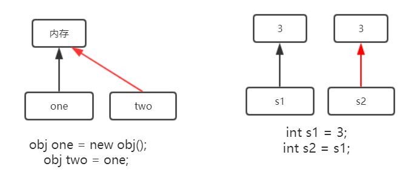

- 类成员变量有初值，函数中的临时变量必须要有初始值。

## 2.2 构造函数

- 在java中有构造函数，无析构函数，因为java具有 **内存自动回收机制**，当变量退出其生命周期后，JVM会自动回收所分配的对象的内存。

- 构造函数的名称与类名一致，且只能用public修饰，没有返回值。

- 当你没有实现构造函数时，**Java编辑器**会自动帮该类产生一个无参构造函数。

# 3. 继承、抽象类和接口

**继承**：子类可以继承其父类，其父父类…所有的属性和方法，但不能直接访问父类的private成员。

关键字：`extends` 。

- java采用的是单继承，即每个类只能有一个父类。【注意】如果不写`extends` 则每个类默认都继承一个`java.lang.Object` 。又因为，子类会继承其父类、父父类…所有的属性和方法，所以可以认为**每个类都继承了`java.lang.Object`** 。

- 每个子类的构造函数的第一句话都默认调用父类的无参构造函数**super()**，除非在子类的**第一句**代码就自己写了`super`语句。也就是说**子类的构造函数第一行必须调用父类的构造函数**。

- 子类使用父类的属性：`super.属性名`。如果子类的静态方法访问父类的静态属性，直接访问即可，即不用`super`。

- 子类使用父类的方法：`super.方法名()` 。**需要注意的是子类不可以重写父类的`静态或私有`方法，但可以调用和重新定义。** 
  
  - 只有override注释的才是真正的重写，没加的都是伪重写（实际要叫重新定义）
    
    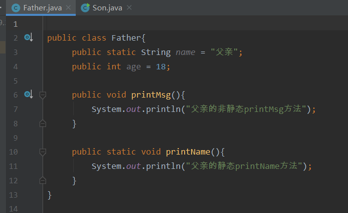
    
    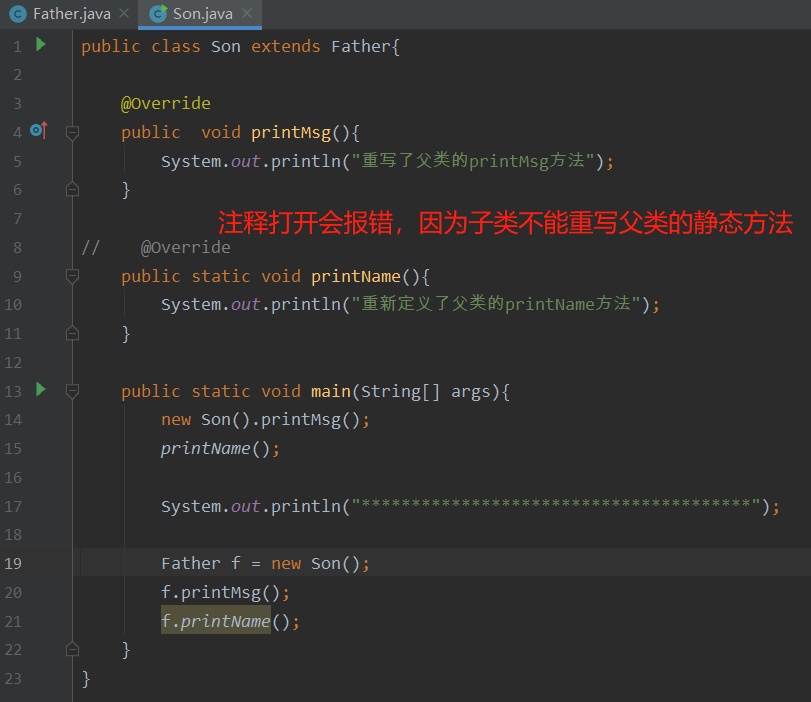
    
    运行结果：
    
    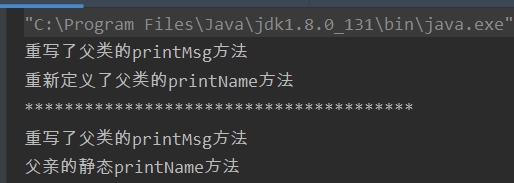
    
    **说明在省略`@override`的前提下，子类并不会真正的重写父类的`私有或者静态`方法** ，只有父类的方法跟属性被`public`修饰时，才可以省略`@override`。

**抽象类**：使用`abstract`声明的类，包含了任意零个或多个的 属性，完整的方法和抽象方法（abstract定义的）。

关键字：`abstract` 

**【注意】**

1. 只有全部方法都是完整的才可以实例化（new）。
2. 包含了抽象方法的一定是抽象类，抽象类不一定包含抽象方法。
3. 子类可以继承抽象类，但只有实现了父类的所有抽象方法，才可以变成完整类，不然它还是抽象类。

比如下面AB都是抽象类

```java
public abstract class A{
    int a;
    // 无参构造函数
    public A(){}

    public void test(){
        a++;
    }
    // 抽象方法
    public abstract int sum(){};
}
```

```java
public abstract class B{
    int b;
    public void test(){
        b++;
    }
}
```

**接口**：使用`interface`声明，所有方法都是`public`修饰的，并且方法体里面都无代码且最后以分号结尾。

接口中可以定义变量，但必须是常量（`public staic final`修饰），如果未写修饰符，默认就是`public staic final`。

比如

```java
public interface A(){
    // public static final int a;
    int a;  // 两者等价

    public int sum();
    public void eat();
    public void walk();
}
```

- 在java中，类只能单继承，但可以实现多个接口，且继承类的同时可以实现接口。
- 接口实现接口时，没有实现的方法会叠加。
- 类实现接口时，必须实现接口中所有的方法。

**总结**：

抽象类和接口的**相同点**：两者都不能被实例化（new）

抽象类和接口的**不同点**：（这些都是JDK8以前的区别）

1. 抽象类用`abstract`声明，接口使用`interface` 关键字
2. 抽象类可以有部分函数是完整实现的，接口中所有方法都不能是完整实现的。
3. 一个类只能继承一个抽象类，但可以实现多个接口。**【注意】`extends`要写在`implements`前面**
4. 抽象类有构造函数，接口无构造函数。
5. 抽象类可以有main，接口中没有main
6. 抽象方法可以有多个权限修饰符，接口的中方法只能是public

## 3.1 转型、多态

**转型** 

子类可以转为父类，父类不可以转为子类，除非父类本身就是从子类转化而来。

比如Human为父类，Man为子类

```java
// 子向父转型
Man man = new Man();
Human obj1 = (Human) man;

// 父转型子的特殊情况
Human obj2 = new Man();
Man man = (Man)obj2;
```

**多态**

子类重新定义了父类的方法（名字、参数一致）的行为叫做**重写**（overwrite）。

子类向父类转换，并且子类重写了父类的方法，这种行为就叫做**多态**。我们称**重载为编译时多态，重写为运行时多态**。

子类方法的优先级高于父类。

作用：

- 以统一的接口来操纵某一类中不同对象的动态行为。
  
  - ```java
    Human[] hus = new Human[3];
    hus[0] = new Man();
    hus[1] = new Man();
    hus[2] = new Woman();
    
    for(int i=0;i<Human.length;i++){
        // 每个对象都执行eat方法
        hus[i].eat();
    }
    ```

- 对象之间的解耦（这种方式也叫**契约设计**）
  
  - ```java
    public staic void haveLunch(Human hu){
        // 不同对象进来就执行不同的eat方法
        hu.eat();
    }
    
    public static void main(String[] args){
        Human[] hus = new Human[3];
        hus[0] = new Man();
        hus[1] = new Man();
        hus[2] = new Woman();
    
        for(int i=0;i<Human.length;i++){
            // 每个对象都执行eat方法
           haveLunch(hus[i]);
        }
    }
    ```

# 4. static、final和常量设计

**static** 

- static可作用在`变量`、`方法`、`类`、`代码块`。

- static变量只依赖于类存在，即通过类名即可访问。（当然也可以使用对象名来调用）

- 同一类中的static变量都存储在同一空间（栈）中，所有的对象实例都可以共享该空间

- static修饰的变量只能是成员变量，不能是局部变量；
  
  - ```java
    public class Potato(){
        static int price;
        String name;
    
        public Potato(int price, String name){
            this.price = price;
            this.name = name;
        }
    
        public static void main(String args[]){
            Potato p1 = new Potato(20, "爆炒土豆丝");
            Potato p2 = new Potato(50, "黄焖土豆丝");
        }
    }
    ```

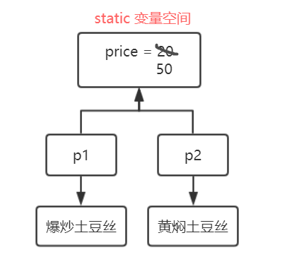

- static方法，也是可以直接通过类名来调用。**static方法里面的所有东西都必须是静态的**，比如静态方法里面禁止调用非静态方法，不可以使用非静态成员变量。**【注意】非静态方法可以调用静态方法**。

- static修饰代码块。static代码块只会在类第一次加载时被调用，即在程序运行期间，static代码块只会运行一次。**【注意】执行顺序static块 > 匿名代码块 > 构造函数** 
  
  ```java
  class StaticBlock(){
      // 静态代码块
      static {
          System.out.println("0000");
      }
      // 构造函数
      public StaticBlock(){
          System.out.println("1111");
      }
      // 匿名代码块
      {
          System.out.println("2222");
      }
  }
  ```
  
  创建`StaticBlock`对象时，得到的结果为：`0000  2222  1111` 

**单例模型**

定义：限定某一类在整个程序运行过程中，内存空间中只能保留一个实例对象。

实现思想：采用static共享对象实例，采用private修饰构造函数来防止外界new操作，向外界提供共享对象。

代码实现：

```java
public class SingleTon{
    // 共享同一个对象
    static SingleTon obj = new SingleTon();
    // 防止外部new
    private SingleTon(){
    }
    // 向外界提供实例对象
    public static SingleTon getInstance(){
        return obj;
    }

    public static void main(String args[]){
        SingleTon s1 = SingleTon.getInstance();
        SingleTon s2 = SingleTon.getInstance();
        System.out.println(s1==s2); // true
    }
}
```

**final**

- final修饰的类不能被继承
- 父类中final修饰的方法不能被子类改写
- final修饰的变量
  - 对象：不能修改其指针，但可以修改其内部的值
  - 基本类型的变量：不能修改其值。

## 4.1 常量池

C语言的常量定义：`const` 

java的常量定义：`public static final` 。常量名建议全大写，以连字符`_`相连。

**常量池**：位于**`栈`**空间中。相同的值只存储一份，节省内存，共享访问。

java给字符串、很多基本类型的包装类都建立了常量池。

拥有常量池包装类：（超过范围就被赶出常量池）

- Boolean：true，false

- Byte：-128~127

- Character：0~127

- Short、Integer、Long：-128~127

- **【注意】`Float`跟`Double`没有常量池** 
  
  代码演示：

```java
public class Test(){
    public static void main(String args[]){
        Boolean b1 = true;
        Boolean b2 = true;
        System.out.println(b1==b2);  // true

        Integer i1 = -128;
        Integer i2 = -128;
        System.out.println(i1==i2);  // true

        Integer i3 = 128; // 超出范围
        Integer i4 = 128;
        System.out.println(i3==i4);  // false

        Float f1 = 0.5;
        Float f2 = 0.5;
        System.out.println(f1==f2);  // false

        String s1 = "abcd";
        String s2 = "a"+"bc"+"d";  // 都是常量，编译器会自动优化
        System.out.println(s1==s2);  // true
    }
}
```

字符串跟包装类都有两种创建方式：

- **字面量**：此方式创建的变量会放在**`栈`**空间中，如`String a = “abc”`、`Integer i = 10` 
- **new**：此方式创建的变量会放在**`堆`**空间中，如`String a = new String("abc")`、`Integer i = new Integer(10)` 

**tips：栈内存容量小，读取速度快；堆内存容量大，读取速度慢。**

**【知识点】** 

1. 基本类型跟包装类之间会自动 装箱拆箱。
2. 加法`+`操作会使包装类自动 拆箱。

```java
public class Test(){
    public static void main(String args[]){
        int i1 = 10;  // 存在于栈中常量池
        Integer i2 = 10;  // 存在于栈中常量池
        // 基本类型跟包装类进行比较，包装类自动拆箱
        System.out.println(i1 == i2);  // true

        Integer i3 = new Integer(10);  // 存在于堆
        // 基本类型跟包装类进行比较，包装类自动拆箱
        System.out.println(i1 == i3);  // true
        // 两个对象进行比较，判断其地址
        System.out.println(i2 == i3);  // false

        Integer i4 = new Integer(5); 
        Integer i5 = new Integer(5);
        // 加法操作会使包装类自动拆箱。i4+i5=10,10为int类型
        System.out.println(i1 == (i4+i5));  // true
        System.out.println(i2 == (i4+i5));  // true
        System.out.println(i3 == (i4+i5));  // true

        Integer i6 = i4+i5; // 先拆箱再装箱，最后等价于Integer i6 = 10
        System.out.println(i1 == i6);  // true
        System.out.println(i2 == i6);  // true
        System.out.println(i3 == i6);  // false
    }
}
```

**【知识点】**

1. 字符串有 变量或对象 参与相加时不进行优化
2. `euqals`：同类型同内容才会返回`true` 
3. `==` 两个都是对象（相同类型）时，比较地址；至少有一个是基本类型时，比较值

```java
public class Test(){
    public static void main(String args[]){    
        String s1 = "abcd"; // 位于栈中
        String s2 = "abc"; // 位于栈中
        String s3 = s2 + "d"; // 位于堆中
        // 有变量相加，不进行优化
        System.out.println(s1==s3); // false
        // euqals是比较字符串内容
        System.out.println(s1.equals(s2)); // true

        String s4 = new String("abc"); // 位于堆中
        System.out.println(s2==s4); // false

        String s5 = "abc" + new String("d"); // 位于堆中
        System.out.println(s1==s5); // false
        System.out.println(s3==s5); // false
    }
}
```

## 4.2 不可变对象

不可变对象一旦创建就不可更改，其包括：

- 八个基本类别的包装类
- String，BigInteger等

**优点**：

1. 只读，线程安全
2. 重复使用，提高性能

**缺点**：制造垃圾，浪费空间

不可变对象在**赋值**或**传参**的时候也是**传指针**。例如：

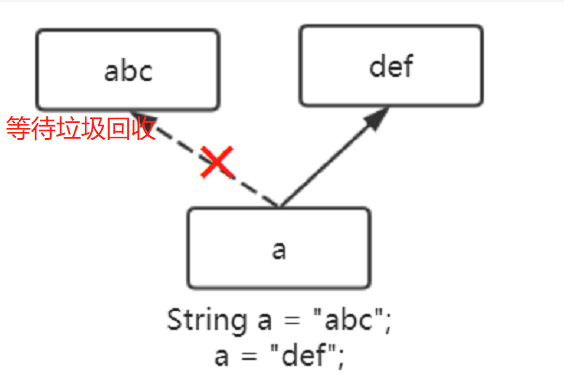.

如果需要对字符串进行大量的修改操作，那么这种方式会大大降低性能，我们可以使用`StringBuffer`或`StringBuilder`类的`append`方法来进行修改。

- StringBuffer / StringBuilder 的对象都是**可变对象**。
- StringBuffer 是同步的，线程安全，修改快速
- StringBuilder 不同步，线程不安全，修改更快

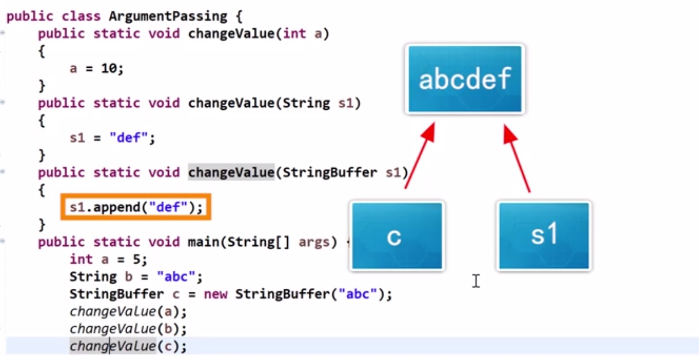

他们的方法用法一样只是同不同步的问题：

- append / insert / delete
- substring(int beginIndex, int endIndex)：返回字符串的子字符串（左闭右开）
- `length()` 字符串实际大小。`capacity()` 占用空间大小。如果append的对象很长，超过了`capacity`的大小，那么`capacity`的大小会**乘2加1**。如果扩容后的`capacity`还不够，此时`capacity`直接**等于**字符串长度。
- replace(charStr, replStr) / repalceAll(charStr, replStr) ：都会用replStr全部替换charStr。只不过前者的`charStr`是**纯字符**，而后者的`charStr`是**正则表达式**。

# 5. Java常用类

包名以Java开头的包是Java的**核心包**。

包名以Javax开头的包是Java的**扩展包**。

## 5.1 数字类（BigInteger和BigDecimal）

`BigInteger`和`BingDecimal`分别是大整数类跟大浮点数类。

有多大呢？你的内存有多大他就可以表示多大。

它们不支持`+-*/`，但有共同的方法可以做加减乘除：

- add()：加法操作
- subtract()：减法操作
- multipy()：乘法操作
- divide()：除法操作
- max()：求两者较大值
- min()：求两者较小值
- equals()：判断是否相等
- divideAndRemainder()：求余数（返回的是数组）

***

**BigInteger** 

```java
import java.math.BigInteger

public class Test(){
    public static void main(String args[]){
        // 使用字符串创建，使用数字的话会有误差
        BigInteger s1 = new BigInteger("987654321");
        BigInteger s2 = new BigInteger("123456789");

        System.out.println("加法操作："+ s1.add(s2));
        System.out.println("减法操作："+ s1.subtract(s2));
        System.out.println("乘法操作："+ s1.multiply(s2));
        // 【注意】只会保留整数
        System.out.println("除法操作："+ s1.divide(s2));
        System.out.println("最大值："+ s1.max(s2));
        System.out.println("最小值："+ s1.min(s2));

        // 求余数
        BigInteger result[] = s1.divideAndRemainder(s2);
        System.out.println("商是："+ result[0]+ "; 余数是："+ result[1]);

    }
}
```

**BigDecimal** 

```java
import java.math.BigDecimal

public class Test(){
    public static void main(String args[]){
        // 使用字符串创建，使用数字的话会有误差
        BigDecimal s1 = new BigDecimal("987654321.123456789");
        BigDecimal s2 = new BigDecimal("123456789.987654321");

        System.out.println("加法操作："+ s1.add(s2));
        System.out.println("减法操作："+ s1.subtract(s2));
        System.out.println("乘法操作："+ s1.multiply(s2));
        // 【注意】可以指定小数点位数，以及舍入方法(这里是四舍五入)
        System.out.println("除法操作："+ s1.divide(s2, 6, RoundingMode.HALF_UP));
        System.out.println("最大值："+ s1.max(s2));
        System.out.println("最小值："+ s1.min(s2));

        // 求余数
        BigInteger result[] = s1.divideAndRemainder(s2,);
        System.out.println("商是："+ result[0]+ "; 余数是："+ result[1]);

    }
}
```

# 6. Java数据结构

## 6.1 数组

- 存放的数据都是同一种类型
- 所有数据线性排列
- 需明确容器长度
- 可通过位置索引快速定位数据

数组定义方式：

```java
// 数组声明
int a[];
int[] b;  // 推荐

// 数组初始化
b = new int[5];  // 开辟5个空间

// 声明的同时初始化
int[] b = new int[5];
int[] b = {1,2,3};
// 错误示范：int[5] b;
```

数组遍历：

**【注意】**数组的长度是**`length`属性**；字符串的长度是**`length()`方法** 

```java
int[] arr = new int[5];
// 第一种
for(int i=0;i<arr.length;i++){
    System.out.println(arr[i]);
}
// 第二种 不用担心数组越界
for(int i:arr){
    System.out.println(i);
}
```

多维数组：

```java
// 多维数组
int arrs[][] = new int[2][3]; // 规则数组，两行三列
int d[2][]; // 不规则数组
d[0] = new int[1]; //第一行只有一列
d[1] = new int[3]; // 第二行有三列

// 多维数组的遍历方式也有两种

// 第一种
for(int i=0;i<arrs.length;i++){  // 行数
    for(int j=0;j<arrs[i].length;i++){ //列数
        System.out.println(arrs[i][j]);
    }
}
// 第二种
for(int[] arr:arrs){  // 行数
    for(int a:arr){ //列数
        System.out.println(a);
    }
}
```

## 6.2 列表List

- 有序的Collection
- 允许重复元素
- 里面的每个数据都只能是对象，就算是由int类型它也会自动装箱。

主要实现：`ArrayList`、`LinkedList`

三者共同的**方法**：

- add([index], value)：在index处添加value，如果没指定index则默认最后。
- remove(index)：删除index处的元素
- get(index)：获取index处的元素
- size()：返回列表大小

三种**遍历**方法：`Iterator（快）`、`for+get方式（最慢）`、`for-each（最快）` 

***

**ArrayList**

- 以**可变数组**实现的List，不支持同步
- 具有数组的特点。它不适合经常插入删除，主要用于**查询数据**。
- 跟数组相比可以**动态扩容**。容器每次满了的时候都会扩容一半。

创建：`ArrayList<Integer> a = new ArrayLsit<Integer>();` 

`ArrayList<Father> a = new ArrayLsit<Son>();` （多态）

**LinkedList**

- 以**双向链**表实现的List，不支持同步
- 顺序访问高效，插入删除高效
- 适合经常变化的数据

特有方法：

- addFirst(value)：在头部添加数据
- getFirst(value)：获取头部的数据

创建：`LinkedList<Integer> linklist = new LinkedList<Integer>();`

**Vector**

- 适合**多线程**
- 以**可变数组**实现的List

创建：`Vector<Integer> linklist = new Vector<Integer>();`

## 6.3 集合Set

- 确定性：对任何对象都能判定其是否属于某一个集合
- 互异性：每个元素是不一样的。（内容不一样）
- 无序性：集合内的元素无先后顺序
- 每个数据都只能是对象

主要实现：`HashSet`、`LinkedHashSet` 、`TreeSet` 

三者共同的**方法**：

- add(value)：增加一个元素。可以增加`null`元素（除了**TreeSet**）
- clear()：清空整个集合
- contains(value)：判断是否包含value元素
- remove(value)：删除value
- size()：获取集合大小
- retainAll(Set2)：计算两个集合的交集

***

**HashSet**

- 基于**散列函数**的集合
- 数据**无先后顺序**

创建：`HashSet<Integer> hashset = new HashSet<Integer>();`

**LinkedHashSet**

- 基于**散列函数**和**双向链表**的集合
- 元素**有先后顺序** 

创建：`LinkedHashSet<Integer> linkSet = new LinkedHashSet<Integer>();`

**TreeSet**

- 基于**树结构（TreeMap）**的集合
- 不可以容纳`null` 
- **元素自动排序**，遍历输入的话会从小到大输出。

创建：`TreeMap<Integer> treeMap = new TreeMap<Integer>();` 

***

`HashSet`跟`LinkedHashSet`判定重复元素的原则：

1. 先判断两个元素的`hashCode`方法（计算对象信息和内存地址）的返回值是否相同，若不同返回false。
2. 若相同，则使用`equals`方法判断，若不同返回false；否则返回true。

`TreeSet`判断重复元素的原则是 **使用`compareTo`方法（需实现comparable接口）**。

**tips：**

- hashCode和equals方法是在Object类中的，所以每个类都有。
- 使用equals判断相等的，那他们的哈希值（hashCode的返回值）一定相等
- 如果哈希值相等，equals判断的值未必相等。

## 6.4 映射Map

- 每个元素都是**键值对**，即{key, value}的形式，k都不允许为null且不能重复。
- 一个输入对应一个输入

主要实现：`HashMap（非同步，快，数据量大）` 

常用方法：

- clear()：清空数据
- contains(value)：等同于containsValue(value)，判断是否包含value
- containsKey(key)：判断是否存在key
- get(key)：获取该key的value
- put(key, value)：新增或修改key
- remove(key)：删除该k-v
- size()：返回数据大小

`HashMap`创建方式：`HashMap<Integer,String> hashMap = new HashMap<Integer,String>();` 

## 6.5 工具类

### 6.5.1 Arrays类

- 处理对象是**数组**
- sort()：对数组排序
- binarySearch()：使用二分查找来查找元素。查找成功返回下标，失败返回 -1
- copyOf()：批量复制
- fill()：批量赋值
- equals()：等价性比较

```java
int[] a={3,1,2};
Arrays.binarySearch(a, 1);  // 1
Arrays.sort(a);
int[] b = Arrays.copyOf(a, 2);
```

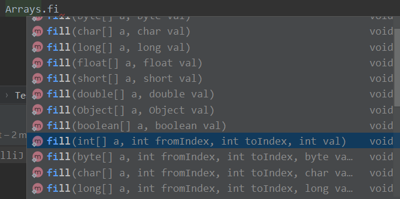

### 6.5.2 Collections类

- 处理对象基本为**List**
- 排序：`Collections.sort(list);` 
- 查找：`Collections.binarySearch(list, key)`
- 赋值：`Collections.fill(list, obj);`
- 查找集合的最大值最小值：`Collections.max(list);` 
- 反序排列：
- 打乱顺序：`Collections.shuffle();` 

### 6.5.3 Ordering类

排序后赋值生成新的list，不影响原先的

```java
List<String> list = Lists.newArrayList("a", "b", "c");
List<String> strings = Ordering.natural().reverse().sortedCopy(list);
System.out.println(strings);
```

# 7. Java语法糖

## 1. 语法糖---不定参数

JDK5提供了不定参数（可变参数）功能，其**本质是一个数组**。

语法糖：`类型...` 

例如：

```java
public static void print(String... arg){
    System.out.println(arg.length);
}
```

注意事项：

- 一个方法只能有**一个**不定参数，且位于参数列表的**最后**。
- 重载时，**固定参数的方法 比 带有可变参数的方法 优先级更高**。
- 重载时，**若调用的方法同时与两个带有可变参数的方法匹配，则报错**。

```java
public static class Test(){
    public static void main(String[] args){
        print("a"); //调用第七行的方法
        print("a", "b");  //调用第10行的方法
    }

    public static void print(String s){
        System.out.println(s);
    }
    public static void print(String... s){
        System.out.println(s);
    }
    // 若把注释解开，则运行时会报错，因为第四行的print同时匹配到了两个带有可变参数的函数
    //public static void print(String s, String... args){
    //    System.out.println(s);
    //}
}
```

## 2. 语法糖---静态导入

导入一个类的静态方法和静态变量，此时就不用 `类名.` 形式来调用了。(JDK5以后的特性)

语法糖：`import static 类名.静态成员`

例子：

```java
import static java.lang.System.out;
import static java.lang.Math.pow;

public staic void main(String[] args){
    int a = pow(3, 2);  // 等价于 Math.pow(3, 2)
    out.println(a);  // System.out.println(a);
}
```

**tips：**少使用*通配符，防止重名。

## 3. 语法糖---数字中的下划线

JDK7的新语法，可以在数字中间加入下划线，比如`int a = 111_111_111` 

目的是增加数字的可读性。

**【注意】**`_`只能出现在数字中间，可以多个下划线连在一起。

## 4. 语法糖---接口方法

java8推出了接口中的**默认/静态**方法也可以有**实现**的，即带有方法体，为Lambda表达式提供支持。

默认方法要用`default`修饰，注意它不是权限的default，而是接口中默认方法的关键字。

***

默认方法：

- 用`default`关键字修饰
- `Object`的方法不能作为默认方法，如`tostring`、`equals` 等。
- **实现类和接口**都可以**`继承/重写`**父接口的默认方法
- 当父类和父接口都有（同名同参数）默认方法时，**子类继承的是父类的默认方法**。
- 当子类实现了两个接口（其中有一个或两个都是同名同参数的默认方法），那么子类必须重写该默认方法。
- 子类调用父接口的默认方法：`父接口名.super.默认方法名();`

静态方法（带实现的）：

- 该静态方法**不属于** 子类/子接口。
- 子类没有继承静态方法，只能通过接口名来调用。

JDK9又推出了接口中的**私有方法**可以实现，只能在本接口使用，子类无法继承也无法调用。

***

总结：

1. 默认方法可以被继承和重写
2. 静态方法不能被继承，只能使用接口名调用
3. 私有方法不能被继承也不能被子类调用，只能被**本接口**的**默认/静态**方法调用。

# 8. 泛型

泛型可以使编写的代码被不同的对象调用，提高复用性；本质就是**参数化类型**。

例子：

```java
// 创建String列表，列表里只能放字符串
ArrayList<String> list = new ArrayList<String>();
// 创建int列表
ArrayList<int> list = new ArrayList<int>();
// JDK1.7以后的菱形语法 等价于第四行的代码
ArrayList<int> list = new ArrayList<>();
```

**JDK自带的泛型**：

- `泛型类`：如 ArrayList、HashSet等
- `泛型方法`：如 Collection.binarySearch、Array.sort等
- `泛型接口`：如 List、Iterator等

## 8.1 自定义泛型类

**泛型类**

定义方式：在类名后面用`<T>` 代表引入类型，多个类型的话`<T, U>` 

```java
// 泛型类定义
public class Interval<T>{
    // 修饰属性
    public T upper;
    public T lower;

    //修饰 返回类型 和 参数类型
    public T setLower(T lower){
        this.lower = lower;
    }
}
```

使用泛型类：

```java
public class Test{
    public  staic void main(String[] args){
        Interval<int> a = new Interval<>;
    }
}
```

**泛型方法**

定义方式：返回类型前加`<T>` ，返回类型写`T` 

```java
public class Interval{
    // 泛型方法定义
    public static <T> T getMiddle(T... a){
        return a[a.length/2];
    }
}
```

**【注意】只有仅修饰方法的时候才要在返回值前面加`<T>`** 

使用泛型方法：

```java
public class Test{
    public  staic void main(String[] args){
        int a = new Interval.<int>getMiddle(1,2,3);
    }
}
```

**泛型接口** 

定义方式：在类名后加`<T>` 

```java
public interface Interval<T>{
    T add(T a1, T a2);
}
```

使用泛型接口：

```java
// 【注意】先实现泛型接口再使用该类
public class SonTest implements Interval<int>{
    int add(int a1, int a2){
        return a1+a2;
    }
}

public class Test {
    public  staic void main(String[] args){
        SonTest s = new SonTest();
        System.out.println(s.add(1,2));
    }
}
```

**小结**

- **泛型类**可以使整个类都泛化，包括属性，方法。
- **泛型方法**可以使泛化返回值跟参数。
- **泛型接口**可以泛化子类方法。

## 8.2 泛型类型限定

泛型的限定是指，需要**传递满足条件的类型**。

如 `<T extends A类>` 约定 T 必须是 A 的子类

- **extends**后面可以跟多个接口但只能有一个类，且**类要排在第一位** 
- 每个接口或类之间用`&`拼接，如`<T extends A类 & B接口 & C接口>` 

需要注意的是，泛型对象之间无任何关系，即**`Test<S>`跟`Test<T>` 没有任何的关系，无论S跟T之间是什么关系**。

例如：

```java
// apple继承于fruit
Test<apple> apples = new Test<>;
Test<fruit> fru = apples; // 报错，因为两者无关系
```

但 **泛型类可以扩展或实现其他类**，如 `ArrayList<T>`实现`List<T>`

```java
List<apple> apples = new ArrayList<>();
```

***

**泛型通配符 `?` **：解决泛型对象之间无法存在继承关系的问题。

- 上限界定符：`Test<? extends S>` 指定Test接收的类型是**S自身或子类** 
  
  - 特点：只能get不能set，编译器只能保证出来的类型，不能保证放入的类型。（因为get时可以将子类转为父类，而子类之间不能set）
  
  - ```java
    // apple继承于fruit
    Test<apple> apples = new Test<>(new apple(1));
    Test<? extends fruit> fru = apples;  // 外部是父类，内部是子类，所以只能get不能set
    fru.getFruit();
    fru.setFruit(new orange(1)); // 报错
    ```

- 下限界定符：`Test<? super S>` 指定Test接收的类型是**S自身或父类** 
  
  - 特点：只能set不能get，因为set时可以将任意子类转为父类，而get时多个子类之间不能转换。
  
  - ```java
    Test<? super apple> fru = new Test<fruit>(); // 外部是子类，内部是父类，所以只能set不能get
    ```

**【注意】`Test<?>`表示可以接收任意类型，无法get和set。** 

## 8.3 泛型的本质、协变跟逆变

**泛型的本质**

在虚拟机中没有泛型的概念，只有普通的类和方法，所以其内部采用了**类型擦除**技术，将泛型替换成`Object`或`限定类型中的第一个类型`，最后根据传递的类型 **自动进行类型转换**。

***

什么是协变、逆变？

举个例子：比如`String`继承与`Object`，那么`String[]` 可以转换成 `Obejct[]` ，即这种情况就叫做**协变**。反之若父子关系颠倒则称为**逆变**。

```java
Obejct obj[] = new String[]; //协变
// 假设A是B的父类，B是C的父类
ArrayList<? extends A> list1 = new ArrayList<B>(); // 协变
ArrayList<? super B> list1 = new ArrayList<A>(); // 逆变
```

小结：

- 数组是协变的
- 原始的泛型`<T>`是不变的
- `<? extends A>`支持协变
- `<? super B>`支持逆变

# 9. 反射

> Java反射机制是在运行状态中，对于任意一个类，都能够知道这个类的所有属性和方法；对于任意一个对象，都能够调用它的任意方法和属性；另外还可以让private临时变成public。

反射关键包：`java.lang.reflect` 

用途：IDE的智能提醒、JDBC通过反射加载数据库驱动类、Mybatis的动态代理、Spring Framework的Bean容器等。

优点：因为可以动态的创建对象和编译，所以有很大的灵活性。

缺点：增加了JVM的系统开销（因为要动态创建对象），违反某些安全策略（因为可以把私有变共有）。

反射使用的步骤：

1. 获取类的Class对象
2. 利用Class对象获取类的信息。
3. 创建对象、修改属性值或调用方法等操作。

### 获取Class对象

在Java程序运行时，JVM都会给**每个类型的对象**实例化一个不可变的**Class实例**，该Class实例提供了对象在运行时的属性和方法。类型可以是基本（8种）或引用类型（String、接口、数组等）。

所以想要使用反射机制，就必须要先获取到该类的**字节码文件对象**（.class，**类的Class实例**），通过字节码文件对象，就能够通过该类中的方法获取到我们想要的所有信息(方法，属性，类名，父类名，实现的所有接口等等)。

**三种方式**获取Class对象

1. `类名.class`：安全可靠、性能最高
   
   ```java
   Class c = String.class;
   // 输出全限定类名
   System.out.println(c.getName());
   ```

2. `对象.getClass()`：原始类型和接口类型不可使用此方式。
   
   ```java
   String s = "abc";
   Class c = s.getClass();
   // 输出全限定类名
   System.out.println(c.getName());
   ```

3. `Class.forName(全限定类名)` ：适用于**运行时**动态获取Class对象。原始类型不可以用此方法。
   
   ```java
   // 因为有可能找不到该类所以要捕获异常
   try{
       // 全限定类名 作为 字符串 传递
       Class s = Class.forName("java.lang.String");
       // 输出全限定类名
       System.out.println(c.getName());
   }
   catch(ClassNotFoundException e){
       System.out.println("String Class Not Found ！");
   }
   ```

既然有两种方式不支持获取原始类型的Class对象，太不公平了，所以现在多了一种方式专门给原始类型获取Class对象。

新方式：`Class c = Double.TYPE` 

**注意：原始类型包装类≠原始类型**。

### 获取类的信息

**获取属性** 

在`java.lang.reflect`包中有个`Field`类，该类可以存储了成员变量信息。

- getFields()：获取本类和所有父类的public属性。

- getDeclareFields()：获取本类所有的属性，包括private属性，但不包括父类的属性。

- getField(String name)：根据name获取在 本类或父类的 public属性。

- getDeclareField(String name)：根据name获取在本类定义的属性（包括private属性，但不包括父类的属性）。

- 例如：
  
  ```java
  // 有s的返回的是数组，没有s的返回的是单个对象
  // 比如getFields就是返回一个数组
  Field[] fs = A.class.getFields();
  for(Field e:fs){
      // 输出的话要转为String类型
      System.out.println(e.toString());
  }
  ```

**获取方法** 

在`java.lang.reflect`包中有个`Method`类，该类可以存储了成员方法。

- getMethods()：获取本类和所有父类的public方法。

- getDeclareMethods()：获取本类所有的方法，包括private方法，但不包括父类的方法

- getMethod(String name, Class\<T>… 参数类型)：根据name获取本类和父类的public方法。参数类型可以指定也可以不指定，但name是必传的。

- getDeclareMethod(String name, Class\<T>… 参数类型)：根据name获取在本类中的方法（包括private方法，但不包括父类的方法）

- 例如：
  
  ```java
  Method[] ms = A.class.getMethods();
  for(Method e:ms){
      // 输出的话要转为String类型
      System.out.println(e.toString());
  }
  
  // 获取参数为String类型的setName方法
  Method m = A.class.getMethod("setName", Class.forName("java.lang.String"));
  ```

**获取构造方法** 

- getConstructors()：获取本类和所有父类的public构造方法。
- getDeclaredConstructors()：获取本类所有的构造方法（不包含父类的）。
- getConstructor(Class\<T>… 参数类型)：根据参数类型列表获取本类和所有父类的public构造方法。
- getDeclaredConstructor(Class\<T>… 参数类型)：根据参数类型列表获取本类定义的构造方法不包含父类的）。

**获取包**：`Class.forName("A").getPackage()` 

**获取类的修饰符**：`Class.forName("A").getModifiers()`

**获取类实现的所有接口**：`Class.forName("A").getInterfaces()` 

**获取类继承的父类**：`Class.forName("A").getSuperClass()` 

**获取类所有的注解：**`Class.forName("A").getAnnotations()`  

### 创建对象、修改属性、调用方法

**创建对象** 

如果需要使用反射对一个类进行操作，不仅需要获取类的Class对象还需要创建其对象，然后使用对象来调用方法，修改属性值等操作。

创建对象的方式有很多种，比如最常用的`new`、还有`clone`、`序列化与反序列化`。但是这些都是静态创建的，下面介绍两种通过反射动态创建对象的方式。

1. 调用**非私有无参**构造器 `Class类对象.newInstance()`，**返回的是Object类型**
   
   ```java
   //【注意】构造出来的是Object对象
   Object obj = Class.forName("A").newInstance();
   A obj1 = (A) obj;
   ```

2. 调用有参构造器`Class类对象.getConstrutor(参数列表)` ，不传参数就是无参构造
   
   ```java
   // 第一步：获取Class对象的构造器对象
   A constructor = (A) Class.forName("A").getConstructor(String.class, int.class); 
   
   // 第二步：使用 构造器对象 的 newInstance方法 创建对象
   A a = constructor.newInstance("codekiang", 18); 
   ```

**设置属性** 

创建好对象之后就可以对属性进行操作。

步骤：

1. 获取Class类对象中的属性，得到Field对象。
   
   ```java
   Class c = Class.forName("A");
   Field f = c.getDeclaredField("name"); // 获取name属性
   ```

2. 创建类对象。
   
   ```java
   Object obj = c.newInstance();
   ```

3. 使用获取到的Field对象设置属性值。如果该属性由private修饰，需要关闭java语言访问检查。
   
   ```java
   // 关闭java语言访问检查
   f.setAccessible(true);
   f.set(obj, "codekiang"); // 等价于 obj.name = "codekiang"
    System.out.println(f.get(obj)); // 输出obj.name 
   ```

因为每个对象都有自己的属性，所以要对属性值进行操作的话，需要知道对哪个对象的属性进行操作。

**调用方法** 

java反射提供`invoke()`方法，在**运行时**根据业务需要调用相应的方法。

方法原形：` Object invoke(Object obj, Object... args)`  

返回值Object对应原方法的返回值，若原方法无返回值则为null

第一个参数为调用的对象（当该方法为静态方法时，填 `null`，因为静态方法不使用对象调用）。

第二个参数为可变参数（无参数时为`null`）

**tips：**若原方法是用private修饰，需要在invoke方法前关闭java语言访问检查。

# 10. 代理

代理模式就是在不修改源码的情况下，对其进行功能扩展。比如在使用某方法前进行日志记录，对用户进行权限控制，预处理消息、过滤消息等等。

需要知道的是，代理类本身不实现服务，而是通过调用被代理类中的方法来提供服务。

在Java中主要分为**静态代理**和**动态代理**模式，动态代理是一种比较常用的代理模式，因为它比静态代理更加的灵活。但是我们也是有必要了解静态代理。

## 10.1 静态代理

静态静态，顾名思义就是死的，专业术语来说就是已编译的，在程序运行前就已经存在代理类的字节码文件。

实现静态代理的步骤：

1. 代理类跟被代理类需要实现同一个接口的方法，
2. 在代理类中定义被代理类的对象，编写代理方法即 扩展被代理对象的方法。
3. 创建代理类对象，使用代理方法。

***

比如我想要个代理帮我刷副本，并且在代理上线的时候输出一下日志。首先刷副本能力在于我本身，代理只是上我的号。

**接口**

```java
package 静态代理;
// 定义玩家接口
public interface Player {
    // 定义刷副本函数
    void DaGuai();
}
```

**被代理类**

```java
package 静态代理;

public class PlayerImpl implements Player {

    @Override
    public void DaGuai() {
        System.out.println("上下上下左右左右BABA");
    }
}
```

**代理类**

```java
package 静态代理;

public class StaticProxy implements Player {
    // 定义被代理类的对象
    private Player player;

    public StaticProxy(Player player){
        this.player = player;
    }

    @Override
    public void DaGuai() {
        // 输出进度
        System.out.println(player + "准备刷副本了");
        // 被代理类的方法
        player.DaGuai();
        System.out.println(player + "刷完副本了");
    }
}
```

**测试类**

```java
package 静态代理;

public class Test {
    public static void main(String[] args){
        // 创建玩家对象
        Player codekiang = new PlayerImpl();
        // 将玩家对象封装到代理对象中
        StaticProxy proxy = new StaticProxy(codekiang);
        proxy.DaGuai();
    }
}
```

**输出结果**：

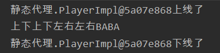

到此就完成了静态代理的实现。我们可以在`DaGuai`方法里扩展自己想要的功能。但是静态代理这么写只能代理一个方法或一个类。

如果一个类中有多个方法需要代理呢，比如我不仅要刷副本，我还想刷完副本代理帮我刷元宝，那代理跟被代理对象就需要再重写一个刷元宝的方法。

再比如，我需要再来一个类，该类的功能是播放音乐，我需要有代理类帮我播放，并输出日志。此时就需要再重新写一个代理类来播放音乐了。

可以见得，静态代理面对这种情况很棘手。我们可不可以只编写接口并实现它该有的功能，然后只创建一个代理对象帮我们代理这些方法呢？

动态代理拍了拍你的屁股并说：嘿，Boy。

## 10.2 动态代理

动态代理类 使用了反射，使其能在程序运行时创建代理类的代理模式。动态代理可以实现AOP编程、解耦。

实现动态代理的步骤：

1. 在动态代理类中创建代理器（实现`InvocationHandler`接口的`invoke`方法）
2. 使用代理处理器对象来调用被代理对象的方法

流程图：

代理器会自动帮我们创建代理对象，动态代理对象所有的方法在调用时都会被拦截，送到代理处理器的`invoke()`方法来处理。

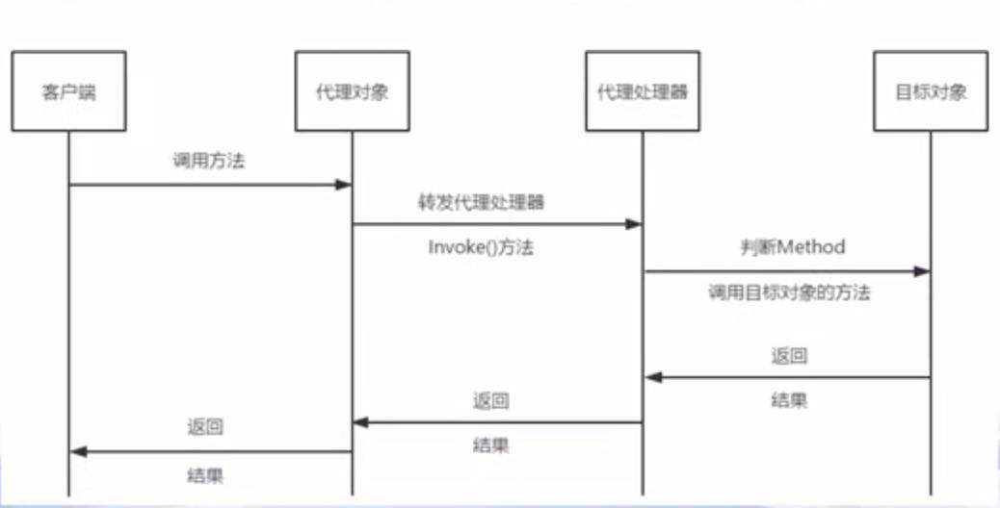

**实现代码：**

接口（Player跟Listen）

```java
package 动态代理;

public interface Player {
    void play();
}
```

```java
package 动态代理;

public interface Listen {
    void listen();
}
```

被代理类（实现了两个接口）

```java
package 动态代理;

public class PlayerImpl implements Player, Listen {

    @Override
    public void play() {
        System.out.println("刷副本中。。。");
    }

    @Override
    public void listen() {
        System.out.println("正在播放《搁浅》。。。");
    }
}
```

动态代理类：

```java
package 动态代理;

import java.lang.reflect.InvocationHandler;
import java.lang.reflect.Method;

public class DynamicProxy implements InvocationHandler {

    private Player player;
    private Listen listen;

    public DynamicProxy(Player player){
        this.player = player;
    }

    public DynamicProxy(Listen listen){
        this.listen = listen;
    }

    @Override
    /*
    * Object proxy:被代理的对象
    * Method method:要调用的方法
    * Object[] args:方法调用时所需要参数
     * */
    public Object invoke(Object proxy, Method method, Object[] args) throws Throwable {
        System.out.println("动态代理的Class对象："+proxy.getClass());
        System.out.println("动态代理的Class对象的类名："+proxy.getClass().getName());
        System.out.println("动态代理的Class对象调用的方法："+method.getName());
        Object result = null;

        switch (method.getName()){
            case "listen":
                System.out.println(listen + "准备听音乐了");
                result = method.invoke(listen, args);
                System.out.println(listen + "听完了。。。");
                break;
            case "play":
                System.out.println(player + "准备刷副本了");
                result = method.invoke(player, args);
                System.out.println(player + "刷完副本了");
                break;
            default:break;
        }

        return result;
    }
}
```

客户端（main函数）

```java
package 动态代理;

import java.lang.reflect.Proxy;

public class Main {
    public static void main(String[] args){
        // 创建对象
        Player codekiangPlayer = new PlayerImpl();
        // 创建调用处理器对象
        DynamicProxy handlerPlayer = new DynamicProxy(codekiangPlayer);
        // 动态生成代理对象
        Player proxyPlayer = (Player) Proxy.newProxyInstance(
                PlayerImpl.class.getClassLoader(), // 获取对象的类加载器
                PlayerImpl.class.getInterfaces(),  // 获取对象所有的接口
                handlerPlayer  // 调用处理器对象
        );
        // 调用被代理类的方法
        proxyPlayer.play();

        System.out.println("============分割线============");

        // 创建对象
        Listen codekiangListen = new PlayerImpl();
        // 创建调用处理器对象
        DynamicProxy ListenHandler = new DynamicProxy(codekiangListen);
        // 动态生成代理对象
        Listen ListenProxy = (Listen) Proxy.newProxyInstance(
                PlayerImpl.class.getClassLoader(),
                PlayerImpl.class.getInterfaces(),
                ListenHandler
        );
        ListenProxy.listen();
    }
}
```

运行结果：

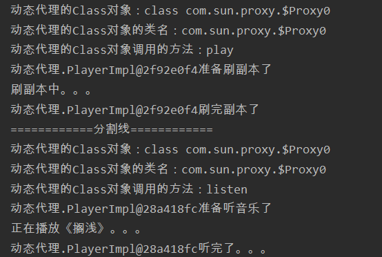

**需要注意的是，当实现多个接口时，实现的顺序很重要，当多个接口有同名方法时，代理对象会执行位于前面的接口的方法。**

# 11. Lambda表达式

Java8开始推出了Lambda表达式。Lambda表达式相当于一个没有名字的“快餐”函数，跟匿名内部类差不多，只在定义处使用，不过Lambda表达式要比匿名内部类更加简洁，高效。

下面先看一下Lambda表达式的简单使用：

此处我们需要对字符串数组按长度进行从小到大排序。

```java
package Lambda;

import java.util.Arrays;

public class test {

    public static void main(String[] args) {
        // 定义字符串数组
        String[] books = new String[]{"java基础", "python程序设计", "C语言", "C++编程设计"};
        // 字符串数组排序，需要创建一个比较器
        Arrays.sort(books, new Bmp());
        // 将数组变成字符串并输出
        System.out.println(Arrays.toString(books));

        // 结果：[C语言, java基础, C++编程设计, python程序设计]
    }
}
```

我们需要编写一个比较器实现Comparator接口的compare方法

```java
package Lambda;

import java.util.Comparator;

public class Bmp implements Comparator<String> {

    @Override
    public int compare(String o1, String o2) {
        /*
        * 返回值：
        *   正数 -- 交换o1 o2
        *    负数或0 -- 不交换
        * */
        return o1.length() - o2.length();
    }

}
```

你看，在compare函数中就几行代码，而且也就需要比较的时候才有用，我们没有必要大动干戈去专门创建一个比较器。

此时Lambda笑了，我TM一行搞定。

```java
package Lambda;

import java.util.Arrays;

public class test {

    public static void main(String[] args) {
        // 定义字符串数组
        String[] books = new String[]{"java基础", "python程序设计", "C语言", "C++编程设计"};
        // 使用Lambda表达式排序，参数可以不写类型
        Arrays.sort(books, (s1, s2) -> s1.length() - s2.length());

        System.out.println(Arrays.toString(books));
        // 结果：[C语言, java基础, C++编程设计, python程序设计]
    }
}
```

**tips**：`(s1, s2) -> s1.length() - s2.length()` 等价于

```java
(String s1, String s2) -> {
    return s1.length() - s2.length()
}
```

比较一下面向对象与面向过程语传递参数的方式：

面向**过程**：参数传递是基本类型的变量

面向**对象**：

- 传递基本类型的变量
- 传递对象变量
- 传递方法/代码块

***

Lambda的语法。

- 基本语法：`(参数) -> {代码}` 
- 无参 有返回值 一个语句：`() -> "返回值"` （方法体的大括号可省略）
- 一个参数 无返回值 多个语句：`s1 -> {多行代码}` （参数的小括号可省略）
- 多个参数 有/无返回值 多个语句：`(多个参数) -> {多行代码}` （小括号跟大括号都不能省略）

**【注意】只要方法体里面出现了return就一定要有`{}`；参数的类型可以省略，一般不建议**

返回值跟参数的类型java都会自动根据上下文推断出来。

在方法体有多个分支的情况下，只有某几个分支有返回值，则会报错。

## 函数式接口

我们来看看Lambda表达式是怎么实现它的功能的。

看源码可以发现`Arrays.sort(T[] a, Comparator<? super T> c)` ,sort方法接收的是一个数组跟一个Comparator对象，也就是说，Lambda此时就是一个Comparator对象。

空说无凭，show you the code.

```java
Comparator<String> c = (s1, s2) -> s1.length() - s2.length();
Arrays.sort(books, c);
```

把Lambda表达式赋值给一个Comparator对象，仍然是可以排序的，所以可以证明此时的Lambda表达式就是一个Comparator对象。

那问题来了，Lambda表达式是如何变成Comparator对象的。

下面看看Comparator接口的源码（如下），可以发现该接口中有一个未实现的compare方法。

```
public interface Comparator<T> {
    int compare(T o1, T o2);
}
```

没错，Lambda表达式会自动填充到这个函数（**等价于**下段代码），正好Lambda没有名字但是有实现，而抽象方法有名字但没有实现，两者很配。那这个`new Comparator<String>`是怎么回事。很明显，当然是编译器自动帮我们完成的啦。

```java
Comparator<String> c = new Comparator<String>() {
    int compare(String s1, String s2){
        return s1.length() - s2.length();
    }
}
```

**【注意】Lambda与匿名内部类最大的区别就是不会多生成一个class文件**

我们来小结一下，使用Lambda时，编译器会自动帮我们创建接口的对象，且Lambda表达式会自动填充到该接口中未实现的方法。

像Comparator这样的接口我们就叫做**函数式接口**。

要称为函数式接口必须满足以下条件：

1. **只**包含 **一个** **未实现方法** 的 **接口** 
2. 可以有default、static、private方法。（可以说就是为了Lambda才使接口中有了这些可实现的方法）

打开java8的API手册，找到Comparator，会发现，它竟然有两个未实现的方法，这不符合函数式接口的定义啊。怎么回事？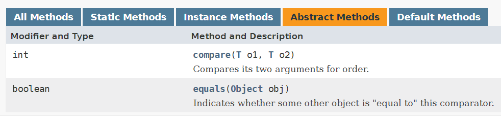

原因是 所有的类都继承了Object类，而Object类对 `equals` 、 `toString`、`hashCode`等方法都有实现。所以这些方法总是有实现的，也就是说这些方法对函数式接口来说不算是未实现的方法。

***

**自定义函数式接口**

例子：输出长度为偶数的书名。

函数式接口

```java
package Lambda;

@FunctionalInterface // 添加注解，告诉编译器这是函数式接口
public interface FuntionalInterfaceTest {
    boolean strCheck(String s);
}
```

**tips：添加了注解之后编译器会检查该接口是否只包含一个未实现的方法。**

主函数

```java
package Lambda;

public class test {
    public static void main(String[] args) {
        // 定义字符串数组
        String[] books = new String[]{"java基础", "python程序设计", "C语言", "C++编程设计"};
        // 创建对象
        FuntionalInterfaceTest fit = s -> s.length() % 2 == 0;

        for(String book: books){
            // 调用函数
            if(fit.strCheck(book)){
                System.out.println(book + " 的长度是偶数");
            }
        }
    }
}
```

自定义函数式接口虽简洁，但不要大量使用，因为每个类就那几行代码，一旦大量使用就会使得源码膨胀。

那我们又需要用到自定义的函数式接口该怎么办呢？别怕，**系统有自带的函数式接口**。我们只需要根据这些接口的功能挑着来用就可以了，当自带的接口实在不能满足我们的时候我们再自己定义。

***

**系统自带的函数式接口**：（常用）

这些接口都位于`java.util.function`包中

| 接口             | 参数   | 返回值     | 未实现的方法       | 实例             |
|:--------------:|:----:|:-------:|:------------:| -------------- |
| Predicate\<T>  | T    | Boolean | test\<T t>   | 接收一个参数，返回一个布尔值 |
| Consumer\<T>   | T    | void    | accept\<T t> | 接收一个参数，无返回值    |
| Function<T, R> | T    | R       | apply\<T t>  | 接收一个参数，返回一个值   |
| Supplier\<T>   | None | T       | get\<T t>    | 无参数，返回一个参值     |

下面看看这些接口怎么使用。

`Predicate <T>`

案例：输出长度是偶数的字符串

```java
// 定义字符串数组
String[] books = new String[]{"java基础", "python程序设计", "C语言", "C++编程设计"};

Predicate<String> pd = s -> s.length()%2 == 0;
System.out.println("长度为偶数的元素有:");
for (String book: books){
    if(pd.test(book))
        System.out.println(book + " ");
}
```

`Consumer <T>` 

案例：输出数组的每个元素。

```java
String[] books = new String[]{"java基础", "python程序设计", "C语言", "C++编程设计"};

Consumer<String> cs = s -> System.out.println(s);
for (String book: books){
    cs.accept(book);
}
```

`Function <T t1, R t2>` T是参数类型， R是返回值类型

案例：给数组的每个元素添加一个`*` 

```java
String[] books = new String[]{"java基础", "python程序设计", "C语言", "C++编程设计"};

Function<String, String> f = s -> "*" + s;
for (String book: books){
    System.out.println(f.apply(book));
}
```

`Supplier <T>` 

案例：随机输出数组中的元素。

```java
String[] books = new String[]{"java基础", "python程序设计", "C语言", "C++编程设计"};

Supplier<String> sp = () -> books[(int) Math.floor(Math.random()*4)];
System.out.println(sp.get());
```

## 方法引用

方法引用可以说是一个更加便捷的Lambda表达式。Lambda表达式可以自定义抽象方法的实现代码，方法引用则是直接使用已存在的实现方法。它的语法为`::`。

比如：

```java
public static void main(String[] args) {
    // 定义字符串数组
    String[] books = new String[]{"java基础", "python程序设计", "C语言", "C++编程设计"};
    // 方法引用
    Arrays.sort(books, String::compareTo);
    System.out.println(Arrays.toString(books));
}
```

结果：（按首字母排序）

```
[C++编程设计, C语言, java基础, python程序设计]
```

分析：

`String::compareTo` 等价于 `(s1, s2) ->  s1.compareTo(s2);` 

常见的五种方法引用格式：

- 静态方法引用：`类名::静态方法` ，如 `Math::abs` 
- 实例方法引用：`类名::实例方法` ，如 `String::compareToIgnoreCase` 
- 对象方法引用：`对象名::实例方法` ，如 `System.out::println` 
  - `this::实例方法` 调用自身已有的方法
  - `super::实例方法` 调用父类已有的方法
- 构造方法引用：
  - `类名::new` 调用某类构造函数（单个对象）
  - `类名[]::new` 调用某类的构造函数（数组对象）

**实例方法与对象方法的区别：实例方法的第一个参数作为方法的执行体，例如上面提到的`String::compareTo` 的`s1`就是方法的执行体。**

**类名::静态方法**

```java
interface NumUtil{
    double calculate(double num);
}

public static double worker(NumUtil nu, double num){
    return nu.calculate(num);
}

public static void main(String[] args) {
    double a = -5.3;
    // 方法引用
    double b = worker(Math::abs, a);  // 5.3
    // 方法引用
    double c = worker(Math::floor, a);  // -6
}
```

`Math::abs` 等价于 `x -> Math.abs(x)` 

**类名::实例方法** 

第一个参数作为方法的执行体

```java
public static void main(String[] args) {
    // 定义字符串数组
    String[] books = new String[]{"java基础", "python程序设计", "C语言", "C++编程设计"};
    // 方法引用
    Arrays.sort(books, String::compareTo);
    System.out.println(Arrays.toString(books));
}
```

`String::compareTo` 等价于 `(s1, s2) ->  s1.compareTo(s2);`

**对象名::实例方法**

```java
interface Printer{
    public void exec(String c);
}

public static void main(String[] args) {
    String c = "asd";
    Printer p = System.out::println;
    p.exec(c);
}
```

`System.out::println` 等价于 `c -> System.out.println(c)` 

【注意】System.out是一个对象。

`this::实例方法` 

```java
interface Printer{
    public void exec(String c);
}

public static void main(String[] args) {
    String c = "asd";
    new test().ppp(c);
}

public void ppp(String c){
    Printer p = this::selfPrint;
    p.exec(c);
}

public void selfPrint(String c){
    System.out.println(c);
}
```

super即指向父类。

**类名::new** 跟 **类名[]::new**

```java
class Person{
    private String name;
    private String age;
    ....省略get/set方法
}
```

```java
Supplier<Person> s = Person::new;
Person p = s.get();

Function<Integer, Person[]> s = Person[]::new;
Person[] pa = s.apply(5);  // 返回5个Person的数组
```

`s.get()` 等价于 `new Person()` 

`s.apply(5);` 等价于 `new Person[5];` 

## 总结

1. Lambda表达式是一个匿名的方法，被赋值后可以看做是一个**函数式接口的实例**。

2. 当Lambda表达式遇到多个类有方法重载的时候，会自动根据**重载规则和返回值**自动填充到正确的方法。

3. Lambda表达式可以访问外部的`final`或`effectively final`变量。effectively final的意思：不是由final修饰，但它自始至终都没有被修改。

4. Lambda表达式和嵌套块有着相同的作用域。
   
   ```java
   interface Printer{
       public void exec();
   }
   
   public static void main(String[] args) {
       String c = "asd";
       new test().ppp(c);
   }
   
   public void ppp(String c){
       // 共用嵌套块的作用域
       Printer p = ()-> { System.out.println(c); };
       p.exec();
   }
   ```

5. Lambda的`this`指代的是创建这个表达式的对象。
