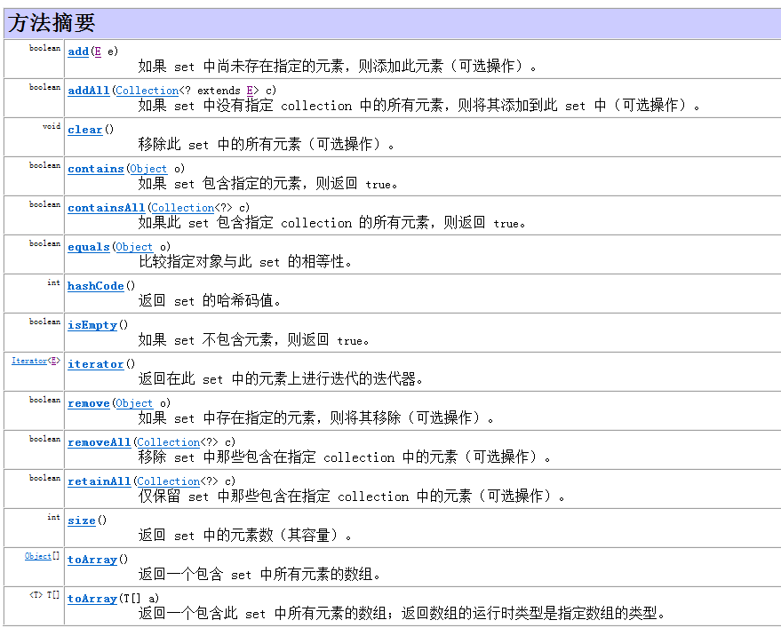
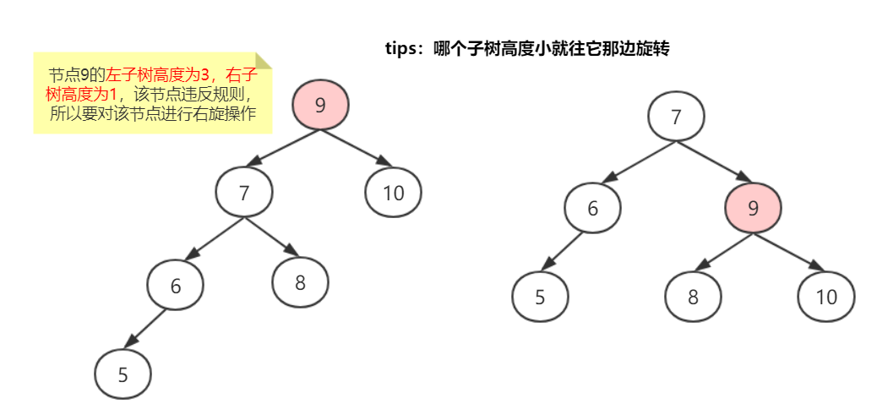
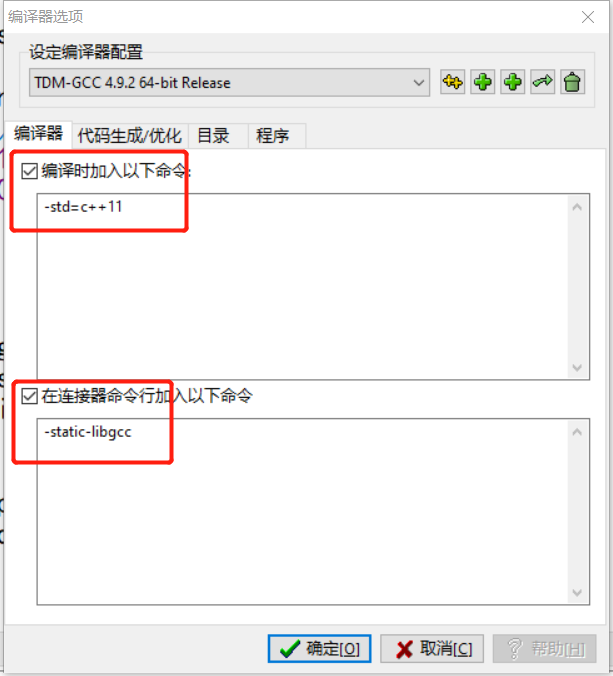

刷题总结
===

java版本
===

常用东西
---

- 整数最值
  - 最大值：Integer.MAX_VALUE
  - 最小值：Integer.MIN_VALUE
- 数组赋值：Arrays.fill(arr, val);
- 部分排序：Arrays.sort(array, 0, 4)
- 字符转int：‘4’-48=4
- 数组深拷贝：System.arraycopy(src, srcPos, dest, destPos, length)
- 数组范围拷贝：dest = Arrays.copyOfRange(src, start, end)


> length属性是针对数组说的
>
> length()方法是针对字符串String
>
> size()方法是针对泛型集合说的


String
---

- 长度：length()
- 是否为空：isEmpty()
- 判断相等：
  - equals(str)
  - equalsIgnoreCase(str) 忽略大小写
- 比较大小：compareTo(str)
- 获取：charAt(int index)
- 根据**字符**获取该字符在字符串中位置
  - indexOf(char ch)：返回的是ch在字符串中第一次出现的位置。不存在返回 -1
  - lastIndexOf(char ch)：返回的是ch在字符串中最后一次出现的位置
  - indexOf(char ch, int fromIndex)：从fromIndex指定位置开始，获取ch在字符串中出现的位置。
  - indexOf(String str)：返回的是str在字符串中第一次出现的位置。
  - indexOf(String str, int fromIndex)：从fromIndex指定位置开始，获取str在字符串中出现的位置。
- 转成char数组：toCharArray()；
  - 字符串排序时需用char数组
  - 然后使用Arrays.sort()
- 转成字节数组：getBytes()
- 替换：
  - replace(str1, str2) 用str2替换str1
  - replace(regex, str2) 用str2替换正则匹配的
- 获取子串：substring(begin, end)，不传end的话就默认截取到最后
- 切割：split(regex)
- 是否以str开头或结尾：startsWith(str)  endsWith(str)
- 转成大写或小写：toUpperCase()  toLowerCase()


## StringBuilder

- 创建：new StringBuilder()
- 长度：length()
- 添加：append()
- 转为字符串：toString()
- 指定位置插入：insert(index,  val) 
- 删除
  - delete(start, end)
  - deleteCharAt(index)
- 获取
  - char charAt(int index)
  - int indexOf(String str)
  - int lastIndexOf(String str)
- 替换
  - replace(start, end, str)
  - setCharAt(int index, String str)


List
---


Set
---




Stack
---

- 创建对象：`Stack<Integer> s = new Stack<>();` 
- 判空：empty() 
- 添加元素：push(obj)
- 弹出栈顶元素：pop()
- 返回栈顶元素：peek()
- 查找元素：search(obj)
- 清空：clear()


Queue
---

- 创建：`Queue<String> q = new LinkedList<>();` 
- 添加：offer(value)，返回boolean；
- 删除：poll()，移除并返问队列头部的元素  如果队列为空，则返回null
- 查看队头元素：peek()
- 判空：isEmpty()
- 清空：clear()
- 是否包含：contains(Obj)


Map
---

- getOrDefault(key, 默认值);

```java
public int[] intersect(int[] nums1, int[] nums2) {
    int[] ans = new int[nums1.length];
    int index = 0;
    Map<Integer, Integer> map = new HashMap<>();
    for(int i: nums1){
        map.put(i, map.getOrDefault(i, 0) + 1);
    }
    for(int i: nums2){
        int n = map.getOrDefault(i, 0);
        if(n > 0){
            ans[index++] = i;
            map.put(i, --n);
        }
    }
    return Arrays.copyOfRange(ans, 0, index);
}
```


字典树
---

Trie树，也叫字典树、前缀树，用于统计和排序大量的字符串，经常被搜索引擎用于文本词频统计。可以最大限度的减少无谓的字符串比较。

**字典树的3个基本性质**：

1. 根节点不包含字符，除根节点外每一个节点都只包含一个字符。
2. 从根节点到某一节点，路径上经过的字符连接起来，为该节点对应的字符串。
3. 每个节点的所有子节点包含的字符都不相同，节点可包含的信息也可以自定义，比如记录单词的频率。


```java
class Trie {
    private Trie[] children;
    private boolean isEnd;

    public Trie() {
        children = new Trie[26];
        isEnd = false;
    }
    
    public void insert(String word) {
        Trie node = this;
        for (int i = 0; i < word.length(); i++) {
            char ch = word.charAt(i);
            int index = ch - 'a';
            if (node.children[index] == null) {
                node.children[index] = new Trie();
            }
            node = node.children[index];
        }
        // 标记该节点是一个单词
        node.isEnd = true;
    }
    
    public boolean search(String word) {
        Trie node = searchPrefix(word);
        return node != null && node.isEnd;
    }
    
    public boolean startsWith(String prefix) {
        return searchPrefix(prefix) != null;
    }

    private Trie searchPrefix(String prefix) {
        Trie node = this;
        for (int i = 0; i < prefix.length(); i++) {
            char ch = prefix.charAt(i);
            int index = ch - 'a';
            if (node.children[index] == null) {
                return null;
            }
            node = node.children[index];
        }
        return node;
    }
}
```


回溯
---

1. 正常回溯

   ```java
   public void dfs(int[] nums, int s, int i){
       if(i == nums.length){
           sum += s;
           return;
       }
       dfs(nums, s^nums[i], i+1);
       dfs(nums, s, i+1);
   }
   ```

2. 升序回溯

   ```java
   for(int i=index; i<=n; i++){
       t.push_back(i);
       // 如果下回合要加上本身回溯的话就不+1
       dfs(t, i+1, n, k);
       t.pop_back();
   }
   ```

3. 全排列回溯

   ```java
   // s要先排序
   void dfs(int index, char[] s, StringBuilder t){
           if(index == s.length){
               ans.add(t.toString());
               return;
           }
           for(int i=0; i<s.length; i++){
               // 去掉重复的
               if(i > 0 && !vis[i-1] && s[i-1] == s[i]) continue;
               if(!vis[i]){
                   vis[i] = true;
                   t.append(s[i]);
                   dfs(index+1, s, t);
                   vis[i] = false;
                   t.deleteCharAt(t.length()-1);
               }
           }
       }
   ```


位运算
---

判断奇偶：

- 奇数：`x&1==1` 
- 偶数：`x&1==0` 

**异或 ^**：

1. 任何数和 **0** 做异或运算，结果仍然是原来的数，即a^0=a。
2. 任何数和 **自身** 做异或运算，结果是 0，即 a^a=0。
3. 异或运算满足交换律和结合律，**a\^b\^a**=b^0=b

[136. 只出现一次的数字](https://leetcode-cn.com/problems/single-number/) 


快速排序
---

```java
public class QuickSort {
    public static void main(String[] args) {
        int[] arr = {5, 1, 7, 3, 1, 6, 9, 4};
        quickSort(arr, 0, arr.length - 1);
    }

    private static void quickSort(int[] arr, int leftIndex, int rightIndex) {
        if (leftIndex >= rightIndex) {
            return;
        }

        int left = leftIndex;
        int right = rightIndex;
        // 待排序的第一个元素作为基准值
        int key = arr[left];

        // 从左右两边交替扫描，直到left = right
        while (left < right) {
            while (left < right && arr[right] >= key) {
                // 从右往左扫描，找到第一个比基准值小的元素
                right--;
            }
            // 找到这种元素将arr[right]放入arr[left]中
            arr[left] = arr[right];

            while (left < right && arr[left] <= key) {
                // 从左往右扫描，找到第一个比基准值大的元素
                left++;
            }
            // 找到这种元素将arr[left]放入arr[right]中
            arr[right] = arr[left];
        }
        // 基准值归位
        arr[left] = key;
        // 对基准值左边的元素进行递归排序
        quickSort(arr, leftIndex, left - 1);
        // 对基准值右边的元素进行递归排序。
        quickSort(arr, right + 1, rightIndex);
    }
}
```


二叉树
---

**二叉树**：也叫二叉搜索树（**BST**），所有节点都满足 根节点大于比左子树所有结点的值，小于等于右子树上所有结点的值。

- 极端情况下，二叉树退化为链表。

**平衡二叉查找树**：简称平衡二叉树（AVL）。每个节点左右两个子树的高度差的绝对值不超过1。因此可以减少二叉查找树的高度，提高查找速度。

- 插入元素的时候会通过左旋/右旋来保证每个节点左右两个子树的高度差的绝对值不超过1

**红黑树**：是一个弱平衡二叉树，即不要求左右两个子树的高度差的绝对值不超过1。但是其内部为节点定义了颜色（红色或黑色），只要保证黑色节点平衡即可。

- 每个节点要么红色要么黑色。
- 根节点跟叶子节点（NULL）都是黑色。**每个最末端的节点都有两个NULL节点，这两个NULL节点才是叶子结点。** 
- 父子节点之间不能都是红色。
- 任意节点到达叶子节点所经过的黑色节点数一样。


### AVL

**查找最大值与最小值**：最左边的节点是最小值，最右边的节点是最大值。

**删除操作**：


**左旋和右旋操作**：因为AVL要保证每个节点左右两个子树的高度差的绝对值不超过1。所以要对违反了这个规则的节点进行左旋右旋操作。




C/C++版本
===

## 编辑器设置

编辑器：VS2015

- 代码提示设置：[VS2015代码自动提示设置](https://blog.csdn.net/Hyo555/article/details/79822061) （参考这个）

编辑器：Dev-c++

- 支持正则：

  


## 常用东西

- 取值范围

  - int $10^9$ 
  - long long $10^{18}$ 

- 无穷大

  - 正无穷：`const int INF = 0x3f3f3f3f;` 
  - 负无穷：`const int DNF = 0xc0c0c0c0;`  
  - 或者用C++自带的
    - 如果是**int**，可以用**INT_MAX**表示正无穷，**INT_MIN**表示负无穷，需要包含**limits.h**。
    - 如果是**double**，可以用**DBL_MAX**表示正无穷，**-DBL_MAX**表示负无穷(注意不是DBL_MIN)，需要包含**float.h** 

- 初始化数组或一次性给数组赋值

  - memset(arr, value, sizeof(arr)); 将数组arr全部元素赋值为value。(**需要包含stdio.h 头文件**)

    ```c++
    memset(a, 0, sizeof(a)); // 将数组a的元素全部初始化为0
    ```

- 判断字符是否为字母或数字 (需要头文件ctype.h)

  - isdigit(char x) **判断字符x是否为数字，是的话不为0，否则为0**。
  - isalpha(char x) **判断字符x是否为字母，是的话不为0，否则为0**。
  
- 小数取整：

  - floor(x)： 向下取整
  - ceil(x)：向上取整
  
- 对数：

  - 以**自然对数e**为底：log(n)
  - 以**2**为底：log2(n)，常用于已知树的节点个数求深度，不过通常要加一，即`log2(n)+1`。
  - 以**10**为底：log10(n)
  - 以**m**为底：log10(n) / log10(m)


## STL

使用不同函数库都需要写上对应的头文件，比如string，则需要 `#include<string>` 、vector则需要 `#include<vector>` 后面不再一一重复。

介绍一个**万能头文件**： `#include<bits/stdc++.h>` ，有了一句代码就不用其他头文件了。不过有些地方不支持该头文件，比如VS。但是几乎所有OJ平台都支持。


### algorithm

algorithm，中文意思为算法。它是一个头文件`#include<algorithm.h>` ,包含了许多常用便捷简单的方法，可以说该头文件下面的函数会贯穿以后的编码。

- min(x1, x2) 或 max(x1, x2) ：返回x1 x2的最小（大）值

- sort(n, m, bmp) ：对**数组[n,m)**的元素进行排序

  - n为一般为数组arr，m一般为arr+len，bmp排序函数（简单类型默认为升序，可不写该参数）。n，m为指针或迭代器。

  - ```c++
    int arr[6] = {1,5,4,9,2,11};
    sort(arr, arr+6); // 默认升序 1 2 4 5 9 11
    sort(arr+3, arr+6); // 排序下标3到5的元素 1,5,4,2,9,11
    sort(arr, arr+6, greater<int>()); // 降序 greater<int>()系统自带的函数，只能用于简单类型，需要functional头文件，复杂类型需要进一步了解 
    
    bool bmp(int a, int b){
    	return a > b;
    }
    sort(arr, arr+6, bmp()); // 降序 bmp()自己实现的函数
    ```

- swap(T x1, T x2)：交换x1 x2的值，可以是任意类型

- reverse(arr+n,  arr+m)：反转**数组[n,m)**的元素的顺序

- 最大公约数

  - 自带的函数：`__gcd(a, b)`

  - 自己实现的函数：

    ```c++
    int gcd(int a,int b){ //求最大公约数,注意类型范围 
        return b? gcd(b, a%b): a; //第二个数不为0时，继续递归 
    }
    ```

- 最小公倍数

  - 最小公倍数=a*b/最小公约数

  - ```c++
    int lcm(int a,int b){ 
        //a,b相乘除以最大公约数；此方法较优，因为a和b直接相乘可能超范围
        return a/__gcd(a,b)*b; 
    }
    ```

- 二分函数

  - lower_bound(n, m, value)：返回数组[n, m)中第一个**大于等于**value的元素下标的**迭代器**，需要用*获取下标值
  - upper_bound(n, m, value)：返回数组[n, m)中第一个**大于**value的元素下标的**迭代器**，需要用*获取下标值
  - 这两个函数**前提**都要**排好序**，复杂度为O(logn)

- 全排列

  - next_permutation(n, m) 用于求数组[n, m)元素全排列中一个排序的下一个排序

    - 首先输出本序列，接下来的每个序列都比前序列大。所以要实现真正的全排列需要先对数组进行排序。牛逼的是该函数的时间复杂度是O(1)。

      ```c++
      int a[3] = {1,2,3};
      do{
          for(int i=0;i<3;i++){
              cout<<a[i]<<" ";
          }
          cout<<endl;
      }while(next_permutation(a, a+3));
      结果为：
      1 2 3
      1 3 2
      2 1 3
      2 3 1
      3 1 2
      3 2 1
      
      int a[3] = {1,3,2};
      do{
          for(int i=0;i<3;i++){
              cout<<a[i]<<" ";
          }
          cout<<endl;
      }while(next_permutation(a, a+3));
      结果为：
      1 3 2
      2 1 3
      2 3 1
      3 1 2
      3 2 1
      ```


### string

字符串可以像数组一样正常的用下标获取值。

- 字符串接收

  - getline(cin, s); 以**换行符**结束，即接收一行的字符串。

    - 若其前面有输入函数则需要在其之前吸收换行符，一般用`getchar()`吸收。

      ```c++
      int n;
      string s;
      cin>>n;
      getchar(); // 吸收换行符
      getline(cin, s);
      ```

  - cin>>s; 以**空格符**结束。

  - **以上两个接收函数会超内存**，但是scanf不会。所以会超过内存时可以考虑将string变成字符数组s[];

- 基本方法

  - size()跟length()：获取字符串长度；

  - clear()：清空字符串；

  - begin()、end()：字符串的开始和结尾，为迭代器，需要**用*获取值**。

    - ```c++
      string s = "abc";
      cout<< *s.begin() <<endl;
      ```

  - `<、<=、==、!=、>=、>` 运算符，1为真。

- 查找：find()，常与`string::npos` 进行判断

  - ```c++
    // 如果查找d为空即找不到d
    if(s.find("d") == string::npos)
    ```

- 删除：erase()  

  - `s.erase(0, 5);`  **左闭右开**，删除下标为0到4的字符
  - `s.erase(k);` 删除下标k的字符 （参数是int）
  - `s.erase(s.begin()+k);` 删除下标为k的字符 （参数是迭代器）

- 子串：substr(index,  n) 返回index开始的n位字符。(n不指定则默认取到最后一个字符)

  - ```c++
    string s = "abcdefg";
    cout<< s.substr(1, 3) <<endl;
    // 结果为 bcd
    cout<< s.substr(1) <<endl;
    // 结果为 bcdefg
    ```

- 与整数相互转换

  - int -> string：`to_string`

    - ```c++ 
      int x = 100;
      cout << to_string(x).length(); // 6
      ```
    
  - string -> int：`atoi();`

    - ```c++
    string s = "123";
      // c_str()将字符串变成char*
      int s1 = atoi(s.c_str());
      ```
    
  - char -> int：减去`'0'`  
  
    - ```c++
      char c = '9';
      int a = c - '0';
      ```


### vector

vector可以理解为长度动态改变的数组，可以像数组一样使用下标，也可以使用独有的方法。

- 定义：`vector<T> v;` T表示任意类型

  - ```c++
    vector<int> v;
    vector<string> v;
    // 长度为100的vector
    vector<int> v(100);
    // 长度为100的vector，元素全部为0
    vector<int> v(100, 0);
    ```

- 基本方法

  - size()：vector的长度。O(1)
  - clear()：清空vector。O(n)
  - begin()、end()：vector的第一个和最后一个元素的迭代器，**需要用*获取值**。O(1)
  - front()、back()：vector的第一个和最后一个元素。O(1)

- push_back(item)：往vector后面添加元素。O(1)

- pop_back()：删除vector的最后一个元素。O(1)

- erase(v.begin()+k)：删除下标为k的元素。O(n)

- erase(v.begin(), v.begin()+k)：删除[0, k-1]之间的元素。O(n)

- insert(v.begin()+k, x)：在下标为k处插入x。O(n)

- 迭代器写法：`vector<int>::iterator` （其他类型的迭代器类似）


### stack

stack栈，一种数据结构，先进后出（FILO），仅能从容器的一端插入和提取元素。一般在具有 最近相关性 的题目中使用栈。何为最近最近相关性，这就要靠多刷题自己找灵感了。

- empty() 堆栈为空则返回1。O(1)
- pop() 移除栈顶元素。O(1)
- push(item) 在栈顶增加元素。O(1)
- size() 返回栈中元素数目。O(1)
- top() 返回栈顶元素。O(1)

[P1427 小鱼的数字游戏](https://www.luogu.com.cn/problem/P1427)

[P1449 后缀表达式](https://www.luogu.com.cn/problem/P1449)

[P6704 [COCI2010-2011#7] GITARA](https://www.luogu.com.cn/problem/P6704)

[P3467 [POI2008]PLA-Postering](https://www.luogu.com.cn/problem/P3467)


### queue

queue队列，先进先出（FIFO），元素插入到容器的一端，并从另一端提取

- front()、back()：获取队头、队尾的元素。O(1)
- pop()：弹出队头元素。O(1)
- push(item)：往队尾添加元素。O(1)
- empty()：判断队列是否为空。O(1)
- size()：队列长度。O(1)

[P1996 约瑟夫问题](https://www.luogu.com.cn/problem/P1996)

[P1540 [NOIP2010 提高组] 机器翻译](https://www.luogu.com.cn/problem/P1540)


### priority_queue

> 头文件是`#include<queue>`

priority_queue优先队列，也是队列的一种，只不过出队顺序与插入顺序无关，而与数据优先级有关，本质是一个堆。

- 创建方法：priority_queue<Type, Container, Fun>

  - Type为数据类型，Container为存放数据的容器（默认是vector），Fun是元素之间的比较方法、决定优先级（默认最大优先）。当Type为可比较类型时后两个参数省略.

    ```c++
    priority_queue<int> pq1; // 每次输出最大的
    priority_queue<int, vector<int>, greater<int>()> pq2; // 每次输出最小的
    ```

  - 如果Type为结构体时，则需要重载`<`运算符

    ```c++
    struct node{
    	int x,y;
    };
    // 重载<运算符固定写法
    bool operator<(node a, node b){
        rertun a.x<b.x;
    }
    priority_queue<node> pq1; // 每次获得x最大的node
    ```

- 常用方法：

  - push(item)：在优先队列中添加一个元素。 O(logn)
  - pop()：弹出优先级最大的元素。 O(logn)
  - top()：获取优先级最大的元素。O(1)
  - size()：获取队列长度。O(1)
  - empty()：判断队列是否为空。O(1)


### set

set集合，所有元素是**不重复的、有序的**。因为set有序，所以存放结构体元素时需要重载`<`运算符，和优先队列一样。底层实现原理为红黑树。

- insert(item)：在set中插入一个元素。O(logn)

- size()：获取set的长度。O(1)

- empty()：判断set是否为空。O(1)

- clear()：清空set。O(n)

- count(item)：查找item在set中出现的次数，值为1或0; 1代表存在该元素。O(logn)

- erase()
  - erase(position)：删除set中**迭代器**所在位置的元素。O(logn)
  - erase(item)：删除set中对应的元素。O(logn)
  - erase(n, m)：删除[n, m) 的元素
  
- lower_bound(x)：第一个大于等于x

- upper_bound(x)：第一个大于x

- 正序输出`iterator` ：(map同理)

  - ```c++
    for (set<int>::iterator si = se.begin(); si!=se.end(); si++){
        cout << *si;
    }
    ```

- 逆序输出`reverse_iterator`：(map同理)

  - ```c++
    for (set<int>::reverse_iterator si = se.rbegin(); si!=se.rend(); si++){
        cout << *si;
    }
    ```

> unordered_set是不排序，不重复的set集合，速度要比set快（因为不排序），功能跟set一致，如果在很大数据量、对时间比较严格并且不用到排序的话可以考虑使用


### multiset

跟set基本一致，不过可以存重复的值。

与set的区别是：erase的用法

- erase(item)：删除multiset中**所有与item相等**的元素
- erase(position)：删除迭代器**所在位置**的元素。


### map

map映射，按照特定顺序存储有Key-Value键值对的容器。**按照key排序**，每个key都是唯一的，每个key对应一个value，value可重复。底层实现原理为红黑树。

- size()：获取map的长度。O(1)

- empty()：判断是否为空。O(1)

- begin()、end()：获取最小或者最大key对应的迭代器。O(1)

- 遍历:

  ```c++
  map<string, vector<string>> ma;
  vector<vector<string>> v;
  map<string, vector<string>>::iterator mi;
  for(mi = ma.begin(); mi != ma.end(); mi++){
      cout<<"key:"<<mi->first<<endl;
      v.push_back(mi->second);
  }
  ```

- count(key)：同set

- erase(key)：删除map中key对应的项。O(logn)

- 插入或替换：m[key] = value。O(1)

  - ```c
    map<string, int> m;
    m['12'] = 123;
    cout<<m['12']; // 输出123
    ```

[49. 字母异位词分组](https://leetcode-cn.com/problems/group-anagrams/) 

[1365. 有多少小于当前数字的数字](https://leetcode-cn.com/problems/how-many-numbers-are-smaller-than-the-current-number/) 

[面试 10.02. 变位词组](https://leetcode-cn.com/problems/group-anagrams-lcci/) 


### regex

regex正则表达式，在一些场景可以很有效的处理（比起单纯字符串处理来说）。

**元字符** 

`^`：行首匹配。`\^`表示一个真正的`^符号`。

`$`：行尾匹配。`\$`表示一个真正的`$符号`。

`()`：分组，大正则中包含小正则。可以改变默认的优先级。在模式中可以使用`$1`来表示第一组已然捕获到的东西。

`[]`：匹配括号中的任一字符

`[^]`：匹配除了括号中字符的字符。

`\w`：匹配[0-9a-zA-Z_]。大写W则说明除了0到9、a到z、A到Z以及下划线的都匹配。

`\d`：匹配任意0-9的数字

`\s`：匹配空白符。

`\b`：与前后字符不全是`\w`，常用于匹配单词，如`\bnice\b` 

`.`：匹配除了**换行**以外的任意一个字符。

`|`：或

**量词元字符** 

`x?`：匹配0个或一个x

`x*`：匹配0个或任意个x

`x+`：匹配至少一个x

`x{n}`：匹配n个x

`x{n,}`：匹配至少n个x

`x{n, m}`：匹配n到m个x

**常用方法** 

- `regex_match(str, regex(""))` ：str中**完全匹配**模式r，返回bool值

  ```c++
  string str = "codekiang222";
  regex r("[a-z0-9]+");
  cout<<"正则表达式：[a-z0-9]+"<<endl;
  if(regex_match(str, r))
      cout<<"字符串："<<str<<" 匹配成功！"<<endl;
  else
      cout<<"字符串："<<str<<" 匹配失败！"<<endl;
  ```

  ```c++
  string str = "Hello_2019";
  smatch result;
  regex pattern("(.{5})_(\\d{4})");	//匹配5个任意单字符 + 下划线 + 4个数字
  if (regex_match(str, result, pattern)){
      cout<<"数组表示方式:"<<endl;
      cout << result[0] << endl;		//完整匹配结果，Hello_2019
      cout << result[1] << endl;		//第一组匹配的数据，Hello
      cout << result[2] << endl;		//第二组匹配的数据，2019
      cout<<endl;
      cout<<"另一种表示方式:"<<endl;
      cout<<endl;
      cout<< result.str() << endl;	//完整结果，Hello_2019
      cout<< result.str(1) << endl;	//第一组匹配的数据，Hello
      cout << result.str(2) << endl;	//第二组匹配的数据，2019
  }
  
  //遍历结果
  cout<<"遍历存储结果:"<<endl;
  for (int i = 0; i < result.size(); ++i)
      cout << result[i] << endl;
  ```
  
- `regex_search(str, regex(""))`：str中查找模式 r（可以不完全），返回bool值

  ```c++
  cout << regex_search("666", regex("\\d")) << endl;
  ```
  
- `regex_replace(str, regex(""), rep)`：用rep替换从str匹配到的字符，返回被替换后的字符串

  ```c++
  s = "strrr1?";
  s = regex_place(s, regex("\\?"), "!");		
  s = regex_plcae(s, regex(" (\\w)"), "$1") 	// 去掉字符前面的空格
  ```

[**L1-059 敲笨钟**](https://pintia.cn/problem-sets/994805046380707840/problems/1111914599412858880) 

[**L1-064 估值一亿的AI核心代码**](https://pintia.cn/problem-sets/994805046380707840/problems/1111914599412858885) 


## BFS代码模板

bfs借助**队列**撒网调用。树的层次遍历常用BFS实现。

```c++
#include<iostream>
#include<queue>

using namespace std;
// t用于记录灌溉时的是第几天
typedef struct index{
	int x, y, t;
};

int p[100][100] = { 0 }, k;
// 方向
int x[4] = { 1, -1, 0, 0 }, y[4] = { 0, 0, 1, -1 };
queue<index> q;
int ar, ac, n;

void bfs(){
	while (!q.empty()) {
		index pa = q.front();
        // 往四个方向灌溉
		for (int i = 0; i < 4; i++){
			int xx = pa.x + x[i], yy = pa.y + y[i];
            // 判断条件
			if (xx >= 0 && xx < ar && yy >= 0 && yy < ac && p[xx][yy] != 1 && pa.t < k){
				p[xx][yy] = 1; 
				q.push({ xx, yy, pa.t+1 });
			}
		}
        // 这个点遍历完就弹出
		q.pop();
	}
}

int main(){
	cin >> ar >> ac >> n;
	while (n--) {
		int r, c;
		cin >> r >> c;
		p[r - 1][c - 1] = 1;
		q.push({r-1, c-1, 0});
	}
	cin >> k;
	bfs();
	int num = 0;
	for (int i = 0; i < ar; i++){
		for (int j = 0; j < ac; j++){
			if (p[i][j] == 1) num++;
		}
	}
	cout << num << endl;
	return 0;
}

```

[P1451 求细胞数量](https://www.luogu.com.cn/problem/P1451)


## DFS 代码模板

dfs借助栈递归调用。

```c++
#include<iostream>

using namespace std;
// 方向
int x[4] = { 1, -1, 0, 0 }, y[4] = { 0, 0, 1, -1 };
char a[101][101];
int num = 0;

void dfs(int xx, int yy){
	a[xx][yy] = '0';
	for (int i = 0; i < 4; i++){
		int xt = xx + x[i], yt = yy + y[i];
		if (a[xt][yt] != '0') dfs(xt, yt);
	}
}

int main(){
	int n, m;
	cin >> n >> m;
	memset(a, '0', sizeof(a));
	for (int i = 1; i <= n; i++){
		for (int j = 1; j <= m; j++){
			cin >> a[i][j];
		}
	}
	for (int i = 1; i <= n; i++){
		for (int j = 1; j <= m; j++){
			if (a[i][j] != '0'){
				dfs(i, j);
				num++;
			}
		}
	}
	cout << num << endl;
	return 0;
}
```

[P1451 求细胞数量](https://www.luogu.com.cn/problem/P1451) 

[P1605 迷宫](https://www.luogu.com.cn/problem/P1605) 

[P1219 [USACO1.5]八皇后](https://www.luogu.com.cn/problem/P1219) 


## Dijkstra代码模板

```c++
#include <iostream>
using namespace std;

const int N = 500; // 图的顶点总数
int e[N][N];  // 图的邻接矩阵
int vis[N];  // 是否访问该节点
int dis[N];  // 源点距离顶点i的最短路径

int main() {
    int n, m, s;  // 图的顶点总数、边的总数和源节点
    cin >> n >> m>> s;
    // 初始化dis数组
    memset(dis, INT_MAX, sizeof(dis));
    for(int i = 1; i <= n; i++) {
        for(int j = 1; j <= n; j++) {
            e[i][j] = INT_MAX;
        }
    }
    int x, y, w;    // 边的信息
    for(int i = 1; i <= m; i++) { // 输入边
        cin >> x >> y >> w;
        e[x][y] = e[y][x] = w;
    }
    // 源节点距离0
    dis[s] = 0;
    // 遍历剩余n-1个结点
    for(int i = 1; i <= n - 1; i++) {
        int min = INT_MAX, u = -1;  // u为当前距离源点路径最短的顶点
        for(int j = 1; j <= n; j++) { // 找到距离源点最短的顶点
            if(!vis[j] && dis[j] < min) {
                min = dis[j];
                u = j;
            }
        }
        if(u == -1) break;
        vis[u] = 1;
        // 更新dis最短路径
        for(int v = 1; v <= n; v++) {
            // 距离更短
            if(!vis[v] && dis[u] + e[u][v] < dis[v]) {
                dis[v] = dis[u] + e[u][v];
            }
        }
    }
	// 输出源点到其他顶点的最短路径
    for(int i = 1; i <= n; i++) 
        cout << dis[i] << " ";
    return 0;
}
```

[L2-001 紧急救援](https://pintia.cn/problem-sets/994805046380707840/problems/994805073643683840)


## 树代码模板

### 普通树的建立

```c++
#include<iostream>
#include<queue>

using namespace std;

typedef struct node;
typedef node *tree;
struct node{
	tree left, right;
	int data;
};
int mid[31], post[31];
int n;

/*
	根据中后序建立树
	la ~ ra 中序遍历的首尾下标
	lb ~ rb 后序遍历的首尾下标
*/
tree build(int la, int ra, int lb, int rb){
	if (la > ra) return NULL;
	tree tr = new node;
	// 后序遍历的最后一个是根
	tr->data = post[rb];
	int i = la;
	// 在前序遍历中找到根 可以用unordered_map来记录前序元素跟坐标，直接找到根
	while (mid[i] != post[rb]) i++;
	// 记录左子树的长度
	int len = i - la;
	// 构建左子树
	tr->left = build(la, i - 1, lb, lb + len - 1);
	// 构建右子树
	tr->right = build(i + 1, ra, lb + len, rb - 1);
	return tr;
}

// 层次遍历
void bfs(tree t){
	int i = 1;
	queue<tree> q;
	q.push(t);
	while (!q.empty()){
		tree f = q.front();
		if (f != NULL) {
			cout << f->data;
			if (i++ != n) cout << " ";
			q.push(f->left);
			q.push(f->right);
		}
		q.pop();
	}
}

// 前序遍历
void prePrint(tree t){
	if (t == NULL) return;
	cout << t->data << " ";
	prePrint(t->left);
	prePrint(t->right);
}

// 中序遍历
void midPrint(tree t){
	if (t == NULL) return;
	midPrint(t->left);
	cout << t->data << " ";
	midPrint(t->right);
}

// 后序遍历
void postPrint(tree t){
	if (t == NULL) return;
	postPrint(t->left);
	postPrint(t->right);
	cout << t->data << " ";
}

int main(){
	tree t;
	cin >> n;
	for (int i = 0; i < n; i++){
		cin >> post[i];
	}
	for (int i = 0; i < n; i++){
		cin >> mid[i];
	}
	t = build(0, n - 1, 0, n - 1);
	bfs(t);
	cout << endl;
	prePrint(t);
	cout << endl;
	midPrint(t);
	cout << endl;
	postPrint(t);
	return 0;
}
```


### 二叉搜索树

二叉搜索树也叫有序二叉树、排序二叉树，是指一颗空树或者具有下列特征的二叉树：

1. 左子树上的所有节点均小于它的根节点
2. 右子树上的所有节点均大于等于它的根节点

二叉树的**中序遍历**就是**升序排序**。

二叉搜索树的删除：

1. 叶子节点：直接删除
2. 非叶子节点：一般的删除策略是用其右子树的最小结点代替待删除结点，或者其左子树的最大节点代替删除节点。

```c++
#include <cstdio>
#include <vector>

using namespace std;
bool isMirror;
vector<int> pre, post;

// 根据前序遍历得到
void getpost(int root, int tail) {
    if(root > tail) return;
    int i = root+1, j = tail;
    if(!isMirror) {
    	// 找到第一个比根大或等的数 
        while(i <= tail && pre[root] > pre[i]) i++;
        // 找到最后一个比根小的数 
		while(j > root && pre[root] <= pre[j]) j--;
    } else {
        while(i <= tail && pre[root] <= pre[i]) i++;
        while(j > root && pre[root] > pre[j]) j--;
    }
    // 如果是确实树的情况则不用判断，直接左右根
    if(i - j != 1) return ;
    getpost(root + 1, j);
    getpost(i, tail);
    post.push_back(pre[root]);
}

// 插入节点
tree insert(tree t, int x){
	if(t == NULL){
		t = new node;
        t->data = x;
        t->left = t->right = NULL;
    }
    else{
		return x < t->data? insert(t->left, x): insert(t->right, x);
    }
    return t;
}

int main() {
    int n;
    scanf("%d", &n);
    pre.resize(n);
    for(int i = 0; i < n; i++)
        scanf("%d", &pre[i]);
    getpost(0, n - 1);
    if(post.size() != n) {
        isMirror = true;
        post.clear();
        getpost(0, n - 1);
    }
    if(post.size() == n) {
        printf("YES\n%d", post[0]);
        for(int i = 1; i < n; i++) cout<<" "<<post[1];
    } 
    else printf("NO");
    return 0;
}
```


### 完全二叉树

完全二叉树：只能缺少右子树的满二叉树。

```c++
#include<bits/stdc++.h>

using namespace std;

int n, post[31], tree[31], k = 1;

// 完全二叉树根据后序建树
void create(int i){
	if(i > n) return;
	create(2*i);
	create(2*i + 1);
	tree[i] = post[k++];
}

int main(){
	cin>>n;
	for(int i=1;i<=n;i++){
		cin>>post[i];
	}
	create(1);
	for(int i=1;i<=n;i++){
		cout<<tree[i];
		if(i!=n)cout<<" ";
	}
	return 0;
} 
```


## 堆代码模板

```c++
#include<iostream>
#include<algorithm>

using namespace std;
int a[9999], n;
int main(){
	cin >> n;
	for (int i = 1; i <= n;i++){ // 建立小顶堆
		cin >> a[i];
		int k=i;
        // 若建立大根堆则 a[k] > a[k/2]
		while(k>1 && a[k] < a[k/2]){
			swap(a[k], a[k/2]);
			k /= 2;
		}
	}
	printf("Output the MinHeap:\n");
	for (int i = 1; i <= n; i++)
        printf("%d\t", a[i]);
	return 0;
}
```

[**L2-012 关于堆的判断** ](https://pintia.cn/problem-sets/994805046380707840/problems/994805064676261888) 


## 拓扑排序代码模板

```c++
#include<iostream>
#include<queue>
#include<algorithm>
#include<vector>

using namespace std;

int n, m, x, y, num = 0;
// indegreej表示点j的入度
int indegree[10010] = { 0 }, vis[10010] = { 0 };
vector<int> g[10010];
queue<int> q;

void topusort(){
    // 存入入度为0的点
	for (int i = 1; i <= n; i++){
		if (indegree[i] == 0){
			q.push(i);
			vis[i] = 1;
		}
	}
	while (!q.empty()){
		int u = q.front();
		q.pop();
		num++;
		for (int i = 0; i < g[u].size(); i++){
			int v = g[u][i];
			// 没被访问过
			if (vis[v] == 0){
				indegree[v]--;
				if (indegree[v] == 0){
					q.push(v);
					vis[v] = 1;
				}
			}
		}
	}
}

int main(){
	cin >> n >> m;
	for (int i = 1; i <= m; i++){
		cin >> x >> y;
		g[x].push_back(y);
		indegree[y]++;
	}
	topusort();
	cout << num << endl;
	if (num == n) cout << "o(∩_∩)o" << endl;
	else cout << "T_T" << endl;
	return 0;
}
```


## 并查集代码模板

多个关系可以用倍数表示，此时要初始化倍数个。如`f[x + n]`、`f[x + 2*n]` 

二维的话可以降维。比如n*n矩阵化一维：`x1 = (x-1)n+y ` 

```c++
#include<iostream>

using namespace std;

int f[100000];  // 表示元素i所属集合的标记

// 初始化
for(int i = 1; i <= n; i++){
    f[i] = i;
}

// 查找x所属的集合
int find(int x){
    return f[x] == x? f[x]: f[x] = find(f[x]);
}

//判断x y是否属于同一个集合
bool judge(int x, int y){
	x = find(x);
    y = find(y);
    return x == y;
}

// 合并集合 xy的顺序无关
void unionf(int x, int y){
    int fx = find(x);
    int fy = find(y);
    if(fx != fy) f[fy] = fx;
    // 若有加权并查集，则s[fx] += s[fy]
}
```

[P3367 【模板】并查集](https://www.luogu.com.cn/problem/P3367) 

[P1551 亲戚](https://www.luogu.com.cn/problem/P1551) 

[P2024 [NOI2001] 食物链](https://www.luogu.com.cn/problem/P2024) （多个关系）


## 最小生成树代码模板

1. 给边排序（降序）
2. 遍历排序后的边
3. 判断加上该边是否形成环，若不形成则加入该边，若形成则跳过该边。

```c++
#include<iostream> 
#include<algorithm>

using namespace std;

const int D = 1e5 + 5; //对应顶点数目
const int E = 1e5 + 5; //对应边的数目

struct edge{
	int start, to;
	long long val;
}e[E];
int f[D];
long long ans;
int n, m, total = 1;

int find(int x) {
	return f[x] == x ? f[x] : f[x] = find(f[x]);
}

bool bmp(edge x, edge y){
	return x.val < y.val;
}

void kruskal(){
    // 遍历每个边
	for (int i = 1; i <= m; i++){
		int u = find(e[i].start);
		int v = find(e[i].to);
        // 如果闭合则跳过循环
		if (u == v) continue;
		ans += e[i].val;
		f[u] = v;
		if (++total == n) break;
	}
}

int main(){
	cin >> n >> m;
	for (int i = 1; i <= n; i++) f[i] = i;
	for (int i = 1; i <= m; i++)
		cin >> e[i].start >> e[i].to >> e[i].val;
	// 给边排序
    sort(e + 1, e + m + 1, bmp);
	kruskal();
	cout << ans;
	return 0;
}
```


## 动态规划

动态规划解题步骤：

1. **确定原问题跟子问题**：
   1.1 本题的原问题是走到右下角的格子有多少条不同的路径

   1.2 问题的子问题是走到中间任意的格子有多少条不同的路径

2. **确定状态**：
   2.1 向右走（i+1）或向下(j+1)走一步。

3. **确定状态转移方程** 
   3.1 **确定边界条件**：第一行或第一列时只有一条直线，所以路径都为1.

   3.2 **确定一般情况**：根据状态，反过来思考，到达当前的格子的路径可以由上面的格子（i-1）和左边(j-1)的格子的路径相加。

   3.3 写出状态转移方程：

   ```c
                 1               ,      i = 1 或 j = 1
    f =   
           f(i-1, j) + f(i, j-1) ,      1 < i <= m 或 1 < j <= n
   ```

```c++
void uniquePaths(int m, int n) {
    int nums[m+1][n+1] = {0};
    for(int i=1; i<=m; i++) nums[i][1] = 1;
    for(int j=1; j<=n; j++) nums[1][j] = 1;
    for(int i=2; i<=m; i++){
        for(int j=2; j<=n; j++){
            nums[i][j] = nums[i-1][j] + nums[i][j-1];
        }
    }
}
```

[62. 不同路径](https://leetcode-cn.com/problems/unique-paths/) 


## 窗口滑动

```c++
int lengthOfLongestSubstring(string s) {
    map<char, int> ma;
    int l = 0, r, maxLen = 0;
    for(r = 0; r<s.size(); r++){
        // 如果有重复字母就更新左边界，左边界永远取最右边的那个
        if(ma.count(s[r])){
            // 更新左边界
            l = max(ma[s[r]]+1, l);
        }
        maxLen = max(maxLen, r-l+1);
        // 更新map
        ma[s[r]] = r;
    }
    return maxLen;
}
```

[3. 无重复字符的最长子串](https://leetcode-cn.com/problems/longest-substring-without-repeating-characters/) 


## 平面切割

在同一个平面内，如果添加的每一条直线互不相交，则每添加一条直线，就会增加一个平面；当添加一条直线时，这条直线与当前平面内已有直线每产生一个不同位置的交点时，这条直线对平面总数量的贡献会额外增多一个。该直线的贡献记为$S_i$ ,则$S_i$的值为经过该直线的点+1，1为直线自身贡献的平面 。

此时平面切割结果为 **每一条直线的贡献加上1**，即：$S_1$到$S_k$的和（k为所有不重合直线的数量）再加上1。

所以我们可以在每添加一条直线时设置一个空的set,将直线与当前平面内其他直线的交点的xy坐标存入set中，如果这一条直线不是重边，则这条直线的贡献为set.size()+1，最后ans累加所有直线的贡献即可。复杂度为O($n^2 log_2n$) 

```c++
#include<bits/stdc++.h>
using namespace std;

long double line[1010][2]; //存储每条直线的k和b
long long ans = 1; // 一开始就一个平面
bool repeat[1010]; // false表示不是重边 
pair<long double,long double> p; // 交点

int main(){
	int n;
	cin>>n;
	for(int i=0; i<n; i++){
		cin>>line[i][0]>>line[i][1];
		set<pair<long double, long double> > points;
		for(int j=0; j<i; j++){
			if(repeat[j]) continue; // 重边则跳过 
			if(line[i][0] == line[j][0]){ // 斜率相等,判断平行 重合
				if(line[i][1] == line[j][1]){
					repeat[i] = true; // 待添加直线是重边，退出循环
					break;
				}
                else continue; // 两直线平行，无交点
			}
            // 计算x，y坐标
			p.first = (line[j][1]-line[i][1]) / (line[i][0]-line[j][0]);
			p.second = line[i][0]*p.first + line[i][1];
			points.insert(p);
		}
        // 若当前直线不是重边，更新答案 
		if(!repeat[i]) ans += points.size() + 1;
	}
	cout<<ans;
	return 0;
}
```


学习
---

- 输入字符转数字：

```c
while (cin >> ch, ch != '@'){
    switch (ch){
    case '.': num = 0; break;
    default: num = num * 10 + (ch - '0'); break;
    }
}
```

- 数字是以0开头的，输出的时候格式化`%05d`（用0补位）或者用string接收

- 字符大写字母变小写：

  ```c++
  // 变成小写
  if (s[j] >= 'A'&& s[j] <= 'Z'){
      s[j] = s[j] - 'A' + 'a';
  }
  // 变成大写
  if (s[j] >= 'a'&& s[j] <= 'z'){
      s[j] = s[j] - 'a' + 'A';
  }
  ```
  
- 判断是否有小数

  ```c++
  if(a == (int)a) cout<<"没小数!"<<endl;
  ```


## LeetCode刷题总结

#### 数组

考虑长度：为 0、1、奇数或偶数。

是否有序：若无序可考虑排序。若有序可以考虑0边界。

需要使用到遍历的，可以利用双指针、快慢指针。

双指针：
1. 条件满足时双指针的移动，不满足时（大于或小于）的指针的移动。
2. 结束条件：一般是两个指针相遇就结束。

快慢指针：
  1. 同时移动：**一般在链表用的多** 
     - 防止快指针越界
     
     - 结束条件（一般为两指针相遇或其中一个指针满足条件）
     
     - 题目
     
       [141. 环形链表](https://leetcode-cn.com/problems/linked-list-cycle/) 
     
2. 不同时移动：**一般在数组用的多** 
   - 考虑指针何时移动以及移动时要注意的变化
   
   - 结束条件
   
   - 题目
   
     [26. 删除有序数组中的重复项](https://leetcode-cn.com/problems/remove-duplicates-from-sorted-array/) （头头指针移动）
     
     [11. 盛最多水的容器](https://leetcode-cn.com/problems/container-with-most-water/) （头尾指针移动）


