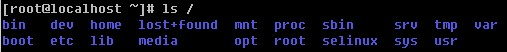

Linux学习
===

目录结构
---



`/`是linux的根目录，其下有许多子目录，这些子目录各司其职，下面看看他们的作用：

`/bin`：**这个目录存放着经常使用的命令文件**，如cd、ls。

`/boot`：系统启动目录，保存与系统启动相关的文件。

`/dev`：存放的是 Linux 的外部设备，linux会把所有的设备用文件的形式存储。

`/etc`：**系统管理所需要的配置文件**。

`/home`：**用户的主目录**，在 Linux 中，每个用户都有一个自己的目录，一般该目录名是以用户的账号命名的。

`/lib`：存放着系统最基本的动态连接共享库，其作用类似于 Windows 里的 DLL 文件。几乎所有的应用程序都需要用到这些共享库。

`/lost+found`：这个目录一般情况下是空的，当系统非法关机后，这里就存放了一些文件

`/media`：linux 系统会自动识别一些设备，例如 U 盘、光驱等等，当识别后，linux 会把识别的设备挂载到这个。

`/mnt`：系统提供该目录是为了让用户临时挂载别的文件系统，例如将光驱挂载在 /mnt/ 上，然后进入该目录就可以查看光驱里的内容了。

`/opt`：**自己安装的软件存放的地方**。比如你安装一个ORACLE数据库则就可以放到这个目录下。默认是空的

`/proc`：一个虚拟的目录，它是系统内存的映射，访问这个目录来获取系统信息

`/root`：**该目录为系统管理员的用户主目录**。

`/sbin`：存放的是系统管理员使用的系统管理程序

`selinux`：这个目录是 Redhat/CentOS 所特有的目录，Selinux 是一个安全机制，类似于 windows 的防火墙，存放selinux相关的文件

`/srv`：该目录存放一些服务启动之后需要提取的数据。

`/sys`：这是 Linux2.6 内核的一个很大的变化。该目录下安装了 2.6 内核中新出现的一个文件系统 sysfs 。该文件系统是内核设备树的一个直观反映。当一个内核对象被创建的时候，对应的文件和目录也在内核对象子系统中被创建。

`/tmp`：用来存放一些临时文件。

`/usr`：unix shared resources(共享资源) 的缩写，**系统安装的软件的存放目录**，类似于 windows 下的 program files 目录。

`/usr/bin`：系统用户使用的应用程序。 

`/usr/sbin`：超级用户使用的比较高级的管理程序和系统守护程序。

`/usr/src`：内核源代码默认的放置目录。

`/var`：**存放着在经常被修改的文件，包括各种日志文件**。


基础命令
---

打开终端快捷键：`ctrl + alt + t` 

查看使用的历史命令：`history [n]`。n表示最近使用过的n个指令

`shutdown now`：立该进行关机 

`shudown -h 1`：1 分钟后会关机了

`shutdown –r now`：马上重新启动计算机 

`reboot`：现在重新启动计算机 

`sync`：把内存的数据同步到磁盘

> 不管是重启系统还是关闭系统，首先要运行 **sync** 命令，把内存中的数据写到磁盘中。目前的 shutdown/reboot 等命令均已经在关机前进行了 sync。


Vi / Vim使用
---

vi编辑器是所有Unix及Linux系统下自带标准的编辑器，他就相当于windows中的记事本。

vim可以当作vi的升级版本，他可以用多种颜色的方式来显示一些特殊的信息。
vim会依据文件扩展名， 判断该文件的内容而自动的执行该程序的语法判断式，再以颜色来显示程序代码与一般信息。vim里面加入了很多额外的功能，例如正则表达式的搜索、块复制等等。

这两者的使用都一样，为了方便，使用vim作为演示。

使用`vim 文件名.后缀` 即可打开文件。


### 三种状态

vim可以分为三种状态，分别是命令模式、输入模式和底线命令模式，各模式的功能区分如下：

**命令模式**：（默认）

vim打开文件后直接进入命令模式。在这个模式中， 可以使用上下左右按键来移动光标，也可以使用 一些命令 删除字符或删除整行内容， 还可以使用复制、粘贴来处理你的文件数据。但此模式下**无法编辑文件内容**，若需要编辑文件内容，需要切换到输入模式。

**输入模式**：

在命令模式下按 `i` 或 `o` 或 `a` 等任何一个字母可以进入编辑模式。按下**【Esc】** 键即可回到命令模式。在输入模式下可以正常的对文件内容进行编辑。

**底线命令模式**：

如果要保存退出文件，需要切换到底线命令模式。在命令模式输入 `:` 或 `/` 可以进入底线命令模式，此时光标移动到左下角。在这个模式中， 可以提供查找、读取、存盘、退出、显示行号 等动作。按**【Esc】** 键可以回到命令行。


### 常见操作

命令模式下：

- 拷贝当前行：`yy` 并 粘贴 `p`。
  - 如果拷贝5行：`5yy` 并 粘贴 `p`。光标所在的行开始往下拷贝5行

- 快速到最首行：`gg` 

- 快速到最末行：`shift+g` 

- 光标移动到某行：输入行号，再输入 `shift+g` 

- 撤销：`u`

底线命令模式下：

- 查找某个单词：输入`:关键字` 然后回车，可以按 `n` 查看下一个

- 设置文件的行号：`:set nu` 

- 取消文件的行号：`:set nonu` 
- 退出文件：`q` 
- 保存并退出：`wq` 
- 强制保存并退出：`wq!` 


用户管理
---

- `su -用户名`：切换到指定用户。如果不指定用户名则默认切换到root用户。
  - 从权限高的用户切换到权限低的用户，不需要输入密码，反之需要。 
  - 当需要返回到原来用户时，使用 `exit` 或 `logout` 指令
- `useradd 用户名`：添加用户
- `passwd 用户名`：修改指定用户的密码
- `userdel 用户名`：删除用户，会保留家目录
  - 如果要连同家目录一起删除：`userdel -r 用户名` 
- `id 用户名`：查询用户信息
- `who am i`：查看当前用户


组管理
---

在 linux 中的每个用户必须属于一个组，不能独立于组外。

用户组：系统可以对有共性权限的多个用户进行统一的管理，如给一个用户组赋予一个权限，则相当于给组里所有的用户赋予此权限。

- `groupadd 组名`：新增组
- `groupdel 组名`：删除组
- `usermod -g 用户组 用户名`：修改用户的组
  - 添加用户时直接加上组：`useradd -g 用户组 用户名` 


权限管理
---

在 linux 中每个文件都有所有者、所在组、其它组的概念

所有者：创建文件的用户。

所在组：文件所在的组，默认在所有者所在的组。

其他组：除了所在组的其他组。

- `ls –l`：查看文件的所有者和所在组信息

- `chown username filename`：修改文件的所有者

- `chown -R username filename`：修改目录的所有者

- `chgrp groupname filename`：修改文件的所在组

- `chgrp -R groupname filename`：修改目录的所在组


Lnux中有的文件及文件夹都有至少权限三种权限：

|   权限    |  对文件的影响  |       对目录的影响       |
| :-------: | :------------: | :----------------------: |
| r（读取） | 可读取文件内容 |      可列出目录内容      |
| w（写入） | 可修改文件内容 | 可在目录中创建、删除内容 |
| x（执行） | 可作为命令执行 |      可访问目录内容      |

在使用 `ls -l`  查看文件信息的时候，会显示出以下信息：


> 第一列表示 文件的类型，所有者、所在组和其他组对该文件的权限。
>
> 第二列表示 文件硬链接数或目录的子文件数
>
> 第三列表示 文件所有者
>
> 第四列表示 文件所在组
>
> 第五列表示 文件大小
>
> 第六七八列表示 文件最后修改的日期
>
> 最后一列表示 文件名

第一列的**第一个字符**表示文件类型，

- \- 普通文件
- l 链接，相当于windows的快捷方式
- d 目录
- c 字符设备，如鼠标键盘
- b 块设备，如硬盘

其余字符**三个一组**表示所有者、所在组和其他组对该文件的权限（**-** 表示无此权限）。

如`-rwxrw-r--` 表示该文件是个普通文件，所有者的权限是读写执行，所在组的权限是读写，其他组的权限只有读。


### chmod

通过 chmod 指令，可以修改**文件或者目录**的权限。

<u>第一种方式</u>：+ 、-、= 变更权限，u:所有者 g:所有组 o:其他组 a:所有人(u、g、o 的总和)

`chmod u=rwx,g=rx,o=x 文件/目录名`：给该文件赋予权限

`chmod o+w 文件/目录名`：给其他组增加写的权限


<u>第二种方式</u>：通过数字变更权限。4表示r，2表示w，1表示x，两列可以任意相加表示组合，例如3表示wx。

`chmod 751 abc.txt`：等价于 `chmod u=rwx,g=rx,o=x abc.txt` 

> 如果只写一个数字，则表示给其他组修改权限，如`chmod 6 abc.txt`
>
> 如果只写两个数字，则表示给其他组修改权限，如`chmod 56 abc.txt` 


运行级别
---

0：关机 

1：单用户【常用于找回root丢失密码】 

2：多用户状态没有网络服务 

3：**多用户状态有网络服务** 

4：系统未使用保留给用户 

5：**图形界面** 

6：系统重启 

常用运行级别是 3 和 5 ，也可以指定默认运行级别。

指定运行级别的命令：`init 运行级别` 


文件目录类指令
---

`pwd`：显示当前工作目录的绝对路径

`ls [选项] [路径]`：查看【指定路径下的】文件信息

- 常用选项

  `-a`：显示所有的文件和目录，包括隐藏的。

  `-l`：以列表的方式显示详细信息
  
  `-lh`：详细信息中的文件大小不以字节方式显示

`cd 参数`：切换到指定目录

- 常用参数：

  `路径`：切换到指定路径

  `~`：回到自己家目录

  `..`：回到上一级目录

`mkdir [选项] 要创建的目录`：创建目录

- 常用选项：

  `-p`：创建多级目录。如`mkdir -p /home/animal/tiger` ，如果创建多级目录不使用此参数则会报错

`rmdir 空目录`：删除**空**目录，如果该目录下有文件或文件夹则删除失败。

`touch 文件名.后缀`：创建空文件。

- 可指定路径：`touch /home/hello.txt` 

`cp [选项] src dest`：拷贝src文件 到 指定目录dest下。

- 拷贝文件夹时需要加 `-r` 参数，如`cp -r /home/bbb /opt` 
- 强制覆盖不提示的方法：`\cp` 命令，如 `\cp -r /home/bbb /opt`

`rm [选项] 要删除的文件或目录`：移除文件或目录

- 常用参数

  `-r` ：递归删除整个文件夹 

  `-f` ： 强制删除不提示

`mv oldName newName`：移动文件或重命名

- 移动文件：`mv /home/pig.txt /home/hjh/pig.txt` (不同目录下)
- 重命名：`mv /home/cat.txt /home/pig.txt` （同个目录下）
- 移动并重命名：`mv /home/pig.txt /home/hjh/cat.txt` 


查看类指令
---

`cat [选项] 查看的文件`：查看文件内容

- 常用选项

  `-n`：显示行号。

`more 要查看的文件`：全屏幕的方式按页显示文件内容

- 空白键：代表向下翻一页
- enter：向下翻一行
- q：退出

`less 要查看的文件`：分屏查看文件内容

- 它的功能与 more 指令类似，但是比 more 指令更加强大，支持各种显示终端。less 指令在显示文件内容时，并不是一次将整个文件加载之后才显示，而是根据显示需要加载内容。
- 空白键：代表向下翻一页
- pageup/pagedown：向上/向下翻一页
- /关键字：搜索关键字
- q：退出

`head -n 行数 文件`：显示文件的开头前行数的内容

- `head 文件`：默认显示前10行

`tail -n 行数 文件`:显示文件的最后行数的内容

- `tail 文件`：默认显示最后10行
- `tail -f 文件`：实时追踪该文档的所有更新


重定向类指令
---

`echo 输出内容`：

-  `echo “hello”`：向控制台输出hello
- `echo $PATH`：输出环境变量

`>`：输出重定向 和 `>>` 输出追加

- `cat 文件 1 > 文件 2`：将文件 1 的内容覆盖到文件 2
- `ls >> a.txt`：列表的内容写入文件 a.txt 中（追加）
- `echo "内容" >> 文件` (追加)


管道
---

管道 `|`，是将 前一个命令的输出 作为 后一个命令的输入。`命令1 | 命令2 | ...` 

`cat -n a.txt | more`：效果等同于 `more a.txt`


软链接和硬链接
---

软链接：也称为符号链接，类似于 windows 里的快捷方式，只是维持了从软链接到源文件的指向关系。

硬链接： 指向同一个文件，即同个文件有多个路径，即使删除了原文件，用户通过硬链接关联的文件一样可以访问原文件的数据。

***

相关命令：`ln` 

创建硬链接：`ln 原文件 链接文件` 

- `ln /root /home/myroot`：在 /home/myroot 硬链接到 /root 目录

创建软链接：`ln -s 原文件 链接文件 ` 

- `ln -s /root /home/myroot`：在 /home/myroot 软连接到 /root 目录

删除链接：`rm 链接文件` 


测试：

```cmd
[hjh@ubuntu ~]$ echo "hello world" > helloWorld 
[hjh@ubuntu ~]$ ln helloWorld h1 # h1硬链接
[hjh@ubuntu ~]$ ln -s helloWorld h2 # h2软链接
[hjh@ubuntu ~]$ cat h1 
hello world
[hjh@ubuntu ~]$ cat h2 
hello world
[hjh@ubuntu ~]$ rm helloWorld # 删除原文件
[hjh@ubuntu ~]$ cat h1 # 硬链接仍然可以访问
hello world
[hjh@ubuntu ~]$ cat h2 # 软链接访问不到
cat: h2: No such file or directory
```


时间类指令
---

`date`：显示当前时间

`date "+%Y-%m-%d %H:%M:%S"`：显示当前时间年月日时分秒

`date -s 字符串时间`：设置当前时间

- `date -s “2020-11-03 20:02:10”` 


搜索类指令
---

### find

`find 查找路径 选项`：指定目录向下递归地遍历其各个子目录，将满足条件的文件或者目录显示在终端。

可用选项：

- `-name 关键字`：按照关键字查找，支持正则
  - `find /home -name hello.txt` 
- `-user 用户名`：查找属于该用户名的文件
  - `find /opt -user hjh` 
- `-size 文件大小`：按照文件大小查找
  - `find / -size +200M` 查找整个 linux 系统下大于 200M 的文件
  - +n大于、-n小于、n等于，单位有 k,M,G


### locate

locate 指令可以快速定位文件路径。locate 指令利用事先建立的系统中所有文件名称及路径的 locate 数据库实现快速定位给定的文件。

locate 指令无需遍历整个文件系统，而是搜索一个数据库 /var/lib/mlocate/mlocate.db ，查询速度较快。Linux系统自动创建这个数据库，并且每天自动更新一次。所以为了保证查询结果的准确度，**最好在每次使用locate命令前，使用 `updatedb` 指令更新 locate 数据库**。

命令：`locate 文件` 

```bach
[root@ubuntu ~]# touch new.txt
[root@ubuntu ~]# locate new.txt
[root@ubuntu ~]# updatedb
[root@ubuntu ~]# locate new.txt
/root/new.txt
```


### grep

grep 有着过滤作用，只显示需要显示的内容，通常跟管道配合使用。

命令：`grep [选项] 查找内容 源文件` 

常用选项：

- -n：输出匹配内容的同时输出其所在行号
- -i：忽略大小写
- -c：统计个数

例子：

在 hello.txt 文件中，查找 yes 所在行，并且显示行号：

`cat /home/hello.txt | grep -n yes`  或者 `grep -n yes /home/hello.txt` 


压缩和解压命令
---

### gzip

gzip 命令只能用来压缩文件，不能压缩目录。压缩后文件的后缀为 *.gz 

压缩：`gzip filename` 

解压：`gzip -d filename.gz` 


### zip

zip 命令既可以压缩文件，也可以压缩目录。压缩后文件的后缀为 *.zip 

压缩：`zip [-r] 压缩后的名字.zip 要压缩的文件`，压缩文件夹时需要加上 **-r** 选项

解压：`unzip [-d dest] xxx.zip`，若指定-d sest，则表示将xxx.zip解压到dest目录下


### tar

 tar 压缩后文件的后缀为 .tar.gz 或 .tgz。

压缩：`tar -zcvf filename.tar.gz dirname` 

压缩多个文件：`tar cvf filename.tar.gz dirname1 dirname2 dirname3.....` 

解压：`tar -zxvf filename.tar.gz` 

- -z：打包的时候同时压缩
- -c：打包
- -x：解压
- -v：显示过程
- -f：指定打包后的文件名


磁盘分区
---


进程管理
---

### ps

在 LINUX 中，每个执行的程序都称为一个进程。每一个进程都分配一个进程号 pid

ps命令列出的是当前那些进程的快照，就是执行ps命令的那个时刻的那些进程的状态。

ps -ef 是用标准的格式显示进程的，其格式如下：


其中各列的内容意思如下

- UID：用户名 
- PID：进程的ID 
- PPID：父进程ID 
- C：进程占用CPU的百分比 
- STIME：进程启动的时间
- TTY：该进程在哪个终端上运行
  - `?` 表示与终端无关
  - `pts/0` 表示由网络连接主机进程。 
- TIME：该进程实际使用CPU运行的时间
- CMD：由哪个命令启动的进程

***

ps常用参数：

- -e：显示所有进程
- -f：显示所有列
- -o：显示自定义列，多个列之间用 `,` 分割
  - `ps -eo pid,tid,%cpu | grep 222` 查看222进程的 进程id，线程id，和cpu使用情况

线程状态stat，使用`ps -eo pid,stat` 可以查看进程的状态

```tex
D     无法中断的休眠状态（通常 IO 的进程）
R     正在运行
S     处于休眠状态，静止状态
T     停止或被追踪，暂停执行
X     死掉的进程
Z     僵尸进程,不存在但暂时无法消除
W     没有足够的记忆体分页可分配
WCHAN 正在等待的进程资源
<     高优先级进程
N     低优先级进程
L     有记忆体分页分配并锁在记忆体内
s     进程的领导者（在它之下有子进程）
l     多进程的
+     位于后台的进程组
```


### top

top可以**实时的**监控系统状态信息和进程所使用的资源。显示进程的数据包括 PID、优先级PR、%cpu、%memory等。


命令：`top [选项]` 

- -d 秒数：每个几秒就刷新。默认3秒
- -i：不显示闲置或僵死进程
- -p pid：动态查看指定的进程


### kill

若是某个进程执行一半需要停止时，或是已消了很大的系统资源时，此时可以考虑停止该进程。使用 kill 命令来完成终止进程。

命令：

`kill [-9] pid`：通过进程号终止进程。**`-9` 表示强制终止**。

`killall 进程名称`：通过进程名称（支持通配符）杀死进程及其所有子进程。


服务管理
---

服务(service) 是个守护进程，运行在后台，**通常都会监听某个端口**，等待其它程序的请求，比如mysqld、sshd、防火墙等。


### 相关指令

| 指令                       | 作用                             |
| -------------------------- | -------------------------------- |
| systemctl start 服务名     | 开启服务                         |
| systemctl stop 服务名      | 关闭服务                         |
| systemctl status 服务名    | 显示服务的状态                   |
| systemctl restart 服务名   | 重启服务                         |
| systemctl enable 服务名    | 开机启动服务                     |
| systemctl disable 服务名   | 禁止开机启动                     |
| systemctl is-enable 服务名 | 查看服务是否自启动               |
| systemctl list-unit-files  | 查看系统中所有服务的开机启动状态 |


### 打开/关闭指定端口

| 指令                                               | 作用                                        |
| -------------------------------------------------- | ------------------------------------------- |
| firewall-cmd --permanent --add-port=端口号/协议    | 打开端口                                    |
| firewall-cmd --permanent --remove-port=端口号/协议 | 关闭端口                                    |
| firewall-cmd --reload                              | 重新载入。开放/关闭端口之后要reload才能生效 |
| firewall-cmd --query-port=端口/协议                | 查询端口是否开放                            |

例：开放 111 端口

`firewall-cmd --permanent --add-port=111/tcp` 

**tips：开放/关闭端口后要reload。** 


监控网络状态
---

netstat可以查看系统网络情况


`netstat [选项]` 

- -a：显示所有连接
- -t：仅显示tcp相关选项
- -u：仅显示udp相关选项
- -n：使用ip地址显示
- -p：显示 PID 和进程名称
- -l：仅显示监听状态的连接

例如：

- netstat -a   # 列出所有端口

- netstat -at   # 列出所有TCP端口

- netstat -au  # 列出所有UDP端口


包管理
---

### rpm

rpm（RedHat Package Manager）用于本地安装包的 打包及安装，打包生成的是 .RPM 扩展名的文件。其安装类似 windows 的 setup.exe。

`rpm -qa| grep X `：查看X的所有软件包信息

`rpm -ql 软件包名`：查询软件包中的文件

`rpm -e 软件包名`：卸载软件

`rpm -e --nodeps foo 软件包名`：强制卸载

`rpm -ivh 软件包名`：安装包

- i=install 安装 

- v=verbose 提示 

- h=hash 进度条


### yum

Yum 是一个 Shell 前端软件包管理器。基于 RPM 包管理，能够从指定的服务器自动下载 RPM 包并且安装，可以自动处理依赖性关系，并且一次安装所有依赖的软件包。

`yum list | grep xx`：查询 yum 服务器是否有 xx软件

`yum install xxx`：下载安装


### apt

apt 是 Advanced Packaging Tool 的简称，是一款安装包管理工具。**在 Ubuntu 下**，我们可以使用 apt 命令进行软件包的安装、删除、清理等，类似于 Windows 中的软件管理工具。

> 大多数 apt 命令必须以具有 **sudo** 权限的用户身份运行。

`sudo apt update`：更新软件包索引

`sudo apt install package_name`：安装包

`sudo apt remove package_name`：卸载包

`sudo apt show package_name`：显示包信息

> 因为apt的服务器是在美国，有时候安装速度会很慢，所以可以去[国内镜像源](https://mirrors.tuna.tsinghua.edu.cn/) 下载


shell
---


