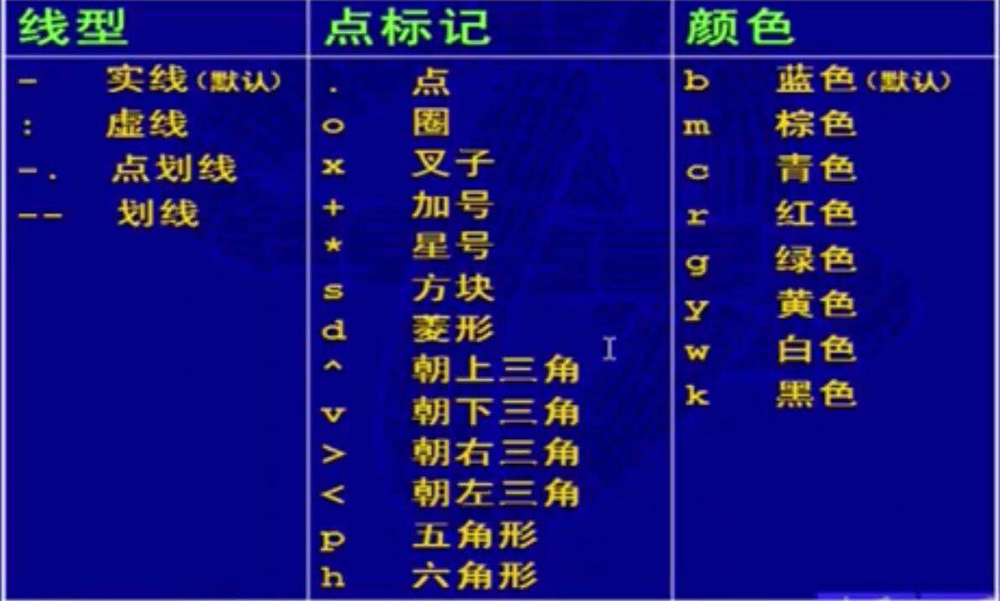

# Matlab

`,` 分隔代码，会将代码的结果显示的屏幕上

`;` 分隔代码，之后运行代码，不显示到屏幕上

`...` 续行符

`%` 注释

`format short|long` 指定显示精度

`input('')` 跟python的一样

`disp(输出项)` 输出内容 

`vpa(a,7)` 输出a（保留7位小数）

**single(x)**：将x转换成单精度函数

**double(x)**：将x转换成双精度函数

**length(x)**：求x的长度

**size(x)**：求矩阵的行和列

函数调用格式为：`函数名(参数)` 参数必须是矩阵。**注意**：标量是特殊的矩阵

**exp(X)**：求e的X次方

**sin(a)**：a为弧度

**sind(a)**：a为角度

**atan(a)**：输出a的arctan值

**abs(a)**：求绝对值、负数的模、ASCII的值

**rem(x)**：求x的余数

**isprime(x)**：若x为素数则返回1

**[a,b] = find(A)**：找出矩阵x中不为0元素的下标

**X = find(A)**：找出矩阵x中不为0元素的索引，竖着数


## 预定义变量

`ans` 默认赋值变量

`i j` 代表虚数单位

`pi` 代表圆周率

`NaN` 代表不定值

`Inf` 无穷大

`realmin` 最小正实数

`realmax` 最大正实数

`clear` 清除已存在的所有变量

`clc` 清除命令行

`who` 查看已存在的变量

`whos` 查看已存在的变量（更详细）

内存变量文件：

```
save 	变量文件名			创建内存变量文件
load 	变量文件名			导入内存变量文件
```


## 文件操作

`A=xlsread('文件路径\文件名称', '工作表名称', '行列范围')`，即可读取指定的工作表，**默认读取Sheet1中的数据** ；行列范围以`a1:c2`为例，表示以**a1**为起始，**c2**为终点的矩阵

`xlsread('文件路径\文件名称', 写入的数据, '工作表名称')` 


## 冒号表达式

格式：`初始值:步长:终止值` 默认步长为**1**

**如 a = 0:100 等价于 0:1:100**


## 矩阵的创建

矩阵元素用**`[]`**括起，同一行的元素用 **`,`** 隔开，不同行之间用 `; `隔开。

如 A = [1,2,3;4,5,6]

**`linspace(a,b,n=100)`**：生成a~b之间的n个数的等差数列

**tips：数组(向量)是 特殊的矩阵，下标从1开始，a(4)代表取第四个元素4**


取第二行第三列的元素：**A(2,3) = 6**

取第二行第一二列的元素：**A(2,[1,2]) = [4,5]** 

取第二行全部列的元素：**A(2,:) = [4,5,6]**

**B = A+3** 把A矩阵的全部元素加3后复制给B

**[A,B]** AB矩阵按**行**拼接 ; **[A;B]** AB矩阵按**列**拼接

**sum(A)** 对矩阵A的每一列求和，形成一个向量。若A为向量则对A的每个元素进行求和。

**consum(A)**  累加

**prod(A, dim = 1)** 对矩阵A的每一列的乘积形成一个向量。若A为向量则对A的每个元素进行乘积。**dim = 2表示沿行计算**。

**min(A)** 同理

**rand(n,m)** 生成n行m列的随机矩阵。

**rand**  随机生成一个数

**zeros(n,m)** 生成n行m列的零矩阵

**ones(n,m)** 生成n行m列的一矩阵

**eye(n,m)** 生成n行m列的单位矩阵


**[V,D] = eig(A)** 求矩阵A的特征向量和特征值。

**corrcoef** 相关系数矩阵

**rank(A)**  求A的秩

**det(A)** 求A的行列式

**inv(A)** 求A的逆矩

**A‘** A的转置

**linsolve(A,b)** 等价于inv(A)*b,求线性方程组特解

**norm(A)**  求矩阵A或向量A的范数（长度，模）


## 数组矩阵运算

**`A - B`** 矩阵相加减

**`K * A`** 数成矩阵

**`K + A`** A的每个元素加上K

**`A .^ K`** A的每个元素都做K次方运算

**`K .^ A`** A的每个元素作为K的幂

**`A .* B`** AB进行点运算

**`A * B`** AB进行矩阵相乘

**`A .\ B`** A中的元素作为分母

**`A ./ B`** A中的元素作为分子

**`K ./ A`** 数除以数组

**`A / B`** A的逆 乘 B，等价于XA=B

**`A \ B`** A 乘 B的逆，等价于 AX=B

**tips：点乘就是对应元素的运算。区别于矩阵相乘**


## 程序控制

**if**

```
if 条件 语句
[elseif 条件 语句]
[else 语句]
end
```

***

**switch**

```
switch()
case() 语句
case() 语句
...
otherwise 语句
end
```

***

**for**

```
for 循环变量=初值:增量:终值
语句
end
```

***

**while**

```
while ()
语句
end
```

**tips：循环语句可以使用`break`和`continue`**


## M文件

M文件分为：

- **脚本文件**（相当于一个功能模块）

  - 不可以传递参数
  - 变量为全局变量
  - 使用时直接输入**文件名**使用

- **函数文件**（相当于一个功能函数）

  - 可以传递参数

  - 变量为局部变量

  - 基本结构：（函数文件名一般跟函数名一致）

    - ```matlab
      function [输出变量] = 函数名(输入变量)
      	函数体语句
      end
      ```
  
  - 使用时跟函数调用差不多
  
  - 如果要给默认值时，判断nargin的个数来实现参数的默认值。


## 函数句柄 与 匿名函数

**函数句柄**即函数名可以进行赋值：

假设函数`eg`是已经定义好的，通过`fname = @eg` 此时`fname`就相当于`eg`函数了

***

匿名函数：`@(参数) 函数体`


## 曲线图

`plot(x,y,[选项])` 绘制曲线，y是x的函数，x是区间。

`plot([1 2],[5 10],'-o')` 画出一条(1,5)(2,10)的直线

`fplot(函数,区间[,选项])` 根据函数画出在区间内的图形

选项值：



如：**`fplot(@(x)2*exp(-0.5*x)*sin(2*pi*x),[0,2*pi],'gd')`**

***

`plot3(x,y,z,选项)` 绘画三维曲线

如：

```
t=0:pi/50:2*pi;
x=8*cos(t);y=4*sqrt(2)*sin(t);
z=-4*sqrt(2)*sin(t);
plot3(x,y,z,'p')
```


## 曲面图形

`meshgrid(x,y)` 先画出3维坐标的x轴坐标与y轴坐标。

`Z = peaks(X,Y);`  通过网格坐标计算函数值，产生三维凹凸面

`mesh(x,y,z)` 网格图

`surf(x,y,z)` 曲面图

`countour(x,y,z)` 等高线图，红高蓝低

`countour3(x,y,z)` 三维等高线图

```
xa = -2:0.2:2; ya = xa;
[x,y] = meshgrid(xa,ya);
z = x.*exp(-x.^2-y.^2);
mesh(x,y,z); % 画网格图
pause % 暂停，按任意键继续。可指定秒数
surf(x,y,z); % 曲面图
pause
contour(x,y,z); % 等高线
pause
contour(x,y,z,[0.1,0.1]); % 在[0.1,0.1]区间显示图形
pause
countour3(x,y,z) % 三维等高线
pause
```

***

可以在图形中添加一些内容：

`title('')` 图形名称

`xlabel('')` x轴说明

`ylabel('')` y轴说明

`set(gca,'xtick',1:100)  % 设置x轴横坐标的间隔为1` 

`legend('原始数据','拟合数据','预测数据')` 添加图例

`plot(‘DisplayName’, num2str(图例))`动态地添加图例。**【注意】**最后还要使用`legend show` 

`text(2,4,'codekiang')  % 在坐标为(2,4)的点上标上字符串` 

`hold on/off` 保留/释放现有图形

`grid on/off` 画/不画网格线

`box on/off` 加/不加边框线

`axis on/off` 显示/取消坐标轴

`axis([xs xe ys ye])` 指定坐标轴的范围

```
xa = -2:0.2:2; ya = xa;
[x,y] = meshgrid(xa,ya);
z = x.*exp(-x.^2-y.^2);

surf(x,y,z); % 曲面图

title('曲面图')
xlabel('横坐标')
ylabel('纵坐标')
box off
grid off
```

***

图形窗口分割 `subplot(m,n,p)` 即可以在一个窗口显示多个图形

如`subplot(2,2,1)`  把窗口分成两行两列，随后的图形画在第一个位置（第一行第一列）

`subplot(2,1,2)` 把窗口分成两行一列，随后的图形画在在第二行的位置

***


## 求解方程和方程组

**g = coeffs(f,x)** 求表达式f的系数（逆序），需要使用g(end;-1;1) 变回正常顺序

**y = ployval(p,x)** 求多项式p在x处的y值，x可以是一个向量

**p = polyfit(x,y,k)** 用k次多项式拟合向量（x,y），返回多项式系数（降幂排序）

***

**solve**

求解单变量方程

```matlab
syms x;
answ = solve(sin(x)==1, x) 
```

方程组求解

```matlab
syms u v a;
eqn = [2*u + v == a, u-v == 1]
[au, av] = solve(eqn, [u, v])
```

***

**[x,f,h] = fsolve(fun,x0)** 返回**多元**函数在x0附近的一个零点。x0必须是一个向量

`x`：函数fun在x0附近的一个零点或向量

`f`：返回fun在零点的函数值，一般接近0

`h`：若大于0则说明计算可靠

**tips：**在多元函数的时候应该把x，y变成一个向量，即把**x变成x(1)**，把**y变成x(2)**

例如：

```matlab
% 或者写到m文件里面
fun = @(x) [4*x(1)-x(2)+exp(x(1))/10-1,-x(1)+4*(2)+x(1)^2/8];

x0 = [0, 0]; % 初始值
result = fsolve(fun, x0);

% m文件的使用形式 
function [F] = my_fun(x)
	F(1) = 4*x(1)-x(2)+exp(x(1))/10-1;
	F(2) = -x(1)+4*(2)+x(1)^2/8
end

result = fsolve(@my_fun, x0)
```

***

**[x,f] = fminbnd(fun,a,b)**：返回**一元**函数在**[a,b]**内的局部极小值点(x)和局部极小值(f)

**[x,f] = fminsearch(fun,x0)**：返回**多元**函数在**x0(向量)**附近的局部极小值点(x)和局部极小值(f)。

**a = lsqcurvefit(fun,a0,x,y)** 根据x，y的值，求得系数a；`a0`是`a`的初始值。


## 微分、积分

**[fx,fy] = gradient(F,x,y)** 求F沿x轴y轴(可省略)的导数

```
x = 1:0.001:1.3;
y = x.^3;

gradient(y,x)
```

**trapz(x,y)**  返回积分的近似值。x为区间。y为被积函数

```
x = -1:0.1:1;
y=exp(-x.^2);
trapz(x,y)
```

**integral(fun,a,b)**  求区间ab的积分。

```matlab
% 【注意】要用点乘或点除
f = @(x)exp(-x.^2);
integral(f,-1,1)
```

**integral(fun,xmin,xmax,ymin,ymax)**  求函数的二重积分

```
fun = @(x,y) 1./(sqrt(x+y).*(x+1+y).^2);
integral2(fun,0,1,0,@(x)1-x)
```


## 符号变量

**syms 变量1 变量2 变量3;**  定义符号变量

**subs(s,x,value)** 将符号表达式s中的符号变量x用value代替,即把自变量带入值

**diff(A,x,n)**：求A的n阶`导数`，A为符号表达式。【注意】如果diff作用的对象不是符号函数，那么其功能就是求差分

```matlab
syms x y;
y = 2*x^2;
diff(y,x,1)

% diff(y,x1,x2,1) 先对x1求偏导再对x2求偏导

%% diff差分例子
a = [
	4 5 6;
	7 8 9;
];
diff(a) % 一阶差分:下一行减去上一行 3 3 3
diff(a, 2) % 二阶差分 0 0
diff(a, 1, 2) % 对列进行差分:后一列减前一列 0
```

**factor(s)** 对符号表达式s进行`因式分解`

**expand(s)** 将符号表达式s`展开`

**collect(s,v)** 符号表达式s按变量v进行`合并同类项`

**simplify(exp)** 化简表达式。exp为符号表达式

**[z1,z2] = numden(sym(2.5))** 对符号表达式计算出分子分母

**symsum(s,n,start,end)** 对表达式s进行求和，n从start到end


**taylor(s,x,a,’order’,n)** 符号表达式`s`在`a`点**泰勒展开**到`n-1`式，自变量为`x` 

**limit(s,x,a,R)**： 求符号表达式s当自变量x趋于a时的极限。R取left或right，表示取左极限还是右极限

**int(f,x,a,b)** 求符号表达式`s`的**`定积分/不定积分`**，ab为界限

`mupad`可以调用代数工具箱，让结果更好看


## 概率

### 随机数据的产生

**mean(x)** 向量的均值。如x为矩阵，则求每列元素的均值。

**nanmean(x)**  自动去掉NaN的数值后求均值。

**trimmean(x,n)**  去掉数据的头尾各 **百分之n/2** 的特大或特小数

**min(x)**  最小值		  **max(x)**  最大值		**median(x)**  求中间值

**std(x)**  x的标准差		**var(x)**  x的方差		**sum(x)**  求和

**cov(x,y)**  xy的协方差		**corrcoef(x,y)**  xy的相关系数

**sort(x)**  升序排序			**sorrows(x,n)**  对x的第n列进行升序排序

**randperm(n[, num])** 对1到n的整数打乱顺序。num代表选取几个数。

**randn(m,n)**  m行n列标准正态分布

**unidrnd(N,m,n)**  范围从1~N的m行n列离散均匀分布。

**unifrnd(a,b,m,n)**  ab区间上的m行n列连续型均匀分布

**binornd(k,p,m,n)**  参数为k，p的m行n列二项分布

**normrnd(mu,sigma,m,n)**  均值为mu，均方差为sigma的m行n列的正态分布

***

### 随机变量的概率密度计算

**Y=pdf(name,K,A,B)**  返回在X=K处、参数为A、B、C的概率密度值，对于不同的分布，参数个数是不同；name为分布函数名

**normcdf(x,mu,sigma)**  参数为mu，sigma的正态分布累积分布函数值 F(x)=P{X≤x}

```
p1=normcdf(5,3,2)-normcdf(2,3,2)

p1 = 0.5328
```


## 插值、拟合、回归

**拟合**：根据已知数据求函数。求出来的函数**不一定**经过已知数据点。

**ployfit(x,y,k)**  用k次多项式拟合数据

**插值**：根据已知数据求函数。求出来的函数**一定**经过已知数据点。

- 分段线性插值：将各数据点用折线连接。
- 多项式插值：求得的函数是多项式的。
- 样条插值：分段多项式的光滑连接。
- 最小二乘拟合：求参数c，使函数的惨差达到最小

**interp1(x,y,xi)**  根据x，y给出在xi的分段线性插值结果yi 

```matlab
x = 0:2*pi;  
y = sin(x);  
xx = 0:0.5:2*pi;  

% interp1对sin函数进行分段线性插值，调用interp1的时候，默认的是分段线性插值  
y1 = interp1(x,y,xx,'linear');  
subplot(2,2,1);
plot(x,y,'o',xx,y1,'r')  
title('分段线性插值')  

% interp1对sin函数进行三次多项式插值
y2 = interp1(x,y,xx,'PCHIP');  
subplot(2,2,2);
plot(x,y,'o',xx,y2,'r')  
title('分段线性插值')  

%球面线性插值  
y3 = interp1(x,y,xx,'spline');  
subplot(2,2,3);
plot(x,y,'o',xx,y3,'r')  
title('球面插值') 
```

**interp2(x,y,z,xi,yi)**  根据x，y，z给出在xi,yi的分段线性插值结果zi 


