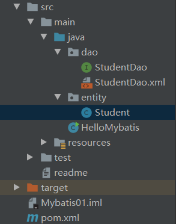
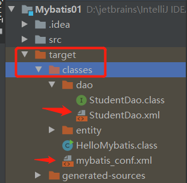
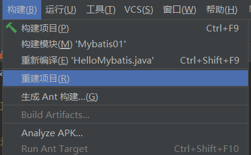
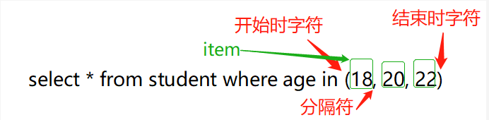
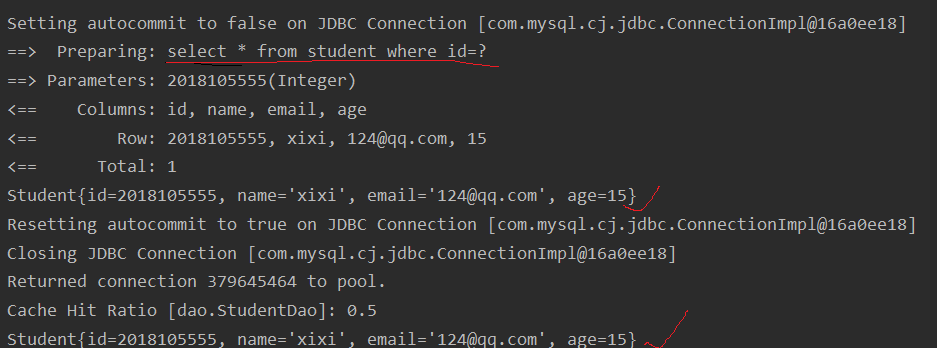

第一章：框架概述

学习之前先来了解一下三层架构：

- 界面层：跟用户打交道的，获取用户请求参数，显示处理结果。（jsp、html、servlet）
- 业务逻辑层：接收界面层传递的数据，进行逻辑操作，调用数据访问层提供的数据库操作的方法
- 数据访问层（持久层）：访问数据库，执行对数据库的增删改查

在开发中，三层架构代码通常所在的包名：

- 界面层---controller包---servlet
- 业务逻辑层---service包---XXXService类
- 数据访问层---dao包---XXXDao类

三层对应的框架：

- 界面层---springmvc
- 业务逻辑层---spring
- 数据访问层---mybatis


# 第二章：Mybatis快速入门

## 2.1 mybatis简介

`mybatis`是一个半自动ORM（对象关系映射）框架，内部封装了JDBC。使用`mybatis`时，我们只需要关注**sql语句**，而无需关注其他操作（如创建销毁Connection、Statement、sql的执行）。

`mybatis`的两个主要使命：

1. `sql mapper`：sql映射
   - 可以把数据库表中的一行数据映射为一个java对象。我们操作java对象就相当于操作表中的数据。
2. `Data Access Objects`：数据访问
   - 对数据库执行增删改查

***

在使用`mybatis`前需要配置一些基本信息。（这里以maven项目为例）

1. 创建好需要操作的实体类，即`JavaBean`。
2. 创建持久层的Dao`接口`，在接口定义操作数据库的`方法`，一般一个表对应一个接口。
3. 在`pom.xml`文件中的`dependencies`标签中加入maven的`mybatis`跟`数据库驱动`的坐标。
4. 与第二步接口同目录下创建`sql映射文件`，里面写sql语句。一般一个表对应一个映射文件。
5. 在resources包中（如果没有就手动创建）创建mybatis的主配置文件。一个项目就一个主配置文件，其提供了数据库的连接信息和sql映射文件的位置。
6. 使用mybatis=


## 2.2 前奏：配置基本信息

首先先看看我的项目结构：




### 2.2.1 编写javabean

Student

```java
package entity;

public class Student {
    private int id;
    private String name;
    private String email;
    private int age;
	// 省略了属性的setter和getter，构造方法，tostring
    ...
}
```


### 2.2.2 编写持久层的Dao接口

StudentDao

```java
package dao;

import entity.Student;

import java.util.List;

public interface StudentDao {
    //  查询所有学生信息
    List<Student> selectStudents();
}
```


### 2.2.3 引入坐标

pom.xml

```xml
<?xml version="1.0" encoding="UTF-8"?>

<project xmlns="http://maven.apache.org/POM/4.0.0" xmlns:xsi="http://www.w3.org/2001/XMLSchema-instance"
  xsi:schemaLocation="http://maven.apache.org/POM/4.0.0 http://maven.apache.org/xsd/maven-4.0.0.xsd">
  <modelVersion>4.0.0</modelVersion>

  <groupId>org.example</groupId>
  <artifactId>Mybatis01</artifactId>
  <version>1.0-SNAPSHOT</version>

  <properties>
    <project.build.sourceEncoding>UTF-8</project.build.sourceEncoding>
    <!-- 改成1.8 -->
    <maven.compiler.source>1.8</maven.compiler.source>
    <maven.compiler.target>1.8</maven.compiler.target>
  </properties>

  <dependencies>
    <dependency>
      <groupId>junit</groupId>
      <artifactId>junit</artifactId>
      <version>4.11</version>
      <scope>test</scope>
    </dependency>
    <!-- 配置mybatis的坐标 -->
    <dependency>
      <groupId>org.mybatis</groupId>
      <artifactId>mybatis</artifactId>
      <version>3.5.1</version>
    </dependency>
    <!--  配置mysql的坐标  -->
    <dependency>
      <groupId>mysql</groupId>
      <artifactId>mysql-connector-java</artifactId>
      <version>8.0.17</version>
    </dependency>
  </dependencies>

  <build>
    <resources>
      <!--因为mybatis不会编译xml文件，所以需要加上这段代码-->
      <resource>
        <directory>src/main/java</directory> <!--所在的目录-->
        <includes>  <!-- 包括目录下的.properties跟.xml文件都会进行编译 -->
          <include>**/*.properties</include>
          <include>**/*.xml</include>
        </includes>
        <filtering>false</filtering>
      </resource>
    </resources>
  </build>
</project>
```


### 2.2.4 创建映射文件

`StudentDao.xml` 

sql映射文件：写sql语句，mybatis会来这里执行sql语句

```xml
<?xml version="1.0" encoding="UTF-8" ?>
<!--
    指定约束文件，mybatis-3-mapper.dtd是约束文件名
    约束文件的作用：判断当前文件出现的标签是否符合mybatis的要求
-->
<!DOCTYPE mapper
        PUBLIC "-//mybatis.org//DTD Mapper 3.0//EN"
        "http://mybatis.org/dtd/mybatis-3-mapper.dtd">

<!--
    sql语句都写在mapper里，namespace命名空间：自定义的名称，一般为对应dao接口的全限定名
-->
<mapper namespace="dao.StudentDao">
    <!--
        在这里可以用特定的标签表示对数据库的特定操作，如：
        <select>查询 <update>更新 <insert>插入 <delete>删除
    -->
    <!--  select
            id：执行sql语法的唯一标识，一般为Dao接口里面的方法名。mybatis会根据这个来找到要执行的sql语句
            resultType：指定结果类型。mybatis会自动把ResultSet里面的每条数据的类型转换成resultType指定的类型
     -->
    <select id="selectStudents" resultType="entity.Student">
        select * from student order by id
    </select>
</mapper>
```

**tips：一个映射文件只能有一个`<mapper>`根标签。**


### 2.2.5 创建主配置文件

`mybatis_conf.xml` （名称自定义，自己能记住就行）

```xml
<?xml version="1.0" encoding="UTF-8" ?>
<!DOCTYPE configuration
        PUBLIC "-//mybatis.org//DTD Config 3.0//EN"
        "http://mybatis.org/dtd/mybatis-3-config.dtd">

<configuration>
    <!--  环境配置，default：指定mybatis使用哪个环境  -->
    <environments default="development">
        <!--  environment：一个数据库信息的配置
                id：环境的名称，要唯一。
        -->
        <environment id="development">
            <!--  mybatis的事务类型
                    type：目前先选JDBC，表示使用jdbc的Connection对象的commit，rollback来做事务处理
            -->
            <transactionManager type="JDBC"/>
            <!--  数据源即Connection对象
    				type一般为POOLED，表示使用连接池类型的数据源
    		-->
            <dataSource type="POOLED">
                <!--  数据库的驱动名，mysql8以上要加个cj  -->
                <property name="driver" value="com.mysql.cj.jdbc.Driver"/>
                <!--  连接数据库的url字符串,如果需要用到& 则需要用 &amp;代替  -->
                <property name="url" value="jdbc:mysql://localhost:3306/ssm?useSSL=false&amp;serverTimezone=UTC"/>
                <!--  访问数据库的用户名  -->
                <property name="username" value="你的账号"/>
                <!--  访问数据库的密码  -->
                <property name="password" value="你的密码"/>
            </dataSource>
        </environment>
    </environments>

    <!--  配置sql映射文件的位置  -->
    <mappers>
        <!--  一个mapper只能指定一个映射文件  -->
        <mapper resource="dao/StudentDao.xml"/>
		<!-- <mapper resource="dao/BlogMapper.xml"/>-->
    </mappers>
</configuration>
```

**tips**：

- 这里的路径都是从类路径（target/classes）开始的路径信息，即mybatis会自动补全路径`target/classes/dao/StudentDao.xml` 
- **主配置文件中的标签一定要按顺序编写，顺序如下：properties,settings,typeAliases,typeHandlers,objectFactory,objectWrapperFactory,reflectorFactory,plugins,environments,databaseIdProvider,mappers** ，有些标签后面会陆续的介绍到，这里你只需要记住，标签的顺序是有要求的就行了。


### 2.2.6 小结

- 在映射文件中，在`<mapper>`标签里写CRUD，它的`namespace`最好对应于Dao层的`接口全限定名`。CRUD标签的`id`最好对应于Dao层中的`方法名` 
- 在主配置文件中，`<configuration>`是一个根标签。`<environments default="development">`表示指定使用哪个数据库。`environment`标签里面可以配置数据库的信息（注意数据库版本的区别）。


## 2.3 初体验：HelloMybatis

配置好了文件之后，就来使用吧。

```java
import entity.Student;
import org.apache.ibatis.io.Resources;
import org.apache.ibatis.session.SqlSession;
import org.apache.ibatis.session.SqlSessionFactory;
import org.apache.ibatis.session.SqlSessionFactoryBuilder;

import java.io.IOException;
import java.io.InputStream;
import java.util.List;

public class HelloMybatis {

    public static void main(String[] args) throws IOException {
        // 使用mybatis
        String config = "mybatis_conf.xml";
        // 1.读取主配置文件
        InputStream in = Resources.getResourceAsStream(config);
        // 2.使用SqlSessionFactoryBuilder创建SqlSessionFactory对象
        SqlSessionFactory factory = new SqlSessionFactoryBuilder().build(in);
        // 3.从SqlSessionFactory中获取SqlSession对象
        SqlSession sqlSession = factory.openSession();
        // 4.指定要执行的sql语句标识. 映射文件中的namespace+"."+标签的id值
        String sqlId = "dao.StudentDao"+"."+"selectStudents";
        // 5.通过sqlId找到sql语句并执行
        List<Student> students = sqlSession.selectList(sqlId);
        // 6.输出结果
        students.forEach(stu -> System.out.println(stu));
        // 7.关闭SqlSession对象
        sqlSession.close();
    }
}
```

**tips**：如果你按照推荐的命名方式命名，那么你可以认为`sqlId`是指定要执行哪个接口中的哪个方法。


## 2.4 小补充

**补充1** 

在编译过程中，所有的文件都会被编译到`target/classes`下，如果是xml文件就会直接复制过来，如图：



所以在项目中的路径都是从`target/classes`开始的，但是写的时候不需要加上它。

***

**补充2**

如果你运行项目时，报了这个错误，说找不到主配置文件或者映射文件。

```java
Exception in thread "main" java.io.IOException: Could not find resource mybatis_conf.xml
	at org.apache.ibatis.io.Resources.getResourceAsStream(Resources.java:114)
	at org.apache.ibatis.io.Resources.getResourceAsStream(Resources.java:100)
	at HelloMybatis.main(HelloMybatis.java:18)
```

首先，你要确保你的主配置文件在resources目录中（该目录是要有这个标记，表示是资源目录）


然后你可以采用这种方法：`构建----重建项目`，然后再运行项目。



`实在不行的话，你就直接复制xml文件到 target/classes 下正确的位置。` 


## 2.5 小体验：like模糊查询

**方式一**：在参数中设置匹配字符（`% _`）

main函数主要代码：

```java
String sqlId = "dao.StudentDao"+"."+"selectStudentsLikeName";
// 参数中带了匹配字符 %
String name = "%杭%";
List<Student> students = sqlSession.selectList(sqlId, name);
students.forEach(stu -> System.out.println(stu));

sqlSession.close();
```

dao层主要代码：

```java
//  通过名字模糊查询学生信息
List<Student> selectStudentsLikeName(String name);
```

映射文件主要代码：

```java
<select id="selectStudentsLikeName" resultType="entity.Student">
    select * from student where name like #{name}
</select>
```


**方式二：**在映射文件的sql语句中添加匹配字符。

main函数主要代码：

```java
String sqlId = "dao.StudentDao"+"."+"selectStudentsLikeName";
// 参数中带了匹配字符 %
String name = "杭";
List<Student> students = sqlSession.selectList(sqlId, name);
students.forEach(stu -> System.out.println(stu));

sqlSession.close();
```

dao层主要代码：

```java
//  通过名字模糊查询学生信息
List<Student> selectStudentsLikeName(String name);
```

映射文件主要代码：

```xml
//【注意】%跟参数前后要有空格
<select id="selectStudentsLikeName" resultType="entity.Student">
     select * from student where name like "%" #{name} "%"
</select>
```

**tips：** 建议使用第一种方式，因为第二种方式比较麻烦，且不利于维护。


## 2.6 再体验：配置日志

照着上面的步骤，自己来实现一下，insert操作吧，需要提示的是，插入操作需要使用`#{参数名}`来获取参数，如果参数是一个`javabean`，则直接用`属性名`即可，第四章再详细解释参数问题，现在暂时知道这么用就可以了。

例如我的映射文件的插入代码：

```java
<insert id="insertStudent">
    insert into student value(#{id},#{name},#{email},#{age});
</insert>
```

我的调用部分：

```java
import entity.Student;
import org.apache.ibatis.io.Resources;
import org.apache.ibatis.session.SqlSession;
import org.apache.ibatis.session.SqlSessionFactory;
import org.apache.ibatis.session.SqlSessionFactoryBuilder;
import java.io.IOException;
import java.io.InputStream;

public class HelloMybatis {

    public static void main(String[] args) throws IOException {
        // 使用mybatis
        // 1.定义mybatis主配置文件的名称，从类路径开始
        String config = "mybatis_conf.xml";
        // 2.读取配置文件
        InputStream in = Resources.getResourceAsStream(config);
        // 3.使用SqlSessionFactoryBuilder创建SqlSessionFactory对象
        SqlSessionFactory factory = new SqlSessionFactoryBuilder().build(in);
        // 4.从SqlSessionFactory中获取SqlSession对象
        SqlSession sqlSession = factory.openSession();
        // 5.指定要执行的sql语句标识. 映射文件中的namespace+"."+标签的id值
        String sqlId = "dao.StudentDao"+"."+"insertStudent";
        // 创建参数
        Student student = new Student(2018105555, "嘿嘿", "124@qq.com", 15);
        // 6.通过sqlId找到sql语句并执行
        int num = sqlSession.insert(sqlId, student);
        // 7.【注意】提交事务，mybatis默认不自动提交
        sqlSession.commit();
        // 8.输出结果
        System.out.println("更新了"+num+"条数据");
        // 9.关闭SqlSession对象
        sqlSession.close();
    }
}
```

**tips**：在执行DML语句（增删改）时，默认需要**手动提交**。后面会介绍自动提交的方式，一般不建议自动提交。

***

如果你执行成功了insert语句，会发现，只会输出我们自己写的输出语句。而看不到执行sql语句，在实际开发中不利于调试。所以我们需要配置日志，来使我们可以更加清楚mybatis执行了哪些sql语句。

首先，在主配置文件的根标签内添加：

```xml
<!-- settings：控制mybatis全局行为 -->
<settings>
    <!-- 设置mybatis输出日志 -->
    <setting name="logImpl" value="STDOUT_LOGGING"/>
</settings>
```

然后重新运行项目，你会发现控制台输出了mybatis的执行操作。


## 2.7 再补充：主要类介绍

`Resources`：负责读取主配置文件。

`SqlSessionFactoryBuilder`：负责创建`SqlSessionFactory`对象

`SqlSessionFactory`：是一个**接口**，创建其对象时比较耗时耗资源，一个项目有一个就够了（单例模式）。

作用：获取`SqlSession`对象。

其接口源码：

```java
public interface SqlSessionFactory {
    // 获取不自动提交事务的SqlSession
    SqlSession openSession();
	// varl为true时获取到的是自动提交事务的SqlSession
    SqlSession openSession(boolean var1);
	//其他用的少
    SqlSession openSession(Connection var1);
    SqlSession openSession(TransactionIsolationLevel var1);
    SqlSession openSession(ExecutorType var1);
    SqlSession openSession(ExecutorType var1, boolean var2);
    SqlSession openSession(ExecutorType var1, TransactionIsolationLevel var2);
    SqlSession openSession(ExecutorType var1, Connection var2);
    Configuration getConfiguration();
}
```

`SqlSession`：是一个接口，定义了许多操作数据库的方法。

**主要注意的是，`SqlSession`对象不是线程安全的，需要在方法内部使用，使用完时需要将其关闭，保证线程安全。**


# 第三章：动态代理

还记得前面说的`sqlId`吗，如果你按照推荐的命名方式命名，那么它可以表示为**接口中的方法**。

上述的前提下，我们可以使用`mybatis`的动态代理来省去 定义执行`sqlId`的操作。

我们只需要把`接口类`丢给`mybatis`，它会自动编写该接口的实现类并创建实现类的对象，最后返回该对象。

我们只需要用这个对象来调用接口中定义的方法，这种方式更符合我们的编程习惯。

比如：

其他配置文件都不变，只需要改`main`函数那块。

```java
String config = "mybatis_conf.xml";
InputStream in = Resources.getResourceAsStream(config);
SqlSessionFactory factory = new SqlSessionFactoryBuilder().build(in);
SqlSession sqlSession = factory.openSession();
// 此处不同
StudentDao studentdao = sqlSession.getMapper(StudentDao.class);
List<Student> students = studentdao.selectStudents();

students.forEach(stu -> System.out.println(stu));

sqlSession.close();
```

运行之后，结果跟之前的一样。

小结：

1. 动态代理的**前提**：按照规定命名，且dao接口中**不要使用重载方法**。
2. `mybatis`的动态机制：使用`sqlSession.getMapper(dao接口);` 
3. `getMapper`可以获取`dao`接口对应的实现类对象。


### 续航： 编写工具类

观察一下，`select`案例跟`insert`案例，你会隐隐约约感受到他们之间有很强的规律性，都需要先创建builder、factory然后创建`SqlSession`对象。

我们可以把这一步封装成一个类，然后要用到查询的就是就在这个类中获取`SqlSession`对象来进行查询。如果在另一个地方还需要用到插入操作，我们可以直接在那个地方获取`SqlSession`对象来进行插入。这样就可以减少我们的代码量。

比如我们在`java`包下创建一个`Util`包，然后在此包下创建`MybatisUtil`类。

```java
package Util;

import org.apache.ibatis.io.Resources;
import org.apache.ibatis.session.SqlSession;
import org.apache.ibatis.session.SqlSessionFactory;
import org.apache.ibatis.session.SqlSessionFactoryBuilder;

import java.io.IOException;
import java.io.InputStream;

public class MybatisUtil {

    public static SqlSessionFactory factory;

    // static块中的代码只会编译一次
    static {
        // 主配置文件
        String config = "mybatis_conf.xml";
        try{
            InputStream in = Resources.getResourceAsStream(config);
            factory = new SqlSessionFactoryBuilder().build(in);
        } catch (IOException e) {
            e.printStackTrace();
        }
    }

    public static SqlSession getSqlSession(){
        return factory.openSession();
    }
}
```

在调用时我们的代码是这样的：

```java
SqlSession sqlSession = MybatisUtil.getSqlSession();
StudentDao studentdao = sqlSession.getMapper(StudentDao.class);
List<Student> students = studentdao.selectStudents();

students.forEach(stu -> System.out.println(stu));
sqlSession.close();
```


# 第四章：深入理解参数

## 4.1 parameterType介绍

mapper的CRUD对应的标签都有一个`parameterType`，它在标签中是可选属性，用于指定操作时传递的参数类型。

它的值可以是java的数据**类型全限定名**或是mybatis自己定义的**别名**。说白了就是指定类型。

比如，下面的通过id来查找学生信息，id为整形。

```xml
<select id="selectStudents" parameterType="int" resultType="entity.Student">
    select * from student where id=#{id}
</select>
```

<u>这一部分可以作为了解内容，因为mybatis可以通过反射机制发现接口参数的类型。所以一般我们都不写。</u>


## 4.2 传递一个简单类型的参数

情景：只传递一个参数，且它的类型为简单类型（基本类型+string都叫简单类型）。

使用：`#{任意字符}` 

比如需要根据id来查找学生信息,main函数主要代码如下：

```java
Student student = dao.selectByID(2018105555);
System.out.println(student);
```

dao层主要代码如下：

```java
Student selectByID(int id);
```

映射文件主要代码如下：

```xml
<select id="selectByID" resultType="entity.Student">
    select * from student where id=#{aaa}
</select>
```

可以看出，我的`#{}`里的内容可以是任意的。


## 4.3 补钙篇：#{}的实现原理

mybatis在执行sql时是使用jdbc中的`PrepareStatement`对象，来处理`#{}`的。

大概执行过程如下：

1. mybatis将`#{}`替换为`?`并创建Connection、PrepareStatement对象。

   ```java
   String sql = "select * from student where id=?"
   Connection conn = DriverManager.getConnection("。。。");
   PrepareStatement pst = conn.prepareStatement(sql);
   pst.setInt(1,传递过来的参数)
   ```

2. 执行sql并进行一系列复杂操作将结果类型转换成`resultType` 


## 4.4 多个参数之@Param命名参数传参

情景：使用**命名参数**的方式传递一个或多个参数，参数的类型可以任意

使用：在方法定义中先使用`@Param("参数名字")`给**形参**命名，再使用`#{参数名字}`获取参数。

main函数主要代码：

```java
List<Student> students = dao.selectMultiByParam("codekiang",18);
students.forEach(stu -> System.out.println(stu));
```

dao层主要代码：

```java
List<Student> selectMultiByParam(@Param("myname") String name,
                                 @Param("myage") int age);
```

映射文件主要代码：

```xml
<select id="selectMultiByParam" resultType="entity.Student">
    select * from student where name=#{myname} or age=#{myage}
</select>
```


## 4.5 多个参数之对象传值

情景：使用**对象方式**传递一个或多个参数，参数的类型可以任意

使用：传递由参数组成的`javabean`对象，通过`#{属性名}` 来获取参数。（此种方式就是之前insert案例的用法）

main函数主要代码：

```java
Student student = new Student();
student.setName("codekiang");
student.setAge(18);
List<Student> students = dao.selectMultiByObj(student);
students.forEach(stu -> System.out.println(stu));
```

dao层主要代码：

```java
List<Student> selectMultiByObj(Student student);
```

映射文件主要代码：

```xml
<!--  对象传参，使用#{属性名}方式接收
    	完整用法 #{属性名, javaType=参数类型, jdbcType=表中该字段的类型}
		由于mybatis的反射可以获取到 javaType、jdbcType，所以我们只用简约写法
-->
<select id="selectMultiByObj" resultType="entity.Student">
    select * from student where name=#{name} or age=#{age}
</select>
```


## 4.6 多个参数之位置传参（了解）

情景：通过获取**参数的位置**来获取值，参数的类型可以任意

使用：

```
在mybatis3.4以前使用#{0}、#{1}的方式获取第一第二位置的参数
3.4及以后使用#{arg0}、#{arg1}的方式获取第一第二位置的参数
----------------------------------------------------
另外还可以使用#{param1}、#{param2}来获取第一第二个位置的参数
```

main函数主要代码：

```java
List<Student> students = dao.selectMultiByPosition("codekiang", 18);
students.forEach(stu -> System.out.println(stu));
```

dao层主要代码：

```java
List<Student> selectMultiByPosition(String name, int id);
```

映射文件主要代码：

```xml
<select id="selectMultiByPosition" resultType="entity.Student">
    select * from student where name=#{arg0} or age=#{arg1}
    <!--select * from student where name=#{param1} or age=#{param2}-->
</select>
```


## 4.7 多个参数之Map传参（了解）

情景：使用**Map**来传递一个或多个参数，参数的类型可以任意

使用：`#{key}` 获取对应的value

main函数主要代码：

```java
Map<String,Object> map = new HashMap<>();
map.put("myname", "codekiang");
map.put("myage",18);
List<Student> students = dao.selectMultiByMap(map);
students.forEach(stu -> System.out.println(stu));
```

dao层主要代码：

```java
List<Student> selectMultiByMap(Map<String, Object> map);
```

映射文件主要代码：

```xml
<select id="selectMultiByMap" resultType="entity.Student">
    select * from student where name=#{myname} or age=#{myage}
</select>
```


## 4.8 #{}和${}的区别

`${}`的作用跟`#{}`一样，都是可以获取参数。但两者实现的原理不同。

在第三节知道了`#{}`的底层是使用`Preparestatement`来进行操作的，在执行sql语句时会把它**替换成`?`**。

而`${}` 的底层是使用`Statement`来进行操作的，在执行sql语句时会获取参数，然后在将参数使用 **字符串拼接的方式** 拼接起来。

比如：`"select * from student where name=${name}"`，mybatis执行时会先把它变成`"select * from student where name="+"'name'"` ，然后再执行。

学过数据库的人都知道这种方式会发生**sql注入**，在实际开发中是很危险的。

什么是sql注入？

比如我的参数是`Student student = dao.selectByName("'codekiang';drop table student;");` 

使用`${}`方式的话就会变成`select * from student where name= ‘codekiang’;drop table student;` ，执行之后，哦吼，你的表就没有了。

从性能的角度来讲，也是`#{}`更加的高效。

那`${}`这么危险，为什么还会存在。它之所以存在是因为它还留有一手`#{}`不能实现的功能，不然早给淘汰了。

<u>工作也一样，如果你拥有别人没有的技能，那你就比别人有优势。</u>

`${}`的特殊功能：**可以替换表名或列名**。

因为在执行sql语句时，表名跟列名不能使用占位符。

你想想要是表名跟列名用占位符替换就成这样子了`select * from ? where ?=1;`数据库看到这都不开心：我\*\*你\*\*个\*\*，这不是为难我数据库吗。

综上所述：

- \#使用？在sql语句中做展位符，使用的是Preparestatement对象，它可以防止sql注入，更安全更高效
- $使用字符串拼接的方式，使用的是Statement对象，有sql注入风险，不安全。一般用它来替换表名或列名


# 第五章：深入返回类型

## 5.1 resultType介绍

`resultType`：结果类型，`mybatis`会自动把`ResultSet`里面的每条数据的类型转换成`resultType`指定的类型。可以看成是方法的返回值。

它的取值可以是：1. `类型的全限定名`  2. `类型的别名` 

执行过程：

1. `mybatis`执行`sql`语句，然后`mybatis`调用该类的无参构造方法创建对象
2. `mybatis`把`ResultSet`中**同名列值**赋值给**同名属性**，不同名的就跳过。

***

**验证：resultType是否将同名的列赋值给同名的属性** 

假设我的表中的名字列叫做`name` ，javabean中的名字属性叫做`myname`，现在我要根据学生的查出学生名字。

main函数主要代码：

```java
StudentDao dao = MybatisUtil.getSqlSession().getMapper(StudentDao.class);
Student stu = dao.selectStudentName(2018105555);
System.out.println(stu);
```

dao层主要代码：

```java
Student selectStudentName(int id);
```

映射文件主要代码：

```xml
<select id="selectStudentName" resultType="entity.Student">
    select name from student where id=#{id}
</select>
```

运行之后，你可以查看控制台的输出日志，mybatis成功查出了数据，但是你输出的`stu`却是`null`。这样就验证了`resultType`只会把**同名列值**赋值给**同名属性**，不同名的就跳过。

- [ ] **疑惑** 

问：如果可以把`resultType`看成方法的返回值，那如果返回值是`List<Student>`时，为什么它的值填的是`Student`？

答：因为`mybatis`是先把`ResultSet`中的每条记录封装成``resultType`` 类型，然后再往`List`里面添加该记录。


## 5.2 给类型取别名

上一节有说到，resultType的值可以是别名，这个别名可以是mybatis自己设置的，也可以是我们自定义的。下面就来介绍自定义类型别名的两种方式，需要注意的是，这两种方式都是在**主配置文件**中设置的，

***

**方式一：使用typeAlias 给一个类型指定一个别名** 

主配置文件主要代码：

```xml
<typeAliases>
        <!-- 给一个类型指定一个别名
                type：要自定义类型的限定名
                alias：别名（短小、容易记忆）
            此时你的resultType可以使用stu来表示结果类型为Student
        -->
        <typeAlias type="entity.Student" alias="stu"/>
		<typeAlias type="entity.Teacher" alias="tch"/>
</typeAliases>
```

dao层主要代码：

```xml
<select id="selectStudentAlias" resultType="stu">
    select * from student where id=#{id}
</select>
```


**方式二：使用package 使包里的类名成为别名** 

主配置文件主要代码：

```xml
<typeAliases>
    <!-- name：包名，此时你的别名为类名（类名不区分大小写） -->
    <package name="entity"/>
</typeAliases>
```

dao层主要代码：

```xml
<select id="selectStudentPackage" resultType="student">
    select * from student where id=#{id}
</select>
```

**小结：**`typeAlias`跟`package`都是在主配置文件中的`<typeAliases>`中进行设置。一般不建议使用别名，如果要用，推荐第二种方式。


## 5.3 返回类型为Map(了解)

返回类型是Map时的特点：

1. **列名**是map的**key**，**列值**是map的**value**
2. **只能返回一行记录，返回多行时会报错。** （因为key会重复）

main函数主要代码：

```java
StudentDao dao = MybatisUtil.getSqlSession().getMapper(StudentDao.class);
Map<Object,Object> stu = dao.selectStudentToMap(2018105555);
System.out.println(stu);
```

dao层主要代码：

```java
// 返回类型为Map
Map<Object,Object> selectStudentToMap(int id);
```

映射文件主要代码：

```xml
<select id="selectStudentToMap" resultType="map">
    select * from student where id=#{id}
</select>
```


## 5.4 resultMap介绍

在第一节提到了resultType只能是列名跟属性名相同时才会赋值，那不同的时候咋办捏？

方法有两种：

1. 使用resultMap 
2. 使用列的别名(查询字段后使用as)

***

`resultMap`：结果映射，指定列名跟对象属性的对应关系。**当属性名跟列名不一样时，必须使用resultMap。**resultMap跟resultType只能使用其中一个。

用法：

1. 在映射文件中先定义`resultMap`
2. 在`select`标签中，使用`resultMap`代替`resultType`

只需要在映射文件改动一些，其他文件用法跟之前一样。

```xml
<!--id：resultMap的唯一标识    type：java类型的全限定名称或别名-->
<resultMap id="studentMap" type="entity.Student">
    <!-- 主键列使用<id>标签 其他列使用<result>标签
            column：表中的列名    property：对象的属性名
     -->
    <id column="id" property="myid"/>   <!-- id为主键 -->
    <result column="name" property="myname"/>
    <result column="email" property="myemail"/>
    <result column="age" property="myage"/>
</resultMap>
    
<select id="selectStudentResultMap" resultMap="studentMap">
    select * from student where id=#{id}
</select>
```

***

使用**列别名**解决列名属性名不一致问题（了解）

```xml
<select id="selectStudentResultMap" resultType="entity.Student">
    select id as myid, name as myname, email as myemail, age as myage  from student where id=#{id}
</select>
```


# 第六章：动态sql

**动态sql**：sql内容是变化的，可以根据条件获取到不同的sql语句。

前提：

1. 参数传递的是对象。在判断条件的时候直接使用属性名。
2. 使用命名参数给参数命名。在判断条件的时候使用命名的名字。

实现：`<if>`、`<where>`、`<foreach>` 的搭配使用，实际上mybatis是通过字符串拼接的方式形成动态sql的。

***

## 6.1 if 判断条件

语法：`<if test="条件">部分sql</if>`

比如：（**【注意】test里面的name为属性名**）

```xml
<select id="selectStudentIf" resultType="entity.Student">
    select * from student where
    <if test="name!=null and name!='' ">
        name = #{name}
    </if>
    <if test="age > 0">
        or age = #{age}
    </if>
</select>
```

如果name跟age都**满足**条件，sql语句就变成：`select * from student where name=? or age=? ` 

如果name满足而age不满足条件，sql语句变成：`select * from student where name=?` 

如果name不满足而age满足条件，sql语句变成：`select * from student where or age=?`

如果name跟age都**不满足**条件，sql语句就变成：`select * from student where` 

可以看出，最后两种情况是不符合sql语法的，那怎么办呢？这时候就需要到`<where>`了。


## 6.2 where

> 包含多个if，当其中有一个if成立时，会自动加上where关键字，并删除if中**开头**多余的and、or。

语法：

```xml
<select id="selectStudentWhere" resultType="entity.Student">
    select * from student
    <where>
        <if test="name!=null and name!='' ">
            name = #{name}
        </if>
        <if test="age > 0">
            or age = #{age}
        </if>
    </where>
</select>
```

如果name不满足而age满足条件，sql语句变成：`select * from student where age=?`

如果name跟age都**不满足**条件，sql语句就变成：`select * from student` 

可以看出，`where`跟`if`双剑合璧挺厉害的。不过细心的小伙伴应该注意到了，`where`只能删除**开头**的and或者or，这句话什么意思呢？

比如我把上面的写法改成下面的形式（or跑到了第一个if里面）

```xml
<select id="selectStudentWhere" resultType="entity.Student">
    select * from student
    <where>
        <if test="name!=null and name!='' ">
            name = #{name} or
        </if>
        <if test="age > 0">
            age = #{age}
        </if>
    </where>
</select>
```

此时如果name满足而age不满足条件时就会报错，sql变成了`select * from student name=? or`，where对后面位置的or无能为力。那有啥办法解决呢？**只能手动解决了，把or放到第二个if里面的开头**。所以在实际开发中，尽量避免把`and or` 放到后面。


## 6.3 foreach

> 循环java的数组或集合，主要用于sql的 **in** 语句以及**批量查询**。比如，查找年龄为18 20 22三者之一的学生信息。

语法：

```xml
<foreach collection="" item="" open="" close="" separator="">
    #{变量}
</foreach>
```

属性解释：

`collection`：接口中方法参数的类型，数组则填**array**，集合则填**list**。

`item`：数组或集合的每个成员，相当于for循环的`i` 

`open`：循环开始时的字符

`close`：循环结束时的字符

`separator`：成员之间的分隔符



使用：

```xml
<select id="selectStudentForeach" resultType="entity.Student">
    select * from student where age in
    <foreach collection="array" item="stu" open="(" close=")" separator=",">
        #{stu.age}
    </foreach>
</select>
```

因为我传的是`Student数组`，所以collection填`array`，因为stu是对象，需要取出它的属性。

***

批量查询：

```xml
<insert id="insertBatch" >
    insert into person 
    values
    <foreach collection="list" item="item" index="index" separator=",">
        (null, #{item.name}, #{item.sex}, #{item.address})
    </foreach>
</insert>
```


## 6.4 代码片段

> sql片段是指提取出sql代码，使其可以作为标签复用

使用步骤： 

1. 在`<sql>`标签内创建sql片段  
2.  使用`<include>`来引用sql片段

```xml
<sql id="SelectStuSql">
    select * from student
</sql>
<select id="selectStudentSQL" resultType="entity.Student">
    <!--  refid：引用哪个sql片段   -->
    <include refid="SelectStuSql"/>
    <where>
        <if test="id > 0">
            id=#{id}
        </if>
    </where>
</select>
```

如果if条件满足，会形成`select * from student where id=? ` 

**【注意】**dao层代码：`Student selectStudentSQL(@Param("id") int id);` 因为命名了才可以在`test`中使用`id`，不然会出现像下一小节的错误。


## 6.5 常见错误

我们在使用动态sql使用`#{xxx}`引入参数.会抛异常`There is no getter for property named 'XXX' in 'class java.lang.String'` ，此时可能因为你没有使用命名参数。


# 第七章：缓存机制

缓存可以使我们避免频繁的与数据库进行交互，比如在需要频繁查询同一个人信息的情况下，没有必要每次都去访问数据库，我们可以把这个人的信息放在内存中，需要时拿出来就可以了（数据在内存中的访问速度更快哦）。

Mybatis系统中有两级缓存：`一级缓存`跟`二级缓存`。

默认情况下只开启一级缓存，二级缓存需要手动开启和配置。为了提高扩展性我们可以实现Mybatis提高的`Cache`接口来自定义二级缓存。

**tips**：Mybatis缓存使用的是`map`来保存数据的。


## 7.1 一级缓存

一级缓存又叫做本地缓存，是`SqlSession`级别的，即每个SqlSession各自拥有一个一级缓存。一级缓存是一直开启的，在主配置文件中默认设置了`<setting name="localCacheScope" value="SESSION"/>`。

只有一种方法可以**禁用**一级缓存，就是将前面代码的value变成`STSTEMENT`，每次查询完之后都会清除掉一级缓存的内容，从而达到禁用一级缓存的效果。

<u>其实，Mybatis的缓存有一些坑，这些先不用了解。以后变强大时再去了解，填平会更好。</u>


一级缓存的**工作流程**：

1. 对于某个查询，根据statementId,params,rowBounds来构建一个key值，根据这个key值去缓存Cache中取出对应的key值存储的缓存结果
2. 判断从Cache中根据特定的key值取的数据数据是否为空，即是否命中；
3. 如果命中，则直接将缓存结果返回；
4. 如果没命中：
   1. 去数据库中查询数据，得到查询结果；
   2. 将key和查询到的结果分别作为key,value对存储到Cache中；
   3. 将查询结果返回；

什么时候一级缓存会生效？**当同个SqlSession执行同一条查询语句时**。

什么时候一级缓存会失效？

- 不同`SqlSession`执行操作时（一级缓存是SqlSession级别的）
- 同个`SqlSession`执行不同查询语句时（因为缓存中还没有此数据）
- 同个`SqlSession`执行读操作，但两次查询之间执行了DML语句（这次的增删改可能会影响当前数据）
- 同个`SqlSession`，手动清除一级缓存`SqlSession.clearCache()` 


## 7.2 二级缓存

一级缓存的不足：**多个会话之间不能共享数据**。

为了可以让多个会话之间能够共享数据，Mybatis使用了**二级缓存**。

二级缓存是`namespace`级别的，即同个`namespace`下的所有`SqlSession`是共用同一个二级缓存的。只有当`SqlSession`关闭或提交时一级缓存的数据才会转移到二级缓存中。


开启二级缓存的步骤：

1. 在全局配置文件中开启二级缓存`<setting name="cacheEnabled" value="true">` 

2. 在映射文件中使用`<cache>` 

   ```xml
   <mapper namespace="dao.StudentDao">
       <cache/>
       
       <select id="selectStudentByID" resultType="entity.Student">
           select * from student where id=#{id}
       </select>
   </mapper>
   ```
   
3. `javabean`要实现序列化接口。（因为保证缓存的安全，mybatis使用了序列化跟反序列化的57技术）

   `public class Student implements Serializable` 

4. 测试二级缓存

   ```java
   SqlSession sqlSession1 = MybatisUtil.getSelSession();
   StudentDao dao1 = sqlSession1.getMapper(StudentDao.class);
   Student stu1 = dao1.selectStudentByID(2018105555);
   System.out.println(stu1);
   sqlSession1.close();
   
   SqlSession sqlSession2 = MybatisUtil.getSelSession();
   StudentDao dao2 = sqlSession2.getMapper(StudentDao.class);
   Student stu2 = dao2.selectStudentByID(2018105555);
   System.out.println(stu2);
   sqlSession2.close();
   ```

结果如下：(可以看出只执行了一次sql语句，说明两个sqlSession使用的是同一个二级缓存)




**cache的属性介绍**：

1. `eviction`缓存回收策略：
   - LRU：（默认）移除最近最少使用的，最长时间不被使用的对象
   - FIFO：先进先出
   - SOFT：软引用，移除基于回收器状态和软引用规则的对象
   - WEAK：弱引用，更积极移除回收器状态和软引用规则的对象
2. `flushInterval`缓存刷新间隔，默认不使用。
3. `readOnly`：是否只读。**只读时速度快、不安全**。
4. `size`：缓存的大小。
5. `type`：自定义缓存的类名。


## 7.3 和缓存有关的设置(了解)

> 一级缓存是sqlSession级别的，二级缓存是namespace级别的

1. `<setting name="cacheEnabled" value="false">` 默认关闭**二级缓存**，与一级缓存无关。
2. 每个`<select>`标签都有属性`useCache="true"` 即每次查询之后都会将数据放入**一级缓存**中，当值会true且关闭sqlSession时会将该条数据放入到**二级缓存**中，若将它设为`false`仍会放入一级缓存但不会放入二级缓存。
3. 每个**DML**标签都有属性`flushCache="true"`即每次执行完DML语句后都清空**一级跟二级缓存区**。
4. 每个`<select>`标签还有一个属性`flushCache="false"` 执行查询默认不清空，如果将它设置会true，每次执行完查询语句后都会清空**一级跟二级缓存区**。
5. `sqlSession.clearCache()`只是**清除**当前sqlSession的**一级缓存** 。

***

小结：

只影响二级缓存：`<select useCache="true">`、`<setting name="cacheEnabled" value="false">` 

只影响一级缓存：`sqlSession.clearCache()`、`<setting name="localCacheScope" value="SESSION"/>` 

同时影响一二级缓存：所有标签的`flushCache="true"` 【掌握】


# 第八章：Mybatis配置文件

## 8.1 数据库属性配置文件

在前面学习到，我们的数据库配置信息是在主配置文件的`<environment>`下编写的，如果一个项目大起来了之后，可能会用到几个数据库环境，比如测试、开发、线上等可能用的是不同的数据库，此时如果每次都在主配置文件中修改，就有点不方便。

因此，我们有时会把数据库的配置单独放在一个文件里（后缀名为`.properties`），内容格式为`key-value`，并且该文件要跟主配置文件在同一目录下。

首先，创建好数据库配置文件（我叫做`jdbc.properties`）

```properties
# key-value的形式，其中key的命名最好使用 “.” 来表示层级
jdbc.driver = com.mysql.cj.jdbc.Driver
# 这里的&不用做转换
jdbc.url = jdbc:mysql://localhost:3306/ssm?useSSL=false&serverTimezone=UTC
jdbc.user = root
jdbc.password = 你的密码
```

接着，在主配置文件中指定该文件的位置

```xml
<!--  指定properties的位置，从类路径开始  -->
<properties resource="jdbc.properties"/>
```

最后，在`<environment>`中通过**`${key}`**使用

```xml
<environment id="development">
    <transactionManager type="JDBC"/>
    <dataSource type="POOLED">
        <property name="driverClassName" value="${jdbc.driver}"/>
        <!--  连接数据库的url字符串,如果需要用到& 则需要用 &amp;代替  -->
        <property name="url" value="${jdbc.url}"/>
        <property name="username" value="${jdbc.user}"/>
        <property name="password" value="${jdbc.password}"/>
    </dataSource>
</environment>
```

这时候你如果要修改数据库信息，只需要对`properties`修改就可以了。


## 8.2 插件--PageHelper分页

所谓分页，就是指当你有很多条（比如几万条）数据需要显示给用户时，你不可能把这几万条数据都一次性展示给用户吧，此时就需要对其进行分页，每页显示固定条数的数据。

之前我们做分页的时候，每次换页时就对数据库进行查询。而且查询时都需要使用到公式`select * from student limit (pageNum-1) * pageSize, pageSize `，其中`pageNum`表示页数，`pageSize`表示每页显示多少条数据。

此种方式是原生的、简陋的。我们可是学习过框架的人、要高大上一点了。而`PageHelper`就可以使我们变的高大上一点。

有了`PageHelper`，公式什么的都不需要我们写了，我们只需要做一些配置并且在执行查询所有数据的sql语句前告诉它`pageNum`跟`pageSize`就可以了。

***

使用步骤：

1. 在`pom.xml`中`pagehelper`引入坐标

   ```xml
   <!-- 引入插件pagehelper的坐标 -->
   <dependency>
     <groupId>com.github.pagehelper</groupId>
     <artifactId>pagehelper</artifactId>
     <version>5.1.10</version>
   </dependency>
   ```

2. 在主配置文件的`<plugins>`中设置对应的**拦截器**

   ```xml
   <plugins>
       <!--  pagehelper拦截器  -->
       <plugin interceptor="com.github.pagehelper.PageInterceptor"/>
   </plugins>
   ```

3. 在查询之前使用`PageHelper`对象，告诉它页数跟显示数

   ```xml
   // pageNum:第几页  pageSize：每页显示多少条数据
   PageHelper.startPage(1,2);
   List<Student> students = dao.selectAllStudent();
   System.out.println(students);
   ```


## 8.3 总结

经过了前面几章的学习，多多少少对Mybatis的配置文件有了一些了解。我们来回顾一下

- `dtd`：约束文件
- `configuration`：根标签，以后所有的标签都在这里面写。
- `properties`：指定properties文件的位置，从类路径开始。
- `settings`：控制mybatis全局行为。如设置日志、设置缓存。
- `typeAliases`：设置类型别名。
- `enviroments`：设置环境信息，比如数据库。
- `<mappers>`：指定映射文件的位置（有两种方式`<mapper>`跟`<package>`）。


Mybatis面试
===

说一下mybatis
---

`mybatis`是一个半自动ORM（对象关系映射）框架，内部封装了JDBC。使用`mybatis`时，我们只需要关注**sql语句**，而无需关注其他操作（如创建销毁Connection、Statement、sql的执行）。


什么是半自动ORM？
---

全自动就是连sql语句都被封装好了，我们只需要用，但是我们就不能对sql语句进行优化了。

半自动就是自己写sql语句，其他连接数据库等操作交给框架。


能否简单说下Mybatis加载的流程？
---

1. **加载配置文件和映射文件**：其中全局配置文件（mybatis-config.xml）配置了Mybatis 的运行环境信息(数据源、事务等)，SQL映射文件（Mapper.xml）中配置了与 SQL 执行相关的信息。
2. **创建会话工厂**：MyBatis通过读取配置文件的信息来构造出会话工厂(SqlSessionFactory)，即通过SqlSessionFactoryBuilder 构建 SqlSessionFactory。
3. **创建会话**：拥有了会话工厂，MyBatis就可以通过它来创建会话对象(SqlSession)。会话对象是一个接口，该接口中包含了对数据库操作的增删改查方法。
4. **创建执行器**：因为会话对象本身不能直接操作数据库，所以它使用了一个叫做数据库执行器(Executor)的接口来帮它执行操作。
5. **封装SQL对象**：执行器(Executor)将待处理的SQL信息封装到一个对象中(MappedStatement)，该对象包括SQL语句、输入参数映射信息和输出结果映射信息。
6. **操作数据库**：拥有了执行器和SQL信息封装对象就使用它们访问数据库了，最后再返回操作结果，结束流程。


指定mapper映射文件方式
---

指定mapper映射文件方式有四种：resource、url、class、package。

```xml
<mappers>
    <!-- 除了package其他都是mapper标签 -->
    <package name="dao"/>
    <mapper resource="com/dao/EmployeeMapper.xml"/>
    <mapper url="file:E:/Study/Test/src/com/EmployeeMapper.xml"/>
    <mapper class="dao.adminDao.EmployeeMapper"/>
</mappers>
```


mapper接口跟xml绑定的过程
---

1. 首先会将所有接口的动态代理工厂放到MapperRegistry中。在调用方法前会使用MapperRegistry.getMapper(接口的Class类型)的方式获取动态代理工厂

2. 动态代理工厂利用jdk动态代理的方式创建mapper的代理对象；

   ```java
   protected T newInstance(MapperProxy<T> mapperProxy) {
       return (T) Proxy.newProxyInstance(mapperInterface.getClassLoader(), new Class[] { mapperInterface }, mapperProxy);
   }
   ```

3. 代理对象执行接口方法时会判断该方法是否为Object的方法或者接口的默认方法，是的话直接执行。否则创建mapper方法的MapperMethod对象；

   - MapperMethod中封装了**方法的参数和返回类型**、以及**sql语句对应的方法名和sql类型**
   - sql语句对应的方法名为`接口全限定名.方法名`，所以要求xml中指定`namespace为接口全限定名，id为方法名` 

4. MapperMethod对象执行excute方法，根据commonType调用sqlsession对应的方法，将sql语句对应的方法名作为参数传递；

5. sqlsession根据方法名找到对应的sql


mybatis有哪些执行器，他们之间的区别
---

执行器有三种：simple（默认）、reuse、batch

- simpleExecutor：每执行一次sql开启一个statement对象，用完立刻关闭。
- reuseExecutor：执行器内会缓存预编译通过的 sql，相同的sql使用同一个statement对象。对象用完后不关闭，而是放入map中。
- batchExecutor：将所有的sql添加到批处理中，统一执行。更新大量数据时有明显的速度提升，如果是查询则跟simpleExecutor没什么区别。
  - **批处理操作必须手动处理/提交事物** 

如何指定执行器？settings标签中指定ExecutorType的方式或者openSession(ExecutorType et) 的方式。


mybatis是否支持延迟加载？如何进行的？
---

MyBatis中的延迟加载，也称为懒加载，是指在进行表的关联查询时，按照设置 延迟规则 推迟对关联对象的select查询。

例如在进行一对多查询的时候，只查询出一方，当程序中需要多方的数据时，mybatis再发出sql语句进行查询，这样子延迟加载就可以的减少数据库压力。

延迟加载的应用**要求**：关联对象的查询与主加载对象的查询必须是**分别**进行的select语句，**不能是使用多表连接**所进行的select查询。因为，多表连接查询，实质是对一张表的查询，对由多个表连接后形成的一张表的查询。会一次性将多张表的所有信息查询出来。

相关配置：

```xml
<settings>
	<!-- 开启延迟加载-->
    <setting name="lazyLoadingEnabled" value="true"/>
    <!-- 配置侵入式延迟加载, 默认为false（深度加载）
          侵入式：默认只会执行主加载SQL，那么当访问主加载对象的详细信息时才会执行关联对象的SQL查询
          深度延迟：默认只执行主加载SQL，那么当调用到主加载对象中关联对象的信息时才会执行关联对象的SQL查询
        -->
    <setting name="aggressiveLazyLoading" value="false"/>
</settings>
```

***

Mybatis仅支持association关联对象和collection关联集合对象的延迟加载，association指的就是一对一，collection指的就是一对多查询（查询结果是list）

例：

```xml
<mapper namespace="cn.xh.dao.UserDao">
    <select id="findCategory" resultMap="categoryMap">
        select * from category
    </select>
    <resultMap id="categoryMap" type="cn.xh.pojo.Category">
        <id column="cid" property="cid"></id>
        <result column="cname" property="cname"></result>
        <!--  
		 select属性表示要执行的sql语句
		 column表示执行sql语句要传的参数
		 property表示查询出来的结果给哪个属性
		-->
        <collection property="books" column="cid" select="findBook"></collection>
    </resultMap>

    <select id="findBook" parameterType="int" resultType="cn.xh.pojo.Book">
        select * from book where cid = #{cid}
    </select>
</mapper>
```


延迟加载的原理
---

使用CGLIB创建目标对象的代理对象，当调用目标方法时，进入拦截器方法，比如调用a.getB().getName()，拦截器invoke()方法发现a.getB()是null值，那么就会**单独执行事先保存好的查询关联B对象的sql**，把B查询上来，然后调用a.setB(b)，于是a的对象b属性就有值了，接着完成a.getB().getName() 方法的调用。

即每次先查询主表的数据，当需要获取其他表数据为null时会去数据库中查询该表的数据。


分页插件原理
---

> mybatis插件的原理都是通过**动态代理**跟**拦截器**实现的。每个插件都有一个对应的拦截器，mybatis会给每个插件创建代理对象，代理对象会获取插件指定的方法，然后交给插件对应的拦截器执行。

Executor会为**所有的插件创建代理对象**（JDK方式），代理类为Plugin类，Plugin的invoke方法里面会**获取query方法**然后交给 对应拦截器实现的**intercept方法** 去执行。这里的intercept方法的实现就是PageHelper拦截器的intercept方法。

所有的查询在mybatis底层都是调用query方法，所以执行查询方法时都会被代理类获取然后调用PageHelper拦截器实现的intercept方法。

在PageHelper拦截器实现的intercept方法中，首先拿到所有的参数（根据MappedStatement获取），然后获取到用户设置的分页参数（**被PageHelper封装成Page对象放到ThreadLocal中**，保证线程安全）。

拿到这些参数之后会**根据不同的数据库进行sql语句的拼接**，最后执行拼接后的sql语句。

比如Mysql，会在原sql上使用`new StringBuilder.append("limit ? ?")`的方式，拼接sql语句。


