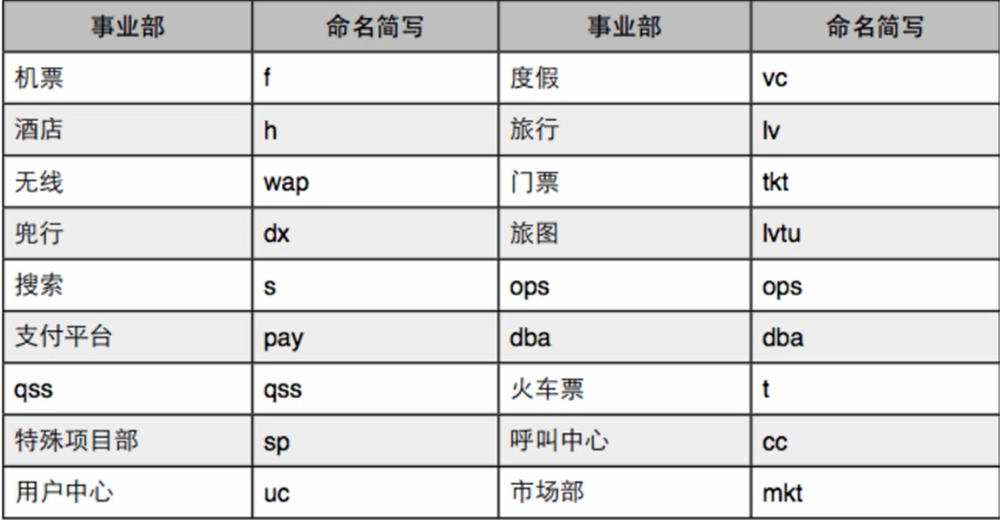
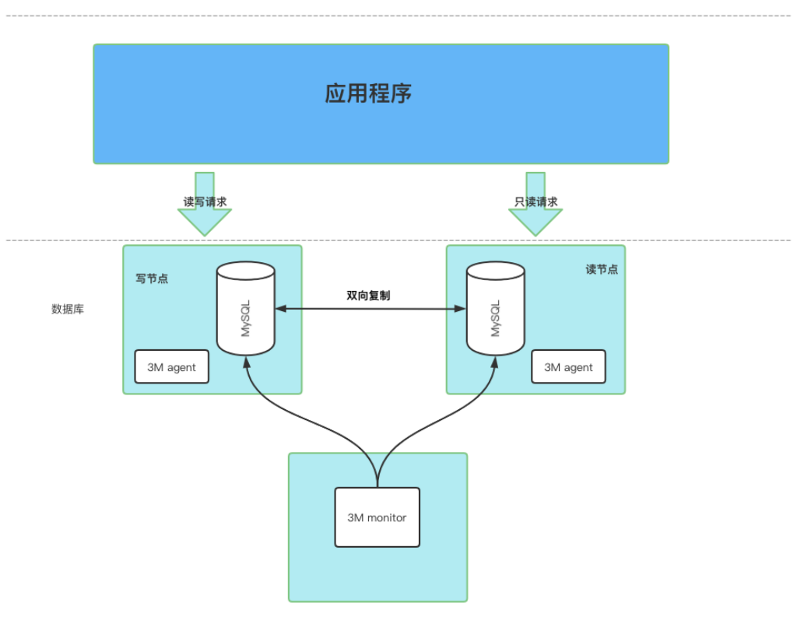
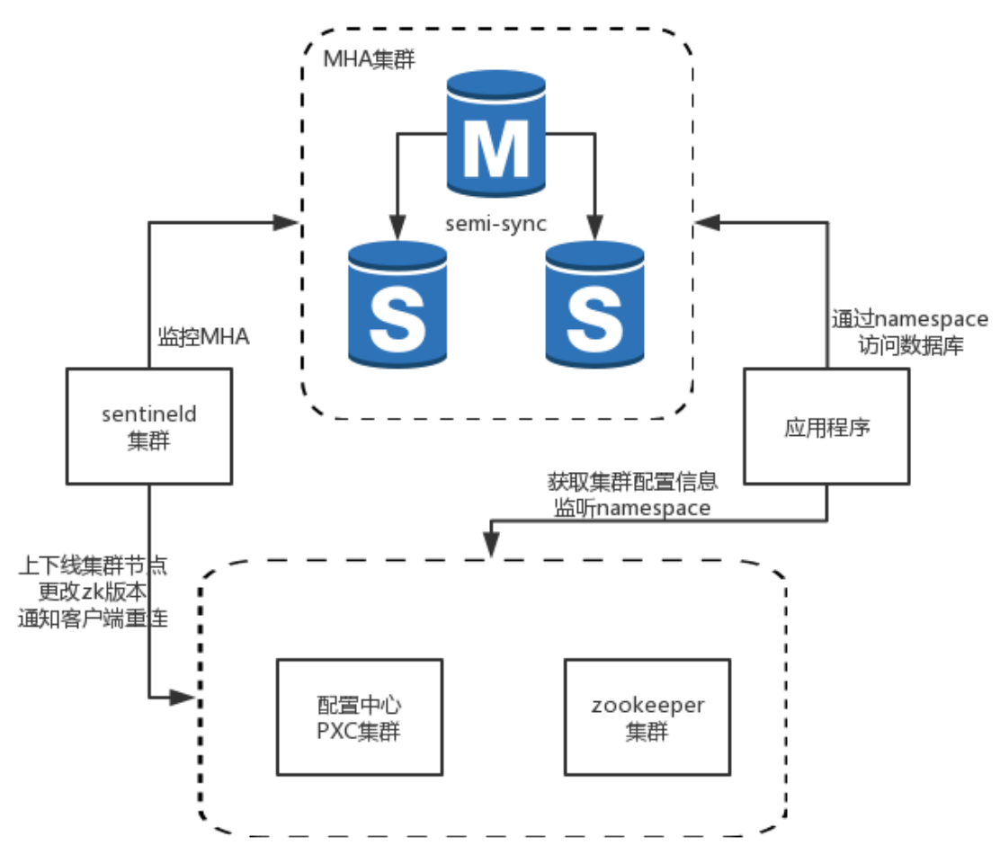
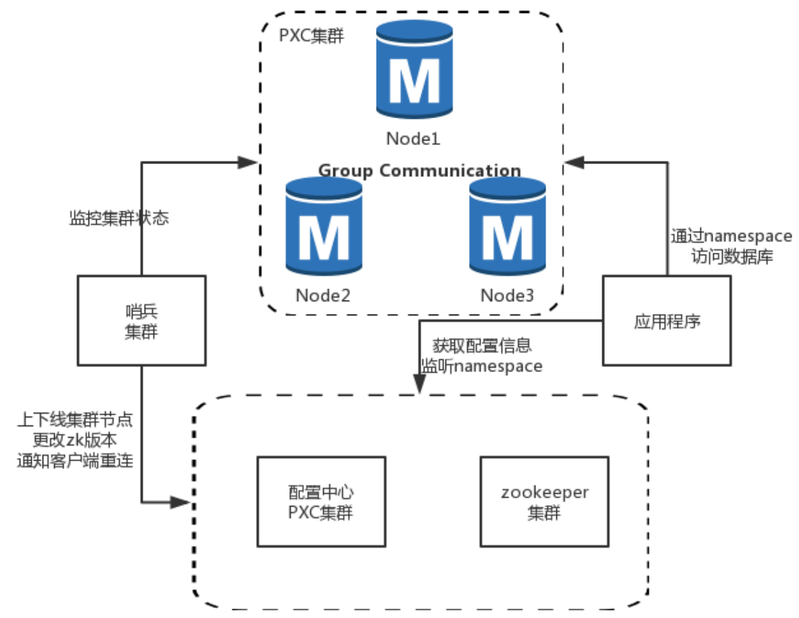
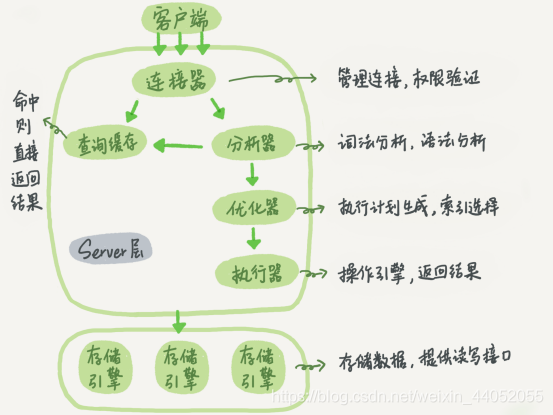

# Mysql学习

1.安装Mysql
===

windows安装mysql步骤可参考：[MySQL 8.0.19安装教程(windows 64位)](https://blog.csdn.net/qq_37350706/article/details/81707862) 


## 1.1 关于密码的一些事

登录mysql：

1.  `mysql -uroot -p` 
2. 回车，输入密码

修改密码的常见方法：

- set password命令：

  1. 登录mysql

  2. `set password for 用户名@localhost = password(‘新密码’);`

     例如：`set password for root@localhost = password(‘123’);`

- 用mysqladmin

  1. `mysqladmin -u用户名 -p旧密码 password 新密码`

- 用Update直接编辑user表

  1. 登录mysql
  2. `use mysql;`
  3. `update user set password=password(‘新密码’) where user=‘root’ and host=‘localhost’;`
  4. `flush privileges;` 
  
  

**忘记root密码的情况下修改密码：(以window为例)**

1. 关闭正在运行的Mysql服务。
2. 打开DOS窗口，转到mysql\bin目录。
3. 输入`mysqld --skip-grant-tables `，**--skip-grant-tables**代表启动Mysql服务的时候跳过权限表认证。
4. 再打开一个DOS窗口（注意不要关闭之前的窗口），转到mysql\bin目录
5. 输入`mysql`
6. 连接权限数据库：`use mysql;`
7. 改密码：`update user set password=password(‘新密码’) where user=‘root’;`
8. 刷新权限：`flush privileges;`
9. 关闭窗口。再重新打开DOS窗口，转到mysql\bin目录
10. 使用新密码登录


## 1.2 卸载mysql

1. 双击安装包。点击下一步。点击remove。(此时只是卸载了软件)
2. 手动删除mysql目录。（默认是C:\Program Files下）
3. 手动删除ProgramData目录(此目录为隐藏目录)下的Mysql


2.Mysql概述
===

2.1 sql、DB、DBMS分别是什么？
---

- **DB** ： DataBase(数据库，以文件的形式存在于硬盘)
- **DBMS**：DataBase Management System(数据库管理系统，常见的有Mysql oracle SQLserver)
- **SQL**：结构化查询语言。标准的sql适用于所有的数据库产品。
- 三者关系：DBMS - (执行)-> SQL - (操作)- > DB


2.2 表
---

表是数据库的基本组成单元，是一个结构化文件。其包括

- 行：数据/记录。
- 列：字段。每个字段都可以有：字段名、字段数据类型、字段约束、字段长度。


2.3 sql分类
---

1. **DQL** (数据查询语言)：查询语句，凡是`select`的都是DQL
2. **DML** (数据操作语言)：增删改，`insert、delete、update`
3. **DDL** (数据定义语言)：修改表的结构 `create、drop、alter`
4. **TCL** (事务控制语言)：commit 提交事务；rollback回滚事务；
5. **DCL** (数据控制语言)：grant授权；revoke撤销权限；


2.4 Mysql常见命令
---

- 登录：`mysql -uroot -p密码 [-h连接ip]` 
- 查看帮助信息：`help ` 
- 查看数据库：`show databases;` 
- 创建数据库：`create database 数据库名字;`
- 删除数据库：`drop database 数据库名字;`
- 使用/切换数据库：`use 数据库名字;` 
- 查看当前数据库的表：`show tables;` 
- 导入数据：`source 文件路径;` 
- 导出整个数据库：`mysqldump 数据库名;` 
- 导出指定库下的某个表：`musqldump 数据库名 表名;` 
- 查看表结构：`desc 表名;` 
- 退出：`exit` 
- 查看会话变量值：`show session variables like '%关键字%';`
- 查看全局变量值：`show global variables like '%关键字%';`


3. 查询操作
===

## 3.1 简单查询

查询一个字段：`select 字段名 from 表名;`

**tips** : 所有的sql语句都要以`;`结尾。并且sql不区分大小写。

查询多个字段：

- `select 字段名1,字段名2... from 表名`;

查询全部字段：

- `select * from 表名;` 

给字段起别名：

- `select 字段名 as 别名 from 表名;` 
-  `select 字段名 别名 from 表名;` (以空格分隔其别名)

字段进行简单运算：

- 在工资表中查询工资并乘以10 `select money*10 from wages;`

对重复字段进行去重：`使用distinct关键字` 

1. dinstinct只能放在所有字段的**最前面**，把select的字段看成一组再进行过滤。
2. 可以跟分组函数一起使用。
3. 当参与运算的字段为NULL时，计算的结果始终为NULL

```sql
select dinstinct job, addr from emp;    √
select job, dinstinct addr from emp;    × dinstinct不在最前面
```

> 补充：空处理函数
> ifnull(可能为null的数据，被当做什么处理) 
> 如：ifnull(ewage, 0) 表示当ewage为null时结果变成0


##  3.2 条件查询

格式：

```
select 字段,字段,字段...
from 表名
where 条件;
```

**执行顺序：from-->where-->select** 

| 比较操作符： | = , < , > , >= , <= , <>或!= |
| ------------ | ---------------------------- |
| 字符串比较： | LIKE , NOE LIKE              |
| 逻辑操作符： | AND , OR , NOT               |
| 值的域：     | BETWEEN , NOT BETWEEN        |
| 值的列表:    | IN , NOT IN                  |
| 未知的值：   | IS NULL , IS NOT NULL        |

- 查询工资等于5000的员工名字：`select ename from emp where ewage=5000;`

- 查询工资在3000~5000的员工名字：
  - `select ename from emp where ewage>=3000 and ewage<=5000;`
  - `select ename from emp where ewage between 3000 and 5000;`
  
- 查找没有津贴的员工名字：
  
  - `select ename from emp where comm is null;`
  
- 找出工资大于1000且编号是20或30的员工：

  - `select ename from emp where ewage>1000 and (eno=20 or eno=30);`

    **tips**：当运算符不确定时，加个小括号

- 找出岗位是MANAGE和SALESMAN的员工:

  - `select ename from where job in ('MANAGE','SALESMAN');`

- 模糊查找：`like 、not like`

  - 需掌握两个符号：
    - `%`：匹配任意多个字符
    - `_`：匹配单个字符
  - 找出名字中含有O的员工：
    - `select ename from emp where ename like ‘%O%’;`
  - 找出名字中第二个字母是A的员工：
    - `select ename from emp where ename like ‘_A%’;`
  - 找出名字中含有下划线的：(此时 `_` 是有特殊含义的，需要使用`\`转义)
    - `select ename from emp where ename like ‘%\_%’;`


3.3 排序数据
---

格式：

```
select 字段名
from 表名
[where 条件]
order by 要排序字段1,字段2,字段3... [asc|desc];   
```

**asc：表示升序排序。desc表示降序排序。如不指定则默认升序排序**

**tips：**上面格式的执行顺序为：`from --> where --> select --> order by`

- 根据工资进行排序：
  - `select * from emp order by ewage; `  升序
  - `select * from emp order by ewage asc;`  升序
  - `select * from emp order by ewage desc;`  降序
- 在SALESMENT部门根据工资进行降序排序，工资相同时按名字升序排序：
  - `select * from emp where job='SALESMENT' order by ewage desc, ename asc;`


## 3.4 分组函数

> 分组函数又叫多行处理函数、聚合函数。
>
> 分组函数都是对某一组数据进行操作

| 函数名 | 作用         |
| ------ | :----------- |
| count  | 计算数据条数 |
| sum    | 求和         |
| avg    | 求平均值     |
| max    | 求最大值     |
| min    | 求最小值     |

**分组函数的特点**：

1. 自动忽略null
2. 不可以出现在where后面

使用：

- 查询工资总和：`select sum(ewage) from emp;`
- 找出最高工资：`select max(ewage) from emp;`
- 找出总人数：`select count(*) from emp;`

 **思考1：** count(*)和count(某个字段)的区别：

```sql
count(*) 是统计记录总条数
count(某个字段) 是统计这个字段不为null的数据总数
```

**思考2：** 如果要找出工资大于平均工资的员工：可否使用下面这个语句

```sql
select ename from emp where ewage > avg(ewage);
答案是不可以。因为分组函数不能用在where后面。为什么呢？在分组查询那里揭晓。
```


3.5 分组查询
---

```
select 字段名1,字段名2...
from 表名
[where 条件]
group by 要分组的字段
[having 分组后过滤的条件];
```

**执行顺序** ：from --> where --> group by --> having --> select

1. 分组函数一定要跟group by一起使用，这也就是它为什么分组函数的原因。
2. 分组函数都是在group by分完组之后执行的。这就是它为什么不能放在where之后的原因
3. 当sql语句中没有group by时，整张表的数据会自动组成一组。
4. 当sql语句有group by时，select后面只能跟分组函数或参与分组的字段。

***

案例：

- 找出每个工作岗位的最高工资：`select max(ewage) from emp group by job;`
- 找出每个部门不同工作岗位的最高工资：
  - `select depino,job,max(ewage) from emp group by deptno,job; `
- 找出最高工资大于2900的部门：
  - `select deptno from emp group by deptno having max(ewage)>2900;` 
  - `select deptno from emp where ewage>2900 group by deptno;`
  - 以上两种都可以实现，但having方式是找出所有数据再进行筛选，而where是直接找出筛选后的数据，只需要一步操作。所以where性能更好，以后==可以用where的就不用having== 
- 找出平均工资大于2000的部门:
  - `select deptno,avg(ewage) from emp group by deptno having avg(ewage)>2000;`

**思考**：下面这条语句是否正确

```sql
select ename,max(ewage),job from emp group by job;
答案:错误。因为ename没有进行分组。
```

解决分组函数部分留下的问题：

```sql
找出工资大于平均工资的员工
select ename from emp where ewage > (select avg(ewage) from emp);
```


## 3.6 小结

一个完整的sql语句格式：

|                       | 执行顺序 |
| :-------------------: | -------- |
|      select 字段      | 5        |
|       from 表名       | 1        |
|      where 条件       | 2        |
|  group by 要分组字段  | 3        |
| having 再次过滤的条件 | 4        |
|   order by 排序字段   | 6        |


4. 连接查询
===

根据**语法**来分：

- SQL92：旧的语法。
  - 格式：`from A,B where A.字段=B.字段` 
  - 缺点：表的连接条件与数据的筛选条件混合
- SQL99：新的语法。
  - 格式：`from B join A on 表的连接条件 where 数据筛选条件` 
  - 优点：表的连接条件与数据的筛选条件分明

根据**表的连接方式**来分：

- 内连接：`inner` 
  - 等值连接：表连接的条件是等量关系。
  - 非等值连接：表连接的条件是不是等量关系。
  - 自连接：自己跟自己连接。此时必须给表起别名。
- 外连接：`outer` 
  - 左(外)连接：左边的表是主表
  - 右(外)连接：右边的表是主表
- 全连接（用的少）

> 在表的连接查询方面有一种现象被称为**笛卡尔积现象**。即两张表连接的时候没有进行条件限制，导致最终结果是两张表记录条数的乘积。
>
> 说白了就是第一张表的每条数据会跟第二张表的每条数据连接，然后形成一张大表。

```
1. 如何避免笛卡尔积?
答：增加条件限制

2. 避免了笛卡尔积现象会减少匹配次数吗。 
答：不会，因为两张表的每条数据还是要带着条件一一匹配，匹配成功则显示。
```

***

内连接跟外连接的区别：

- **内连接**：假设A表和B表进行内连接，AB表同时匹配上的记录才会被查询出来。
- **外连接**：假设A表和B表进行外连接，那么AB表中有一个是主表，有一个是副表，而查询主要查主表内容，捎带着查询副表而已。即A表中的数据全部会显示，B表中的数据只有跟A表中的数据匹配上时才会显示，否则为null。


## 4.1 等值连接---案例：

- 查询每个员工的部门名称，显示员工名和部门名。

  - SQL92写法:
  
    ```sql
    select e.ename,d.dname 
    from emp e,dept d 
    where e.deptno=d.deptno;
    ```
    
  - SQL99写法(推荐)：可以区别连接条件和查询条件
  
    ```sql
    select e.name,d.dname
    from emp e
    [inner] join dept d
    on e.deptno = d.deptno; 
    ```


## 4.2 非等值连接---案例：

- 找出员工的工资等级，显示员工名、工资、工资等级

  ```sql
  select e.name,e.ewage,e.range
  from emp e
  join erange r
  on e.ewage>=r.lowwage and e.ewage < r.highwage
  ```


## 4.3 自连接---案例

- 找出每个员工的上级领导，显示员工名和对应的领导名

  ```sql
  select e.ename,e.boss
  from emp a
  join emp b
  on a.boss = b.eno;
  // 弊端就是当此员工没有上级领导时不显示
  ```


## 4.4 左连接---案例

- 找出每个员工的上级领导，显示员工名和对应的领导名

  ```sql
  select e.ename,e.boss
  from emp a
  left [outer] join emp b
  on a.boss = b.eno;
  // 好处是当此员工没有上级领导时正常显示
  ```


## 4.5 右连接---案例

- 找出没有员工的部门

  ```sql
  select d.*
  from emp e
  right join dept d
  on e.deptno = d.deptno
  where e.ename = null;
  ```


## 4.6 多表联查

- 找出每个员工的部门名称、工资等级以及上级领导

  ```sql
  select e.ename,d.dname,w.range,e.boss
  from emp e
  join dept d
  on e.deptno=d.deptno
  join wage w
  on e.ewage between w.lowwage and w.highwage
  left join emp e1
  on e.boss = e1.empno;
  ```


5.子查询
===

> sql语句中可以嵌套select语句，嵌套的select语句就是**子查询**。
>

子查询可以出现在哪里：

```
select ..(select)
from ..(select)
where ..(select)
```

案例：在from中嵌套子查询

- 找出每个部门平均工资的薪水等级

  ```sql
  select t.*, w.range
  from (select deptno,avg(ewage) as sal from emp group by deptno) as t
  join wage w
  on t.sal between w.lowwage and w.highwage;
  ```


5.1 union
---

union作用：**可以将两个不相干的表的查询结果集拼接。** 前提是两个表的查询字段的个数要相同。

```sql
select ename from emp
union
select dname from dept;
```


5.2 limit --- Mysql特有
---

语法：`limit startIndex, length` 

startIndex代表**起始位置(不指定默认为0)**

length代表**长度**。

***

取出工资前5名的员工：
- `select ename from emp order by ewage desc limit 5;`
- `select ename from emp order by ewage desc limit 0,5;`

找出工资排名在第4到第9之间的员工

- `select ename from emp order by ewage limit 3,6;` 

**通用的标准分页sql：** 

```
设每页显示 5条数据
第一页:limit 0,5
第二页:limit 5,5
第三页:limit 10,5
第四页:limit 15,5
。。。。。。
```

**结论**：设每页显示**Size**条数据，则第**N**页要显示的数据为：`limit (N-1)*Size,Size` 


# 6. DML

6.1 创建表
---

格式：

```sql
create table 表名(
	字段名1 数据类型 [约束条件],
	字段名2 数据类型 [约束条件],
	字段名3 数据类型 [约束条件],
	....
);
```

如创建学生表（学号，姓名，班级，班级编号，生日）

```sql
drop table if exists t_student; //t_student存在的话就删除
create table t_student(
	sno bigint,
	name varchar(15),
	sex char(1)
);
```


6.2 插入数据
---

格式：`insert into 表名(字段1,字段2...) values(值1,值2...);`

字段的数量跟值得数量要相等，且类型要对应相同。

若不指定具体字段则表示全部字段。

***

- 插入一行数据：
  - `insert into t_student values(1,'codekiang','1');` 
  - `insert into t_student(sno,name,sex) values(1,'codekiang','1');` 
- 一次插入多行:
  - `insert into t_student values(2,'hang','1'), (3,'meinv','0');` 
- 插入某个字段：(此时没插入的字段自动为null)
  - `insert into t_student(name) values('hhh');` 


6.3 修改数据
---

格式：`update 表名 set 字段1=值1,字段2=值2... where 条件 [limit 数量];`

**tips**：若不指定条件则对整张表的数据全部更新

- 将部门10的LOC修改为shanghai
  - `update dept set loc='shanghai' where deptno=10;` 
- 更新log表前5行的state字段，将其更新为0
  - `update log set state = 0 limit 5;` 


6.4 删除数据
---

格式：`delete from 表名 where 条件;`

**tips**：没有条件则全部删除

- 删除部门10的数据
  - `delete from dept where deptno=10;`

**删除表(不可恢复)** 

通过delete的方式删除数据后还可以恢复。但如何永久删除数据呢？

- `truncate table 表名;`   全表清空，不可回滚，性能比delete快的多。
- `drop table 表名;`   用于删除表数据，表的结构、属性以及索引也会被删除。不可回滚。


# 7. 约束

约束的作用：约束是为了**保证数据的完整性**，即约束是针对表中数据记录的。

常见约束：

- `not null`：非空约束，表示该字段不能为空
- `unique`：唯一约束，表示该字段不能重复
- `primary key`：主键约束，表示该字段不能为空也不能为重复
- `foreign key`：外键约束，


## 7.1 非空约束 not null

```sql
drop table if exists t_user;
create table t_user(
	id int not null,
	name varchar(15),
);
```


## 7.2 唯一约束 unique

- 给某一列添加unique（列级约束）

  - ```sql
    drop table if exists t_user;
    create table t_user(
    	id int unique,
    	name varchar(255),
    );
    ```

- 给多列分别添加unique

  - ```sql
    drop table if exists t_user;
    create table t_user(
    	id int unique,
        sno int unique,
    	name varchar(255)
    ); //每个id不可以重复，每个sno不可以重复
    ```

- 给多列添加unique（表级约束）

  - ```sql
    drop table if exists t_user;
    create table t_user(
    	id int,
        sno int,
    	name varchar(255),
        unique(id,sno),
    ); //id跟sno联合起来不可以重复，如id=1，sno=2跟id=1，sno=3是不违背unique的。
    ```


## 7.3 主键约束 primary key

> 一般一张表就一个主键，不建议多个。
>
> 主键的作用：作为每条记录的唯一标识。

```sql
drop table if exists t_user;
create table t_user(
	id int primary key,
	name varchar(255),
);
```

**主键分类**：

- 根据关键字段的字段数量来分：
  - `单一主键`：就一个主键。(推荐)
  - `复合主键`：多个字段联合起来形成一个主键。（违背三范式）
- 根据主键性质来分：
  - `自然主键`：主键值不跟业务挂钩。（推荐使用）
  - `业务主键`：主键值跟业务挂钩，如身份证，银行卡。

**自增主键：auto_increment ** 

```sql
drop table if exists t_user;
create table t_user(
	id int auto_increment, //该字段自动维护一个自增的数字，从1开始，每次递增1
	name varchar(255),
)
```


## 7.4 外键约束 foreign key

A表的`a`字段参考B表的某个`唯一`字段，则`a字段`被称为`外键`。

**tips：** 

1. 外键值可以为null。

2. 被引用值不一定是主键，但一定要唯一。

3. 外键值 必须 跟 被引用字段中的 其中一个的值 相等。

   | address表           | user表(dno为外键，参考address的id字段)                       |
   | ------------------- | :----------------------------------------------------------- |
   | id          address | sno    name      dno                                         |
   | 101         广州    | 1        李四        208           **`正确`，dno = 208 = id** |
   | 208         深圳    | 2        张三        555           **`不正确`，dno = 555 != id** |
   | 304         梅州    | 3        王五        208           **`正确`，dno = 208 =id** |
   | 401         佛山    | 4        杭杭        304           **`正确`，dno = 304 = id** |

格式：

```sql
create table student(
    sno int,
    sname varchar(255),
    classno int,
    foreign key(classno) references t_class(cno)
);
```


8.数据类型
===

## 整形

1、int占4个字节，bigint占8个字节。

2、如果需要设置无符号，则需要加上unsigned关键字，例如`id int unsigned` 

3、如果需要设置显示的长度，在类型后指定，并且加上zerofill关键字。例如 `id int(5) zerofill`**左侧填充0，且此字段变成无符号**。


## 小数

浮点数float(M, D)、double(M, D)，定点数decimal(M, D)。

- M：总精度，整数加小数部分，1 <= M <= 65, 默认M = 10
- D：小数部分精度，0 <= D <= 30 且D <= M, 默认D = 0

如果是浮点数，则会根据插入的数据决定精度。**decimal**的精度较高，货币运算优先考虑。

> decimal的存储是将整数跟小数分开存储的。为了节省空间，MYSQL采用4字节来存储9位数位，即两位一个字节，最后三位共用一个字节。
>
> | 数位 | 字节 |
> | :--: | :--: |
> | 1-2  |  1   |
> | 3-4  |  2   |
> | 5-6  |  3   |
> | 7-9  |  4   |
>
> 举个例子，decimal(18,9)的整数部分和小数部分各有9位，所以两边各需要4字节来存储。decimal(20,6)有14位整数，6位小数，整数部分先用4字节表示9位，余下5位仍然需要3字节，所以整数部分共7个字节，小数部分则需要3字节。


## 字符

**CHAR(10)**会**固定分配10个字符**（无论英文或汉字）的空间。即若输入数据的长度小于10B，则系统自动在其后添加空格来填满设定好的空间；

而**VARCHAR(10)**的存储长度为**实际数值的长度**，但最多会存储10个字符。


## 日期

- datetime：**8**个字节，可以表示日期跟时间，**不受时区影响**，插入什么时间就显示什么时间。

- timestamp：**4**个字节，可以表示日期跟时间，**受时区影响**，会根据时区自动转换。


9.索引
===

> 索引就相当于书目录，通过它可快速查找到数据。
>
> 添加索引是给某个或某些字段添加索引。

数据库查找数据有两种检索机制：

1. 全表扫描
2. 通过索引检索

***

创建索引：`create index 索引名 on 表名(字段名);` 或 `alter table 表名 add index 索引名(字段名);` 

删除索引：`drop index 索引名 on 表名;` 

**tips**：

1. 主键和unique约束的字段自动添加索引。
2. 索引查找快的**最根本的原理**是**缩小了查找范围**。添加了索引的字段中的数据一旦修改，索引需要重新排序。所以不可一味的给字段添加索引

那什么时候考虑加索引呢：

- 数据量庞大
- 该字段很少DML操作
- 该字段经常出现在where中

索引分类：`单一索引`、`复合索引`、`主键索引`、`唯一索引`

***

索引底层采用的**数据结构**：**`B+树`** 

索引**实现原理**：通过B+树缩小扫描范围，底层会对索引字段(携带着该字段在表中的物理位置)进行排序分区（可能是按大小，也可能按字母），当索引检索到数据之后获取到该数据的物理位置，通过物理位置直接定位到表中的数据。


10.存储引擎
===

存储引擎：mysql存储表的机制。

在建表的时候可以指定存储引擎和字符集。如`create table s (id int) ENGINE=InnoDB DEFAULT CHARSET=UTF8;` 

mysql默认使用的存储引擎是`InnoDB`，默认字符集是`UTF8`。

**mysql常见存储引擎**：

- `MyISAM` 
  - 采用三个文件来组织一个表
    - **`.frm`文件（存储表的结构）** 
    - **`.MYD`文件（存储表的数据）** 
    - **`.MYI`文件（存储表的索引）** 
  - 特点： 不支持事务，但每次查询都是原子的。使用表级锁。只会缓存索引。
- `InnoDB` 
  - 表的结构存放在**`.frm`文件** 
  - 数据跟索引存储在**`.idb`文件** 
  - 优点：支持事务、行级锁、外键等，安全性好，可自动恢复。既缓存索引也缓存数据。
  - 缺点：无法被压缩，无法转换成只读。
- `MEMORY` 
  - 每个表结构放在`.frm`文件中
  - 数据跟索引放在内存中
  - 优点：**查询速度最快**。
  - 缺点：不支持事务，容易丢失数据。


11.事务 （Transaction）
===

> 一个事务是一个完整的业务逻辑，不可再分。
>
> 事务的存在使数据更加的安全，完整。

例如：银行账户转账，从A账户向B账户转账1000，需要执行两条DML语句`update t_act set money=money-1000 where actno='A';`跟`update t_act set money=money+1000 where actno='B'; `。此时需要保证这两条更新语句必须同时成功或同时失败。

**tips：** 如果要让多条DML语句同时执行成功或执行失败，则需要使用`事务`。

事务执行流程：

1. 开启事务机制
2. 执行一条或多条DML语句（在缓存中执行，不直接影响文件）
3. 提交或回滚事务
   - `commit;` 提交事务。缓存区的内容更新到文件，清空缓存区
   - `rollback;` 回滚事务。清空缓存区。

***

事务的特性：ACID

- **原子性**（Atomicity）：事务是最小的工作单元，不可再分，保证多条DML语句同时成功或失败。
- **一致性**（Consistency）：事务前后数据的完整性必须保持一致。例如A+3，B-3
- **隔离性**（Isolation）：排除其他事务对本次事务的影响。
- **持久性**（Durability）：事务结束后的数据不随着外界原因导致数据丢失。

***

事物的`隔离性`分为`4`个等级：

1. **读未提交**（read uncommitted）
   - A事务还没有提交，B事务就可以读取A事务未提交时的数据。
   - 缺点：存在 脏读现象，即随时会读到不确定的数据。
2. **读已提交**（read committed）
   - B事务提交之后，A事务才可以读取到B事务提交之后的数据。
   - 缺点：不可重复读，即只要对方一提交事务，数据立马变化。
3. **可重复读**（repeatable）
   - 只要不退出当前事务，则数据永远是进入事务前的数据。不会随着别的事务的提交而发生数据改变。
   - 缺点：读取到的数据是假象。
4. **序列化读**（serialize）
   - 只有等当前事务结束时，另一个事务才可以执行。
   - 缺点：效率低，需要事务排队。

**tips：** 

- `oracle`默认使用的隔离级别是：`读已提交` 
- `mysql`默认使用的隔离级别是：`可重复读` 
- mysql的事务默认是自动提交的，只要执行一条DML就提交一次。
- mysql使用`start transaction;`可关闭自动提交机制。


12.常用的函数
===

- truncate(x,y)：返回数值 x 保留到小数点后 y 位

  - ```sql
    SELECT truncate(1.23456, 3); 
    -- 返回 1.234
    ```

- length(s)：返回字符串s的**字节数** 

- concat(s1,s2…sn)：字符串 s1,s2 等多个字符串合并为一个字符串

  - ```sql
    SELECT concat('hel','llo');
    -- 返回 hello
    ```

- upper(s) / lower(s)：将字符串s转为 大写/小写

- trim(s)：去掉字符串 s 开始和结尾处的空格

  - ltrim(s) / rtrim(s) 去掉左边/右边的空格

- curdate()：返回当前日期。如 2021-07-29

- curtime()：返回当前时间。 如 11:40:45

- **now()**：获取当前日期时间。如 2021-07-29 11:40:45

- 从日期中选择出月份数：month(now())

- 从日期中选择出周数：week(now())

- 从日期中选择出年数：year(now())

- 从时间中选择出小时数：hour(now())

- 从时间中选择出分钟数：minute(now())

- 从时间中选择出今天是周几：weekday(now())

  - 星期一为0，…，星期天为6
  
- 日期加减：date_add(date, INTERVAL n type) / date_sub(date, INTERVAL n type)

- 日期相隔：date_diff(date1,date2) 


# 13. 权限管理

## 13.1 mysql权限验证流程

1. mysql将权限相关表读到内存
2. 对连接的用户进行身份认证（从user表中获取host，user，password进行判断）
3. 判断用户是否有数据库的操作权限
4. 判断用户是否有对应表的操作权限
5. 判断用户是否有对应表对应列的操作权限

**tips**：如果有任意一个通过就不会继续往下验证了


## 13.2 管理用户

- 创建用户：`create user '用户名'@'ip' identified by '密码';` 如果ip为`%`则表示所有ip都可以登录此用户
  - `create user 'testname'@'127.0.0.1' identified by 'mypwd';`  
- 删除用户：`drop user '用户名'@'ip';`  （用户名跟ip共同组成主键）
- 用户授权：`grant 权限 on 数据库名.表名 to '用户名'@'ip';` 
  - 授予增删改查： `grant insert,delete,update,select on 数据库名.表名 to '用户名'@'ip';` 
  - 授予所有权限：`grant all privileges on 数据库名.表名 to '用户名'@'ip';` 
- 取消用户授权：`revoke 权限 on 数据库名.表名 to '用户名'@'ip';` 
  - 注意，`revoke all privileges on *.* ` 不会删除用户所有的数据库权限。


# 14. Master-Slave原理

由于单机的数据丢失风险大，读写无法分离，无法横向扩展等问题，所以出现了mysql主从结构。 

主机master数据更新后根据配置和策略自动同步到从机slaver，**Master**以**写**为主，**Slave**以**读**为主。mysql默认采用**异步复制**的方式，这样从节点就不用一直访问主服务器来更新自己的数据。

原理如下：


- master将数据的增删改的sql语句 **记录在二进制日志文件binlog**中
- slave会在一定时间间隔内对master的binlog进行探测，看其是否发送改变。如果发生改变则**使用一个IO线程**去获取binlog。同时master为**每个从机的IO线程开启一个dump线程**，用于传输binlog。
- slave获取到binlog后会将其内容写到本地的 **relay log** 中，然后**使用一个sql线程** 读取relay log中的内容并执行，使本地数据跟 master的数据保持一致。
- 最后slave的 IO线程 跟 sql线程 进入睡眠状态，等待下一次被唤醒


# Qunar命名规范

## 库表命名规范

- 库名、表名必须使用小写字母，并采用下划线分割。
- 库名、表名禁止超过32个字符。禁止以非字母开头命名表名及库名。
- 库名、表名必须见名知意。命名与业务、产品线等相关联。
- 库名、表名禁止使用MySQL保留字。（保留字列表见官方网站）
- 临时库、表名必须以tmp为前缀，并以日期为后缀。例如tmp_test01_20130704.
- 备份库、表必须以bak为前缀，并以日期为后缀。例如bak_test01_20130704。


## 字段命名规范

- 字段名必须使用小写字母，并采用下划线分割，禁止驼峰式命名
- 字段名禁止超过32个字符。
- 字段名必须见名知意。命名与业务、产品线等相关联。
- 字段名禁止使用ySQL保留字。（保留字列表见官方网站）


## 索引命名规范

- 索引名必须全部使用小写字母，并采用下划线分割，禁用驼峰式
- 非唯一索引按照“`idx_字段名称_字段名称`”进用行命名。例如`idx_age_name`
- 唯一索引按照“`uniq_字段名称_字段名称`”进用行命名。例如`uniq_age_name`
- 组合索引建议包含所有字段名，过长的字段名可以采用缩写形式。例如`idx_age_name_acd` 


## 业务命名规范




# Qunar使用规范

## 基础使用规范

- 使用INNODB存储引擎并且使用业务不相关自增ID为主键
- 表字符集使用UTF8/UTF8MB4字符集。
- 所有表、字段都需要添加注释。推荐采用英文标点，避免出现乱码。
- 禁止在数据库中存储图片、文件等大数据。
- 每张表数据量建议控制在5000W以内。
- 禁止在线上做数据库压力测试。
- 禁止从测试、开发环境直连数据库。


## 索引使用规范

- 单张表中索引数量不超过5个。
- 单个索引中的字段数不超过5个。
- 表必须有主键，推荐使用UNSIGNED自增列作为主键。
- 唯一键由3个以下字段组成，并且字段都是整形时，可使用唯一键作为主键。其他情况下，建议使用自增列或发号器作主键。
- 禁止冗余索引。
- 禁止重复索引。
- 禁止使用外键。
- 联表查询时JOIN列的数据类型必须相同，并且这两个都要建立索引。
- 不在低基数列上建立索引，例如“性别”。
- 选择区分度大的列建立索引。组合索引中，区分度大的字段放在最前。
- 对字符串使用前缀索引，前缀索引长度建议不超过8个字符，需要根据业务实际需求确定。
- 不对过长的VARCHAR字段建立索引。建议优先考虑前缀索引，或添加CRC32或MD5伪列并建立索引。
- 合理创建联合索引，(a,b,c)相当于(a)、(a,b)、(a,b,c).
- 合理使用覆盖索引减少IO，避免排序。


## 字符集规范

- 表字符集使用UTF8,必要时可申请使用UTF8MB4字符集
  - UTF8字符集存储汉字占用3个字节，存储英文字符占用一个字节。
  - UTF8统一而且通用，不会出现转码出现乱码风险。
  - 如果遇到EMOJ等表情符号的存储需求，可申请使用UTF8MB4字符集。
- 同一个实例的库表字符集必须一致，JOIN字段字符集必须一致。
  - 如果JOIN字段类型不匹配，则不会走索引
- 禁止在字段级别设置字符集
- 更改字符集：
  - `alter table t1 charset utf8mb4` 与 `alter table t1 convert to charset utf8mb4` 都可以更改字符集，但前者只会更改以后的字符集，而不会对已存在的数据进行更改字符集。所以**DBA推荐使用后者**。


## 常见问题

- 如何存储IPV4/IPV6地址？
  - 使用UNSIGNED INT存储IP地址，当需要使用时，将该字段通过函数转为对应的IPV4/IPV6地址。

- INT(1)中1代表什么？
  - 显示字符宽度，并非存储长度。例如：int(1)和int(11)存储长度都是11位，均使用4个字符存储。

- 禁止使用select *
- 避免使用大事务
- 事务中禁止加载RPC请求
- 多个事务写共同表时，保持顺序一致
- 事务传播级别为PROPAGATION REQUIRES NEW时，要注意子事务不要操作主事务锁住的记录。
- 统计信息类sql一定要去离线库跑。


# Qunar数据库表字段设计

## 库表设计

- 将大字段、访问频率低的字段拆分到单独的表中存储，分离冷热数据
- 表的默认字符集指定UTF8MB4（特殊需求除外），无须指定排序规则
- 主键用整数类型，并且字段名称用id，使用AUTO_INCREMENT数据类，并指定UNSIGNED


## 分表策略

- 推荐使用HASH进行散表，表名后缀使用十进制数，数字必须从0开始
- 按日期时间分表需符合`YYYY[MM][DD][HH]`格式，例如2017011601。年份必须用4位数字表示。例如按日散表user_20170209、按月散表user_201702
- 采用合适的分库分表策略。例如千库十表、十库百表等


## 字段设计与类型选择

- 建议使用UNSIGNED存储非负数值
- 建议使用INT UNSIGNED存储IPV4
- 所有字段均定义为NOT NULL
- 用DECIMAL代替FLOAT和DOUBLE存储精确浮点数。例如与货币、金融相关的数据
- INT类型固定占用4字节存储，例如INT(4)仅代表显示字符宽度为4位，不代表存储长度
- 区分使用TINYINT、SMALLINT、MEDIUMINT、INT、BIGINT数据类型
- 使用VARBINARY存储大小写敏感的变长字符串或二进制内容
- 使用尽可能小的VARCHAR字段。VARCHAR(N)中的N表示字符数而非字节数
- 区分使用DATETIME和TIMESTAMP。存储年使用YEAR类型。存储日期使用DATE类型。存储时间（精确到秒）建议使用TIMESTAMP


## 字段禁止使用项

- 建议尽可能不使用ENUM类型替代TINYINT
- 禁止在数据库中存储明文密码
- 建议尽可能不使用TEXT、BLOB类型


# Mysql集群架构

## 3M架构



- monitor-节点复制数据库探活和切换
- agent主要完成monitor发出的切换操作
- 应用程序通过VIP连接


## QMHA架构



- 每一个哨兵节点都会监控集群中的所有Mysql节点
- 哨兵节点会相互通信，确认各个MySQL节点的状态
- 连接方式使用**namespace**连接


## PXC架构



- 每一个哨兵节点都会监控集群中的所有Mysq节点
- 哨兵节点会相互通信，确认各个MySQL节点的状态
- 连接方式使用**namespace**连接
- PXC集群使用注意事项：
  - 不要有大事务更新
  - 不要做大查询（如统计查询）
  - 若SQL较慢会影响整个集群的性能


Mysql面试
===

char(10) 跟 varchar(10)的区别
---

**CHAR(10)**会**固定分配10个字符**（无论英文或汉字）的空间。即若输入数据的长度小于10B，则系统自动在其后添加空格来填满设定好的空间；

而**VARCHAR(10)**的存储长度为**实际数值的长度**，但最多会存储10个字符。

> **字节**(Byte)是计量单位，表示数据量多少，是计算机信息技术用于计量存储容量的一种计量单位，通常情况下一字节等于八位。
>
> **字符**(Character)计算机中使用的字母、数字、汉字和符号，比如'A'、'B'、'$'、'&'等。
>
> - ASCII 码中，一个英文字母为一个字节，一个中文汉字为**两个**字节。
> - Unicode 编码中，一个英文为一个字节，一个中文为**两个**字节。
> - UTF-8 编码中，一个英文字为一个字节，一个中文为**三个**字节。

比如：UTF-8编码中

- 存储英文‘a’：`char(1)` 跟 `carchar(1)` 都占用1个字节
- 存储中文‘我’：`char(1)` 跟 `carchar(1)` 都占用3个字节


## utf8字符集和utf8mb4字符集的区别

- utf8字符集的每个字符最多用3个字节进行存储；而utf8mb4字符集下的每个字符采用4个字符进行存储。
- utf8字符集下的字段不可以存储emoj表情；而utf8mb4字符集可以。
- 由于Mysql的单个索引存储长度最大为767字节，所以创建索引时，utf8字符集下字符串长度最多为255，而utf8mb4字符集下字符串长度最多为191。


三大范式
---

第一范式(1NF)：每个字段不可再分

↓

↓ 消除**非主属性**对码的**部分函数依赖**，即拆成多张表

↓

第二范式(2NF)：非主属性完全依赖于码

↓

↓ 消除**非主属性**对码的**传递函数依赖**，即拆成多张表

↓

第三范式(3NF)：属性直接依赖于主键

↓

↓ 消除**主属性**与码的**部分函数依赖和传递函数依赖**

↓

BC范式(BCNF)：(一张表只能有一个老大(码)，老大(码)可以是一个属性组)

1. 所有的非主属性对每一个码都是完全函数依赖。

2. 所有主属性对每一个不包含它的码也是完全依赖。

3. 所有属性对非主属性都不能存在函数依赖。

> 所有的主属性（候选码）中选出一个作为码，码才是唯一标识记录的。


exists 跟 in 的区别
---

`exists`返回true或false，它常常和子查询配合使用，用法如下：

```sql
select a.* from A a where exists(select 1 from B b where a.id=b.id)
等价于：
for select a.* from A a
	for select 1 from B b where a.id=b.id
```

exists语句会拿着A表的记录去B表匹配，匹配成功就加入到结果集。exists并不会去缓存子查询的结果集，因为这个结果集并不重要，只需要返回真假即可。

***

而`in()`语句只会执行一次，它查出B表中的所有id字段并且缓存起来，之后，拿着B表的记录去A表匹配，匹配成功则加入结果集。

```sql
select a.* from A a where a.id in (select id from B)
等价于：
for select id from B
	select a.* from A a where a.id=b.id
```

根据**小表驱动大表**的原则，最外层表的数据越小，则效率越高。所以，有以下结论：

1. in()适合B表比A表数据量小的情况

2. exists()适合B表比A表数据量大的情况
3. 当A表数据与B表数据一样时，in与exists效率差不多，可任选一个使用.


not in 和not exists
---

如果字段中**没有**null值，则两者效率差不多。 

如果字段中**存在**null值，则使用`not in`时，索引失效，内外表都进行全表扫描；而`not exists`的子查询依然能用到表上的索引。


Mysql基础架构
---



**优化器**：在表里面有多个索引的时候，决定**使用哪个索引**或者**表的连接顺序**。 

**执行器**：具体执行sql，执行之前会判断一下你对这个表有没有**执行查询的权限**。


二阶段提交
---

### redo log 和 binlog

1. redolog 是**InnoDB引擎**特有的； binlog 是MySQL的 **Server层**实现的，所有引擎都可以使用。
2. redolog 是**物理日志**，记录的是 在某个数据页上做了什么修改；binlog 是**逻辑日志**，记录的是语句的原始逻辑，比如“给ID=2的c字段加1”。
3. redolog的大小是**固定的** (4G)，满了之后就擦除一些记录。binlog是**追加写入**的，即一个文件满了就切换到下一个文件。

***

为了让两份日志之间的逻辑一致， redolog 的写入拆成了两个步骤： **prepare 和 commit **，在这两个步骤之间会将记录写入binlog中，这就是 " **两阶段提交** "。用来保证数据的一致性。

两阶段提交步骤：

1. 事务提交之前，将 记录 写入redolog中，此时redolog处于prepare状态
2. 将记录写入binlog
3. 提交事务，将redolog的状态改为commit


### 为什么要二阶段

假设时刻A，主机挂掉了，数据库进行数据恢复的时候会查看redolog的状态跟binlog的记录。如果redolog 处于prepare状态，并且binlog中没有这个记录，说明该记录还没有写入到binlog中。

如果时刻B，主机挂掉了，此时binlog中有记录，redolog 处于prepare状态，说明该记录还没有真正的提交。


索引数据结构的选择
---

可以存储数据的数据结构有很多，mysql为什么只选择B+树作为索引的数据结构呢？

- **hash表**。优点：等值查询速度较快。缺点：比较耗费空间，无法进行范围查询
- **二叉树 / 红黑树**。缺点：因为每个节点只有两个子节点，所以数据量大的时候，树的高度会很高，查询的时间复杂度也变高且IO操作的次数也会变多。
- **B树**：每个节点可以有多个子节点，每个节点都带着数据。每个节点的大小可以是4K的倍数，因为IO操作时会读取连续的空间(磁盘页)，就会把连续的索引读到缓存中，可以减少IO操作。**适合一次查询**，比如非关系型数据库Mongodb。
- **B+树**：每个节点都有多个子节点，每个节点不存放数据只存放索引，叶子节点才存放数据，且叶子节点之间用指针相连，**适合做范围查询**。==无论如何都会从根节点走到叶子节点== 


索引
---

索引相当于书的目录，可以提高sql的查询效率。

在InnoDB和MyISAM的引擎下，索引和实际的数据都是存储在磁盘的，只不过进行数据读取的时候会**优先把索引加载到内存中**。而对于memory引擎，数据跟索引都是放在内存中。

索引底层采用的**数据结构**：`B+树`。3~4层的B+树足以支持千万级别的数据量存储。==因为innodb中，B+树的每个节点默认是16K==。

> B树：类似普通的平衡二叉树，不同的一点是B树允许每个节点有更多的子节点。
>
> 
>
> B+树是B-树的变体，也是一种多路搜索树, 它与 B- 树的不同之处在于:
>
> 1. 所有数据存储在叶子节点，非叶子节点并不存储真正的data，在mysql中非叶子节点存储的都是索引
> 2. 为所有叶子结点增加了一个双向指针
> 
>
> 
>使用B+树的好处：
> 
>1. 因为非叶子节点没有存数据，每个节点能索引的范围更大更精确，可以减少树的高度。
> 2. B+树的叶子节点两两相连大大增加了区间访问性，可很好的进行范围查询等


### 索引的设计原则

- **不要盲目的建索引**。索引需要额外的磁盘空间，而维护索引的成本增加。
- **使索引尽可能的小的占用内存空间**。选int还是varchar？因为varchar占用的内存是可变的，而int是固定占用4B，所以当varchar大于4B的时候用int，小于4B的时候用varchar。
- **经常做查询或排序的字段应该建索引**。
- **索引字段应该少做更新删除操作**。因为要维护索引。
- **外键字段最好建索引**。在多表联查中，索引要建立在副表中。


### 前缀索引

当索引是很长的字符序列时，这个索引将会很占内存，而且会很慢，这时候就会用到前缀索引。前缀索引就是选择索引的前面几个字符作为索引，但是要尽量降低索引的重复率。

1. 首先查看不使用前缀索引时，不重复索引对整个记录的占比。

   ```sql
   mysql> select 1.0*count(distinct name)/count(*) from test;
   +-----------------------------------+
   | 1.0*count(distinct name)/count(*) |
   +-----------------------------------+
   |                           1.00000 |
   +-----------------------------------+
   1 row in set (0.00 sec)
   ```

2. 查看截取前**两个**字符作为索引时，不重复索引对整个记录的占比。

   ```sql
   mysql> select 1.0*count(distinct left(name,2))/count(*) from test;
   +-------------------------------------------+
   | 1.0*count(distinct left(name,2))/count(*) |
   +-------------------------------------------+
   |                                   0.75000 |
   +-------------------------------------------+
   1 row in set (0.00 sec)
   ```

3. 查看截取前**三个**字符作为索引时，不重复索引对整个记录的占比。

   ```sql
   mysql> select 1.0*count(distinct left(name,3))/count(*) from test;
   +-------------------------------------------+
   | 1.0*count(distinct left(name,3))/count(*) |
   +-------------------------------------------+
   |                                   0.75000 |
   +-------------------------------------------+
   1 row in set (0.00 sec)
   ```

4. 查看截取前**四个**字符作为索引时，不重复索引对整个记录的占比。

   ```sql
   mysql> select 1.0*count(distinct left(name,4))/count(*) from test;
   +-------------------------------------------+
   | 1.0*count(distinct left(name,4))/count(*) |
   +-------------------------------------------+
   |                                   1.00000 |
   +-------------------------------------------+
   1 row in set (0.00 sec)
   ```

5. 查看截取前**五个**字符作为索引时，不重复索引对整个记录的占比。

   ```sql
   mysql> select 1.0*count(distinct left(name,5))/count(*) from test;
   +-------------------------------------------+
   | 1.0*count(distinct left(name,5))/count(*) |
   +-------------------------------------------+
   |                                   1.00000 |
   +-------------------------------------------+
   1 row in set (0.00 sec)
   ```

可以看到截取前4个字符的时候就达到了1的占比，所以可以截取前四个字符作为索引。

left 为 字符串截取函数。

创建前缀索引：`alter table 表名 add index(LEFT(字段名, n));` n为要截取的字符长度


### 聚簇索引和非聚簇索引

数据和主键索引存储在一起的叫做聚簇索引，分开存储的叫非聚簇索引。

聚簇索引的叶子节点存放的是数据，而非聚簇索引的叶子节点存放的是聚簇索引的值。（非聚簇索引最后还是要找回聚簇索引）

非聚簇索引的叶子节点不存放数据的好处（为什么要有非聚簇索引）？更新聚簇索引字段的代价很高，==当一个数据发生改变时，只维护聚簇索引中的数据即可==，而无需更新非聚簇索引。

> innodb存储引擎在进行数据插入的时候，数据必须跟某个索引字段存储在一起，这个字段可以是主键，如果没有主键，选择唯一键，如果没有唯一键，选择6B的隐藏id进行存储。
>

innodb既有聚簇索引又有非聚簇索引。myisam中只有非聚簇索引。


### 主键索引和非主键索引的区别

1. 主键索引的叶子节点存放着数据，非主键索引的叶子节点存放着主键索引的值（这是在innodb中。如果myisam中，主键索引和普通索引是没有区别的都是直接索引着数据）
2. 进行**主键**查询的话可以**一次性**取到数据，而进行**非主键**查询的话需要进行**回表**才能拿到数据。


### 组合索引在B+树中是如何存储的

多个列形成一个索引，放入节点中。进行索引查找的时候先对第一个列进行索引查找，然后拿查找出来的索引数据 从 第二列开始往后逐个匹配。

例：`select * from table where b = 13 and c = 16 and d = 4;` 


利用第一个索引字段b，找到b=13的索引，然后从找出的索引中继续匹配c=16的索引，最后匹配d=4的索引数据，于是找到该组合索引下的**聚簇索引为1**，再从聚簇索引树上找到最终数据。==可以看到只有**第一个索引字段**b是排好序的，剩余的字段都是在前一个字段排好序且相等的情况下再进行排序==。

> 组合索引也通常用来**排序**，因为可以省去查出数据后引擎再进行排序的时间。


### 名词解释

- 回表：先根据非聚簇索引找到聚簇索引的值，然后根据聚簇索引找到数据。
  - id主键，name为普通索引
  - `select * from table where name = ‘zhangsan’;` 
- 索引覆盖：要查询的字段全都是索引
  - `select id, name from table where name = ‘zhangsan’;` 即使索引只有name也属于索引覆盖，因为name是非聚簇索引，叶子节点包含了id。
- 最左匹配：针对组合索引，只要查询条件与组合索引**从左到右部分字段的顺序**相匹配，该次查询就可以使用组合索引进行搜索。
  - 例如现有联合索引（x,y,z）
  -  `WHERE x=1 AND y=2 AND z=3;` 符合最左匹配原则。
  -  `WHERE x=1 AND y>2 AND z=3;` 不符合最左匹配原则，但会使用索引x跟y。
  -  `WHERE x=1 AND y>2;` 符合最左匹配原则。
  -  `WHERE y>2 AND x=1;` 符合最左匹配原则。**优化器为了更好的使用索引，会动态调整字段的顺序**。
  -  `WHERE y>2 AND z=3;` 不符合最左匹配原则，无法使用组合索引
  -  `WHERE x=1 AND z=3;` 不符合最左匹配原则，无法使用组合索引。但**会先使用索引x找到x=1的数据**，然后再在找到的数据中逐个匹配z=3的数据。
  -  `WHERE x=1 AND z=3 order by y;`  不符合最左匹配原则，因为y不是用于查找。
  - `where x=1 and y like‘%k’and z=3` 不符合最左匹配原则,但会使用索引x，此时查询的类型是ref
  - `where x=1 and y like‘k%k’and z=3` 符合最左匹配原则，此时查询的类型是range
  - `where x=1 and y like‘kk%’and z=3` 符合最左匹配原则，此时查询的类型是range
  - `where x=1 and y like‘kk%’and z in (3, 5)` 符合最左匹配原则，此时查询的类型是range
- 索引下推：利用出现在where中的组合索引字段都筛选完之后才返回到server层。
  - `select * from user where name like '张%' and age=18 and ismale=1;` 其中 (name, age)是组合索引。
  - 使用索引下推时，会先找到 name以张开头的数据，然后再匹配 age=18的数据，最后将最后匹配到的数据返回到server，在server层中再筛选出 ismale=1的数据
  - 不使用索引下推时，找到 name以张开头 的数据后直接返回到server层，然后再在server层做数据的筛选，这样会将冗余的数据都拷贝到server层。

> server层是一个进程。


### 索引失效

1. where条件中没有内容
2. join中连接字段的字符类型或字符集不一致
3. 扫描内容超过全表的20%
4. 模糊查询以%开头
5. 否定条件：!=, not in, not exists
6. 对索引列进行运算
8. 使用or关键字


执行计划
---

执行计划，就是 <u>一条SQL语句在数据库中实际执行的步骤</u>。也就是我们用 `EXPLAIN` 分析一条SQL语句时展示出来的那些信息。

`EXPLAIN` 命令是查看 查询优化器 是如何执行查询的，从它的查询结果中可以知道一条SQL语句每一步是如何执行的，都经历了些什么，有没有用到索引，哪些字段用到了什么样的索引，这些信息都是我们SQL优化的依据。

语法：`explain select语句` 


***

**执行计划中的列** 

explain 显示的每个列都有不同的含义：

| 列名          | 含义                                                         |
| :------------ | :----------------------------------------------------------- |
| **id**        | 表示查询中执行select子句的顺序。id值大的先执行，若id相等则从上往下优先执行。 |
| select_type   | 查询的类型，主要是用于区分普通查询、联合查询、子查询等复杂的查询。 |
| table         | 表明对应行正在访问的是哪个表。                               |
| partitions    | 查询涉及到的分区。                                           |
| **type**      | 查询数据时使用的索引类型。                                   |
| possible_keys | 查询可以使用的索引。如果使用的是覆盖索引，则不会显示；       |
| **key**       | 实际使用的索引，如果为NULL，则没有使用索引。                 |
| key_len       | 查询中使用的索引的字节数（最大可能长度），并非实际使用长度，理论上长度越短越好。 |
| ref           | 显示该表的索引字段关联的字段。                               |
| rows          | 大致估算出找到所需行所需要读取的行数。                       |
| filtered      | 返回结果的行数占读取行数的百分比，值越大越好。               |
| **Extra**     | 额外信息，十分重要。                                         |

type：查询数据时使用的索引类型，性能由高到底排列如下：

- system，表中只有一行记录，比如系统表；
- const，通过索引一次命中，匹配一行数据；例如 主键置于where列表中：
  - `select * from stu where id = 1;` 
- eq_ref，唯一性索引扫描，对于每个索引键，表中只有一条记录与之匹配；
  - `select A.* from A,B where A.id=B.id` 
- ref，非唯一性索引扫描，返回匹配某个单独值的所有行，用于=、<或>操作符带索引的列；
  - `select * from stu where teacher_id = 123;` 
- range，只检索给定范围的行，使用一个索引来选择行，一般用于between、<、>；
  - `select * from stu where id between 1 and 10` 
- index，只遍历索引树；跟all差不多，只不过index查的字段是索引。
  - `select id from stu;` 
- all，全表扫描；
  - `select * from stu;` 


extra常见的值如下：

- using filesort，MySQL会对数据使用一个外部索引排序，而不是按照表内索引顺序进行读取，常见于order by。若出现该值，则应优化SQL语句；
- using temporary，使用临时表缓存中间结果，常见于order by和group by。若出现该值，则应优化SQL；
- using index，表示select操作使用了覆盖索引，避免了访问表的数据行；
- using where，使用了where过滤；
- using join buffer，使用连接缓存；
- distinct，发现第一个匹配后，停止搜索更多的行；


慢查询日志
---

慢查询日志：是一个日志记录。当一个sql的查询时间超过了一个阈值`long_query_time` 时，该sql语句会被记录到慢查询日志中。**long_query_time默认为10秒**。

查看慢查询日志状态：`show variables like ‘%slow_query_log%’;` （默认是关闭的）

打开慢查询日志：`set global slow_query_log = 1;` (只针对当前数据库生效，重启mysql后又自动关闭了)

查看阈值：`show variables like ‘%long_query_time%’;` 

设置阈值：`set global long_query_time = n;` 需要重新打开窗口登录mysql生效。


数据库调优
---

平时在项目中有做过一些优化，首先是数据库设计的时候会先考虑到优化问题，比如表的字段类型、长度、各表之间的关系，以及创建合适的索引。其次是在开发过程中出现sql问题后的优化，一般是查询时间慢，在这个阶段需要查看慢查询日志以及explain的信息，然后调整sql语句，比如索引的创建或修改。

比如 `select id, name, sex where name = 'zhangsan' ;` 可将name跟sex组成联合索引，来避免回表。


MVCC
---

MVCC(Mutil-Version Concurrency Control)，就是多版本并发控制。MVCC是一种并发控制的方法，实现对数据库的并发访问。主要适用于Mysql的RC, RR隔离级别。

好处：提高数据库并发性能，使用不加锁，非阻塞方式去处理读-写冲突。

> MVCC解决了不可重复读。MVCC+临建锁解决了幻读。

特点：

1. 每行数据都存在一个版本，每次数据更新时都会更新版本号。
2. 修改时Copy出当前版本到当前事务，各个事务之间无干扰。
3. 保存时比较版本号，如果成功，则覆盖原记录（commit）；失败则放弃覆盖（rollback）


### 当前读和快照读

当前读：读取的一定是数据的最新版本，读取时还要保证其他并发事务不能修改当前数据，会对读取的数据进行==加锁==。

- 像`select ... lock in share mode`(共享锁)、 `select ... for update` 、`update`、`insert` 、`delete`(排他锁) 这些操作都是当前读

快照读：读取的不一定是数据的最新版本，可能是历史版本的记录。比如：不加锁的select操作。 

- 快照读前提是隔离级别小于串行级别，串行级别下的快照读会退化成当前读；


### 实现原理

它的实现原理主要是依赖记录中的 **3个隐藏字段**，**undolog** ，**ReadView** 来通过保存数据在某个时间点的快照。


#### 隐藏字段

每行记录上都会包含几个用户不可见的字段：**DB_TEX_ID**、**DB_ROW_ID**、**DB_ROLL_PTR**。

- DB_TRX_ID：创建/最后一次修改该记录的事务ID
- DB_ROW_ID：隐含的自增ID，如果数据表没有主键，InnoDB会自动以DB_ROW_ID产生一个聚簇索引。
- DB_ROLL_PTR：回滚指针，指向这条记录的上一个版本。配合undolog使用。


#### undolog

存放每行数据的版本链。链首是最新的历史记录。

执行流程如下：

【1】有个事务1在persion表插入了一条新记录：name为Jerry, age为24岁，隐式主键是1，事务ID假设为1，回滚指针因为是第一条新记录所以为NULL。


【2】现在来了一个事务2对该记录的name做出了修改，改为Tom

- 在事务2修改该行数据时，数据库会先对该行加排他锁。
- 然后把该行数据拷贝到undolog中作为旧记录，即在undolog中有当前行的拷贝副本
- 拷贝完毕后，修改该行name为Tom，并且修改隐藏字段的事务ID为当前事务2的ID, 假设为2。将该行的回滚指针指向undolog中的最新的副本记录。
- 事务提交后，释放锁


> undolog里面的内容是二进制的，这里为了方便理解写成记录的形式。
>
> 并且undolog不仅可以配合MVCC使用，其本身还会作为逻辑日志，保证原子性。


#### Read View

Read View就是事务进行快照读操作的时候生成的读视图(Read View)，在该事务执行快照读的那一刻，会生成数据库系统当前的一个快照，记录并维护系统当前活跃事务的ID(当每个事务开启时，都会被分配一个ID, 这个ID是递增的，所以最新的事务，ID值越大)

当我们某个事务执行快照读的时候，对该记录创建一个Read View读视图，用它来判断当前事务能够看到哪个版本的数据。即可能是当前最新的数据，也有可能是该行记录的undolog里面的某个版本的数据。

Read View可简化成下面三部分：

- **trx_list**：Read View生成时系统正活跃的事务ID的集合
- **up_limit_id**：记录trx_list列表中事务最小的ID
- **low_limit_id**：ReadView生成时刻系统尚未分配的下一个事务ID，也就是目前已出现过的事务ID的最大值+1

***

如何知道ReadView展示的是哪个版本的数据呢？需要遵循一个可见性算法。

1. 首先比较`DB_TRX_ID < up_limit_id`, 如果小于，则当前事务能看到DB_TRX_ID 所在的记录，如果大于等于进入下一个判断
2. 接下来判断 `DB_TRX_ID ≥ low_limit_id` , 如果大于等于则代表DB_TRX_ID 所在的记录是在Read View生成后才出现的，那对当前事务肯定不可见。如果小于则进入下一个判断
3. 判断`DB_TRX_ID 是否在活跃事务之中`，如果在，则代表Read View生成时刻，这个事务还在活跃，还没有Commit，即修改的数据当前事务也是看不见的；如果不在，则说明，这个事务在Read View生成之前就已经Commit了，即修改的结果当前事务是能看见的

把要被修改的数据的最新记录中的DB_TRX_ID（当前事务0 ID）取出来，与系统当前其他活跃事务的ID去对比（由Read View维护），如果DB_TRX_ID跟Read View的属性做了某些比较，不符合可见性，那就通过DB_ROLL_PTR回滚指针去取出UndoLog中的DB_TRX_ID再比较，即遍历UndoLog的DB_TRX_ID，直到找到满足特定条件的DB_TRX_ID, 那么这个DB_TRX_ID所在的旧记录就是当前事务能看见的内容。

***

什么时候会进行会形成读视图？每次快照读都会形成一个读视图吗？

答：RC隔离级别下，每次快照读都会生成一个readview；RR隔离级别下，第一次快照读时会生成一个readview，之后的读操作都是使用这个readview，直到当前事务结束。但是，如果在事务的中途执行了当前读（增删改或加锁的读），则会出现==幻读==，即之前的readview失效。


事务的四大特性是如何实现的？
---

原子性：通过undolog实现，事务执行失败之后会通过undolog回滚到之前的状态。例如delete一条记录，undolog就记录一条insert。 

一致性：其他三个特性如果实现了，该特性也就实现了。

隔离性：利用MVCC和锁 机制。

持久性：通过redolog实现，redolog会记录数据库的每一个写操作。当数据库空闲的时候会将redolog的内容更新到数据库中，然后擦除redolog的内容。


锁的类别
---

基于锁的属性分类：共享锁（读锁）、排他锁（写锁）。

基于锁的粒度分类：表锁、行锁、记录锁、间隙锁、临建锁。

基于锁的状态分类：意向共享锁、意向排他锁。

- **共享锁**（Share Lock）：共享锁也叫==读锁==，简称S锁。当一个事务为数据加上读锁之后，其他事务只能对该数据加读锁，而不能对其加写锁。

  ```sql
  select ... lock in share mode
  ```

- **排他锁**（exclusive Lock）：排他锁又叫==写锁==，简称X锁。当一个事务为数据加上写锁后，其他事务不能加任何的锁。innoDB引擎中默认对update,delete,insert加了排他锁，select语句默认不加锁。

  ```sql
  select ... for update
  ```

- **表锁**：对整个表的数据进行上锁。

- **行锁**：对某一行或多行记录进行上锁。

  - for update是InnoDB默认的行级别的锁。

- **记录锁**：行锁的特殊化，即只锁一行。

  - 例如使用主键或唯一索引来搜索并给这一行记录加锁。

  ```sql
  SELECT * FROM child WHERE id = 100 FOR UPDATE;
  ```

- **间隙锁**：锁住的是一个区间内的记录，即使不存在。==只出现在RR级别中==。

  ```sql
  会锁住(5,7)的记录。 
  SELECT * FROM `test` WHERE `id` BETWEEN 5 AND 7 FOR UPDATE
  ```

- **临建锁**（Next-Key Lock）：是记录锁与间隙锁组合，是innodb行锁的默认算法。它锁住的范围是左开右闭，并且查询的条件等于右边界的时候会将下一个区间也锁住。可以==防止幻读== 。

- **意向共享锁 / 意向排他锁**：都是表级的锁，在进行 共享/排他锁 之前会获取这个表的意向共享锁 / 意向排他锁，来告诉其他事务此表已经被加锁了。


RC和RR级别下锁的情况
---

RC：只会对查询出来的记录加写锁，即无法对这些记录进行查询或update，但还可以进行insert操作。

RR：为了解决幻读，引入了间隙锁。

- 根据**非索引**查询数据时，会锁住表里所有的记录及其之间的间隙。（并非表锁）
- 根据**非唯一索引**查询数据时，只会锁住查出来的记录以及之间的间隙。
- 根据**唯一索引**查询数据时，会对该行记录加记录锁。


不可重复读和幻读
---

**不可重复读**：当前事务正在执行的时候，其他事务**修改或新增**了一条数据，当前事务就会查询到修改或新增的记录。

- 解决：InnoDB 中，RR隔离级别使用 MVCC 来解决不可重复读问题。

**幻读**：当前事务正在执行的时候，其他事务**新增**了一条数据，然后当前事务进行查询的时候就会查询到新增的记录。

- 解决：对于快照读，MVCC可以解决幻读。对于当前读来说，**MVCC+临建锁**才能解决幻读。
- 因为mysql中默认开启了临建锁，所以mysql的RR级别下可以解决幻读。


主从复制
---

主机master数据更新后根据配置和策略自动同步到从机slaver，**Master**以**写**为主，**Slave**以**读**为主。mysql默认采用异步复制的方式，这样从节点就不用一直访问主服务器来更新自己的数据。

原理如下：


- master将数据的增删改的sql语句 **记录在二进制文件日志binlog**中
- slave会在一定时间间隔内对master的binlog进行探测，看其是否发送改变。如果发生改变则**使用一个IO线程**去获取binlog。同时master为**每个从机的IO线程开启一个dump线程**，用于传输binlog。
- slave获取到binlog后会将其内容写到本地的 **relay log** 中，然后**使用一个sql线程** 读取relay log中的内容并执行，使本地数据跟 master的数据保持一致。
- 最后slave的 IO线程 跟 sql线程 进入睡眠状态，等待下一次被唤醒。


百万级别或以上的数据如何删除
---

因为索引的维护很耗费时间，所以可以先删除索引，然后再删除数据。如果先删数据的话，则每次删一条就要维护一次索引，这样会增加不必要的时间。


为什么要使用视图？什么是视图？
---

视图是一个虚拟表，是动态生成的，它只存放视图的定义，不存放数据。因此可以**提高复杂sql语句的复用性和数据的安全性**。

特点：

1. 视图的建立和删除不影响基本表
2. 对视图内容的更新直接影响基本表
3. 当视图来自多个基本表时，不允许添加和删除数据。


