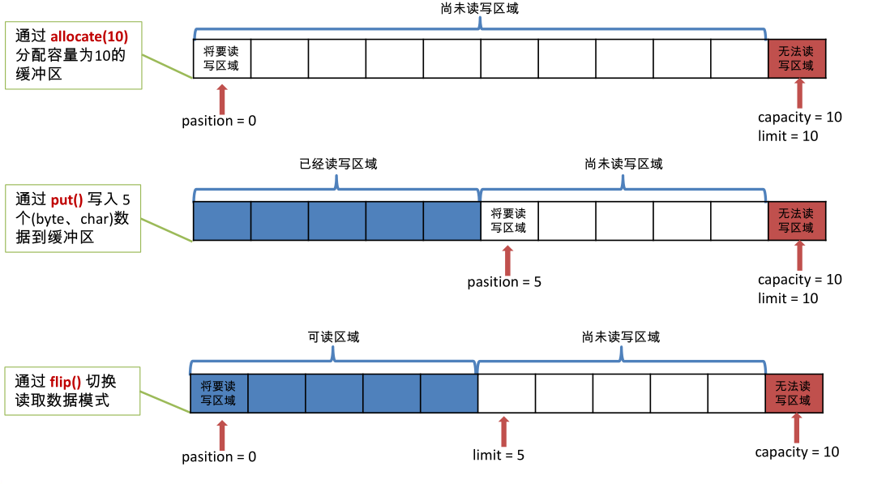
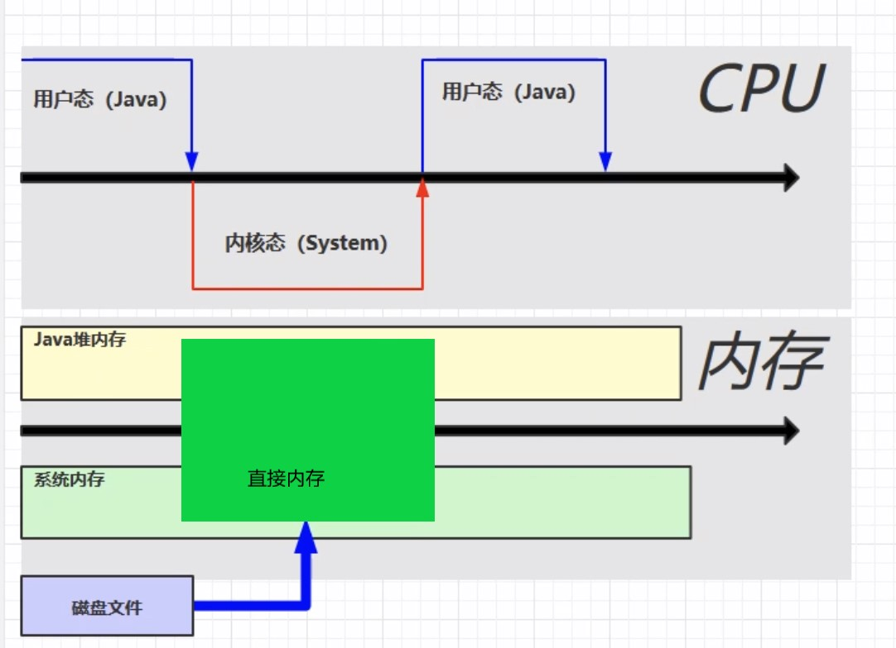

NIO 学习
===

I/O 模型基本说明
---

I/O 模型：就是用什么样的通道或者说是通信模式和架构进行数据的传输和接收，很大程度上决定了程序通信的性能。

> IO操作要把数据从 **内核**缓冲区 拷贝到 **用户**缓冲区

`阻塞IO模型`：当用户线程发出IO请求之后，内核会去查看数据是否就绪，如果没有就绪则等待数据就绪，此时用户线程处于阻塞状态，**用户线程交出CPU**。当数据就绪之后，内核会将数据拷贝到用户线程，并返回结果给用户线程，用户线程才重新运行。

`非阻塞IO模型`：当用户线程发出IO请求后，并不需要等待，而是马上就得到了一个结果。若此时内核的数据还没有就绪，则返回一个错误，用户线程得到错误结果后会一直**重复查看内核的数据是否准备就绪**。有一个很明显非常严重的问题，`非阻塞IO模型`需要不断地去询问内核数据是否就绪，这样会导致CPU占用率非常高。

`IO复用`：复用模型需要使用到 select函数/poll函数/epoll函数，用户线程首先将IO请求的socket添加到select中，随后select阻塞。当内核数据准备就绪时，select被唤醒返回到用户程序，然后采用轮询的方式找到就绪的socket，随后用户线程读取数据并继续执行。

select可以帮我们监视文件描述符的变化情况。

poll跟select差不多，只不过**select**是采用**数组**来存放socket，而**poll**是**链表**，所以没有数量限制。

而epoll是采用**红黑树**存放socket，且每个socket以**双向链表方式关联监听事件**，所以可以一次性就知道是哪个socket就绪。epoll对于select的改进还有：**把 <u>就绪列表</u> 跟 <u>等待列表</u> 分开（数据结构为双向链表）**，如果监听到哪个等待的socket就绪了，把该socket移到就绪列表中，每次将就绪列表返回即可。而select是将全部的socket数组返回（不管是否就绪）。

> 复用模型 与 阻塞模型的区别是：**复用模型的一个用户线程可以阻塞处理多个IO请求；而阻塞模型的一个用户线程只能阻塞处理一个IO请求**。
>
> 复用模型 与 非阻塞IO模型的区别是：**复用模型的轮询是交给内核完成，线程处于阻塞；而非阻塞IO模型的轮询由线程完成**。

`异步IO模型`：当用户线程发出IO请求后，会**告诉内核拿到数据后要怎么处理，处理完成之后再通知用户线程**，此时用户线程可以直接使用数据。


BIO、NIO、AIO
---

Java 共支持 3 种网络编程的/IO 模型：**BIO、NIO、AIO**。

Java BIO：同步阻塞模型，服务器实现模式为一个线程处理一个请求，即客户端有连接请求时服务器端就需要启动一个线程进行处理，如果一个连接不做任何事情则对应的线程会一直等待。

Java NIO： 同步非阻塞，服务器实现模式为一个线程处理多个请求(连接)。客户端发送的连接请求都会注册到 多路复用器 上，多路复用器 轮询到有 I/O 请求就通知服务器进行处理。

Java AIO(NIO.2) ： 异步非阻塞，服务器实现模式为一个有效请求一个线程，客户端的I/O请求都是由OS先完成了再通知服务器启动线程进行处理。


NIO介绍
---

Java NIO（New IO）也有人称之为non-blocking IO，从Java 1.4版本开始引入的一个新的IO API。NIO面向**缓冲区**的、基于**通道**的IO操作。NIO将以更加高效的方式进行文件的读写操作。


### NIO与BIO的区别

| NIO                        | BIO                    |
| -------------------------- | ---------------------- |
| 面向缓冲区（Buffer），双向 | 面向流（Stream），单向 |
| 非阻塞（Non Blocking IO）  | 阻塞IO(Blocking IO)    |
| 选择器（Selectors）        |                        |


NIO 三大核心
---

NIO 有三大核心部分：**Channel( 通道) ，Buffer( 缓冲区), Selector( 选择器)**

### Buffer 缓冲区

缓冲区本质上是一块可以写入/读取数据的内存。这块内存被包装成NIO Buffer对象，并提供了一组方法，用来方便的访问这块内存。

Buffer 中的重要概念： 

* **容量 (capacity)** ：作为一个内存块，Buffer具有一定的固定大小，也称为"容量"，缓冲区容量不能为负，并且创建后不能更改。 
* **限制 (limit)**：表示缓冲区中可以操作数据的大小（limit 后数据不能进行读写）。缓冲区的限制不能为负，并且不能大于其容量。 **写入模式下，限制等于buffer的容量。读取模式下，limit等于写入的数据量**。
* **位置 (position)**：下一个要读取或写入的数据的索引。缓冲区的位置不能为负，并且不能大于其限制 
* **标记 (mark)与重置 (reset)**：标记是一个索引，通过 Buffer 中的 mark() 方法 指定 Buffer 中一个特定的 position，之后可以通过调用 reset() 方法恢复到这 个position.

> 标记、位置、限制、容量遵守以下不变式：
>
>  0 ≤ mark ≤ position ≤ limit ≤ capacity



常用方法：

- 获取缓冲区：ByteBuffer.allocate(1024);
- 存入数据到缓冲区：put(byte[] b)
- 获取缓冲区的数据：get(byte[] b)
- 切换到读取模式（默认是写入）：flip()
- 转成字符数组：array()
- 设置标记：mark()
- 恢复到标记位置：reset()
- 取消mark，位置设为0：rewind()
- 清空缓冲区：clear()


#### 直接缓冲区和非直接缓冲区

非直接缓冲区：通过allocate()方法分配的缓冲区，建立在JVM内存中。

直接缓冲区：也叫直接内存，通过allocateDirect()方法分配的缓冲区，建立在系统内存中。




### Channel 通道

通道表示打开到 IO 设备(例如：文件、 套接字)的连接，数据从通道读入到缓冲区，再从缓冲区写回通道。

常用的Channel实现类：

* FileChannel：用于读取、写入、映射和操作文件的通道。
* DatagramChannel：UDP 读写网络中的数据通道。
* SocketChannel：TCP 读写网络中的数据通道。
* ServerSocketChannel：可以监听新进来的 TCP 连接，对每一个新进来的连接都会创建一个 SocketChannel。


**获取通道的方法**，支持通道的类调用getChannel() ：

- FileInputStream
- FileOutputStream
- RandomAccessFile
- DatagramSocket
- Socket
- ServerSocket

> 在JDK 1.7 中的NIO.2 针对各个通道类提供了静态方法 open()


常用方法：

- read(ByteBuffer[] dsts)：将通道中的数据存入缓冲区中
- write(ByteBuffer[] srcs)：将缓冲区中的数据写回通道中
- position()：通道内数据的当前位置
- size()：通道内数据的大小
- close()：关闭管道
- transferFrom(原通道, 原通道的位置, 原通道的大小)：从目标通道中去复制原通道数据
- transferTo(原通道的位置, 原通道的大小, 目标通道)：把原通道数据复制到目标通道

```java
@Test
public void test() throws Exception {
    /*
    	把data01的内容复制到data03中
    */
    FileInputStream is = new FileInputStream("data01.txt");
    // 获取输入管道
    FileChannel isChannel = is.getChannel();
    FileOutputStream fos = new FileOutputStream("data03.txt");
    // 获取输出管道
    FileChannel osChannel = fos.getChannel();
    // 复制
	osChannel.transferFrom(isChannel, isChannel.position(), isChannel.size());
    // 等价于
    // isChannel.transferTo(isChannel.position() , isChannel.size() , osChannel);
    
    isChannel.close();
    osChannel.close();
}
```


### Selector 选择器

Selector是 一个Java NIO组件，可以能够检查一个或多个 NIO 通道（管理多个网络连接），并确定哪些通道已经准备好进行读取或写入，并对准备就绪的通道进行处理。Selector 是非阻塞 IO 的核心

在NIO模型中，多个channel会被注册到同一个Selector中，Selector会检测这些通道是否请求，如果有请求就针对此channel进行处理。

将通道注册到Selector时，需要 **指定监听的事件** 类型：

* 读 : SelectionKey.OP_READ
* 写 : SelectionKey.OP_WRITE
* 连接 : SelectionKey.OP_CONNECT
* 接收 : SelectionKey.OP_ACCEPT

> 若注册时不止监听一个事件，则可以使用“位或”操作符连接。
>
> int interestSet = SelectionKey.OP_READ | SelectionKey.OP_WRITE 


服务端流程：

1. 获取通道

```java
ServerSocketChannel ssChannel = ServerSocketChannel.open();
```

2. 切换非阻塞模式

```java
 ssChannel.configureBlocking(false);
```

3. 绑定连接

```java
 ssChannel.bind(new InetSocketAddress(9999));
```

4. 获取选择器

```
Selector selector = Selector.open();
```

5. 将通道注册到选择器上, 并且指定 “监听接收事件”

```
ssChannel.register(selector, SelectionKey.OP_ACCEPT);
```

6. 轮询式的获取选择器上已经“准备就绪”的事件

```java
// 轮询式的获取选择器上已经“准备就绪”的事件
while (selector.select() > 0) {
    // 获取当前选择器中所有注册的 “选择键(已就绪的监听事件)”
    Iterator<SelectionKey> it = selector.selectedKeys().iterator();
    // 有请求事件
    while (it.hasNext()) {
        // 获取准备“就绪”的 事件
        SelectionKey sk = it.next();
        // 判断具体是什么事件
        if (sk.isAcceptable()) {
            // 若“接收就绪”，获取客户端连接
            SocketChannel sChannel = ssChannel.accept();
            // 切换非阻塞模式
            sChannel.configureBlocking(false);
            // 将该通道注册到选择器上
            sChannel.register(selector, SelectionKey.OP_READ);
        } else if (sk.isReadable()) {
            // 获取当前选择器上“读就绪”状态的通道
            SocketChannel sChannel = (SocketChannel) sk.channel();
            // 读取数据
            ByteBuffer buf = ByteBuffer.allocate(1024);
            int len = 0;
            while ((len = sChannel.read(buf)) > 0) {
                buf.flip();
                System.out.println(new String(buf.array(), 0, len));
                buf.clear();
            }
        }
        // 取消选择键
        it.remove();
    }
}
```


客户端流程：

1. 获取通道

```java
SocketChannel sChannel = SocketChannel.open(new InetSocketAddress("127.0.0.1", 9999));
```

2. 切换非阻塞模式

```java
sChannel.configureBlocking(false);
```

3. 分配指定大小的缓冲区

```java
ByteBuffer buf = ByteBuffer.allocate(1024);
```

4. 发送数据给服务端

```java
Scanner scan = new Scanner(System.in);
while(scan.hasNext()){
	String str = scan.nextLine();
	buf.put(str.getBytes());
	buf.flip();
	sChannel.write(buf);
	buf.clear();
}
//关闭通道
sChannel.close();
```


