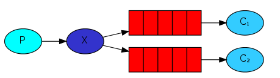

RabbitMQ学习
===

MQ的相关概念
---

### 什么是MQ

MQ消息队列(message queue)，从字面意思上看，本质是个队列，FIFO 先入先出，只不过队列中存放的内容是message 而已，它是一种**跨进程的通信机制**，用于上下游传递消息。在互联网架构中，MQ 是一种非常常见的上下游“逻辑解耦+物理解耦”的消息通信服务。使用了 MQ 之后，消息发送上游只需要依赖 MQ，不用依赖其他服务。


### MQ的作用

1. **流量消峰**：当流量过载时，将过载流量放入消息队列，当服务器可以在承受范围内处理时才将请求从消息队列移到服务器处理。
2. **应用解耦**：往往一个主系统的完成需要依赖多个子系统，当主系统发生故障而子系统还没有处理完，此时系统间的调用会出现错误（比如数据不匹配）。
3. **异步处理**：A调用B时，B的处理需要花费大量时间，此时A不用等待，当B处理完成之后发消息给MQ，MQ再告诉A可以去拿结果。
4. **顺序保证**：在大多使用场景下，数据处理的顺序都很重要。大部分MQ本来就是排序的，并且能保证数据会按照特定的顺序来处理


### MQ的分类

**ActiveMQ**：老牌、丰富的API、但是性能不太好，所以在小型企业用的多。

**Kafaka**：一开始是为了日志的收集和传输。有很高的吞吐量，但是可能会有一些丢失。适合产生大量数据的互联网服务的数据收集业务，常用于大数据。

**RocketMQ**：阿里根据kafaka开发的纯java开发的消息中间件。有开源版跟官方版。开源版不用钱，跟kafaka差不多；官方版要钱，但支持事务，可靠性等各方面都有提升。

**RabbitMQ**：使用erlang开发的基于AMQP协议实现的消息队列系统。安全可靠、吞吐量跟性能也高。是spring默认的MQ框架。商业版需要收费。

---

MQ的选择：

- Kafka：适合大数据，日志采集。
- RocketMQ：金融方面，可靠性强，比如订单。
- RabbitMQ：性能好，社区活跃度高，数据量不是很大的话，优先选。


四大核心概念
---

**生产者**：发送消息的程序

**交换机**：负责接收和推送消息。交换机必须确切知道如何处理它接收到的消息，是将这些消息推送到特定队列还是推送到多个队列，或者是把消息丢弃。

**队列**：存放消息。队列仅受主机的内存和磁盘限制，本质上是一个大的消息缓冲区。一个交换机可以绑定多个队列。

**消费者**：接收消息的程序。很多时候生产者，消费者和消息中间件并不在同一机器上。同一个应用程序既可以是生产者又是可以是消费者。


MQ案例
---

1. 创建maven项目，引入坐标：

   ```java
   <dependencies>
       <dependency>
         <groupId>com.rabbitmq</groupId>
         <artifactId>amqp-client</artifactId>
         <version>5.10.0</version>
       </dependency>
   </dependencies>
   ```

2. 编写MQ连接代码：

   ```java
   package org.example.Utils;
   
   import com.rabbitmq.client.Connection;
   import com.rabbitmq.client.ConnectionFactory;
   
   public class MQUtils {
   
       public static Connection getConnection() throws Exception {
           // 定义工厂
           ConnectionFactory factory = new ConnectionFactory();
           // 设置服务地址，协议，端口以及连接的账号密码
           factory.setHost("127.0.0.1");
           factory.setPort(5672);
           factory.setUsername(账号);
           factory.setPort(密码);
           return factory.newConnection();
       }
   }
   ```

3. 编写生产者代码：

   ```java
   package org.example.first;
   
   import com.rabbitmq.client.Channel;
   import com.rabbitmq.client.Connection;
   import org.example.Utils.MQUtils;
   
   public class producer {
       public static final String QUEUE_NAME = "hello";
       
       public static void main(String[] args) throws Exception {
           // 获取连接
           Connection connection = MQUtils.getConnection();
           // 创建通道，由通道进行传输
           Channel channel = connection.createChannel();
           /*
              生成队列
                参数1：队列名称
                参数2：队列里的消息是否持久化
                参数3：该队列是否只能提供一个消费
                参数4：最后一个消费者断开之后是否自动删除该队列
                参数5：其他参数
            */
           channel.queueDeclare(QUEUE_NAME, false, false, false, null);
           /*
               发送消息：
                   参数1：发送到哪个交换机，不指定则使用默认的
                   参数2：路由的Key，这里是队列的名称
                   参数3：其他参数信息
                   参数4：要发送的消息
            */
           channel.basicPublish("", QUEUE_NAME, null, "你好MQ".getBytes());
       }
   }
   ```

4. 编写消费者代码：

   ```java
   package org.example.first;
   
   import com.rabbitmq.client.Channel;
   import com.rabbitmq.client.Connection;
   import com.rabbitmq.client.Delivery;
   import org.example.Utils.MQUtils;
   import java.util.Arrays;
   
   public class consumer {
   
       public static final String QUEUE_NAME = "hello";
   
       public static void main(String[] args) throws Exception{
           Connection connection = MQUtils.getConnection();
           Channel channel = connection.createChannel();
           /*
               消费信息：
                 参数1：消费哪个队列
                 参数2：消费成功时是否自动应答
                 餐数3：消费成功时的回调
                 参数4：消费失败时的回调
            */
           channel.basicConsume(QUEUE_NAME, true, 
                   (consumerTag, msg)->{
                       System.out.println(Arrays.toString(msg.getBody()));
                   },
                   (consumerTag)->{
                       System.out.println(consumerTag);
                       System.out.println("===========");
                       System.out.println("消费失败");
                   }
           );
       }
   }
   ```


六大模式
---

### 模式1-helloworld

上一小结的案例就是HelloWorld模式。此时为匿名发送，不指定交换机，则直接发送到队列中。

1. 生产者将消息放入队列
2. 消费者监听(while) 消息队列，如果队列中有消息就消费掉，消息被拿走后，自动从队列中删除。


### 模式2-Work Queues

工作队列(又称任务队列)就是多个消费者版本的helloworld模式，消息**轮询**的发送给这些消费者，避免长时间等待资源密集型任务的完成。==多个消费者之间是竞争关系==。


#### 不公平分发

工作队列默认是轮询的方式将消息发给所有的消费者，这时如果有一个消息需要长时间的处理，那么处理该消息的消费者会一直处于工作状态，而其他消费者则处理空闲状态。为了避免这种情况，我们可以设置消费者的通道为**不公平分发**，此时一旦有其他消费者空闲，则会把消息优先发送给该消费者。

消费者中设置不公平分发：`channel.basicQos(1);` 


#### 预取值

由于消息的发送就是异步发送的，所以每个channel就存在一个未确认的消息缓冲区，一旦消息被确认就将该消息移出这个缓冲区，而每个通道的预取值就是设置该通道的缓冲区大小。

依然是通过 `channel.basicQos(prefetch);` 来设置，prefetch表示缓冲区大小。


### 消息确认机制 - 消费者确认

有了多个消费者之后，必然会出现 其中一个或多个消费者在处理过程中突然宕机的问题，那么此时还没处理完的消息该怎么办呢？为了保证消息在发送过程中不丢失，rabbitmq 引入**消费者确认机制**。消费者确认就是：消费者在接收到消息并且处理该消息之后，告诉 rabbitmq 它已经被处理，可以把该消息删除了。

当**消费者**由于某些原因失去连接(其通道已关闭，连接已关闭或 TCP 连接丢失)，导致消息未发送 ACK 确认，RabbitMQ 将了解到消息未完全处理，并对其重新排队。如果此时其他消费者可以处理，它将重新分发给其他消费者。这样，即使某个消费者偶尔死亡，也可以确保不会丢失消息。

消息应答的方式有两种：自动应答和手动应答。

- **自动应答**：消息发送后被认为已经处理完成，立即删除该消息。可能会造成消息的丢失。
- **手动应答**：当消息处理完成需要手动通知MQ删除该消息。
  - Channel.basicAck(String tag, boolean multiple)：用于肯定确认，RabbitMQ 已知道该消息并且成功的处理消息，可以将其丢弃了。
  - Channel.basicNack(String tag, boolean multiple)：用于否定确认。
  - Channel.basicReject(String tag)：用于否定确认，不处理该消息了直接拒绝，可以将其丢弃了。

multiple表示是否进行**批量应答**。批量应答指的是，当收到后面的tag应答的时候默认表示其前面所有消息都以处理完成，此时也可能出现消息丢失。比如发送了5 6 7 8，四个消息，当收到消息8的应答时，默认5 6 7也收到应答，此时会将5 6 7 8都进行删除。

***

**手动应答案例**：

生产者代码还是一样，主要是消费者代码需要自动应答

```java
package org.example.second;

import com.rabbitmq.client.Channel;
import com.rabbitmq.client.DeliverCallback;
import org.example.Utils.MQUtils;
import java.util.concurrent.LinkedBlockingQueue;
import java.util.concurrent.ThreadPoolExecutor;
import java.util.concurrent.TimeUnit;

public class consumer {
    private static final String ACK_QUEUE_NAME="ack_queue";

    public static void main(String[] args) throws Exception {
        Channel channel = MQUtils.getConnection().createChannel();
        // 消息消费的时候如何处理消息
        DeliverCallback deliverCallback = (consumerTag, delivery) -> {
            String message= new String(delivery.getBody());
            System.out.println("接收到消息:"+message);
            /**
             * 1.消息标记 tag
             * 2.是否批量应答
             */
            channel.basicAck(delivery.getEnvelope().getDeliveryTag(), false);
        };

        //采用手动应答
        boolean autoAck=false;
        channel.basicConsume(ACK_QUEUE_NAME, autoAck, deliverCallback,
            (consumerTag)->{
                System.out.println(consumerTag+"消费者取消消费接口回调逻辑");
            }
        );
    }
}

```


### 消息确认机制 - 发布者确认

消费者确认解决的问题是确认消息是否被消费者"成功消费"。它有个前提条件，那就是生产者发布的消息已经"成功"发送出去了。因此还需要一个机制来告诉生产者，你发送的消息真的"成功"发送了。

在标准的AMQP 0-9-1，保证消息不会丢失的唯一方法是使用事务：在通道上开启事务,发布消息,提交事务。但是事务是非常重量级的，它使得RabbitMQ的吞吐量降低250倍。为了解决这个问题，RabbitMQ 引入了 **发布者确认(Publisher Confirms) 机制**，它是模仿AMQP协议中的消费者消息确认机制.

生产者将信道设置成 confirm 模式后，**所有在该信道上面发布的消息都将会被指派一个唯一的ID**(从 1 开始)，一旦消息被投递到所有匹配的队列之后，broker就会发送一个确认给生产者(包含消息的ID)，这就使得生产者知道消息已经正确到达目的队列了。如果消息和队列是可持久化的，那么确认消息会在消息写入磁盘之后发出。

***

发布确认默认是没有开启的，如果要开启则需要channel调用 confirmSelect方法：

```java
Channel channel = MQUtils.getConnection().createChannel();
channel.confirmSelect();
```

发布确认的策略有三种：**单个确认**、**批量确认**、**异步确认**。


#### 单个确认

这是一种**同步确认**的方式，也就是发布一个消息之后只有等它被确认发布，后续的消息才能继续发布，这种确认方式有一个最大的缺点就是：**发布速度特别的慢**，因为如果没有确认发布的消息就会阻塞后续所有消息的发布，这种方式最多提供每秒不超过数百条发布消息的吞吐量。

```java
// 开启确认模式
channel.confirmSelect();
long begin = System.currentTimeMillis();
for (int i = 0; i < MESSAGE_COUNT; i++) {
    String message = i + "";
    channel.basicPublish("", queueName, null, message.getBytes());
    // 每发一条就确认一次
    boolean flag = channel.waitForConfirms();
    if(flag){
        System.out.println("消息发送成功");
    }
}
```


#### 批量确认

与单个等待确认消息相比，先发布一批消息然后一起确认可以极大地提高吞吐量，当然这种方式的缺点就是：当发生故障导致发布消息出现问题时，不知道是哪个消息出现问题了，我们必须将整个批处理的消息重发一次。当然这种方案仍然是同步的，也一样阻塞消息的发布。

```java
// 开启发布确认
channel.confirmSelect();
// 批量确认消息大小
int batchSize = 100;
// 未确认消息个数
int outstandingMessageCount = 0;
for (int i = 1; i <= MESSAGE_COUNT; i++) {
    String message = i + "";
    channel.basicPublish("", queueName, null, message.getBytes());
    outstandingMessageCount++;
    if (outstandingMessageCount % batchSize == 0) {
        channel.waitForConfirms(); // 如果出错需要重发
        outstandingMessageCount = 0;
    }
}
// 为了确保还有剩余没有确认消息 再次确认
if (outstandingMessageCount > 0) {
    channel.waitForConfirms();
}
```


#### 异步确认

```java
//开启发布确认
channel.confirmSelect();
/**
 * 确认收到消息的一个回调
 * 	 1.消息序列号
 * 	 2.是否是批处理
 */
ConfirmCallback ackCallback = (sequenceNumber, multiple) -> {
    System.out.println("消息"+message+"被确认，序列号"+sequenceNumber);
};
ConfirmCallback nackCallback = (sequenceNumber, multiple) -> {
    System.out.println("消息"+message+"未被确认，序列号"+sequenceNumber);
};
// 添加异步的监听器
channel.addConfirmListener(ackCallback, nackCallback);

for (int i = 0; i < MESSAGE_COUNT; i++) {
    String message = "消息" + i;
    channel.basicPublish("", queueName, null, message.getBytes());
}
```

> 如何处理异步未确认消息?
>
> 最好的解决的解决方案就是把未确认的消息放到一个基于内存的能被发布线程访问的map，比如说用 ConcurrentSkipListMap, 利用这个map记录所有发出去的消息，然后在成功回调方法里remove成功发送的消息，剩下的就是未成功发送的。


### 消息持久化

消息应答时处理任务不丢失的情况，但是要如何保障当 RabbitMQ 服务停掉以后消息生产者发送过来的消息不丢失。默认情况下 RabbitMQ 退出或由于某种原因崩溃时，自动忽视队列和消息，除非告知它不要这样做。确保消息不会丢失需要 **将队列和消息都标记为持久化**。

- **队列持久化**：在生产者中设置durable为true，`channel.queueDeclare(QUEUE_NAME, durable, false, false, null);` 

> 但是需要注意的就是如果之前声明的队列不是持久化的，需要把原先队列先删除，或者重新创建一个持久化的队列，不然就会出现错误
>
> 

- **消息持久化**：在生产者中设置props为MessageProperties.PERSISTENT_TEXT_PLAIN，`channel.basicPublish("", QUEUE_NAME, props, "你好MQ".getBytes());`


### 交换机

**生产者生产的消息不会直接发送到队列**，而是将消息发送到交换机(exchange)。交换机工作的内容非常简单，一方面它接收来自生产者的消息，另一方面将它们推入队列。

一个交换机需要与队列通过 `routingKey` 进行**绑定**，即交换机可以通过`routingKey` 获取到队列。

不同类型的交换机处理消息的方式也不同，交换机总共有以下类型：

- 默认 (“”)，直接放到队列
- 直接 (direct)，一对一，一个信息只能通过routingKey发送到一个队列
- 扇出 (fanout)，一对多，类似广播，一个消息可以发送到与该交换机绑定的全部队列。
- 主题 (topic) ，既可以一对一也可以一对多
- 标题 (headers) ，比较少用


### 模式3-Pub/Sub

Pub/Sub为发布订阅模式，可以将消息进行广播，即将一个消息同时发送给多个的消费者。此时需要借助到交换机。



P 表示为生产者、 X 表示交换机、C1C2 表示为消费者，红色表示队列。

发布订阅模式使用的交换机为 **fanout** 

***

生产者：

```java
public class ProducerFanout {

    private static final String EXCHANGE_NAME = "fanout_exchange";

    public static void main(String[] args) throws IOException, TimeoutException {
        /** 1.创建新的连接 */
        Connection connection = MQUtils.getConnection();
        /** 2.创建通道 */
        Channel channel = connection.createChannel();
        /** 3.声明交换机：参数1交互机名称 参数2 交换机类型 */
        channel.exchangeDeclare(EXCHANGE_NAME, "fanout");
        /** 4.发送消息 */
        for (int i = 0; i < 10; i++) {
            String message = "用户注册消息：" + i;
            // 发送消息
            channel.basicPublish(EXCHANGE_NAME, "", null, message.getBytes("utf-8"));
        }
        channel.close();
        connection.close();
    }
}
```

消费者1：

```java
public class ConsumerEmailFanout {

    private static final String QUEUE_NAME = "consumer_email";
    private static final String EXCHANGE_NAME = "fanout_exchange";

    public static void main(String[] args) throws Exception {
        /* 1.创建新的连接 */
        Connection connection = MQUtils.getConnection();
        /* 2.创建通道 */
        Channel channel = connection.createChannel();
        /* 3.消费者关联队列 */
        channel.queueDeclare(QUEUE_NAME, false, false, false, null);
        /* 4.队列与交换机绑定 参数1队列 参数2交换机 参数3routingKey */
        channel.queueBind(QUEUE_NAME, EXCHANGE_NAME, "");
        DeliverCallback deliverCallback = (consumerTag, delivery) -> {
            String msg = new String(delivery.getBody(), "UTF-8");
            System.out.println("数据接收成功：" + msg);
        };
        /* 5.消费者监听队列消息 */
        channel.basicConsume(QUEUE_NAME, true, deliverCallback);
    }
}
```

消费者2也是如此，一旦生产者发送消息，这两个消费者都可以对该消息进行消费。

【注意】**先运行消费者，再运行生产者**。如果没有提前将队列绑定到交换机，那么直接运行生产者的话，消息是不会发到任何队列里的。

> 代码补充， **channel.queueBind(QUEUE_NAME, EXCHANGE_NAME, "");** 中第三个参数置为空，可以接收到生产者所有的消息


