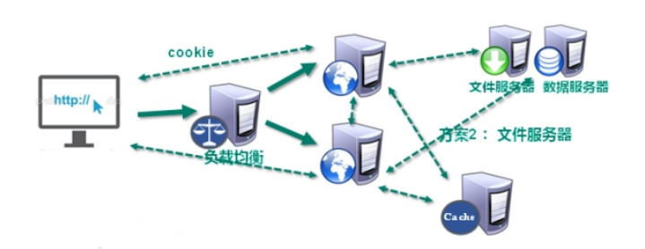

Redis6
===

简单介绍
===

NoSQL介绍
---

NoSQL(Not Only SQL)，意即“不仅仅是SQL”，泛指非关系型的数据库。 

NoSQL 不依赖业务逻辑方式存储，而以简单的key-value模式存储。因此大大的增加了数据库的扩展能力。

在对数据高并发、海量数据的读写的时候有很高的性能。但是它不遵循sql标准，也不支持ACID。

### 解决CPU及内存压力

在进行负载均衡的时候，如何让每台服务器都能知道用户的状态？

1. 存在cookie里
   - 保存在客户端，不安全
2. 每台服务器都复制一份session
   - session数据冗余，节点越多浪费越大
3. 保存在缓存数据库中
   - 数据在内存中，速度快，存储结构简单

### 解决IO压力

在数据量很大的时候，可以把经常用到的查询的数据放到缓存数据库中，减少对数据库的IO读操作。

Redis介绍
---

Redis是一个开源的key-value存储系统。它支持存储的value类型相对更多，包括string(字符串)、list(链表)、set(集合)、zset(有序集合) 和 hash(哈希类型)。

这些数据类型都支持push/pop、add/remove及取交集、并集和差集等操作，而且这些操作都是**原子性**的。在此基础上，Redis支持各种不同方式的排序。为了保证效率，数据都是缓存在内存中。

Redis会**周期性**的把更新的数据写入磁盘或者把修改操作写入追加的记录文件。并且在此基础上实现了master-slave**(主从)同步**

***

>  Redis是单线程+多路IO复用技术。而memcached使用的是多线程+锁。

多路复用是指使用==一个线程==来检查==多个文件描述符（Socket）==的就绪状态（一般是读就绪或者写就绪），一旦某个描述符就绪，能够通知程序进行相应的读写操作。

多路复用的优势并不是对于单个连接能处理的更快，而是在于可以在单个线程/进程中处理更多的连接。系统不必创建多个进程/线程，从而大大减小了系统的开销。

### 应用场景

#### 配合关系型数据库做高速缓存

1. 高频次，热门访问的数据的情况下，降低数据库IO
2. 分布式架构中，做session共享

#### 多样的数据结构存储持久化数据

基本操作
---

关于数据库的一些操作：

- select dbid：命令切换数据库。redis默认有16个数据库，类似数组下标从0开始，初始默认使用0号库
  - `select 8` 使用8号数据库
- dbsize：查看当前数据库的key的数量
- flushdb：清空当前库
- flushall：清空全部库

***

关于key的一些操作：

- keys pattern：查找所有符合给定模式 pattern，相当于正则
  - `keys *` 匹配数据库中所有 key。
  - `keys h[ae]llo` 匹配hallo或hello的key
- exists key：判断某个key是否存在。存在返回1，否则返回0
- type key：查看key是什么类型
- del key：删除指定的key的数据
- unlink key：非阻塞删除指定的key的数据
  - 先将keys从keyspace元数据中删除，真正的删除在后续的异步操作。
- expire key t：为给定的key设置过期时间，单位为秒
- ttl key：查看还有多少秒过期。-1表示永不过期，-2表示已过期

五大数据类型
---

### 字符串 String

String类型是以二进制存储的。意味着Redis的string可以包含任何数据，比如jpg图片或者序列化的对象。

String的数据结构为简单动态字符串，内部结构实现上类似于Java的ArrayList，采用预分配冗余空间的方式来减少内存的频繁分配。

当字符串长度小于1M时，扩容的大小是原来的一倍；如果超过1M，每次扩容只会多扩大1M的空间。==需要注意的是字符串最大长度为512M==。

***

常用命令：

- `set k v [ex]`：添加键值对，会替换之前的值。ex表示过期时间
- `mset k1 v1 k2 v2 k3 v3 .....`：同时设置一个或多个 key-value对
- `get k`：根据k查询value
- `mget k1 k2 k3 .....`：同时获取一个或多个 k 的 v
- `setnx  k v`：只有在 k 不存在时，才会添加成功。
- `msetnx k1 v1 k2 v2 k3 v3 .....`：同时设置一个或多个 key-value 对，当且仅当所有给定 key 都不存在。
  - 原子操作，有一个失败则都失败。
- `append k v`：追加v到原值的末尾
- `strlen k`：获得值的长度
- `incr k`：将 k 中储存的**数字值**加1。只能对数字值操作。
- `decr k`：将 k 中储存的**数字值**减1
- `incrby/decrby k 步长`：将 k 中储存的数字值根据步长进行增/减。
- `getrange k s e`：获得值的范围，**左闭右闭**。
- `setrange k s v`：用 v 覆写 k 所储存的从s开始的字符串值。

### 列表 list

特点：单键多值

Redis 列表是简单的**字符串列表**。你可以在列表的头部（左边）或者尾部（右边）添加一个元素。

它的底层类似于双向链表，对两端的操作性能很高，通过索引下标的操作中间的节点性能会较差。

首先在列表元素较少的情况下它会将所有的元素紧挨着一起存储，使用一块连续的内存存储，这个结构是ziplist，即是压缩列表。

当数据量比较多的时候会改成quicklist，如下图所示：

因为普通的链表需要的附加指针空间太大，会比较浪费空间。比如这个列表里存的只是int类型的数据，结构上还需要两个额外的指针prev和next。

***

- `lpush/rpush k v1 v2 v3 …`：从左边/右边插入一个或多个值。
- `lpop/rpop k`：从左边/右边吐出一个值。如果所有的值都被pop掉，则k也会消失。
- `rpoplpush k1 k2`：从 k1 列表右边吐出一个值，插到 k2 列表左边。
- `lrange k s e`：按照索引下标获得元素（左闭右闭）
  - 若e为负数，表示从右边开始取，此时下标从1开始。
  - `lrange k1 0 -1` 取出左边第一个到右边第一个的元素
- `lindex k index`：按照索引下标获得元素(从左到右)
- `llen k`：获得列表长度 
- `linsert k before/after v1 v2`：在 v1 的前面/后面插入 v2
- `lrem k n v`：从左边开始删除 n 个 v
- `lset k index v`：将列表 k 下标为index的值替换成 v

### 集合 set

