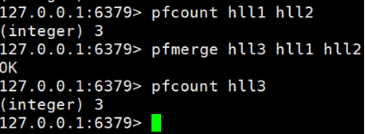

Redis6
===


简单介绍
===

NoSQL介绍
---

NoSQL(Not Only SQL)，意即“不仅仅是SQL”，泛指非关系型的数据库。 

NoSQL 不依赖业务逻辑方式存储，而以简单的key-value模式存储。因此大大的增加了数据库的扩展能力。

在对数据高并发、海量数据的读写的时候有很高的性能。但是它不遵循sql标准，也不支持ACID。


### 解决CPU及内存压力


在进行负载均衡的时候，如何让每台服务器都能知道用户的状态？

1. 存在cookie里
   - 保存在客户端，不安全
2. 每台服务器都复制一份session
   - session数据冗余，节点越多浪费越大
3. 保存在缓存数据库中
   - 数据在内存中，速度快，存储结构简单


### 解决IO压力

在数据量很大的时候，可以把经常用到的查询的数据放到缓存数据库中，减少对数据库的IO读操作。


Redis介绍
---

Redis是一个开源的key-value存储系统。它支持存储的value类型相对更多，包括string(字符串)、list(链表)、set(集合)、zset(有序集合) 和 hash(哈希类型)。

这些数据类型支持push/pop、add/remove及取交集、并集和差集等操作，而且这些操作都是**原子性**的。在此基础上，Redis支持各种不同方式的排序。为了保证效率，数据都是缓存在内存中。

Redis会**周期性**的把更新的数据写入磁盘或者把修改操作写入追加的记录文件。并且在此基础上实现了master-slave**(主从)同步**

***

>  Redis是单线程+多路IO复用技术。而memcached使用的是多线程+锁。

多路复用是指使用==一个线程==来检查==多个文件描述符（Socket）==的就绪状态（一般是读就绪或者写就绪），一旦某个描述符就绪，能够通知程序进行相应的读写操作。

多路复用的优势并不是对于单个连接能处理的更快，而是在于可以在单个线程/进程中处理更多的连接。系统不必创建多个进程/线程，从而大大减小了系统的开销。

***

应用场景

1. 配合关系型数据库做高速缓存
   - 高频次，热门访问的数据的情况下，降低数据库IO
   - 分布式架构中，做session共享
2. 使用结构存储持久化数据


基本操作
---

关于数据库的一些操作：

- select dbid：命令切换数据库。redis默认有16个数据库，类似数组下标从0开始，初始默认使用0号库
  - `select 8` 使用8号数据库
- dbsize：查看当前数据库的key的数量
- flushdb：清空当前库
- flushall：清空全部库

***

关于key的一些操作：

- keys pattern：查找所有符合给定模式 pattern，相当于正则
  - `keys *` 匹配数据库中所有 key。
  - `keys h[ae]llo` 匹配hallo或hello的key
- exists key：判断某个key是否存在。存在返回1，否则返回0
- type key：查看key是什么类型
- del key：删除指定的key的数据
- unlink key：非阻塞删除指定的key的数据
  - 先将keys从keyspace元数据中删除，真正的删除在后续的异步操作。
- expire key t：为给定的key设置过期时间，单位为秒
- ttl key：查看还有多少秒过期。-1表示永不过期，-2表示已过期


五大数据类型
---

### 字符串 string

string类型是以二进制存储的。意味着Redis的string可以包含任何数据，比如jpg图片或者序列化的对象。

string的数据结构为简单动态字符串，内部结构的实现类似于Java的ArrayList，采用预分配冗余空间的方式来减少内存的频繁分配。

当字符串长度小于1M时，扩容的大小是原来的一倍；如果超过1M，每次扩容只会多扩大1M的空间。==需要注意的是字符串最大长度为512M==。

- `set k v [ex]`：添加键值对，会替换之前的值。ex表示过期时间
- `mset k1 v1 k2 v2 k3 v3 .....`：同时设置一个或多个 key-value对
- `get k`：根据k查询value
- `mget k1 k2 k3 .....`：同时获取一个或多个 k 的 v
- `setnx  k v`：只有在 k 不存在时，才会添加成功。
- `msetnx k1 v1 k2 v2 k3 v3 .....`：同时设置一个或多个 key-value 对，当且仅当所有给定 key 都不存在。
  - 原子操作，有一个失败则都失败。
- `append k v`：追加v到原值的末尾
- `strlen k`：获得值的长度
- `incr k`：将 k 中储存的**数字值**加1。只能对数字值操作。
- `decr k`：将 k 中储存的**数字值**减1
- `incrby/decrby k 步长`：将 k 中储存的数字值根据步长进行增/减。
- `getrange k s e`：获得值的范围，**左闭右闭**。
- `setrange k s v`：用 v 覆写 k 所储存的从s开始的字符串值。


### 列表 list

特点：单键多值

Redis 列表是简单的**字符串列表**。你可以在列表的头部（左边）或者尾部（右边）添加一个元素。

它的底层类似于双向链表，对两端的操作性能很高，通过索引下标的操作中间的节点性能会较差。

首先在列表元素较少的情况下它会将所有的元素紧挨着一起存储，使用一块连续的内存空间，这个结构是ziplist，即是压缩列表。

当数据量比较多的时候会改成quicklist，如下图所示：


因为普通的链表需要的附加指针空间太大，会比较浪费空间。比如这个列表里存的只是int类型的数据，结构上还需要两个额外的指针prev和next。

- `lpush/rpush k v1 v2 v3 …`：从左边/右边插入一个或多个值。
- `lpop/rpop k`：从左边/右边吐出一个值。如果所有的值都被pop掉，则k也会消失。
- `rpoplpush k1 k2`：从 k1 列表右边吐出一个值，插到 k2 列表左边。
- `lrange k s e`：获得下标为**[s, e]**元素（左闭右闭）
  - 若e为负数，表示从右边开始取，此时下标从1开始。
  - `lrange k1 0 -1` 取出左边第一个到右边第一个的元素
- `lindex k index`：获取下标为index的元素(从左到右)
- `llen k`：获得列表长度 
- `linsert k before/after v1 v2`：在 v1 的前面/后面插入 v2
- `lrem k n v`：从左边开始删除 n 个 v
- `lset k index v`：将列表 k 下标为index的值替换成 v


### 集合 set

set是string类型的集合，具有自动排序去重功能，当你需要存储一个列表数据，又不希望出现重复数据时，set是一个很好的选择，并且set可以判断某个成员是否在该set里，这个是list所不能提供的。

它底层其实是一个value为null的hash表，所以添加，删除，查找的复杂度都是O(1)。

- `sadd k v1 v2 .....`：将一个或多个元素加入到集合 key 中，已经存在的元素将被忽略
- `smembers k`：取出该集合的所有值。
- `sismember k v`：判断 k 集合中是否含有 v 值；有则返回1，没有则返回0。
- `scard k`：返回该集合的元素个数。
- `srem k v1 v2 ....`：删除 k 集合中的元素。
- `spop k`：**随机**从该集合中吐出一个值。
- `smove src dst value`：把集合src中一个值移动到集合dst中
- `sinter k1 k2`：返回两个集合的**交集**元素。
- `sunion k1 k2`：返回两个集合的**并集**元素。
- `sdiff k1 k2`：返回两个集合的**差集**元素。(k1中存在的，不包含k2的)


### 哈希 hash

hash是一个string类型的field和value的映射表，hash特别适合用于**存储对象**，类似Java里面的Map<String,Object>。

hash类型对应的数据结构是两种：ziplist，hashtable。当field-value长度较短且个数较少时，使用ziplist，否则使用hashtable。

- `hset k field1 value1 field2 value2 ... `：批量设置field-value
  - k通常表示一个对象，可以结合id使用，如`hset user:12 name hjh age 10` 
- `hget k field`：从哈希表k的field取出value 
- `hexists k field`：查看哈希表 k 中，给定域 field 是否存在。 
- `hkeys k`：列出该哈希表的所有field
- `hvals k`：列出该哈希表的所有value
- `hincrby k field increment`：为哈希表 k 中的 field 的 value 加上increment
- `hsetnx k field value`：当field不存在时，设置哈希表 k 中的 field-value


### 有序集合 zset

有序集合zset与普通集合set非常相似，是一个没有重复元素的字符串集合。

不同之处是有序集合的每个成员member都关联了一个评分score, zset按照score进行排序（score可以重复） 。因为元素是有序的, 所以你也可以很快的根据评分score或者次序position来获取一个范围的元素。

zset类似于TreeMap，内部成员member会按照评分score进行排序，可以得到每个member的名次，还可以通过score的范围来获取member。

- `zadd k score1 mem1 score2 mem2 …`：将一个或多个 member 元素及其 score 值加入到有序集 k 当中。
- `zrange k s e [WITHSCORES]`：返回有序集 k 中，**下标**在[s, e]之间的member。带WITHSCORES，则分数一起返回。
- `zrangebyscore k min max [withscores] [limit offset count]`：返回有序集 k 中，所有 score 值介于 [min, max] 的成员。有序集成员按 score 值**从小到大**递增。 
  - 可通过`(`指定开区间：`ZRANGEBYSCORE zset (1 5` 返回1 < score <= 5 的成员
- `zrevrangebyscore key maxmin [withscores] [limit offset count]`：同上，改为从大到小排列。 
- `zincrby k increment member`：为member的score加上increment
- `zrem k member`：删除该集合的member 
- `zcount k min max`：统计该集合，[min, max]区间内的元素个数 
- `zrank k member`：返回member在集合中的排名，从0开始

***

zset底层使用了两个数据结构

1. ziplist：第一个节点保存 member，第二个节点保存 score。ziplist 内的集合元素按 score 从小到大排序，其实质是一个双向链表。

   

2. skiplist：在member个数大于等于128时，使用skiplist存储数据。由hashmap跟跳跃表实现。hashmap保存着从 member 到 score 的映射，跳跃表按 score 从小到大保存所有集合元素。这两种数据结构会**通过指针来共享相同元素的成员和分值**，所以不会产生重复成员和分值，造成内存的浪费

跳跃表结构：


新数据类型
---

### Bitmaps

Bitmaps这个“数据类型”可以实现对于 **位** 的操作：

Bitmaps本身不是一种数据类型， 实际上它就是字符串，它可以对字符串的位进行操作。

可以把Bitmaps想象成一个以位为单位的数组， 数组的每个单元只能存储0和1， 数组的下标在Bitmaps中叫做**偏移量**。


Bitmaps常用于**信息状态的统计**，比如用户每天签到的记录，用户访问量等。

- `setbit key offset value`：将offset的位置设为value

  - `setbit users 9 1` 
  - 在第一次初始化Bitmaps时，如果偏移量非常大，那么整个初始化过程执行会比较慢，可能会造成Redis阻塞。默认值为0

- `getbit key offset`：获取offset位置的值

  - `getbit user 9`

- `bitcount key [start] [end]`：计算指定范围内的offset位置值的和。

  【注意】start跟end表示的是下标，并不是位。

  offset【01000001 01000000  00000000 00100001】对应下标【0，1，2，3】

  `bitcount k 0 1`：计算的是 01000001 01000000，返回3

- `bitop and(or/not/xor) destKey key1 [key2...]`：对指定key按位进行交、并、非、异或操作并将结果保存在destkey中。

  - 比如2020-11-03 日访问网站的userid=0,1,4,9。

    ```cmd
    setbit users:20201103 0 1
    setbit users:20201103 1 1
    setbit users:20201103 4 1
    setbit users:20201103 9 1
    ```

    2020-11-04 日访问网站的userid=1,2,5,9。

    ```cmd
    setbit users:20201104 1 1
    setbit users:20201104 2 1
    setbit users:20201104 5 1
    setbit users:20201104 9 1
    ```

    然后计算出两天都访问过网站的用户数量

    ```cmd
    bitop and users:0403 users:20201103 users:20201104
    ```

***

Bitmaps与set对比

假设网站有1亿用户， 每天独立访问的用户有5千万， 如果每天用集合类型和Bitmaps分别存储活跃用户可以得到表：


可以看出bitmaps所占用的内存小很多。但bitmaps需要把每个用户都存储下来。所以当该网站每天访问的用户很少时，Bitmaps就有点不合时宜了


### HyperLogLog

HyperLogLog 是用来做基数统计的算法，其优点是：在输入元素的数量或者体积非常非常大时，计算基数所需的空间总是固定的、并且是很小的。

每个 HyperLogLog 键只需要花费 12 KB 内存，就可以计算接近 2^64 个不同元素的基数。这和计算基数时，元素越多耗费内存就越多的集合形成鲜明对比。需要注意的是，这里计算的基数是有误差的，不过误差在可以接受的范围内。

> 何为基数？
>
> 比如数据集 {1, 3, 5, 7, 5, 7, 8}， 那么这个数据集的基数集为 {1, 3, 5 ,7, 8}, 基数(不重复元素)为5。

但是，因为 HyperLogLog 只会根据输入元素来计算基数，而**不会储存输入元素本身**，所以 HyperLogLog 不能像集合那样返回输入的各个元素。

- `pfadd key element1 [element2 ...]`：添加数据
- `pfcount key1 [key2 ...]`：统计基数
- `pfmerge destkey key1 [key2 ...]`：将多个HyperLogLog的基数合并到destkey中





### Geospatial

Redis 3.2 中增加了对GEO类型的支持。GEO，Geographic，地理信息的缩写。该类型，就是元素的2维坐标，在地图上就是经纬度。redis基于该类型，提供了经纬度设置，查询，范围查询，距离查询，经纬度Hash等常见操作。

- `geoadd key 经度1 纬度1 member1 [经度2 纬度2 member2 ...]`：设置元素的坐标点
- `geopos key member1 [member2 ...]`：获取元素的坐标点
- `geodist key member1 member2 [m|km|ft|mi]`：计算坐标点的直线距离。可指定单位：m米（默认值）、km千米 、mi英里 、ft英尺。
- `georadius key 经度 纬度 r m|km|ft|mi [withcoord] [withdist] [count count]`：以给定的经纬度为中心，找出 半径r 内的元素。


配置文件
---

<p style="text-align:center;">### Units ###</p>
1. 配置大小单位，开头定义了一些基本的度量单位，只支持bytes，不支持bit
2. 大小写不敏感


<p style="text-align:center;">### INCLUDE ###</p>
导入配置文件，类似于spring的import、jsp中的include。


<p style="text-align:center;">### NETWORK ###</p>
网络相关配置

```cmd
bind = 127.0.0.1 # 默认只接收本机的访问请求
protected-mode yes # 保护模式，默认开启
port 6379 # 端口号
timeout 0 # 一个空闲的客户端维持多少秒会关闭，0表示关闭该功能，即不关闭客户端
tcp-keepalive 300 # 每隔n秒检测一次客户端是否还活跃
```

<p style="text-align:center;">### GENERAL ###</p>
通用设置

```cmd
daemonize yes # 是否是守护线程，即后台启动。默认为no
pidfile /var/run/redis_6379.pid # 若以后台运行则需要指定一个pid文件
loglevel notice # 日志级别
# 指定日志记录级别，Redis总共支持四个级别：debug、verbose、notice、warning，默认为notice
databases 16 # 数据库的数量 
```

<p style="text-align:center;">### SNAPSHOTTING ###</p>
快照相关设置：通常进行持久化设置

```cmd
save 900 1 # 900s内，如果至少一个key进行了修改，则进行持久化操作
save 300 10 # 300s内，如果至少十个key进行了修改，则进行持久化操作
save 60 10000 # 60s内，如果至少10000个key进行了修改，则进行持久化操作
stop-write-no-bgsave-error yes # 持久化操作失败，是否继续工作
rdbcompression yes # 是否压缩rdb文件
dir ./ # rdb文件保存的目录
```


<p style="text-align:center;">### SECURITY ###</p>
安全设置

设置密码

1. 手动修改配置文件：添加`requirepass 密码`

   

2. 命令的方式

   ```cmd
   config set requirepass 123456
   config rewrite # 写入配置文件中，不然重启就没了
   ```

当需要输入密码的时候：`auth 密码` 


<p style="text-align:center;">### LIMIT ###</p>
限制设置

```cmd
maxclients 10000 # 设置redis同时可以与多少个客户端进行连接
maxmemory <bytes> # 设置redis可以使用的最大内存量
maxmemory-policy noeviction # 内存满了之后的执行策略
    # volatile-lru：使用LRU算法移除key，只对设置了过期时间的键；（最近最少使用）
    # allkeys-lru：在所有集合key中，使用LRU算法移除key
    # volatile-random：在过期集合中移除随机的key，只对设置了过期时间的键
    # allkeys-random：在所有集合key中，移除随机的key
    # volatile-ttl：移除那些TTL值最小的key，即那些最近要过期的key
    # noeviction：不进行移除。针对写操作，只是返回错误信息
```


发布和订阅
---


 Jedis
---

jedis就是集成了redis的一些命令操作，封装了redis的java客户端，提供了连接池管理。

java可以利用jedis连接redis，但 **前提** 要在配置文件中注释掉`bind 127.0.0.1`这行，然后 `protected-mode yes` 改成 `protected-mode no` 

第一步：添加maven依赖

```xml
<dependency>
    <groupId>redis.clients</groupId>
    <artifactId>jedis</artifactId>
    <version>3.2.0</version>
</dependency>
```

第二步：创建Jedis对象并使用

```java
package jedis;

import redis.clients.jedis.Jedis;

public class demo {
    public static void main(String[] args) {
        // new Jedis(IP地址, 端口号);
        Jedis jedis = new Jedis("192.168.2.102", 6379);
        // 如果你有密码则需要加上下面这行代码，不然会报 NOAUTH Authentication required.
        // jedis.auth("密码");
        String pong = jedis.ping();
        System.out.println("连接成功："+pong);
        jedis.close();
    }
}
```

之前的命令在这里都进行了封装。


整合springboot
---

1.  在pom.xml文件中引入redis相关依赖

   ```xml
   <!-- redis -->
   <dependency>
       <groupId>org.springframework.boot</groupId>
       <artifactId>spring-boot-starter-data-redis</artifactId>
   </dependency>
   
   <!-- spring2.X集成redis所需common-pool2-->
   <dependency>
       <groupId>org.apache.commons</groupId>
       <artifactId>commons-pool2</artifactId>
       <version>2.6.0</version>
   </dependency>
   ```

2. application.properties 配置redis配置

   ```properties
   # Redis服务器地址
   spring.redis.host=192.168.140.136
   # Redis服务器连接端口
   spring.redis.port=6379
   # Redis数据库索引（默认为0）
   spring.redis.database= 0
   # 连接超时时间（毫秒）
   spring.redis.timeout=1800000
   # 连接池最大连接数（使用负值表示没有限制）
   spring.redis.lettuce.pool.max-active=20
   # 最大阻塞等待时间(负数表示没限制)
   spring.redis.lettuce.pool.max-wait=-1
   # 连接池中的最大空闲连接
   spring.redis.lettuce.pool.max-idle=5
   # 连接池中的最小空闲连接
   spring.redis.lettuce.pool.min-idle=0
   ```

3. 添加redis配置类

   ```java
   @EnableCaching
   @Configuration
   public class RedisConfig extends CachingConfigurerSupport {
   
       @Bean
       public RedisTemplate<String, Object> redisTemplate(RedisConnectionFactory factory) {
           RedisTemplate<String, Object> template = new RedisTemplate<>();
           RedisSerializer<String> redisSerializer = new StringRedisSerializer();
           Jackson2JsonRedisSerializer jackson2JsonRedisSerializer = new Jackson2JsonRedisSerializer(Object.class);
           ObjectMapper om = new ObjectMapper();
           om.setVisibility(PropertyAccessor.ALL, JsonAutoDetect.Visibility.ANY);
           om.enableDefaultTyping(ObjectMapper.DefaultTyping.NON_FINAL);
           jackson2JsonRedisSerializer.setObjectMapper(om);
           template.setConnectionFactory(factory);
   		// key序列化方式
           template.setKeySerializer(redisSerializer);
   		// value序列化
           template.setValueSerializer(jackson2JsonRedisSerializer);
   		// value hashmap序列化
           template.setHashValueSerializer(jackson2JsonRedisSerializer);
           return template;
       }
   
       @Bean
       public CacheManager cacheManager(RedisConnectionFactory factory) {
           RedisSerializer<String> redisSerializer = new StringRedisSerializer();
           Jackson2JsonRedisSerializer jackson2JsonRedisSerializer = new Jackson2JsonRedisSerializer(Object.class);
   		// 解决查询缓存转换异常的问题
           ObjectMapper om = new ObjectMapper();
           om.setVisibility(PropertyAccessor.ALL, JsonAutoDetect.Visibility.ANY);
           om.enableDefaultTyping(ObjectMapper.DefaultTyping.NON_FINAL);
           jackson2JsonRedisSerializer.setObjectMapper(om);
   		// 配置序列化（解决乱码的问题）,过期时间600秒
           RedisCacheConfiguration config = RedisCacheConfiguration.defaultCacheConfig()
                   .entryTtl(Duration.ofSeconds(600))
                
              .serializeKeysWith(RedisSerializationContext.SerializationPair.fromSerializer(redisSerializer))           
               .serializeValuesWith(RedisSerializationContext.SerializationPair.fromSerializer(jackson2JsonRedisSerializer))
                   .disableCachingNullValues();
           RedisCacheManager cacheManager = RedisCacheManager.builder(factory)
                   .cacheDefaults(config)
                   .build();
           return cacheManager;
       }
   }
   ```

4. 测试使用：使用`redisTemplate.opsForValue()`来操作redis

   ```java
   @RestController
   @RequestMapping("/redisTest")
   public class RedisTestController {
       @Autowired
       private RedisTemplate redisTemplate;
   
       @GetMapping
       public String testRedis() {
           // 设置值到redis
           redisTemplate.opsForValue().set("name", "hjh");
           // 从redis获取值
           String name = (String) redisTemplate.opsForValue().get("name");
           return name;
       }
   }
   ```

   


事务和锁机制
---

Redis事务是一个单独的隔离操作：事务中的所有命令都会按顺序地执行。事务在执行的过程中，不会被其他命令请求所打断。需要注意的是，redis的事务不保证原子性，事务中如果有一条命令执行失败，其后的命令仍然会被执行，不会回滚。

**Redis事务相关命令**：

- **MULTI **：开启事务，redis会将后续的命令逐个放入队列中，然后使用EXEC命令来原子化的执行这些命令。
- **EXEC**：执行事务中的所有操作命令。
- **DISCARD**：取消事务，放弃执行事务块中的所有命令。
- **WATCH**：监视一个或多个key，如果事务在执行前，这个key(或多个key)被其他命令修改，则事务被中断，**不会执行事务中的任何命令**。是一个乐观锁。
- **UNWATCH**：取消WATCH对所有key的监视。


MULTI 和 EXEC 的使用：

```cmd
127.0.0.1:6379> MULTI
OK
127.0.0.1:6379> set k1 11
QUEUED
127.0.0.1:6379> set k2 22
QUEUED
127.0.0.1:6379> EXEC
1) OK
2) OK
127.0.0.1:6379> get k1
"11"
127.0.0.1:6379> get k2
"22"
127.0.0.1:6379>
```

WATCH的使用：

```cmd
127.0.0.1:6379> set k1 v1
OK
127.0.0.1:6379> set k2 v2
OK
127.0.0.1:6379> WATCH k1
OK
127.0.0.1:6379> set k1 11
OK
127.0.0.1:6379> MULTI
OK
127.0.0.1:6379> set k1 12
QUEUED
127.0.0.1:6379> set k2 22
QUEUED
127.0.0.1:6379> EXEC
(nil)
127.0.0.1:6379> get k1
"11"
127.0.0.1:6379> get k2
"v2"
127.0.0.1:6379>
```

UNWATCH的使用：

```cmd
127.0.0.1:6379> set k1 v1
OK
127.0.0.1:6379> set k2 v2
OK
127.0.0.1:6379> WATCH k1
OK
127.0.0.1:6379> set k1 11
OK
127.0.0.1:6379> UNWATCH
OK
127.0.0.1:6379> MULTI
OK
127.0.0.1:6379> set k1 12
QUEUED
127.0.0.1:6379> set k2 22
QUEUED
127.0.0.1:6379> exec
1) OK
2) OK
127.0.0.1:6379> get k1
"12"
127.0.0.1:6379> get k2
"22"
127.0.0.1:6379>
```


### 事务失败处理

事务失败分两种情况：

1. 语法错误（编译器错误），在开启事务后，某个命令出现了语法错误，最终导致事务提交失败，此时队列中的所有命令都会被取消。

   

   ```cmd
   127.0.0.1:6379> set k1 v1
   OK
   127.0.0.1:6379> set k2 v2
   OK
   127.0.0.1:6379> MULTI
   OK
   127.0.0.1:6379> set k1 11
   QUEUED
   127.0.0.1:6379> sets k2 22
   (error) ERR unknown command `sets`, with args beginning with: `k2`, `22`, 
   127.0.0.1:6379> exec
   (error) EXECABORT Transaction discarded because of previous errors.
   127.0.0.1:6379> get k1
   "v1"
   127.0.0.1:6379> get k2
   "v2"
   127.0.0.1:6379>
   ```

2. 类型错误（运行时错误），如果执行阶段某个命令报出了错误，则只有报错的命令不会被执行，而其他的命令都会正常执行，不会回滚。

   

   ```cmd
   127.0.0.1:6379> set k1 v1
   OK
   127.0.0.1:6379> set k2 v2
   OK
   127.0.0.1:6379> MULTI
   OK
   127.0.0.1:6379> set k1 v11
   QUEUED
   127.0.0.1:6379> incr k1
   QUEUED
   127.0.0.1:6379> set k2 v22
   QUEUED
   127.0.0.1:6379> exec
   1) OK
   2) (error) ERR value is not a integer or out of range
   3) OK
   127.0.0.1:6379> get k1
   "v11"
   127.0.0.1:6379> get k2
   "v22"
   127.0.0.1:6379>
   ```


持久化
---


