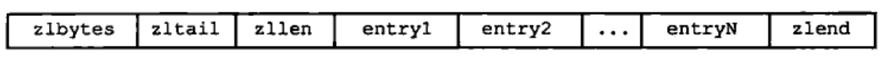
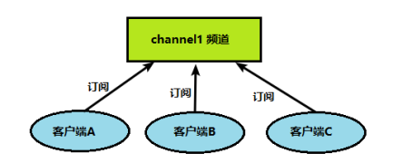
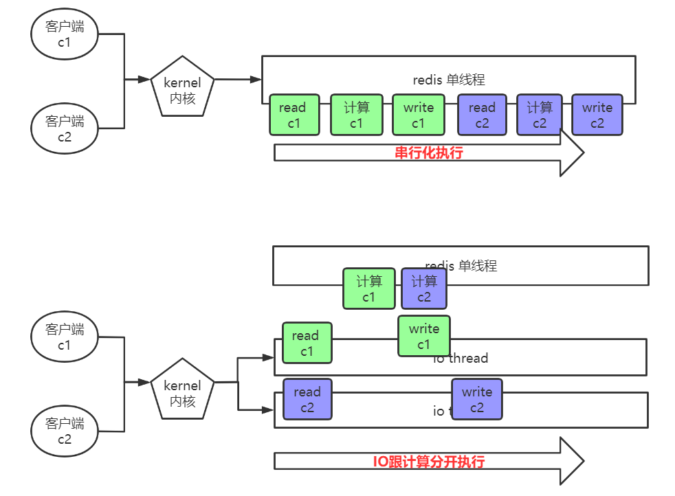

Redis6
===

简单介绍
===

分布式系统简介
---

分布式系统就是把所有的程序、功能拆分成不同的子系统，部署在多台不同的服务器上，这些子系统之间相互协作共同对外提供服务，而对用户而言他并不知道后台是多个子系统和多台服务器在提供服务，在使用上和集中式系统一样；


NoSQL介绍
---

NoSQL(Not Only SQL)，意即“不仅仅是SQL”，泛指非关系型的数据库。 

NoSQL 不依赖业务逻辑方式存储，而以简单的key-value模式存储。因此大大的增加了数据库的扩展能力。

在对数据高并发、海量数据的读写的场景下有很高的性能。但是它不遵循sql标准，也不支持ACID。


### 解决CPU及内存压力


在进行负载均衡的时候，如何让每台服务器都能知道用户的状态？

1. 存在cookie里
   - 保存在客户端，不安全
2. 每台服务器都复制一份session
   - session数据冗余，节点越多浪费越大
3. 保存在缓存数据库中
   - 数据在内存中，速度快，存储结构简单


### 解决数据库的IO压力

在数据量很大的时候，可以把经常用到的查询的数据放到缓存数据库中，减少对数据库的IO读操作。


Redis介绍
---

Redis是一个开源的key-value存储系统。它支持存储的value类型相对更多，包括string(字符串)、list(链表)、set(集合)、zset(有序集合) 和 hash(哈希类型)。

这些数据类型支持push/pop、add/remove及取交集、并集和差集等操作，而且这些操作都是**原子性**的。在此基础上，Redis支持各种不同方式的排序。为了保证效率，数据都在内存中进行操作，然后会**周期性**的把更新的数据写入磁盘或者把修改操作追加写入到记录文件。并且在此基础上实现了master-slave**(主从)同步**。

> Redis是单线程+多路IO复用技术。而memcached使用的是多线程+锁。

**多路复用**是指==一个线程==可以检查==多个文件描述符（Socket）==的就绪状态（一般是读就绪或者写就绪），一旦某个描述符就绪，能够通知程序进行相应的读写操作。

多路复用的优势并不是在于单个连接能处理的更快，而是单个线程/进程可以处理更多的连接。系统不必创建多个进程/线程，从而大大减小了系统的开销。

***

应用场景

1. 配合关系型数据库做高速缓存，降低数据库IO
2. 分布式架构中，做session共享
3. 使用结构存储持久化数据


基本操作
---

关于数据库的一些操作：

- select dbid：命令切换数据库。redis默认有16个数据库，类似数组下标从0开始，初始默认使用0号库
  - `select 8` 使用8号数据库
- dbsize：查看当前数据库的key的数量
- flushdb：清空当前库
- flushall：清空全部库

***

关于key的一些操作：

- keys pattern：查找所有符合给定模式 pattern，相当于正则
  - `keys *` 匹配数据库中所有 key。
  - `keys h[ae]llo` 匹配hallo或hello的key
- exists key：判断某个key是否存在。存在返回1，否则返回0
- type key：查看key是什么类型
- del key：删除指定的key的数据
- unlink key：非阻塞方式删除指定的key的数据。先将key从keyspace元数据中删除，真正的删除在后续的异步操作。
- expire key t：为给定的key设置过期时间，单位为秒
- ttl key：查看还有多少秒过期。**-1表示永不过期，-2表示已过期**


五大数据类型
---

### 字符串 string

string类型是以二进制存储的。意味着Redis的string可以包含任何数据，比如jpg图片或者序列化的对象。

string的数据结构：

- 如果是数字，则直接使用int。
- 否则，使用**简单动态字符串**，内部结构的实现类似于Java的ArrayList，采用 预分配冗余空间 的方式来减少内存的频繁分配。

当字符串长度小于1M时，扩容的大小是原来的一倍；如果超过1M，每次扩容只会多扩大1M的空间。==需要注意的是字符串最大长度为512M==。

- `set k v [nx] [px t]`：添加键值对，会替换之前的值。nx表示key不存在才会set，px t表示过期时间。
- `mset k1 v1 k2 v2 k3 v3 .....`：同时设置一个或多个 key-value对
- `get k`：根据k查询value
- `mget k1 k2 k3 .....`：同时获取一个或多个 k 的 v
- `setnx  k v`：只有在 k 不存在时，才会添加成功。等同于`set k v nx`  
- `msetnx k1 v1 k2 v2 k3 v3 .....`：同时设置一个或多个 key-value 对，当且仅当所有给定 key 都不存在。
  - 原子操作，有一个失败则都失败。
- `append k v`：追加v到原值的末尾
- `strlen k`：获得值的长度
- `incr k`：将 k 中储存的**数字值**加1。只能对数字值操作，否则报错。
- `decr k`：将 k 中储存的**数字值**减1
- `incrby/decrby k 步长`：将 k 中储存的数字值根据步长进行增/减。
- `getrange k s e`：获得值的范围，**左闭右闭**。
- `setrange k s v`：用 v 覆写 k 所储存的从s开始的字符串值。

应用场景：

1. 存储单键
2. **分布式锁**


### 列表 list

特点：单键多值

Redis 列表是简单的**字符串列表**。你可以在列表的头部（左边）或者尾部（右边）添加一个元素。

它的底层类似于双向链表，对两端的操作性能很高，通过索引下标操作中间的节点性能会较差。

首先在列表元素较少的情况下它会将所有的元素紧挨着一起存储，使用一块连续的内存空间，这个结构是`ziplist`，即是**压缩列表**。



- **zlbytes**表示这个ziplist占用的大小
- **zltail**表示最后一个元素的偏移量，可以很快速的从后往前找。
- **zllen**表示元素个数。
- **entry**表示元素
- **zlend**标记ziplist的结尾

当数据量比较多的时候会改成`quicklist`，如下图所示：


因为普通的链表需要的附加指针空间太大，会比较浪费空间。比如这个列表里存的只是int类型的数据，结构上还需要两个额外的指针prev和next。

- `lpush/rpush k v1 v2 v3 …`：从左边/右边插入一个或多个值。
- `lpop/rpop k`：从左边/右边吐出一个值。如果所有的值都被pop掉，则k也会消失。
- `rpoplpush k1 k2`：从 k1 列表右边吐出一个值，插到 k2 列表左边。
- `lrange k s e`：获得下标为**[s, e]**元素（左闭右闭）
  - 若e为负数，表示从右边开始取，此时下标从1开始。
  - `lrange k1 0 -1` 取出左边第一个到右边第一个的元素
- `lindex k index`：获取下标为index的元素(从左到右)
- `llen k`：获得列表长度 
- `linsert k before/after v1 v2`：在 v1 的前面/后面插入 v2
- `lrem k n v`：从左边第一个元素开始，删除 n 个 v
- `lset k index v`：将列表 k 下标为index的值替换成 v

***

应用场景：

1. 推送消息
2. 关注列表


### 集合 set

set是string类型的集合，具有自动排序去重功能，当你需要存储一个列表数据，又不希望出现重复数据时，set是一个很好的选择，并且set可以判断某个成员是否在该set里，这个是list所不能提供的。

> set的数据结构：
>
> - 如果是数字，则使用数组，查找的时候二分查找，但插入的复杂度是O(N)
>
> - 否则使用一个value为null的hash表，此时添加，删除，查找的复杂度都是O(1)

- `sadd k v1 v2 .....`：将一个或多个元素加入到集合 key 中，已经存在的元素将被忽略
- `smembers k`：取出该集合的所有值。
- `sismember k v`：判断 k 集合中是否含有 v 值；有则返回1，没有则返回0。
- `scard k`：返回该集合的元素个数。
- `srem k v1 v2 ....`：删除 k 集合中的元素。
- `spop k`：**随机**从该集合中吐出一个值。
- `smove src dst value`：把集合src中一个值移动到集合dst中
- `sinter k1 k2`：返回两个集合的**交集**元素。
- `sunion k1 k2`：返回两个集合的**并集**元素。
- `sdiff k1 k2`：返回两个集合的**差集**元素。(k1中存在的，不包含k2的)

***

应用场景：

1. 抽奖活动
2. 共同关注


### 哈希 hash

hash是一个string类型的field和value的映射表，hash特别适合用于**存储对象**，类似Java里面的Map<String,Object>。

hash类型对应的数据结构是两种：**ziplist，hashtable**。当field-value长度较短且个数较少时，使用ziplist，否则使用hashtable。

- `hset k field1 value1 field2 value2 ... `：批量设置field-value
  - k通常表示一个对象，可以结合id使用，如`hset user:12 name hjh age 10` 
- `hget k field`：从哈希表k的field取出value 
- `hexists k field`：查看哈希表 k 中，给定域 field 是否存在。 
- `hkeys k`：列出该哈希表的所有field
- `hvals k`：列出该哈希表的所有value
- `hincrby k field increment`：为哈希表 k 中的 field 的 value 加上increment
- `hsetnx k field value`：当field不存在时，设置哈希表 k 中的 field-value

***

应用场景：

1. 存放对象
2. 购物车
3. 收藏


### 有序集合 zset

有序集合zset与普通集合set非常相似，是一个没有重复元素的字符串集合。

不同之处是有序集合的每个成员member都关联了一个评分score, zset按照score进行排序（score可以重复） 。因为元素是有序的，所以你也可以很快的根据评分score或者排名range来获取一个范围的元素。

zset类似于TreeMap，内部成员member会按照评分score进行排序。因此可以得到每个member的名次，还可以通过score的范围来获取member。

- `zadd k score1 mem1 score2 mem2 …`：将一个或多个 member 元素及其 score 值加入到有序集 k 当中。
- `zrange k s e [WITHSCORES]`：返回有序集 k 中，**排名**在[s, e]之间的member。带WITHSCORES，则分数一起返回。
- `zrangebyscore k min max [withscores] [limit offset count]`：返回有序集 k 中，所有 score 值介于 [min, max] 的成员。有序集成员按 **score** 值递增。 
  - 可通过`(`指定开区间：`zrangebyscore k (1 5` 返回k中的1 < score <= 5 的成员
- `zrevrangebyscore key maxmin [withscores] [limit offset count]`：同上，改为从大到小排列。 
- `zincrby k n member`：为member的score加上n
- `zrem k member`：删除该集合的member 
- `zcount k min max`：统计该集合，[min, max]区间内的元素个数 
- `zrank k member`：返回member在集合中的排名，从0开始

应用场景：

1. 点赞
2. 排行榜

***

zset底层使用了两个数据结构

1. ziplist：第一个节点保存 member，第二个节点保存 score。ziplist 内的集合元素按 score 从小到大排序。

   

2. skiplist：在member个数大于等于128时，使用skiplist存储数据。由hash表跟跳跃表实现。

   - 跳表的每个节点包含了 层高、score、指针（指向member在hashtable中地址）
   - 跳表按 score 从小到大保存所有集合元素

跳跃表结构：


- 每个节点的层高都是随机的
- 查询的时间复杂度为O(logn)
- 插入，删除时间复杂度均为O(logn)，最坏情况下时间复杂度为O(n)
- 插入节点时需要记录每一层是从哪个节点下来的，方便新元素更新层高


新数据类型
---

### Bitmaps

Bitmaps这个“数据类型”可以实现对于 **位** 的操作：

Bitmaps本身不是一种数据类型， 实际上它就是字符串，它可以对字符串的位进行操作。

可以把Bitmaps想象成一个以位为单位的数组， 数组的每个单元只能存储0和1， 数组的下标在Bitmaps中叫做**偏移量**。


Bitmaps常用于**信息状态的统计**，比如用户每天签到的记录，用户访问量等。

- `setbit key offset value`：将offset的位置设为value

  - `setbit users 9 1` 
  - 在第一次初始化Bitmaps时，如果偏移量非常大，那么整个初始化过程执行会比较慢，可能会造成Redis阻塞。默认值为0

- `getbit key offset`：获取offset位置的值

  - `getbit user 9`

- `bitcount key [start] [end]`：计算指定范围内的offset位置值的和。

  【注意】start跟end表示的是下标，并不是位。

  offset【01000001 01000000  00000000 00100001】对应下标【0，1，2，3】

  `bitcount k 0 1`：计算的是 01000001 01000000，返回3

- `bitop and(or/not/xor) destKey key1 [key2...]`：对指定key按位进行交、并、非、异或操作并将结果保存在destkey中。

  - 比如2020-11-03 日访问网站的userid=0,1,4,9。

    ```cmd
    setbit users:20201103 0 1
    setbit users:20201103 1 1
    setbit users:20201103 4 1
    setbit users:20201103 9 1
    ```

    2020-11-04 日访问网站的userid=1,2,5,9。

    ```cmd
    setbit users:20201104 1 1
    setbit users:20201104 2 1
    setbit users:20201104 5 1
    setbit users:20201104 9 1
    ```

    然后计算出两天都访问过网站的用户数量

    ```cmd
    bitop and users:0403 users:20201103 users:20201104
    ```

***

Bitmaps与set对比

假设网站有1亿用户， 每天独立访问的用户有5千万， 如果每天用集合类型和Bitmaps分别存储活跃用户可以得到表：


可以看出bitmaps所占用的内存小很多。但bitmaps需要把每个用户都存储下来。所以当该网站每天访问的用户很少时，Bitmaps就有点不合时宜了


### HyperLogLog

HyperLogLog 是用来做基数统计的算法，其优点是：在输入元素的数量或者体积非常非常大时，计算基数所需的空间总是固定的、并且是很小的。

每个 HyperLogLog 键只需要花费 12 KB 内存，就可以计算接近 2^64 个不同元素的基数。这和计算基数时，元素越多耗费内存就越多的集合形成鲜明对比。需要注意的是，这里计算的基数是有误差的，不过误差在可以接受的范围内。

> 何为基数？
>
> 比如数据集 {1, 3, 5, 7, 5, 7, 8}， 那么这个数据集的基数集为 {1, 3, 5 ,7, 8}, 基数(不重复元素)为5。

但是，因为 HyperLogLog 只会根据输入元素来计算基数，而**不会储存输入元素本身**，所以 HyperLogLog 不能像集合那样返回输入的各个元素。

- `pfadd key element1 [element2 ...]`：添加数据
- `pfcount key1 [key2 ...]`：统计基数
- `pfmerge destkey key1 [key2 ...]`：将多个HyperLogLog的基数合并到destkey中


### Geospatial

Redis 3.2 中增加了对GEO类型的支持。GEO，Geographic，地理信息的缩写。该类型，就是元素的2维坐标，在地图上就是经纬度。redis基于该类型，提供了经纬度设置，查询，范围查询，距离查询，经纬度Hash等常见操作。

- `geoadd key 经度1 纬度1 member1 [经度2 纬度2 member2 ...]`：设置元素的坐标点
- `geopos key member1 [member2 ...]`：获取元素的坐标点
- `geodist key member1 member2 [m|km|ft|mi]`：计算坐标点的直线距离。可指定单位：m米（默认值）、km千米 、mi英里 、ft英尺。
- `georadius key 经度 纬度 r m|km|ft|mi [withcoord] [withdist] [count count]`：以给定的经纬度为中心，找出 半径r 内的元素。


配置文件
---

<p style="text-align:center;">### Units ###</p>
1. 配置大小单位，开头定义了一些基本的度量单位，只支持bytes，不支持bit
2. 大小写不敏感


<p style="text-align:center;">### INCLUDE ###</p>
导入配置文件，类似于spring的import、jsp中的include。


<p style="text-align:center;">### NETWORK ###</p>
网络相关配置

```bash
bind = 127.0.0.1 # 默认只接收本机的访问请求
protected-mode yes # 保护模式，默认开启
port 6379 # 端口号
timeout 0 # 一个空闲的客户端维持多少秒会关闭，0表示关闭该功能，即不关闭客户端
tcp-keepalive 300 # 每隔n秒检测一次客户端是否还活跃
```

<p style="text-align:center;">### GENERAL ###</p>
通用设置

```bash
daemonize yes # 是否是守护线程，即后台启动。默认为no
pidfile /var/run/redis_6379.pid # 若以后台运行则需要指定一个pid文件
loglevel notice # 日志级别
# 指定日志记录级别，Redis总共支持四个级别：debug、verbose、notice、warning，默认为notice
databases 16 # 数据库的数量 
```

<p style="text-align:center;">### SNAPSHOTTING ###</p>
快照相关设置：通常进行持久化设置

```bash
save 900 1 # 900s内，如果至少一个key进行了修改，则进行持久化操作
save 300 10 # 300s内，如果至少十个key进行了修改，则进行持久化操作
save 60 10000 # 60s内，如果至少10000个key进行了修改，则进行持久化操作
stop-write-no-bgsave-error yes # 持久化操作失败，是否继续工作
rdbchecksum yes # 在存储快照后，进行数据校验，但是这样做会增加大约10%的性能消耗
rdbcompression yes # 是否压缩rdb文件
dbfilename dump.rdb # rbd默认的文件名
dir ./ # rdb文件保存的目录
```


<p style="text-align:center;">### SECURITY ###</p>
安全设置

设置密码

1. 手动修改配置文件：添加`requirepass 密码`

   

2. 命令的方式

   ```bash
   config set requirepass 123456
   config rewrite # 写入配置文件中，不然重启就没了
   ```

当需要输入密码的时候：`auth 密码` 


<p style="text-align:center;">### LIMIT ###</p>
限制设置

```bash
maxclients 10000 # 设置redis同时可以与多少个客户端进行连接
maxmemory <bytes> # 设置redis可以使用的最大内存量
maxmemory-policy noeviction # 内存满了之后执行淘汰策略
```

在redis中，允许用户设置的最大使用内存大小：64位的电脑默认无限制，32位的电脑默认不超过3G。

- [ ] 哪个命令可以查看内存情况？`info memory` 


发布和订阅
---

Redis 发布订阅 (pub/sub) 是一种消息通信模式：发送者 (pub) 发送消息，订阅者 (sub) 接收消息。客户端可以订阅任意数量的频道。




相关命令：

- `subscribe channel`：订阅一个或者多个频道；
- `unsubscribe channel`：退订一个或者多个频道；
- `publish channel mes`：向通道发送消息；


 Jedis
---

jedis就是集成了redis的一些命令操作，封装了redis的java客户端，提供了连接池管理。

java可以利用jedis连接redis，但 **前提** 要在配置文件中注释掉`bind 127.0.0.1`这行，然后 `protected-mode yes` 改成 `protected-mode no` 

第一步：添加maven依赖

```xml
<dependency>
    <groupId>redis.clients</groupId>
    <artifactId>jedis</artifactId>
    <version>3.2.0</version>
</dependency>
```

第二步：创建Jedis对象并使用

```java
package jedis;

import redis.clients.jedis.Jedis;

public class demo {
    public static void main(String[] args) {
        // new Jedis(IP地址, 端口号);
        Jedis jedis = new Jedis("192.168.2.102", 6379);
        // 如果你有密码则需要加上下面这行代码，不然会报 NOAUTH Authentication required.
        // jedis.auth("密码");
        String pong = jedis.ping();
        System.out.println("连接成功："+pong);
        jedis.close();
    }
}
```

之前的命令在这里都进行了封装。


整合springboot
---

1.  在pom.xml文件中引入redis相关依赖

   ```xml
   <!-- redis -->
   <dependency>
       <groupId>org.springframework.boot</groupId>
       <artifactId>spring-boot-starter-data-redis</artifactId>
   </dependency>
   
   <!-- spring2.X集成redis所需common-pool2-->
   <dependency>
       <groupId>org.apache.commons</groupId>
       <artifactId>commons-pool2</artifactId>
       <version>2.6.0</version>
   </dependency>
   ```

2. application.properties 配置redis配置

   ```properties
   # Redis服务器地址
   spring.redis.host=IP地址
   # Redis服务器连接端口
   spring.redis.port=端口
   # Redis数据库索引（默认为0）
   spring.redis.database= 0
   # 连接超时时间（毫秒）
   spring.redis.timeout=1800000
   # 连接池最大连接数（使用负值表示没有限制）
   spring.redis.lettuce.pool.max-active=20
   # 最大阻塞等待时间(负数表示没限制)
   spring.redis.lettuce.pool.max-wait=-1
   # 连接池中的最大空闲连接
   spring.redis.lettuce.pool.max-idle=5
   # 连接池中的最小空闲连接
   spring.redis.lettuce.pool.min-idle=0
   ```

3. 添加redis配置类

   ```java
   @EnableCaching
   @Configuration
   public class RedisConfig extends CachingConfigurerSupport {
   
       @Bean
       public RedisTemplate<String, Object> redisTemplate(RedisConnectionFactory factory) {
           RedisTemplate<String, Object> template = new RedisTemplate<>();
           RedisSerializer<String> redisSerializer = new StringRedisSerializer();
           Jackson2JsonRedisSerializer jackson2JsonRedisSerializer = new Jackson2JsonRedisSerializer(Object.class);
           ObjectMapper om = new ObjectMapper();
           om.setVisibility(PropertyAccessor.ALL, JsonAutoDetect.Visibility.ANY);
           om.enableDefaultTyping(ObjectMapper.DefaultTyping.NON_FINAL);
           jackson2JsonRedisSerializer.setObjectMapper(om);
           template.setConnectionFactory(factory);
   		// key序列化方式
           template.setKeySerializer(redisSerializer);
   		// value序列化
           template.setValueSerializer(jackson2JsonRedisSerializer);
   		// value hashmap序列化
           template.setHashValueSerializer(jackson2JsonRedisSerializer);
           return template;
       }
   
       @Bean
       public CacheManager cacheManager(RedisConnectionFactory factory) {
           RedisSerializer<String> redisSerializer = new StringRedisSerializer();
           Jackson2JsonRedisSerializer jackson2JsonRedisSerializer = new Jackson2JsonRedisSerializer(Object.class);
   		// 解决查询缓存转换异常的问题
           ObjectMapper om = new ObjectMapper();
           om.setVisibility(PropertyAccessor.ALL, JsonAutoDetect.Visibility.ANY);
           om.enableDefaultTyping(ObjectMapper.DefaultTyping.NON_FINAL);
           jackson2JsonRedisSerializer.setObjectMapper(om);
   		// 配置序列化（解决乱码的问题）,过期时间600秒
           RedisCacheConfiguration config = RedisCacheConfiguration.defaultCacheConfig()
                   .entryTtl(Duration.ofSeconds(600))
                
              .serializeKeysWith(RedisSerializationContext.SerializationPair.fromSerializer(redisSerializer))           
               .serializeValuesWith(RedisSerializationContext.SerializationPair.fromSerializer(jackson2JsonRedisSerializer))
                   .disableCachingNullValues();
           RedisCacheManager cacheManager = RedisCacheManager.builder(factory)
                   .cacheDefaults(config)
                   .build();
           return cacheManager;
       }
   }
   ```

4. 测试使用：使用`redisTemplate.opsForValue()`来操作redis

   ```java
   @RestController
   @RequestMapping("/redisTest")
   public class RedisTestController {
       @Autowired
       private RedisTemplate redisTemplate;
   
       @GetMapping
       public String testRedis() {
           // 设置值到redis
           redisTemplate.opsForValue().set("name", "hjh");
           // 从redis获取值
           String name = (String) redisTemplate.opsForValue().get("name");
           return name;
       }
   }
   ```

   


事务
---

Redis事务是一个单独的隔离操作：事务中的所有命令都会按顺序地执行。事务在执行的过程中，不会被其他命令请求所打断。需要注意的是，redis的事务不保证原子性，事务中如果有一条命令执行失败，其后的命令仍然会被执行，不会回滚。

**Redis事务相关命令**：

- **MULTI **：开启事务，redis会将后续的命令逐个放入队列中，然后使用EXEC命令来原子化的执行这些命令。
- **EXEC**：执行事务中的所有操作命令。
- **DISCARD**：取消事务，放弃执行事务块中的所有命令。
- **WATCH**：监视一个或多个key，如果事务在执行前，这个key(或多个key)被其他命令修改，则事务被中断，**不会执行事务中的任何命令**。是一个乐观锁。
- **UNWATCH**：取消WATCH对所有key的监视。


MULTI 和 EXEC 的使用：

```cmd
127.0.0.1:6379> MULTI
OK
127.0.0.1:6379> set k1 11
QUEUED
127.0.0.1:6379> set k2 22
QUEUED
127.0.0.1:6379> EXEC
1) OK
2) OK
127.0.0.1:6379> get k1
"11"
127.0.0.1:6379> get k2
"22"
127.0.0.1:6379>
```

WATCH的使用：

```cmd
127.0.0.1:6379> set k1 v1
OK
127.0.0.1:6379> set k2 v2
OK
127.0.0.1:6379> WATCH k1
OK
127.0.0.1:6379> set k1 11
OK
127.0.0.1:6379> MULTI
OK
127.0.0.1:6379> set k1 12
QUEUED
127.0.0.1:6379> set k2 22
QUEUED
127.0.0.1:6379> EXEC
(nil)
127.0.0.1:6379> get k1
"11"
127.0.0.1:6379> get k2
"v2"
127.0.0.1:6379>
```

UNWATCH的使用：

```cmd
127.0.0.1:6379> set k1 v1
OK
127.0.0.1:6379> set k2 v2
OK
127.0.0.1:6379> WATCH k1
OK
127.0.0.1:6379> set k1 11
OK
127.0.0.1:6379> UNWATCH
OK
127.0.0.1:6379> MULTI
OK
127.0.0.1:6379> set k1 12
QUEUED
127.0.0.1:6379> set k2 22
QUEUED
127.0.0.1:6379> exec
1) OK
2) OK
127.0.0.1:6379> get k1
"12"
127.0.0.1:6379> get k2
"22"
127.0.0.1:6379>
```


### 事务失败处理

事务失败分两种情况：

1. 语法错误（编译器错误），在开启事务后，某个命令出现了语法错误，最终导致事务提交失败，此时队列中的所有命令都会被取消。

   

   ```cmd
   127.0.0.1:6379> set k1 v1
   OK
   127.0.0.1:6379> set k2 v2
   OK
   127.0.0.1:6379> MULTI
   OK
   127.0.0.1:6379> set k1 11
   QUEUED
   127.0.0.1:6379> sets k2 22
   (error) ERR unknown command `sets`, with args beginning with: `k2`, `22`, 
   127.0.0.1:6379> exec
   (error) EXECABORT Transaction discarded because of previous errors.
   127.0.0.1:6379> get k1
   "v1"
   127.0.0.1:6379> get k2
   "v2"
   127.0.0.1:6379>
   ```

2. 类型错误（运行时错误），如果执行阶段某个命令报出了错误，则只有报错的命令不会被执行，而其他的命令都会正常执行，不会回滚。

   

   ```cmd
   127.0.0.1:6379> set k1 v1
   OK
   127.0.0.1:6379> set k2 v2
   OK
   127.0.0.1:6379> MULTI
   OK
   127.0.0.1:6379> set k1 v11
   QUEUED
   127.0.0.1:6379> incr k1
   QUEUED
   127.0.0.1:6379> set k2 v22
   QUEUED
   127.0.0.1:6379> exec
   1) OK
   2) (error) ERR value is not a integer or out of range
   3) OK
   127.0.0.1:6379> get k1
   "v11"
   127.0.0.1:6379> get k2
   "v22"
   127.0.0.1:6379>
   ```


持久化
---

Redis 提供了2个不同形式的持久化方式。

- RDB（Redis DataBase）：根据配置的规则定时将内存中的数据持久化到硬盘上。
- AOF（Append Of File）：在每次执行**写**命令之后将命令记录到文件。


### RDB

在指定的**时间间隔内**将内存中的数据写入磁盘生成一个副本，这个过程称作”快照”。 Redis启动时会自动读取RDB快照文件。

Redis默认会将快照文件存储在Redis当前进程的工作目录的dump.rdb文件中，可以通过配置文件中的 `dir` 和 `dbfilename` 两个参数分别指定快照文件的 存储路径 和 文件名。

优点：

1. 适合大规模的数据恢复
2. 节省磁盘空间
3. 最大化redis性能，因为父进程只需要fork子进程去保存文件。

缺点：

1. 内存中的数据被克隆了一份，需要2倍的内存
2. 存在数据丢失的情况


#### 快照执行的过程

1. Redis使用fork函数复制一份当前进程（父进程）的副本（子进程）；
2. 父进程继续处理来自客户端的请求，子进程开始将内存中的数据写入硬盘中的临时文件；
3. 当子进程写完所有的数据后，用该临时文件替换旧的RDB文件，至此，一次快照操作完成。

> fork创建的新进程被称为子进程，拥有父进程数据空间、堆、栈等资源的副本。因此RDB文件存储的是执行fork操作那一刻的内存数据，而fork之后修改的数据不会写进RDB文件。==所以RDB方式存在数据丢失的情况==。


#### 执行快照的场景

1. 根据配置自动快照
2. 执行SAVE或BGSAVE命令
   - 当我们需要重启，迁移，备份Redis时，我们也可以手动执行SAVE或BGSAVE命令主动进行快照操作
   - **SAVE命令**：当执行SAVE命令时，Redis同步进行快照操作，期间会阻塞所有来自客户端的请求，所以在写入数据较多时，应该避免使用该命令；
   - **BGSAVE命令**： 该命令的快照操作是在后台异步进行的，进行快照操作的同时还能处理来自客户端的请求。
3. 执行FLUSHALL命令
4. 执行复制


### AOF

在使用Redis存储非临时数据时，一般都需要打开AOF持久化来降低数据丢失，AOF可以将Redis执行的每一条**写**命令追加到硬盘文件中。redis 重启的话就根据日志文件的内容将写指令从前到后执行一次以完成数据的恢复工作。

默认情况下，Redis没有开启AOF（append only file）持久化功能，需要通过在配置文件中修改配置：`appendonly yes` 

AOF文件保存路径和RDB文件路径是一致的，都是通过dir参数配置，默认文件名是：`appendonly.aof`，可以通过配置appendonlyfilename参数修改，如`appendonlyfilename appendonly.aof ` 

>  AOF和RDB同时开启，系统默认取 **AOF** 的数据。


#### AOF持久化流程

1. 客户端的请求**写**命令会被append追加到AOF缓冲区内；
2. AOF缓冲区根据AOF持久化策略[always, everysec, no] 将操作同步到磁盘的AOF文件中； 
3. AOF文件大小超过重写策略或手动重写时，会对AOF文件rewrite重写，压缩AOF文件容量；
4. Redis服务重启时，会重新加载AOF文件中的写操作达到数据恢复的目的；


#### AOF持久化策略

AOF持久化策略（同步机制）需要在配置文件中进行设置：`appendfsync everysec` 

- always：始终同步，每次Redis的写入都会立刻记入日志；性能较差但数据完整性比较好。
- everysec：每秒同步，每秒记入日志一次，如果宕机，本秒的数据可能丢失。
- no：redis不主动进行同步，把同步时机交给操作系统。对大多数Linux操作系统，是每30秒进行一次fsync，将缓冲区中的数据写到磁盘上。


#### AOF重写

AOF采用文件追加方式，文件会越来越大。为避免出现此种情况，新增了重写机制，当AOF文件的大小超过所设定的阈值时，Redis就会启动AOF文件的内容压缩， 只保留可以恢复数据的最小指令集。比如前面两个命令会被第三个命令覆盖，所以AOF文件只会保留第三个命令。或者两个命令可以合成一个命令。

什么时候会重写？

AOF大小超过阈值，并且与上一次重写后的大小的比值达到百分比 时触发重写。

**tips**：redis会记录上一次重写后的大小。

```cmd
auto-aof-rewrite-percentage 100 # 百分比
auto-aof-rewrite-min-size 64mb # 阈值
```

- [x] 文件达到70MB开始重写，降到50MB，下次什么时候开始重写？100MB

***

重写原理：

1. Redis调用fork创建子进程执行重写操作，父进程继续处理客户端请求。
2. 父进程将写命令追加AOF缓冲区中，同时缓存到重写空间中。这样可以保证子进程如果重写失败，原文件不会出现问题。
3. 当子进程完成对新AOF文件重写之后通知父进程，父进程就将重写空间中的命令写入到新AOF文件中。
4. 父进程将新AOF文件替换旧的AOF文件并重命名，后续的命令追加到新的AOF文件中。


#### 文件损坏恢复

遇到AOF文件损坏，通过redis目录下的`redis-check-aof` 的工具，使用命令`redis-check-aof --fix 文件名称` 进行修复。需要重启redis。


### 用哪个好

官方推荐两个都启用。

如果只是做纯内存缓存，可以都不用。

如果对数据不敏感，可以选单独用RDB。

不建议单独用 AOF，因为可能会出现Bug。


主从复制
---

主机master数据更新后根据配置和策略自动同步到从机slave，**Master**以**写**为主，**Slave**以**读**为主。

主从刚刚连接的时候，进行全量同步；全量同步结束后，进行增量同步。当然，如果有需要，slave 在任何时候都可以发起全量同步。redis 策略是首先会尝试进行增量同步，如不成功，要求从机进行全量同步。


好处：

1. 读写分离，性能扩展
2. 可以对数据进行备份。
3. 容灾快速恢复：一个从机挂了，可以很快速的恢复到与主机同步的数据。


### 复制原理

1. Slave启动成功连接到master后会发送一个sync命令
2. Master接到命令开始执行BGSAVE命令生成RDB文件 并 使用缓冲区记录此后执行的所有写命令，BGSAVE命令执行完之后，master将快照文件传送到slave。slave服务在接收到数据库文件后，将其存盘并加载到内存中。此过程称为**全量同步**。
3. **增量同步**：全量同步之后，Master将新的所有收集到的修改命令依次传给slave，完成增量同步。
4. 如果有slave断线，重启之后不会自动连上matser，此时自己为master。手动变成从机之后，会发送sync请求和主机全量同步。


从机也可以有自己的从机，但自己断线之后，自己的从机们都无法接收到主机的数据。假设从机2归属于从机1，此时如果从机1断线了，那么从机2将无法获取到主机的数据。


### QA

```
Q：从机可以进行写操作？
A：一般不可以。但可以通过配置文件让从服务器然后支持写操作。
```

```
Q：主机shutdown后情况如何？从机是上位还是原地待命？
A：主机shutdown后，从机不会做任何事情，当主机重新连接之后一切照常。在主机断线的时候，从机可以使用slaveof no one命令成为主机。
```

```
Q：主机会将数据保存在rdb文件中然后发送给slave服务器，但是如果主机上的磁盘空间有限怎么办呢？
A：master直接开启一个socket将rdb文件发送给slave服务器。
```


### 搭建主从复制

1. Appendonly 关掉或者在每个配置文件中修改 appendfilename 

2. 新建多个配置文件（每个配置文件相当于一台机器），每次文件编写以下配置。

   如redis6379.conf

   ```cmd
   include /myredis/redis.conf # 固定
   pidfile /var/run/redis_6379.pid # redis_XXX修改成跟配置文件名一样
   port 6379 # 每个配置文件的端口号
   dbfilename dump6379.rdb  # dumpXXX.rdb修改成跟配置文件名一样
   ```

   redis6380.conf

   ```cmd
   include /myredis/redis.conf # 固定
   pidfile /var/run/redis_6380.pid # redis_XXX修改成跟配置文件名一样
   port 6380 # 每个配置文件的端口号
   dbfilename dump6380.rdb  # dumpXXX.rdb修改成跟配置文件名一样
   ```

   redis6381.conf

   ```cmd
   include /myredis/redis.conf # 固定
   pidfile /var/run/redis_6381.pid # redis_XXX修改成跟配置文件名一样
   port 6381 # 每个配置文件的端口号
   dbfilename dump6381.rdb  # dumpXXX.rdb修改成跟配置文件名一样
   ```

3. 启动三台redis服务器

   

   可以使用`info replication`命令打印主从复制的相关信息

4. 配置从机：`slaveof ip port` 

   在6380 和 6381上执行: `slaveof 127.0.0.1 6379` 此时这两台主机变成6379的从机

5. 搭建完成。


## 哨兵模式

Redis主从复制的作用有数据热备、负载均衡、故障恢复等；但**主从复制存在的一个问题是故障恢复无法自动化**。

哨兵（sentinel）是基于Redis主从复制，**解决主机故障恢复的自动化问题**，进一步提高系统的高可用性。

哨兵是一个独立的进程，通过发送PING命令，让Redis服务器返回其运行状态。当哨兵监测到master断线之后，会自动将slave切换成master，然后通过**发布订阅模式**通知其他的slave修改配置文件，让它们更改主机。

一个哨兵进程对Redis服务器进行监控，可能会出现问题，为此，我们可以使用多个哨兵对Redis服务器进行监控。各个哨兵之间还会进行监控，这样就形成了多哨兵模式。


哨兵模式下，主从服务器的切换过程：

假设主服务器断线，哨兵1先检测到这个结果，系统并不会马上进行主从切换，仅仅是哨兵1主观的认为主服务器不可用，这个现象成为**主观下线**。

当后面的哨兵也检测到主服务器不可用，并且达到一定数量时，就会认为该服务器是真的不可以用了，这个现象称为**客观下线**。

此时哨兵之间会进行一次投票选出一个哨兵，它会在断线的master下所有slave中选取一个slave作为新master。切换成功后，向剩余的 slave 节点发送命令，让他们成为新master节点的 slave 节点。（原来的master会变成slave）

选取slave作为master的依据：

1. 选择replica-priority(slave节点优先级)最高的slave节点，如果存在则返回,不存在则继续下一步判断
2. 选择偏移量最大(获得原主机数据最全的)的 slave 节点，如果存在则返回，不存在则继续
3. 选择runId最小的slave节点(启动最早的节点)


集群
---

在哨兵模式下每台 Redis 服务器都存储相同的数据，很浪费内存，所以在redis 3.0上加入了 无中心化集群(Cluster) 集群模式，实现了Redis的分布式存储，也就是说每台 Redis 节点上存储不同的内容。

Redis 集群实现了对Redis的水平扩容，即启动N个redis节点，将整个数据库分布存储在这N个节点中，每个节点存储总数据的1/N。即使集群中有一部分节点失效或者无法进行通讯， 集群也可以继续处理命令请求。

> 使用集群时需要在配置文件中做如下配置：
>
> ```cmd
> cluster-enabled yes  # 打开集群模式
> cluster-config-file nodes-6379.conf # 设定节点配置文件名
> cluster-node-timeout 15000 # 设定节点失联时间，超过该时间（毫秒），集群自动进行主从切换
> ```


集群的工作方式

在 Redis 的每一个节点上都有一个插槽（slot），插槽总的取值范围是：0-16383，插槽的数量平均分布到每个节点。


当我们的存取的 Key到达的时候，Redis 会根据 crc16算法得出一个值，然后对 16384 取余。这样每个 key 都会对应一个编号在 0-16383 之间的哈希槽，找到对应的插槽所对应的节点，然后自动跳转到这个对应的节点上进行操作。

为了保证高可用，集群引入了主从模式，一个主节点对应一个或者多个从节点，当主节点断线的时候，就会启用从节点。当其它主节点ping此主节点时，如果半数以上的主节点与此主节点通信超时，那么认为主节点A断线了，此时会进行主从切换。

好处：

1. 实现扩容
2. 分摊压力
3. 无中心配置相对简单

缺点：

1. **多键操作是不被支持的** 
2. lua脚本不被支持
3. 由于集群方案出现较晚，很多公司已经采用了其他的集群方案，而代理或者客户端分片的方案想要迁移至redis cluster，需要整体迁移而不是逐步过渡，复杂度较大


面试题
===

redis为什么这么快？
---

1. 所有数据都在缓存中操作
2. 采用IO多路复用机制
3. 使用单线程，避免了多线程频繁的上下文切换


redis6.0的改进
---

- redis 4.0 之前，redis 是**完全单线程的**。
- redis 4.0 时，redis 引入了多线程，但是额外的线程只是用于**后台处理**，例如删除对象。核心流程还是单线程的。（核心流程指的是 redis 正常处理客户端请求的流程，通常包括：接收命令、解析命令、执行命令、返回结果等）
- redis 6.0 中，**多线程主要用于网络 I/O 阶段**，也就是接收命令和写回结果阶段，而在执行命令阶段，还是由单线程串行执行

***

**redis6.0引入多线程** ：因为需要充分发挥多核CPU的性能，所以引进了多线程。

但是IO跟计算是两回事，完全可以把IO跟计算分离开，使用不同的线程来执行，为了避免加锁以及多线程之间上下文的切换，redis在计算方面还是采用单线程串行执行，即IO部分采用的是多线程，而计算部分采用的依然是单线程。因此既可以充分利用多核CPU来提高IO性能，又可以很好的保证计算的原子性。

流程示意图：




大value的危害，如何处理？
---

大value的危害：

1. **内存分配不均**：value太大通常会导致内存空间分配不平衡
2. **阻塞请求**：redis在处理这个数据的时候，延迟就会增高，进而阻塞后续的请求。
3. **IO压力大**。在高并发下经常传输大value的话IO压力大。

解决：

1. 建议不要存入redis，用文档型数据库MongoDB代替或者直接缓存到CDN上等方式优化。
2. 压缩value


如何设计一个秒杀项目
---

数据库选择 缓存选择

服务拆分，将秒杀项目单独作为一个服务部署

考虑并发性（负载均衡多个服务器）

考虑安全性（布隆过滤器，缓存击穿）

库存预热（提前将秒杀商品信息加入到缓存）


如何保证 redis 的高并发和高可用？
---

redis 实现高并发主要依靠主从架构，一主多从，主机负责写，多个从机负责读的操作。如果想要在实现高并发的同时，可以容纳大量的数据，那么就需要 redis 集群，把数据分布在多个服务器上。

redis 实现高可用主要依靠的是哨兵模式，在服务器断线之后可以及时自动的切换。


淘汰策略跟回收策略
---

淘汰跟回收的区别：淘汰是内存不足时将部分key删除（不过期key），而回收是尽量回收无用空间（比如说删除过期key）。

***

当内存不足时，Redis会根据配置的 **缓存淘汰策略** 移除部分key，以保证写入成功。当内存实在放不下时，Redis直接返回 **out of memory** 错误。

淘汰策略：

- volatile-lru：在设置了过期时间的键中，使用 **LRU算法** 移除key
- allkeys-lru：在所有集合key中，使用 **LRU算法** 移除key（最近**最少使用**）
- volatile-random：在设置了过期时间的键中，随机移除key
- allkeys-random：在所有集合key中，随机移除key
- volatile-lfu：在设置了过期时间的键中使用 **lfu算法** 移除key
- allkeys-lfu：在所有键中使用 **lfu算法** 移除key（使用**频率**最少）
- volatile-ttl：移除最近要过期的key
- noeviction：不进行移除。

***

一个键到了过期时间之后不是马上从内存中删除。而是会继续存活在内存中，然后redis根据 回收策略 来删除。

回收策略（删除策略）：

- 惰性删除：当访问一个key时，判断其是否过期，若过期直接删除
- 定期删除：定期主动删除已过期的key


缓存穿透
---

缓存穿透：key对应的数据在数据源中并不存在，那么每次针对此key的请求在缓存中都获取不到，接着会去请求数据源，从而可能压垮数据源。比如用一个不存在的用户id获取用户信息，不论缓存还是数据库都没有，若黑客利用此漏洞进行攻击可能压垮数据库。


解决方案：

1. **对空值缓存**：如果一个查询返回的数据为空（不管key是否存在），我们仍然把这个空结果（null）进行缓存，设置空结果的过期时间会很短，最长不超过五分钟
2. **采用布隆过滤器**：将所有存在的key哈希到一个足够大的bitmaps中，一个一定不存在的数据会被 这个bitmaps拦截掉，从而避免了对底层存储系统的查询压力。
   - 查询一个key时，将key映射到bitmaps上，只要映射的位置有一个bit为0，说明此key肯定不存在。


缓存击穿
---

缓存击穿：key对应的数据存在，但在redis中过期，若此时有大量并发请求此key的数据，由于redis中该key已过期，不得不去访问数据源，此时可能会瞬间把数据库压垮。


解决方案：

1. **预先设置热门数据**：在redis高峰访问之前，把一些热门数据提前存入到redis里面，加大这些热门数据key的时长。
2. **过期前先去获取数据**：在热门数据过期前，先去数据库中获取数据放入缓存中。
3. **使用锁**：缓存失效后重新获取缓存时进行上锁。


缓存雪崩
---

缓存雪崩是多个key的缓存击穿版本。即缓存雪崩是多个key缓存过期的情况，而缓存击穿是某一个key缓存过期。

解决方案：

1. **构建多级缓存架构**：nginx缓存 + redis缓存 +其他缓存
2. **将缓存失效时间分散开**：在原有的失效时间基础上增加一个随机失效时间，比如1-5分钟随机，这样每一个缓存的过期时间的重复率就会降低，就很难引发集体失效的事件。


分布式锁
---

**场景**：在分布式系统中，需要操作共享资源。

Java中的锁，只能保证在同一个JVM进程内中执行。如果在分布式集群环境下呢，不同的主机要怎么知道这把锁？

实现分布式锁的方式：

1. redis的方式实现分布式锁。已有线程框架Redission实现。
2. 基于zookeeper
3. Mysql的主键或唯一键

***

其实redis实现分布式锁很简单，就是采用`set` 命令生成一把锁，然后我们利用这把锁进行操作而已。

生成锁：`SET lock_key random_value nx px t` 

- lock_key：锁的名字
- random_value：锁的值。最好弄成随机的，例如uuid，不然会造成锁的误删。
- nx：相当于setnx。只在键不存在时，才对键进行设置操作。
- px t：设置过期时间，t的单位是**毫秒**。

- [x] 问题来了：


1. 为什么要设置过期时间？**防止锁一直不释放**。

2. 为什么不直接使用setnx的方式？**因为setnx跟expire t是两个操作，并不是一个原子操作，多线程下会出错**。
3. 为什么要锁的值最好要设为uuid？如果不判断锁的value直接解锁的话，当这台服务器卡住了之后，并且锁的过期时间到了，此时这把锁被其他服务器的线程获取，接着这台服务器恢复了，继续操作，操作完释放锁，此时释放的是其他服务器的线程的锁，因为没有对锁的value进行判断，所以所有请求使用的锁都是同一把。

使用：

```java
public void testLock() {
    String uuid = UUID.randomUUID().toString();
    // set命令的参数 
    SetParams params = SetParams.setParams().nx().px(3000);
    String lock = jedis.set("lock_key", uuid, params);
    if("OK".equals(lock)){
        System.out.println("获取到了锁，可以进行操作");
        // 对锁的value值进行判断。
        if(uuid.equals(jedis.get("lock_key"))){
            System.out.println("正在释放锁。。。");
            jedis.del("lock_key");
        }
    }
    else{
        System.out.println("目前有锁，请等待");
    }
}
```

还有一种极端的情况就是，在第10行或者删除key的过程中（此时key还没删掉），电脑卡机了，然后到了过期时间，这把锁被其他线程获取了，接着电脑好了，继续执行删除key的操作。此时就会出现删错key的情况。虽然这种情况很极端，也很少出现，但是存在。

解决方案是 在key没有被主动del的情况下，开启一个线程定时的给key加过期时间。该方法可以用lua脚本实现，==redisson这个框架已经帮我们封装好了，可以直接像lock一样直接加锁解锁即可==。

```java
redisson.lock();
// 业务逻辑
redisson.unlock();
```


多路复用原理
---

IO多路复用底层与三个函数有关：select、poll、epoll。

***

(1) select==>时间复杂度O(n)

它仅仅知道有I/O事件发生了，却并不知道是哪几个流（可能有一个，多个，甚至全部），我们只能无差别轮询所有流，找出能读出数据，或者写入数据的流，对他们进行操作。所以**select具有O(n)的无差别轮询复杂度**，同时处理的流越多，无差别轮询时间就越长。

(2) poll==>时间复杂度O(n)

poll本质上和select没有区别，它将用户传入的数组拷贝到内核空间，然后查询每个fd对应的设备状态， **但是它没有最大连接数的限制，原因是它是基于链表来存储的**.

(3) epoll==>时间复杂度O(1)

不同于无差别轮询，epoll会把哪个流发生了怎样的I/O事件通知我们。所以epoll实际上是**事件驱动（每个事件关联上fd）**的，此时我们对这些流的操作都是有意义的。

select，poll，epoll都是IO多路复用的机制。I/O多路复用就是通过一种机制，可以监视多个描述符，一旦某个描述符就绪（一般是读就绪或者写就绪），能够通知程序进行相应的读写操作。**但select，poll，epoll本质上都是同步I/O，因为他们都需要在读写事件就绪后自己负责进行读写，也就是说这个读写过程是阻塞的**。

