# Spring MVC学习日记

# 1.Spring MVC概述

## 1.1 Spring MVC简介

SpringMVC是spring的其中一个模块，专门做web开发的。可以将它理解为servlet的升级版。

SpringMVC向spring一样，使用`@Controller`创建控制器对象，把对象放入springMVC容器中。我们只需要将容器中的对象作为servlet（控制器）来使用。

使用`@Controller`创建的对象只是一个普通类对象，不是servlet，但springMVC赋予了它一些额外的功能。

**【注意】只有继承了`HttpServlet`的类才是servlet**


在springMVC中，有一个对象是servlet，它就是`DispatherServlet` ，它叫做**中央调度器**，也叫前端控制器，负责接收用户的所有请求，然后分配给合适的控制器对象。以后的项目中都离不开DispatherServlet。


## 1.1 第一个注解的SpringMVC程序

项目结构：

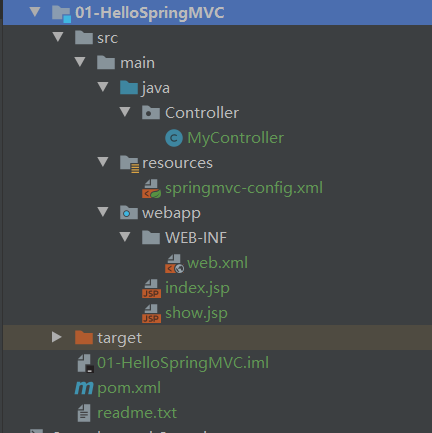

步骤：

1. 加入依赖：spring-webmvc、servlet

    ```java
    <dependency>
      <groupId>javax.servlet</groupId>
      <artifactId>javax.servlet-api</artifactId>
      <version>3.1.0</version>
      <scope>provided</scope>
    </dependency>
    <dependency>
      <groupId>org.springframework</groupId>
      <artifactId>spring-webmvc</artifactId>
      <version>5.2.5.RELEASE</version>
    </dependency>
    ```

2. 在web.xml中注册springmvc的核心对象DispatcherServlet

    ```XML
    <!--  声明DispatcherServlet
            创建DispatcherServlet的过程中会同时读取springMVC配置文件，把配置文件中的对象都创建好。
            springMVC会默认在/WEB-INF/<servlet-name>里的名字-servlet.xml读取配置文件。
            如何修改读取配置文件的路径？使用<init-param>标签
    -->
    <servlet>
        <servlet-name>springmvc</servlet-name>
        <servlet-class>org.springframework.web.servlet.DispatcherServlet</servlet-class>
        <init-param>
            <param-name>contextConfigLocation</param-name>
            <param-value>classpath:springmvc-config.xml</param-value>
        </init-param>
        <!-- load-on-startup表示在tomcat启动后创建对象的顺序，值越小越先创建 -->
        <load-on-startup>1</load-on-startup>
    </servlet>
    
    <servlet-mapping>
        <servlet-name>springmvc</servlet-name>
        <!-- url-pattern可以使用两个方式
                1. 扩展名。语法： *.扩展名；例如：*.do http://localhost:8080/myweb/some.do
                2. 使用斜杠 “/” 。 后面讲
        -->
        <url-pattern>*.do</url-pattern>
    </servlet-mapping>
    ```

3. 创建一个发起请求的页面

    ```html
    <%@ page contentType="text/html;charset=UTF-8" language="java" %>
    <html>
    <head>
        <title>HelloSpringMVC</title>
    </head>
    <body>
        <a href="some.do">发送some.do请求</a>
    </body>
    </html>
    ```

4. 使用DI创建控制器类
    4.1 类上面使用@Controller创建控制器对象
    4.2 方法的上面使用@RequestMapping匹配请求路径

    ```java
    package Controller;
    
    import org.springframework.stereotype.Controller;
    import org.springframework.web.bind.annotation.RequestMapping;
    import org.springframework.web.servlet.ModelAndView;
    
    @Controller
    public class MyController {
        /*
        * 调用方法来处理用户的请求，方法名称自定义，可以有多种返回值类型，多种参数类型
        * */
    
        /*
        * @RequestMapping为请求映射，将一个请求地址和一个方法绑定在一起
        *   被修饰的方法叫做处理器方法或控制器方法，类似于servlet的doGet，doPost
        *   属性
        *       value：String类型，表示请求的url，必须唯一，一般以 “/” 开头。
        * =================================================================
        * 返回值ModelAndView
        *   Model：请求处理完成后要显示给用户的数据
        *   View：用户所见到的视图。
        * */
        @RequestMapping(value = "/some.do")
        public ModelAndView doSome(){
            //这里先不调用service，简单的处理一下
            System.out.println("======================");
            //创建返回值对象
            ModelAndView mav = new ModelAndView();
            //添加数据，框架会把数据放入到request的作用域，request.setAttribute()
            mav.addObject("msg", "欢迎使用SpringMVC");
            mav.addObject("name","codeKiang");
            //设置视图，指定数据的去向，request.getRequestDispatcher(路径).forward(request,response).
            mav.setViewName("/show.jsp");
    
            return mav;
        }
    }
    ```

5. 创建一个显示结果的jsp

    ```HTML
    <%@ page contentType="text/html;charset=UTF-8" language="java" %>
    <html>
    <head>
        <title>显示页面</title>
    </head>
    <body>
        <h3>msg的数据：${msg}</h3><br>
        <h3>name的数据：${name}</h3>
    </body>
    </html>
    ```

6. 创建springMVC配置文件：声明组件扫描器，指定@Controller注解所在的包名

    ```xml
    <?xml version="1.0" encoding="UTF-8"?>
    <beans xmlns="http://www.springframework.org/schema/beans"
           xmlns:xsi="http://www.w3.org/2001/XMLSchema-instance"
           xmlns:context="http://www.springframework.org/schema/context"
           xsi:schemaLocation="http://www.springframework.org/schema/beans http://www.springframework.org/schema/beans/spring-beans.xsd http://www.springframework.org/schema/context https://www.springframework.org/schema/context/spring-context.xsd">
    
        <!--  声明组件扫描器  -->
        <context:component-scan base-package="Controller" />
    
    </beans>
    ```


**视图解析器，InternalResourceViewResolver**

当你有很多的ViewName的前缀路径或后缀是重复的时候，比如`WEB-INF/view/first.jsp`、`WEB-INF/view/second.jsp`；可以借助视图解析器，去掉`WEB-INF/view/`跟`.jsp`。

```xml
<!--  声明视图解析器  -->
<bean class="org.springframework.web.servlet.view.InternalResourceViewResolver">
    <!--   前缀的值一般前后都要有斜杠   -->
    <property name="prefix" value="/WEB-INF/view/" />
    <property name="suffix" value=".jsp" />
</bean>
```

**【注意】**视图解析器是在springMVC配置文件中声明的

声明了视图解析器之后就可以省去前后缀了，比如`mav.setViewName("first")`；


springMVC请求的处理流程：

1. tomcat启动，根据load-on-start创建DispatcherServlet对象，因为DispatcherServlet是servlet，所以它会执行init方法

   ```java
   WebApplication etc = new ClassPathXmlApplicationContext(配置文件的路径);
   getServletContext().setAttribute(key, etc);
   ```

2. 发起some.do请求

3. `web.xml` → `<url-pattern>` → 都会转发给`DispatcherServlet` 

4. `DispatcherServlet`在**doDispatch**方法中根据配置文件将请求分配给对应的`Controller` ，**Controller**再根据`@RequestMapping`找到对应方法

5. 对应的方法将ModelAndView转发到显示页面

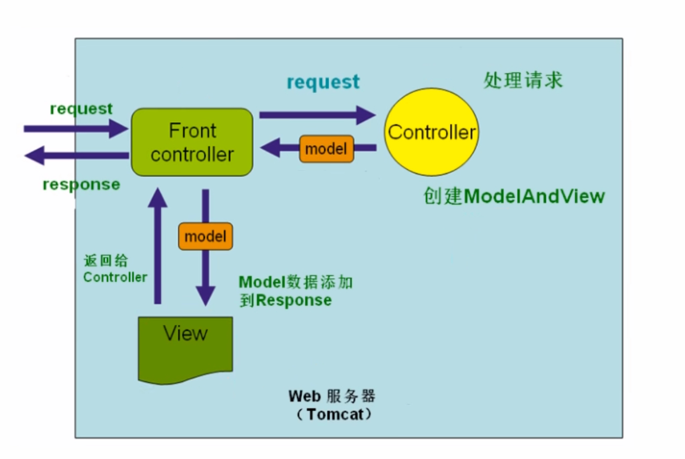

**tips：** Dispatcher也叫作前端控制器（Front controller），Controller对象叫作后端控制器（Back controller）


## 1.2 请求映射@RequestMapping

@RequestMapping为请求映射，将一个请求地址和一个方法绑定在一起

被修饰的方法叫做处理器方法或控制器方法，类似于servlet的doGet，doPost

属性

- value：请求的url，必须唯一，一般以 “/” 开头。有多个路径时，可以使用字符串数组，如`@RequestMapping(value = {"/some.do", "/second.do", "/third.do"})`；
- method：请求的方式（get或post等），如`@RequestMapping(value = "/some.do", method = RequestMethod.GET)`；
- produces：设置响应的**contentType**。


前面的案例是将请求映射注解放在方法的上面，但它**也可以放在类的上面，用于表示url的模块**，比如`user/profile.do`、`user/setting.do`、`goods/detail.do`、`goods/money.do` ，用户跟商品是两个不同的模块，需要用模块进行区别。

```java
package Controller;

import org.springframework.stereotype.Controller;
import org.springframework.web.bind.annotation.RequestMapping;
import org.springframework.web.bind.annotation.RequestMethod;
import org.springframework.web.servlet.ModelAndView;

@Controller
@RequestMapping(value = "/user")
public class MyController {
    @RequestMapping(value = "/some.do", method = RequestMethod.GET)
    public ModelAndView doSome(){
        ModelAndView mav = new ModelAndView();
        mav.addObject("msg", "欢迎使用SpringMVC");
        mav.addObject("theme","RequestMapping表示多级模块名称");
        mav.setViewName("show");

        return mav;
    }
}
```

此时需要使用**get**请求访问`user/some.do`才可以成功跳转页面。


## 1.3 请求参数的方式

携带请求参数的方式有两种：一种是从url路径参数中获取，一种是从请求body中获取。

### 获取url路径参数

`@RequestParam`和`@PathVariable` 都可以获取路径参数，前者是**获取问号？后面的参数**，后者是**获取问号？前面的组成路径的参数**。

例如：`localhost:8080/springmvc/111?param1=10&param2=20` 

**@RequestParam**获取的是**param1**和**param2**。

**@PathVariable**获取的是**111** 

```java
@RequestMapping("/springmvc/{id}")
public String getDetails(
    @PathVariable(value="id") 	   String  id,
    @RequestParam(value="param1")  String  param1,
    @RequestParam(value="param2")  String  param2)
{
	....逻辑代码	
}
```

**tips**：value属性可以省略，默认为方法的形参名


### 获取请求body中的参数

body中的参数一般是post请求的时候才会将参数放入请求body中。此时需要使用`@RequestBody` 注解获取。

```java
public void handle(
    @RequestBody String body,
    BindingResult result)
{
	if (result.hasErrors()) {
		System.out.println("参数绑定失败");
	}
	else{
		System.out.println("body:" + body);
	}
}
```

**tips**：BindingResult：参数绑定后的结果，如果绑定失败（如类型不匹配）则hasErrors()为真。


# 2. 处理器方法

## 2.1 处理器方法的参数

处理器方法可以包含以下四类参数，这些参数会在系统调用时由系统自动赋值，开发人员只需在方法参数中声明即可使用。

1. HttpServletRequest
2. HttpServletResponse
3. HttpSeesion
4. 请求中所携带的参数

前面三个是之前学Servlet时就经常使用到的，这里只介绍第四类参数。

处理器介绍请求携带的方式有两种：**逐个接收**和**对象接收**。


### 2.1.1 逐个接收

逐个接收参数要求处理器方法的形参名跟请求中的参数名一致，框架内部会将同名的请求参数赋值给同名的形参。

**tips：即使类型不同，框架也会自动帮我们进行类型转换。** 

```java
package Controller;

import org.springframework.stereotype.Controller;
import org.springframework.web.bind.annotation.RequestMapping;
import org.springframework.web.bind.annotation.RequestMethod;
import org.springframework.web.servlet.ModelAndView;

@Controller
public class MyController {
    @RequestMapping(value = "/some.do")
    public ModelAndView doSome(String name, int age){
        //【注意】形参的位置不重要，形参名与参数名一一对应就行
        ModelAndView mav = new ModelAndView();
        mav.addObject("name", name);
        mav.addObject("age",age);
        mav.setViewName("show");
        return mav;
    }
}
```


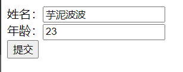

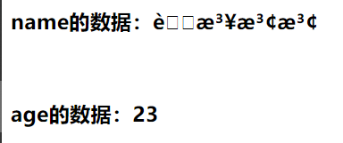

可以看到参数是成功接收了，只不过出现了乱码。原因是我们使用post请求，框架不会自动帮我们匹配编码，如果我们**使用get请求就不会出现乱码问题**。

那如何解决这乱码问题呢？试想一下我们自己写servlet的时候如何解决乱码问题，是不是在代码的最上面加上`request.setCharacterEncoding("utf-8");` 等代码。那现在我们是用框架，没办法在接收参数前进行设置编码，所以我们应该使用**过滤器**来进行设置编码，而SpringMVC框架为我们提供了一个可以设置编码的过滤器`CharacterEncodingFilter` 

下面看看它的源码：

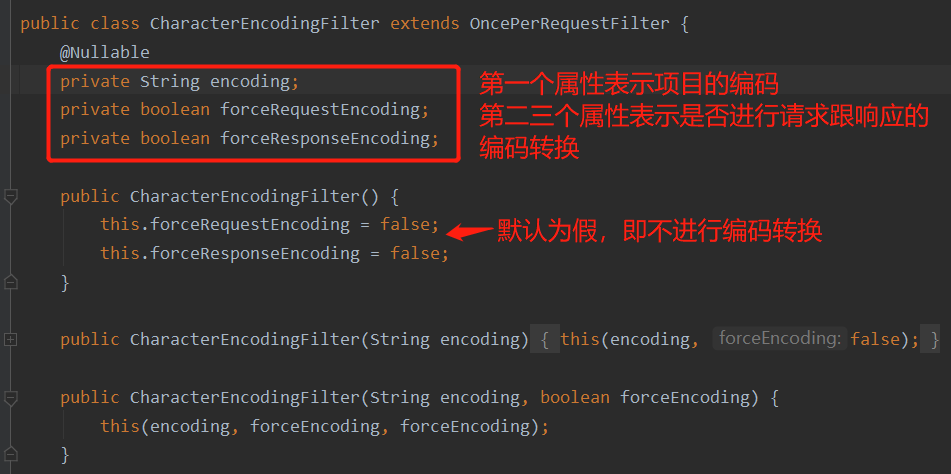

为什么要设置后面两个属性，请看下面源码：（只有设为真时才会执行编码转换）

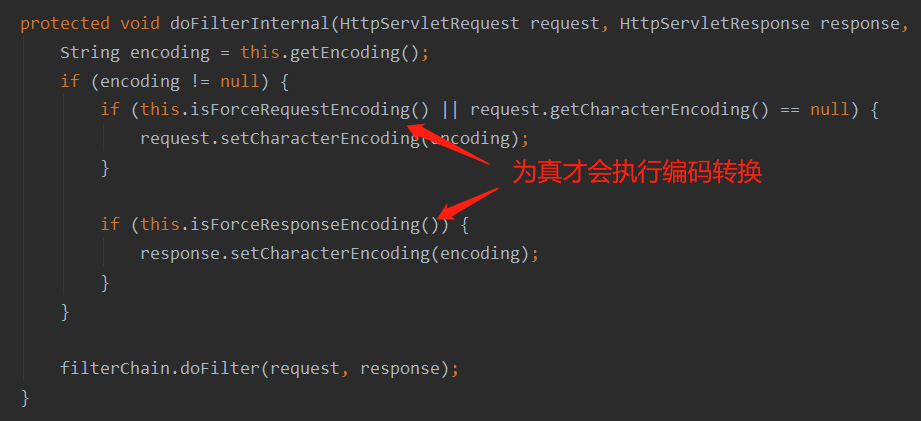

所以，我们需要做的是：**在web.xml中注册一个过滤器，在过滤器中设置属性值** 

```xml
<filter>
    <filter-name>characterEncodingFilter</filter-name>
    <filter-class>org.springframework.web.filter.CharacterEncodingFilter</filter-class>
    <init-param>
        <param-name>encoding</param-name>
        <param-value>utf-8</param-value>
    </init-param>
    <init-param>
        <param-name>forceRequestEncoding</param-name>
        <param-value>true</param-value>
    </init-param>
    <init-param>
        <param-name>forceResponseEncoding</param-name>
        <param-value>true</param-value>
    </init-param>
</filter>
<filter-mapping>
    <filter-name>characterEncodingFilter</filter-name>
    <url-pattern>/*</url-pattern>
</filter-mapping>
```

***

上面的逐个接收参数是要求属性名跟形参名一致，那不一致的咋办，这就要在每个形参前使用**`@RequestParam`**注解，比如：`public ModelAndView doSome(@RequestParam("myName") String name, int age)` 告诉框架**myName**才是要接收的参数名。


***

思考环节：

上面案例的age的类型是int，那如果输入的时候输入了字符串、浮点数或者不输入直接提交信息会发现什么？如果把int换成Integer呢？

答：字符串、浮点数或者不输入直接提交都会报错（页面会出现400错误码），如果把int换成Integer，则不输入直接提交时该形参会被赋值为**null**，输入字符串或浮点数也会报错。


### 2.1.2 对象接收

当接收很多个参数时，没道理要在形参中一个个定义，这样不仅代码多而且难看。此时我们可以把他们组成一个或多个对象，**属性名跟请求参数名一致**，**需要有每个属性的set方法**，然后在形参中定义使用这些对象即可。

来看看案例吧：

首先定义一个存放参数的实体类ParamObj（在构造函数跟set方法都加了输出语句，便于了解执行过程）

```java
package entity;

public class ParamObj {
    private String name;
    private int age;

    public ParamObj(){
        System.out.println("执行了ParamObj的构造函数");
    }

    public void setName(String name) {
        System.out.println("执行了setName方法");
        this.name = name;
    }
    public void setAge(int age) {
        System.out.println("执行了setAge方法");
        this.age = age;
    }
    public String getName() {
        return name;
    }
    public int getAge() {
        return age;
    }
}
```

在控制器方法的形参中定义该对象

```java
@RequestMapping(value = "/requestParamObj.do")
public ModelAndView doObj(ParamObj obj){
    // 创建返回值对象
    ModelAndView mav = new ModelAndView();
    mav.addObject("name", obj.getName());
    mav.addObject("age",obj.getAge());
    mav.setViewName("show");
    return mav;
}
```

访问项目后可以看到控制台输出了这三句话，实际框架内部就是调用set方法来给属性赋值的。

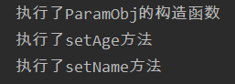


## 2.2 处理器方法的返回值

根据不同的情况，处理器方法应使用不同的返回值，常见的返回值有四种：

1. ModelAndView：需要在跳转到其他资源的时候传递数据时使用

2. String：只需要跳转而不需要传递数据时使用。返回值为要跳转的视图路径。

   ```java
   @RequestMapping(value = "/returnStr.do")
   public String returnStr(){
       return "show";
   }
   ```

3. void：不代表数据也不代表视图，但可以响应ajax请求。此种方式需要手动编写代码响应ajax，而第四种返回值则可以使用框架封装好的功能，所以这里不介绍该返回方式，重点介绍自定义类型对象的返回方式。

4. 自定义类型对象：只需要传递数据，不需要跳转。比如响应ajax请求。

   **tips：List、对象数组、String都是对象**。


**案例：Student对象响应ajax请求** 

1. 加入处理json的工具库依赖，springmvc默认使用**jackson**。

   ```xml
   <!--  jackson依赖  -->
   <dependency>
     <groupId>com.fasterxml.jackson.core</groupId>
     <artifactId>jackson-core</artifactId>
     <version>2.11.2</version>
   </dependency>
   <dependency>
     <groupId>com.fasterxml.jackson.core</groupId>
     <artifactId>jackson-databind</artifactId>
     <version>2.11.2</version>
   </dependency>
   ```

2. 在配置文件中加入注解驱动`<mvc:annotation-driven>` ，其可以将java对象自动转换成json、xml、text、二进制等数据格式。

   ```xml
   <!--  声明注解驱动 注意要选mvc结尾的 -->
   <mvc:annotation-driven />
   ```

   处理器方法的上面加上`@ResponseBody`注解，其可以将转换后的json通过HttpServletResponse输出给浏览器

   ```java
   @RequestMapping(value = "/some.do")
   @ResponseBody
   public Student doSome(){
       Student stu = new Student("codekiang", 18);
       return stu;
   }
   ```

3. 写ajax请求页面

   ```html
   <%@ page contentType="text/html;charset=UTF-8" language="java" %>
   <html>
   <head>
       <title>HelloSpringMVC</title>
       <script type="text/javascript">
           function RrsAjax() {
               //1.创建一个异步对象
               let xmlhttp=new XMLHttpRequest();
               //2.设置请求方式和请求地址
               xmlhttp.open("post","some.do",true);
               //3.发送请求
               xmlhttp.send("name=codekiang&age=18");
               //4.监听状态变化
               xmlhttp.onreadystatechange = function (ev2) {
                   if (xmlhttp.readyState===4){//判断是否到4
                       if(xmlhttp.status>=200&&xmlhttp.status<300){
                           //5.处理返回结果
                           console.log('接受到服务器返回的结果');
                           let json = JSON.parse(xmlhttp.responseText);
                           console.log("name:"+json.name,"age:"+json.age);
                       }else {
                           console.log('没有接受到服务器返回的结果');
                       }
                   }
               }
           }
       </script>
   </head>
   <body>
       <button id="btn" onclick="RrsAjax()">发送ajax请求</button>
   </body>
   </html>
   ```

结果：

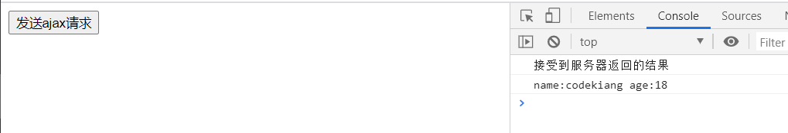


`<mvc:annotation-driven>` 的原理：
---

注解驱动实际是一个消息转换器接口`HttpMessageConverter`，接口里定义了java对象转为json、xml等数据格式的方法，此接口有很多的实现类，这些实现类完成了格式转换的具体操作。

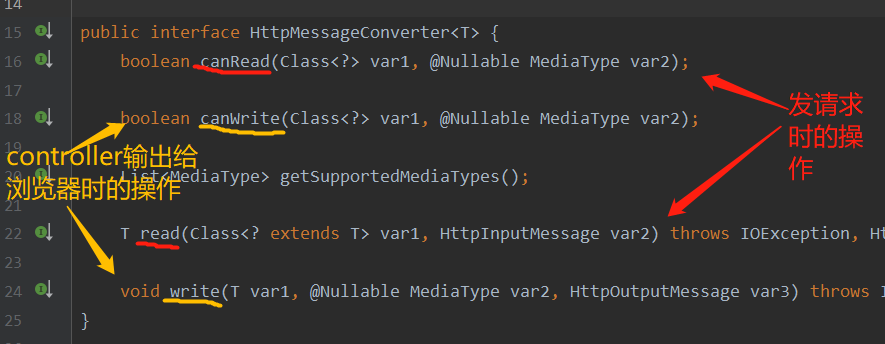

**canWrite**方法会检查处理器方法的返回值能不能转为**var2**表示的数据格式。可以转换则返回**true**。

只有当canWrite返回true时，**write**方法才会将java对象转换成var2表示的数据格式。**默认转为json**。

注解驱动加入配置文件后，会自动创建HttpMessageConverter的七个实现类对象，其中下面两个比较常见：

1. StringHttpMessageConverter：读取和写出**字符串**格式的数据
2. MappingJackson2HttpMessageConverter：读取和写入**json**格式的数据，


## 2.3 produces属性解决String乱码

前面说到String作为返回值时可以代表视图，也可以代表对象。那要如何区别这两者呢？

使用**@ResponseBody**注解。有@ResponseBody注解修饰的String是作为对象响应ajax请求的数据。

比如：

```java
@RequestMapping(value="/doStringData.do")
@ResponseBody
public String doStringData.do(){
    return "hello 我是作为数据返回的"
}
```

运行之后你会发现，后面的中文出现了乱码。我们不是设置了过滤器吗，为什么还会乱码？这是因为String作为数据响应ajax时，它不经过过滤器。那要如何解决？使用`@RequestMapping`的`produces`属性，将其的值设为`text/plain;charset=utf-8` 

```java
@RequestMapping(value="/doStringData.do", produces="text/plain;charset=utf-8")
@ResponseBody
public String doStringData(){
    return "hello 我是作为数据返回的"
}
```


## 2.4 \<url-pattern>的斜杠方式

### 2.4.1 了解tomcat默认的servlet

在学servlet的时候知道，tomcat本身可以处理静态资源的访问，比如html、图片、js文件等都是静态资源。

那么tomcat是如何处理的呢？我们先打开**tomcat目录下的conf子目录下的web.xml**。往下拉，可以看到有这样一段代码

```xml
<servlet>
    <servlet-name>default</servlet-name>
    <servlet-class>org.apache.catalina.servlets.DefaultServlet</servlet-class>
    <init-param>
        <param-name>debug</param-name>
        <param-value>0</param-value>
    </init-param>
    <init-param>
        <param-name>listings</param-name>
        <param-value>false</param-value>
    </init-param>
    <load-on-startup>1</load-on-startup>
</servlet>

<servlet-mapping>
    <servlet-name>default</servlet-name>
    <url-pattern>/</url-pattern>
</servlet-mapping>
```
根据前面的知识可以知道，这个servlet的名字为default，匹配的路径是`/`，表示这个default会匹配所有的路径。

再看看default上面的注解：这个默认的servlet是所有web应用程序的默认servlet，用于静态资源。它处理所有未映射到其他带有servlet映射的servlet。

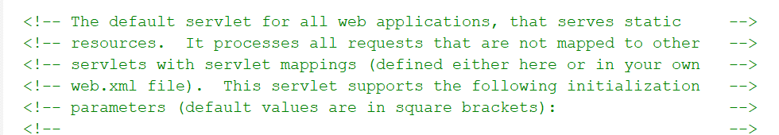

说白了，这个默认的servlet有两个作用：

1. 处理静态资源
2. 处理所有未映射到其他带有servlet映射的servlet


### 2.4.2 使用斜杠会出现的问题

当你在项目中的`<url-pattern>`使用斜杠时，它会替代tomcat中的default，导致所有的静态资源都给DispatherServlet处理，所以此时你不再可以访问静态资源。

那如果使用斜杠，要如何解决访问静态资源的问题？

解决方式有两种：

1. springmvc配置文件中加入`<mvc:default-servlet-handler>`标签。
2. 配置文件。


### 2.4.3 访问静态资源

第一种访问静态资源的方式：springmvc配置文件中加入`<mvc:default-servlet-handler>`标签。加入这个标签后，框架会创建控制器对象DefaultServletHttpRequestHandler，此对象相当于一个检查员，对进入Dispatcher的URL进行筛查，如果发现是静态资源的请求，就将该请求转发给Web应用服务器默认的servlet处理。

第二种访问静态资源的方式：springmvc配置文件中加入`<mvc:resources />` 标签，比如`<mvc:resources location="/static/" mapping="/static/**" />` 代表着符合mapping的路径都去location目录下找，其中`**`是通配符。

**tips：静态资源一般放在webapps根目录下。**

但是这两个标签都会与`@RequestMapping`注解有冲突，都需要**配合`<mvc:annotation-driven />` 注解驱动一起使用**。


## 2.5 相对、绝对、参考地址

绝对地址：带有协议名称的是绝对地址，例如`http://baidu.com` 

相对地址：不带协议名称的是相对地址，例如`user/some.do`、`/user/some.do` 。相对地址不能独立使用，必须有个参考地址，通过参考地址+相对地址拼接成一个绝对地址。

参考地址：（项目名为test）

1. 访问地址不加`/` 

   当你发起`user/some.do`请求

   访问地址变为：`https://localhost:8080/test/user/some.do` 

   此时的参考路径是`https://localhost:8080/test` 

2. 访问地址加`/` 

   当你发起`/user/some.do`请求，

   访问地址变为：`https://localhost:8080/user/some.do` 

   此时的参考路径是`https://localhost:8080` 。

> 不加斜杠，表示项目的根路径。加了斜杠，代表web服务器的根路径。

为了防止地址错误，我们可以使用**el表达式**`${pageContent.request.contextPath}`来固定项目路径，即`${pageContent.request.contextPath}/user/some.do` 。此时路径恒为`https://localhost:8080/user/some.do`。

el表达式好是好，可是需要给每个路径前都加上就很麻烦，有没有一个更便捷的方式呢？使用**`base`标签**，指定参考地址，此时该html文件中的所有相对路径都以此为参考路径。

例如：

```html
<head>
    <title>test</title>
    <base href="https://localhost:8080/test/">
</head>
```

升级版：上面的base标签固定了href，如果换个项目，href的代码就要改变，此时我们可以动态的获取项目目录。

```html
<%
	String basePath = request.getScheme()+"://"+request.getServerName()+":"+request.getServerPort()+request.getContentPath()+"/";   
%>
<head>
    <title>test</title>
    <base href="<%=basePath %>">
</head>
```


# 3. SSM整合开发

springMVC容器是管理controller控制器对象的，Spring容器是管理service、dao、工具类对象的。我们要做的是将合适的对象交给合适的容器创建和管理。

容器内的对象可以直接互相调用，但是controller要如何调用service。因为springMVC容器是Spring容器的子容器，类似继承关系，所以在controller中可以直接调用service，但不能在service中调用controller。

总结起来就是：**在service中使用dao对象进行数据库操作，在controller中使用service对象执行业务逻辑**。 


# 4. SpringMVC的核心技术

## 4.1 重定向和请求转发

首先说一下重定向和请求转发的一些区别：**重定向不携带数据，重定向是发起两次请求，而请求转发只发起一次**。

SpringMVC框架把原来servlet的请求转发和重定向进行了封装，现在可以使用简单的方式实现。

`forward`表示转发，实现`request.getRequestDispatcher().forward()` 

`redirect`表示重定向，实现`request.sendRedirect()` 

使用：

```java
// 请求转发
mv.setViewName("forword:/WEB-INF/view/show.jsp");
// 重定向
mv.setViewName("redirect:/WEB-INF/view/show.jsp");
```

**tips：** 

1. 这两个请求都不能与视图解析器一起使用，即需要写出完整路径。
2. 重定向不能访问`/WEB-INF` 资源

重定向是两次请求，所以`mv.addObject()`之后进行重定向是获取不到数据的，但框架会自动在第二次请求时把参数放在地址栏中，所以我们可以获取地址栏的参数来获取数据，比如`${param.name}`。


## 4.2 统一异常处理

使用AOP的思想，异常的抛出与业务逻辑完全可以分离开来。在springMVC中使用两个注解来实现统一的异常处理。

1. 创建一个普通类，作为全局异常处理类，加上`@ControllerAdvice`  

2. 在类中定义方法，方法的上面加入`@ExceptionHandler(value = 异常名.class)`  

   ```java
   @ControllerAdvice
   public class GlobalExceptionHandler{
       /*
       	处理异常方法跟处理器方法的定义一样，可以有多个参数，不同的返回值。
       		形参：Exception表示controller中抛出的异常对象
       	@ExceptionHandler(value=异常名.class)表示发送此类型异常时由该方法处理
       */
       @ExceptionHandler(value=NameException.class)
       public ModelAndView doNameException(Exception ex){
           ModelAndView mv = new ModelAndView();
           mv.addObject("ex", ex);
           mv.setViewName("Error");
           return mv;
       }
       // 不声明value则表示找不到指定异常的都交由该方法执行
       @ExceptionHandler
       public ModelAndView doAllException(Exception ex){
           ModelAndView mv = new ModelAndView();
           mv.addObject("ex", ex);
           mv.setViewName("Error");
           return mv;
       }
   }  
   ```

   如果需要获取到异常的信息，可以使用`${ex.message}` 

3. 在配置文件中声明`@ControllerAdvice`所在的包名和注解驱动


## 4.3 拦截器

拦截器跟过滤器类似，可以拦截用户的请求，做请求判断处理，比如用户登录处理，权限检查，日志记录等。拦截器是全局的，可以对多个controller进行拦截。

在springMVC中，拦截器需要实现`HandlerInterceptor`接口。该接口有三个方法，这三个方法的执行时间分别是**请求处理之前（controller方法执行之前）**、**控制器方法执行之后**、**请求处理完成**。

在框架中实现拦截器的步骤：

1. 创建类实现`HandlerInterceptor`接口，并实现接口中三个方法的任意个方法
2. 配置文件中指定拦截器的URI地址.


`HandlerInterceptor`接口的源码：

```java
package org.springframework.web.servlet;

import javax.servlet.http.HttpServletRequest;
import javax.servlet.http.HttpServletResponse;
import org.springframework.lang.Nullable;

public interface HandlerInterceptor {
    default boolean preHandle(HttpServletRequest request, HttpServletResponse response, Object handler) throws Exception {
        return true;
    }

    default void postHandle(HttpServletRequest request, HttpServletResponse response, Object handler, @Nullable ModelAndView modelAndView) throws Exception {
    }

    default void afterCompletion(HttpServletRequest request, HttpServletResponse response, Object handler, @Nullable Exception ex) throws Exception {
    }
}
```

**preHandle** 为预处理方法，即在请求之前进行拦截。在此方法中可以进行登录及权限验证。

参数`Object handler` 为被拦截的控制器对象。

返回值`boolean` 为true时拦截器才会放行该请求，否则请求中断。


**postHandle** 为后处理方法，即在控制器方法执行之后拦截。该方法中可以修改控制器中的ModelAndView。

参数`Object handler` 为被拦截的控制器对象；`ModelAndView modelAndView`为控制器方法的返回值。


**afterCompletion** 是请求处理完成之后执行的方法，即渲染完成后，一般做资源回收工作的。

参数`Object handler` 为被拦截的控制器对象；`Exception ex` 为程序中的异常对象。

***

配置文件中声明拦截器方式：

```xml
<!--  声明拦截器  -->
<mvc:interceptors>
    <!--  声明第一个拦截器  -->
    <mvc:interceptor>
        <!--  指定第一个拦截器要拦截的uri地址
              **为通配符，表示任意的字符、文件或多级目录
        -->
        <mvc:mapping path="/user/**"/>
        <!--  拦截器对象  -->
        <bean class="Interceptor.MyInterceptor"/>
    </mvc:interceptor>
</mvc:interceptors>
```

假设给拦截器的三个方法跟控制器方法都加了输出语句，下面来看看他们四个的先后输出顺序：

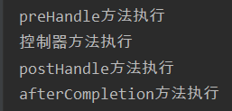

假设有两个拦截器同时对一个uri进行拦截呢，会发生什么？（**preHandle都返回true**）

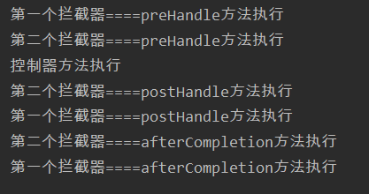

其流程如下图所示：

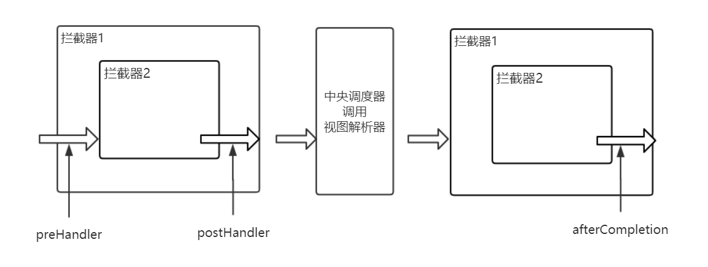

假设有两个拦截器同时对一个uri进行拦截呢，会发生什么？（**第一个拦截器的preHandle都返回true，第二个返回false**）

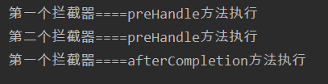

假设有两个拦截器同时对一个uri进行拦截呢，会发生什么？（**第一个拦截器的preHandle都返回false，第二个返回true**）

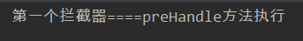


4.4 拦截器与过滤器的区别
---

1. 过滤器实现Filter接口，拦截器实现HandlerInterceptor接口。
3. 过滤器侧重于数据过滤。拦截器用来验证请求的。
4. 过滤器在拦截器之前执行。
5. 过滤器是tomcat创建的对象，拦截器是框架创建的对象。


总结
===

SpringMVC执行流程示意图：

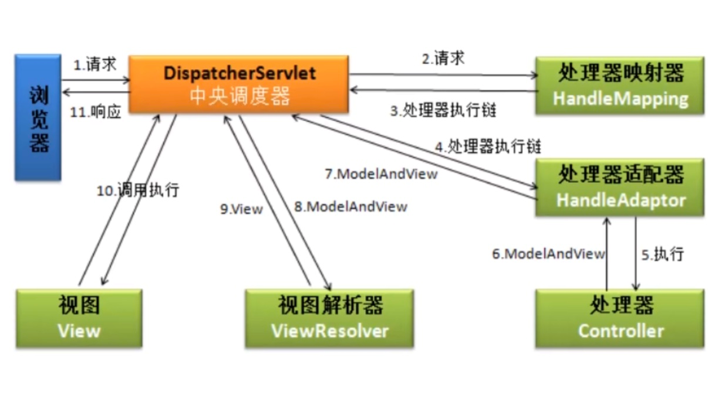

流程分析：

1. 浏览器提交请求到中央调度器。

2. 中央调度器直接将请求转给**处理器映射器HandleMapping**。

3. 处理器映射器根据请求找到处理该请求的处理器handler，并将其封装成**处理器执行链HandlerExecutionChain** 并返回给中央调度器。

   - 处理器执行链 中保存着`处理器对象`跟`针对该对象的拦截器`。

4. 中央调度器根据处理器执行链中的处理器，找到能够执行该处理器的**处理器适配器HandleAdaptor**。

5. 处理器适配器调用处理器，执行controller中的某个方法。

6. 处理器将处理结果及要跳转的视图封装到一个对象**ModelAndView**中，并将其返回给适配器

7. 适配器将结果返回给调度器。

8. 调度器调用**视图解析器**，将ModelAndView中的视图名封装成视图对象**View**。

   View是一个接口，在框架中，是用View跟其实现类来表示视图的。

   `mv.setViewName("show");` 等价于 `mv.setView(new InternalResourceView("/WEB-INF/view/show.jsp"));`

9. 视图解析器将封装好的**视图对象View**返回给调度器。

10. 调度器调用视图对象，让其自己进行渲染，即进行数据填充，形成响应对象。

11. 调度器响应浏览器


