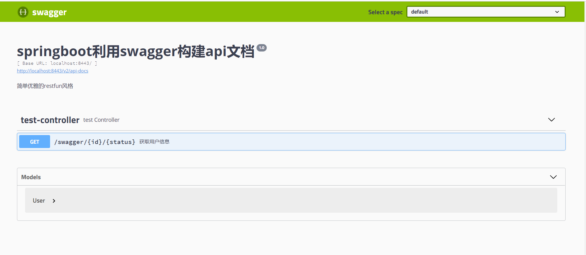
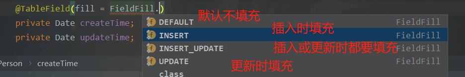
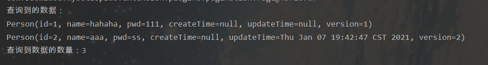

SpringBoot学习
===

## 1. SpringBoot介绍

#### 特点

springBoot内嵌了服务器比如tomcat（默认）、Undertow、Jetty，提供了starter依赖（将同类的依赖整合在一个依赖中）。

自己不用管依赖的版本

#### 环境准备

jdk1.8+ 、 maven3.x

#### HelloSpringBoot

##### maven创建

创建SpringBoot项目时，只需要添加几个依赖即可完成搭建SSM项目的大部分工作。

1. ```xml
   <parent>
       <groupId>org.springframework.boot</groupId>
       <artifactId>spring-boot-starter-parent</artifactId>
       <version>2.4.0</version>
   </parent>
   ```

2. 添加starter依赖
   
   ```xml
   <!-- starter  是众多依赖的集合 -->
   <dependencies>
       <dependency>
           <groupId>org.springframework.boot</groupId>
           <!-- web项目的注解 -->
           <artifactId>spring-boot-starter-web</artifactId>
       </dependency>
   </dependencies>
   ```

3. 编写测试文件
   
   ```java
   package controllers;
   
   import org.springframework.boot.SpringApplication;
   import org.springframework.boot.autoconfigure.SpringBootApplication;
   import org.springframework.web.bind.annotation.RequestMapping;
   import org.springframework.web.bind.annotation.RestController;
   
   @SpringBootApplication
   @RestController  // @Controller跟@ResponseBody的结合
   public class test {
   
       @RequestMapping("/")
       String home() {
           return "Hello World!";
       }
   
       public static void main(String[] args){
           // 启动spring ioc容器，得到的是Application对象，可以使用该对象进行一些容器的设置
           SpringApplication.run(test.class, args);
       }
   }
   ```

接着你运行项目，用浏览器访问`localhost:8080/`就可以访问到页面。相对于SpringMVC而言省了很多步骤。

那么问题来了，以前可以在tomcat设置中修改端口号的，现在样修改端口号？

在resources下创建配置文件`application.properties`，加上`server.port = 端口号` 。

> tips：配置文件名必须为application

##### Spring Initializr

idea有一种方式可以快速的创建spring项目，自动添加依赖，一些必要模块等。


#### 启动配置

1. 我们可以在配置文件中，对容器进行一些配置。
   
   ```properties
   spring.main.banner-mode = off  #关闭logo
   spring.main.web-application-type = none # none表示java项目，servlet表示web项目，reactive表示react项目
   ```

2. 在主类上面加入 `@ImportResource(locations = “路径”)` 注解可以导入xml文件的配置。
   
   比如有个工程是要新老项目结合的，老项目用的是xml配置文件的方式，而新项目是使用注解的方式，那么可以使用该注解将老项目的配置文件导入进去。

> spring.main.web-application-type 表示 spring项目的类型，有**三种**：none（java项目）、servlet（web项目）、reactive（react项目）

#### 项目打包

在SSM项目中，如果你要发布项目则需要将其打包成war包，而SpringBoot可以将其打包成jar包。步骤如下：

1. 添加插件
   
   ```XML
   <build>
       <plugins>
           <plugin>
               <groupId>org.springframework.boot</groupId>
               <artifactId>spring-boot-maven-plugin</artifactId>
           </plugin>
       </plugins>
   </build>
   ```

2. 在项目根目录中使用`mvn clean package` 命令进行打包

#### starter

starter相当于一个**jar包**，需要使用时直接在maven中引入该starter坐标即可，**starter里面设置了一些默认的配置信息**，springboot启动时会自动的将该配置类中注册的bean放到IOC容器中，并且如果我们需要修改配置文件的内容可以在springboot的配置文件中进行修改。

如果一个自定义配置类经常需要在别的项目中使用，那么可以将该自定义配置类封装成一个starter，然后其他项目中直接引入坐标即可，这样可以很好的提高复用性。

> starter等价于 配置文件 + 自动注册bean

官方所有的starter的命名都遵从`spring-boot-starter-*`，如果自定义starter建议使用`自定义名称-spring-boot-starter` 。

#### 自定义starter

除了一些官方提供的starter，我们也可以自定义starter来封装一些需要经常**复用的自定义的配置类**。

自定义starter有几个步骤：

1. 创建一个空项目，里面创建两个模块；其中一个作为**启动器**，只负责引入自定义starter；另一个负责设置自动配置的信息，引入需要的依赖等操作。
2. 在第一个模块中引入第二个模块的依赖。
3. 在第二个模块中：
   1. 引入自动配置依赖
   2. 定义实体类，用于映射配置信息（跟用户交互），提供setter和getter方法
   3. 定义service类 操作实体类。
   4. 定义一个 配置类，用于注册bean对象（实体类以及service）
   5. 在`META-INF/spring.factories` （手动创建）下指定 **配置类** 的路径

> 其实第二个模块才是真正的自定义starter，第一个模块只是负责引入自定义starter，方便管理

***

第一步：创建一个空项目，在里面创建一个maven项目跟springboot项目


第二步：在第一个项目（作为启动器）中引入第二个springboot项目（自动配置项目）

```xml
<dependencies>
    <dependency>
        <groupId>com.example</groupId>
        <artifactId>hello-springboot-starter-autoconfigure</artifactId>
        <version>0.0.1-SNAPSHOT</version>
    </dependency>
</dependencies>
```

第三步：在自动配置项目中清除不需要用到的文件（如主类、配置文件、依赖等）

3.1 引入自动配置依赖

```xml
<dependency>
    <groupId>org.springframework.boot</groupId>
    <artifactId>spring-boot-configuration-processor</artifactId>
    <optional>true</optional>
</dependency>
```

3.2 定义实体类，用于映射配置信息，提供setter和getter方法

```java
package com.example.entity;

import org.springframework.boot.context.properties.ConfigurationProperties;

@ConfigurationProperties(prefix = "hello")
public class Hello {
    private String welcome;
    private String address;

    // setter跟getter
}
```

3.3 定义service类 操作实体类

```java
package com.example.service;

import com.example.entity.Hello;
import org.springframework.beans.factory.annotation.Autowired;

public class HelloService {

    @Autowired
    Hello hello;

    public String sayHello(){
        return hello.getWelcome() + "来到" + hello.getAddress();
    }
}
```

3.4 定义一个 配置类，用于注册bean对象（实体类以及service）

```java
package com.example.config;

import com.example.entity.Hello;
import com.example.service.HelloService;
import org.springframework.boot.autoconfigure.condition.ConditionalOnMissingBean;
import org.springframework.boot.context.properties.EnableConfigurationProperties;
import org.springframework.context.annotation.Bean;
import org.springframework.context.annotation.Configuration;

@Configuration // 表示这是一个配置类
@ConditionalOnMissingBean(HelloService.class) // 如果HelloService不存在才这个配置类才生效
@EnableConfigurationProperties(Hello.class) // 注册Hello
public class HelloAutoConfiguration {

    @Bean
    public HelloService helloService(){
        return new HelloService();
    }
}
```

> 如果需要条件判断，满足条件时才加载该配置类，可以使用`@Conditional` 注解。

3.5 在resources目录下 创建 `META-INF/spring.factories` 文件，指定配置类的路径，key是固定的，value为配置类的路径


```java
org.springframework.boot.autoconfigure.EnableAutoConfiguration=\
com.example.config.HelloAutoConfiguration
```

至此，自定义starter已经完成了，接下来需要先把这两个通过maven `install` 到本地仓库。注意：**要先install自动配置项目，再install启动器项目**。


然后在项目中引入 **启动器的依赖** ，在springbot的配置文件中修改属性即可。


创建controller：


#### 默认扫描器 basepackage

在springMVC中，需要在配置文件中使用组件扫描器告诉MVC去哪些包创建controller。那我们SpringBoot项目啥都没做，为啥就可以访问到呢？

因为 springboot的主启动类所在的package就是扫描器默认扫描的包。spring官方文档建议我们将`@SpringBootApplication` 放在主启动类上。

推荐的项目结构：

```java
com
 +- example
     +- myapplication
         +- Application.java (主启动类)
         |
         +- customer
         |   +- Customer.java
         |   +- CustomerController.java
         |   +- CustomerService.java
         |   +- CustomerRepository.java
         |
         +- order
             +- Order.java
             +- OrderController.java
             +- OrderService.java
             +- OrderRepository.java
```

#### 热部署

在之前开发SSM项目时，只要你修改了代码，就需要重新手动重启服务器才可以看见改动的效果，很影响开发效率。在SpringBoot中提供了开发者工具`spring-boot-devtools`，可以让开发人员实现具有热部署功能的服务器.

实现步骤：（IDEA编译器为例）

1. 在`pom.xml`文件中加入相关的maven依赖
   
   ```xml
   <dependencies>
       <dependency>
           <groupId>org.springframework.boot</groupId>
           <artifactId>spring-boot-devtools</artifactId>
           <optional>true</optional>
       </dependency>
   </dependencies>
   ```

2. File → Settings → Compiler → Build Project AutoMatically

3. 按`ctrl + shift + alt + /` ，选择`Registry`， 勾上`Compiler autoMake allow when app running` 

开发者工具只有当`classpath`下的文件发生改变时，才会自动重启。当它以一个jar包形式启动项目的话，热部署会失效。

在springboot中，重启技术是通过两个类加载器（classloader）来实现的，分别是`base classloader`和`restart classloader` .

- base classloader：专门加载**不改变**的类，例如第三方包
- restart classloader：专门加载会**改变**的类，例如自己编写的类

当应用被重启时，实际是restart classloader在工作。很明显，springboot为了使开发更高效做了很多的事情，将不需要重新加载的单独放在一边，只加载会改变的class。但是这还不够，很多时候某种资源是不需要加载到`restart classloader` ，例如Thymeleaf、静态文件等。springboot也考虑到了这些，默认classpath下的`META-INF/maven`、`META-INF/resources`、`/resources`、`/static`、`/public` 等目录不会触发重启器，但是会触发`live load`。

我们开发人员也可以手动指定哪些资源是不被加载到`restart classloader`中的，在配置文件中使用`spring.devtools.restart.exclude=目录` 代码来进行排除。

> tips：
> 
> 1. 开发者工具包括一个嵌入式live load服务器，该服务器可用于在更改资源时触发浏览器刷新，即资源改变时浏览器会自动刷新。
> 2. 静态资源放在resources目录下的static目录下。

### springboot项目部署方式

### springboot启动流程


### springboot启动方式

jar包跟war包的区别：

- **jar包**（Java Application Archive）：java普通项目打包，通常是开发时要引用通用类，打成jar包便于存放管理。当你使用某些功能时就需要这些jar包的支持，需要导入jar包。

- **war包**（Web Application Archive）：java web项目打包，web网站完成后，打成war包部署到服务器，以Tomcat来说，将war包放置在Tomcat\webapps\目录下，然后启动Tomcat，这个包就会自动解压，就相当于发布了。

springboot项目部署有两种：**内置Tomcat启动（jar包）**和**外部tomcat启动（war包）**。

- 内置Tomcat启动：直接通过内置Tomcat运行，不需要额外安装Tomcat。如需修改内置Tomcat的配置，只需要在SpringBoot的配置文件中配置。内置Tomcat没有自己的日志输出，全靠jar包应用输出日志。但是比较方便，快速，比较简单。
  
  - 需要在pmo.xml中指定maven插件后才可以使用java -jar命令运行。
    
    ```xml
    <plugin>
      <groupId>org.springframework.boot</groupId>
      <artifactId>spring-boot-maven-plugin</artifactId>
    </plugin>
    ```

- 外部tomcat启动：传统的应用交付方式，需要安装Tomcat，然后放到wabapps目录下运行war包，可以灵活选择Tomcat版本，可以直接修改Tomcat的配置，有自己的Tomcat日志输出，可以灵活配置安全策略，相对打成jar包来说没那么快速方便。
  
  - 启动类需要继承SpringBootServletInitializer类
  
  - 修改**pom.xml**文件，添加`<packaging>war</packaging>` 节点
  
  - 将内置Tomcat的作用范围修改成provided
    
    ```xml
    <dependency>
       <groupId>org.springframework.boot</groupId>
       <artifactId>spring-boot-starter-tomcat</artifactId>
       <scope>provided</scope>
    </dependency>
    ```

### 为什么SpringBoot的jar包可以直接运行？

原因：

1. springboot提供了一个spring-boot-maven-plugin插件用于把程序打包成一个jar包。

2. SpringBoot打成的jar包叫做Fat jar（jar包中包含jar包），包含了应用依赖的jar包和SpringBoot 加载的相关类，目录如下：
   
   ```java
   spring-boot-learn-0.0.1-SNAPSHOT
   ├── META-INF
   │   └── MANIFEST.MF
   ├── BOOT-INF
   │   ├── classes
   │   │   └── 应用程序类
   │   └── lib
   │       └── 第三方依赖jar
   └── org
       └── springframework
           └── boot
               └── loader
                   └── springboot启动程序
   ```

3. java -jar会去找jar包中的manifest文件，在此文件中找到启动类。MANIFEST.MF文件内容如下：
   
   ```java
   Manifest-Version: 1.0
   Implementation-Title: spring-learn
   Implementation-Version: 0.0.1-SNAPSHOT
   Start-Class: com.tulingxueyuan.Application  // 自己应用的Main函数
   Spring-Boot-Classes: BOOT-INF/classes/
   Spring-Boot-Lib: BOOT-INF/lib/
   Build-Jdk-Spec: 1.8
   Spring-Boot-Version: 2.1.5.RELEASE
   Created-By: Maven Archiver 3.4.0
   Main-Class: org.springframework.boot.loader.JarLauncher  // 这个是jar启动的Main函数
   ```

4. Fat jar的启动类是JarLauncher，它负责创建一个LaunchedURLClassLoader来加载/lib下面的jar包，并开启一个新线程启动应用的Main函数(Start-Class)。

> **JarLauncher**通过加载BOOT-INF/classes目录及BOOT-INF/lib目录下jar文件，实现了fat jar的启动。
> 
> **WarLauncher**通过加载WEB-INF/classes目录及WEB-INF/lib和WEB-INF/lib-provided目录下的jar文件，实现了war文件的直接启动及web容器中的启动。

### 外部tomcat启动原理

使用外部tomcat运行SpringBoot项目时，需要继承SpringBootServletInitializer。

首先看一下SpringBootServletInitializer的类，它里面有个**onStartup**方法：

```java
@Override
public void onStartup(ServletContext servletContext) throws ServletException {

   WebApplicationContext rootApplicationContext = createRootApplicationContext(servletContext);

   if (rootApplicationContext != null) {
      servletContext.addListener(new SpringBootContextLoaderListener(rootApplicationContext, servletContext));
   }
   else {
      this.logger.debug("No ContextLoaderListener registered, as createRootApplicationContext() did not "
            + "return an application context");
   }
}
```

所有逻辑都在createRootApplicationContext()方法中，继续追进去。

```java
protected WebApplicationContext createRootApplicationContext(ServletContext servletContext) {
   // 创建SpringApplicationBuilder来整合一些配置项，然后生成SpringApplication
   SpringApplicationBuilder builder = createSpringApplicationBuilder();
   // 指定继承了SpringBootServletInitializer的类作为主类
   builder.main(getClass());

   ApplicationContext parent = getExistingRootWebApplicationContext(servletContext);

   if (parent != null) {
      this.logger.info("Root context already created (using as parent).");
      servletContext.setAttribute(WebApplicationContext.ROOT_WEB_APPLICATION_CONTEXT_ATTRIBUTE, null);
      builder.initializers(new ParentContextApplicationContextInitializer(parent));
   }
   builder.initializers(new ServletContextApplicationContextInitializer(servletContext));
   builder.contextFactory((webApplicationType) -> new AnnotationConfigServletWebServerApplicationContext());

   // 配置应用程序，主要是获取主类上面的元信息
   builder = configure(builder);
   builder.listeners(new WebEnvironmentPropertySourceInitializer(servletContext));

   // 熟悉的SpringApplication，项目中启动类main方法中也是用这个类调用run方法启动项目
   SpringApplication application = builder.build();

   if (application.getAllSources().isEmpty()
         && MergedAnnotations.from(getClass(), SearchStrategy.TYPE_HIERARCHY).isPresent(Configuration.class)) {
      application.addPrimarySources(Collections.singleton(getClass()));
   }

   // 调用SpringApplication.run方法启动项目。 
   return run(application);
}
```

> 为什么有的方式不用重写Configure方法，有些方式要重写呢？
> 
> 查看到builder.main(getClass());这行代码时可以发现，默认以继承SpringBootServletInitializer的类作为主类。所以你如果在SpringBoot的启动类上继承SpringBootServletInitializer的话就无需重写Configure，否则需要重写。

onStartup方法主要是进行自动配置，创建Spring容器等操作。那么onStartup方法是什么时候回调的呢？

为了可以不使用web.xml，servlet提供过了的`ServletContainerInitializer`接口，通过实现WebApplicationInitializer，在其中可以添加servlet，listener等，它通过SPI机制，当启动web容器的时候，会自动到项目所有jar包下找到`META-INF/services`下以**ServletContainerInitializer**的全路径名称命名的文件，它的内容是ServletContainerInitializer实现类的全路径，然后容器根据全路径名称将它们实例化。

例如Spring项目启动时会加载spring-web的`META-INF/services`下的ServletContainerInitializer的实现类：

> 这也是为什么SpringBoot项目要引入spring-web依赖的原因。


进入SpringServletContainerInitializer类后可看到：

```java
@HandlesTypes(WebApplicationInitializer.class)
public class SpringServletContainerInitializer implements ServletContainerInitializer {

   @Override
   public void onStartup(@Nullable Set<Class<?>> webAppInitializerClasses, ServletContext servletContext)
         throws ServletException {
       // 遍历Set，将需要用到的WebApplicationInitializer的实现类放在list中
       // 对list进行升序排序（根据类上的Order注解的值）
       // 对排序后的list的元素都调用onStartup方法 -- 创建spring容器、mvc的中央调度器等
      }
}
```

`@HandlesTypes`注解由Servlet容器提供支持（实现），参数中指定的**所有**实现类，传给回调方法onStartup的第一个参数。所以`@HandlesTypes(WebApplicationInitializer.class)` 是将WebApplicationInitializer接口的**所有**实现类放到set集合中传给onStartup的第一个参数。

WebApplicationInitializer接口的所有实现类如下图：

- AbstractDispatcherServletInitializer类的onStartup方法会创建**Spring容器**和**SpringMVC的中央调度器**。
- SpringBootServletInitializer类的onStartup方法会进行**自动装配，然后启动Spring容器**。

**tips**：SpringBootServletInitializer的优先级高，因为它的order值最小，所以SpringBootServletInitializer会在list的最前面。


至此，SpringBoot甚至是Spring的启动过程都明白了。tomcat启动web项目时，会通过SPI机制，加载spring-web包的ServletContainerInitializer的实现类，然后该实现类中会加载所有WebApplicationInitializer的实现类，并过滤掉无效的实现类，对他们排序后一次调用他们的onStartup，在此方法中会进行各自的操作，比如创建Spring容器、SpringMVC的中央调度器、以及完成自动装配等操作。

所以说如果使用外部tomcat运行SpringBoot项目时，需要继承SpringBootServletInitializer。


### 自动配置流程

springboot会基于你添加的jar包依赖，尝试自动配置你的spring项目。

springboot会加载`@EnableAutoConfiguration` 下的配置，而此注解import了选择器类`AutoConfigurationImportSelector` ，这个选择器会扫描所有在 `META-INF 下的 spring.factorites` ，所有的自动配置类都在这里，只有符合`@ConditionalOnXxx` 条件的才会被加载，形成beandefinition，然后被创建放入到IOC容器中，形成一个个的bean对象。

> 因为springboot的自动配置是spring的扩展功能，所以会在spring的BeanFactoryPostProcessor中实现。
> 
> springboot会将所有用到的自动配置类输出到一个总的配置文件中。

## 2. 属性配置文件

#### 配置文件位置

springboot启动时会扫描以下位置（**优先级由高到低**）的`application.properties`或者`application.yml`文件作为springboot的默认配置文件。

1. 项目**根目录**下的**config目录**（如果有父工程则要放在父工程的根目录下）
2. 项目**根目录**（如果有父工程则要放在父工程的根目录下）
3. **resources目录**下的**config目录** 
4. **resources目录** 

springboot会从这四个位置加载配置文件。这四个位置的配置文件会进行互补配置，若出现相同的配置 高优先级 会覆盖 低优先级。

如果想 自定义配置文件名 或 配置文件 的路径，可以这样做：（假设我的配置文件名为cf.properties）

第一步：打开项目运行配置


第二步：输入`--spring.config.name=配置文件名` 参数。如果想指定路径则使用`--spring.config.location=路径/配置文件名` 


#### yml

yml是YAML语言的文件，以数据为中心。相比于xml少了一些结构化代码，相比于properties更加简洁。

语法：**以任意空格缩进程度表示层级关系** 且 **冒号后面要有一个空格**。大小写敏感。

- 字符串不需要加引号，yml会自动转义，若加双引号则会取消转义。
- 数组类型，可以是`[]`也可以是`-` 
- 对象类型，类似于多层级。
- 布尔类型、数值、日期的写法与不带引号的字符串一致。

**案例**：

proterties文件

```properties
env.t1.name=aa
env.t1.age=18
env.t2.name=bbb
env.t2.age=22
```

yml文件

```yml
env:
  t1:
    name: aa
    age: 18
  t2:
    name: bb
    age: 22
```

**小补充：yml也支持spEL表达式**。

```yml
acme:
 remote-address: 192.168.0.110
 host: ${acme.remote-address}:8080  # 192.168.0.110:8080
```

#### @ConfigurationProperties属性绑定

1. 添加所需依赖
   
   ```xml
   <!--  使yml配置文件有提示  -->
   <dependency>
       <groupId>org.springframework.boot</groupId>
       <artifactId>spring-boot-configuration-processor</artifactId>
       <optional>true</optional>
   </dependency>
   
   <!--  自动生成getter、setter  -->
   <dependency>
       <groupId>org.projectlombok</groupId>
       <artifactId>lombok</artifactId>
       <version>1.18.2</version>
   </dependency>
   ```

2. 创建要绑定的bean
   
   ```java
   package com.model;
   
   import lombok.Data;
   import org.springframework.boot.context.properties.ConfigurationProperties;
   import org.springframework.stereotype.Component;
   
   @Data // 自动生成getter、setter
   @Component // 创建对象后将对象加到IOC容器中
   // 自动绑定属性，参数prefix表示层级，可省略
   @ConfigurationProperties(prefix = "yml.t1")
   public class YmlModel {
       private String name;
       private int age;
       private School school = new School();
   
       // 如果有内部类，则内部类也要有@Data注解
       @Data
       class school{
           private String addr;
       }
   }
   ```

3. 编写配置文件
   
   ```yml
   yml:
     t1:
       name: aa
       age: 22
   ```

4. 编写tontroller
   
   ```java
   package com.controller;
   
   import com.model.YmlModel;
   import org.springframework.beans.factory.annotation.Autowired;
   import org.springframework.boot.context.properties.EnableConfigurationProperties;
   import org.springframework.web.bind.annotation.RequestMapping;
   import org.springframework.web.bind.annotation.RestController;
   
   @RestController
   public class MyController {
   
       @Autowired
       public YmlModel ymlModel;
   
       @RequestMapping("/")
       YmlModel home() {
           return ymlModel;
       }
   }
   ```

5. 编写启动类
   
   ```java
   package com;
   
   import org.springframework.boot.SpringApplication;
   import org.springframework.boot.autoconfigure.SpringBootApplication;
   
   @SpringBootApplication
   class test {
       public static void main(String[] args){
           SpringApplication.run(test.class, args);
       }
   }
   ```

> 1. 在属性类中，即在**ConfigurationProperties**的类，前缀不可以使用驼峰模式，只能用羊肉串模式（以 `-` 连接的），但是在xml中可以用驼峰模式。
> 
> 2. 所有具有**ConfigurationProperties**注解的类都会生成一个json文件，用于存放配置
>    
>    

#### @EnableConfigurationProperties

`@EnableConfigurationProperties` 注解是使 `@ConfigurationProperties` 注解的类生效，即将指定类注入IOC容器中。等同于 `@Component` 。

语法：`@EnableConfigurationProperties(类名.class)` 

bean类中取消Component注释，在controller中添加**EnableConfigurationProperties**注释

案例1：**自动注入方式** 

```java
package com.controller;

import com.model.YmlModel;
import org.springframework.beans.factory.annotation.Autowired;
import org.springframework.boot.context.properties.EnableConfigurationProperties;
import org.springframework.web.bind.annotation.RequestMapping;
import org.springframework.web.bind.annotation.RestController;

@RestController
@EnableConfigurationProperties(YmlModel.class)
public class MyController {

    @Autowired
    public YmlModel ymlModel;

    @RequestMapping("/")
    YmlModel home() {
        return ymlModel;
    }
}
```

***

案例2：**构造方法** 

```java
package com.controller;

import com.model.YmlModel;
import org.springframework.beans.factory.annotation.Autowired;
import org.springframework.boot.context.properties.EnableConfigurationProperties;
import org.springframework.web.bind.annotation.RequestMapping;
import org.springframework.web.bind.annotation.RestController;

@RestController
@EnableConfigurationProperties(YmlModel.class)
public class MyController {

    public YmlModel ymlModel;

    public MyController(YmlModel ymlModel){
        this.ymlModel = ymlModel;
    }

    @RequestMapping("/")
    YmlModel home() {
        return ymlModel;
    }
}
```

两种方式效果一样，因为在springBoot源码中有使用这种方式来进行数据绑定，所以这里提一下。

#### @Bean

Spring的`@Bean`注解用于告诉**方法**产生一个对象，然后把该对象放入IOC容器中。产生这个对象的方法只会被spring调用一次。`@Bean `需要在配置类下使用（即有`@Configuration`注释的类），但是在springboot2.2.1版本以后可以不用手动加上`@Configuration`注释，**前提是`@Bean`所在的类会被springboot扫描到**。

```java
package com.model;

import lombok.Data;
import org.springframework.boot.context.properties.ConfigurationProperties;
import org.springframework.stereotype.Component;

@Data
@ConfigurationProperties(prefix = "yml.t1")
public class YmlModel {
    private String name;
    private int age;

}
```

```java
package com.model;

import org.springframework.context.annotation.Bean;
import org.springframework.context.annotation.Configuration;

// 因为springboot不会扫描到这个类，所以需要加上@Configuration注解
@Configuration
public class YmlModelBean {

    @Bean
    YmlModel beanTst() {
        return new YmlModel();
    }
}
```

```java
package com.controller;

import com.model.YmlModel;
import org.springframework.beans.factory.annotation.Autowired;
import org.springframework.web.bind.annotation.RequestMapping;
import org.springframework.web.bind.annotation.RestController;

@RestController
public class MyController {

    @Autowired
    public YmlModel ymlModel;

    @RequestMapping("/")
    YmlModel home() {
        return ymlModel;
    }
}
```

#### @Validated属性校验

在进行属性绑定的同时我们还可以对绑定的值进行校验，如判空、设置最大值等。

1. 加入maven依赖
   
   ```xml
   <dependency>
       <groupId>org.hibernate</groupId>
       <artifactId>hibernate-validator</artifactId>
       <version>5.4.2.Final</version>
   </dependency>
   ```

2. 在类上加`@Validated`注解告诉springboot这个类为校验类。在需要校验的属性上加具体校验注解
   
   ```java
   package com.model;
   ```

import lombok.Data;
import org.springframework.boot.context.properties.ConfigurationProperties;
import org.springframework.stereotype.Component;
import org.springframework.validation.annotation.Validated;
import javax.validation.Valid;
import javax.validation.constraints.Max;
import javax.validation.constraints.NotNull;

@Data
@Component
@ConfigurationProperties("yml.t1")
@Validated
public class YmlModel {
    @NotNull
    private String name;

    @Max(value = 32, message = "年龄太大了")
    private int age;
    
    // 【注意】引用类型需要使用Valid注解来声明
    @Valid
    private School school = new School();
    
    @Data
    class School {
        @NotNull
        private String addr;
    }

}

```
其实`@Valid` 和 `@Validated` 的作用差不多，只不过`@Validated`不能够作用在属性上。

***

常用注解如下：
```

@AssertFalse 校验false
@AssertTrue 校验true
@DecimalMax(value=, inclusive=) 最大值为value，inclusive=true表示可以等于
@DecimalMin(value=, inclusive=) 与上类似
@Max(value=) 最大值value
@Min(value=) 最小值value
@NotNull  不允许为Null
@Past  检查日期
@Email 检查邮箱地址
@Pattern(regex=,flag=)  正则

```
#### @Value作用于数据绑定

之前使用的`@ConfigurationProperties`注释是一次性对全部属性进行绑定。而`@Value`注解则是作用于单个属性。**该属性的类型不能是复杂类型**，比如List、引用类型。另外，**`@Value`注解绑定的属性无法进行校验**。但其支持 使用SpEL表达式赋值。

语法：`@Value(value = "${}")` 

案例：

```java
package com.model;

import lombok.Data;
import org.springframework.beans.factory.annotation.Value;
import org.springframework.boot.context.properties.ConfigurationProperties;
import org.springframework.stereotype.Component;

@Data
@Component
public class ValueModel {

    @Value(value = "${yml.t1.name}")
    private String name;
    @Value("#{12*3}") // 使用SpEL表达式赋值
    private int age;
    //  @Value不能用于复杂类型
    private School school = new School();

    @Data
    class School {
        private String addr;
    }

}
```

#### 不同环境的配置文件

开发环境与发布环境往往都有着不同的配置，如果混在一起则改动起来比较麻烦。所以我们需要用一个方式来进行区别。

在yml文件中，使用`---` 来进行分块。

```yml
# 开发环境
yml:
  t1:
    name: aa
    age: 30
    School:
      addr: 广州市大学城
spring:
  config:
    activate:
      on-profile: dev  # 指定该块的名字dev
---
# 部署环境
yml:
  t1:
    name: nn
    age: 18
    School:
      addr: 黑盒红
spring:
  config:
    activate:
      on-profile: pro   # 指定该块的名字为pro
```

激活某一块的配置有几种方式：

1. 在配置文件中直接指定
   
   ```yml
   spring:
     profiles:
       active: dev
   ---
   # 开发环境
   ---
   # 部署环境
   ```

2. 参数形式（优先级高）：打开项目配置 ===》输入命令`-Dspring.profiles.active=名字` 
   
   
   
   

***

上面是将不同环境的配置都整合在一个文件里。而当项目大起来的时候，每个配置文件的内容都会很多，所以我们往往会将不同环境的配置文件分离出来形成单独的配置文件，然后使用**参数传递的方式来指定配置文件**。

首先，我们需要对文件名进行规范化，即将配置文件名改成`application-名字` ，然后使用参数传递。

比如：

**application-dev.yml** 内容如下：

```yml
# 开发环境
yml:
  t1:
    name: aa
    age: 30
    School:
      addr: 广州市大学城
```

**application-pro.yml** 内容如下：

```yml
# 部署环境
yml:
  t1:
    name: nn
    age: 18
    School:
      addr: 黑盒红
```

## 3.springboot数据源自动配置

#### 数据源自动配置

下面进行数据库方面的学习。

首先思考一下，我们前面写的配置文件都是自己定义的，而springBoot自己帮我们写好了配置文件的配置信息，我们只需要在配置文件中填写好需要的配置信息即可。连接数据库也是如此。

首先看一下springboot中数据库连接的源码：


进入`DataSourceProperties.class`查看源码：


***

所以，我们需要在配置文件中使用spring.datasource的前缀进行配置：

```yml
spring:
  datasource:
    url: jdbc:mysql://localhost:3306/jdbc_demo
    driver-class-name: com.mysql.cj.jdbc.Driver
    username: root
    password: root
```

除此之外，我们还需要在项目的主配置文件中加入一些必要的依赖：

```xml
<!-- jdbc依赖 -->
<dependency>
    <groupId>org.springframework.boot</groupId>
    <artifactId>spring-boot-starter-jdbc</artifactId>
</dependency>
<!-- mysql驱动 -->
<dependency>
    <groupId>mysql</groupId>
    <artifactId>mysql-connector-java</artifactId>
    <version>8.0.17</version>
</dependency>
```

#### 敏感信息加密 jasypt

资源文件中的内容通常情况下是明文显示，安全性就比较低一些。比如mysql登陆密码，redis登陆密码以及第三方的密钥等等。而我们可以使用**jasypt**加解密组件，提高一些属性配置的安全性。

1. pom文件中增加依赖：
   
   ```xml
   <!--  加密依赖  -->
   <dependency>
       <groupId>com.github.ulisesbocchio</groupId>
       <artifactId>jasypt-spring-boot-starter</artifactId>
       <version>3.0.3</version>
   </dependency>
   ```

2. 在配置文件中设置密钥
   
   ```yml
   jasypt:
     encryptor:
       # 私钥，用它来加解密
       password: codekiang
   ```

3. 编写测试类生成加密后的文字
   
   ```java
   @RestController
   public class IndexController {
   
       @Autowired
       private StringEncryptor encryptor;
   
       /**
        * 测试jasypt加密解密
        */
       @GetMapping("/jasypt")
       public void testJasypt() {
           String pwd = "root";
           String encryptPwd = encryptor.encrypt(pwd);
           System.out.println("加密:：" + encryptPwd);
           System.out.println("解密：" + encryptor.decrypt(encryptPwd));
       }
   
   }
   ```

4. 将加密的结果替换配置文件中的敏感字段(这里以数据库密码为例)：
   
   ```yml
   spring:
     datasource:
       url: jdbc:mysql://localhost:3306/jdbc_demo
       driver-class-name: com.mysql.cj.jdbc.Driver
       username: root
       password: ENC(刚才加密的结果)
   ```
   
   上面的 ENC()是固定写法，()里面是加密后的信息。当然我们可以自定义固定写法。
   
   

#### 配置druid数据源

在实际项目中，我们一般都不会使用原生的数据库连接，而会使用阿里的druid连接池。

配置方式跟上一节的差不多：

1. 导入相关依赖：
   
   ```xml
   <!-- druid依赖 -->
   <dependency>
       <groupId>com.alibaba</groupId>
       <artifactId>druid</artifactId>
       <version>1.0.9</version>
   </dependency>
   <dependency>
       <groupId>log4j</groupId>
       <artifactId>log4j</artifactId>
       <version>1.2.15</version>
   </dependency>
   ```

2. 编写配置文件
   
   ```yml
   spring:
     datasource:
       url: jdbc:mysql://localhost:3306/jdbc_demo
       driver-class-name: com.mysql.cj.jdbc.Driver
       username: root
       password: root
       type: com.alibaba.druid.pool.DruidDataSource
   ```

3. 编写测试类：
   
   ```java
   package com.controller;
   
   import org.springframework.beans.factory.annotation.Autowired;
   import org.springframework.web.bind.annotation.RequestMapping;
   import org.springframework.web.bind.annotation.RestController;
   import javax.sql.DataSource;
   
   @RestController
   public class testController {
       @Autowired
       private DataSource dataSource;
   
       @RequestMapping("/")
       public String hello(){
           System.out.println(dataSource);
           return "你好";
       }
   }
   ```

Debug查看datasource：


## 4. mybatis自动配置

#### 注解方式

1. 加入依赖
   
   ```xml
   <!-- mybatis依赖 -->
   <dependency>
       <groupId>org.mybatis.spring.boot</groupId>
       <artifactId>mybatis-spring-boot-starter</artifactId>
       <version>1.3.5</version>
   </dependency>
   ```

2. 配置数据源
   
   ```yml
   spring:
     datasource:
       url: jdbc:mysql://localhost:3306/jdbc_demo?useSSL=false&serverTimezone=UTC
       driver-class-name: com.mysql.cj.jdbc.Driver
       username: root
       password: root
       type: com.alibaba.druid.pool.DruidDataSource
   ```

3. 编写mapper文件：使用`@mapper` 注解告知容器这个文件为mapper文件
   
   ```java
   package com.mapper;
   
   import com.entity.Person;
   import org.apache.ibatis.annotations.Insert;
   import org.apache.ibatis.annotations.Mapper;
   import org.apache.ibatis.annotations.Options;
   import org.apache.ibatis.annotations.Select;
   
   import java.util.List;
   
   @Mapper
   public interface UserMapper {
       @Select("select * from users where id=#{id}")
       Person SelectById(int id);
   
       @Select("select * from users")
       List<Person> selectAll();
   
       @Options(useGeneratedKeys = true, keyProperty = "id")
       @Insert("insert into users values(#{id}, #{name}, #{pwd})")
       int insertPerson(Person person);
   
   }
   ```

4. 测试
   
   ```java
   package com.controller;
   
   import com.entity.Person;
   import com.mapper.UserMapper;
   import org.springframework.beans.factory.annotation.Autowired;
   import org.springframework.web.bind.annotation.RequestMapping;
   import org.springframework.web.bind.annotation.RestController;
   import javax.sql.DataSource;
   
   @RestController
   public class testController {
       @Autowired
       private UserMapper userMapper;
   
       @RequestMapping("/selectOne")
       public Person selectOne(){
           return userMapper.SelectById(1);
       }
   
       @RequestMapping("/insert")
       public int insert(){
           Person person = new Person("1111", "555");
           return userMapper.insertPerson(person);
       }
   }
   ```

`@Mapper` 是通知容器去扫描一个mapper文件。还有一种方式是通过扫描包的方式扫描多个mapper文件。方法为在主函数的类上加上`@MapperScan("mapper所在的包的路径")` 

```java
package com;

import org.mybatis.spring.annotation.MapperScan;
import org.springframework.boot.SpringApplication;
import org.springframework.boot.autoconfigure.SpringBootApplication;

@SpringBootApplication
@MapperScan("com.mapper")
class test {
    public static void main(String[] args){
        SpringApplication.run(test.class, args);
    }
}
```

#### xml文件方式

上一部分是通过注解的方式，例如`@Select`、`@Insert`等，来写sql语句。还有一种方式是xml的方式，即之前写mybatis时的mapper文件一样。

比如在resources目录下创建一个mapper文件夹，在此文件夹下创建一个`PersonMapper.xml` ，内容如下：

```xml
<?xml version="1.0" encoding="UTF-8" ?>
<!DOCTYPE mapper
        PUBLIC "-//mybatis.org//DTD Mapper 3.0//EN"
        "http://mybatis.org/dtd/mybatis-3-mapper.dtd">

<mapper namespace="com.mapper.UserMapper">
    <select id="SelectById" resultType="com.entity.Person">
        select * from users where id=#{id}
    </select>
    <select id="selectAll" resultType="com.entity.Person">
        select * from users
    </select>
    <insert id="insertPerson">
        insert into users values(#{id}, #{name}, #{pwd})
    </insert>
</mapper>
```

接着在配置文件中配置mybatis的一些相关配置。在springboot项目中不需要自己另外定义一个mybatis的配置文件，直接在application中写就行了。

那么问题来了？配置mybatis时需要知道它的前缀，那它的前缀是什么呢？

按下`ctrl+N` 进入搜索界面，输入**mybatisAutoConfiguration**， 然后找到 属性绑定注解 里面的配置类，然后可以发现，它的前缀为`mybatis` 


当你在`application.xml` 中输入mybatis前缀时，你会发现很多都是mybatis下的configuration下的属性，这就是原因。


***

那到现在就可以来写mybatis配置啦！

```yml
# mybatis配置
mybatis:
  mapper-locations: classpath:mapper/*.xml  # 指定mapper文件
  configuration:
    map-underscore-to-camel-case: true  # 数据库与实体类的驼峰命名匹配， 比如 Pe_name 跟 PeName
  type-aliases-package: com.entity  # 别名
```

## 5. CROS请求跨域

#### 跨域请求

CROS是一个W3C标准，全称是“跨域资源共享”，它允许浏览器跨源服务器发出XMLHttpRequest请求。这种CROS使用了一个额外的HTTP响应头来赋予当前user-agent获得非同源资源的全选。

> 同源策略：是指协议，域名，端口都要相同，其中有一个不同都会产生跨域


使用SpringBoot开发项目时，可以使用下列方法进行跨域请求。

**tips：**可以专门建立一个专门做一些自定义配置的包，例如：


然后再自定义配置类（加上**@Configuration注解**）中实现CROS请求跨域：

```java
package com.conf;

import org.springframework.context.annotation.Bean;
import org.springframework.context.annotation.Configuration;
import org.springframework.web.servlet.config.annotation.CorsRegistry;
import org.springframework.web.servlet.config.annotation.WebMvcConfigurer;

@Configuration
public class MyConfig {

    @Bean
    public WebMvcConfigurer crosConfig(){
        return new WebMvcConfigurer(){
            @Override
            public void addCorsMappings(CorsRegistry registry){
                // 使用registry.addMapping添加允许被访问路径
                registry.addMapping("/web/**");
                registry.addMapping("/codekiang/**");
            }
        };
    }
}
```

#### 访问静态资源

SpringBoot默认静态资源目录位于classpath下且目录名符合如下规则：

- /resoures
- /static（默认）
- /public

或者可以在配置文件中自定义位置：

```yml
spring:
  web:
    resources:
      static-locations:
        classpath:/staticXXX
```

## 6. 自定义配置类

如果我们要修改自动配置类的功能的时候可以创建自定义配置类，然后把它放到bean容器中，步骤如下：

1. 在主启动类的相同目录下创建`config` 目录
2. 创建自定义配置类，重写要修改配置类的关键方法
3. 在该方法上加`@bean` 注解

***

#### 配置过滤器 FilterRegistrationBean

1. 创建Filter

2. 在自定义类中实现如下代码
   
   ```java
   import org.springframework.boot.web.servlet.FilterRegistrationBean;
   import org.springframework.context.annotation.Bean;
   import org.springframework.context.annotation.Configuration;
   
   @Configuration
   public class MyConfig {
       @Bean
       public FilterRegistrationBean filterRegistrationBeanster(){
           // 传入自定义过滤器
           FilterRegistrationBean registration = FilterRegistrationBean(new MyFilter());
           registration.addUrlPatterns("/*");
           return registration;
       }
   }
   ```

#### 配置拦截器

1. 编写一个拦截器类

2. 实现以下代码
   
   ```java
   @Bean
   public WebMvcConfigurer crosConfig(){
       return new WebMvcConfigurer() {
           @Override
           public void addInterceptors(InterceptorRegistry registry) {
               registry.addInterceptor(new 自定义的拦截器类())
                       .addPathPatterns("拦截的路径1", "拦截的路径2")
                       .excludePathPatterns("要排除的路径");
           }
       };
   }
   ```

#### 错误码统一跳转

```java
@Bean
public WebServerFactoryCustomizer<ConfigurableWebServerFactory> WebServerFactoryCustomizer(){
    return ((ConfigurableWebServerFactory factory) -> {
        // 指定对应状态码跳转的页面
        ErrorPage err401 = new ErrorPage(HttpStatus.UNAUTHORIZED, "/401.html");
        ErrorPage err404 = new ErrorPage(HttpStatus.UNAUTHORIZED, "/404.html");
        ErrorPage err500 = new ErrorPage(HttpStatus.UNAUTHORIZED, "/500.html");
        // 往factory中添加错误页面
        factory.addErrorPages(err401, err404, err500);
    });
}
```

## 7. 配置https请求

#### JDK工具生成证书

1. 进入jdk的bin目录，打开命令行

2. 输入命令 `keytool -genkey -keyalg RSA -keystore 证书名.jks` 生成证书，生成的时候它会要求你输入口令跟一些信息。
   
   

3. 输入命令`keytool -importkeystore -srckeystore 证书名.jks -destkeystore 证书名.pkcs12 -deststoretype pkcs12` 将jks类型的证书转换成pkcs12类型。
   
   

4. 将生成的**server.pkcs12**放入项目的**resources**目录下。

5. 编写配置文件
   
   ```yml
   server:
     port: 8443
     ssl:
       key-store: classpath:server.pkcs12
       key-store-password: 123456  # 口令
       key-store-type: pkcs12  # 证书类型
   ```

使用keytool工具生成的证书类型为**jks**，该类型只能java使用。我们可以将其转为**pkcs12**类型，该类型为多语言通用。

生成证书的另一种方式为`openssl` ，该方式要在linux环境下，可自行百度。

#### 同时配置http跟https

经过以上的配置就可以使用https来访问项目了，但是http的方式却行不通了。如果你想要两种请求都可以则需要在自定义配置类中添加如下代码：

```java
package com.conf;

import org.apache.catalina.Context;
import org.apache.catalina.connector.Connector;
import org.apache.tomcat.util.descriptor.web.SecurityCollection;
import org.apache.tomcat.util.descriptor.web.SecurityConstraint;
import org.springframework.boot.web.embedded.tomcat.TomcatServletWebServerFactory;
import org.springframework.context.annotation.Bean;
import org.springframework.context.annotation.Configuration;

@Configuration
public class MyConfig {

    @Bean
    public TomcatServletWebServerFactory serverFactory(){
        TomcatServletWebServerFactory tomcat = new TomcatServletWebServerFactory(){
            @Override
            protected void postProcessContext(Context context) {
                // 设置安全约束
                SecurityConstraint constraint = new SecurityConstraint();
                constraint.setUserConstraint("CONFIDENTIAL");
                SecurityCollection collection = new SecurityCollection();
                collection.addPattern("/*");
                constraint.addCollection(collection);
                context.addConstraint(constraint);
            }
        };
        // 添加http连接器
        tomcat.addAdditionalTomcatConnectors(createHttpConnector());
        return tomcat;
    }
    // 创建http连接器
    private Connector createHttpConnector(){
        Connector connector = new Connector("org.apache.coyote.http11.Http11NioProtocol");
        connector.setScheme("http");
        connector.setPort(8080);
        connector.setSecure(false);
        // 重定向到https的端口
        connector.setRedirectPort(8443);
        return connector;
    }
}
```

## 8. 全局异常统一处理

1. 编写全局异常处理类

2. 加上`@ControllerAdvice` 注解指定捕获的异常
   
   **指定包的方式** 
   
   ```java
   package com.handler;
   
   org.springframework.web.bind.annotation.ControllerAdvice;
   import org.springframework.web.bind.annotation.ExceptionHandler;
   import javax.servlet.http.HttpServletRequest;
   import java.io.IOException;
   
   /**
    * 也可以用@RestControllerAdvice注解，不过它只能返回json，不能返回jsp页面
    */
   // 指定捕获controller包下的异常
   @ControllerAdvice(basePackages = {"controller"})
   public class GlobalExceptionHandler {
   
       // 运行时异常的走这里
       @ExceptionHandler(value = RuntimeException.class)
       public void errHandler1(HttpServletRequest request, Exception e){
           // 做一些逻辑操作
       }
   
       // 运行时异常的走这里
       @ExceptionHandler(value = IOException.class)
       public void errHandler2(HttpServletRequest request, Exception e){
           // 做一些逻辑操作
       }
   }
   ```
   
   指定注解的方式
   
   ```java
   package com.handler;
   
   import org.springframework.stereotype.Controller;
   import org.springframework.web.bind.annotation.ControllerAdvice;
   import org.springframework.web.bind.annotation.ExceptionHandler;
   import org.springframework.web.bind.annotation.RestController;
   import javax.servlet.http.HttpServletRequest;
   import java.io.IOException;
   
   // 指定这两个注解下的类发生的异常都会被捕获
   @ControllerAdvice(annotations = {RestController.class, Controller.class})
   public class GlobalExceptionHandler {
   
       // 运行时异常的走这里
       @ExceptionHandler(value = RuntimeException.class)
       public void errHandler1(HttpServletRequest request, Exception e){
           // 做一些逻辑操作
       }
   
       // 运行时异常的走这里
       @ExceptionHandler(value = IOException.class)
       public void errHandler2(HttpServletRequest request, Exception e){
           // 做一些逻辑操作
       }
   }
   ```

## 9. Swagger

第一步：加入相关依赖

```xml
<dependency>
    <groupId>io.springfox</groupId>
        <artifactId>springfox-swagger-ui</artifactId>
        <version>2.9.2</version>
    </dependency>
    <dependency>
        <groupId>io.springfox</groupId>
        <artifactId>springfox-swagger2</artifactId>
    <version>2.9.2</version>
</dependency>
```

第二步：编写使用swagger注解

```java
package com.controller;


import com.entity.User;
import io.swagger.annotations.*;
import org.springframework.web.bind.annotation.PathVariable;
import org.springframework.web.bind.annotation.RequestMapping;
import org.springframework.web.bind.annotation.RequestMethod;
import org.springframework.web.bind.annotation.RestController;

// 说明该类的作用
@Api("springboot 使用swagger测试")
@RestController
public class testController {

    // 说明方法的作用
    @ApiOperation(value = "获取用户信息", notes = "根据id来获取用户详细信息")
    // 说明请求的参数的详情
    @ApiImplicitParams({
            @ApiImplicitParam(paramType = "path", name="id", value = "用户id", dataType = "String"),
            @ApiImplicitParam(paramType = "path", name="status", value = "用户状态", dataType = "Integer")
    })
    // 说明响应信息
    @ApiResponses({
            @ApiResponse(code = 200, message = "获取信息成功"),
            @ApiResponse(code = 400, message = "缺少必要的请求参数")
    })
    @RequestMapping(value = "/swagger/{id}/{status}", method = RequestMethod.GET)
    public User hello(@PathVariable("id") String id,
                      @PathVariable("status") Integer status){
        User user = new User(id, "codekiang");
        return user;
    }
}
```

第三步：编写swagger配置类，配置api的基本信息

```java
package com.conf;


import io.swagger.annotations.Api;
import org.springframework.context.annotation.Bean;
import org.springframework.context.annotation.Configuration;
import springfox.documentation.builders.ApiInfoBuilder;
import springfox.documentation.builders.PathSelectors;
import springfox.documentation.builders.RequestHandlerSelectors;
import springfox.documentation.service.ApiInfo;
import springfox.documentation.spi.DocumentationType;
import springfox.documentation.spring.web.plugins.Docket;
import springfox.documentation.swagger2.annotations.EnableSwagger2;

@EnableSwagger2 // 开启swagger2的支持
@Configuration
public class SwaggerConfig {

    @Bean
    public Docket createRestApi() {
        return new Docket(DocumentationType.SWAGGER_2)
                .apiInfo(apiInfo())
                .select()
                // apis指定哪些地方要生成api文档，可以指定包、注解所在的类、注解所在的方法
                .apis(RequestHandlerSelectors.withClassAnnotation("com.controller"))
                .paths(PathSelectors.any())
                .build();
    }

    /**
     * 创建api的基本信息
     * @return
     */
    private ApiInfo apiInfo() {
        return new ApiInfoBuilder()
                .title("springboot利用swagger构建api文档")
                .description("简单优雅的restfun风格")
                .version("1.0")
                .build();
    }
}
```

第四步：访问swagger.ui，地址为：`服务器Ip + 服务器端口 + /swagger-ui.html`。本人测试访问的地址为http://localhost:8443/swagger-ui.html



> `org.springframework.context.ApplicationContextException: Failed to start bean 'documentationPluginsBootstrapper'; nested exception is java.lang.NullPointerException`
> 
> 如果报了这个空指针异常，多添加一个**注解 @EnableWebMvc** 

***

Swagger中常用注解的解释：

| 注解                 | 作用                                                                                                            |
|:------------------:|:-------------------------------------------------------------------------------------------------------------:|
| @Api               | 说明该类的作用                                                                                                       |
| @ApiOperation      | 说明该方法的作用                                                                                                      |
| @ApiImplicitParams | 用在方法上，说明一组参数的详细信息。它是一个数组                                                                                      |
| @ApiImplicitParam  | 用在@ApiImplicitParams中，详细说明参数信息。                                                                               |
|                    | paramType：说明参数在那个地方。<br>Path表示参数使用@PathVariable接收<br/>query表示参数使用@RequestParam接收<br/>body表示参数使用@RequestBody接收 |
|                    | name：参数名                                                                                                      |
|                    | dataType：参数类型                                                                                                 |
|                    | value：参数的意思                                                                                                   |
|                    | required：是否必传                                                                                                 |
|                    | defaultValue：参数的默认值                                                                                           |
| @ApiResponses      | 用在方法上，表示一组响应                                                                                                  |
| @ApiResponse       | 用在@ApiResponses中，一般用于表达一个错误的响应信息                                                                              |
|                    | code：整数型，例如400                                                                                                |
|                    | message：code对应的信息                                                                                             |
| @ApiModel          | 描述一个model的信息                                                                                                  |
| @ApiModelProperty  | 描述一个model的属性                                                                                                  |

## 10. 整合Mybatis-Plus （最新）

### 入门

Mybatis-Plus（简称MP）是一个 Mybatis 的增强工具，在 Mybatis 的基础上只做增强不做改变，为简化开发、提高效率而生。

之所以说效率高，是因为它给我们封装好了实现简单CRUD的方法我们只需直接调用。另外扩展也很方便，没有帮我们实现的功能我们可以自己写上去。

***

springboot整合mybatis-plus步骤：

1. 加入依赖
   
   ```xml
   <dependency>
       <groupId>com.baomidou</groupId>
       <artifactId>mybatis-plus-boot-starter</artifactId>
       <version>3.4.1</version>
   </dependency>
   ```
   
   【注意】
   
   一、mybatis依赖跟mybatis-plus依赖不用同时加，防止避免冲突。
   
   二、还需要加入数据库等驱动，就像配置mybatis时一样

2. 创建mapper接口，继承MP提供的父类BaseMapper\<T> T是你要操作的bean对象
   
   ```java
   package com.mapper;
   
   import com.baomidou.mybatisplus.core.mapper.BaseMapper;
   import com.entity.Person;
   import org.apache.ibatis.annotations.Mapper;
   
   @Mapper
   public interface UserMapperPlus extends BaseMapper<User> {
       /**
        * 许多简单的CRUD操作MP自动帮我们实现了
        * 但是我们需要保证 有Person这个表
        * 也就是说，你给T赋予了什么值就要有什么表
        */
   }
   ```

3. 指定mapper扫描器后进行使用
   
   ```java
   @Autowired
   private UserMapperPlus userMapperPlus;
   
   @RequestMapping("/plus")
   public List<Person> selectList(){
       // 参数是一个wrapper，条件构造器，这里先设置为null
       return userMapperPlus.selectList(null);
   }
   ```
   
   

> sql日志输出：
> 
> 在配置文件中加上`mybatis-plus.configuration.log-impl = org.apache.ibatis.logging.stdout.StdOutImpl` 

### 主键生成策略

我们可以通过 **@TableId** 注解的 **type** 属性来设置主键 **id** 的增长策略，MP一共有如下几种主键策略，可根据情况配置。


> 全局生效：`mybatis-plus.global-config.db-config.id-type = auto` 

#### ASSIGN_ID（雪花算法）

如果不设置 **type** 值，**默认**则使用 **IdType.ASSIGN_ID** 策略生成全局唯一**64位**id。该策略会使用雪花算法自动生成主键 **ID**，主键类型为 **Long** 或 **String**（分别对应 **MySQL** 的表字段为 **BIGINT** 和 **VARCHAR**）

> 雪花算法（**SnowFlake**）是 **Twitter** 开源的分布式 **id** 生成算法。其核心思想就是：使用一个 41 bit 作为毫秒数，10bit作为机器ID（5bit数据中心，5bit机器ID），12bit作为毫秒内的流水号，最后还有一个符号位，永远为0

#### ASSIGN_UUID（不含中划线的UUID）

如果使用 **IdType.ASSIGN_UUID** 策略，则会自动生成不含中划线的 **UUID** 作为主键。主键类型为 **String**，对应 **MySQL** 的表字段为 **VARCHAR(32)** 

#### AUTO（数据库 ID 自增）

跟数据库提供的自动递增的策略一样，但**前提**是**数据库中的表中要设置id为自增的**

#### INPUT（手动给ID值）

```java
Person person = new Person();
person.setId(1); // 手动给ID
person.setName("codekiang");
person.setPwd("123");
return userMapperPlus.insert(person);
```

#### NONE（无状态）

声明该表无主键

>  附：全局策略配置
> 
>  假设我们希望默认全部都使用 **AUTO** 策略（数据库 **ID** 自增），那么可以在 **application.properties** 中添加如下配置进行修改：
> 
>  `mybatis-plus.global-config.db-config.id-type=auto`

### 更新操作

MP会根据字段来动态拼接sql，你只需要设置好要修改的字段。

```java
@RequestMapping("/update")
public int update(){
    Person person = new Person();
    person.setId(1L);
    person.setName("hahaha");
    person.setPwd("111");
    return userMapperPlus.updateById(person);
}
```


### 自动填充

在项目开发中，很多时候需要记录创建跟修改字段的时间，实现的方式有多种，但MP提供的方式会更好更方便一点。

实现步骤：

1. 实体类的属性上添加 **@TableField** 注解，告诉MP该属性要进行填充
   
   ```java
   @Data
   public class Person {
       @TableId(type = IdType.ASSIGN_ID)
       private Long id;
       private String name;
       private String pwd;
   
       @TableField(fill = FieldFill.INSERT)
       private Date createTime;
       @TableField(fill = FieldFill.INSERT_UPDATE)
       private Date updateTime;
   }
   ```
   
   

2. 编写处理器来处理此注解.
   
   处理器需要继承**MetaObjectHandler** 并实现其**insertFill**跟**updateFill** 方法
   
   ```java
   // 将这个处理器加入IOC容器中
   @Component
   public class MybatisPlusHandler implements MetaObjectHandler {
       // 插入时的填充策略
       @Override
       public void insertFill(MetaObject metaObject) {
           // 第一个参数为要填充的属性，第二个参数为填充的值
           this.setFieldValByName("createTime", new Date(), metaObject);
           this.setFieldValByName("updateTime", new Date(), metaObject);
       }
       // 更新时的填充策略
       @Override
       public void updateFill(MetaObject metaObject) {
           this.setFieldValByName("updateTime", new Date(), metaObject);
       }
   }
   ```
   
   【注意】因为updateTime是插入及更新时都要填充，所以它在两个方法中都要**setFieldValByName** 

### 乐观锁

> 乐观锁：顾名思义十分乐观，它总是认为不会出现问题，无论干什么都不会去上锁。如果出现了问题，再次更新值测试
> 
> 悲观锁：顾名思义十分悲观，它总是认为会出现问题，无论干什么都会去上锁。

乐观锁实现机制：

- 实现乐观锁需要在表中有个version字段来记录每一步操作
- 取出记录时，获取version
- 更新时，带上这个version。`set version = 新version where version = 旧version`
- 如果version不等于旧version则更新失败

简单来说就是：每次操作都会根据之前的version来做标记，如果version对的上就更新，然后version也随着更新，这样可以防止多线程时被其他线程抢先执行。

***

在项目中使用乐观锁步骤：

1. 在数据库中创建类似于version作用的字段
   
   

2. 在实体类该属性的方面加上**@Version**注解
   
   ```java
   @Version
   private Integer version;
   ```

3. 自定义配置类中注册乐观锁插件
   
   ```java
   @Configuration
   public class MybatisPlusConfig {
       @Bean
       public MybatisPlusInterceptor mybatisPlusInterceptor(){
           MybatisPlusInterceptor interceptor = new MybatisPlusInterceptor();
           interceptor.addInnerInterceptor(new OptimisticLockerInnerInterceptor());
           return interceptor;
       }
   }
   ```
   
   > 注意旧版本的OptimisticLockerInnerInterceptor方式需要修改成以上的新方式

4. 测试
   
   ```java
   @RequestMapping("/update")
   public int update(){
       // 【注意】乐观锁需要先查询再更新才会生效
       Person person = userMapperPlus.selectById(2L);
       person.setName("aaa");
       person.setPwd("ss");
       return userMapperPlus.updateById(person);
   }
   ```

### 查询操作

selectById：通过id查找单个实体类

selectList：通过条件构造器查找多个实体类

selectBatchIds：通过一个Collection查询多个实体类

selectByMap：通过map查找查询多个实体类

```java
@RequestMapping("/select")
public List<Person> selectTest(){
    HashMap<String, Object> hashMap = new HashMap<>();
    hashMap.put("name", "aaa");
    hashMap.put("pwd", "ss");
    return userMapperPlus.selectByMap(hashMap);
}
```


selectCount：通过条件构造器查询满足条件的记录数量

selectPage：通过MP封装好的Page对象跟条件构造器进行分页查询

### 分页查询

实现步骤：

1. 在自定义配置类中注册分页插件
   
   ```java
   @Bean
   public MybatisPlusInterceptor mybatisPlusInterceptor(){
       MybatisPlusInterceptor interceptor = new MybatisPlusInterceptor();
       interceptor.addInnerInterceptor(new PaginationInnerInterceptor());
       return interceptor;
   }
   ```

2. 直接使用MP封装好的Page对象
   
   ```java
   @RequestMapping("/page")
   public Page<Person> page(){
       Page<Person> page = new Page<>(1, 2);
       return userMapperPlus.selectPage(page, null);
   }
   ```
   
   此时你会看到，它返回的是一个json数据：（经过处理得下图）
   
   
   
   包含了很多信息，我们可以通过page对象来使用这些信息
   
   ```java
   @RequestMapping("/page")
   public void page(){
       // 第一个参数为当前页，第二个参数为页面大小
       Page<Person> page = new Page<>(1, 2);
       userMapperPlus.selectPage(page, null);
   
       System.out.println("查询到的数据：");
       page.getRecords().forEach(System.out::println); // 查询到的数据 page.getRecords()
   
       System.out.println("查询到数据的数量：" + page.getTotal());
   }
   ```
   
   

### 逻辑删除

> 物理删除：直接从数据库的表中删除记录。
> 
> 逻辑删除：在数据库的表中多加一个字段，用1来代表该数据已经被删除。

在实际项目中一般不会使用物理删除，而会使用逻辑删除，这样可以防止一些用户错删，同时也可以保护数据。

***

MP实现逻辑删除步骤：

1. 在数据库中添加一个字段，表示该记录是否被删除
   
   

2. 在实体类中增加 **@TableLogic** 注解
   
   ```java
   @TableLogic
   private Integer deleted;
   ```

3. 注册逻辑删除插件
   
   ```java
   @Bean
   public MybatisPlusInterceptor mybatisPlusInterceptor(){
       MybatisPlusInterceptor interceptor = new MybatisPlusInterceptor();
       interceptor.addInnerInterceptor(new PaginationInnerInterceptor());
       return interceptor;
   }
   ```

4. 在**配置文件**中设置逻辑删除的值
   
   ```yml
   mybatis-plus:
     global-config:
       db-config:
         logic-delete-field: 0 # 被删除后deleted的值
         logic-not-delete-value: 1 # 没删除前deleted的值
   ```

5. 测试删除
   
   ```java
   @RequestMapping("/delete")
   public int delete(){
       // 一定要delete方法，不要使用update
      return userMapperPlus.deleteById(1L);
   }
   ```


看执行的sql，**它并不是直接的执行delete语句，而是执行update将deleted字段设置为1**。

### 条件构造器

> 条件构造器：用于生成 sql 的 where 条件, entity 属性也用于生成 sql 的 where 条件

MP只是帮我们封装了一些简单的CRUD，而对于复杂一点的我们可以使用条件构造器来对where语句进行复杂一点的行为。

**简单使用** 

```java
@RequestMapping("/wrapper")
public Person wrapper(){
    QueryWrapper<Person> wrapper = new QueryWrapper<>();
    // 第一个参数为列名，第二个参数为要查找的值
    wrapper .eq("name", "aaa")
            .eq("pwd", "ss");
    return userMapperPlus.selectOne(wrapper);
}
```


你会发现它好像跟map差不多，但是它比map要强大的多。

**模糊查询** 

```java
@RequestMapping("/wrapper")
public Person wrapper(){
    QueryWrapper<Person> wrapper = new QueryWrapper<>();
    // 第一个参数为列名，第二个参数为要查找的值
    wrapper QueryWrapper<Person> wrapper = new QueryWrapper<>();
    wrapper.like("name", "a");
    return userMapperPlus.selectList(wrapper);
}
```


```java
@RequestMapping("/wrapper")
public Person wrapper(){
    QueryWrapper<Person> wrapper = new QueryWrapper<>();
    wrapper.likeLeft("name", "a"); // 百分号在左边 即 a%
    return userMapperPlus.selectList(wrapper);
}
```


***

wrapper包括了QueryWrapper跟UpdateWrapper。执行**查询**操作就用QueryWrapper、执行**更新**就用**UpdateWrapper**。

条件构造器各API详解：

1. allEq：全部eq(或个别isNull)
   
   例1: `allEq({id:1,name:"老王",age:null})`--->`id = 1 and name = '老王' and age is null`
   
   例2: `allEq({id:1,name:"老王",age:null}, false)`--->`id = 1 and name = '老王'`

2. eq：等于、ne：不等于、gt：大于、ge：大于等于、lt：小于、le：小于等于
   
   `eq("name", "老王") ` ---> ` name = '老王'`

3. bwtween、notBetween
   
    `between("age", 18, 30)`--->`age between 18 and 30` 

4. like、likeLeft、LifeRight、notLike （**left则说明百分号在左边**）

5. isNull、isNotNull
   
   `isNull("name") ` ---> `name is null`

6. in、notIn
   
   `in("age",{1,2,3}) `---> `age in (1,2,3)` 

7. inSql、notInSql  子查询
   
   例: `inSql("id", "select id from table where id < 3")`--->`id in (select id from table where id < 3)` 

8. groupBy
   
   例: `groupBy("id", "name")`--->`group by id,name`

9. orderByAsc、orderByDesc
   
   例: `orderByAsc("id", "name")`--->`order by id ASC,name ASC`

10. orderBy  
    
    例: `orderBy(true, false, "id", "name")`--->`order by id ASC,name DESC` 

11. having
    
    例1: `having("sum(age) > 10")`--->`having sum(age) > 10`
    
    例2: `having("sum(age) > {0}", 11)`--->`having sum(age) > 11`

12. or：主动调用`or`表示紧接着下一个**方法**不是用`and`连接!(不调用`or`则默认为使用`and`连接)
    
    例: `eq("id",1).or().eq("name","老王")`--->`id = 1 or name = '老王'` 

13. and：默认就是and进行拼接。一般用于优先级，比如查询“名字带有n” 并且“年龄等于18或id大于30”，`like("n").and(i -> i.le("age", 18).or().gt("id", 30))` 

14. exists、notExists

15. select：指定查询的字段。例：`select("id", "name")` 

### 代码生成器

AutoGenerator 是 MyBatis-Plus 的代码生成器，通过 AutoGenerator 可以快速生成 Entity、Mapper、Mapper XML、Service、Controller 等各个模块的代码，极大的提升了开发效率。

下面将演示自动生成我们上面辛辛苦苦建的包，写的代码。

实现步骤：

1. 添加代码生成器 和 模板引擎依赖
   
   MyBatis-Plus 从 `3.0.3` 之后移除了代码生成器与模板引擎的默认依赖，需要手动添加相关依赖；MyBatis-Plus 支持 **Velocity（默认）**、Freemarker、Beetl，用户可以选择自己熟悉的模板引擎，如果都不满足您的要求，可以采用自定义模板引擎。
   
   ```xml
   <dependency>
       <groupId>com.baomidou</groupId>
       <artifactId>mybatis-plus-generator</artifactId>
       <version>3.4.1</version>
   </dependency>
   <dependency>
       <groupId>org.apache.velocity</groupId>
       <artifactId>velocity-engine-core</artifactId>
       <version>2.2</version>
   </dependency>
   ```

2. 编写配置
   
   ```java
   @SpringBootApplication
   @MapperScan("com.mapper")
   class test {
   
      public static void main(String[] args){
          autoGenerator();
          SpringApplication.run(test.class, args);
   
      }
   
      public static void autoGenerator(){
          // 1. 构造 代码自动生成器 对象
          AutoGenerator generator = new AutoGenerator();
   
          // 2. 配置策略
          GlobalConfig gc = new GlobalConfig();
          //  2.1 全局配置
          String projectPath = System.getProperty("user.dir"); // 当前项目的路径
          gc.setOutputDir(projectPath + "\\03-Mybatis\\src\\main\\java"); //输出文件路径
          gc.setAuthor("codekiang"); // 设置作者
          gc.setIdType(IdType.ASSIGN_ID); // 设置主键的类型
          gc.setSwagger2(true); // 是否使用Swagger2
          gc.setOpen(false); // 是否打开资源管理器
          gc.setFileOverride(true); // 是否文件覆盖
          gc.setServiceName("%sService");  // 默认service接口名IXXXService 自定义指定之后就不会用I开头了
          gc.setControllerName("%sController");
          gc.setServiceImplName("%sServiceImpl");
          gc.setMapperName("%sMapper");
          gc.setXmlName("%sMapper");
          generator.setGlobalConfig(gc); // 设置全局配置
          //  2.2 设置数据源配置
          DataSourceConfig dsc = new DataSourceConfig();
          dsc.setDbType(DbType.MYSQL); // 指定数据库类型
          dsc.setUrl("jdbc:mysql://localhost:3306/jdbc_demo?useSSL=false&serverTimezone=UTC");
          dsc.setDriverName("com.mysql.cj.jdbc.Driver");
          dsc.setUsername("root");
          dsc.setPassword("5642818");
          generator.setDataSource(dsc);
          // 2.3 包的配置
          PackageConfig pc = new PackageConfig();
          pc.setModuleName("autoGenerator"); // 包名
          pc.setParent("com"); // 指定父包
          pc.setController("controller"); // 控制器所在的包名
          pc.setService("service"); // service接口所在的包名
          pc.setServiceImpl("service.impl"); // service实现类所在的包名
          pc.setMapper("mapper"); // mapper所在的包名
          pc.setEntity("entity"); // 实体类所在的包名
          pc.setXml("xml"); // xml所在的包名
          generator.setPackageInfo(pc);
          // 2.4 策略配置
          StrategyConfig sc = new StrategyConfig();
          sc.setNaming(NamingStrategy.underline_to_camel); // 表名命名规则，下划线跟驼峰互相转换
          sc.setColumnNaming(NamingStrategy.underline_to_camel); // 列名命名的规则
          sc.setInclude("person"); // 需要生成的表名（可传多个值）
          sc.setEntityLombokModel(true); // 是否开启lombok
          sc.setLogicDeleteFieldName("deleted"); // 逻辑删除字段
          TableFill createTime = new TableFill("create_time", FieldFill.INSERT);
          TableFill updateTime = new TableFill("update_time", FieldFill.INSERT_UPDATE);
          ArrayList<TableFill> fillList = new ArrayList<>();
          fillList.add(createTime);
          fillList.add(updateTime);
          sc.setTableFillList(fillList); // 设置填充自动与规则
          sc.setVersionFieldName("version"); // 设置乐观锁
          generator.setStrategy(sc);
   
          // 执行代码生器
          generator.execute();
      }
   
   }
   ```
   
   结果如下：
   
   
   
   
