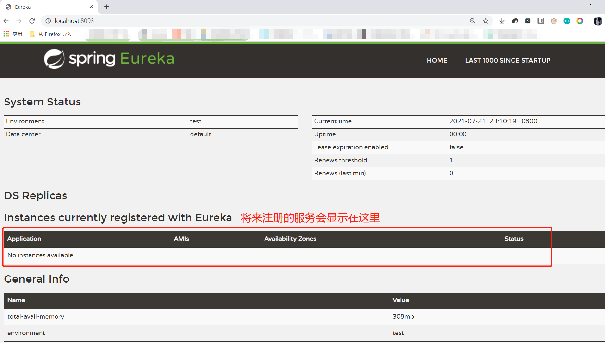

一、简介
===

1.1 微服务概述
---

微服务是系统架构上的一种设计风格，它的主旨是将一个原本独立的系统拆分成多个小型服务，这些小型服务都各自运行，服务之间通过基于 HTTP 的 RESTful API 进行通信协作 ；

> 分布式强调系统的拆分，微服务也是强调系统的拆分，微服务架构属于分布式架构的范畴；

优点：

- 每个服务的更新不会影响其他服务的运行
- 每个服务都是独立开发，便于后期维护
- 每个服务可以使用不同的编程语言进行开发

缺点：

- 增加了整体的系统维护以及部署的难度，导致一些功能模块或代码无法复用；
- 数据的一致性问题需要解决
- 增加了集成测试的复杂度；


1.2 认识Spring Cloud
---

Spring Cloud 为开发人员提供了快速构建分布式系统中一些常见模式的工具。比如：配置管理，服务发现，断路器，智能路由、微代理、控制总线、全局锁、决策竞选、分布式会话和集群状态管理等 。

Spring Cloud 是基于 Spring Boot 框架构建微服务架构。


二、 Spring Cloud快速入门
===

一个服务就是一个系统，服务之间进行通信就等于系统之间通信，那系统之间要如何通信呢？需要把他们都注册到一个中心，我们称为“**服务注册中心**”。通过中心，系统之间就可以相互通信，获取到需要的结果。

Spring Cloud 提供了多种服务注册与发现的实现方式，例如：Eureka、Consul、Zookeeper。在这里我们介绍Eureka。


2.1 Eureka介绍
---

Eureka 采用了 **C-S（客户端/服务端）**的设计架构，即 Eureka 由两个组件组成：Eureka服务端 和 Eureka客户端。Eureka服务端 是服务注册中心，而系统中的其他微服务，作为 Eureka客户端 连接到 Eureka服务端，并维持心跳连接。

有了 Eureka 注册中心，微服务之间可以相互调用，并且系统的维护人员也可以通过 Eureka服务端 来监控系统中各个微服务是否正常运行。


2.2 搭建两个微服务
---

创建两个springboot项目（作为注册中心的客户端）


2.3 搭建与配置Eureka 服务注册中心
---

1. 创建另一个系统用于服务注册中心

2. 添加eureka-server依赖：（**注意，springboot的版本要跟eureka一致**）

   ```xml
   <dependency>
       <groupId>org.springframework.cloud</groupId>
       <artifactId>spring-cloud-starter-netflix-eureka-server</artifactId>
       <version>2.2.7.RELEASE</version>
   </dependency>
   
   <dependencyManagement>
       <dependencies>
           <dependency>
               <groupId>org.springframework.cloud</groupId>
               <artifactId>spring-cloud-dependencies</artifactId>
               <version>Hoxton.RELEASE</version>
               <type>pom</type>
               <scope>import</scope>
           </dependency>
       </dependencies>
   </dependencyManagement>
   ```
   
3. 在 Spring Boot 的入口类上添加一个**@EnableEurekaServer** 注解，用于开启 Eureka 注册中心服务端

4. 在配置文件中配置 Eureka 服务注册中心信息

   ```properties
   # 内嵌定时 tomcat 的端口
   server.port=8093
   # 设置该服务注册中心的hostname名称
   eureka.instance.hostname=localhost
   # 由于我们目前创建的应用是一个服务注册中心，而不是普通的应用，默认情况下，这个应用会向注册中心（也是它自己）注册它自己，
   # 设置为 false 表示禁止这种自己向自己注册的默认行为
   eureka.client.register-with-eureka=false
   # 表示不去检索其他的服务
   eureka.client.fetch-registry=false
   ```
   
5. 访问页面

   


2.4 向Eureka注册中心注册服务
---

1. 在之前两个客户端系统中添加eureka-client依赖

```xml
<dependency>   		
    <groupId>org.springframework.cloud</groupId>
    <artifactId>spring-cloud-starter-netflix-eureka-client</artifactId>
    <version>2.2.7.RELEASE</version>
</dependency>

<dependencyManagement>
    <dependencies>
        <dependency>
            <groupId>org.springframework.cloud</groupId>
            <artifactId>spring-cloud-dependencies</artifactId>
            <version>Hoxton.RELEASE</version>
            <type>pom</type>
            <scope>import</scope>
        </dependency>
    </dependencies>
</dependencyManagement>
```

2. 在 Spring Boot 的入口类上添加一个 **@EnableEurekaClient** 注解来表明自己是一个 eureka 客户端

3. 配置服务名称和注册中心地址

   ```properties
   # 注册的客户端名字，一般与项目名一致
   spring.application.name=XXX
   # 服务端所在路径
   eureka.client.service-url.defaultZone=http://localhost:8093/eureka
   ```

4. 自定义配置类，将RestTemplate放入容器中

   ```java
   package com.study.config;
   
   import org.springframework.context.annotation.Bean;
   import org.springframework.context.annotation.Configuration;
   import org.springframework.web.client.RestTemplate;
   
   @Configuration
   public class MyConfig {
   
       @LoadBalanced // 使用负载均衡
       @Bean
       public RestTemplate restTemplate(){
           return new RestTemplate();
       }
   }
   ```
> @LoadBalanced实现负载均衡，合理的把请求分配给不同的服务器，从而让每个服务器可以发挥最大程度的作用。
>
> 服务的真正调用由 ribbon实现，所以我们需要在调用服务提供者时使用 ribbon 来调用，而@LoadBalanced实际就是调用ribbon。

5. 使用restTemplate进行系统通信

```java
@RestController
public class ConsumerController {

    @Autowired
    RestTemplate restTemplate;

    @RequestMapping("/consumer/hello")
    public String hello(){
        // 注册中心的服务名，而不是项目名
        String baseURL = "http://01-SPRINGCLOUD-PROVIDER";
        ResponseEntity<String> entity = restTemplate.getForEntity(baseURL+"/provider/hello", String.class);
        System.out.println(entity); // <200,provider.hello,[Content-Type:"text/plain;charset=UTF-8", Content-Length:"14", Date:"Thu, 22 Jul 2021 01:28:26 GMT", Keep-Alive:"timeout=60", Connection:"keep-alive"]>
        System.out.println(entity.getBody()); // provider.hello
        return "consumer.hello";
    }
}
```


三、服务注册中心Eureka
===

3.1 Eureka集群
---

在微服务架构中，我们要充分考虑各个微服务组件的高可用性问题，不能出现单点故障。

由于注册中心eureka 本身也是一个服务，如果它只有一个节点，那么它有可能发生故障，这样就不能注册与查询服务了，所以可以使用多个注册中心，这就是所谓的集群。

eureka 它也可以看做是一个提供者，又可以看做是一个消费者，所以可以让其他服务注册中心 往自己这里注册，而自己也可以注册到其他中心，当一个注册中心有服务更改的时候，会同步到其他注册中心，从而达到高可用的效果。


3.2 Eureka与Zookeeper的比较
---

著名的 CAP 理论指出，一个分布式系统不可能同时满足 C(一致性)、A(可用性) 和 P(分区容错性)。由于分区容错性在是分布式系统中必须要保证的，因此我们只能在 A 和 C 之间进行权衡，在此 Zookeeper 保证的是 CP, 而 Eureka 则是 AP。

**Zookeeper 保证 CP** 

在 ZooKeeper 中，**节点被分为master和slave**。当 master 节点因为网络故障与其他节点失去联系时，剩余节点会重新进行 leader选举，但**选举 leader 需要一定时间且选举期间整个 ZooKeeper 集群都是不可用的**，这就导致在选举期间注册服务瘫痪。

**Eureka 保证 AP** 

Eureka 优先保证可用性，Eureka **各个节点是平等**的，某几个节点挂掉不会影响正常节点的工作，剩余的节点依然可以提供注册和查询服务。而 Eureka 的客户端在向某个 Eureka 注册时如果发现连接失败，则会自动切换至其它Eureka节点，只要有一台 Eureka 还在，就能保证注册服务可用(保证可用性)，只不过查到的信息可能不是最新的(不保证强一致性)。


3.3 Eureka注册中心高可用集群搭建
---

1. 新创建一个系统，做为新的注册中心（**端口号假设为8094**）。

2. 让两个注册中心相互注册到对方

   旧注册中心的配置文件：

   ```properties
   # 内嵌定时 tomcat 的端口
   server.port=8093
   # 设置该服务注册中心的 ip地址，因为hostname不能重复，所以使用IP地址
   eureka.instance.ip-address=127.0.0.1
   # 设置为 false 表示禁止这种自己向自己注册的默认行为
   eureka.client.register-with-eureka=false
   # 表示不去检索其他的服务
   eureka.client.fetch-registry=false
   # 指定 新服务注册中心 的位置
   eureka.client.service-url.defaultZone=http://127.0.0.1:8094/eureka
   ```

   新注册中心的配置文件：

   ```properties
   # 内嵌定时 tomcat 的端口
   server.port=8094
   # 设置该服务注册中心的 ip地址
   eureka.instance.ip-address=127.0.0.1
   # 设置为 false 表示禁止这种自己向自己注册的默认行为
   eureka.client.register-with-eureka=false
   # 表示不去检索其他的服务
   eureka.client.fetch-registry=false
   # 指定 旧服务注册中心 的位置
   eureka.client.service-url.defaultZone=http://127.0.0.1:8093/eureka
   ```


3.4 Eureka服务注册中心自我保护机制
---

自我保护机制是 Eureka 注册中心的重要特性，当 Eureka 注册中心进入自我保护模式时，在 Eureka Server 首页会输出如下警告信息：

<p style="color:red;">EMERGENCY! EUREKA MAY BE INCORRECTLY CLAIMING INSTANCES ARE UP WHEN THEY'RE NOT. RENEWALS ARE LESSER THAN THRESHOLD AND HENCE THE INSTANCES ARE NOT BEING EXPIRED JUST TO BE SAFE</p>
在没有 Eureka 自我保护的情况下，如果 Eureka Server 在一定时间内没有接收到某个微服务实例的心跳，Eureka Server 将会注销该实例。即使微服务实际是正常的，只是因为可能网络不好导致接收心跳较慢。

自我保护模式的工作机制是：如果在**短时间内有过多**的客户端节点都没有正常的心跳，那么 Eureka 就认为客户端与注册中心出现了网络故障，Eureka Server自动进入自我保护模式；当网络故障恢复后，Eureka Server会自动退出自我保护模式。

在自我保护模式下：

1. Eureka Server不再从注册列表中移除心跳不正常的服务。
2. Eureka Server仍然能够接受新服务的注册和查询请求，但是不会被同步到其它节点上，保证当前节点依然可用。
3. 当网络稳定时，当前 Eureka Server中新的注册信息会被同步到其它节点中。

***

关于自我保护常用几个配置如下：

**服务端**配置：

```properties
# 打开自我保护机制
eureka.server.enable-self-preservation=true
```

**客户端**配置：

```properties
# 每间隔 2s，向服务端发送一次心跳，证明自己依然"存活"
eureka.instance.lease-renewal-interval-in-seconds=2 
# 如果90s之内没有给你发心跳，就代表我故障了，将我踢出掉
eureka.instance.lease-expiration-duration-in-seconds=90
```


四、客户端负载均衡Ribbon
===

4.1 负载均衡介绍
---

负载均衡是指将一个请求按照某种策略分摊到不同的节点单元上执行，负载均衡分为硬件负载均衡和软件负载均衡：

- **硬件负载均衡**：比如 F5、深信服、Array 等；

- **软件负载均衡**：比如 Nginx、LVS、HAProxy 等；

硬件负载均衡或是软件负载均衡，他们都会维护一个**可用的服务端清单**，通过心跳检测来剔除故障的服务端节点。当客户端发送请求到负载均衡设备的时候，该设备按**某种算法（比如轮询、权重、最小连接数等）**从可用服务端清单中取出一台服务端的地址，然后进行转发。


4.2 Ribbon介绍
---

Ribbon 是**客户端负载均衡**工具，所有客户端节点下的 服务端清单 需要自己从服务注册中心上获取，比如 Eureka 服务注册中心。在发送请求前通过负载均衡算法选择一个服务器，然后进行访问。即在客户端就进行负载均衡算法分配。

**服务端负载均衡**：例如Nginx，通过Nginx进行负载均衡，先发送请求，然后通过负载均衡算法，在多个服务器之间选择一个进行访问、即在服务器端再进行负载均衡算法分配。

> 客户端负载均衡 和 服务器负载均衡的核心差异在 **服务端清单的存放位置**，客户端负载均衡的服务端清单需要自己去注册中心获取，而服务器负载均衡的服务端清单由中间服务单独维护。


4.3 Ribbon负载均衡策略
---

RoundRobinRule：轮询策略（默认）。按照顺序依次对相同的所有服务进行访问。

RandomRule： 随机策略。随机调用服务。

WeightedResponseTimeRule： 响应时间加权策略。根据响应时间来分配权重的方式，响应的越快，分配的值越大。

BestAvailableRule： 最低并发策略。选择并发量最小的服务。

RetryRule： 重试策略。先通过轮询策略选出一个服务，然后去访问，如果此服务失效，那么重试一段时间后会选择其他服务

AvailabilityFilteringRule： 可用过滤策略。过滤掉那些因为一直连接失败的被标记为circuit tripped的服务，并过滤掉那些高并发的服务。

ip hash：hash策略。通过ip url等信息计算hash值，然后对服务器的数量取模，相同的请求会请求到同一个后端服务器中。

> 可以自定义负载均衡策略。

***

指定负载均衡策略：

在自定义配置类中，指定IRule对象。

```java
// 使用随机策略
@Bean
public IRule iRule(){
    return new RandomRule();
}
```


五、Rest请求模板类
===

RestTemplate可以让我们方便的访问另一个服务，它是一个 HTTP 请求工具，它提供了常见的REST请求方案的模版，例如 GET 请求、POST 请求、PUT 请求、DELETE 请求。


5.1 GET请求
---

不携带参数：

- `getForEntity(String url, Class<T> responseType)`：返回封装好的HTTP响应对象，getBody()可以获取到响应数据
- `getForObject(URI url, Class<T> responseType)`：直接返回响应数据

携带参数：

- `getForEntity(String url, Class<T> responseType, Map<String, ?> uriVariables)`：传递map
- `getForEntity(String url, Class<T> responseType, Object... uriVariables)`：传递数组
- `getForObejct(String url, Class<T> responseType, Map<String, ?> uriVariables)`：传递map
- `getForObejct(String url, Class<T> responseType, Object... uriVariables)`：传递数组

例如：

```java
// 封装参数
Map<String, Object> params = new HashMap<>();
params.put("id", 1);
params.put("name", "codekiang");

// 发送请求
String s = restTemplate.getForObject("http://01-SPRINGCLOUD-PROVIDER/provider/hello?id={id}&name={name}", String.class, params);
```


5.2 POST请求
---

post请求跟get差不多，只不过传递参数不能用map，而是用**MultiValueMap**或者**实体类**， 而且参数传递的位置也不一样。

- `postForEntity(URI url, Object request, Class<T> responseType)` 
- `postForObject(URI url, Object request, Class<T> responseType)` 

例如：

```java
MultiValueMap body = new LinkedMultiValueMap();
body.add("id", 1);
body.add("name", "codekiang");
String s = restTemplate.postForObject("http://01-SPRINGCLOUD-PROVIDER/provider/hello", body, String.class);

==================================================
    
User user = new User();
user.setId(1);
user.setName("codekiang");
String s = restTemplate.postForObject("http://01-SPRINGCLOUD-PROVIDER/provider/hello", user, String.class);
```


5.3 PUT请求
---

put请求无返回值，传递参数跟get一样。


5.4 DELETE请求
---

delete请求无返回值，传递参数跟post类似，要使用MultiValueMap。


六、服务熔断 Hystrix
===

6.1 Hystrix是什么
---

在微服务之间通过远程调用实现信息交互时，如果某个服务的响应太慢或者故障，则会造成调用者延迟或调用失败，当大量请求到达，则会造成请求的堆积，从而导致调用者也无法继续响应，导致故障在分布式系统间蔓延。

为了解决此问题，微服务架构中引入了一种叫**熔断器**的服务保护机制。

> “熔断器”本身是一种开关装置，用于在电路上保护线路过载，当线路中有电器发生短路时，能够及时切断故障电路，防止发生过载、发热甚至起火等严重后果。

微服务架构中的熔断器，就是当服务方没有响应，调用方不会进行长时间的等待，而是直接返回一个错误响应；

**Hystrix** 是由Netflix开源的一个延迟和容错库，用于隔离访问远程系统、服务或者第三方库，防止级联失败，从而提升系统的可用性、容错性与局部应用的弹性，是一个实现了超时机制和断路器模式的工具类库。


6.2 Hystrix快速入门
---

1. 在微服务上添加依赖

   ```xml
   <!--Spring Cloud 熔断器起步依赖-->
   <dependency>
       <groupId>org.springframework.cloud</groupId>
       <artifactId>spring-cloud-starter-netflix-hystrix</artifactId>
       <version>2.2.7.RELEASE</version>
   </dependency>
   ```

2. 在入口类中使用 **@EnableCircuitBreaker** 注解开启断路器功能

3. 在调用远程服务的方法上添加注解：`@HystrixCommand(fallbackMethod="回调方法")` 

   ```java
   // 超时或发生错误时调用fallbackMethod的方法
   @HystrixCommand(fallbackMethod="errorFun")
   @RequestMapping("/consumer/hello")
   public String hello(){
       String baseURL = "http://01-SPRINGCLOUD-PROVIDER";
       ResponseEntity<String> entity = restTemplate.getForEntity(baseURL+"/provider/hello", String.class);
       System.out.println(entity);
       return "consumer.hello";
   }
   
   // Throwable可以拿到错误信息
   public String errorFun(Throwable throwable){
       System.out.println("error:" + throwable.getMessage());
       return "error";
   }
   ```

> @SpringCloudApplication 等价于下面三个注解：
>
> @EnableCircuitBreaker
> @EnableEurekaClient
> @SpringBootApplication

***

修改超时时间：

hystrix 默认超时时间是 1000 毫秒，如果你后端的响应超过此时间，就会触发断路器；

修改 hystrix 的默认超时时间：

`@HystrixCommand(fallbackMethod="error", commandProperties={@HystrixProperty(name="execution.isolation.thread.timeoutInMilliseconds", value="1500")})` 

***

异常处理：

如果远程服务有一个异常抛出后我们不希望进入到服务降级方法中去处理，而是**直接将异常抛给用户**，那么我们可以在@HystrixCommand 注解中添加要忽略的异常。

方式如下：

`@HystrixCommand(fallbackMethod="errorFun", ignoreExceptions = Exception.class)`


6.3 服务降级
---

所谓**服务降级**，就是当某个服务熔断之后，服务端提供的服务将不再被调用，此时由客户端自己准备一个本地的fallback 回调，返回一个默认值来代表服务端的返回；这种做法，虽然不能得到正确的返回结果，但至少保证了服务的可用，比直接抛出错误或服务不可用要好很多，当然这需要根据具体的业务场景来选择；

`@HystrixCommand(fallbackMethod="errorFun")` 此注解就是服务降级。

> 服务熔断是思想，服务降级是实现。


6.4 Dashboard仪表盘
---

Hystrix Dashboard，它主要用来实时监控Hystrix的各项指标信息。通过Hystrix Dashboard反馈的实时信息，可以帮助我们快速发现系统中存在的问题。

### 使用步骤

1. 添加依赖

   ```xml
   <dependency>
       <groupId>org.springframework.cloud</groupId>
       <artifactId>spring-cloud-starter-hystrix-dashboard</artifactId>
   </dependency>
   <dependency>
       <groupId>org.springframework.boot</groupId>
       <artifactId>spring-boot-starter-actuator</artifactId>
   </dependency>
   ```

2. 在启动类上面引入注解 **@EnableHystrixDashboard**，启用Dashboard 功能。

3. 配置文件中配置 springboot 监控端点的访问权限

   ```properties
   # 开放所有端点
   management.endpoints.web.exposure.include=*
   ```

4. 浏览器中输入 http://主机:端口号/hystrix 可以访问到仪表盘界面


### 参数解读


Hystrix Dashboard共支持三种不同的监控方式：

- **默认的集群监控**：通过URL:http://集群主机名:port/turbine.stream 开启，实现对默认集群的监控。

- **指定的集群监控**：通过URL:http://集群主机名:port/turbine.stream?cluster=[clusterName]开启，实现对clusterName集群的监控。

- **单体应用的监控**：通过URL:http://服务地址:端口号/hystrix.stream开启，实现对具体某个服务实例的监控。

其他参数：

- **Delay**：控制服务器上轮询监控信息的延迟时间，默认为2000毫秒，可以通过配置该属性来降低客户端的网络和CPU消耗。

- **Title**：监控的标题，默认是项目名
- **Monitor Stream按钮**：开始监控


七、声明式服务消费 OpenFeign
===

7.1 OpenFeign 介绍
---

OpenFeign为微服务架构下服务之间的调用提供了解决方案，OpenFeign是一种面向接口、模板化的HTTP客户端。

在Spring Cloud中使用OpenFeign，可以做到使用HTTP请求访问远程服务，就像调用本地方法一样的，开发者完全感知不到这是在调用远程方法，更感知不到在访问HTTP请求


7.2 Fegin与OpenFeign
---


简单来说，Feign 整合了 Ribbon 和 Hystrix 两个组件,就像 Spring Boot 是对 Spring+SpringMVC 的简化一样。而OpenFeign是对Feign的进一步封装。


7.3 使用OpenFeign
---

1. 添加依赖

   ```xml
   <dependency>
       <groupId>org.springframework.cloud</groupId>
       <artifactId>spring-cloud-starter-netflix-eureka-client</artifactId>
       <version>2.2.7.RELEASE</version>
   </dependency>
   
   <dependency>
       <groupId>org.springframework.cloud</groupId>
       <artifactId>spring-cloud-starter-openfeign</artifactId>
   </dependency>
   ```

2. 在项目入口类上添加 **@EnableFeignClients** 注解表示开启 Spring Cloud Feign的支持功能；

3. 配置文件的编写跟ribbon差不多，也要被加入到注册中心

4. 定义服务接口，方法的定义要跟远程服务的controller中的方法定义一致。

   ```java
   @Service
   // 另一个微服务在注册中心的名称
   @FeignClient(name="04-springcloud-openfeign")
   public interface FeignService {
       // 另一个微服务的具体控制器访问路径
       @GetMapping("/hello")
       String hello(@RequestParam("name") String name);
   
       @PostMapping("/user")
       int addUser(@RequestBody User user);
   
       @DeleteMapping("/deleteUser/{id}")
       int deleteUser(@PathVariable("id") Integer id);
   }
   ```

5. 定义controller，调用service

   ```java
   @RestController
   public class FeignController {
        // 把feignService注入到容器中去
       @Autowired
       FeignService feignService;
       
       @GetMapping("/feignTest")
       public String feignTest(String mes){
           String s = feignService.hello(mes);
           return s;
       }
       
       @GetMapping("/user")
       public int addUser(){
           User user = new User();
           user.setId(1);
           user.setUsername("javaboy");
           user.setPassword("123");
           int i = feignService.addUser(user);
           return i;
       }
       
       @GetMapping("/deleteUser")
       int deleteUser(){
           int id = 1;
           int i = feignService.deleteUser(id);
           return i;
       }
   }
   ```

ribbon跟openfeign调用远程微服务方式的区别：


7.4 设置过期时间和开启熔断
---

```properties
# 开启熔断
feign.hystrix.enabled=true
# 设置过期时间
hystrix.command.default.execution.isolation.thread.timeoutInMilliseconds=5000
```

如果要进行服务降级：

1. 指定熔断回调逻辑

   `@FeignClient(name="01-springcloud-service-provider", fallback = 回调类.class)` 

2. 创建回调类（继承服务类）

   ```java
   @Component
   public class MyFallback implements FeignService {
       @Override
       public String feignHello() {
           return "error";
       } 
   }
   ```


八、API网关Zuul
===

8.1 zuul介绍
---

微服务架构中有个 API 网关(Gateway)的概念，它就像一个安检站一样，所有外部的请求都需要经过它的调度与过滤，然后由 API 网关来实现请求路由、负载均衡、权限验证等功能；

Zuul是Spring Cloud全家桶中的微服务API网关。


8.2 zuul使用
---

1. 添加依赖

   ```xml
   <!-- 网关跟客户端一样，要注册到服务中心 -->
   <dependency>
       <groupId>org.springframework.cloud</groupId>
       <artifactId>spring-cloud-starter-netflix-eureka-client</artifactId>
   </dependency>
   <dependency>
       <groupId>org.springframework.cloud</groupId>
       <artifactId>spring-cloud-starter-netflix-zuul</artifactId>
   </dependency>
   ```

2. 在入口类上添加 **@EnableZuulProxy** 注解，开启 Zuul的 API 网关服务功能

3. 修改配置文件

   ```properties
   server.port=8095
   # 配置服务的名称
   spring.application.name=05-springcloud-api-gateway
   # 配置 API 网关到注册中心上
   eureka.client.service-url.defaultZone=http://127.0.0.1:8093/eureka
   # 配置路由规则 zuul.routes.服务名=该服务的放行请求
   zuul.routes.04-springcloud-service-feign=/user/**
   ```

4. 此时可以访问 `http://localhost:8095/user/queryAll/` 可以放行，转发到04-springcloud-service-feign服务中


8.3 路由规则
---

路由规则是指符合规则的请求才会被放行，在上面配置中则会放行所有符合 `/user/**` 的请求，然后转发到 04-springcloud-service-feign 服务上。

如果映射规则我们什么都不写，系统也给我们提供了一套默认的配置规则。

```properties
# 默认的规则
zuul.routes.04-springcloud-service-feign=/04-springcloud-service-feign/**
```

即**默认可以通过服务名访问该服务的所有路径**。

如果要想关闭某个微服务的路由创建默认规则，可以做如下配置：

```properties
# 关闭服务提供者的默认规则（多个服务名称使用逗号','分隔）
zuul.ignored-services=04-springcloud-service-provider
```

如果想禁止某些路由：

```properties
# 忽略掉某些接口路径，注意第一个斜杠
zuul.ignored-patterns=/**/hello/**
```

我们也可以统一的为路由规则增加前缀：

```properties
# 配置网关路由的前缀，注意斜杠
zuul.prefix=/myapi
```

此时需要访问`/myapi/user/queryAll` 来访问

***

通配符含义：

- **?**：匹配任意单个字符
  - 如 `/05-springcloud-service-feign/?` 可以匹配 `/05-springcloud-service-feign/a`
- *****：匹配任意个字符
  - 如 `/05-springcloud-service-feign/*` 可以匹配 `/05-springcloud-service-feign/aa` ，但**不能**匹配 `/05-springcloud-service-feign/a/b/c` 
- ******：匹配任意个字符，可以匹配 `/05-springcloud-service-feign/aa` ，**也能**匹配 `/05-springcloud-service-feign/a/b/c` 


8.4 zuul过滤器
---

Zuul中提供了过滤器定义，可以用来过滤代理请求，提供额外功能逻辑。如：权限验证，日志记录等。

过滤器实现方式：

继承父类`ZuulFilter`。在父类中提供了4个抽象方法，分别是：**filterType, filterOrder, shouldFilter, run**。其功能分别是：

- <font size="4" color="red">filterType()</font>：返回字符串数据，代表当前**过滤器的类型**。可选值有 pre, route, post, error。
  - `pre`：在**请求被路由执行前**，通常用于处理身份认证，日志记录等；
  - `route`： 在**路由执行后，服务调用前**被调用；
  - `error`： **任意一个过滤器发生异常**的时候执行或**远程服务调用超时**执行，通常用于处理异常；
  - `post`： 在**服务调用后或error执行后被调用**，一般用于收集服务信息，统计服务性能指标等，也可以对response结果做特殊处理。
- <font size="4" color="red">filterOrder()</font>：返回int数据，指定过滤器执行顺序，返回值越小，执行顺序越优先。
- <font size="4" color="red">shouldFilter()</font>：返回boolean数据，代表当前filter是否生效。
- <font size="4" color="red">run()</font>：具体的**过滤执行逻辑**。
  - 如pre类型的过滤器，可以通过对请求的验证来决定是否将请求路由发送给服务；.
  - 如post类型的过滤器，可以对服务响应结果做加工处理。


代码演示：

```java
@Component
public class LoggerFilter extends ZuulFilter {

    private static final Logger logger = LoggerFactory.getLogger(LoggerFilter.class);
    
    @Override
    public String filterType() {
        return "pre";
    }
    
    @Override
    public int filterOrder() {
        return 0;
    }
    
    @Override
    public boolean shouldFilter() {
        return true;
    }

    @Override
    public Object run() throws ZuulException {
        // 通过zuul，获取请求上下文
        RequestContext rc = RequestContext.getCurrentContext();
        HttpServletRequest request = rc.getRequest();
        
        String token = request.getParameter("token");
        if (token == null) {
            ctx.setSendZuulResponse(false);
            ctx.setResponseStatusCode(401);
            ctx.addZuulResponseHeader("content-type","text/html;charset=utf-8");
            ctx.setResponseBody("非法访问");
        }
        // 返回值没有意义，可以是任意值
        return null;
    }
}
```


九、springcloud配置
===

在分布式系统中，尤其是当我们的分布式项目越来越多，每个项目都有自己的配置文件，对配置文件的统一管理就成了一种需要。

Spring Cloud Config项目是一个解决分布式系统的配置管理方案。它包含了Client和Server两个部分，server提供配置文件的存储、以接口的形式将配置文件的内容提供出去，client通过接口获取数据、并依据此数据初始化自己的应用。

Spring cloud 使用 git 或 svn 存放配置文件，默认情况下使用 git。配置中心在读取远程配置文件后会先保存一份在本地。


**好处**：

- 集中管理配置文件
- 运行期间动态更新配置
- 可以对配置文件进行版本管理


9.1 搭建配置中心
---

1. 创建项目，加入依赖

   ```xml
   <dependency>
       <groupId>org.springframework.cloud</groupId>
       <artifactId>spring-cloud-config-server</artifactId>
   </dependency>
   ```

2. 在启动类上添加注解 **@EnableConfigServer** 

3. 在 application.properties 中配置一下 git 仓库信息

   ```properties
   server.port=3721
   spring.application.name=06-springcloud-config-server
   
   # 配置git仓库地址
   spring.cloud.config.server.git.uri=https://github.com/XXXX
   # 配置仓库路径
   spring.cloud.config.server.git.search-paths=myconfig
   # 配置仓库的分支
   spring.cloud.config.label=master
   # 访问git仓库的用户名
   spring.cloud.config.server.git.username=用户名
   # 访问git仓库的用户密码
   spring.cloud.config.server.git.password=密码
   ```

配置文件命名要求：application-profile.yml 或 application-profile.properties

对应的http请求地址：`/{application}/{profile}[/{label}]`

- {application} 表示配置文件的名字，对应的配置文件即 application，

- {profile} 表示环境，有 dev、test、online 及默认，

- {label} 表示分支，默认我们放在 master 分支上


9.2 客户端使用
---

1. 添加依赖

   ```xml
   <dependency>
       <groupId>org.springframework.cloud</groupId>
       <artifactId>spring-cloud-starter-config</artifactId>
   </dependency>
   ```

2. 创建 `bootstrap.properties` 文件，文件内容如下:

   ```properties
   server.port=8091
   spring.cloud.config.uri=配置中心所在的地址
   spring.application.name=application
   spring.cloud.config.profile=dev
   spring.cloud.config.label=master
   ```


