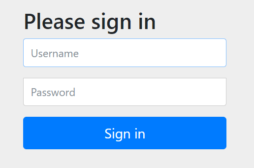
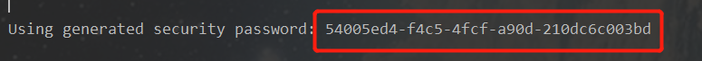

SpringSecurity 学习
===================


SpringSecurity框架简介
----------------------

Spring 是非常流行和成功的 Java 应用开发框架，Spring Security 正是 Spring 家族中的成员。Spring Security 基于 Spring 框架，提供了一套 Web 应用安全性的完整解决方案。

Spring Security 重要核心功能主要是“**认证**”和“**授权**”（或者访问控制），即用户认证（Authentication）和用户授权（Authorization）。


SpringSecurity 与 Shiro
-----------------------

SpringSecurity 特点：

- 和 Spring 无缝整合。
- 全面的权限控制。
- 专门为 Web 开发而设计。旧版本不能脱离 Web 环境使用。新版本对整个框架进行了分层抽取，分成了核心模块和 Web 模块。

- 重量级。

 Shiro特点：

- 轻量级。Shiro 主张的理念是把复杂的事情变简单。针对对性能有更高要求的互联网应用有更好表现。
- 不局限于 Web 环境，可以脱离 Web 环境使用。
- 在 Web 环境下一些特定的需求需要手动编写代码定制

自从有了 Spring Boot 之后，Spring Boot 对于 Spring Security 提供了自动化配置方案，可以使用更少的配置来使用 Spring Security


入门案例
--------

1. 创建springboot项目，添加依赖

   ```xml
   <!-- spring security依赖 -->
   <dependency>
       <groupId>org.springframework.boot</groupId>
       <artifactId>spring-boot-starter-security</artifactId>
       <version>2.4.0</version>
   </dependency>
   ```

2. 自定义配置

   ```java
   @Configuration
   public class SecurityConfig extends WebSecurityConfigurerAdapter {
       @Override
       protected void configure(HttpSecurity http) throws Exception {
           http.formLogin() // 表单登录
               .and()
               .authorizeRequests() // 认证配置
               .anyRequest() // 任何请求
               .authenticated(); // 都需要身份验证
       }
   }
   ```

3. 编写controller测试并启动容器，并访问地址，此时需要密码。

   

4. 用户名默认是 **user**，密码在项目启动的时候在控制台会打印，**注意每次启动的时候密码都回发生变化**！

   


自定义登录逻辑
--------------

当什么也没有配置的时候，账号和密码是由 Spring Security 定义生成的。而在实际项目中账号和密码都是从数据库中查询出来的。 所以我们要通过自定义逻辑控制认证逻辑。

如果需要自定义逻辑时，只需要实现 `UserDetailsService` 接口的`loadUserByUsername(String s)`方法即可，这个方法会返回 **系统默认的用户** `UserDetails`.

步骤：

1. 创建配置类，设置使用哪个UserDetailsService实体类

   ```java
   @Configuration
   public class SecurityConfig extends WebSecurityConfigurerAdapter {
       @Autowired
       UserDetailsService myUserDetailsService;
   
       @Override
       protected void configure(AuthenticationManagerBuilder auth) throws Exception {
    // 指定 UserDetailsService
           auth.userDetailsService(myUserDetailsService)
                   .passwordEncoder(passwordEncoder());
       }
       
       @Bean
       PasswordEncoder passwordEncoder(){
           return new BCryptPasswordEncoder();
       }
   }
   
   ```

2. 编写实现类，返回User对象

   ```java
   @Service
   public class MyUserDetailsService implements UserDetailsService {
       @Autowired
       private UsersMapper usersMapper;
       
       @Override
       public UserDetails loadUserByUsername(String s) throws Exception {
           QueryWrapper<Users> wrapper = new QueryWrapper();
           wrapper.eq("username", s);
           Users users = usersMapper.selectOne(wrapper);
           if(users == null) {
               throw new UsernameNotFoundException("用户名不存在！");
           }
           System.out.println(users);
           // 设置用户权限
           List<GrantedAuthority> auths =
               AuthorityUtils.commaSeparatedStringToAuthorityList("role");
           return new User(users.getUsername(), users.getPassword(), auths);
       } 
   }
   ```

   