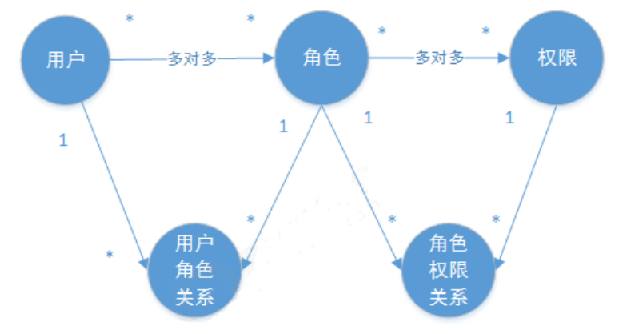
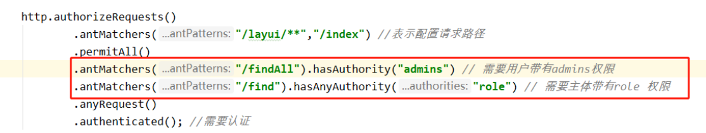
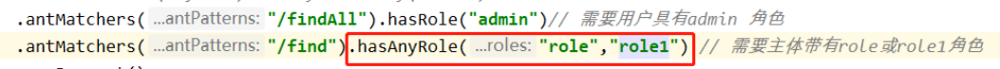

SpringSecurity 学习
===================

SpringSecurity框架简介
----------------------

Spring 是非常流行和成功的 Java 应用开发框架，Spring Security 正是 Spring 家族中的成员。Spring Security 基于 Spring 框架，提供了一套 Web 应用安全性的完整解决方案。

Spring Security 重要核心功能主要是“**认证**”和“**授权**”（或者访问控制），即用户认证（Authentication）和用户授权（Authorization）。

- **认证** ：用户认证就是判断一个用户的身份是否合法的过程，用户去访问系统资源时系统要求验证用户的身份信息，身份合法方可继续访问，不合法则拒绝访问。常见的用户身份认证方式有：用户名密码登录，二维码登录，手机短信登录，指纹认证等方式。 
- **授权**： 授权是用户认证通过后根据用户的权限来控制用户访问资源的过程，拥有资源的访问权限则正常访问，没有 权限则拒绝访问。

授权的数据模型
--------------

如何进行授权即如何对用户访问资源进行控制，首先需要学习授权相关的数据模型。 

授权可简单理解为Who对What(which)进行How操作，包括如下： 

Who，即主体（Subject），主体一般是指用户，也可以是程序，需要访问系统中的资源。 

What，即资源 （Resource），如系统菜单、页面、按钮、代码方法、系统商品信息、系统订单信息等。 

How，权限/许可（Permission），规定了用户对资源的操作许可，权限离开资源没有意义， 如用户查询权限、用户添加权限等。

***

用户、资源、权限相关的**数据模型**如下： 

- 用户（用户id、账号、密码、...）  
- 权限/资源（权限id、权限标识、权限名称、资源id、...） 
- 角色（角色id、角色名称、...）
- 角色和权限关系（角色id、权限id、...） 
- 用户和角色关系（用户id、角色id、...） 

用户、角色、权限关系如下图： 



RBAC
----

如何实现授权？业界通常基于RBAC实现授权，即**基于角色的访问控制**或**基于资源的访问控制**。

### 基于角色的访问控制

RBAC基于**角色**的访问控制（Role-Based Access Control）是按角色进行授权，比如：主体的角色为总经理可以查询企业运营报表，查询员工工资信息等，访问控制流程如下：

```java
if(用户.hasRole("总经理角色id")){ 
    查询工资
}
```

如果上图中查询工资所需要的角色变化为总经理和部门经理，此时就需要修改判断逻辑为“判断用户的角色是否是 总经理或部门经理”，修改代码如下：

```java
if(用户.hasRole("总经理角色id") || 主体.hasRole("部门经理角色id")){ 
    查询工资 
}
```

### 基于资源的访问控制

RBAC基于资源的访问控制（Resource-Based Access Control）是按资源（或权限）进行授权，比如：用户必须具有查询工资权限才可以查询员工工资信息等，访问控制流程如下：

```java
if(用户hasPermission("查询工资权限标识")){ 
    查询工资 
}
```

优点：系统设计时定义好查询工资的权限标识，即使查询工资所需要的角色变化为总经理和部门经理也不需要修改授权代码，系统可扩展性强。 

SpringSecurity 与 Shiro
-----------------------

SpringSecurity 特点：

- 和 Spring 无缝整合。

- 全面的权限控制。

- 专门为 Web 开发而设计。旧版本不能脱离 Web 环境使用。新版本对整个框架进行了分层抽取，分成了核心模块和 Web 模块。

- 重量级。
  
  Shiro特点：

- 轻量级。Shiro 主张的理念是把复杂的事情变简单。针对对性能有更高要求的互联网应用有更好表现。

- 不局限于 Web 环境，可以脱离 Web 环境使用。

- 在 Web 环境下一些特定的需求需要手动编写代码定制

自从有了 Spring Boot 之后，Spring Boot 对于 Spring Security 提供了自动化配置方案，可以使用更少的配置来使用 Spring Security

入门案例
--------

1. 创建springboot项目，添加依赖
   
   ```xml
   <!-- spring security依赖 -->
   <dependency>
       <groupId>org.springframework.boot</groupId>
       <artifactId>spring-boot-starter-security</artifactId>
       <version>2.4.0</version>
   </dependency>
   ```

2. 自定义配置
   
   ```java
   @Configuration
   public class SecurityConfig extends WebSecurityConfigurerAdapter {
       @Override
       protected void configure(HttpSecurity http) throws Exception {
           http.formLogin() // 表单登录
               .and()
               .authorizeRequests() // 认证配置
               .anyRequest() // 任何请求
               .authenticated(); // 都需要身份验证
       }
   }
   ```

3. 编写controller测试并启动容器，并访问地址，此时需要密码。
   
   

4. 用户名默认是 **user**，密码在项目启动的时候在控制台会打印，**注意每次启动的时候密码都回发生变化**！
   
   

配置类解析
----------

```java
@Override
protected void configure(HttpSecurity http) throws Exception {
    // 配置认证
    http.formLogin()
        .loginPage("/index") // 配置哪个 url 为登录页面
        .loginProcessingUrl("/login") // 设置哪个是登录的 url。
        .successForwardUrl("/success") // 登录成功之后跳转到哪个 url
        .failureForwardUrl("/fail");// 登录失败之后跳转到哪个 url
        // .usernameParameter("myuser") // 指定登录的账号参数名
           // .passwordParameter("pwd") // 指定登录的密码参数名

    http.authorizeRequests()
        .antMatchers("/layui/**","/index") //表示配置请求路径
        .permitAll() // 指定 URL 无需保护。
        .anyRequest() // 其他请求
        .authenticated(); //需要认证
    // 关闭 csrf
    http.csrf().disable();
}
```

自定义登录逻辑
--------------

当什么也没有配置的时候，账号和密码是由 Spring Security 定义生成的。而在实际项目中账号和密码都是从数据库中查询出来的。 所以我们要通过自定义逻辑控制认证逻辑。

如果需要自定义逻辑时，只需要实现 `UserDetailsService` 接口的`loadUserByUsername(String s)`方法即可，这个方法会返回 **系统默认的用户** `UserDetails`.

步骤：

1. 创建配置类，设置使用哪个UserDetailsService实体类
   
   ```java
   @Configuration
   public class SecurityConfig extends WebSecurityConfigurerAdapter {
       @Autowired
       UserDetailsService myUserDetailsService;
   
       @Override
       protected void configure(AuthenticationManagerBuilder auth) throws Exception {
    // 指定 UserDetailsService
           auth.userDetailsService(myUserDetailsService)
                   .passwordEncoder(passwordEncoder());
       }
   
       @Bean
       PasswordEncoder passwordEncoder(){
           return new BCryptPasswordEncoder();
       }
   }
   ```

2. 编写实现类，返回User对象
   
   ```java
   @Service
   public class MyUserDetailsService implements UserDetailsService {
       @Autowired
       private UsersMapper usersMapper;
   
       @Override
       public UserDetails loadUserByUsername(String s) throws Exception {
           QueryWrapper<Users> wrapper = new QueryWrapper();
           wrapper.eq("username", s);
           Users users = usersMapper.selectOne(wrapper);
           if(users == null) {
               throw new UsernameNotFoundException("用户名不存在！");
           }
           System.out.println(users);
           // 设置用户权限或角色，多个时可用 逗号 分割
           List<GrantedAuthority> auths =
               AuthorityUtils.commaSeparatedStringToAuthorityList("role");
           return new User(users.getUsername(), users.getPassword(), auths);
       } 
   }
   ```

> 在添加角色时，需要加上`ROLE_` 前缀，用于区别权限，比如`AuthorityUtils.commaSeparatedStringToAuthorityList("role, ROLE_admin");` 

基于角色或权限进行访问控制
--------------------------

hasAuthority：判断当前的主体是否具有指定的权限

hasAnyAuthority：判断当前的主体是否在提供的指定的权限(多个)中，如`hasAnyAuthority("admin, role")`，当用户有role权限时，也可以通过



hasRole：当前的主体是该角色就允许访问，否则出现 403页面。判断是不需要加`ROLE_`前缀，底层会自动帮我们加上。

hasAnyRole：当前的主体若在指定角色(多个)中就允许访问，否则出现 403页面。


