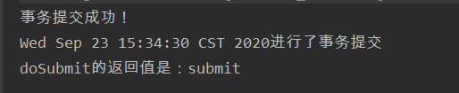
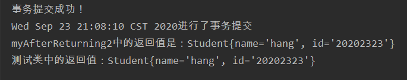
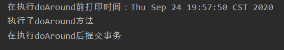
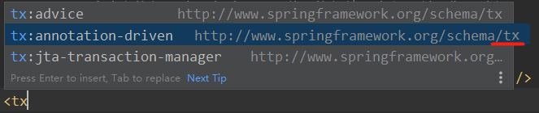
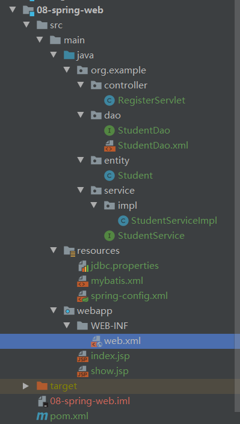

# 1. Spring概述

Spring为简化企业级开发而生，使用Spring开发可以将Bean对象，Dao组件对象，Service组件对象等交给Spring容器来管理，这样使得很多复杂的代码在Spring中开发却变得非常的优雅和简洁，有效的降低代码的耦合度，极大的方便项目的后期维护。

Spring的**核心技术**：`IOC`（控制反转） 和 `AOP`（面向切面编程）。

Spring可管理**依赖** （类a中使用类b的属性或方法，叫做类a依赖类b。）


**Spring优点** 

1. 轻量：Spring框架使用的jar包都比较小，运行时占用的资源少
2. 针对接口编程，解耦合
3. AOP编程的支持
4. 方便集成各种优秀框架


Spring框架至今已集成了20多个模块，这些模块分布在以下模块中：

- 数据访问/集成（Data Access/Integration）层
- Web层
- AOP（Aspect Oriented Programming）模块
- 植入（Instrumentation）模块
- 核心容器（Core Container）
- 消息传输（Messaging）
- 测试（Test）模块

体系结构如下图：


# 2. IOC 控制反转

## 2.1 简单介绍

IOC（Inversion of Control）：控制反转，是一个概念、是一个思想。将对象的创建、复制和管理都交给代码外的容器（Spring）实现。

使用 IOC 的原因？

1. 即使减少代码的改动也可以实现不同的功能。
2. **实现解耦合**。


专业名词解释：

**“控制”**：创建对象、对象属性的赋值，对象之间的关系管理。

**“正转”**：开发人员使用new主动创建对象。

**“反转”**：将创建对象的权限转移给代码之外的容器，由容器来创建对象。

**“容器”**：实际上是一个map，里面存放各种对象（xml里配置的bean节点、@repository、@controller等注解修饰的对象），在项目启动的时候会读取配置文件里面的bean节点 / 扫描到拥有上述注解的类，根据全限定类名使用反射技术创建对象放到map里。


IOC既然是一个思想，那么肯定有落地的技术来实现它。

IOC的技术实现是`DI`（Dependency Injection **依赖注入**），只需要在程序中提供要使用的对象名即可，其他都交给容器实现。比如**Spring底层自动创建对象，其原理是利用了Java反射的机制**。


IOC思想的体现：比如 `Servlet` 在浏览器中的创建。我们只需要在`web.xml`中使用`<servlet-name>跟<servlet-class>`标签来注册`Servlet` ，然后Tomcat服务器会自动创建`Servlet` 对象。所以，Tomcat也可以叫做容器。


## 2.2 Spring的第一个程序

1. 创建maven项目并在`pom.xml`中加入spring的**maven依赖** 

   ```xml
   <dependency>
     <groupId>org.springframework</groupId>
     <artifactId>spring-context</artifactId>
     <version>5.2.8.RELEASE</version>
   </dependency>
   ```

2. 创建所需的类/接口

   ```java
   // 创建接口
   package org.example.service;
   
   public interface Demo {
       void example();
   }
   ```

   ```java
   // 实现接口
   package org.example.service.Impl;
   
   import org.example.service.Demo;
   
   public class DemoImpl implements Demo {
       @Override
       public void example() {
           System.out.println("执行了example方法");
       }
   }
   ```

3. 在resources目录下创建spring的配置文件，在`<beans>`标签中声明类的信息

   

   ```xml
   <?xml version="1.0" encoding="UTF-8"?>
   <!--
       spring的配置文件
           beans是根标签，里面存储了java对象
           spring-beans.xsd是约束文件，和mybatis中的dtd一样
   -->
   <beans xmlns="http://www.springframework.org/schema/beans"
          xmlns:xsi="http://www.w3.org/2001/XMLSchema-instance"
          xsi:schemaLocation="http://www.springframework.org/schema/beans
          http://www.springframework.org/schema/beans/spring-beans.xsd">
   
       <!--  声明bean，告诉spring要创建哪个类的对象(一个bean只能声明一个对象)
               id：对象的自定义名称（唯一）
               class：类的全限定名称，不能是接口。
       -->
       <bean id="demo" class="org.example.service.Impl.DemoImpl"/>
   
   </beans>
   ```

   **tips：**spring把创建好的对象放入到**map**中，springMap.put(id, 对象);
               例如：`springMap.put("demo", new DemoImpl());` 

4. 创建spring容器对象（**在创建spring容器的时候会创建配置文件中所有的对象。默认调用类的无参构造方法**。）

5. spring容器对象使用getBean获取到想要的对象

6. 使用对象

   ```java
       @Test
       public void shouldAnswerWithTrue()
       {
           // 手动创建对象
   //        DemoImpl d = new DemoImpl();
   //        d.example();
   
           // spring自动创建对象
           // 1.指定spring配置文件的名称
           String config = "beans.xml";
           // 2.创建表示spring容器对象
           ApplicationContext ac = new ClassPathXmlApplicationContext(config);
           // 3.从容器中获取对象getBean(id)
           DemoImpl d = (DemoImpl) ac.getBean("demo");
           // 4.使用对象
           d.example();
       }
   ```

   【注意】

   1. `ApplicationContext`是一个接口，不能直接new，所以要new它的实现类，其中`ClassPathXmlApplicationContext` 最常用。
   
   
   
   2. **spring中的对象默认都是单例** 
   
   

2.3 DI入门
---

还记得吗，DI（依赖注入）表示创建对象、给属性赋值。

DI的实现方式有两种：

1. **基于XML**：在spring的配置文件中，使用标签和属性来实现。
2. **基于注解**：使用spring中的注解来完成属性赋值。（常用）


DI的语法分类：

1. set注入：spring调用类的set方法来实现属性的赋值。
   1. 简单类型
   2. 引用类型
2. 构造注入：spring调用类的有参构造函数完成属性的赋值。

**【注意】set注入仅仅只是调用类的set方法** 


### 2.3.1 XML之set注入

#### 简单类型的set注入

语法：

```xml
<bean id="对象名" class="类的全限定名">
	<property name="属性名" value="属性值" />
	<property name="属性名" value="属性值" />
</bean>
```

**tips**：一个property只能给一个属性赋值。

例子：

配置文件

```xml
<bean id="myStudent" class="org.example.Student">
    <property name="name" value="codeKiang" />
    <property name="age" value="18" />
</bean>

<!--  非自定义类的属性赋值  -->
<bean id="myDate" class="java.util.Date">
    <property name="time" value="2020082899" />
</bean>
```

测试文件

```java
@Test
public void test01(){
    String config = "applicationContext.xml";
    ApplicationContext ac = new ClassPathXmlApplicationContext(config);
    Student s = (Student)ac.getBean("myStudent");
    System.out.println(s);
    
    System.out.println("=========以下为非自定义类的调用======");
    
    Date date = (Date) ac.getBean("myDate");
    System.out.println(date);
}
```

***

#### 引用类型的set注入

语法：

```java
<bean id="对象名" class="类的全限定名称">
    <property name="属性名" ref="bean的id值(对象名称)" />
</bean>
```

例子

Student类：

```java
package org.example.ba02;

public class Student {
    private String name;
    private int age;
    // 引用类型
    private School school;
    
	。。。省略setter/getter方法
}
```

School类：

```java
package org.example.ba02;

public class School {
    private String name;
    private String address;

   。。。省略setter/getter方法
}
```

配置文件：

```xml
<?xml version="1.0" encoding="UTF-8"?>
<beans xmlns="http://www.springframework.org/schema/beans"
       xmlns:xsi="http://www.w3.org/2001/XMLSchema-instance"
       xsi:schemaLocation="http://www.springframework.org/schema/beans http://www.springframework.org/schema/beans/spring-beans.xsd">

    <bean id="myStudent" class="org.example.ba02.Student">
        <property name="name" value="codeKiang" />
        <property name="age" value="18" />
        <!--  引用类型  -->
        <property name="school" ref="school" />
    </bean>
        
    <bean id="school" class="org.example.ba02.School">
        <property name="name" value="清华" />
        <property name="address" value="北京" />
    </bean>
</beans>
```

***

#### 引用类型的自动注入autowire

当一个类中有很多的引用类型时，你不需要写很多的`<property>`标签，spring会根据某些规则自动给引用类型赋值。

> autowire有四个自动注入方式：byName、byType、constructor、autodetect（先使用构造器注入，不行的话是要byType方式）

***

常用两种方式：

1. `byName`（按名称注入）：java类中引用类型的属性名要与`bean`标签的id值一致。

   语法：

   ```xml
   <bean id="对象名" class="类的全限定名称" autowire="byName">
       简单类型的赋值
   </bean>
   ```

   例子：

   ```xml
   <bean id="myStudent" class="org.example.ba02.Student" autowire="byName">
       <property name="name" value="codekiang" />
       <property name="age" value="18" />
       <!-- <property name="school" ref="school" /> -->
   </bean>
       
   <!--  id名跟类中的属性名一致都是school  -->
   <bean id="school" class="org.example.ba02.School">
       <property name="name" value="清华" />
       <property name="address" value="北京" />
   </bean>
   ```

2. `byType` （按类型注入）：java类中引用类型的数据类型和`bean`的class属性是**同源**关系。

   **同源**就是一类的意思：

   1. java类中引用类型的数据类型和`bean`的class值一样。
   2. java类中引用类型的数据类型和`bean`的class值是父子关系。（引用类型的数据类型为父类）
   3. java类中引用类型的数据类型和`bean`的class值是接口与实现类关系。（引用类型的数据类型为接口类型）

   语法：

   ```xml
   <bean id="对象名" class="类的全限定名称" autowire="byType">
       简单类型的赋值
   </bean>
   ```

   例子：

   ```java
   <bean id="myStudent" class="org.example.ba02.Student" autowire="byType">
       <property name="name" value="byType" />
       <property name="age" value="18" />
   <!--  因为属性school的类型是School,所以spring会自动找School类，或者其子类（接口的话还会找其实现类）
         School school = new School();
   -->
   </bean>
   
   <bean id="mySchool" class="org.example.ba02.School">
   	<property name="name" value="清华" />
   	<property name="address" value="北京" />
   </bean>
   ```
- [ ] 思考：如果现在有两个bean，它们的关系为其中一个是父类，另一个为子类，也就是说引用类型是爷爷、父类bean是爸爸、子类bean是儿子，那么根据`byType`自动注入会是什么情况？

  答：编辑器会报错。因为此时spring不知道该创建父类bean还是子类bean。


### 2.3.2 XML之构造注入

构造注入只是调用类的有参构造函数。

语法：（一个`<constructor-arg>`标签只能给一个形参赋值）

```xml
<bean id="对象名" class="类的全限定名称">
    <constructor-arg name="形参名0" value="形参值"/>
    <constructor-arg name="形参名1" value="形参值"/>
    <constructor-arg name="形参名2" ref="bean的id值(对象名称)"/>
</bean>
```

tips：当形参类型为**引用类型**时，需要把`value` 改成`ref`。


### 2.3.3 包含关系的配置文件

当入手一个大项目时，配置文件的内容自然会变多，修改起来不方便，而且大项目往往是团队合作，没道理所有人都对同一个配置文件进行修改，这时使用多个配置文件的思想就诞生了。

可以根据模块或功能的分类来对配置文件进行分配，问题是我们如何将这些文件关联在一起。

答案是 **使用一个主配置文件的`<import>`标签来关联这些“子配置”文件**。

例子：（把上面的student跟school拆开）


`spring-School.xml` 

```xml
<?xml version="1.0" encoding="UTF-8"?>
<beans xmlns="http://www.springframework.org/schema/beans"
       xmlns:xsi="http://www.w3.org/2001/XMLSchema-instance"
       xsi:schemaLocation="http://www.springframework.org/schema/beans http://www.springframework.org/schema/beans/spring-beans.xsd">

<!--  school模块的配置文件  -->
    <bean id="school" class="org.example.ba04.School">
        <property name="name" value="华南理工大学" />
        <property name="address" value="大学城" />
    </bean>
</beans>
```


`spring-Student.xml` 

```xml
<?xml version="1.0" encoding="UTF-8"?>
<beans xmlns="http://www.springframework.org/schema/beans"
       xmlns:xsi="http://www.w3.org/2001/XMLSchema-instance"
       xsi:schemaLocation="http://www.springframework.org/schema/beans http://www.springframework.org/schema/beans/spring-beans.xsd">

<!--  student模块的配置文件  -->
    <bean id="myStudent" class="org.example.ba04.Student" autowire="byName">
        <property name="name" value="hang" />
        <property name="age" value="22" />
    </bean>
</beans>
```


`Total.xml` 

```xml
<?xml version="1.0" encoding="UTF-8"?>
<beans xmlns="http://www.springframework.org/schema/beans"
       xmlns:xsi="http://www.w3.org/2001/XMLSchema-instance"
       xsi:schemaLocation="http://www.springframework.org/schema/beans http://www.springframework.org/schema/beans/spring-beans.xsd">

	<!--  主配置文件：关联其他配置文件,一般不定义其他对象  -->
    <import resource="classpath:ba04/spring-School.xml" />
    <import resource="classpath:ba04/spring-Student.xml" />
</beans>
```

【注意】 `classpath:` 表示类路径。即告诉spring要去class文件下去找该文件。

通配符`*`：表示匹配任何字符。如**Total.xml**的第七八行的代码等价于`<import resource="classpath:ba04/spring-*.xml" />` 。需要注意的是，**主配置文件的名字不能跟通配符匹配，否则会陷入死循环。（循环调用主配置文件）** 


### 2.3.4 注解

spring还可以使用注解的方式来完成对象的创建，属性的赋值。需要**注意**的是，使用注解时需要使用到`spring-aop`的依赖。

***

注解的实现步骤

1. 加入依赖（加入spring-context依赖的时候自动加入了spring-aop依赖）

2. 创建类，在类中加入注解

   ```java
   @Component
       语法：@Component(value = "对象名")
       	可以省略value，即 @Component("对象名")
       	可以不传value：即@Component，默认是首字母小写的类名
   ```

3. 创建spring的配置文件

   声明组件扫描器的标签，指明注解在项目中的位置。

   ```java
   <!--  声明组件扫描器
       base-package：指定注解在你项目中的包名
       工作方式：spring会扫描遍历base-package指定的包中所有的类，找到类中的注解，
       		按照注解的功能创建对象/给属性赋值
   -->
   <context:component-scan base-package="componentDemo" />
   ```

4. 创建容器，使用对象。


组件扫描器扫描多个包的方式：

1. 分隔符 `;`或`,`：`<context:component-scan base-package="com.package1;com.package2" />` 
2. 指定父包：`<context:component-scan base-package="com" />`


#### 创建对象的几个注解

`@Component`：作用于类，创建普通bean对象，以下注解都是基于此注解扩展的。

`@Repository`：作用于持久层类，表示创建dao对象

`@Service`：作用于业务层类，创建service对象

`@Controller`：作用于控制器类，创建控制器对象，相当于servlet


#### 简单类型赋值

 `@Value(value = "属性值")` 简单类型赋值

属性：value是String类型，简单类型的属性值。（可省略）

位置：

1. 在属性定义的上面，无需set方法。（推荐）
2. 在set方法的上面

```java
package ba02;

import org.springframework.beans.factory.annotation.Value;
import org.springframework.stereotype.Component;

@Component("myStudent")
public class Student {

    @Value(value="codeKiang")
    private String name;
    private int age;

    @Value("28")
    public void setAge(int age) {
        System.out.println("调用了setAge");
        this.age = age;
    }

    @Override
    public String toString() {
        return "Student{" +
                "name='" + name + '\'' +
                ", age=" + age +
                '}';
    }
}
```


#### 引用类型赋值 

使用注解对引用类型的赋值有两种方法：`@Autowired` 和 `@Resource` 

***

`@Autowired`：Spring提供的注解，使用的是**自动注入**原理。**默认使用的是byType自动注入** 

属性：`required` 是一个boolean类型，**默认为true** 表示当引用类型赋值失败时，程序会报错，并终止执行。

位置：属性定义的上面或set方法的上面。


例子：

先创建school对象

```java
package ba03;

import org.springframework.beans.factory.annotation.Value;
import org.springframework.stereotype.Component;

@Component
public class School {
    @Value("华南理工大学")
    private String name;
    @Value("大学城")
    private String address;

    @Override
    public String toString() {
        return "School{" +
                "name='" + name + '\'' +
                ", address='" + address + '\'' +
                '}';
    }
}
```

再使用@Autowired给school属性赋值

```java
package ba03;

import org.springframework.beans.factory.annotation.Autowired;
import org.springframework.beans.factory.annotation.Value;
import org.springframework.stereotype.Component;

@Component("myStudent")
public class Student {

    @Value("杭")
    private String name;
    @Value("22")
    private int age;
    @Autowired
    private School school;

    @Override
    public String toString() {
        return "Student{" +
                "name='" + name + '\'' +
                ", age=" + age +
                ", school=" + school +
                '}';
    }
}
```

***

如果使用`@Autowired`的时候想要使用`byName`的方式给属性赋值呢？此时还需要用到另一个注解`@Qualifier(value = "bean的id")` ，同理value可以省略。

例子：

创建school对象

```java
package ba03;

import org.springframework.beans.factory.annotation.Value;
import org.springframework.stereotype.Component;

@Component("mySchool")
public class School {
    @Value("华南理工大学")
    private String name;
    @Value("大学城11")
    private String address;

    @Override
    public String toString() {
        return "School{" +
                "name='" + name + '\'' +
                ", address='" + address + '\'' +
                '}';
    }
}
```

使用`byName`的方式给属性赋值

```java
package ba03;

import org.springframework.beans.factory.annotation.Autowired;
import org.springframework.beans.factory.annotation.Qualifier;
import org.springframework.beans.factory.annotation.Value;
import org.springframework.stereotype.Component;

@Component("myStudent")
public class Student {

    @Value("杭")
    private String name;
    @Value("22")
    private int age;
    @Autowired
    @Qualifier("mySchool")   // 这两个注解无先后顺序
    private School school;

    @Override
    public String toString() {
        return "Student{" +
                "name='" + name + '\'' +
                ", age=" + age +
                ", school=" + school +
                '}';
    }
}
```

***

注解对引用类型的赋值的第二种方式：`@Resource` 

此注解是来自jdk的注解，并不是来自spring的。spring只是提供了对这个注解的支持，所以spring可以使用该注解对引用类型赋值。

此注解**默认使用byName自动注入**。如果byName的方式赋值失败，则会使用byType自动注入。

那如何让`@Resource` 只使用byName自动注入？答：`@Resource(name="bean的id")`

例子：

```java
import org.springframework.beans.factory.annotation.Value;
import org.springframework.stereotype.Component;

@Component
public class School {
    @Value("华南理工大学")
    private String name;
    @Value("大学城Resource")
    private String address;

    @Override
    public String toString() {
        return "School{" +
                "name='" + name + '\'' +
                ", address='" + address + '\'' +
                '}';
    }
}
```

```java
import org.springframework.beans.factory.annotation.Value;
import org.springframework.stereotype.Component;
import javax.annotation.Resource;

@Component("myStudent")
public class Student {

    @Value("杭")
    private String name;
    @Value("44")
    private int age;
    // @Resource(name = "school") 只使用byName自动注入
    @Resource
    private School school;

    @Override
    public String toString() {
        return "Student{" +
                "name='" + name + '\'' +
                ", age=" + age +
                ", school=" + school +
                '}';
    }
}
```


### 2.3.5 @bean跟@component的区别

@bean跟@component一样都可以注册bean到Spring容器中。

但他们有以下区别：

1. 作用对象不同: @Component 注解作用于**类**，而@Bean注解作用于**方法**。
2. `@Component`通常是通过**类路径扫描**自动注册到Spring容器中。`@Bean` 注解通常是在**方法中定义**产生这个 bean，@Bean告诉Spring这个方法将会返回一个对象，这个对象要注册为Spring应用上下文中的bean。
3. @Bean 注解比 @Component 注解的自定义性更强，而且很多地方我们只能通过 @Bean 注解来注册bean。比如当我们引用第三方库中的类需要装配到 Spring容器时，则只能通过 @Bean来实现

```java
@Configuration
public class WebSocketConfig {
    @Bean
    public Student student(){
        return new Student();
   }
    // 等价于
    @Autowired
    Student student;
}
```


### 2.3.6 小结

IoC的解耦合是实现业务对象之间的解耦合，例如Service跟dao之间的解耦合。

***

xml配置文件和注解的对比

由于xml文件代码量多，比较繁琐，但是由于他与代码是分隔开的，所以它修改起代码来比较简单，因此我们可以在对经常需要改动的地方使用xml配置文件的方式使用依赖注入。

很明显，注解的方式很简单也很简洁，但是它与代码是嵌在一起的，修改起来不方便，因此我们可以在对不需要经常改动的地方使用注解的方式使用依赖注入。


# 3. AOP 面向切面编程

## 3.1 AOP简介

AOP面向切面编程是从动态角度考虑程序运行过程，**其底层采用的是动态代理模式实现的**。也可以说是动态代理的规范化，把动态代理实现的步骤和方式都定义好了，让我们程序员以统一的形式使用动态代理。为什么要统一？因为动态代理太灵活了，A人员可以用一种方式实现此功能，B人员可以使用另一种方式实现，C人员还有第三种方式，这对于开发来说肯定是不允许的。

常用的动态代理方式有两种：`JDK的动态代理`和`CGLIB生成代理`（常用于框架）。

1. JDK的动态代理是使用Proxy、Method、InvocatinHandler创建代理对象。

2. CGLIB代理的生成原理是生成目标类的子类，此子类对象就是代理对象。所以使用CGLIB生成动态代理时，**要求目标类必须能够继承即不是final修饰的类**。

使用AOP的好处可以减少代码纠缠，即交叉业务与主业务逻辑可以分开。例如，转账，在真正转账业务逻辑前后，需要权限控制、日志记录、加载事务、结束事务等交叉业务逻辑，其代码量大且复杂，大大影响了主业务逻辑----转账。

***

专业术语解释：

`Aspect`：切面。给目标类所增加的功能就叫做切面，比如日志、事务。

`JoinPoint`：连接点，指定切面到哪个业务方法。

`Pointcut`：切入点，一个或多个连接点方法的集合。

`Advice`：通知，表示切面功能执行的时间


如何理解面向切面编程？

1. 要以**切面**为核心，分析项目中哪些功能可以用切面的形式去实现它
2. 要合理的安排切面执行的**时间Advice**（在目标方法的前还是后）
3. 要合理的安排切面执行的**位置Pointcut**（在哪个类哪个方法中）


什么时候考虑使用AOP？

1. 当你不知道源码的情况下，要给一个系统中存在的类增加功能时。
2. 给项目中多个类增加相同的功能时。
3. 给业务方法增加事务、日志输出等。


## 3.2 AOP的实现

AOP的技术实现框架有两种：

1. **spring**：其内部实现了AOP规范，可以做AOP的工作。但因为spring的AOP比较笨重，所以一般不用这种方式。
2. **aspectJ**：一个专门做AOP的框架，轻量高效，所以开发中一般都用此方式。spring框架中集合了aspectJ框架，所以spring可以使用aspectJ的功能。


### 3.2.1 aspectJ

aspectJ实现AOP有两种方式：`xml配置文件`跟`注解`。本文中主要介绍注解的方式。

切入点表达式

语法：`execution(访问权限? 返回值类型 包名.类名.?方法名(参数类型) 抛出异常类型?)` 

tips：`?`结尾的都是可选参数。也就是说 **返回值类型** 、**方法名(参数类型)** 是必不可少的。

切入表达式还可以使用通配符：

| 符号 |                             意义                             |
| :--: | :----------------------------------------------------------: |
|  *   |                          任意个字符                          |
|  ..  | 用在方法参数中，表示任意个参数<br />用在包名后，表示当前包及其子包路径 |
|  +   | 用在类名后，表示当前类及其子类<br />用在接口后，表示当前接口及其实现类 |

- [ ] 练习

`execution(public * * (..))` 指定切入点为 **任意公共的方法**，即返回类型任意 方法名任意 参数任意

`execution(* set*(..))` 指定切入点为：**任何一个以“set”开始的方法**

`execution(* com.service..*.*(..))` **指定com.service包或子包下的任意方法都是切入点**。【第二个*代表任意类名，第三个\*代表任意方法名】


切面的执行时间**advice**的五个注解：

1. @Before
3. @Around
3. @AfterReturning
4. @AfterThrowing：异常后执行的切面方法，相当于catch里面的代码。
5. @After：无论如何都会执行的切面方法，相当于finally里面的代码。

**【注意】**下面不进行介绍第四第五注解。


### 3.2.2 前置通知

使用aspectJ的步骤：
1. 新建maven项目，加入spring和aspectJ依赖
3. 创建目标类：接口和其实现类
4. 创建切面类
    在类的上面加入`@Aspect`注解
    在类中定义方法，即切面要执行的代码。
    在切面方法上加入通知注解，例如@Before
    通知注解的value属性中指定切入点表达式execution()，例如@Before(value = “execution(* *(..))”)
5. 使用DI创建对象
    声明**目标**对象和**切面类**对象
    声明aspectJ中的**自动代理生成器标签**，可以完成代理对象的自动创建。


第一步：在`pom.xml`中加入依赖

```xml
<!--  spring的maven依赖  -->
<dependency>
  <groupId>org.springframework</groupId>
  <artifactId>spring-context</artifactId>
  <version>5.2.8.RELEASE</version>
</dependency>
<!-- aspectJ的maven依赖-->
<dependency>
  <groupId>org.springframework</groupId>
  <artifactId>spring-aspects</artifactId>
  <version>5.2.8.RELEASE</version>
</dependency>
```

第二步：

创建接口

```java
package org.example.ba01;

public interface SomeService {
    void doSome();
}
```

创建其实现类

```java
package org.example.ba01;

public class SomeServiceImpl implements SomeService {

    @Override
    public void doSome() {
        System.out.println("喝奶茶了!");
    }
}
```

第三步：编写切面类

```java
package org.example.ba01;

import org.aspectj.lang.annotation.Aspect;
import org.aspectj.lang.annotation.Before;
import java.util.Date;

// 声明当前类为切面类
@Aspect
public class MyAspect {
    // 前置通知
    @Before(value = "execution(public void doSome(..))")
    public void myBefore(){
        System.out.println("你在"+ new Date() + "的时候喝了一杯奶茶！");
    }
}
```

第四步：创建对象

```xml
<?xml version="1.0" encoding="UTF-8"?>
<beans xmlns="http://www.springframework.org/schema/beans"
       xmlns:xsi="http://www.w3.org/2001/XMLSchema-instance" xmlns:aop="http://www.springframework.org/schema/aop"
       xsi:schemaLocation="http://www.springframework.org/schema/beans http://www.springframework.org/schema/beans/spring-beans.xsd http://www.springframework.org/schema/aop https://www.springframework.org/schema/aop/spring-aop.xsd">

    <!--  声明目标对象  -->
    <bean id="someService" class="org.example.ba01.SomeServiceImpl" />
    <!--  声明切面类对象  -->
    <bean id="myAspect" class="org.example.ba01.MyAspect" />
    <!--  声明自动代理生成器：创建代理对象是在内存中完成的，创建代理对象实际是修改目标对象在内存中的结构。
            即最后的目标对象实际是修改结构后的代理对象。
      -->
    <aop:aspectj-autoproxy />

</beans>
```

运行结果：


**tips：**前置通知所修饰的切面方法即`public void myBefore()`，必须用public void修饰。方法参数可有可无。

***

方法参数可有可无，那切面方法的参数是什么呢？是`JoinPoint` 。

`JoinPoint`可以获取到原方法的一些信息，比如方法名称、方法的参数等。

`JoinPoint`必须处于第一个位置的参数。


【注意】这个`JoinPoint` 参数实际是每个通知注解修饰的切面方法都有的一个参数，其他切面如果要使用它的话就要把它放在第一个位置。


### 3.2.3 后置通知

后置通知`@AfterReturning`

- 属性：
          value 切入点表达式
          returning 接收目标方法的返回值
- 特点：
          可以获取到目标方法的返回值，开发人员可以根据返回值来做不同的事情
          可以修改返回值


被后置通知修饰的切面方法特点：

1. public void修饰
2. 有参数，参数为目标方法的返回值，类型推荐写`Object`。参数名要与returning的属性值一致


创建接口

```java
package org.example.ba02;

public interface SomeService {
    String doSubmit();
}
```

接口的实现类

```java
package org.example.ba02;

public class SomeServiceImpl implements SomeService {
    @Override
    public String doSubmit() {
        System.out.println("事务提交成功！");
        return "submit";
    }
}
```

切面类

```java
package org.example.ba02;

import org.aspectj.lang.annotation.AfterReturning;
import org.aspectj.lang.annotation.Aspect;
import org.aspectj.lang.annotation.Before;
import java.util.Date;

// 声明当前类为切面类
@Aspect
public class MyAspect {
    @AfterReturning(value = "execution(* *..ba02.*.do*(..))", returning = "res")
    public void myAfterReturning(Object res){
        System.out.println(new Date() + "进行了事务提交");
        System.out.println("doSubmit的返回值是："+res);
    }
}
```

【注意】

1. returning的属性值与方法的形参名一致都是res。
2. `* *..ba02.*.do*(..)` 表示任意返回类型 任意包下的 ba02包下的 任意类下的 以do开头的 方法


配置文件

```xml
<?xml version="1.0" encoding="UTF-8"?>
<beans xmlns="http://www.springframework.org/schema/beans"
       xmlns:xsi="http://www.w3.org/2001/XMLSchema-instance" xmlns:aop="http://www.springframework.org/schema/aop"
       xsi:schemaLocation="http://www.springframework.org/schema/beans http://www.springframework.org/schema/beans/spring-beans.xsd http://www.springframework.org/schema/aop https://www.springframework.org/schema/aop/spring-aop.xsd">

    <!--  声明目标对象  -->
    <bean id="someService" class="org.example.ba02.SomeServiceImpl" />
    <!--  声明切面类对象  -->
    <bean id="myAspect" class="org.example.ba02.MyAspect" />
    <aop:aspectj-autoproxy />

</beans>
```

运行结果：




后置通知修改返回值：

实现类

```java
@Override
public Student doSubmit2() {
    System.out.println("事务提交成功！");
    Student stu = new Student("codekiang", "201810089");
    return stu;
}
```

切面类

```java
    @AfterReturning(value = "execution(* *..ba02.*.doSubmit2(..))", returning = "res")
    public void myAfterReturning2(Student res){
        System.out.println(new Date() + "进行了事务提交");
        res.setId("20202323");
        res.setName("hang");
        System.out.println("myAfterReturning2中的返回值是："+res);
    }
```



可以看到修改是成功的。其实这个道理就跟方法传参一样，当你传递的是不可变参数时，则无论你在切面类如何进行改动都不会改变其返回值。当你传递的是引用类型的参数时，你只有在不改变指针指向的情况下才可以修改返回值。


使用`JoinPoint`参数：


### 3.2.4 环绕通知

后置通知`@Around`

- 属性：
      value 切入点表达式

- 特点：
  是功能最强的通知。可以在目标方法前后增强功能。经常用于事务操作。

  可控制目标方法是否调用

  修改目标方法的执行结果，影响最后的调用结果

  等同于jdk动态代理的InnovationHandler接口


被环绕通知修饰的切面方法特点：

1. public void修饰

2. 固定参数：`ProceedingJoinPoint` 

   作用：等同于jdk动态代理的Method

3. 返回值：目标方法的执行结果，可以被修改


接口

```java
package org.example.ba03;

public interface SomeService {
    void doAround();
}
```

实现类

```java
package org.example.ba03;

public class SomeServiceImpl implements SomeService {

    @Override
    public void doAround() {
        System.out.println("执行了doAround方法");
    }
}
```

切面类

```java
package org.example.ba03;

import org.aspectj.lang.ProceedingJoinPoint;
import org.aspectj.lang.annotation.Around;
import org.aspectj.lang.annotation.Aspect;
import java.util.Date;

@Aspect
public class MyAspect {
    @Around(value = "execution(* *..ba03.*.doAround(..))")
    public Object myAround(ProceedingJoinPoint pjp) throws Throwable {
        Object result = null;
        System.out.println("在执行doAround前打印时间："+new Date());
        // 执行目标方法
        pjp.proceed(); // 等价于Method.invoke();
        System.out.println("在执行doAround后提交事务");
        return result;
    }
}
```

运行结果：




 `pjp.proceed();` 为执行目标方法，等价于`Method.invoke();`。


好像ProceedingJoinPoint有点不简单，看看它的源码发现它是继承JoinPoint，也就是说JoinPoint有的它都有。


正是因为它可以根据参数来决定目标方法执不执行或者其他的操作，所以它的功能很强大。


### 3.2.5 管理切入点@Pointcut

如果你的项目有多个切入点表达式是**重复**的，那么你可以使用`@Pointcut`来减少重复代码。

`@Pointcut`属性： value 切入点表达式

特点：当使用`@Pointcut`定义在一个方法的上面，此时此方法的名称就是切入点表达式的别名。在其他通知的value属性中可以直接使用`别名()`代替切入点表达式。

```java
@Aspect
public class MyAspect {
    @Around(value = "mypt()")  // 一定要加上括号！！
    public Object myAround(ProceedingJoinPoint pjp) throws Throwable {
        Object result = null;
        System.out.println("在执行doAround前打印时间："+new Date());
        // 执行目标方法
        pjp.proceed(); // 等价于Method.invoke();
        System.out.println("在执行doAround后提交事务");

        // 有返回值的切面方法都要return
        return result;
    }

    @Around(value = "mypt()")  // 一定要加上括号！！
    public Object myAround2(ProceedingJoinPoint pjp) throws Throwable {
        System.out.println("测试类");
        return null;
    }

    @Pointcut(value = "execution(* *..ba03.*.doAround(..))")
    private void mypt(){
        // 作为别名的函数，不需要代码，修饰符为private
    }
}
```


## 3.3 小结

AOP是面向切面编程，是动态代理的规范化，开发项目时要注意三个点：`切入面功能`、`切入时间`和`切入位置`。

通知注解有5个，其中有三个是最常用的：`@Before`、`@AfterReturning`、`@Around`。

通知注解的value是切入点表达式`execution`，可以搭配通配符使用。

目标类有接口的，使用的是jdk动态代理。目标类没有接口的，spring会自动使用cglib代理。如果你期望目标类有接口时依旧使用cglib代理，则需要在配置文件的自动代理生成器标签加上一点东西：`<aop:aspectj-autoproxy proxy-target-class="true" />` 


# 4. Spring与Mybatis的整合

Mybatis的学习日记在我的另一篇博客：[Mybatis学习日记（全）](https://blog.csdn.net/weixin_43521592/article/details/107324255)

在这里简单回顾下Mybatis的使用步骤：

1. 读取主配置文件，创建SqlSessionFactory对象

   最基本的配置文件应该有数据库信息、mapper文件的位置。

2. 使用openSession()方法获取SqlSession对象

3. 使用getMapper()方法获取到dao对象

4. 使用dao对象

***

整合思路：我们手动创建基本所需的类与配置文件，创建对象（SqlSessionFactory，dao）的活都交给spring来实现，另外数据库连接池的部分也交由spring，我们只需要使用service对象调用dao完成数据访问。


实现步骤：

1. 创建项目，加入maven依赖

   spring依赖、mybatis依赖、mysql驱动依赖、spring事务的依赖。

   mybatis与spring继承的依赖：用来在项目中创建mybatis的SqlSessionFactory、dao对象的。

2. 创建实体类

3. 创建dao接口和mapper文件

4. 创建mybatis主配置文件

5. 创建service接口和实现类，属性是dao

6. 创建spring主配置文件：声明mybatis的对象交给spring创建

   数据源、SqlSessionFactory、dao对象、声明自定义的Service

7. 创建测试类，通过Service对象调用dao完成数据访问


案例

先看看案例项目的结构


第一步：在`pom.xml`中加入依赖

```xml
<dependencies>
  <dependency>
    <groupId>junit</groupId>
    <artifactId>junit</artifactId>
    <version>4.11</version>
    <scope>test</scope>
  </dependency>
  <!--  spring的maven依赖  -->
  <dependency>
    <groupId>org.springframework</groupId>
    <artifactId>spring-context</artifactId>
    <version>5.2.8.RELEASE</version>
  </dependency>
  <!-- spring事务依赖1 -->
  <dependency>
    <groupId>org.springframework</groupId>
    <artifactId>spring-tx</artifactId>
    <version>5.2.8.RELEASE</version>
  </dependency>
  <!-- spring事务依赖2 -->
  <dependency>
    <groupId>org.springframework</groupId>
    <artifactId>spring-jdbc</artifactId>
    <version>5.2.7.RELEASE</version>
  </dependency>
  <!--  mybatis依赖  -->
  <dependency>
    <groupId>org.mybatis</groupId>
    <artifactId>mybatis</artifactId>
    <version>3.5.1</version>
  </dependency>
  <!--  spring和mybatis的集成依赖  -->
  <dependency>
    <groupId>org.mybatis</groupId>
    <artifactId>mybatis-spring</artifactId>
    <version>1.3.1</version>
  </dependency>
  <!--  mysql驱动依赖  -->
  <dependency>
    <groupId>mysql</groupId>
    <artifactId>mysql-connector-java</artifactId>
    <version>8.0.17</version>
  </dependency>
  <!-- 阿里的数据库连接池  -->
  <dependency>
    <groupId>com.alibaba</groupId>
    <artifactId>druid</artifactId>
    <version>1.1.12</version>
  </dependency>
</dependencies>

<build>
  <resources>
    <resource>
      <directory>src/main/java</directory> <!--所在的目录-->
      <includes>  <!--  包括目录下的.properties跟.xml文件都会进行编译  -->
        <include>**/*.properties</include>
        <include>**/*.xml</include>
      </includes>
      <filtering>false</filtering>
    </resource>
  </resources>
</build>
```

第二步：创建实体Student类

```java
package org.example.entity;

public class Student {
    private int id;
    private String name;
    private String email;
    private int age;

    public Student(){}

    public Student(int id, String name, String email, int age) {
        this.id = id;
        this.name = name;
        this.email = email;
        this.age = age;
    }

    @Override
    public String toString() {
        return "Student{" +
                "id=" + id +
                ", name='" + name + '\'' +
                ", email='" + email + '\'' +
                ", age=" + age +
                '}';
    }
}
```

第三步：dao接口和mapper文件

StudentDao

```java
package org.example.dao;

import org.example.entity.Student;
import java.util.List;

public interface StudentDao {
    List<Student> QueryAllStudent();
    int InsertStudent(Student stu);
}
```

StudentDao.xml

```xml
<?xml version="1.0" encoding="UTF-8" ?>
<!DOCTYPE mapper
        PUBLIC "-//mybatis.org//DTD Mapper 3.0//EN"
        "http://mybatis.org/dtd/mybatis-3-mapper.dtd">

<mapper namespace="org.example.dao.StudentDao">
    <select id="QueryAllStudent" resultType="Student">
        select * from student;
    </select>
    <insert id="InsertStudent" >
        insert into student values(#{id}, #{name}, #{email}, #{age});
    </insert>
</mapper>
```

第四步：创建mybatis主配置文件

mybatis.xml

```xml
<?xml version="1.0" encoding="UTF-8" ?>
<!DOCTYPE configuration
        PUBLIC "-//mybatis.org//DTD Config 3.0//EN"
        "http://mybatis.org/dtd/mybatis-3-config.dtd">

<configuration>
    <!-- settings：控制mybatis全局行为 -->
    <settings>
        <!-- 设置mybatis输出日志 -->
        <setting name="logImpl" value="STDOUT_LOGGING"/>
    </settings>

    <typeAliases>
        <!-- 实体类所在的包名 -->
        <package name="org.example.entity"/>
    </typeAliases>

    <mappers>
        <mapper resource="org/example/dao/StudentDao.xml"/>
    </mappers>
</configuration>
```

第五步：创建service接口和实现类，属性是dao

StudentService

```java
package org.example.service;

import org.example.entity.Student;
import java.util.List;

public interface StudentService {

    List<Student> QueryAllStudent();
    int InsertStudent(Student stu);
}
```

StudentServiceImpl

```java
package org.example.service.impl;

import org.example.dao.StudentDao;
import org.example.entity.Student;
import org.example.service.StudentService;
import java.util.List;

public class StudentServiceImpl implements StudentService {

    private StudentDao studentDao;

    @Override
    public List<Student> QueryAllStudent() {
        return studentDao.QueryAllStudent();
    }

    @Override
    public int InsertStudent(Student stu) {
        return studentDao.InsertStudent(stu);
    }

    public void setStudentDao(StudentDao studentDao) {
        this.studentDao = studentDao;
    }
}
```

第六步：创建spring主配置文件

spring-config.xml

```xml
<?xml version="1.0" encoding="UTF-8"?>
<beans xmlns="http://www.springframework.org/schema/beans"
       xmlns:xsi="http://www.w3.org/2001/XMLSchema-instance"
       xsi:schemaLocation="http://www.springframework.org/schema/beans http://www.springframework.org/schema/beans/spring-beans.xsd">

    <!--  声明数据源，代替mybatis的数据库
            init-method:开始时执行的方法
            destroy-method：结束时执行的方法
    -->
    <bean id="myDataSource" class="com.alibaba.druid.pool.DruidDataSource"
          init-method="init" destroy-method="close">
        <property name="url" value="jdbc:mysql://localhost:3306/ssm?useSSL=false&amp;serverTimezone=UTC" />
        <property name="username" value="root" />
        <property name="password" value="密码" />
        <property name="maxActive" value="20" />
    </bean>

    <!--  声明Mybatis中提供的SqlSessionFactoryBean类，创建SqlSessionFactory  -->
    <bean id="sqlSessionFactory" class="org.mybatis.spring.SqlSessionFactoryBean" >
        <!--  set注入，将数据库连接池赋值给dataSource属性 -->
        <property name="dataSource" ref="myDataSource" />
        <!--  set注入，指定mybatis主配置文件的位置  -->
        <property name="configLocation" value="classpath:mybatis.xml" />
    </bean>

    <!--  使用SqlSession的getMapper(Class)创建dao对象
            MapperScannerConfigurer：在内部调用getMapper(Class)生成每个dao接口的代理对象
                                     需要指定sqlSessionFactory对象的id
      -->
    <bean class="org.mybatis.spring.mapper.MapperScannerConfigurer" >
        <!--  指定sqlSessionFactory对象的id -->
        <property name="sqlSessionFactoryBeanName" value="sqlSessionFactory" />
        <!--  指定dao接口所在的包名
                MapperScannerConfigurer会扫描这个包中的所有接口(多个包用逗号分隔)，
                把每个接口都执行一次getMapper()方法，得到每个接口的dao对象(对象名默认以接口名首字母小写)
         -->
        <property name="basePackage" value="org.example.dao" />
    </bean>

    <!--  声明service  -->
    <bean id="studentService" class="org.example.service.impl.StudentServiceImpl" >
        <!--  set注入，将spring创建的studentDao对象赋值给studentDao属性  -->
        <property name="studentDao" ref="studentDao" />
    </bean>
</beans>
```

测试：

```java
@Test
public void test01()
{
    String config = "spring-config.xml";
    ApplicationContext ac = new ClassPathXmlApplicationContext(config);
    // 获取到service对象
    StudentService std = (StudentService) ac.getBean("studentService");
    List<Student> students = std.QueryAllStudent();
    students.forEach(x -> System.out.println(x));
}
```


在实际开发中，我们一般是把数据库信息单独放在一个以`.properties`为后缀名的文件里，然后在spring的主配置文件中使用，这样方便管理。

如：

创建jdbc.properties文件

```properties
# 注意在文件中的&可以不用转义
jdbc.url = jdbc:mysql://localhost:3306/ssm?useSSL=false&serverTimezone=UTC
jdbc.username = root
jdbc.pwd = 5642818
jdbc.max = 20
```

数据库连接部分变成

```xml
<!--  告诉spring我们数据库信息文件的位置  -->
<context:property-placeholder location="jdbc.properties" />
<bean id="myDataSource" class="com.alibaba.druid.pool.DruidDataSource"
      init-method="init" destroy-method="close">
    <property name="url" value="${jdbc.url}" />
    <property name="username" value="${jdbc.username}" />
    <property name="password" value="${jdbc.pwd}" />
    <property name="maxActive" value="${jdbc.max}" />
</bean>
```


# 5. Spring事务

什么是事务？事务就是一组sql语句，这组语句要么全部执行成功，要么全部执行失败。

在java代码中写程序时，我们一般把事务放在service类的业务方法上。

那使用Spring事务有什么好处呢？spring提供了统一处理事务的模型，能统一使用事务的方式来完成不同数据库访问技术的事务处理。

***

spring处理事务的模型

1. 使用**事务管理器对象**进行事务提交和回滚事务

   事务管理器是一个接口和它的众多实现类

   接口：PlatformTransactionManager，定义了commit、rollback方法

   实现类：

   ​	mybatis对应的实现类为DataSourceTransactionManager

   ​	hibernate对应的实现类为HibernateTransactionManager

   使用：`<bean id="xxx" class="...TransactionManager">` 

2. 声明使用什么样的事务、事务的类型

   1. 指定事务的隔离级别

      **DEFAULT**：使用DB默认的事务隔离级别。Mysql的默认级别是`REPEATABLE_READ`；Oracle默认为`READ_COMMITTED`.

      **READ_UNCOMMITTED**：读未提交

      **READ_COMMITTED**：读已提交

      **REPEATABLE_READ**：可重复读

      **SERIALIZABLE**：串行化

   2. 指定事务的超时时间：一个方法最长的执行时间。若该方法超过了时间，事务就回滚。单位是**秒**。默认值是-1，代表无限时间。（一般使用默认值）

   3. 指定事务的传播行为：控制业务是否有事务，是怎样的事务。

   4. 提交事务，回滚事务的机制

      当业务方法执行成功，没有**运行时异常**，则spring在方法执行完之后提交事务。

      当业务方法抛出运行时异常或ERROR，spring会执行回滚。


5.1 事务传播行为
---

**PROPAGATION_REQUIRED**：指定的方法必须在事务内执行。若当前存在事务，则加入到当前事务中；否则创建一个新事物。（spring默认的传播行为）


**PROPAGATION_REQUIRED_NEW**：总是创建一个事务。若当前存在事务，则将当前事务挂起，重新创建一个新事务，新事务执行完毕才将原事务唤醒。

​	如上述的doSome()跟doOther()；若doSome()的执行有事务，则doOther()会创建一个新事务并将doSome()的事务挂起，直至新事务执行完毕。

**PROPAGATION_SUPPORTS**：指定的方法支持当前事务，但若当前没有事务，则以非事务的方式执行。如doSome()的执行有事务，则doOther()会加入到当前事务；若doSome()的执行没有事务，则doOther()就以非事务的方式执行。

PROPAGATION_NESTED：如果当前存在事务，则在嵌套事务内执行。==当前事务为父事务，本身作为子事务==。父事务回滚子事务一定回滚，子事务回滚父事务不一定回滚。如果当前没有事务，就新建一个事务。

PROPAGATION_NOT_SUPPORTED：以非事务方式执行操作，如果当前存在事务，就把当前事务挂起。

PROPAGATION_MANDATORY：如果当前存在事务，就加入该事务，如果当前不存在事务，就抛出异常。

PROPAGATION_NEVER：以非事务方式执行，如果当前存在事务，则抛出异常。


5.2 事务失效场景
---

1. 数据库引擎不支持事务
2. 注解所在的方法不是public修饰
3. 注解所在的类没有被加载成bean
4. 异常被catch掉
5. 传播行为没有设置正确


5.3 中小型项目的事务处理方案----注解
---

spring使用aop方式给业务方法增加事务的功能。使用`@Transactional`注解给当前方法增加事务，需放在**public**方法的上面；可以给@Transactional注解的属性进行赋值，如具体的隔离级别，传播行为，异常信息等。

使用@Transactional的步骤

1. 主配置文件中声明事务管理器对象。如`<bean id="" class="...DataSourceTransactionManager" />`
2. 使用**`@Transactional`**创建代理对象，给方法增加事务功能


案例：

先看看项目结构


第一步：

在**entity**包中创建实体类

```java
package org.example.entity;

public class Goods {
    private int id;
    private String name;
    private int amount;
    private float price;

    public Goods(){}

    public Goods(int id, int amount) {
        this.id = id;
        this.amount = amount;
    }

 // 省略了getter跟setter
    
    @Override
    public String toString() {
        return "Goods{" +
                "id=" + id +
                ", name='" + name + '\'' +
                ", amount=" + amount +
                ", price=" + price +
                '}';
    }
}
```

```java
package org.example.entity;

public class Sale {
    private int id;
    private int gid;
    private int nums;


    public Sale(){}

    public Sale(int gid, int nums) {
        this.gid = gid;
        this.nums = nums;
    }

 // 省略了getter跟setter

    @Override
    public String toString() {
        return "Sale{" +
                "id=" + id +
                ", gid=" + gid +
                ", nums=" + nums +
                '}';
    }
}
```

第二步：在dao包中创建dao类

```java
package org.example.dao;
import org.example.entity.Goods;

public interface GoodsDao {
    int updateGoods(Goods goods);
    Goods selectGoods(int gid);
}
```

```xml
<?xml version="1.0" encoding="UTF-8" ?>
<!DOCTYPE mapper
        PUBLIC "-//mybatis.org//DTD Mapper 3.0//EN"
        "http://mybatis.org/dtd/mybatis-3-mapper.dtd">

<mapper namespace="org.example.dao.GoodsDao">
    <update id="updateGoods">
        update goods set amount = amount - #{amount} where id=${id};
    </update>

    <select id="selectGoods" resultType="org.example.entity.Goods">
        select * from goods where id=#{gid};
    </select>
</mapper>
```

```java
package org.example.dao;
import org.example.entity.Sale;

public interface SaleDao {
    int insertSale(Sale sale);
}
```

```xml
<?xml version="1.0" encoding="UTF-8" ?>
<!DOCTYPE mapper
        PUBLIC "-//mybatis.org//DTD Mapper 3.0//EN"
        "http://mybatis.org/dtd/mybatis-3-mapper.dtd">

<mapper namespace="org.example.dao.SaleDao">
    <insert id="insertSale">
        insert into sale(gid,nums) value(#{gid}, #{nums});
    </insert>
</mapper>
```

第三步：编写mybatis主配置文件

```xml
<?xml version="1.0" encoding="UTF-8" ?>
<!DOCTYPE configuration
        PUBLIC "-//mybatis.org//DTD Config 3.0//EN"
        "http://mybatis.org/dtd/mybatis-3-config.dtd">

<configuration>
    <!-- settings：控制mybatis全局行为 -->
    <settings>
        <!-- 设置mybatis输出日志 -->
        <setting name="logImpl" value="STDOUT_LOGGING"/>
    </settings>

    <typeAliases>
        <!-- 实体类所在的包名 -->
        <package name="org.example.entity"/>
    </typeAliases>

    <mappers>
        <package name="org.example.dao"/>
    </mappers>
</configuration>
```

第四步：自定义运行时异常类

```java
package org.example.exceptions;

// 自定义运行时异常
public class NotEnoughException extends RuntimeException{
    public NotEnoughException() {
        super();
    }

    public NotEnoughException(String message) {
        super(message);
    }
}
```

第五步：编写service层业务

```java
package org.example.service;

public interface BuyGoodsService {
    void buy(int gid, int nums);
}
```

实现类

```java
package org.example.service.impl;

import org.example.dao.GoodsDao;
import org.example.dao.SaleDao;
import org.example.entity.Goods;
import org.example.entity.Sale;
import org.example.exceptions.NotEnoughException;
import org.example.service.BuyGoodsService;
import org.springframework.transaction.annotation.Transactional;

public class BuyGoodsServiceImpl implements BuyGoodsService {
    private SaleDao saleDao;
    private GoodsDao goodsDao;

    // 事务注解【注意】
    @Transactional
    @Override
    public void buy(int gid, int nums) {
        // 记录销售信息
        Sale sale = new Sale(gid, nums);
        saleDao.insertSale(sale);

        Goods s_goods = goodsDao.selectGoods(gid);
        // 判断商品是否存在或库存是否足够
        if(s_goods == null) throw new NullPointerException(gid+"商品不存在");
        else if(s_goods.getAmount() < nums) throw new NotEnoughException(gid+"商品库存不足");

        // 更新库存
        Goods goods = new Goods(gid, nums);
        goodsDao.updateGoods(goods);
    }

    public void setSaleDao(SaleDao saleDao) {
        this.saleDao = saleDao;
    }

    public void setGoodsDao(GoodsDao goodsDao) {
        this.goodsDao = goodsDao;
    }
}
```

第六步：编写spring主配置文件

```xml
<?xml version="1.0" encoding="UTF-8"?>
<beans xmlns="http://www.springframework.org/schema/beans"
       xmlns:xsi="http://www.w3.org/2001/XMLSchema-instance"
       xmlns:context="http://www.springframework.org/schema/context" xmlns:tx="http://www.springframework.org/schema/tx"
       xsi:schemaLocation="http://www.springframework.org/schema/beans
       http://www.springframework.org/schema/beans/spring-beans.xsd
       http://www.springframework.org/schema/context
       https://www.springframework.org/schema/context/spring-context.xsd
       http://www.springframework.org/schema/tx
       http://www.springframework.org/schema/tx/spring-tx.xsd">

    <!--  告诉spring我们数据库信息文件的位置  -->
    <context:property-placeholder location="jdbc.properties" />
    <bean id="myDataSource" class="com.alibaba.druid.pool.DruidDataSource"
          init-method="init" destroy-method="close">
        <property name="url" value="${jdbc.url}" />
        <property name="username" value="${jdbc.username}" />
        <property name="password" value="${jdbc.pwd}" />
        <property name="maxActive" value="${jdbc.max}" />
    </bean>
    
    <bean id="sqlSessionFactory" class="org.mybatis.spring.SqlSessionFactoryBean" >
        <property name="dataSource" ref="myDataSource" />
        <property name="configLocation" value="classpath:mybatis.xml" />
    </bean>

    <bean class="org.mybatis.spring.mapper.MapperScannerConfigurer" >
        <property name="sqlSessionFactoryBeanName" value="sqlSessionFactory" />
        <property name="basePackage" value="org.example.dao" />
    </bean>
    <!--  声明service  -->
    <bean id="goodsService" class="org.example.service.impl.BuyGoodsServiceImpl" >
        <property name="goodsDao" ref="goodsDao" />
        <property name="saleDao" ref="saleDao" />
    </bean>
    
    <!--  1. 声明事务管理器 -->
    <bean id="transactionManager" class="org.springframework.jdbc.datasource.DataSourceTransactionManager" >
        <!--  连接的数据库，指定数据源  -->
        <property name="dataSource" ref="myDataSource" />
    </bean>
    <!--  2. 开启事务注解驱动，告诉spring使用注解管理事务，创建代理对象
            transaction-manager：事务管理器对象的id
    -->
    <tx:annotation-driven transaction-manager="transactionManager" />
</beans>
```

**【注意】事务注解驱动不要选错** 



`@Transactional`等价于

```java
@Transactional(
        propagation = Propagation.REQUIRED,
        isolation = Isolation.DEFAULT,
        readOnly = false,
    	rollbackFor = {}
)
```

rollbackFor表示发生指定的异常一定回滚。

1. spring框架会首先检查方法抛出异常是不是处于rollbackFor的属性中。若在则不管是什么类型的异常都进行回滚。
2. 如果抛出的异常不在rollbackFor的属性中，spring就会判断该异常是否为运行时异常；如果是，就回滚。

测试：

```java
@Test
public void shouldAnswerWithTrue()
{
    String config = "spring-config.xml";
    ApplicationContext ac = new ClassPathXmlApplicationContext(config);
    BuyGoodsService service = (BuyGoodsService)ac.getBean("goodsService");
    service.buy(1002, 10);
}
```


5.4 大型项目事务处理方案----aspectJ配置文件
---

在大型项目中事务处理使用aspectj框架功能，在spring配置文件中声明类、方法所需要的事务；使事务配置与业务方法完全分离。

实现步骤：

1. 加入依赖，使用aspectJ框架

   ```xml
   <dependency>
       <groupId>org.springframework</groupId>
       <artifactId>spring-aspects</artifactId>
       <version>5.2.8.RELEASE</version>
   </dependency>
   ```

2. 声明事务管理器对象

   ```xml
   <bean id="transactionManager" class="org.springframework.jdbc.datasource.DataSourceTransactionManager">
       <property name="dataSource" ref="myDataSource" />
   </bean>
   ```

3. 声明对应方法需要的事务类型

   ```xml
   <!-- 2.声明业务方法的事务属性（传播行为，隔离级别等） -->
   <tx:advice id="myAdvice" transaction-manager="transactionManager">
       <!--  tx:attributes：配置事务的属性 -->
       <tx:attributes>
           <!--  tx:method：配置要增加事务的方法和该事务的属性
                   name：方法名（不带包和类），可使用通配符*表示任意字符
                   propagation、isolation等等
            -->
           <tx:method name="buy" propagation="REQUIRED" isolation="DEFAULT"/>
           <tx:method name="add*" propagation="REQUIRES_NEW"/>
           <tx:method name="*" read-only="true"/>
       </tx:attributes>
   </tx:advice>
   ```

4. 配置aop，指定哪些类要创建代理

   ```xml
   <!-- 配置aop：即指定哪些包哪些类要应用事务 -->
   <aop:config>
       <!--  配置切入点表达式  -->
       <aop:pointcut id="service" expression="execution(* *..service..*.*(..))"/>
       <!--  配置增强器：关联advice和pointcut  -->
       <aop:advisor advice-ref="myAdvice" pointcut-ref="service" />
   </aop:config>
   ```


# 6.Web项目

## 6.1 简单案例---学生注册

在web项目中，大致流程如下：

1. 创建maven，web项目
2. 在之前的依赖基础上再加入jsp跟servlet依赖
3. 创建需要是实体类，service、controller、dao。
4. 使用ioc在控制层创建service对象，使用service对象调用dao层对象进行数据库访问
5. 配置tomcat服务器，启动项目


案例：



第一步：创建web项目


第二步：在之前的依赖基础上加上jsp跟servlet依赖

```xml
<dependency>
  <groupId>javax.servlet</groupId>
  <artifactId>javax.servlet-api</artifactId>
  <version>3.1.0</version>
</dependency>
<dependency>
  <groupId>javax.servlet.jsp</groupId>
  <artifactId>jsp-api</artifactId>
  <version>2.2.1-b03</version>
</dependency>
```

第三步：拷贝之前项目的dao、entity、service以及resources包

第四步：创建一个jsp发送请求

```java
<%@page contentType="text/html;charset=utf-8" pageEncoding="utf-8" %>
<html>
<body>
    <h2>学生注册</h2>
    <form action="reg" method="post">
        <tr>
            <td>id：</td>
            <td><input type="text" name="id"></td>
        </tr><br>
        <tr>
            <td>姓名：</td>
            <td><input type="text" name="name"></td>
        </tr><br>
        <tr>
            <td>年龄：</td>
            <td><input type="text" name="age"></td>
        </tr><br>
        <tr>
            <td>邮箱：</td>
            <td><input type="text" name="email"></td>
        </tr><br>
        <tr>
            <td><input type="submit" value="提交"></td>
        </tr><br>
    </form>
</body>
</html>
```

第五步：创建controller

```java
package org.example.controller;

import org.example.entity.Student;
import org.example.service.StudentService;
import org.springframework.context.ApplicationContext;
import org.springframework.context.support.ClassPathXmlApplicationContext;
import javax.servlet.ServletException;
import javax.servlet.annotation.WebServlet;
import javax.servlet.http.HttpServlet;
import javax.servlet.http.HttpServletRequest;
import javax.servlet.http.HttpServletResponse;
import java.io.IOException;

@WebServlet(name = "RegisterServlet")
public class RegisterServlet extends HttpServlet {
    protected void doPost(HttpServletRequest request, HttpServletResponse response) throws ServletException, IOException {
        
        int id = Integer.parseInt(request.getParameter("id"));
        String name = request.getParameter("name");
        String email = request.getParameter("email");
        int age = Integer.parseInt(request.getParameter("age"));
        // 创建spring的容器对象
        ApplicationContext ac = new ClassPathXmlApplicationContext("spring-config.xml");
        System.out.println("容器对象信息是========="+ac);

        // 获取service
        StudentService studentService = (StudentService) ac.getBean("studentService");
        Student stu = new Student(id, name, email, age);
        studentService.InsertStudent(stu);
        //页面跳转
        request.getRequestDispatcher("/show.jsp").forward(request, response);
    }

    protected void doGet(HttpServletRequest request, HttpServletResponse response) throws ServletException, IOException {

    }
}
```

第六步：配置web.xml文件（因为项目自带的版本太低了，所以要删掉）

1. 右键删掉web.xml

2. 

3. 先点击减号再点击加号

   

4. 

5. 完美

   

6. 配置servlet

   ```xml
   <?xml version="1.0" encoding="UTF-8"?>
   <web-app xmlns="http://xmlns.jcp.org/xml/ns/javaee"
            xmlns:xsi="http://www.w3.org/2001/XMLSchema-instance"
            xsi:schemaLocation="http://xmlns.jcp.org/xml/ns/javaee http://xmlns.jcp.org/xml/ns/javaee/web-app_4_0.xsd"
            version="4.0">
       <servlet>
           <servlet-name>RegisterServlet</servlet-name>
           <servlet-class>org.example.controller.RegisterServlet</servlet-class>
       </servlet>
       <servlet-mapping>
           <servlet-name>RegisterServlet</servlet-name>
           <url-pattern>/reg</url-pattern>
       </servlet-mapping>
   </web-app>
   ```

第七步：创建显示注册成功的jsp

```jsp
<%@page contentType="text/html;charset=UTF-8" language="java" %>
<html>
<head>
    <title>注册成功</title>
</head>
<body>
    <h2>恭喜你，小宝贝</h2>
</body>
</html>
```

最后一步：配置tomcat服务器

1. 
2. 


6.2 配置监听器
---

到此为止，完成了一个web项目的搭建。但是你会发现，如果你有多个请求，你的容器就会被创建多次，这样很浪费资源，我们只需要一个容器对象就够了。那我们要如何避免这种情况呢？

思路：使用监听器，当全局作用域对象被创建时，创建容器对象并存入到ServletContext

在spring框架中有封装好的工具类`ContextLoaderListener`，可以直接获取到ServletContext。


第一步：加入依赖

```xml
<dependency>
    <groupId>org.springframework</groupId>
    <artifactId>spring-web</artifactId>
    <version>5.2.5.RELEASE</version>
</dependency>
```

第二步：在`web.xml`中注册监听器

```xml
<listener>
    <listener-class>org.springframework.web.context.ContextLoaderListener</listener-class>
</listener>
<!--  注册监听器
        监听器被创建后，会默认读取/WEB-INF/application.xml，即spring主配置文件的路径
            因为容器创建之后要根据主配置文件一一创建对象。
        如何修改默认文件的位置？
            使用context-param标签指定文件的位置
-->
<context-param>
    <!--  contextConfigLocation表示要配置文件的路径  -->
    <param-name>contextConfigLocation</param-name>
    <!--  自定义的文件路径  -->
    <param-value>classpath:spring-config.xml</param-value>
</context-param>
```

第三步：使用框架提供的工具类获取监听器对象

```java
// 手工创建spring的容器对象的方式
//        ApplicationContext ac = new ClassPathXmlApplicationContext("spring-config.xml");
// 使用框架提供的工具类创建容器对象
ServletContext sc = getServletContext();
WebApplicationContext ac = WebApplicationContextUtils.getWebApplicationContext(sc);

System.out.println("容器对象信息是========="+ac);
```

运行项目，多次注册学生信息，发现每次的容器对象都是同一个。


**tips：** 

`WebApplicationContextUtils.getWebApplicationContext(sc);` 内部的执行过程如下：

1. 创建容器对象，执行`ApplicationContext ac = new ClassPathXmlApplicationContext("spring-config.xml"); ` 
2. 把容器对象放入到ServletContext中。`setAttribute`的方式。


7.Spring面试
===

什么是Spring？
---

spring本身是一个框架，同时也提供了对其他框架的整合方案。有着ioc容器的作用，用来装载整体的bean对象，它帮我们管理着bean对象从创建、初始化到销毁的整个生命周期。另外spring也提供了AOP的支持，分离了主业务代码跟交叉业务代码，很大程度上的降低了代码耦合度。


IOC的加载过程
---

IOC（Inversion of Control）：控制反转，是一个思想，将对象的创建、初始化和销毁等操作都交给代码外的容器实现，让容器帮我们管理bean对象整个生命周期，而不需要程序员自己手动的管理。DI依赖注入就是IOC的具体实现。


1. 首先，通过**BeanDefinitionReader** 读取指定的配置文件生成bean的定义信息（BeanDefinition）放到BeanDefinitionMap中，当所有的bean定义信息都生成之后==完成BeanFactory的创建==。BeanFactory是容器的入口，等同于容器。
2. 通过**BeanFactoryPostProcessor**接口的实现类 可以动态的修改BeanDefinition的内容，比如数据库配置文件的占位符`${jdbc.url}` 、`注解`的使用。经过这一步骤之后才形成了**完整BeanDefinition**
3. 创建bean对象，初始化等操作，此时==完成BeanFactory的初始化==。

对应的源码方法示意图如下：


Spring bean的生命周期
---

> bean的创建操作是在createBean()方法中创建

1. 利用反射创建对象

2. 调用populateBean方法，根据xml文件或注解（@Autowired）对属性进行赋值

   - 此时除了容器对象属性，其他属性都完成赋值（bean中可能包含容器对象属性）

3. 根据实现的aware接口调用相关的aware方法，**对应的容器对象属性完成赋值** 

   - ==aware接口是为了使某些自定义对象可以方便的获取到容器对象==。 比如BeanNameAware、BeanFactoryAware、ApplicationContextAware接口，可以根据这些接口进行扩展

4. 调用BeanPostProcessor的BeforeInitial方法

5. 调用init方法

6. 调用BeanPostProcessor的AfterInitial方法，**AOP代理对象**在此生成。

7. 此时拥有完整对象，可以使用

8. 销毁对象

> BeanFactoryPostProcessor：是一个接口，针对整个工厂生产出来的BeanDefinition作出修改或者注册。比如ConfigurationClassPostProcessor处理注解，PropertyPlaceholderConfigurer处理配置文件的占位符。
>
> BeanPostProcessor：是一个接口，可用于bean对象初始化前后进行逻辑增强。


BeanFactory和FactoryBean区别
---

BeanFactory：是IOC容器的核心接口，在它的实现类中装载着整体的bean对象，具有完整的固定的创建bean的流程。

FactoryBean: 是一个bean对象，它可以生产或者修饰bean对象，方式不固定，可自定义。例如给对象创建代理对象。


对AOP的理解
---

aop称为面向切面编程，可以将交叉业务代码跟主业务代码分离开，降低代码耦合。因为aop其实是ioc的一个扩展功能，所以会在**BeanPostProcessor的after**方法中实现。其实现的原理是**动态代理**：JDK或cjlib方式，如果代理的对象实现了某个接口则会优先使用jdk方式创建，否则使用cjlib生成一个子类作为代理。

面向切面编程：

1. 要以**切面**为核心，分析项目中哪些功能可以用切面的形式去实现它
2. 要合理的安排切面执行的**时间Advice**（在目标方法的前还是后）以及切面执行的**位置Pointcut**（在哪个类哪个方法中）

spring会将一个方法中给的所有的通知经过拓扑排序后加入到chain对象（拦截器链）中，chain对象是一个List，第一个元素固定是**ExposeInvocationInterceptor**，第二个元素开始才是通知对象。只有递归完所有的通知才会执行实际方法。


Spring bean的作用域
---

`<bean id="" class="" scope="singleton" />` 设置作用域

1. singleton：默认使用的作用域。每个容器中只有一个bean的实例，单例的模式由BeanFactory自身来维护。
2. prototype：为每一次getBean()提供一个实例。
3. request：为每一个网络请求创建一个实例，在请求完成以后，bean会失效并被垃圾回收器回收。
4. session：与request范围类似，确保每个session中有一个bean的实例，在session过期后，bean会随之失效。
5. global-session：全局作用域，与session大体相同，但仅在**portlet**应用中使用


BeanFactory和ApplicationContext的区别
---

**ApplicationContext是BeanFactory的子接口**，对其进行了许多扩展。

区别：

1. **BeanFactory**通过**懒加载**的方式注入bean，**ApplicationContext**是在容器启动时就**加载了全部**的bean，所以可以在容器启动时就发现存在的配置问题。
2. BeanFactory 和 ApplicationContext都支持 BeanPostProcessor、BeanFactoryPostProcessor的使用，但两者之间的区别是：BeanFactory需要**手动注册**，而Applicationcontext则是**自动注册**。

ApplicationContext扩展的功能：

1. 继承MessageSource，支持国际化
2. 统一的资源文件访问方式
3. 同时加载多个配置文件


依赖注入的两种方式
---

常用的注入方式主要有两种：**构造方法注入**，**setter注入**。

- 构造方法注入：调用构造方法来完成对象赋值

  ```java
  public class Student {
      private Student student;
      
      public Student(Student student) {
          this.Student = student;
      }
  }
  ```

- setter注入：使用setter方法来完成对象赋值

  ```java
  public class Student {
      private Student student;
      
      public void setStudent(Student student) {
         this.student = student;
      }
  }
  ```


autowire自动注入的方式
---

autowire有四个自动注入方式：byName、byType、constructor、autodetect（先使用构造器注入，不行的话是要byType方式）


Spring事务是如何实现的
---

spring事务是基于数据库事务和AOP机制的

1. spring首先会对使用了@Transational 注解的类生成一个代理对象
2. 当代理对象调用方法的时候，会判断该方法上是否加了@Transational注解。
3. 如果加了则利用**事务管理器对象**去连接数据库，然后根据指定的事务传播行为进行相关的操作，比如关闭自动提交，接着执行目标方法，如果没有出现异常则进行提交（afterReturning），否则进行回滚（afterThrowing）。


循环依赖
---

循环依赖：两个或多个对象实例之间构成一个环形调用。比如A依赖B，B依赖A。

```java
@Service
public class TestService1 {
    @Autowired
    private TestService2 testService2;

    public void test1() {
    }
}

@Service
public class TestService2 {
    @Autowired
    private TestService1 testService1;

    public void test2() {
    }
}
```

循环依赖的主要场景：

1. 单例的setter注入。（能解决）
2. 非单例的setter注入。（不能解决）
3. 构造器注入。（不能解决）


### spring怎么检测是否存在循环依赖？

在Bean创建的时候给该Bean做标记，如果递归调用回来发现Bean存在标记，则说明这个bean正在创建中，即产生了循环依赖。


### spring如何解决循环依赖？

==spring通过三级缓存提前暴露对象来解决循环依赖问题==。

> 为什么单例bean可以解决循环依赖？只有单例bean会放到三级缓存中。
>
> 为什么构造器中注入不能解决循环依赖？因为构造方法创建实例，每次都要new一个要构造的实例bean，而A创建时，依赖B，就去创建B，B又依赖了A，这样会无限递归创建。

spring内部有三级缓存：

- **singletonObjects**：一级缓存，是一个ConcurrentHashMap。用于保存实例化完成，且属性完成赋值的bean实例
- **earlySingletonObjects**：二级缓存，是一个ConcurrentHashMap。用于保存实例化完成但还没有初始化的bean实例
- **singletonFactories**：三级缓存，是一个HashMap。用于保存 bean创建工厂（lambda表达式），以便于后面扩展，例如创建代理对象。

首先，在getBean(A)的时候会先从一级缓冲中获取A的实例，如果存在A实例直接返回。否则会去二级缓存中找，找不到则去三级缓存中找。都找不到则创建实例，实例化的时候会**提前暴露**A对象，即把 A的创建工厂 添加到三级缓存。

接着对A对象的属性进行赋值。去一级缓存获取B实例，为空，此时会去各级缓存中找。都找不到则会创建B实例，实例化的时候也**提前暴露**B对象，即把 B的创建工厂 添加到三级缓存。

然后对B对象的属性进行赋值，先去一级缓存中获取A实例，获取为null则逐级往上找，最后找到三级缓存中的A的创建工厂，利用创建工厂获取到A刚实例化的对象，将其放到二级缓存中并返回给B的属性，完成属性赋值。与此同时删除三级缓存中A的创建工厂。

B对象初始化完成之后放入一级缓存中，并且删除二级缓存中的B对象。此时A也可以完成初始化，放入一级缓存中，并且删除二级缓存中的A对象。


> spring中do开头的方法才是真正执行逻辑的方法。


### 为什么需要二级缓存

二级缓存可以分离成熟Bean和纯净Bean(未注入属性)的存放，**保证我们getBean是成熟的Bean**。如果只有一级缓存，那么在多线程下可能会读取到不完整的Bean。


### 为什么需要三级缓存

其实二级缓存就完全可以解决循环依赖的问题了，但是无法解决使用AOP的时候代理对象的创建。**使用三级缓存是为了在使用aop的情形下，注入到其他属性的时候是最终的代理对象**。

在三级缓存中根据bean创建工厂获取刚实例化对象的时候，会先判断该对象是否被AOP代理了，是的话则返回代理对象，将代理对象放到二级缓存中。

二级缓存存储 三级缓存中创建出来的早期Bean， 可以**避免三级缓存重复执行，保证每次得到的对象都是同一个**。如果重复去三级缓存获取早期Bean的话，每次返回的代理对象是不同的。

> 为什么不直接把代理对象放入二级缓存？
>
> 这样就必须在实例化阶段就得执行BeanPosseccor的after方法创建代理对象。如果有三级缓存，则需要初始化的时候才会调用BeanPosseccor的after方法。相当于是延迟初始化。


### 第三级缓存中为什么要添加 `ObjectFactory`对象，直接保存实例对象不行吗？

便于对实例对象进行增强，如果直接放实例对象，那就不能在后续操作中增强对象了。比如创建AOP的代理对象。

