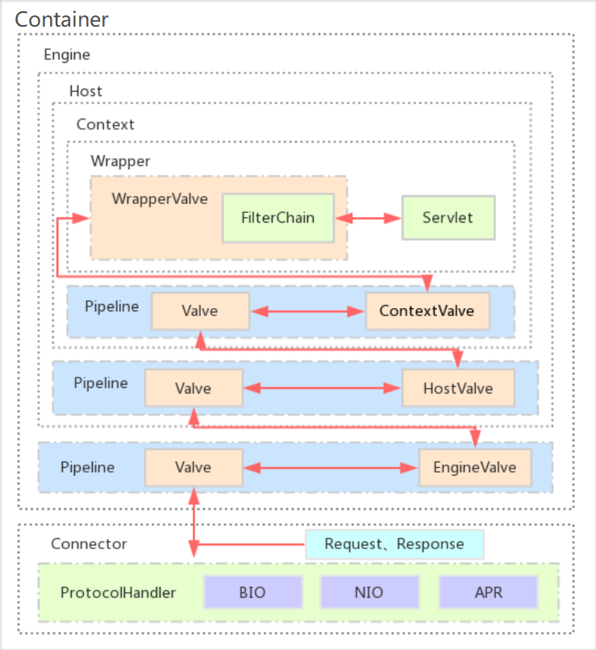

Tomcat
===

部署项目
---

tomcat采用war包部署，是因为jar包的话比较难区别此jar包是应用还是应用依赖的jar包。

Tomcat 的核心功能有两个，分别是负责接收/反馈请求的连接器Connector、负责处理请求的容器 Container。

> TCP协议的实现是操作系统，操作系统提供了方法进行tcp连接，而socket就是该方法暴露在外的一个api。

tomcat采用线程池部署项目。

部署项目的三种方式：

1. webapps文件夹下部署：tomcat默认会扫描该文件夹下的项目

2. server.xml项目映射的部署：在Context标签中指定

   ```xml
   <Context path="/WebProject" docBase="D:/WebProject" reloadable="true" />
   ```

3. 进入tomcat根项目下的`conf\Catalina\localhost`目录下新建一个xml文件，文件名为项目名，在项目名中指定Context标签。

   - 新建`WebProject.xml`，在里面指定`<Context docBase="D:/WebProject" reloadable="true" />` 


Tomcat组成
---

Tomcat 的核心功能有两个，分别是负责接收/响应请求的**连接器** Connector 和 负责处理请求的**容器** Container。其中连接器和容器相辅相成，一起构成了基本的 web 服务 Service。每个 Tomcat 服务器可以管理多个 Service。


### Connector

主要功能：

1. 监听网络端口，接收和响应网络请求。
2. 网络字节流处理。将收到的网络字节流转换成 Request对象 再转成标准的 ServletRequest 给容器，同时将容器传来的 ServletResponse 转成 Response对象 再转成网络字节流。

为满足连接器的主要功能，我们需要一个通讯端点来监听端口；需要一个处理器来处理网络字节流；最后还需要一个适配器将处理后的结果转成容器需要的结构。

- ProtocolHandler：协议处理器，根据不同的协议解析数据，以及根据不同的IO模型来接收数据。
- Endpoint：端点，用来处理socket接收和发送的逻辑。
- Processor：处理器，负责构建Request和Response对象。
- Adapter：适配器，实现Request跟ServletRequest、Response跟ServletResponse之间的转换。


### Container

每个 Service 会包含一个容器。容器由一个引擎可以管理多个虚拟主机；每个虚拟主机可以管理多个 Web 应用；每个 Web 应用会有多个 Servlet 包装器。

- Engine：引擎，用来管理多个站点；
- Host：代表一个站点，也可以叫虚拟主机，通过配置Host就可以添加站点；
- Context：代表一个应用程序，对应着平时开发的应用；
- Wrapper：每一个Wrapper封装着一个Servlet，负责Servlet创建、执行和销毁；

> 我们的Tomcat中默认的配置下webapps下的每一个文件夹都是一个Context，其中ROOT目录中存放着主应用，其他目录存放着子应用，而整个webapps就是一个Host站点


请求过程
---



比如发送`http://localhost:8080/WebDemo/api/user`请求

1. 根据 server.xml 中指定的 Connector的8080端口监听到http请求

2. 解析请求，封装成 Request对象，发送给Container

3. 因为引擎的默认虚拟主机是 localhost，并且虚拟主机的目录是webapps。所以请求找到了 tomcat/webapps 目录。
4. 接着解析到WebDemo是web 程序的应用名，所以会在webapps下找WebDemo文件夹
5. 解析的 api/user 是具体的业务逻辑地址。此时需要从 WebDemo/WEB-INF/web.xml 中找映射关系，最后调用业务 servlet 的对应方法

4. Connector 将 response 流中的数据写到 socket 中