jenkins自动化部署
=================


centos7安装jenkins
------------------

> 由于本人使用Docker安装jenkins时遇到很多坑，所以直接用服务器安装了，坑真的少很多！


#### 第一步：安装jenkins

参考[Jenkins官方安装文档](https://www.jenkins.io/doc/book/installing/linux/) ，找到对应的系统安装方法，这里参考的是`Red Hat / CentOS`的。

根据指令一步步的执行：

```bash
# 安装yum源
sudo wget -O /etc/yum.repos.d/jenkins.repo https://pkg.jenkins.io/redhat-stable/jenkins.repo
# 导入Jenkins的key
sudo rpm --import https://pkg.jenkins.io/redhat-stable/jenkins.io.key
# 更新yum源
sudo yum upgrade
# 安装Jenkins依赖
sudo yum install epel-release
# 如果你想安装jdk11则使用下面命令，否则自己先安装想要的jdk版本
# sudo yum install java-11-openjdk-devel
# 确保JDK安装完成之后再安装jenkins
sudo yum install jenkins
# 刷新系统服务
sudo systemctl daemon-reload
```


#### 第二步：根据配置开启对应的端口以及设置权限

```bash
# 查看Jenkins配置文件
vim /etc/sysconfig/jenkins
```


为了不因为权限出现各种问题，修改目录权限：

```bash
chown -R root:root /var/lib/jenkins
chown -R root:root /var/cache/jenkins
chown -R root:root /var/log/jenkins
```


#### 第三步：启动Jenkins服务

```bash
# 启动Jenkins服务
sudo systemctl status jenkins
# 查看Jenkins服务是否启动成功
sudo systemctl start jenkins
```

接着打开浏览器，输入**IP+端口** 访问：


第一次访问jenkins，需要输入默认秘密。

查找默认密码：`vi /var/lib/jenkins/secrets/initialAdminPassword` 将输出的密码到页面然后登录。

> 如果端口号访问不了，可能是防火墙没有开放端口，可以关闭防火墙或者开放对应端口


#### 第四步：安装插件

1、点击“安装推荐的插件”


2、安装完之后“创建超级管理员账号”


3、登录成功后，可以看到画面如下所示，即表示安装成功


#### 第五步：配置全局路径


配置jdk：


配置git：（若没有安装则自行安装）


安装maven：


#### 第六步：安装Publish Over SSH 插件


插件安装完成之后，在“系统配置”中配置ssh：

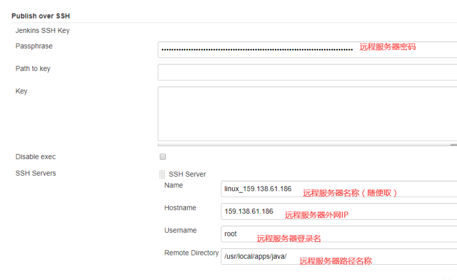


jenkins+gitee远程部署springboot项目
-----------------------------------

> 由于github访问不稳定，经常会访问失败，所以这里使用gitee，操作步骤都类似。

#### 安装Gitee插件

系统管理->插件管理->可选插件->筛选`Gitee`->选中直接安装，安装成功之后重启jenkins服务


#### 添加Gitee链接配置(系统管理->系统配置->Gitee配置)

- 链接名：自己随意定
- Gitee 域名 URL：`https://gitee.com`
- 证书令牌：
  - 点击添加
  - 类型：Gitee API 令牌
  - Gitee APIV5 私人令牌：登录码云情况下，在该浏览器上打开`https://gitee.com/profile/personal_access_tokens`，新增令牌

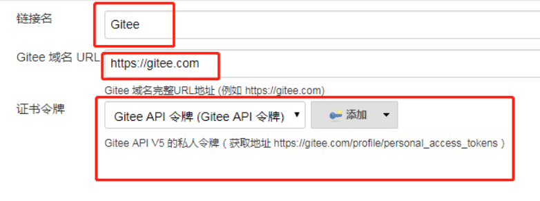

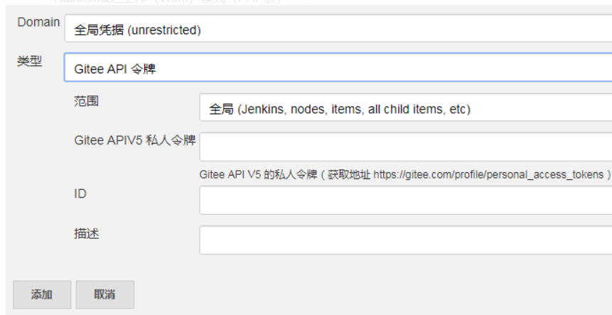


#### 创建一个自由风格的任务

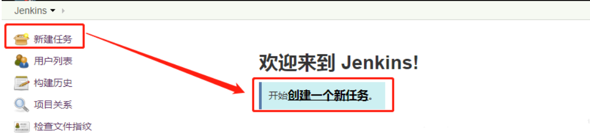

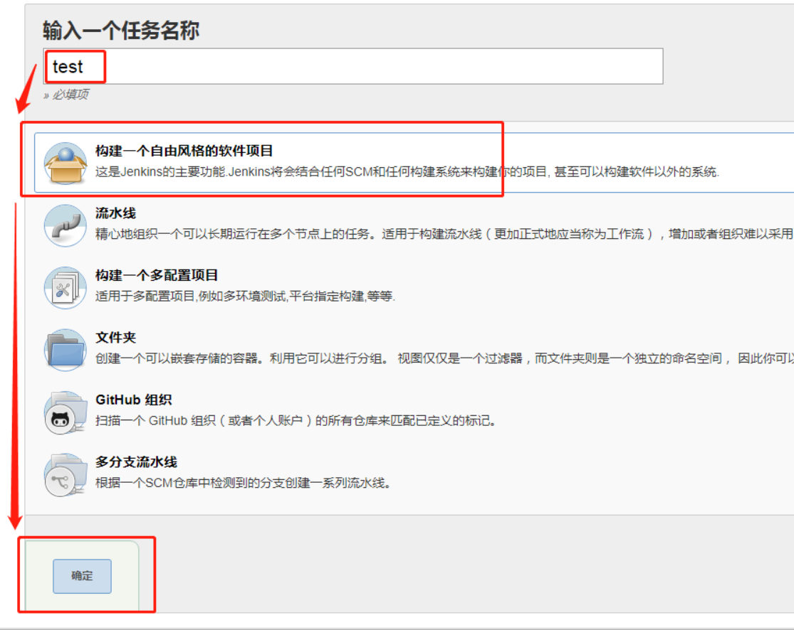

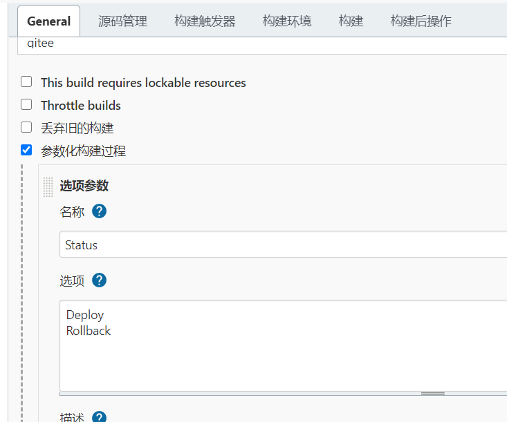

再添加个字符参数接收回滚版本：

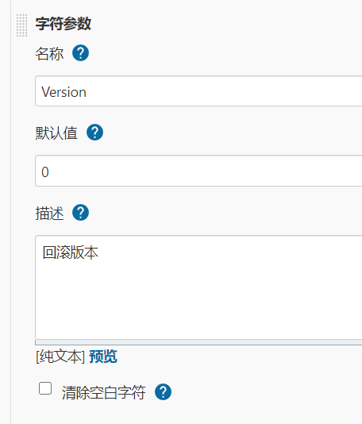


#### 配置仓库

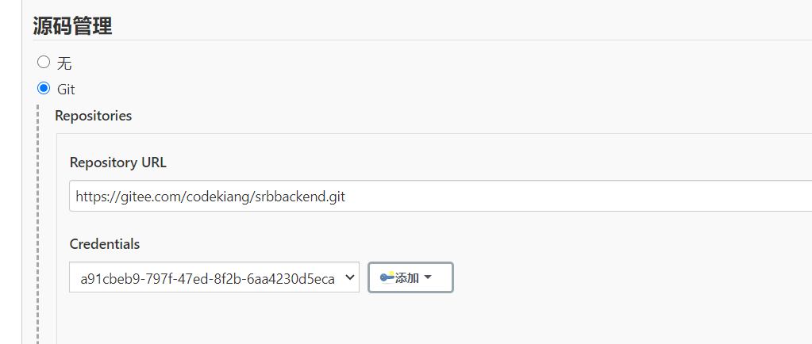

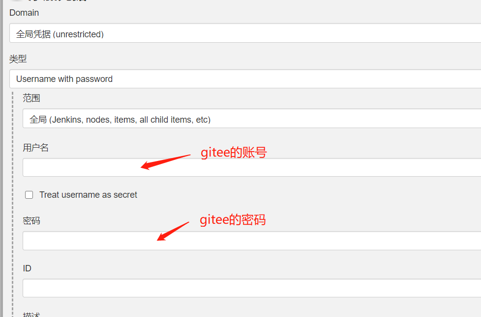


#### 配置触发器

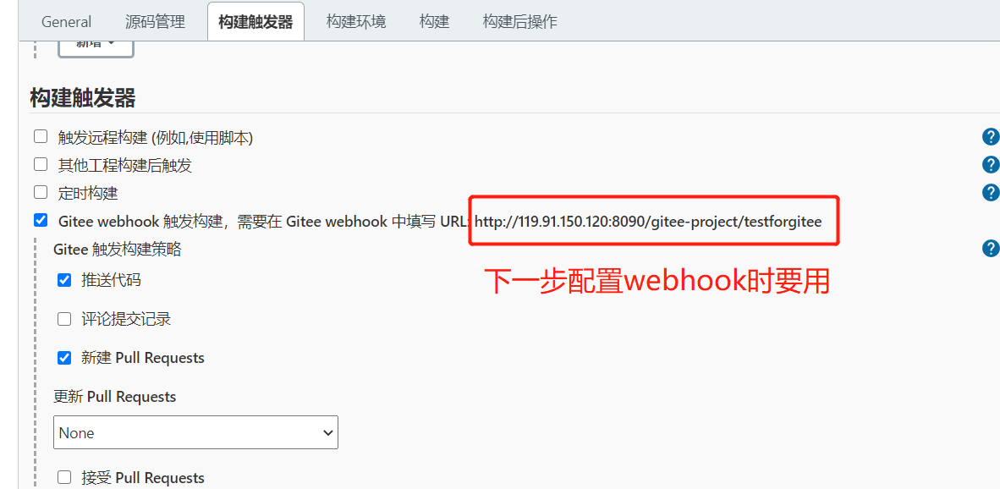

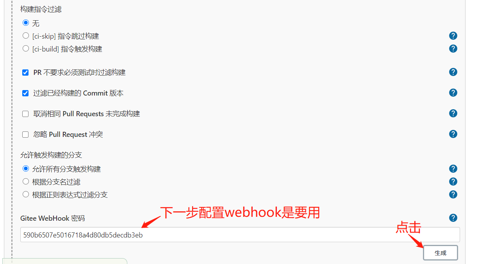


#### 配置webhook

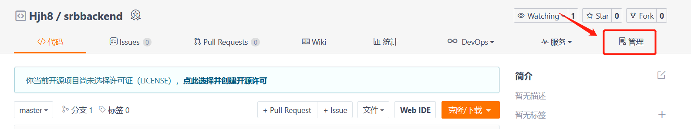

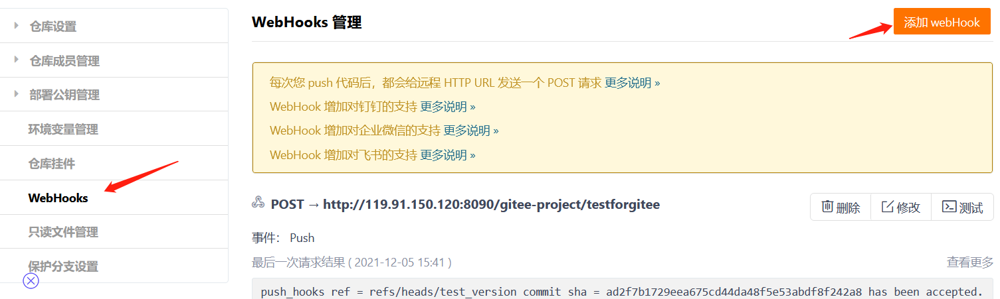

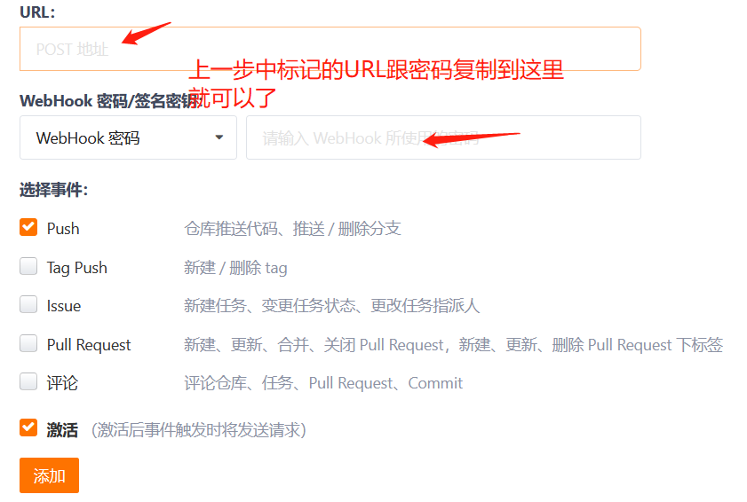


#### 构建maven

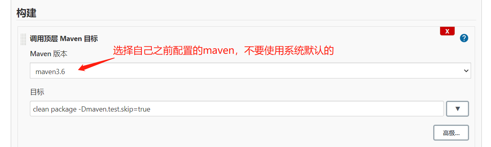

maven命令打包 `clean package -Dmaven.test.skip=true` 


#### 构建后操作

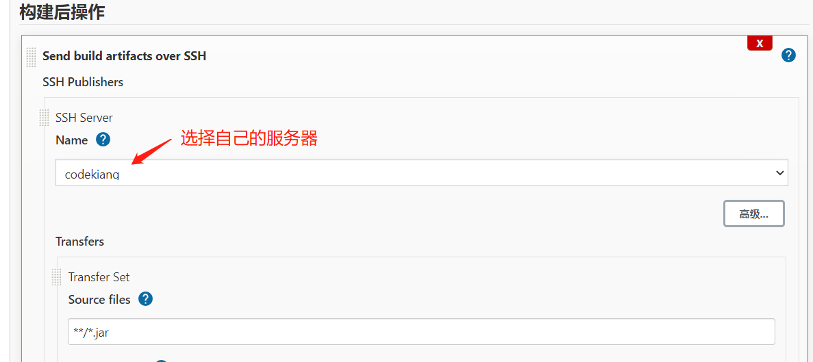

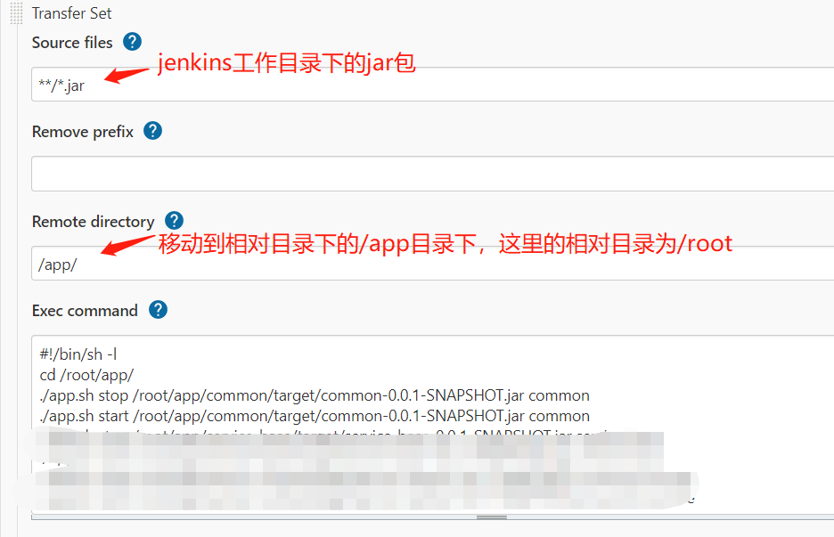

```bash
#!/bin/sh -l
cd /root/app/
./app.sh stop /root/app/common/target/common-0.0.1-SNAPSHOT.jar common
./app.sh start /root/app/common/target/common-0.0.1-SNAPSHOT.jar common
```

点击保存。

接着在app目录下创建`app.sh`文件，内容如下：

```bash
#!/bin/sh -l
#spring boot Jar包目录
APP_NAME=$2
LOG_NAME=$3
PID=$(ps -ef | grep $APP_NAME| grep java| grep -v grep | awk '{print $2}')
#PID=$(jps -l |grep $APP_NAME |awk '{print $1}')

#使用说明，用来提示输入参数
usage() {
    echo "Usage: sh start.sh [start|stop|restart|status] [APP_NAME]"
    exit 1
}
 
#检查程序是否在运行
is_exist(){
  #pid=$(ps -ef | grep $APP_NAME| grep -v grep | awk '{print $2}')
  #如果不存在返回1，存在返回0     
  if [ -z "${PID}" ]; then
    return 1
  else
    return 0
  fi
}
 
#启动方法
start(){
  is_exist
  if [ $? -eq 0 ]; then
    echo "${APP_NAME} is already running. pid=${PID}"
  else
        #这个dontKillMe 是一定要加的，不然jenkins会杀死这个进程，导致服务退出
        BUILD_ID=dontKillMe
        #将日志输出到out，可以自己命名，下面会输出“2021-10-19 23:17:07_log.out”样式的文件
        current_date=`date "+%Y-%m-%d %H:%M:%S"`
    nohup java -jar ${APP_NAME}  >logs/${LOG_NAME}_${current_date}.out 2>&1 &
    if [ $? -eq 0 ]; then
            echo "应用${APP_NAME} 启动成功！pid=$(jps -l |grep $APP_NAME |awk '{print $1}')"
         echo "启动日志输出到:logs/${current_date}_log.out"
      else
        echo "${APP_NAME} 启动失败！"
    fi
  fi
}
 
#停止方法
stop(){
  is_exist
  if [ $? -eq "0" ]; then
   echo "应用${APP_NAME}停止服务!pid=${PID}!"
    kill -9 ${PID}
  else
    echo "${APP_NAME} is not running"
  fi  
}
 
#输出运行状态
status(){
  is_exist
  if [ $? -eq "0" ]; then
    echo "${APP_NAME} is running. Pid is ${PID}"
  else
    echo "${APP_NAME} is NOT running."
  fi
}
 
#重启
restart(){
  stop
  sleep 5
  start
}
 
#根据输入参数，选择执行对应方法，不输入则执行使用说明
case "$1" in
  "start")
    start
    ;;
  "stop")
    stop
    ;;
  "status")
    status
    ;;
  "restart")
    restart
    ;;
  *)
    usage
    ;;
esac
```


#### 开始构建

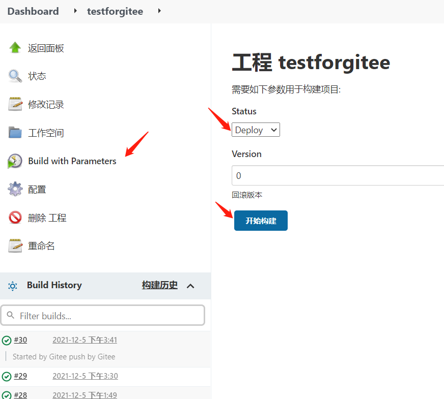


jenkins+gitee远程部署vue
------------------------


