jenkins自动化部署
=================


centos7安装jenkins
------------------

> 由于本人使用Docker安装jenkins时遇到很多坑，所以直接用服务器安装了，坑真的少很多！


#### 第一步：安装jenkins

参考[Jenkins官方安装文档](https://www.jenkins.io/doc/book/installing/linux/) ，找到对应的系统安装方法，这里参考的是`Red Hat / CentOS`的。

根据指令一步步的执行：

```bash
# 安装yum源
sudo wget -O /etc/yum.repos.d/jenkins.repo https://pkg.jenkins.io/redhat-stable/jenkins.repo
# 导入Jenkins的key
sudo rpm --import https://pkg.jenkins.io/redhat-stable/jenkins.io.key
# 更新yum源
sudo yum upgrade
# 安装Jenkins依赖
sudo yum install epel-release
# 如果你想安装jdk11则使用下面命令，否则自己先安装想要的jdk版本
# sudo yum install java-11-openjdk-devel
# 确保JDK安装完成之后再安装jenkins
sudo yum install jenkins
# 刷新系统服务
sudo systemctl daemon-reload
```


#### 第二步：根据配置开启对应的端口以及设置权限

```bash
# 查看Jenkins配置文件
vim /etc/sysconfig/jenkins
```

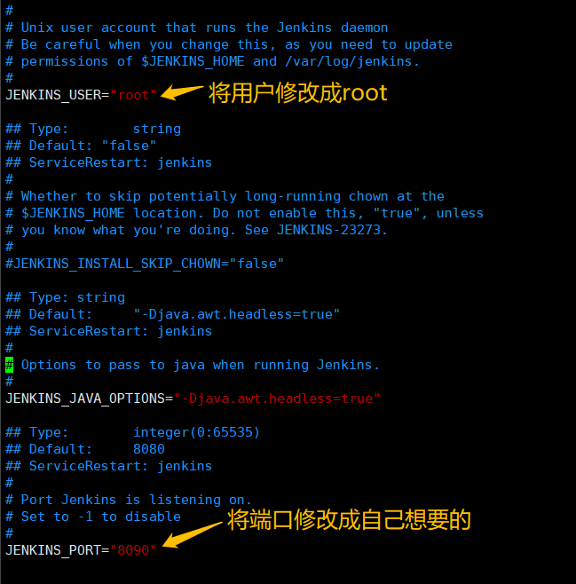

为了不因为权限出现各种问题，修改目录权限：

```bash
chown -R root:root /var/lib/jenkins
chown -R root:root /var/cache/jenkins
chown -R root:root /var/log/jenkins
```


#### 第三步：启动Jenkins服务

```bash
# 启动Jenkins服务
sudo systemctl status jenkins
# 查看Jenkins服务是否启动成功
sudo systemctl start jenkins
```

接着打开浏览器，输入**IP+端口** 访问：

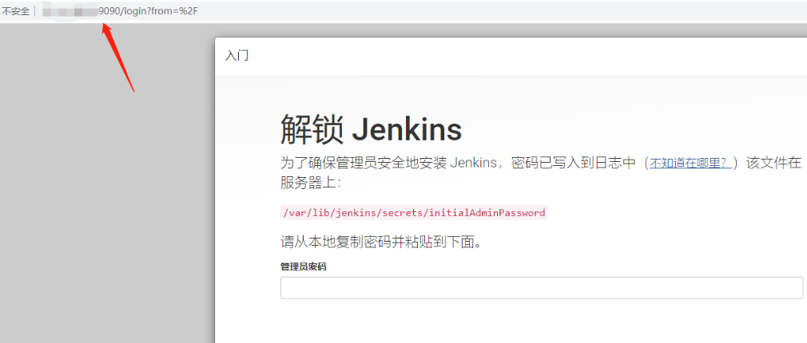

第一次访问jenkins，需要输入默认秘密。

查找默认密码：`vi /var/lib/jenkins/secrets/initialAdminPassword` 将输出的密码到页面然后登录。

> 如果端口号访问不了，可能是防火墙没有开放端口，可以关闭防火墙或者开放对应端口


#### 第四步：安装插件

1、点击“安装推荐的插件”

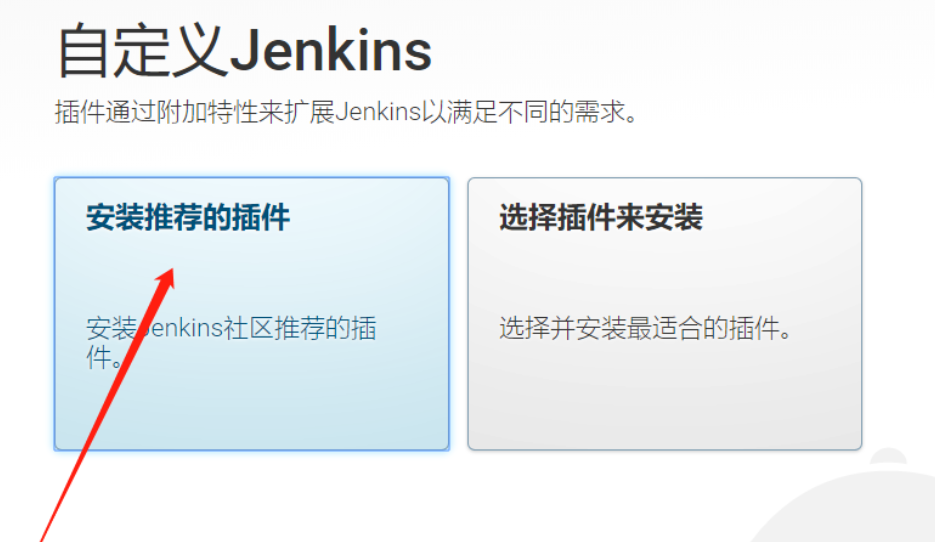

2、安装完之后“创建超级管理员账号”

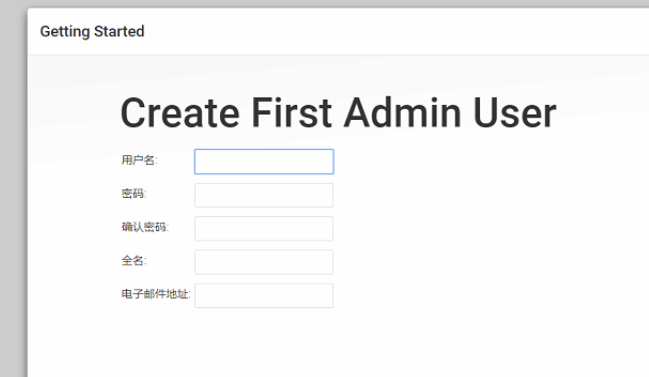

3、登录成功后，可以看到画面如下所示，即表示安装成功

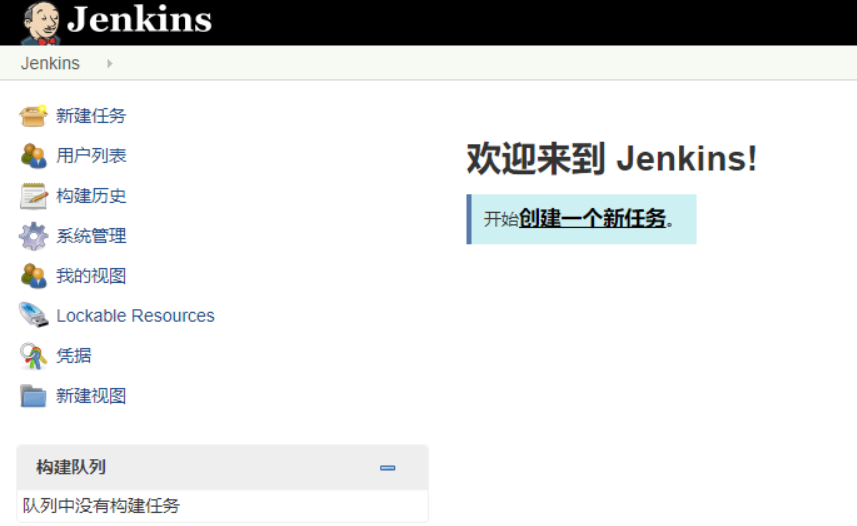


#### 第五步：配置全局路径

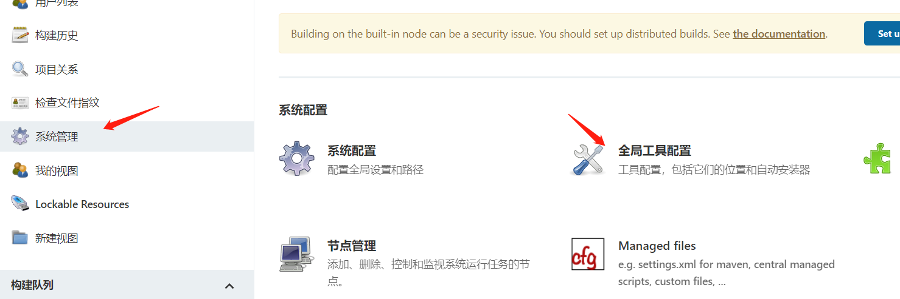

配置jdk：

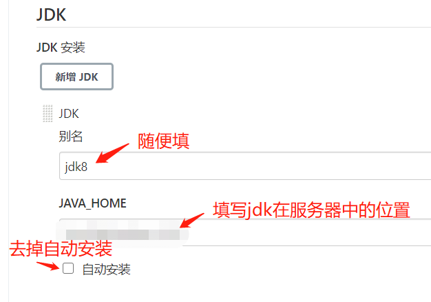

配置git：（若没有安装则自行安装）

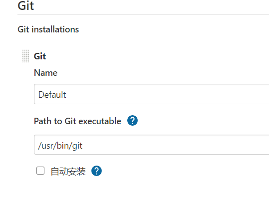

安装maven：

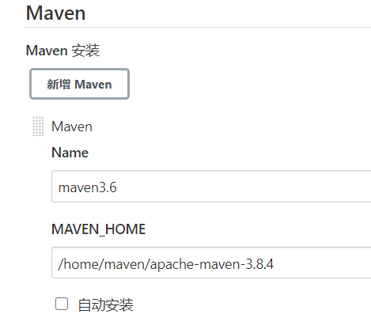


#### 第六步：安装Publish Over SSH 插件

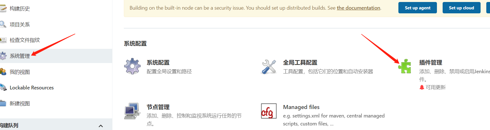

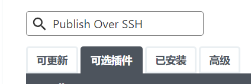