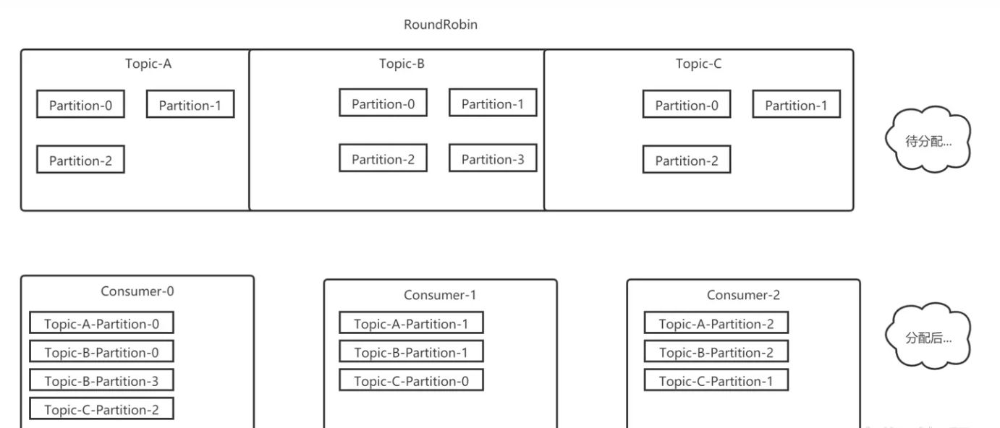
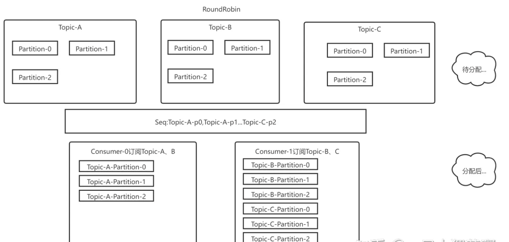
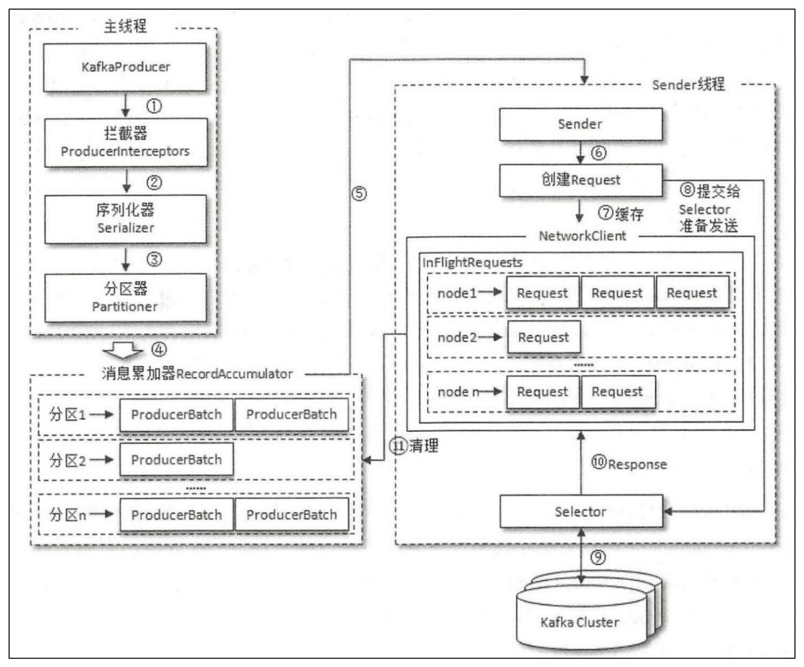

# 什么是 Kafka

kafka是一个分布式的基于发布/订阅模式的消息队列，主要用于大数据的实时收集。目前kafka也用于分布式事件流的处理和分析。主要特点是高吞吐量，低延迟。

- 发布订阅指的是只有订阅了topic的消费者才能收到此topic的消息。

缺点:

- 运维难度大
- 偶尔有数据混乱的情况 ​
- 2.8之前对zookeeper强依赖

# 基本概念


- **Broker** : 和AMQP里协议的概念一样， 就是消息中间件所在的服务器
- **Producer**(生产者): 负责发布消息到Kafka broker
- **Consumer**: 消息消费者，向Kafka broker读取消息的客户端。
- **Consumer Group**（消费者群组） : 每个Consumer属于一个特定的Consumer Group（可为每个Consumer指定group name，若不指定group name则属于默认的group）
- **Topic**(主题) : 每条发布到Kafka集群的消息都有一个类别，这个类别被称为Topic。
- **Partition**(分区) : Partition是物理上的概念，体现在磁盘上面，每个Topic包含一个或多个Partition。
- **replica**(副本)：分区的备份数据，每个分区可以有多个副本，其中必然有一个副本做为leader跟生产者/消费者通信，其他副本作为follower。当leader挂掉之后follower可以成为leader。每个副本存在于不同的Broker中。
- **offset** 偏移量： kafka用来确定消息是否被消费过的标识，在kafka内部体现就是一个递增的数字。

一个topic的消息会发在多个Partition上吗？不会。只会发给一个topic下的某个Partition上。可以理解为topic-Partition才作为一个消息存放的区域。

一个broker可以存放相同topic不同part的leader吗。可以，但不建议。

# ISR、OSR、AR

**AR**（Assigned Replicas） 是指为每个分区分配的副本集合。在Kafka中，每个分区可以有多个副本，其中一个副本被选举为leader，其他副本为follower。AR是指包括leader副本在内的所有副本的集合。

**ISR**（In-Sync Replicas） 是指与leader副本**保持同步**的follower副本集合。只有处于ISR中的副本才会被认为是同步的，其他副本将被视为不可靠的。当follower副本无法及时跟上leader副本的同步进度时，它将被移出ISR，直到它能够追赶上来。**ISR机制确保了数据的一致性和可靠性**。

**OSR**（Out-of-Sync Replicas） 是指与leader副本**不同步**的follower副本集合。当follower副本无法及时跟上leader副本的同步进度时，它将被移出ISR，并被标记为OSR。OSR副本将尝试追赶上来，一旦追赶上来并与leader副本保持同步，它将被重新添加到ISR中。

这些概念在Kafka中用于管理副本的分配和同步，以**确保数据的可靠性和一致性**。

# 生产者API使用

1、引入maven依赖

```xml
<dependency>
    <groupId>org.apache.kafka</groupId>
    <artifactId>kafka-clients</artifactId>
    <version>2.3.1</version>
</dependency>
```

2、使用

```java
import org.apache.kafka.clients.producer.KafkaProducer;
import org.apache.kafka.clients.producer.Producer;
import org.apache.kafka.clients.producer.ProducerRecord;
import java.util.Properties;

public class MyProducer {
    public static void main(String[] args) throws InterruptedException {
    Properties props = new Properties();
    //设置 kafka 集群的地址
    props.put("bootstrap.servers", "doitedu01:9092,doitedu02:9092,doitedu03:9092");
    //ack 模式，取值有 0，1，-1（all） ， all 是最慢但最安全的
    props.put("acks", "all");
    //失败重试次数（有可能会造成数据的乱序）
    props.put("retries", 3);
    //数据发送的批次大小
    props.put("batch.size", 10);
    //一次数据发送请求所能发送的最大数据量
    props.put("max.request.size", 1024);
    //消息在缓冲区保留的时间，超过设置的值就会被提交到服务端
    props.put("linger.ms", 10000);
    //整个 Producer 用到总内存的大小，如果缓冲区满了会提交数据到服务端
    //buffer.memory 要大于 batch.size，否则会报申请内存不足的错误
    props.put("buffer.memory", 10240);
    //序列化器
    props.put("key.serializer", "org.apache.kafka.common.serialization.StringSerializer");
    props.put("value.serializer", "org.apache.kafka.common.serialization.StringSerializer");
    Producer<String, String> producer = new KafkaProducer<>(props);
    for (int i = 0; i < 100; i++){
        // 同步发送
        producer.send(new ProducerRecord<String, String>("test", Integer.toString(i), "dd:"+i));
        producer.close();
    }
}
```


## Acks取值

**生产者ack取值可以决定生产者发消息的可靠性**。

- **0** ： 生产者发出消息后不等待服务端的确认

- **1** ： 生产者发出消息后要求服务端的 分区leader 确保数据存储成功后发送一个确认信息

- **-1**：可以认为all。生产者发出消息后要求服务端的分区的副本全部同步成功后发送一个确认信息

如果需要异步发送消息并异步确认，则可以使用回调：

```java
kafkaProducer.send(new ProducerRecord<String, String>("test", "hello" + i),new Callback() 
    @Override
    public void onCompletion(RecordMetadata metadata, Exception exception) {
        if (metadata != null) {
            System.out.println(metadata.partition()+ "-"+ metadata.offset());
        }
    }
});
```

# 消费者API使用

kfk的消费者是**拉取消息**并进行消费的。消费者在消费的时候，需要指定主题，还可以指定消费的起始偏移量的指定策略。消费者只会负责自己所负责的主题下的partition，例如topicA-0，topicB-1等。

kafka 的 topic 中的消息，是有序号的（消息偏移量），而且消息的偏移量是在各个 partition 中独立维护的，在各个分区内，都是从 0 开始递增编号。

起始偏移量的指定策略有以下 3 种：

1. earliest：让偏移量等于最小

2. latest：让偏移量等于最大

3. 自定义offset：自定义分区号和偏移量

4. 从上一次所记录的偏移量开始消费

kafka 的消费者，可以记录自己所消费到的**消息偏移量**，记录的这个偏移量就叫**消费位移**；

```java
public class MyConsumer {
    public static void main(String[] args) {
    Properties props = new Properties();
    // 定义 kakfa 服务的地址，不需要将所有 broker 指定上
    props.put("bootstrap.servers", "doitedu01:9092");
    // 指定 consumer group
    props.put("group.id", "g1");
    // 是否自动提交 offset
    props.put("enable.auto.commit", "true");
    // 自动提交 offset 的时间间隔
    props.put("auto.commit.interval.ms", "1000");
    // key 的反序列化类
    props.put("key.deserializer", "org.apache.kafka.common.serialization.StringDeserializer");
    // value 的反序列化类
    props.put("value.deserializer", "org.apache.kafka.common.serialization.StringDeserializer");
    // 如果没有消费偏移量记录，则自动重设为起始 offset：latest, earliest, none
    props.put("auto.offset.reset","earliest");
    // 定义 consumer
    KafkaConsumer<String, String> consumer = new KafkaConsumer<>(props);
    // 消费者订阅的 topic, 可同时订阅多个，支持正则匹配
    consumer.subscribe(Arrays.asList("first", "test","test1"));
    // 拉取数据
    while (true) {
        ConsumerRecords<String, String> records = consumer.poll(100);
        for (ConsumerRecord<String, String> record : records){
            System.out.printf("offset = %d, key = %s, value = %s%n", record.offset(), record.key(), record.value());
        }
    }
}
```

消费者订阅主题的方式有两种：

1. subscribe：当消费组的消费者增加或减少时，分区分配关系会自动调整，以实现消费组**再负载均衡**及故障自动转移。

2. assign：不具备消费组**再负载均衡**。


# 生产者分区写入策略

生产者写入消息到topic时，Kafka将依据不同的策略将数据分配到不同的分区中：

1. 指定分区策略：若 Producer 在发送消息时指定了 Partition，就直接发送到这个 Partition，与分区策略无关。若没有指定 Partition 和 Key，就使用以下几个策略

2. 轮询分区策略：若没有指定 Partition 和 Key可以使用此策略。将所有消息依次按顺序发给对应分区。

3. 随机分区策略：将消息随机放到一个分区，可能会出现**数据倾斜**的情况。

4. 按key分区分配策略：按照 key 的 hash 值对Partition的数量取模，选择 Partition

5. 自定义分区策略：实现`org.apache.kafka.clients.producer.Partitioner`接口，在 Kafka 生产者配置中，配置自定义分区器的类名`props.put(ProducerConfig.PARTITIONER_CLASS_CONFIG, KeyWithRandomPartitioner.class.getName())`

# 消费组

**消费组是 kafka 为了提高消费并行度的一种机制**！在 kafka 的底层逻辑中，任何一个消费者都有自己所属的组（如果没有指定则有一个自己默认的组），每条消息只会被组内的某个消费者消费。组跟组之间没有关系，即A组的某个消费者消费了C消息，B组也会收到这个C消息然后交由B组内的某个消费者消费。

KAFKA 中的消费组，可以**动态增减消费者**，当消费组中的消费者数量发生任意变动时会根据**再均衡策略**重新分配每个消费者的消费分区。

## 再均衡策略

再均衡rebalance 是Kafka中用于**重新分配消费者组**（consumer group）**中消费者**（consumer）**和分区**（partition）**之间关系的机制**。也可以说是消费者分区分配策略。

再均衡的触发条件主要有三个：

1. **消费者组内成员发生变更**，这个变更包括了增加和减少消费者。注意这里的减少有很大的可能是被动的，就是某个消费者崩溃退出了

2. **主题的分区数发生变更**，kafka目前只支持增加分区，当增加的时候就会触发再均衡

3. **订阅的主题发生变化**，当消费者组使用正则表达式订阅主题，而恰好又新建了对应的主题，就会触发重平衡

rebalance有一个比较大的问题。那就是在Rebalance过程中，所有的实例都会停止消费，这就导致Rebalance过程中无法提供服务。

Kafka提供了三种再平衡策略：Range（范围）、RoundRobin（轮询）和Sticky（粘性）

### Range

Range 是Kafka中的再均衡衡策略之一，它以单个topic为一个维度来计算分区分配给消费者。这个策略的核心思想是按照字母顺序对消费者和主题的分区进行排序，并确保每个消费者平均获得尽可能多的主题分区。

具体的分配过程如下：

1. 对消费组中的所有消费者按字母排序。  

2. 对topic的分区按照分区号排序。  

3. 计算每个消费者最少应分配的分区数，以及需要多分配分区的消费者数量。

例如一个主题下的分区数有4个，消费者有3个，则每个消费者会分配到1个分区数，剩下的一个分区多分配给第一个消费者：

- consumer-0：partition-0、partition-1
- consumer-1：partition-2
- consumer-2：partition-3

缺点：虽然Range策略在单个主题下表现均衡，但**在处理多个主题时，可能导致消费者排序靠前的负载比排序靠后的负载多很多**。在涉及多个主题的情况下，可以考虑其他再平衡策略以满足不同的负载均衡需求。

### RoundRobin

RoundRobin是一种用于分区分配的策略，它针对所有的主题分区。其工作原理是将所有分区和所有消费者列举出来进行排序，然后通过轮询的方式将每个分区分配给每个消费者。如果某个消费者没有订阅特定主题，那么就跳过该消费者，继续分配给下一个消费者。

RoundRobin是kfk默认的再均衡策略。



这种策略的优点在于简单且公平，每个消费者都有机会获取到每个主题的分区。然而，在实际应用中，**如果消费者的订阅关系不一致，可能导致分配不够均匀**。因此，在使用RoundRobin时，最好确保Consumer Group中的所有消费者具有一致的订阅关系，以获得更好的分区均衡效果。



### Sticky

​Sticky分区策略的原理在于分配的结果具有"粘性"，即在进行新一轮分配之前，**考虑上一次分配的结果，尽量减少分配的变动，以节省开销**。这种策略在Kafka 0.11.x版本中引入

# 消费位移

kafka 的消费者，可以记录自己所消费到的**消息偏移量**，记录的这个偏移量就叫**消费位移**；

Kafka 中默认的消费位移的提交方式是**自动定期提交**，消费者客户端参数 `enable.auto.commit` 配置，默认值为 true 。定期的周期时间由客户端参数 `auto.commit.interval.ms` 配置，默认值为 5 秒，此参数生效的前提是 enable.auto.commit 参数为 true。

自动提交消费位移的方式非常简便，它免去了复杂的位移提交逻辑，让编码更简洁。但随之而来的是**重复消费**和**消息丢失**的问题

- 重复消费：在下一次自动提交消费位移之前，消费者崩溃了，那么又得从上一次位移提交的地方重新开始消费，这样便发生了重复消费的现象（再均衡时也会出现）

- 消息丢失：拉取完成一批数据到本地消费的时候，可能因为消费时间较长的原因，此时推送了消费位移但是任务还没有消费完成，此时消费者挂了，导致其他消费者获取位移的时候丢失了之前未消费完成的消息。

手动提交消费位移：

- 同步提交的方式commitSync()
  
  ```java
  while (true) {
      ConsumerRecords<String, String> records = consumer.poll(Duration.ofMillis(1000));
      for (ConsumerRecord<String, String> r : records) {
          // do something to process record.
          TopicPartition topicPartition = new TopicPartition(r.topic(), r.partition());
          consumer.commitSync(Collections.singletonMap(topicPartition,new OffsetAndMetadata(offset+1)));
      }
      // 同步收到提交
      consumer.commitSync();
  }
  ```

- 异步提交的方式commitAsync()
  
  ```java
  while (true) {
      ConsumerRecords<String, String> records = consumer.poll(Duration.ofMillis(1000));
      for (ConsumerRecord<String, String> r : records) {
          long offset = r.offset();
          // do something to process record.
          TopicPartition topicPartition = new TopicPartition(r.topic(), r.partition());
          consumer.commitAsync(Collections.singletonMap(topicPartition, new OffsetAndMetadata(offset + 1)), new OffsetCommitCallback() {
              @Override
              public void onComplete(Map<TopicPartition, OffsetAndMetadata> map, Exception e) {
                  if(e != null){
                      // ERROR
                  }else{
                      System.out.println("commit success");
                  }
              }
          });
      }
  }
  ```

# 控制器

Controller 简单来说，就是 **kafka 集群的状态管理者**。

在 Kafka 集群中会有一个或者多个 broker，其中有一个 broker 会被选举为控制器（Kafka Controller），它负责维护 整个集群中所有分区和副本的状态、再均衡策略的抉择、分区 leader 的选举。

当某个分区的 leader 副本出现故障时，由控制器负责为该分区从副本中选举新的 该分区新的leader 。当检测到某个分区的 分区副本集合 发生变化时，由控制器负责通知所有 broker 更新其元数据信息。当使用 kafka-topics.sh脚本为某个 topic 增加分区数量时，同样还是由控制器负责分区的重新分配。

## 控制器竞选

在任意时刻，集群中有且仅有一个控制器。

Kafka 中的**控制器选举的工作依赖于 Zookeeper**，成功竞选为控制器的 broker 会在 Zookeeper 中创建 /controller 这个临时节点，此临时节点的内容参考如下：

```java
{"version":1,"brokerid":0,"timestamp":"1529210278988"}
```

其中 version 在目前版本中固定为 1，brokerid 表示成为控制器的 broker 的 id 编号，timestamp 表示竞选成为控制器时的时间戳

控制器竞选过程如下：

1. 每个 broker 启动的时候会去尝试去读取 zookeeper 上的/controller 节点的 brokerid 的值，如果读取到 brokerid 的值不为-1，则表示已经有其它 broker 节点成功竞选为控制器，所以当前 broker 就会放弃竞选；

2. 如果 Zookeeper 中不存在/controller 这个节点，或者这个节点中的数据异常，那么就会尝试去创建/controller 这个节点，只有创建成功的那个 broker 才会成为控制器。每个 broker 都会在内存中保存当前控制器的 brokerid 值，这个值可以标识为 activeControllerId。

## 分区Leader选举

当**创建分区**（创建主题或增加分区都有创建分区的动作）或 **Leader 下线**（此时分区需要选举一个新的 leader 上线来对外提供服务）的时候都**需要执行 leader 的选举动作**。

选举策略：**按照 AR 集合中副本的顺序查找第一个存活的副本，并且这个副本在 ISR 集合中**；

一个分区的 AR 集合在 partition 分配的时候就被指定，并且只要不发生重分配的情况，集合内部副本的顺序是保持不变的，而分区的 ISR 集合中副本的顺序可能会改变。


# HW机制

HW（High Watermark）作用：标识分区下的哪些消息是可以被消费者消费，**保证消费数据的一致性和副本数据的一致性**。

- LEO：表示每个partition的log最后一条Message的位置

- HW：表示partition各个replicas数据间一致的offset位置

生产者向kfk发生消息时是写入分区的leader副本的，所以分区的leader的消息位置会+1，此时leader副本最新的位置称为LEO，当消息跟该分区的所有其他副本同步完成之后hw会更新到leo的位置，此时表示该消息可以被消费者所消费。消费者只能消费到hw之前的消息。

当发生故障时hw的作用：

- Follower故障：Follower发生故障时会被临时踢出ISR，等待恢复后，follower会读取本地磁盘记录的上次的HW，并将该log文件高于HW的部分截掉，从HW开始向leader进行同步，如果该follower的LEO大于该partition的HW，即follower追上leader后，就可以重新加入ISR

- Leader故障：leader故障之后，会从ISR中选取一个新的leader，为了保证多个副本之间的数据一致性，其余的follower会先将各自的log文件高于hw的部分截取掉（新leader自己不会截取），然后从新的leader同步数据。


# 生产者工作流程

生产者并不是send之后就将消息发送到broker，而是会根据一定机制发送：

1. batch.size：数据累计到batch.size之后，sender才会发送数据。

2. linger.ms：如果数据迟迟未达到batch.size，但是设置的linger.ms时间满足条件，则就进行发送数据，单位为ms，默认值是0ms；表示没有延迟。

发送流程如下：



一个生产者客户端由两个线程协调运行，这两个线程分别为 **主线程** 和 **Sender 线程**。

- **主线程**中由 kafkaProducer 创建消息ProducerRecord，然后通过一系列的拦截器、序列化器和分区器的作用之后缓存到消息累加器（RecordAccumulator, 也称为消息收集器）中。

- **Sender 线程**负责从 消息累加器RecordAccumulator 获取消息并封装成request放入到请求池InFlightRequests中

- **selector** 负责从 请求池中 获取Request 然后根据Request的参数向broker发起请求并做出对应相应。

**消息累加器** 主要用来缓存消息以便 Sender 线程可以批量发送，进而减少网络传输的资源消耗。消息累加器 缓存的大小可以通过生产者客户端参数 `buffer.memory` 配置，默认值 32M。如果生产者发送消息的速度超过发送到服务器的速度，则会导致生产者空间不足，这个时候 KafkaProducer.send() 会被阻塞，当时长超过指定超时等待时间会报错，这个超时时间由参数 `max.block.ms` 决定，此参数的默认值为 60000ms, 即 1min。

各角色说明：

- 拦截器：生产者生成某个消息后，首先会经历一个或者多个拦截器组成的拦截器链（当某个拦截器报错时，下一个拦截器会接着上一个执行成功的拦截器执行）

- 序列化器：当消息经过了所有的拦截器之后会来到序列化器进行序列化，会根据key和value的序列化配置进行序列化消息内容，**生产者和消费者必须使用相同的key-value序列方式**。

- 分区器：经过序列化后，会根据自定义的分区器或者默认的分区器得到该消息的所属分区，详细可参考生产者分区写入策略


# 可靠性问题解决方案

kfk消息可靠性可以从三个方面共同保证：

1. 生产端：ack机制

2. 消息本身：ISR机制

3. 消费端：HW机制


# 面试题

## Kafka速度快的原因

## 数据丢失问题

## 数据重复
