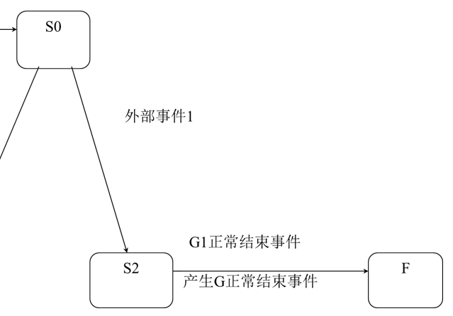

# 人机交互复习

## 第一章 结论

### 1. 什么叫人机交互

人机交互是关于设计、评价和实现供人们使用的交互式计算机系统，且围绕这些方面的主要现象进行研究的科学。

### 2. 人机交互的研究内容

- 人机交互界面表示模型与设计方法
- 可用性分析与评估
- 多通道交互技术
- 认知与智能用户界面
- 群件
- Web设计
- 移动界面设计

### 3、人机交互的发展历史经历了哪些阶段，有什么特点

- 命令行界面交互阶段：通过命令行界面使用问答式对话或命令语言进行人机交互。
- 图形用户界面（GUI）阶段：采用图形方式显示用户界面，允许用户使用鼠标等输入设备进行交互。
- 人机交互阶段：允许语音、手势、眼线跟踪、表情等输入手段的多通道交互。

## 第二章 感知与认知基础

### 1、人类有哪些视错觉，对交互设计有什么启示

尺寸错觉（深度错觉）、细胞错觉、轮廓错觉、不可能错觉、运动错觉。

可以利用错觉，增强视觉效果；根据错觉原理，调整设计，弥补错觉误导。

***

尺寸错觉：相同的东西看上去不一样（有大有小，有长有短）。

细胞错觉：不同背景下，相同颜色/亮度的感觉不同。

轮廓错觉：因为边缘跟背景渲染问题，不同人看到某张图的第一眼可能看到的东西不一样。

不可能错觉：局部平面结构合理，但实际不可能存在的图形；

运动错觉：静态感知为运动状态的错觉。类似于催眠的。

### 2、人类阅读有什么特点，对交互设计有什么启示

**阅读的过程**：形状被感知，编码成内部语言，理解语义

对字体大小：中文正文字号36，英文9~12，易于识别。

页面宽度：58~132mm，阅读效果最佳

对比度的启示：白底黑体，对比度鲜明。

### 3、知觉有哪些特性，每个特性都有什么特点，以及如何在交互设计中体现

知觉的特性：选择性、整体性、理解性和恒常性；

知觉选择性：人总是有选择地把某一事物作为知觉对象，同时把其它事物作为知觉背景。

知觉整体性（格式塔心理学）：视野上邻近的、相似的、连续的、闭合的易组合为一个图形。

- 接近律：文本布局
- 相似律：导航设计
- 连续律：轮播图按钮
- 闭合律：logo设计

知觉的理解性：在知觉过程中，人利用过往知识经验，对感知对象进行加工理解，并以概念的形式标示出来。

- 右边的按钮是下一步，左边的按钮是上一步。

知觉的恒常性：知觉的客观条件在一定范围内改变时，我们的知觉映象在相当程度上却保持着它的稳定性

- 大小、形状、方向、明度、颜色

### 4、人类的认知包括哪些过程，每个过程启示交互设计时需要遵循什么原则

认知过程

1. 感觉与识别：文字清晰易读，声音响亮可辨识。
2. 注意：
   1. 信息的显示应醒目，如使用彩色、下划线等进行强调
   2. 避免在界面上安排过多的信息
   3. 界面要朴实，降低使用难度
3. 记忆
   1. 勿使用过于复杂的任务执行步骤
   2. 应使用菜单、图标，且它们的位置应保持一致
   3. 提供多种信息的编码方式（颜色、标志、时间戳、图标等）
4. 问题解决
   1. 应考虑在界面中隐藏一些附加信息
5. 语言处理
   1. 尽量减少语音菜单、命令的数目
   2. 应重视人工合成语音的语调
   3. 应允许自由放大文字

### 5、影响认知的因素有哪些，对交互设计有什么启示

情感、个体差异、动机和兴趣

***

避免使人容易产生疲劳的界面

异常行为的判断：如用户快速敲击鼠标；

关键动作时有意识的提醒

应考虑是否会给部分用户带来不便

应考虑提供其他的感知通道

根据用户动机，提升用户的兴趣

### 6、什么是概念模型，用户的概念模型有哪几种

概念模型：用户能够理解的关于系统的描述。

分类：思维模型、信息处理模型、外部认知模型、分布式模型

## 第三章 交互设备

1、文本输入设备

- 键盘：编码/非编码、QWERT布局/DVORAK布局

- 手写板：电阻式、电磁式、电容式
  
  - 技术指标：压感级数、精度、书写面积

2、图像输入设备

- 二维扫描仪：
  
  - 技术指标：扫描速度、分辨率
  - 分类：平板式、手持式、滚筒式

- 摄像头：
  
  - 技术指标：元器件类型、像素数、解析度、视频速度、镜头

3、三维信息输入设备

- 三维扫描仪：接触式/非接触式
- 动作捕捉设备：机械式、电磁式、光学式
- 体感输入设备：LeapMotion、Kinect

4、指点输入设备

- 鼠标：机械鼠标、光电鼠标、无线鼠标、3D鼠标

- 控制杆：位移定位、压力定位

- 触摸屏：电阻式、电容式、**基于光学原理**

2、输出设备：

- 光栅显示器：CRT、等离子、液晶
  
  - 技术指标：扫描方式、刷新频率、点距、分辨率

- 显卡的构成：接口、GPU、显存、数模转换器

- 投影仪：CRT、LCD、DLP
  
  - 工作原理：光学分光，数据调制，合成显示 
  - DLP中的数字微镜工作原理：**根据二进制数据能进行±12°调整的微小反射镜**

- 打印机：针式、喷墨、激光
  
  - 重要指标：打印分辨率、打印速度、打印幅面、最大打印能力
  - 3D打印机

3、语音交互设备：

耳机：封闭式、开放式、半开放式

- 技术指标：频响范围、灵敏度、耳机阻抗、谐波失真

麦克风

- NCAT技术（Noise Canceling Amplification Technology）：过滤背景杂音，提高音质的技术

声卡

- 工作原理：采集到的声音信号输入到**模/数**转换芯片，转换成**数字**信号。然后经过计算机处理后输出到**数/模**转换芯片转换成**模拟**信号。

- 组成：模/数转换芯片，数/模转换芯片

- 主要指标：采样位数、采样频率、声道数、MIDI合成

### 激光打印机原理

重要指标：打印分辨率、打印速度、打印幅面、最大打印能力

### 声卡接口

## 第四章 交互技术

### 1、有多少种常用的输入模式，每种模式都有什么特点，以及适用场合

请求模式、采样模式、事件模式。

***

请求模式：程序执行过程中需要输入数据时，暂停程序的执行，输入数据后，才继续执行程序。

采样模式：输入设备和应用程序独立地工作。新的输入数据替换以前的输入数据。直到遇到采样命令才读取数据。

事件模式：输入设备和程序并行工作。输入设备把数据保存到一个输入队列，也称为事件队列，所有的输入数据都保存起来。程序随时检查事件队列。

### 2、基本的技术主要有哪些，如何体现在应用上

定位（输入点的坐标）、笔划（画图）、定值（设置旋转角度等）、选择（鼠标选择）、字符串（键盘输入）

### 3、二维图形交互技术有哪些，如何体现

几何约束（定位约束、方向约束）、引力场、拖动、橡皮筋技术、操作柄技术

***

几何约束：用于对对齐方式等进行规定和校准。定位约束是点，方向约束是方向；

引力场：吸引箭头到点上。

拖动：鼠标拖动

橡皮筋技术：被拖动对象的形状和位置随着光标位置的不同而变化。画图擦除画图的过程

操作柄技术：可以用来对图形对象进行缩放、旋转、错切等几何变换。如wps的画图工具，点击图形然后四周有点，且被虚线包围。

> WIMP是由“视窗”（Window）、“图标”（Icon）、“菜单”（Menu）以及“指标”（Pointer）所组成的缩写

### 4.、三维图形交互技术有哪些

直接操作、三维Widgets、三视图输入

### 5、自然交互技术有哪些，如何体现

多点触控技术：手势识别

手势识别技术：数据手套输入/摄像机输入

表情识别技术：人脸检测；面部动作编码系统 **FACS** 

语音识别技术：听写机；

眼动跟踪技术：注视跳动平滑尾随

笔交互技术：`PIBG范式：纸、图标、按钮、手势；`手写识别技术

## 第五章 界面设计

1、用户界面的类别：命令行界面、图形界面、多通道界面

2、图形用户界面的主要思想有哪些，每个思想的特点是什么

1. 桌面隐喻：
   1. 直接隐喻：隐喻本身就带有操纵的对象。如word绘图工具中的图标。
   2. 工具隐喻：用打印机图标隐喻打印操作等
   3. 过程隐喻：通过描述操作的过程来暗示该操作
2. 所见即所得（WYSIWYG）：latex
3. 直接操纵：动作或数据的形象隐喻、用指点和选择输入、操作结果立即可见、支持逆向操作。

3、界面设计遵循哪些原则

1. 界面要具有一致性
2. 常用操作要有快捷方式
3. 提供简单的错误处理
4. 对操作人员的重要操作要有信息反馈
5. 操作可逆
6. 设计良好的联机帮助
7. 合理划分并高效地使用显示屏幕

4、影响用户和产品之间交互质量的因素有哪些：有效性、效率、主观满意度

5、用户有哪些类别，都有什么特点

- 偶然型用户：什么都不会。
- 生疏型用户：会基本的计算机操作。
- 熟练型用户：了解任务，熟练使用
- 专家型用户：精通计算机。

6、用户体验是什么，由哪些因素组成？

用户体验是指**用户在使用产品或系统时的全面体验和满意度**

四个元素：品牌、使用性、功能性、内容

7、用户观察和分析的方式：情境访谈、焦点小组、单独访谈

8、任务分析有哪些方法，每种方法采用哪种UML图表示（应用）

使用行为分析：用例图

顺序分析：序列图

协作关系分析：协作图

工序约束陈述：用户任务一览表、任务金字塔、故事讲述和情节分析

9、以用户为中心的两个目标是什么，四个原则是什么

目标：1）有效地帮助用户完成任务；2）尽量使用户在交互过程中获得愉悦的心情

原则：

1. 以用户为中心
2. 综合设计
3. 持续性地进行测试
4. 反复式设计

## 第六章 人机交互界面表示模型与实现

> 人机交互界面表示模型有四个：行为模型、结构模型、模型转换、表现模型。

### 1、行为模型有哪些，都有什么优缺点，每个模型是如何表示一个交互过程的（应用）

GOMS、LOTOS、UAN、G-U-L

***

GOMS模型

G：目标，可分层

O：操作，不可分解，完成任务的基本动作

M：方法，操作的集合

S：选择规则

优点：成熟，应用广泛，目标层次关系明确

缺点：没有清楚的描述错误处理的过程；时序表示能力有限

***

**LOTOS模型** 

|||（交替）  [] （选择）  |[]|(同步）  [>（禁止） **>>**（允许）

优点：可以构造一套现成的自动化工具

缺点：无法描述目标异常结束的缺陷；过于形式化的记法比较晦涩难懂

***

UAN模型

用户动作标识符 和 条件选择标识符。

优点：更接近于实现

缺点：

1. 时序关系没有明确
2. 多种输入时交互路径比较繁琐

***

GUL模型

任务分解和描述：GOMS模型（关键字）

原子操作描述：UAN模型（标识符mouse_up）

任务间时序关系：LOTOS模型（符号）

### 2、结构模型有哪些类别

产生式规则、状态转换网络（STN）

### 3、行为模型如何与结构模型实现转换

1. G-U-L中的每个目标都对应一个状态转换网络

2. 子目标对应状态网络中的嵌套网络（扩展状态转换网络）

3. 每一种时序关系对应一种状态转换网络

[ ] 选择             

**>>** 允许          

||| 交替，跟选择差不多，每个选择的最后目标都是回到相同点。

[> 禁止      

当有嵌套网络时，结束条件一般为：

## 第七章 Web界面设计

1、Web界面设计有哪些基本原则，如何体现

以用户为中心；一致性；简洁与明确；体现特色；兼顾不同的浏览器；明确的导航设计；

2、 Web界面有哪些要素设计，各要素设计时需要注意什么问题

Web界面规划；文化与语言；内容、风格与布局、色彩设计；文本设计；多媒体元素设计

## 第八章 移动界面设计

1、移动设备有哪些连接方式

无线局域网、无线城域网、无线个域网、高速无线广域网、卫星通讯

2、移动设备有哪些交互方式（输入和输出）

输入：键盘输入、手写输入、语音输入、多点触控手势输入

输出：屏幕显示、声音输出

3、移动界面设计要遵循哪些原则

简单直观；个性化设计；易于检索；界面风格一致；避免不必要的文本输入；

根据用户的要求使服务个性化；最大限度地避免用户出错；文本信息应当本地化

4、移动界面设计有哪些要素，都需要注意什么问题

菜单；按钮；多选列表；文字显示；数据输入；图标与图像；报警提示；移动多媒体 

## 第九章 可用性与用户体验

1、可用性指什么，其中的5E有什么含义

可用性是指特定的用户在特定的环境下使用产品并达到特定目标的效率和满意的程度。

5E：有效性（Effective）、效率（Efficient）、吸引力（Engaging）、容错能力（Error Tolerant）、易于学习（Easy to Learn）

2、支持可用性有哪些设计原则，每个原则有什么具体含义和应用体现

可学习性：能否让新手学会如何使用系统，以及如何达到最佳交互效果。

灵活性：体现了用户与系统交互方式的多样性

鲁棒性：能否成功达到目标和能否对达到的目标进行评估。

3、软件可用性评估遵循哪些原则

1. 应该针对产品的用户。
2. 要选择有广泛代表性的用户
3. 软件的可用性测试和评估在产品开发的初期阶段就应该开始。
4. 软件的可用性测试必须是在用户的实际工作任务和操作环境下进行。

4、可用性评估有哪些方法

**诊查式**方法：不需要用户参与

- 用户模型法；启发式评估；认知性遍历

**测试式**方法：需要用户参与

- 用户测试；问卷调查；放声思考法

5、用户体验有哪两个模型

1. 层次模型（从抽象到具体，从需求到具体实现）
2. 心流体验模型（根据心理状态）

6、用户体验有哪些评价指标

主观评价指标：用户体验要素

客观评价指标：行为指标；生理指标
