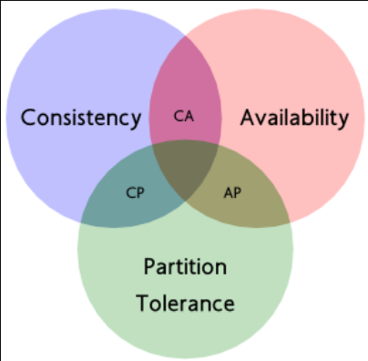

数据一致性模型
===

CAP理论
---

CAP定理，指的是在一个分布式系统中， 一致性、可用性和分区容错性 三者不可同时兼得。

- **Consistency (一致性)**：对一个节点的数据进行更新操作后，所有节点能够==马上==获取到最新的数据。

- **Availability (可用性)**：系统提供的服务必须一直处于可用的状态，对于用户的每一个操作请求都能够==及时的返回结果==。

- **Partition Tolerance (分区容错性)**：分布式系统在遇到某节点或网络分区故障的时候，==仍然==能够对外提供满足一致性和可用性的服务。

CA：放弃分区容错性P，加强一致性和可用性，其实就是传统的单机数据库的选择。 

AP：放弃一致性C，一旦分区发生，节点之间可能会失去联系，为了高可用，每个节点只能用本地数据提供服务，而这样会导致全局数据的不一致性。

CP：放弃可用性A，由于分区之间会导致同步时间无限延长(等待数据同步完才能正常访问服务)，一旦发生网络故障或者消息丢失等情况，就要牺牲用户的体验，等待所有数据全部一致了之后再让用户访问系统。最典型的就是分布式数据库，如Redis、HBase等

BASE理论
---

BASE是**B**asically **A**vailable（基本可用）、**S**oft state（软状态）和**E**ventually consistent（最终一致性）的缩写，基于CAP定理逐步演化而来。

BASE理论的核心思想是：即使无法做到强一致性，但每个应用都可以根据自身业务特点，采用适当的方式来使系统达到**最终一致性**。

- 基本可用：分布式系统在出现不可预知故障的时候，允许损失部分可用性。比如时间上的损失，功能上的损失。

- 软状态：允许系统在不同节点的数据副本之间进行数据同步的过程存在延时。

- 最终一致性：最终一致性强调的是所有的数据副本，在经过一段时间的同步之后，最终都能够达到一个一致的状态。

分布式事务解决方案
===

两阶段提交(2PC)
---

在分布式系统中，为了让每个节点都能够感知到其他节点的事务执行状况，需要引入**一个中心节点**来统一处理所有节点的执行逻辑，这个中心节点叫做协调者，被中心节点调度的其他业务节点叫做参与者。

两阶段提交，顾名思义，2PC将分布式事务分成了两个阶段，两个阶段分别为 **准备阶段** 和 **执行阶段**。

准备阶段：

- 协调者向所有参与者发送prepare请求与事务内容，并等待参与者的响应。
- 参与者执行事务中包含的操作，但不真正提交，并记录 undo log。
- 参与者向协调者发送事务操作的执行结果，执行成功返回yes，否则返回no

执行阶段：

- 若所有参与者**都返回yes**，说明事务可以提交。
  - 协调者向所有参与者发送commit请求。
  - 参与者收到commit请求后，将事务真正地提交上去，释放占用的事务资源，并向协调者返回ack。
  - 协调者收到所有参与者的ack消息，事务提交7完成
- 若有参与者**返回no**或者**超时未返回**，说明事务中断，需要回滚。
  - 协调者向所有参与者发送rollback请求。
  - 参与者收到rollback请求后，根据undo log回滚到事务执行前的状态，释放占用的事务资源，并向协调者返回ack。
  - 协调者收到所有参与者的ack消息，事务回滚完成。

***

二阶段提交的缺点：

1、同步阻塞问题。执行过程中，所有参与节点都是事务阻塞型的。当参与者占有公共资源时，其他第三方节点访问公共资源不得不处于阻塞状态。

2、单点故障。由于协调者的重要性，一旦协调者发生故障，参与者会一直阻塞下去（因为**参与者没有超时机制**）。

3、数据不一致。在执行阶段中，当协调者向参与者发送commit请求之后，发生了局部网络异常或者在发送commit请求过程中协调者发生了故障，这会导致只有一部分参与者接受到了commit请求，于是整个分布式系统便出现了数据部一致性的现象。

4、二阶段无法解决的问题：协调者再发出commit消息之后宕机，而唯一接收到这条消息的参与者同时也宕机了。那么即使协调者通过选举协议产生了新的协调者，这条事务的状态也是不确定的，没人知道事务是否被已经提交。

三阶段提交(3PC)
---

三阶段提交协议在协调者和参与者中都引入超时机制，并且把两阶段提交协议的第一个阶段拆分成了两步：询问，然后再锁资源，最后真正提交。

**CanCommit阶段**：

协调者向参与者发送CanCommit请求，参与者如果可以正常执行完成就返回Yes响应，否则返回No。==注意，此时只是预执行==。

**PreCommit阶段**：

1. 所有参与者都发送yes：执行事务，记录undolog，此时还没有提交。
2. 有一个参与者发送no或等待超时：事务中断

**DoCommit阶段**：

跟2PC的提交阶段一致。==需要注意的是，此阶段如果参与者没收到协调者的响应，则会直接提交==。

***

3PC在第一阶段不占有数据库资源，第二阶段才占有，提高了资源的利用率。

TCC事务
---

TCC和2PC/3PC很像，不过TCC的事务控制都是业务代码层面的，而2PC/3PC则是资源层面的

TCC的核心思想是：try阶段检查并预留资源，确保在confirm阶段有资源可用，这样可以最大程度的确保confirm阶段能够执行成功。

TCC事务其实主要包含两个阶段：Try阶段、Confirm/Cancel阶段。

1. **try阶段**：尝试执行业务
   
   完成所有业务检查(一致性)
   
   预留业务资源(准隔离性)

2. **confirm阶段**：确认执行业务
   
   真正执行业务，不作任何业务检查，只使用Try阶段预留的业务资源。且Confirm 操作必须保证幂等性 

3. **cancel阶段**：取消执行业务
   
   释放Try阶段预留的业务资源，Cancel操作必须保证幂等性。
