小程序开发
==========

小程序简介
----------

### 小程序与普通网页开发的区别

1. 运行环境不同：

   网页运行在浏览器环境中；小程序运行在微信环境中

2. API 不同：

   由于运行环境的不同，所以小程序中，无法调用 DOM 和 BOM 的 API。但是，小程序中可以调用微信环境提供的各种 API。


### 宿主环境简介

宿主环境（host environment）指的是程序运行所**必须的依赖环境**。例如：Android 系统和 iOS 系统是两个不同的宿主环境。安卓版的微信 App 是不能在 iOS 环境下运行的。


### 小程序开发步骤

小程序有自己的一套标准开发模式：

1. 申请小程序开发账号，获取**AppID**。
2. 安装小程序开发者工具（[下载链接](https://developers.weixin.qq.com/miniprogram/dev/devtools/stable.html)）。
3. 创建和配置小程序项目（需要用到AppID）。
4. 使用编辑器(也可以使用小程序开发者工具)编写代码。


第一个小程序
------------

第一步：打开 开发者工具，点击“加号”

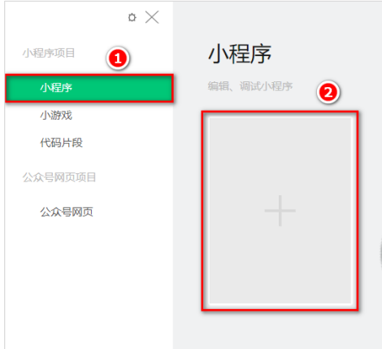

第二步：创建小程序

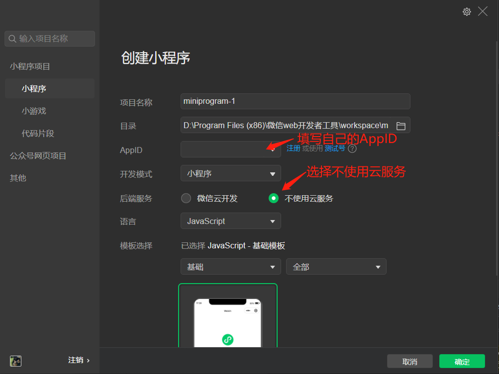

第三步：在模拟器上查看项目效果

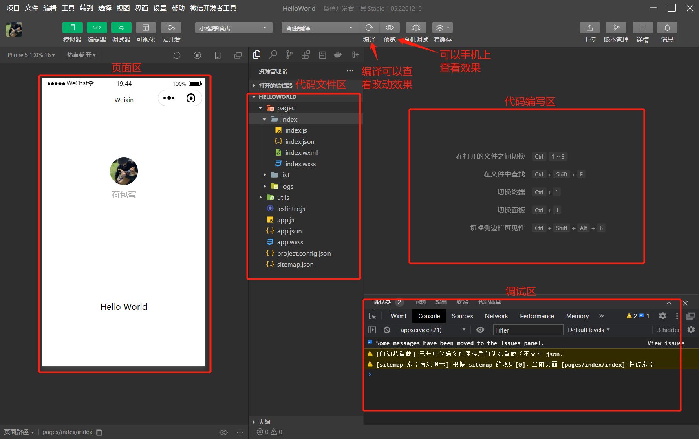


小程序代码的构成
----------------

### 项目结构

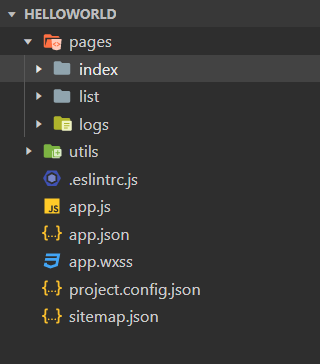

1. pages 用来存放所有小程序的页面
2. utils 用来存放工具性质的模块
3. app.js 小程序项目的入口文件
4. app.json 小程序项目的全局配置文件
5. app.wxss 小程序项目的全局样式文件
6. project.config.json 项目的配置文件
7. sitemap.json 用来配置小程序及其页面是否允许被微信索引

---

其中，每个页面由 4 个基本文件组成，它们分别是：

1. `.js` 文件（页面的脚本文件，存放页面的数据、事件处理函数等）
2. `.json` 文件（当前页面的配置文件，配置窗口的外观、表现等）
3. `.wxml` 文件（页面的模板结构文件）
4. `.wxss` 文件（当前页面的样式表文件）

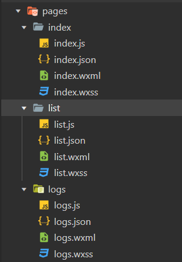


### app.json 文件

app.json 是当前小程序的**全局配置**，包括了小程序的所有页面路径、窗口外观、界面表现、tabBar 等。配置内容如下：

1. pages：用来记录当前小程序所有页面的路径
2. window：全局定义小程序所有页面的背景色、文字颜色等
3. style：全局定义小程序组件所使用的样式版本
4. sitemapLocation：用来指明 sitemap.json 的位置

> 页面的 .json 配置文件：小程序中的每一个页面，可以使用 .json 文件来对本页面的窗口外观进行配置，页面中的配置项会覆盖app.json 的 window 中相同的配置项。

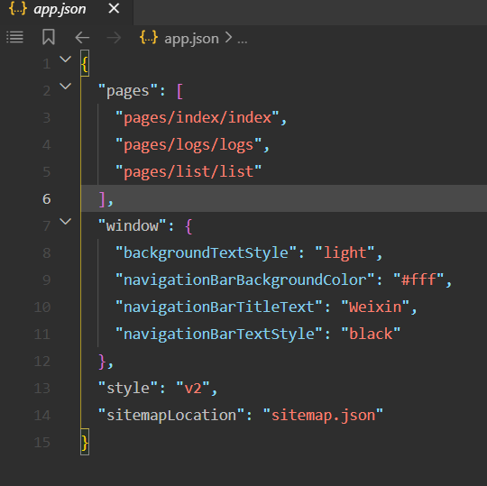


### project.config.json 文件

project.config.json 是项目配置文件，用来记录我们对小程序开发工具所做的个性化配置，例如：

- setting 中保存了编译相关的配置
- projectname 中保存的是项目名称
- appid 中保存的是小程序的账号 ID

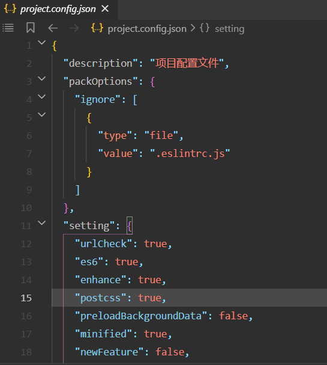

### sitemap.json 文件

微信现已开放小程序内搜索，效果类似于 PC 网页的 SEO。sitemap.json 文件用来配置小程序页面是否允许微信索引。

当开发者允许微信索引时，微信会通过爬虫的形式，为小程序的页面内容建立索引。当用户的搜索关键字和页面的索引匹配成功的时候，小程序的页面将可能展示在搜索结果中


组件
----

小程序中的组件由宿主环境提供的，开发者可以基于组件快速搭建出漂亮的页面结构。

官方把小程序的组件分为了 9 大类，分别是：**视图容器**、**基础内容**、**表单组件**、**导航组件**、媒体组件、map 地图组件、 canvas 画布组件、开放能力、无障碍访问。

[更多组件详情查看官网文档](https://developers.weixin.qq.com/miniprogram/dev/component/) 


**view**：普通视图区域，类似于 HTML 中的 div，是一个块级元素，常用来实现页面的布局效果。

```html
<view>
	<view>A</view>
	<view>B</view>
</view>
```

> **view组件**类似于div组件，**block组件**类似于template组件。


**scroll-view**：可滚动的视图区域，常用来实现滚动列表效果。需要设置**滚动方向**和**固定高度**。

```html
<!-- scroll-y纵向滑动 -->
<!-- scroll-x横向滑动 -->
<scroll-view scroll-y class="container">
    <!-- 在container设置width -->
	<view>A</view>
	<view>B</view>
</scroll-view>
```


**swiper** 和 **swiper-item**：轮播图容器组件 和 轮播图 item 组件。

````html
<swiper>
	<swiper-item>A</swiper-item>
	<swiper-item>B</swiper-item>
	<swiper-item>C</swiper-item>
</swiper>
````

swiper常用属性：indicator-dots、indicator-color等。


**text**：文本组件，类似于HTML中的span标签。通过 text 组件的 `selectable` 属性，实现**长按选中文本内容**的效果。


**image**：图片组件，image 组件默认宽度约 300px、高度约 240px。


API
---

小程序官方把 API 分为了如下 3 大类：

- **事件监听 API** 
  - 特点：以 on 开头，用来监听某些事件的触发
  - 举例：wx.onWindowResize(function callback) 监听窗口尺寸变化的事件
- **同步 API** 
  - 特点1：以 Sync 结尾的 API 都是同步 API
  - 特点2：同步 API 的执行结果，可以通过函数返回值直接获取，如果执行出错会抛出异常
  - 举例：wx.setStorageSync('key', 'value') 向本地存储中写入内容
- **异步 API** 
  - 特点：类似于 jQuery 中的 $.ajax(options) 函数，需要通过 `success`、`fail`、`complete` 接收调用的结果
  - 举例：wx.request() 发起网络数据请求，通过 success 回调函数接收数据


WXML 模板
---------

WXML（WeiXin Markup Language）是小程序框架设计的一套标签语言，用来构建小程序页面的结构，其作用类似于网页开发中的 HTML。

和 HTML 的区别：

1. 标签名称不同

   - HTML （div, span, img, a） 
   - WXML（view, text, image, navigator） 

2. 属性节点不同：

   - `<a href="#">超链接</a>`

   - `<navigator url="/pages/home/home"></navigator>`

3. 提供了类似于 Vue 中的模板语法：数据绑定、列表渲染、条件渲染

 

### 数据绑定

数据绑定步骤：

1. 在 `js文件`的data中定义数据

   ```js
   Page({
     data: {
       msg: 'Hello World',
     },
   })
   ```

2. 在 WXML 中使用**Mustache 语法**（双大括号）来使用数据

   ```vue
   <view>{{motto}}</view>
   ```

> 注意，与vue不同的是，如果需要在属性中使用数据的话也需要使用**Mustache 语法**。
>
> ```html
> <image src="{{imgPath}}"></image>
> ```


### 事件绑定

**事件**是渲染层到逻辑层的通讯方式。通过事件可以将用户在渲染层产生的行为，反馈到逻辑层进行业务的处理。

小程序中常用的事件：

|  类型  |         绑定方式          |            描述             |
| :----: | :-----------------------: | :-------------------------: |
|  tap   |     bindtap或bind:tap     | 类似于 HTML 中的 click 事件 |
| input  |  bindinput 或 bind:input  |      文本框的输入事件       |
| change | bindchange 或 bind:change |       状态改变时触发        |

当事件回调触发的时候，会收到一个事件对象 event，它的常用属性如下表所示：

|  属性  |  类型  |              说明              |
| :----: | :----: | :----------------------------: |
|  type  | String |            事件类型            |
| target | Object | 触发事件的组件的一些属性值集合 |
| detail | Object |           额外的信息           |

***

事件绑定步骤：

1. 通过 `bindtap`，可以为组件绑定 tap 触摸事件

   ```html
   <button type="primary" bindtap="click">按钮</button>
   ```

2. 在js文件中编写对应方法

   ```js
   Page({
     data: {
       msg: 'Hello World',
     },
     // 直接定义方法
     click(){
   	console.log(111)
     },
   })
   ```


### 事件传参

**bindtap**使用：

1. 可以为组件提供 `data-*` 自定义属性传参，其中 `*` 代表的是**参数的名字**.

   ```html
   <button type="primary" bindtap="click" data-info="{{2}}">
       按钮 {{num}}
   </button>
   ```

   最终：`info` 会被解析为参数的名字; `2` 会被解析为参数的值

2. 使用 `event.target.dataset.参数名` 获取参数值

   ```js
   // 接收event作为参数
   click(event){
       // 对num重新赋值
       this.setData({
           num: event.target.dataset.info
       })
   },
   ```

> **bindinput**使用：`event.detail.value`获取文本框最新的值

如果需要修改一个对象的属性：

```js
this.setData({
    num.a: "aaa"
})
```


### 条件渲染

小程序的条件渲染有：**wx:if** 跟 **hidden** ，类似于v-if跟v-show；


### 列表渲染

通过 **wx:for** 可以根据指定的数组，循环渲染重复的组件结构。

默认情况下，当前循环项的**索引**用 `index` 表示；当前**循环项**用 `item` 表示。

```vue
<view wx:for="{{list}}" wx:key="index">
    索引是：{{index}} ，当前项是：{{item}}
</view>
```

***

手动指定索引和当前项的变量名：

- 使用 `wx:for-index` 可以指定当前项的索引的变量名
- 使用 `wx:for-item` 可以指定当前项的变量名

```vue
<view wx:for="{{list}}" wx:for-index="myindex" wx:for-item="myitem" wx:key="myindex">
    索引是：{{myindex}} ，当前项是：{{myitem}}
</view>
```


### wxs脚本

WXS（WeiXin Script）是小程序独有的一套脚本语言，跟js类似，典型应用场景就是“过滤器”。

-  **wxml 内嵌 wxs 脚本**：类似于`<script>` 一样内嵌在html中。`<wxs> `标签必须提供 `module` 属性，用来指定当前 wxs 的模块名称

  ```html
  <view>{{m1.toUpper(username)}}</view>
  
  <wxs module="m1">
  	module.exports.toUpper = str => {
      	return srt.toUpperCase()
          }
  </wxs>
  ```

-  **wxml 关联 wxs 脚本**：`src` 用来指定要引入的脚本的路径，且必须是**相对路径**.

  ```html
  <view>{{m1.toUpper(username)}}</view>
  
  <wxs src="../utils/tools.wxs" module="m1">
  </wxs>
  ```

> wxs 不能调用 js 中定义的函数
>
> wxs 不能调用小程序提供的 API


WXSS 样式
---------

WXSS (WeiXin Style Sheets)是一套样式语言，用于描述 WXML 的组件样式，类似于网页开发中的 CSS。

WXSS 和 CSS 的区别：

1. 新增了 rpx 尺寸单位
   - CSS 中需要手动进行像素单位换算，例如 rem
   - WXSS 在底层支持新的尺寸单位 rpx，在不同大小的屏幕上小程序会**自动进行换算**。
2. 提供了全局的样式和局部样式
   - 项目根目录中的 `app.wxss` 会作用于**所有**小程序页面
   - 局部页面的 `.wxss` 样式仅对**当前**页面生效
3. WXSS 仅支持部分 CSS 选择器

> WXSS采用`@import ‘路径’` 导入外部wxss文件。


全局配置
--------

### 窗口 window

窗口组成：

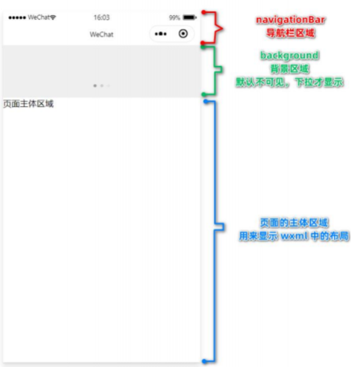

常用的配置项：

|            属性名            |  默认值  |                        说明                        |
| :--------------------------: | :------: | :------------------------------------------------: |
|    navigationBarTitleText    |  Weixin  |                 导航栏标题文字内容                 |
| navigationBarBackgroundColor | \#000000 |    导航栏背景颜色，**只能是字符串，不能用字母**    |
|    navigationBarTextStyle    |  white   |      导航栏标题颜色，**仅支持 black / white**      |
|       backgroundColor        | \#ffffff |                    窗口的背景色                    |
|     backgroundTextStyle      |   dark   |      下拉加载的样式，**仅支持 dark / light**       |
|    enablePullDownRefresh     |  false   |                是否全局开启下拉刷新                |
|    onReachBottomDistance     |    50    | 页面上拉触底事件触发时，距离页面底部距离，单位为px |

例如：

```json
"window": {
    "backgroundTextStyle": "dark",
    "navigationBarTitleText": "Hello World",
    "navigationBarTextStyle": "white"
  },
```


### 菜单栏 tabBar

tabBar 是移动端应用常见的页面效果，用于实现多页面的快速切换。小程序中通常将其分为：**底部tabBar** 和 **顶部tabBar**。每个tabBar中只能配置最少 **2** 个、最多 **5** 个 tab 页签。

> 当渲染顶部 tabBar 时，不显示 icon，只显示文本

tabBar 节点的配置项：

|     属性名      | 默认值 |                        描述                         |
| :-------------: | :----: | :-------------------------------------------------: |
|    position     | bottom |        tabBar 的位置，**仅支持 bottom/top**         |
|   borderStyle   | black  |     tabBar 上边框的颜色，仅支持 **black/white**     |
|      color      |        |           tab 上文字的默认（未选中）颜色            |
|  selectedColor  |        |              tab 上的文字选中时的颜色               |
| backgroundColor |        |                   tabBar 的背景色                   |
|      list       |        | (必填) tab 页签的列表，**最少 2 个、最多 5 个 tab** |

tab页签配置项：

- `pagePath`：必填，页面路径（页面必须在 pages 中预先定义）
- `text`：必填，tab页签 显示的文字
- `iconPath`：未选中时**tab页签**的图片路径
- `selectedIconPath`：选中时**tab页签**的图片路径

***

案例：

第一步：新建 3 个对应的 tab 页面。（通过 app.json 文件的 pages 节点，快速新建 3 个对应的 tab 页面）

```json
{
    "pages": [
        "pages/home/home",
        "pages/message/message",
        "pages/contact/contact"
    ]
}
```

第二步：配置 tabBar 选项

1. 打开 app.json 配置文件，和 pages、window 平级，新增 **tabBar 节点** 。然后在tabBar节点中新增**list节点**，用于每个存放tab页签的配置。

   ```json
   {
       "pages": [
           "pages/home/home",
           "pages/message/message",
           "pages/contact/contact"
       ],
       "tabBar":{
           "list": [
               {
                   "pagePath": "pages/home/home",
                   "text": "首页",
                   "icon": "图片路径",
                   "selectedIconPath": "图片路径"
               },
               { 同上类似 }
           ]
       }
   }
   ```


生命周期
--------

在小程序中，**生命周期**分为两类，分别是：

1. **应用**生命周期：小程序从 `启动 -> 运行 -> 销毁` 的过程
2. **页面**生命周期：小程序的每个页面从 `加载 -> 渲染 -> 销毁` 的过程

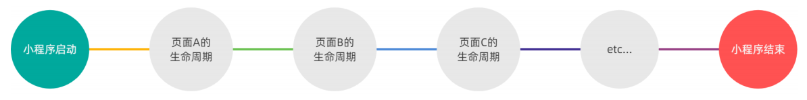

**生命周期函数**：是由小程序框架提供的内置函数，会伴随着生命周期，自动按次序执行。

- 应用声明周期函数

  ```js
  // app.js
  App({
      // 小程序初始化完成时执行，全局只触发一次，一般用于初始化数据
      onLaunch: function(options){},
      // 小程序启动或从后台进入前台时触发
      onShow: function(options){},
      // 小程序从前台进入后台时触发
      onHide: function(){}
  })
  ```

- 页面生命周期函数

  ```js
  // 页面的js文件
  Page({
      // 页面加载时执行，一个页面只执行一次
      onLoad: function(options){},
      // 页面显示时执行
      onShow: function(){},
      // 页面初次渲染完成时执行，一个页面只执行一次
      onReady: function(){},
      // 页面隐藏时执行
      onHide: function(){},
      // 页面卸载时执行，一个页面只执行一次
      onUnload: function(){}
  }}
  ```

> 前台就是指小程序页面，后台只是后台运行。


页面事件
--------

### 下拉刷新

**下拉刷新**是移动端的专有名词，指的是通过手指在屏幕上的下拉滑动操作，从而**重新加载页面数据**的行为。

启用下拉刷新有两种方式：

1. 全局开启下拉刷新：在 `app.json` 的 `window` 节点中，将 `enablePullDownRefresh` 设置为 `true`。
2. 局部开启下拉刷新：在页面的 `.json` 配置文件中，将 `enablePullDownRefresh` 设置为 `true`。

> 在全局或页面的 .json 配置文件中，通过 `backgroundColor` 和 `backgroundTextStyle` 来配置下拉刷新窗口的样式。

**监听下拉事件**：

在页面的 .js 文件中，通过 `onPullDownRefresh()` 函数即可监听当前页面的下拉刷新事件。

当处理完下拉刷新后，下拉刷新的 loading 效果会一直显示，不会主动消失，所以需要手动隐藏下拉刷新的loading 效果。此时，调用 `wx.stopPullDownRefresh()` 可以停止当前页面的下拉刷新的loading 效果。

```js
onPullDownRefresh: function(){
    //  dosoming
    wx.stopPullDownRefresh();
}
```


### 上拉触底

**上拉触底**是移动端的专有名词，通过手指在屏幕上的上拉滑动操作，当滚动条距离页面底部一定距离时**加载更多数据**的行为。

**监听上拉触底事件**：

在页面的 .js 文件中，通过 `onReachBottom()` 函数即可监听当前页面的上拉触底事件。示例代码如下：

```js
onReachBottom: function(){
    console.log('触发上拉触底')
}
```

> 可以在全局或页面的 .json 配置文件中，通过 `onReachBottomDistance` 属性来配置上拉触底的距离

***

**对上拉触底进行节流处理**：

上拉触底有个问题是，当上拉触底整个过程还没有结束时，用户又重复的触发上拉触底事件，此时会出现数据错误或者重复请求的情况。此时需要进行**节流处理**。

1. 在 data 中**定义一个数据**用户判断上拉触底事件是否结束
2. 在 onReachBottom 中**判断此数据**的值，从而对数据请求进行节流控制

```js
data: {
	flag: false,
},
onReachBottom: function(){
    if(flag){
        return;
    }
    this.setData({
        flag: true
    })
    
    console.log('触发上拉触底')
    
    this.setData({
        flag: false
    })
}
```


视图与逻辑
----------

### 页面导航

页面导航指的是页面之间的相互跳转。

小程序中实现页面导航的两种方式：

1. **声明式**导航：在页面上声明一个 `<navigator>` 导航组件并通过点击 `<navigator>` 组件实现页面跳转。
2.  **编程式**导航：调用小程序的导航 API，实现页面的跳转。


### 声明式导航

在使用 `<navigator>` 组件跳转到指定的页面时，需要指定 **url** 属性和 **open-type** 属性，其中：

- `url` 表示要跳转的页面的地址，必须以 **/** 开头
- `open-type` 表示跳转的方式，默认为**navigate**。如果需要用于**tab页签**之间跳转时必须为 **switchTab** 

```html
<navigator url="/pages/home/home" open-type="switchTab">
导航到home页面
</navigator>
```

> 如果需要携带参数，则跟url携带路径参数一致：`/pages/home/home?name=hjh` 

**后退导航**：`<navigator>` 组件也可以起到后退的效果。如果要后退到上一页面或多级页面，则需要指定 **open-type** 的值为 **navigateBack**，且 **delta** 的值为 **数字**，表示要后退的层级。

```html
<navigator  open-type="navigateBack" delta="1">
返回上一页
</navigator>
```

> 如果只是后退到上一页面，则可以省略 **delta** 属性，因为其默认值就是 **1**。


### 编程式导航

**导航到非 tabBar 页面**：调用 `wx.navigateTo(Object object)` 方法，其中 Object 参数对象的属性列表如下：

- url：需要跳转的 tabBar 页面的路径，**路径后可以带参数**。
- success：接口调用成功的回调函数
- fail：接口调用失败的回调函数
- complete：接口调用完成的回调函数

```html
<button bindtap="gotoInfo">
    跳转到info页面
</button>

gotoInfo(){
    wx.navigateTo({ // 可以传参
    	url: '/pages/info/info?name=codekiang'
    })
}
```

**导航到 tabBar 页面**：调用 `wx.switchTab(Object object)` 方法，**路径后不能带参数**。

```js
gotoInfo(){
    wx.switchTab({ // 不可以传参
    	url: '/pages/info/info'
    })
}
```

**后退导航**：调用 `wx.navigateBack()` 方法，不用指定url，需要指定delta，其默认值为1。

```js
gotoBack(){
    wx.navigateBack()
}
```

> 通过声明式导航传参或编程式导航传参所携带的参数，可以直接在 `onLoad` 周期函数中直接获取到，示例代码如下：
>
> ```js
> onLoad: function(options){
>     console.log(options)
> },
> ```


网络请求
--------

**在小程序中，不存在跨域的问题**，因为都运行在微信中。但出于安全性方面的考虑，小程序官方对数据接口的请求做出了限制：必须将接口的域名添加到信任列表中。

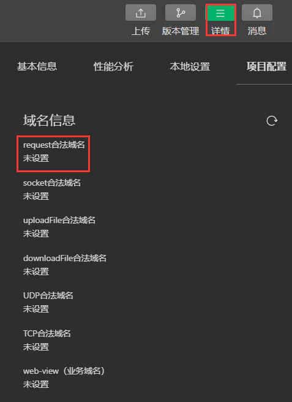

> 添加步骤：登录微信小程序管理后台 -> 开发 -> 开发设置 -> 服务器域名 -> 修改 request 合法域名

1. 只能请求 `HTTPS` 类型的接口
2. 域名不能使用 IP 地址或 localhost
3. 域名必须经过 ICP备案
4. 服务器域名一个月内最多可申请 5 次修改

***

在开发过程中可以临时的跳过request合法域名的校验：

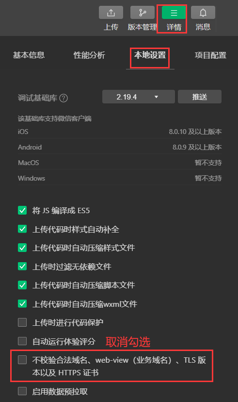


### 发送请求

调用微信小程序提供的 `wx.request()` 方法，可以发起 GET 数据请求：

```js
wx.request({
    url: '请求路径', 
    method: 'GET', // 请求方式
    header: { // 设置请求头
        'content-type': 'application/json'
    },
    data:{
        // 携带的数据
    },
    success: res => { // 请求成功之后的回调函数
        console.log(res.data)
    },
    fail: res => { // 请求失败之后的回调函数
        console.log(res.data)
    },
    complete: () => { // 请求完成之后的回调函数
        // 常用于一些关闭操作
    }
})
```


### API Promise化

**API Promise化** 指的是通过额外的配置，将官方提供的、基于回调函数的异步 API，升级改造为基于Promise 的异步 API，从而提高代码的可读性、维护性，避免回调地狱的问题。

在小程序中，实现 API Promise 化主要依赖于 miniprogram-api-promise 这个第三方的 npm 包。它的安装和使用步骤如下：

1. 安装miniprogram-api-promise：`npm i -S miniprogram-api-promise ` 

2. 在app.js中调用promisifyAll()

   ```js
   import {promisifyAll} from 'miniprogram-api-promise'
   
   const wxp = wx.p = {}
   promisifyAll(wx, wxp)
   ```

3. 调用 Promise 化之后的异步 API

   ```js
   wxp.request({
       method: 'GET',
       url: '',
       data:{
           name:'zs',
           age:20
       }
   }).then(res => {
       console.log(res)
   })
   ```


组件
----

**组件和页面的区别**：组件和页面都是由 .js、.json、.wxml 和 .wxss 这四个文件组成的。但是，组件和页面的 .js 与.json 文件有明显的不同：

- 组件的 .json 文件中需要声明 `"component": true` 属性
- 组件的 .js 文件中调用的是 `Component()` 函数，页面调用的是`Page()`函数
- 组件的事件处理函数需要定义到 **methods** 节点中，页面的函数跟data平级


**创建组件**：

1. 在项目的根目录中，鼠标右键，创建 `components` 文件夹
2. 鼠标右键，点击“新建 Component，会自动生成组件对应的 4 个文件，后缀名分别为 .js，.json， .wxml 和 .wxss

> 为了保证目录结构的清晰，建议把不同的组件，存放到单独目录中。
>
> 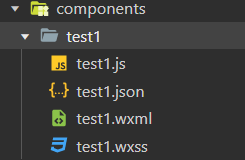

**引用组件**：

组件的引用方式分为“局部引用”和“全局引用”，顾名思义：

- 局部引用：组件只能在当前被引用的页面内使用。

  ```js
  // 在页面的 .json 配置文件中引用组件
  {
      "usingComponents":{
          "组件名": "组件所在路径"
      }
  }
  
  // 在页面的.wxml文件中使用组件
  <组件名></组件名>
  ```

- 全局引用：组件可以在每个小程序页面中使用。在 app.json 全局配置文件中引用组件即可。


### 样式

默认情况下，组件具有**隔离性**，即自定义组件的样式（特指class选择器的样式）只对当前组件生效，不会影响到组件之外的页面或组件。

> 只有 **class 选择器**会有样式隔离效果，id 选择器、属性选择器、标签选择器不受样式隔离的影响。

**修改组件的样式隔离选项**：

默认情况下，自定义组件的样式隔离特性能够防止组件内外样式互相干扰的问题。但有时，我们希望在外界能够控制组件内部的样式，此时，可以通过 styleIsolation 修改组件的样式隔离选项，用法如下：

```js
Component({
  options: {
    styleIsolation: 'isolated' 
      // 默认值 isolated(启动隔离) 
      // apply-shared(页面样式将影响到自定义组件，但组件中的样式不会影响页面) 
      // shared (页面样式将影响到组件，组件中的样式也会影响页面和其他设置了 apply-shared 或 shared 的组件)
  }
})
```


### 数据、方法、属性

在小程序组件中，用于组件模板渲染的私有数据，需要定义到 `data` 节点中；事件处理函数和自定义方法需要定义到 `methods` 节点中；`properties` 节点是组件的对外属性，用来接收外界传递到组件中的数据。

```js
Component({
    properties: {
        // 简化定义属性,无默认值
        // max: Number
        // 完整定义属性，可指定默认值
        max: {
            type: Number
            value: 10
        }
    },
    data: {
        count: 0
    },
    method: {
        addCount(){
            // dosomething
        }
    }
})
```

**data 和 properties 的区别**：在小程序的组件中，properties 属性和 data 数据的用法相同，它们都是`可读可写`的，只不过 `data` 更倾向于存储组件的私有数据；而`properties` 更倾向于存储外界传递到组件中的数据。

> data跟properties底层使用同一个对象来存储数据，所以这两者是相同的。


### 数据监听器

数据监听器支持监听单个或多个属性的变化：

```js
Component({
    observers: {
        '属性A, 属性B': function(新值A, 新值B){
        }
    }
})
```

监听对象属性的变化：

```js
Component({
    observers: {
        '对象.属性A, 对象.属性B': function(新值A, 新值B){
        }
    }
})
```

当需要监听对象的全部属性时，可以`对象.**`。


### 纯数据字段

纯数据字段指的是那些不用于界面渲染的 data 里定义的字段。纯数据字段有助于提升页面更新的性能。

在 Component 构造器的 `options` 节点中，指定 `pureDataPattern` 为一个正则表达式，字段名符合这个正则表达式的字段将成为纯数据字段。

```js
Component({
    options: {
        // 所有以_开头的都被视为纯数据字段
        pureDataPattern: /^_/
    },
    data: {
        a: true, // 普通数据字段
        _b: true, // 纯数据字段
    }
})
```


### 组件的生命周期

组件有六个生命周期函数，它们都需要定义在 `lifetimes` 节点中：

```js
Component({
    lifetimes: {
        created(){}, // 在组件实例刚刚被创建时执行
        attached(){}, // 在组件实例进入页面节点树时执行
        ready(){}, // 在组件在视图层布局完成后执行
        moved(){}, // 在组件实例被移动到节点树另一个位置时执行
        detached(){}, // 在组件实例被从页面节点树移除时执行
        error(Error){}, // 每当组件方法抛出错误时执行
    }
})
```

组件除了生命周期函数之外，还有组件所在页面的生命周期函数，即当页面的生命周期函数为组件所在页面的生命周期函数时会触发。组件所在页面的生命周期函数定义在`pageLifetimes` 节点中。

```js
Component({
    lifetimes: {
        attached(){}, // 在组件实例进入页面节点树时执行
        detached(){}, // 在组件实例被从页面节点树移除时执行
    },
    pageLifetimes: {
        show: function(){}, // 组件所在的页面被展示时执行
        hide: function(){}, // 组件所在的页面被隐藏时执行
        resize: function(Size){}, // 组件所在的页面尺寸变化时执行
    }
})
```


### 插槽

在自定义组件的 wxml 结构中，可以提供一个 `<slot>` 节点（插槽），用于承载组件使用者提供的 wxml 结构。

例如：

组件A中定义插槽：

```html
<view>
    <view>我是组件A</view>
    <!-- 定义插槽，用于插入不确定的wxml结构 -->
    <slot></slot>
</view>
```

使用：

```html
<A>
	<view>插入到slot中的内容</view>
</A>
```

结果：会输出 "我是组件A" 跟 "插入到slot中的内容"。


**使用多个插槽**：当一个组件需要使用多个插槽的时候，需要开启对应的配置，并给每个插槽命名。

1. 开启配置，在组件的js文件中添加`multipleSlots: true;` 

   ```js
   Component({
       options: {
           multipleSlots: true;
       }
   })
   ```

2. 定义多个插槽并命名

   ```html
   <view>
   	<slot name="one"></slot>
   	<slot name="two"></slot>
   </view>
   ```

3. 使用多个插槽

   ```html
   <A>
   	<view name="one">插入到one</view>
   	<view name="two">插入到two</view>
   </A>
   ```


### 父子组件通信

父子组件之间通信的 3 种方式：

- **属性绑定**：用于父组件向子组件传递属性值
- **事件绑定**：用于子组件调用父组件的事件
- **获取组件实例**：父组件还可以通过 `this.selectComponent("id或class选择器")` 获取子组件实例对象，该对象可以直接访问子组件的任意数据和方法。


#### 属性绑定

父组件B

```js
// js文件的data节点
data: {
    count: 0
}

// wxml中使用子组件A
<A count="{{count}}"></A>
```

子组件A

```js
// 接收外界传递的属性值
properties: {
    count: Number
}

// 子组件的wxml结构
<view>父组件传过来的值{{count}}</view>
```


#### 事件绑定

1. 在**父组件**的 js 中，定义一个函数（通过 `e.detail` 获取到子组件传递过来的数据。）

   ```js
   fatherFunction(e){
       // 通过 e.detail 获取到子组件传递过来的数据。
       console.log(执行fatherFunction方法)
   }
   ```

2. 在**父组件**的 wxml 中，通过**自定义事件**的形式，将步骤 1 中定义的**函数引用**传递给子组件

   ```html
   <!--  bind:fatherFunction中的fatherFunction视为自定义事件 -->
   <A bind:fatherFunction="fatherFunction"></A>
   ```

3. 在**子组件**的 js 中，通过调用 this.triggerEvent('**自定义事件名称**', { **参数对象** }) 来间接的调用父组件的事件

   ```js
   methods: {
       sonFunction(){
           this.triggerEvent('fatherFunction', {
               msg: '我是参数'
           })
       }
   }
   ```

   

#### 获取组件实例

可在父组件里调用 `this.selectComponent("id或class选择器")` ，获取子组件的实例对象，从而直接访问子组件的任意数据和方法。

```js
getChild(){
    const child = this.selectComponent(".A");
    child.setData({
        count: child.data.count + 1
    });
}
```


全局数据共享
------------

全局数据共享（又叫做：状态管理）是为了解决组件之间数据共享的问题。开发中常用的全局数据共享方案有：Vuex、Redux、MobX 等

在小程序中，可使用 mobx-miniprogram 配合 mobx-miniprogram-bindings 实现全局数据共享。其中：

- mobx-miniprogram 用来创建 Store 实例对象
- mobx-miniprogram-bindings 用来把 Store 中的共享数据或方法，绑定到组件或页面中使用

使用步骤如下：

1. npm安装两者，然后重新构建npm：`npm i -S mobx-miniprogram mobx-miniprogram-bindings ` 

2. 新建strore.js文件，在里面创建Store 实例

   ```js
   import { action, observable } from 'mobx-miniprogram'
   
   export const store = observable({
     numA: 1, // 定义数据
     get sum(){ // 定义计算属性，get是修饰符
       return this.numA + 1;
     },
     // 定义action方法，用于修改数据的值，不可以用箭头函数，this指向会改变
     updateNumA: action(function (value) {
       this.numA += value;
     }),
   })
   ```

3. 在页面中使用Store中的成员

   ```html
   <view>{{numA}} + 1 = {{sum}}</view>
   <van-button type="primary" bindtap="addOne" data-step="{{1}}">按钮</van-button>
   ```

   ```js
   import { createStoreBindings } from 'mobx-miniprogram-bindings'
   import { store } from '../../store/store'
   
   Page({
     data: {
       storeData: []
     },
     addOne(e){
       this.updateNumA(e.target.dataset.step)
     },
     /**
      * 生命周期函数--监听页面加载
      */
     onLoad: function (options) {
       this.storeData = createStoreBindings(this, {
         store,
         fields: ['numA', 'sum'],
         actions: ['updateNumA']
       })
     },
     /**
      * 生命周期函数--监听页面卸载
      */
     onUnload: function () {
       this.storeData.detroyStoreBindings();
     },
   })
   ```

4. 在组件中使用Store中的成员

   ```js
   import {storeBindingsBehavior} from 'mobx-miniprogram-bindings'
   import {store} from '../../store/store'
   
   Component({
     behaviors:[storeBindingsBehavior],
     storeBindings:{
       store,
       fields:{
         // numA: ()=> numA+100, // 第一种绑定方式
         numA: 'numA', // 第二种绑定方式
         sum: 'sum'
       },
       actions:{
         updateNumA: 'updateNumA'
       }
     },
     /**
      * 组件的方法列表
      */
     methods: {
       addOne(e){
         this.updateNumA(e.target.dataset.step)
       }
     }
   })
   ```

   


分包
----

分包指的是把一个完整的小程序项目，按照需求划分为不同的子包，在构建时打包成不同的分包，用户在使用时按需进行加载，因此可以优化小程序**首次启动**的下载时间。

分包后，小程序项目由 1 个主包 + 多个分包组成：

- **主包**：一般只包含项目的启动页面、TabBar 页面以及所有分包需要用到的公共资源。
- **分包**：只包含和当前分包有关的页面和私有资源。

小程序分包的大小有以下两个限制：

1. 整个小程序所有分包大小不超过 16M（主包 + 所有分包）

2. 单个分包/主包大小不能超过 2M


### 配置分包

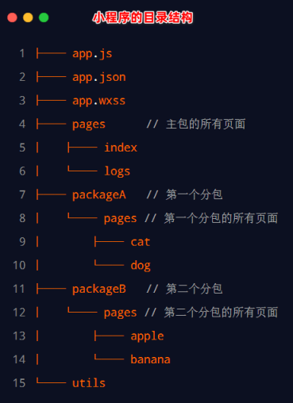

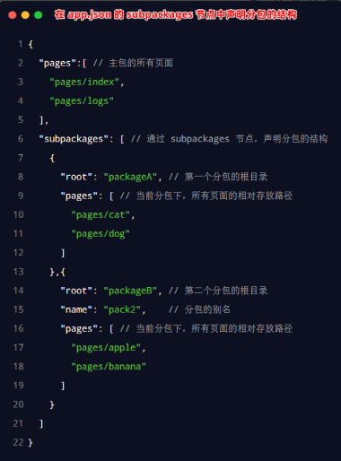


**打包原则**：小程序会按 `subpackages` 的配置进行分包，subpackages 之外的目录将被打包到主包中。注意，tabBar 页面必须在主包内，且分包之间不能互相嵌套。

 **引用原则**：主包无法引用分包内的私有资源；分包之间不能相互引用私有资源；分包可以引用主包内的公共资源。


### 独立分包和分包预下载

**独立分包**本质上也是分包，只不过它可以独立于主包，单独运行。也就是说用户可以通过主包进入小程序，也可以通过独立分包进入小程序。

如何声明独立分包？在subpackages下的分包配置中指定`"independent": true` 

> 一个小程序中可以有多个独立分包。独立分包的私有资源都不允许被外界(主包/分包)访问，也不能访问外界的所有资源。

**分包预下载**指的是：在进入小程序的**指定页面**时，自动预下载可能需要的分包，从而提升进入后续分包页面时的启动速度。

在 app.json 中，使用 `preloadRule` 节点定义分包的预下载规则：

```json
{
    "preloadRule": {
        "pages/contact/contact": {
            // 指定的网络模式下进行预下载，all表示不限网络，wifi表示仅在wifi模式下才进行预下载
            "network": "all",
            // 指定预下载的分包
            "packages": ["pkgA"]
        }
    }
}
```

> 同一个分包中的页面享有共同的预下载大小限额 **2M**。


Vant Weapp
----------

小程序中已经支持使用 npm 安装第三方包，从而来提高小程序的开发效率。但是能供小程序使用的包却“为数不多”，因为在小程序中使用npm 包有如下 3 个限制：

1. 不支持依赖于 Node.js 内置库的包
2. 不支持依赖于浏览器内置对象的包
3. 不支持依赖于 C++ 插件的包

Vant Weapp 是有赞前端团队开源的一套小程序 UI 组件库，助力开发者快速搭建小程序应用。它所使用的是MIT 开源许可协议，对商业使用比较友好。类似于ElememtUI框架。


### 使用Vant组件

> [vant小程序版官网](https://vant-contrib.gitee.io/vant-weapp/#/home) 

1. 在项目中初始化package.json文件：`npm init -y` 

2. 通过npm安装Vant 组件库：`npm i @vant/weapp -S --production` 

3. 将 app.json 中的 `"style": "v2"` 去除，小程序的[新版基础组件](https://developers.weixin.qq.com/miniprogram/dev/reference/configuration/app.html#style)强行加上了许多样式，难以覆盖，不关闭将造成部分组件样式混乱。

4. 修改 project.config.json

   ```json
   {
     ...
     "setting": {
       ...
       "packNpmManually": true,
       "packNpmRelationList": [
         {
           "packageJsonPath": "./package.json",
           "miniprogramNpmDistDir": "./"
         }
       ]
     }
   }
   ```

5. 打开微信开发者工具，点击 **工具 -> 构建 npm**，并勾选 **使用 npm 模块** 选项(在新版本中已经默认使用了)，构建完成后，即可引入组件。

   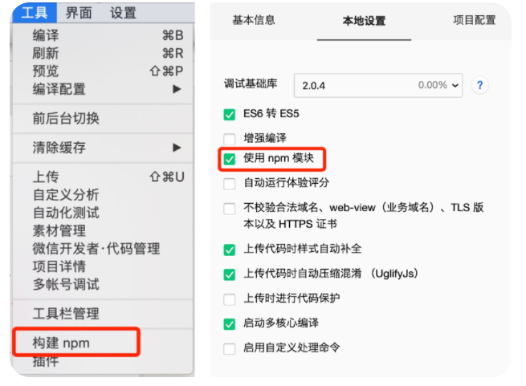

6. 在 app.json 的 usingComponents 节点中引入需要的组件，即可在 wxml 中直接使用组件。

   ```json
   "usingComponents": {
     "van-button": "@vant/weapp/button/index"
   }
   ```

7. 使用组件

   ```html
   <van-button type="primary">按钮</van-button>
   ```


### 定制全局主题样式

在 app.wxss 中，写入 CSS 变量，即可对全局生效：

```css
Page{
    /* --后面跟的是变量名，我们也可以自定义变量然后使用 */
   --button-danger-background-color: #C00000;  
}
```

所有可用的颜色变量，请参考 Vant 官方提供的配置文件：