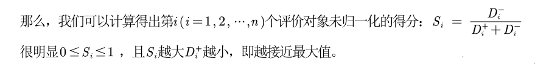
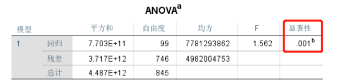
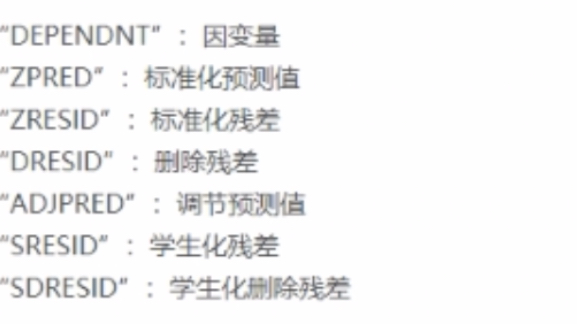
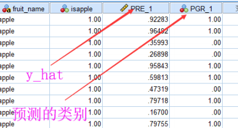
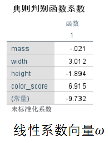
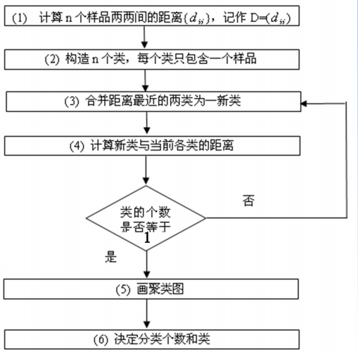

# 数学建模

# 1. 层次分析法

主要用于解决**评价类**问题（例如：选择哪种方案最好，哪个员工表现最佳）

解决评价类问题，首先要想到以下三个问题：

1. 我们评价的目标是什么？
2. 我们为了达到这个目标有哪几种可选的方案？
3. 评价的准则或指标是什么？（我们根据什么东西来评价好坏）
   - 如果题目没给则需要自己确定。

**首先**，我们可以百度或者在背景材料中提取准则或指标。推荐去 知网、万方、百度学术 搜索相关论文。

**其次**，对这些指标跟可选方案进行建表：

|       | 指标权值      | 可选方案1 | 可选方案2 | 可选方案3…       |
| ----- | ------------- | --------- | --------- | ---------------- |
| 指标1 |               |           |           | 指标1的总和要为1 |
| 指标2 |               |           |           | 指标2的总和要为1 |
| 指标3 |               |           |           | 指标3的总和要为1 |
| …..   | 权重总和要为1 |           |           |                  |

***

**第三步**，计算权重。

如果直接对很多个指标的权重进行计算，那么可能会出现考虑不周的情况。由此我们可以对指标两两进行比较，然后在整合成一张大表。这也是层次分析法的思想。

通常我们会对每个指标进行打分的方式来进行计算权重。

|  标度   |                   含义                   |
| :-----: | :--------------------------------------: |
|    1    |        表示两个因素相比，同样重要        |
|    3    |       一个因素比另一个因素稍微重要       |
|    5    |       一个因素比另一个因素明显重要       |
|    7    |       一个因素比另一个因素强烈重要       |
|    9    |       一个因素比另一个因素极端重要       |
| 2,4,6,8 |           上述两相邻判断的中值           |
|  倒数   | A和B相比如果标度为3，那么B和A相比就是1/3 |

比如现在对下列指标进行打分。

|      | 景色 | 花费 | 居住 |
| :--: | :--: | :--: | :--: |
| 景色 |  1   | 1/2  |  4   |
| 花费 |  2   |  1   |  7   |
| 居住 | 1/4  | 1/7  |  1   |

若把表格记为A，对应元素为`aij`，那么`aij` 表示的意思是，与指标`j` 相比，`i` 的重要程度

很明显，对角线肯定是1，因为自己对自己来说肯定是同样重要的。

`a21` 则表示花费对景色来说略微重要，相反，在`a12` 的位置就是它的倒数即1/2。

观察上面的方阵，有如下特点：

1. `aij` 表示的意思是，与指标`j` 相比，`i` 的重要程度
2. 当`i=j`时，两个指标相同，记为1。
3. `aij` > 0且满足 `aij × aji = 1` （我们称满足这一条件的矩阵为**正互反矩阵**）

实际上，此矩阵就是层级分析法中的**判断矩阵**。

上面只是完成了判断矩阵，如何进行计算权重，后面再讲。

现在先来做 可选方案在每个指标所占的分数。

| 景色 | 西河 | 东湖 | 桂林 |
| :--: | :--: | :--: | :--: |
| 西河 |  1   |  2   |  5   |
| 东湖 | 1/2  |  1   |  2   |
| 桂林 | 1/5  | 1/2  |  1   |

其他指标以此类推。

接下来讨论一下可能出问题的地方。

比如把上表改成这样：

| 景色 | 西河 | 东湖 | 桂林 |
| :--: | :--: | :--: | :--: |
| 西河 |  1   |  2   |  1   |
| 东湖 | 1/2  |  1   |  2   |
| 桂林 |  1   | 1/2  |  1   |

此表说明，西河>东湖，西河=桂林 而 东湖>桂林，出现了矛盾之处。

此矩阵就是不一致矩阵。相反，我们往往需要的是 **一致矩阵** 或者尽量接近一致矩阵。

**一致矩阵的特点：在各行（各列）之间成倍数关系。** 

所以，在使用判断矩阵计算权重之前，必须对其进行`一致性检验`。


一致性检验的步骤：

1. 计算**`一致性指标CI`**：`CI = (λmax-n)/(n-1)` λmax为最大特征值
2. 查找对应**`平均随机一致性指标RI`** ，可百度
3. 计算**`一致性比例CR`** ：`CR=CI/RI`

如果**`CR<0.1`**,则认为判断矩阵的一致性可以接受；否则需要对其进行修正。如何修正呢，尽量往倍数关系那靠。


那判断矩阵如何计算权重呢？有三种方法：算术平均法、几何平均法、

以下表为例：

| 景色 | 西河 | 东湖 | 桂林 |
| :--: | :--: | :--: | :--: |
| 西河 |  1   |  2   |  5   |
| 东湖 | 1/2  |  1   |  2   |
| 桂林 | 1/5  | 1/2  |  1   |

**算术平均法**：

第一步：对每一列进行归一化处理

```
第一列：
西河 = 1/(1+0.5+0.2) = 0.5882
东湖 = 0.5/(1+0.5+0.2) = 0.2941
桂林 = 0.2/(1+0.5+0.2) = 0.1177
第二列：
西河 = 2/（2+1+0.5）= 0.5714
东湖 = 1/（2+1+0.5）= 0.2857
桂林 = 0.5/（2+1+0.5）= 0.1429
第三列：
西河 = 5/（5+2+1）= 0.625
东湖 = 2/（5+2+1）= 0.25
桂林 = 1/（5+2+1）= 0.125
```

第二步：求平均权重

```
综合上述三列，我们求平均权重
西河 =（0.5882+0.5714+0625）/3 =05949
东湖 =（0.2941+0.2857+025）/3 =02766
桂林 =（0.1177+01429+0125）/3 =01285
```


**特征值法**：

第一步：求出矩阵A的最大特征值以及其对应的特征向量

第二步：对求出的特征向量进行归一化即可得到我们的权重


最后，到这一步就可以填完一开始的表格了，然后计算出每个可选方案的得分。

***

**总结**：

第一步：分析系统中各因素之间的关系，建立系统的递阶**层次结构**。要画图

第二步：对于同一层次的各元素关于上一层次中某一准则的重要性进行两两比较，构造出判断矩阵.

第三步：进行一致性检验然后计算出相对权重。

​				三种方法计算权重：（1）算术平均法（2）几何平均法（3）特征值法

```
以往的论文利用层次分析法解决实际问题时，都是采用其中某一种方法求权重，而不同的计算方法可能会导致结果有所偏差。为了保证结果的稳健性，本文采用了三种方法分别求出了权重，再根据得到的权重矩阵计算各方案的得分，并进行排序和综合分析，这样避免了采用单一方法所产生的偏差，得出的结论将更全面、更有效。
```

第四步：计算各层元素对系统目标的合成权重，并进行排序


**局限性**：评价的决策层不能太多，太多的话n会很大，判断矩阵和一致矩阵差异
可能会很大。

而有些时候，并不是每个指标都对着每个可选方案。而是可能一对一或者多对一等情况。

下面来练习的例子。

现有层次如下的模型：


# 2. 优劣解距离法

也叫`TOPSIS` 方法。该方法对数据分布及样本含量没有严格限制，数据计算简单易行。

先解释一些专业名词：

| 指标名称         | 指标特点                 | 例子                     |
| ---------------- | ------------------------ | ------------------------ |
| 极大型（效益型） | 指标越大（多）越好       | 成绩、GDP增速、企业利润  |
| 极小型（成本型） | 指标越小（少）越好       | 费用、坏品率、污染程度   |
| 中间型指标       | 越接近某个值(最佳值)越好 | 水质量评估时的PH值       |
| 区间型指标       | 落在某个区间最好         | 体温、水中植物性营养物量 |

`正向化`：将所有的指标转化为**极大型**称为指标正向化（最常用）

**级小型 → 极大型** 公式：**`max - x`**

**中间型指 → 标极大型指标** 公式：


**区间型指标 → 标极大型指标** 公式：


`标准化处理`：对**已经正向化**的矩阵消去不同指标量纲(单位)的影响。标准化的目的是**消除不同指标量纲的影响**。


<u>注意：以上的公式都不是唯一的。</u>


`TOPSIS` 的基本过程为：

1. 为先将原始数据矩阵统一指标类型（一般正向化处理得到**正向化**的矩阵）
2. 再对正向化的矩阵进行**标准化**处理以消除各指标量纲的影响，并找到有限方案中的最优方案和最劣方案
3. 分别计算各评价对象与最优方案和最劣方案间的距离
   - 
4. 获得各评价对象与最优方案的相对接近程度（即给每个对象打分），以此作为评价优劣的依据
   - 

`Zj+`为每个指标的最大值，`Zj-`为每个指标的最小值，`zij`为第`j` 指标的第`i` 对象的值。`wj` 为 每个指标的权重。

**最后可以将S进行归一化**。


# 3. 插值算法

> 在数学建模中，插值算法一般用来补全数据。

所谓插值，就是根据已知的点（称为**插值节点**），求出一个经过这些点的函数（称为**插值函数**）后，再对给定条件的x根据函数求其对应y值。比如，给出过去十年的人口数量，求未来几年的人口数量。过去十年跟过去十年的人口数量就是已知点，未来几年就是给定条件的x，未来几年人口的数量就是其对应的y值。

求插值函数的方法有很多，主要有：

- 分段插值：将点进行分组，每组分别用不同的多项式。分段n次插值就表示每组的点之间使用n次多项式来对x求y值。例如分段二次插值，则每组的点的插值函数为`a0+a1*x1+a2*x2^2` 
- 插值多项式：`P(x)=a0+a1*x+…+an*x^n` 的形式

拉格朗日插值法跟牛顿插值法在高次插值(即很多已知点)时都会产生**龙格现象**，并且都不能全面反映被插值函数的性态。龙格现象就是求出来的插值函数两端处波动极大，产生明显的震荡。


因此，在建模中一般都采用**分段三次埃尔米特插值法**跟**三次样条插值法**。


## 3.1 分段三次埃尔米特

埃尔米特插值多项式：不但要求在节点上的函数值相等，而且还要求对应的导数值也相等甚至要求高阶导数也相等。保持插值曲线在节点处有更光滑，使插值函数和被插函数的密和程度更好。

但是，直接使用 Hermite插值得到的多项式次数较高，也存在着龙格现象，因此在实际应用中，往往使用分段三次 Hermite插值多项式（PCHIP）。

在Matlab中有PCHIP的内置函数：

**pchip(x,y,target_x)** xy为已知点，target_x为要计算的x值

```matlab
% 分段三次埃尔米特插值
x = -pi:pi; y = sin(x); 
target_x = -pi:0.1:pi;
p = pchip(x,y,target_x);
figure(1); % 在同一个脚本文件里面，要想画多个图，需要给每个图编号，否则只会显示最后一个图
plot(x, y, 'o', target_x, p, 'r-')
```


## 3.2 三次样条插值

**spline(x, y, target_x)** xy为已知点，target_x为要计算的x值

**interpn (x, y, target_x, 'spline')** 与上者等价


# 4. 拟合算法

> 在数学建模中，拟合算法可以用来查看趋势等

拟合跟插值类似，只不过拟合求得的函数不需要经过已知点（样本点），接近就行。

在建模中，拟合一般用于

拟合中一般函数的大致形式是我们自己给定的，比如我们根据已知点给出假定说：此函数（拟合曲线）为`y=kx+b`，此时我们就可以利用拟合算法来求出参数k和b。


**最小二乘法**的思想：当所有样本点与拟合曲线距离之和最短时求得拟合曲线的参数。

如何求每个样本点与拟合曲线的距离？很简单，直接 **($y_i$- $\hat y$) $^2$** 。

那如何求所有样本点与拟合曲线的距离之和呢？很简单，直接将上面公式求和 **$\sum_{i=1}^n$ ($y_i$- $\hat y$) $^2$** 

那专业术语是如何表达距离之和最小时求得的参数值呢？**$\hat k$,$\hat b$ = $arg\,\min_{\hat k \hat b}$ ($\sum_{i=1}^n$ (**$y_i$- $\hat y$**) $^2$ )**

思考：为什么求样本点与拟合曲线的距离时不使用绝对值、三次方或四次方，一定要二次方呢？

1. 使用绝对值时有一点处是不可导的。
2. 使用三次方时，误差会正负相抵。
3. 使用四次方时，容易造成极端数据对拟合曲线的影响。


由于拟合曲线的大致形式是我们自己猜测的，所有有时候与样本点相差甚远，那我们该如何评价拟合的好坏呢？（即判断我们猜测的函数是否合理）

首先来看一下一些专业名词的定义：

- 总体平方和SST：**SST = $\sum_{i=1}^n$ ($y_i$- $\overline y$) $^2$** 
- 误差平方和SSE：**SSE = $\sum_{i=1}^n$ ($y_i$- $\hat y$) $^2$**
- 回归平方和SSR：**SSR = $\sum_{i=1}^n$ ($\hat y$ - $\overline y$) $^2$**

有个结论：`SST = SSE + SSR` 

拟合优度：**R$^2$ = $\frac {SSR}{SST}$ = 1 - $\frac {SSE}{SST}$  （0<R$^2$<1）**  

由上式可知，**R$^2$越接近1，说明误差平方和越接近0，拟合效果越好**。

**tips**：

1. 使用R$^2$ 来判断拟合的好坏的**前提**是拟合函数要为线性函数。
2. 非线性函数比较拟合的好坏时直接看**SSE**即可。


**线性函数**的介绍：

线性函数有两种解释

1. 一种是对**变量线性**：即变量是线性的，比如`a*x+b` 变量x是线性的。
2. 一种是对**参数线性**：即参数是线性的，比如`a*x^2+b` 参数a，b是线性的。

可能有些小伙伴不太清除线性的意思，这里啰嗦一句。

> 线性就是在函数中，参数仅以一次方出现，且不能乘以或除以其他任何的参数，并不能出现参数的复合函数形式

比如 y = $a_1$+$a_2$x+$a_3$x$^2$ 、y = e$^{a_1+a_2x}$ 都是线性函数。注意：我们这里讲的都是参数线性。


在`matlab`中，有个很好用的拟合工具箱，专门用来处理拟合操作。


也可以直接在命令行输入`cftool` 打开拟合工具箱。

具体功能如下：


工具箱提供的拟合类型有：

1. Custom Equations：用户自定义的函数类型
2. Exponential：指数逼近，有2种类型， a\*exp(b\*x) 、 a\*exp(b\*x) + c\*exp(d\*x)
3. Fourier：傅立叶逼近，有7种类型，基础型是 a0 + a1\*cos(x\*w) + b1\*sin(x\*w)
4. Gaussian：高斯逼近，有8种类型，基础型是 a1\*exp(-((x-b1)/c1)^2)*
5. Interpolant：插值逼近，有4种类型，linear、nearest neighbor、cubic spline、shape-preserving
6. Polynomial：多形式逼近，有9种类型，linear ~、quadratic ~、cubic ~、4-9th degree ~
7. Power：幂逼近，有2种类型，a\*x^b 、a\*x^b + c
8. Rational：有理数逼近，分子、分母共有的类型是linear ~、quadratic ~、cubic ~、4-5th degree ~；此外，分子还包括constant型
9. Smoothing Spline：平滑逼近
10. Sum of Sin Functions：正弦曲线逼近，有8种类型，基础型是 a1\*sin(b1\*x + c1)
11. Weibull：只有一种，a\*b\*x^(b-1)\*exp(-a*x^b)

**tips**：

- 如果选Custom Equations时，拟合曲线与样本点距离较远，可以适当点击`Fit options` 按钮的`StartPoint` 。


# 5. 相关系数

> 相关系数是用来衡量两个变量之间的相关性的大小，根据数据满足的不同条件，我们要选择不同的相关系数进行计算和分析，一般用的比较多的是**斯皮尔曼**相关系数。

虽然相关系数可以反映两个数据的相关性，但是大家往往更关注的是显著性（假设检验）。

首先，在算显著性之前我们最好给出数据的描述性统计，例如算出每组数据的最小、最大、中位数、均值、偏度、风度、标准差等，然后可以利用`spass`做个统计。

```matlab
MIN = min(Test); % 每一列的最小值
MAX = max(Test); % 每一列的最大值
MEAN = mean(Test); % 每一列的均值
MEDIAN = median(Test); %每一列的中位数
SKEWNESS = skewness(Test); %每一列的偏度
KURTOSIS = kurtosis(Test); %每一列的峰度
STD = std(Test); % 每一列的标准差
RESULT = [MIN;MAX;MEAN;MEDIAN;SKEWNESS;KURTOSIS;STD] 
%将这些统计量放到一个矩阵中表示
```


## 5.1 斯皮尔曼相关系数

斯皮尔曼相关系数用来描述定序数据最为合适。

**定序数据**是指仅仅反映观测对象等级、顺序关系的数据，是由定序尺度计量形成的，表现为类别，可以进行排序，属于品质数据。


### 5.1.1 斯皮尔曼定义一

- 定义：X和Y为两组数据，其斯皮尔曼（等级）相关系数：
  
  其中，di为Xi和Yi之间的等级差。可以证明：rs位于-1和1之间。
- 等级差
  一个数的等级，就是将它所在的一列按照从小到大排序后，这个数所在的位置。
  

根据公式计算可得：X和Y的斯皮尔曼相关系数 rs = 0.875


###5.1.2 斯皮尔曼定义二

另一种斯皮尔曼相关系数被定义成**等级之间的皮尔逊相关系数**。值得注意的是，**MATLAB的corr函数使用的是该定义下的计算方式**。

corr函数的两种用法：

1. **corr(X , Y , 'type' , 'Spearman')**  计算X跟Y的斯皮尔曼相关系数，X和Y必须是列向量
2. **corr(X , 'type' , 'Spearman')** 计算X矩阵的各列之间的斯皮尔曼相关系数

```matlab
% 求两组数据的斯皮尔曼
X = [3 8 4 7 2]' % 一定要是列向量哦，一撇'表示求转置
Y = [5 10 9 10 6]'
r = corr(X , Y , 'type' , 'Spearman')  % 0.8721
```


### 5.1.3 对斯皮尔曼相关系数进行假设检验

1. 当`n<=30`时，直接查临界值表即可。（$H_0$：$r_s=0$   $H_1:r_s ≠0$）

   使用得出的斯皮尔曼相关系数 r 与对应的临界值$r_0$进行比较，只有$r ≥ r_0$时 才会接受$H_0$ 

   

2. 大样本情况下，

   统计量满足 $r_s \sqrt {n-1} $ **~** $N(0,1) $

   $H_0$：$r_s=0$   $H_1:r_s ≠0$ 

   我们计算 R = $r_s \sqrt {n-1}$ ，并求 R对应的p值P，将P与0.05比较。

   P≥0.05，接受$H_0$ 

   在`matlab`中**`corr`**函数可以直接得出相关系数跟p值

   ```matlab
   % R为相关系数  P为p值
   [R,P]=corr(Test, 'type' , 'Spearman')
   ```

**tips：$r_s = 0$ 表示这两组数据无明显相关性。**

**在建模中，使用斯皮尔曼相关系数计算时，可以使用SPSS列出相关性的表格（分析->相关->双变量）** 


## 5.2 皮尔逊相关系数

因为使用皮尔逊相关系数的前提有三点，所以一般不适用 **皮尔逊**相关系数。

前提：

- 两个变量之间是**线性**关系，且是连续数据。
- 两个变量的总体是**正态分布**，或接近正态的单峰分布。
- 两个变量的观测值是成对的，且每对观测值之间**相互独立**。

在给出不使用皮尔逊相关系数计算的时候，最好可以给出`矩阵散点图`（图形 ‐ 旧对话框 ‐ 散点图/点图 ‐ 矩阵散点图）来说明。


复习一下《概率论与数理统计》中的均值与协方差的公式：

如果给了两组数据X:{$X_1,X_2,...,X_n$}和Y:{$Y_1,Y_2,...,Y_n$}是总体数据，那么

总体均值 **E(X) =** **$\frac {1}{n}$ $\sum_{i=1}^n X_i$**， E(Y) = **$\frac {1}{n}$ $\sum_{i=1}^n Y_i$**

总体协方差：**Cov(X,Y) =** **$\frac {1}{n}$ $\sum_{i=1}^n (X_i-E(X))(Y_i-E(Y))$**

协方差可以反映出两组数据的相关性。但是协方差的大小与两组数据的梁刚有关，因此不适合作比较。

而 皮尔逊相关系数则可以看成是排除了量纲的影响，即将X,Y标准化后的协方差。

`matlab`中的函数**`corrcoef`**可以直接计算皮尔逊相关系数

```matlab
% 返回 A 的相关系数的矩阵，其中 A 的列表示随机变量（指标），行表示观测值（样本）。
R = corrcoef(A)  

% 返回两个随机变量 A 和 B （两个向量）之间的系数
R = corrcoef(A,B)
```


### 5.2.1 对皮尔逊相关系数进行假设检验


# 6.典型相关分析

前面提到的斯皮尔曼跟皮尔逊都是研究单单两个指标之间的内在联系（一元）。

而**典型相关分析**（Canonical Correlation analysis）研究**两组**变量（每组变量中都可能有多个指标）之间相关关系的一种**多元**统计方法。它能够揭示出两组变量之间的内在联系。它的思想在于**降维**。

需要注意的是，这两组变量都要符合正态分布，题目中如果没说符不符合，我们可以假设它符合。

使用步骤：

1. 在每组变量中找出变量的线性组合，使得两组的线性组合之间具有**最大**的相关系数；
2. 如果第一次求出的相关系数不满足条件，则需要选取过和前面次数都不相关的线性组合；
3. **如此继续下去**，直到两组变量之间的相关性被提取完毕为止或已经可以满足条件。

**tips**：被选出的线性组合配对称为**`典型变量`**，它们的相关系数称为**`典型相关系数`**。典型相关系数度量了这两组变量之间联系的强度。


比如身体性能（身高、腰围、体重）与体育性能（引体向上、仰卧起坐、体前屈）之间的关系，此时如果直接对这些变量两两进行分析，那么得到的结果是片面的。那要如何做呢?

我们可以把身体性能的多个指标通过简单的线性组合 形成一个代表身体性能的`典型变量`，体育性能亦如此，这样我们就可以将6个指标降到2个指标（这就是降维的思想）。

假设我们把第一组的身高、腰围、体重分别记为$X_1^{(1)}、X_2^{(1)}、X_3^{(1)}$ ，则这三个指标通过线性组合形成的`典型变量` 记为 $U_i = a_1^i X_1^{(1)} + a_2^i X_2^{(1)} + a_3^i X_3^{(1)}$ ，**i代表第几次**。用矩阵表示为：$U_i = {a^i}^` X^{(1)}$  变量a的转置矩阵乘以变量$X_i$ 

同理把第二组的引体向上、仰卧起坐、体前屈分别记为 $X_1^{(2)}、X_2^{(2)}、X_3^{(2)}$ ，这三个指标形成的`典型变量` 记为$V_i = b_1^i X_1^{(2)} + b_2^i X_2^{(2)} + b_3^i X_3^{(2)}$ 。

**tips：$U_iV_i$叫做典型变量； $a_1a_2a_3, b_1b_2b_3$ 称为典型相关系数**

因为相关系数与量纲无关，所以需要加上一个条件：$var(U_i)$ = $var(V_i)$ = 1，两者的方差要等于1。

那如何要保证每一次的线性组合都不相关呢？$cov(U_{i-1},U_i)$ = $cov(V_{i-1},V_i)$ = 0。


知道了上面的一些定义，那如何求典型相关系数呢？

在`SPSS 24`版本以前，我们需要自己编写代码来求解，在24以后，`SPSS` 提供了直接求解典型相关分析的功能。

如果你的SPSS在24以上却没有典型相关分析功能，则可能是因为你在安装SPSS的时候修改了默认安装路径，卸载重装使用默认路径即可。

现在来讲解此功能。

第一步，导入数据。


第二步，检验数据的类型（全部变成标度）


第三步，选择使用典型相关分析


第四步：将数据移动到对应的集合


第五步：对结果进行分析

该表格的显著性（p值）如果**小于**0.05（0.1）表示在95%（90%）的置信水平下拒绝原假设，即认为这两组变量有关，其相关性如第二列所示。

那么上图表格说明了进行了三次线性组合，而这三次的两组变量都有关，而且相关性分别为0.995、0.953、0.637。


该表格说明了在集合1中第一次求得的典型相关系数为0.149、0.977、-0.052，相对应的本次的典型变量$u_1 = 0.149*低学历+0.977*高学历-0.052*互联网$ 。其他次也是同样的求法。


同理也可求得集合二的典型相关系数跟典型变量，以第一次的为例：$V_1 = 0.858*艺术家+0.019*发行+0.145*行内主管$。


<u>接着两个表格是非标准化的，我们一般不使用（因为使用标准化的更好）。</u>


典型载荷是指原始变量与典型变量之间的相关性分析，比如集合1的典型载荷的第一典型变量与低学历的相关系数为0.333，与高学历的相关系数为0.993，与互联网的相关系数为0.383。从另一方面说明集合1的第一对典型变量与低学历、高学历、互联网都成正相关。其中高学历的相关性最强。第一对典型变量主要反映了高学历观众对电视节目的打分。


# 7. 回归分析

**回归分析**是数据分析中最基础也是最重要的分析工具，绝大多数的数据分析问题，都可以使用回归的思想来解决。

回归分析的**任务**就是通过研究**自变量X**和**因变量Y**的**相关关系**，尝试去解释Y的形成机制，进而达到通过X去预测Y的目的。

`XY`也有另外一种叫法：把`X`称为**解释变量**，`Y`称为**被解释变量**。

需要注意的是：`相关关系≠因果关系`。


常见的回归分析有五类：**线性回归、0‐1回归、定序回归、计数回归和生存回归**，其划分的依据是因变量Y的类型。


回归分析要完成的三个**使命**：

1. **识别重要变量**：判断哪些X变量是真的与Y相关，这一步也叫作**变量选择**。
2. **判断相关性的方向**：去除了第一步的不相关变量后，判断留下的变量与Y的相关关系的正负。
3. **估计权重（回归系数）**：在确定了重要的X变量的前提下，我们还想给不同X赋予不同的权重，也就是不同的回归系数，进而我们可以知道不同变量之间的相对重要性。


## 7.1 回归类型与数据类型

回归类型 

在实际应用中，`Y`常常是我们需要研究的那个核心变量。

1. 经济学家研究经济增长的决定因素，那么Y可以选取为GDP增长率**（Y为连续数值型变量）**。
2. P2P公司要研究借款人是否能按时还款，那么Y可以设计成一个二值变量，Y=0时代表可以还款，Y=1时代表不能还款**（Y为0‐1型变量）**。
3. 消费者调查得到的数据Y（1表示非常不喜欢，2表示有点不喜欢，3表示一般般，4表示有点喜欢，5表示非常喜欢）**（Y为定序变量）**。
4. 管理学中RFM模型：F代表一定时间内，客户到访的次数Y，次数其实就是一个非负的整数。**（Y为计数变量）**。
5. 研究产品寿命、企业寿命甚至是人的寿命Y（这种数据往往不能精确的观测，例如现在要研究吸烟对于寿命的影响，如果选取的样本中老王60岁，现在还活的非常好，我们不可能等到他去世了再做研究，那怎么办呢？直接记他的寿命为60+，那这种数据就是截断的数据）**（Y为生存变量）**

| 类型     |         模型         |     Y的特点     |        例子        |
| -------- | :------------------: | :-------------: | :----------------: |
| 线性回归 | OLS、GLS（最小二乘） | 连续数值型变量  |  GDP、产量、收入   |
| 0-1回归  |     logistic回归     | 二值变量（0‐1） | 是否违约、是否得病 |
| 定序回归 |    probit定序回归    |    定序变量     | 等级评定（优良差） |
| 计数回归 | 泊松回归（泊松分布） |    计数变量     |    每分钟车流量    |
| 生存回归 |  Cox等比例风险回归   |    生存变量     |  企业、产品的寿命  |


数据的分类

1. **横截面数据**：在某一时间段收集的不同对象的数据。

   - 例如：

     （1）我们自己发放问卷得到的数据

     （2）全国各省份2018年GDP的数据

     （3）大一新生今年体测的得到的数据

2. **时间序列数据**：对同一对象在不同时间连续观察所取得的数据。

   - 例如：

     （1）从出生到现在，你体重的数据（每年生日称一次)。 

     （2）中国历年来GDP的数据。

     （3）在某地方每隔一小时测得的温度数据。

3. **面板数据**：横截面数据与时间序列数据综合起来的一种数据资源。

   - 例如：2008‐2018年，我国各省份GDP的数据。


不同数据类型的处理方法

|   数据类型   |                常见建模方法                 |
| :----------: | :-----------------------------------------: |
|  横截面数据  |                多元线性回归                 |
| 时间序列数据 | 移动平均、指数平滑、ARIMA、GARCH、VAR、协积 |
|   面板数据   |   固定效应和随机效应、静态面板和动态面板    |


## 7.2 多元线性回归

一元线性回归跟多元线性回归的区别：一元线性回归只有一个自变量x，而多元线性有多个。

**一元线性回归模型**
 假设x是自变量，y是因变量，且满足如下线性关系: **$y_i = β_0+β_1x_i+μ_i$** 
 β0和β1为回归系数，β0的数值意义我们一般不考虑，μ为无法观测的且满足一定条件的扰动项。

所谓线性，拟合那章说过，这里不再赘述，比如下面的函数都是线性的：

$y_i=β_0+β_1lnx_i+μ_i$ 

$lny_i=β_0+β_1lnx_i+μ_i$ 

$y_i=β_0+β_1x_{1i}+β_2x_{2i}+σx_{1i}x_{2i}+μ_i$ 

线性回归又分为两种：

1. **解释**性线性回归：$R^2$不需要太大，能解释就行。
2. **预测**性线性回归：$R^2$越接近于一越好，例如拟合操作。


**内生性跟外生性** 

如果满足误差项𝝁和所有的自变量x均不相关，则称该回归模型具有**`外生性`**。（如果与其中一个相关，则存在**`内生性`**，内生性会导致回归系数估计的不准确：不满足无偏和一致性）

**核心解释变量和控制变量** 

很明显，完全做到外生性是不现实的。那么我们就需要对其进行弱化。

所谓弱化就是将所有的解释变量**x**分为**`核心解释变量`**与**`控制变量`**两类，**在实际应用中，我们只要保证核心解释变量与𝝁不相关即可** 

- `核心解释变量`：我们最感兴趣的变量，因此我们特别希望得到对其系数的一致估计（当样本容量无限增大时，收敛于待估计参数的真值 ）。
- `控制变量`：我们可能对于这些变量本身并无太大兴趣；而之所以把它们也放入回归方程，主要是为了 “控制住” 那些对被解释变量有影响的遗漏因素。


**四类模型回归系数的解释** 

1. `一元线性回归`：y=a+bx+μ，x每增加1个单位，y平均变化b个单位。
2. `双对数模型`：lny=a+blnx+μ，x每增加1%，y平均变化b%
3. `半对数模型`：y=a+blnx+μ，x每增加1%，y平均变化b/100个单位；
4. `半对数模型`：lny=a+bx+μ，x每增加1个单位，y平均变化（100b）%


**取对数意味着原被解释变量对解释变量的弹性，即百分比的变化而不是数值的变化**；

目前，对于什么时候取对数还没有固定的规则，但是有一些经验法则：

1. 与市场价值相关的，例如，价格、销售额、工资等都可以取对数；
2. 以年度量的变量，如受教育年限、工作经历等通常不取对数；
3. 比例变量，如失业率、参与率等，两者均可；
4. 变量取值必须是非负数，如果包含0，则可以对y取对数ln(1+y);

**取对数的好处：**（1）减弱数据的异方差性（2）如果变量本身不符合正态分布，取

了对数后可能渐近服从正态分布（3）模型形式的需要，让模型具有经济学意义。


**求解多元线性回归**：


然后统计好**调整后的$R^2$** 、**显著性（P值）**、**标准化系数**。





符合置信区间前提下，标准化系数绝对值越大，对因变量的影响就越大。


**补充：关于拟合优度和调整后的拟合优度：** 

我们引入的自变量越多，拟合优度会变大。但我们倾向于使用调整后的拟合优度，如果新引入的自变量对SSE的减少程度特别少，那么调整后的拟合优度反而会减小。


## 7.3 补充

在之前的回归分析中，我们都默认了扰动项是**球型扰动项**（满足“同方差”和“无自相关”两个条件）。

而**横截面数据**容易出现异方差的问题；**时间序列数据**容易出现自相关的问题。

如果<u>扰动项</u>存在<u>异方差</u>：

（1）OLS估计出来的回归系数是无偏、一致的。

（2）假设检验无法使用（构造的统计量失效了）。

（3）OLS估计量不再是最优线性无偏估计量（BLUE）。

解决异方差的方法：

（1）使用OLS + 稳健的标准误（大多数情况时用此方法）

（2）广义最小二乘估计法GLS（方差较小的数据给予更大的权重）

可以先自己对异常数据进行删除，或者给数据加ln。


<u>在使用SPSS求解多元线性回归时，应该先对数据进行预处理、对数据进行正态线性检验、异方差检验、自相关检验以及共线性检验。</u>


### 7.3.1 数据预处理

自变量中有**`定性变量`**，例如性别、地域。

例如，工资 $y_i = β_0+σ_0sex_i+β_1x_1+...+β_nx_n$ 

令 $sex_i$=1表示女性；$sex_i$=0表示男性；（取0的为对照组）

那么$σ_0$可解释为：在其他自变量给定的情况下，女性的平均工资 大于/小于 男性的平均工资


地域借款是否成功$success_i = α+\sum{β_n×Province_n} +λ×Controls_i+μ$ 

假如有21个自变量，我们需要拿一个出来作为对照组（比如拿广东），此时n=20

比如，$province_1$表示江苏，当且仅当地域为江苏时，$province_1$取1，其他$province_n$都取0

这么做是为了避免多重共线性。


含有**`交互项`**的自变量

比如 房价$price=β_0+β_1area+β_2rNum+β_3area·rNum+μ$ 

若 $β_3>0$ 则意味着住房面积越大，增加一间卧室导致房价增长。换言之，住房的平方英尺数与卧室的间数之间存在交互效应。


### 7.3.2 正态线性检验

做回归分析之前，变量必须满足正态性，**一般在建模中都是假设变量满足正态性**。

我们也可以使用SPSS来检验数据符不符合正态性。


### 7.3.3 异方差检验

第一种方式：





第二种方式：（斯皮尔曼）

（1）回归计算时，在回归主对话框中单击[保存]按钮，选择[惨差]中的[未标准化残差]选项，单击[继续]返回主对话框。输出结果的同时，将把残差保存为一新变量res_1。

（2）计算残差的平方。选择 [转换] => [计算变量]，在显示的对话框中输入残差平方的变量名（如e2）和计算残差平方的表达式(如res_1 **2 )。单击[OK]后将产生一个新变量。


（3）


### 7.3.4 共线性检验


**VIF方差膨胀因子**

共线性即多重共线性，是指线性回归模型中的解释变量之间由于存在精确[相关关系](https://baike.baidu.com/item/相关关系/9227098)或高度相关关系而使模型估计失真或难以估计准确

如果发现存在多重共线性，可以采取以下**处理方法**。
（1）如果不关心具体的回归系数，而只关心整个方程预测被解释变量的能力，则通常可以不必理会多重共线性（假设你的整个方程是显著的）.这是因为，多重共线性的主要后果是使得对单个变量的贡献估计不准，但所有变量的整体效应仍可以较准确地估计。
（2）如果关心具体的回归系数，但多重共线性并不影响所关心变量的显著性，那么也可以不必理会。即使在有方差膨胀的情况下，这些系数依然显著；如果没有多重共线性，则只会更加显著。
（3）如果多重共线性影响到所关心变量的显著性，则需要增大样本容量，剔除导致严重共线性的变量（不要轻易删除哦，因为可能会有内生性的影响），或对模型设定进行修改


# 8. 图论

**Prim**跟**Kruskal**是用来计算`最小生成树`的算法，计算的是整一棵树最小的权值总和。比如给n个小村庄修路，怎样铺路才能使得每个村庄都通路并且开销最小。
**Dijkastra**是用来计算`单源最短路径`，即源点到某一点的最短路径。比如，A村庄到B村庄，怎么走最短。

**Floyd**是用于计算`多源点最短路径`。例如计算任意两个城市之间的最短路程。

**Bellman-Ford**也是用于计算`单源最短路径`，但它可以解决`负权边`，而`Dijkastra`无能为力。

应该说除了Bellman-Ford，其他图都不法处理负权边，但Bellman-Ford无法处理`负权回路`。

什么是`负权回路`？顾名思义，就是回路中的边都是负数。

**tips：无向图是一个特殊的有向图，只要无向图中有一个边是负数就存在负权回路**

***

无向图

```matlab
% 函数graph(s,t)：可在 s 和 t 中的对应节点之间创建边，并生成一个图
G1 = graph(s1, t1);
plot(G1)
% 函数graph(s,t,w)：可在 s 和 t 中的对应节点之间以w的权重创建边，并生成一个图
G2 = graph(s2, t2, w);
plot(G2, 'linewidth', 2)  % 设置线的宽度
% 下面的命令是在画图后不显示坐标
set( gca, 'XTick', [], 'YTick', [] ); 
```

**要做出有向图，只需要将graph改为digraph就行了**


***

**计算最短路径** 

```matlab
[P,d] = shortestpath(G,start,end [,'Method',algorithm] )
```

**输入参数：** 

（1）G ‐ 输入图（graph 对象 | digraph 对象）

（2）start 起始的节点，大于0

（3）end 目标的节点

（4）[,‘Method’,algorithm]是可选的参数，表示计算最短路径的算法。一般我们不用手动设置，默认使用的是“auto”。

**输出参数：** 

（1）P – 最短路径经过的节点

（2）d – 最短距离

***

```matlab
% 在图中高亮我们的最短路径
myplot = plot(G, 'EdgeLabel', G.Edges.Weight, 'linewidth', 2);  %首先将图赋给一个变量
highlight(myplot, P, 'EdgeColor', 'r')   %对这个变量即我们刚刚绘制的图形进行高亮处理（给边加上r红色）
```

```matlab
% 求出任意两点的最短路径矩阵
D = distances(G)   %注意：该函数matlab2015b之后才有
D(1,2)  % 1 -> 2的最短路径
D(9,4)  % 9 -> 4的最短路径
```

```matlab
% 找出给定范围内的所有点  [nodeIDs,dist] = nearest(G,s,d)
% 返回图形 G 中与节点 s 的距离在 d 之内的所有节点
[nodeIDs,dist] = nearest(G, 2, 10)   %注意：该函数matlab2016a之后才有
```

**`nodeIDs`**符合条件的节点，**`dist`**这些节点与s的最短距离。


# 9. 分类模型

对于**二分类/多分类**模型，我们都可以使用`逻辑回归`(logistic regression)和`Fisher线性判别分析`两种分类算法来求解。

什么是二分类呢？根据变量的多个属性值，判断该变量的种类（只有两个）。


## 9.1 线性回归求解二分类

首先建立线性模型， $y=β_0+β_1x+β_2x+β_3x+...+μ_i$ 

要使y的范围在[0,1]之间，我们令右边为X，然后可以对X取两个回归函数的其中一个。

1. **probit回归**：取为标准正态分布的累积密度函数（cdf）

   y = F(X) = $\int_0^X \frac {1}{\sqrt{2π}}e^{- \frac {t^2}{2}} dt$ 

2. **logistic回归**：取为 Sigmoid函数。(**常用**)

   y = F(X) = $\frac {e^X}{1+e^X} dt$   

如果$\hat y$ ≥ 0.5，则认为其预测的y=1。否则则认为其预测的y=0。


### 9.1.1 使用SPSS求解

第一步需要对因变量创建虚拟变量，并进行筛选。


如果有分类变量，可以放到这里，就不用手动将其变成虚拟变量了。


### 9.1.2 分析结果


19个苹果样本中，预测出来为苹果的有14个，预测出来的正确率为73.7%;

19个橙子样本中，预测出来为橙子的有15个，预测出来的正确率为78.9%;

对于整个样本，逻辑回归的预测成功率为76.3%。


B为$x_i$的参数。显著性为P值，小于0.05就显著。

回到SPSS中，会发现新增了两列。




**预测结果较差怎么办**？可在logistic回归模型中加入**平方项**、**交互项**等

虽然加入平方项跟交互项可以提高预测效果。但会出现**过拟合现象**。

如何确定合适的模型？把数据分为**训练组**和**测试组**，用**训练组**的数据来估计出模型，再用**测试组**的数据来进行测试。（训练组和测试组的比例一般设置为80%和20%）

注意：为了消除偶然性的影响，可以多重复训练跟测试，最终对每个模型求一个平均的准确率，这个步骤称为**交叉验证**。


## 9.2 Fisher线性判别分析

`LDA`(Linear Discriminant Analysis)是一种经典的线性判别方法，又称`Fisher判别分析`。

该方法思想比较简单：给定训练集样例，设法将样例投影到一维的直线上，使得同类样例的投影点尽可能接近和密集，异类投影点尽可能远离。





## 9.3 Fisher判别分析用于多分类


**注意：多分类时，SPSS不能自动帮我们生成虚拟变量，我们可以在 EXCEL：表中使用“替换"功能来快速生成虚拟变量** 。


# 10.聚类模型

所谓的聚类，就是将样本划分为由类似的对象组成的多个类的过程。聚类后，我们可以更加准确的在每个类中单独使用统计模型进行估计、分析或预测；也可以探究不同类之间的相关性和主要差异。

聚类跟分类的区别：**分类是已知类别的，而聚类未知**。


## 10.1 K-means聚类跟K-means++聚类

`K-means`聚类的算法流程：


优点：

（1）算法简单、快速。

（2）对处理大数据集，该算法是相对高效率的。

缺点：

（1）要求用户必须事先给出要生成的簇的数目`K`。 

**（2）对初值敏感。**

**（3）对于孤立点数据敏感。**

***

**`K‐means++`算法可解决第2、第3这两个缺点**

`k-means++`算法选择初始聚类中心的基本原则是：**初始的聚类中心之间的相互距离要尽可能的远。**


1）聚类的个数`K`值怎么定？

答：分几类主要取决于个人的经验与感觉，通常的做法是多尝试几个K值，看分成几类的结果更好解释，更符合分析目的等。

2）数据的量纲不一致怎么办？

答：如果数据的量纲不一样，那么算距离时就没有意义。可以对数据进行标准化，标准化后的数据$z=\frac {x_i-\overline x}{σ_x}$ （减去均值后再除以标准差）,公式不唯一。


***

SPSS软件使用`K‐means++`算法。


## 10.2 系统（层次）聚类

**系统聚类**的合并算法是通过计算两类数据点间的距离，对最为接近的两类数据点进行组合，并反复迭代这一过程，直到将所有数据点合成一类，并生成聚类谱系图。



常用计算距离公式：(p个点，样品i与样品j)

- **绝对值距离**：d($x_i$,$x_j$) = $\sum_{k=1}^{p} |x_{ik}-x_{jk}|$ ，【||表示距离，不是绝对值】
- **欧氏距离**：d($x_i$,$x_j$) = $\sqrt {(x_{ik}-x_{jk})^2}$ ，也就是距离公式

类与类之间的常用距离：

假设$G_p$和$G_q$是两个类，D($G_p,G_q$)表示两个类之间的距离，$x_i∈G_p，x_j∈G_q$ ,d($x_i,x_j$)是两个样品的距离。

- **最短距离**：D($G_p,G_q$) = min d($x_i,x_j$)
- **最长距离:** D($G_p,G_q$) = max d($x_i,x_j$)
- **组间平均连接法:** D($G_p,G_q$) = **$\frac {d_1+d_2 +d3+...+d_n}{n}$**  两个类所有的点两两的距离之和除以距离数
- **组内平均连接法**：D($G_p,G_q$) = **$\frac {d_1+d_2 +d3+...+d_n}{n}$**  与组间相比，算上了本类所有点之间的两两距离
- **重心法:** D($G_p,G_q$) = d($\overline x_p,\overline x_q$) ，$x_p,x_q$为两个类的重心。


系统聚类最终会形成一个类，需要自行根据谱系图来选取`K` 

.


