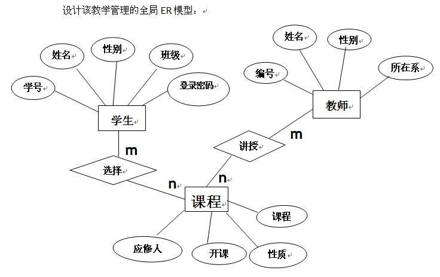

## 1.专业名词解释

**元组**：表中的一行就是一个元组。

**分量**：元组的某个属性值。在关系数据库中，属性是“不可分的”。

**码**：表中可以唯一确定一个元组的某个属性（或者属性组），如果这样的码有不止一个，那么大家都叫候选码，我		们从候选码中挑一个出来做老大，它就叫主码。

**超码**：属性组是码跟非码在组成的码。(因为码可以是一个属性组)

**全码**：整个属性组都是候选码。

**主属性**：候选码。

**非主属性**：非候选码。

**外码**：一个属性（或属性组），它不是码，但它是别的表的码。

***

## 2.函数依赖

`函数依赖`：(根据一个属性值可以唯一确定另一个属性值)

​	**定义：** 设R(U)是属性集U上的关系模式，X、Y是U的子集。若对于R(U)的任意一个可能的关系r，r中不可能存在两个元组在X上的属性值相等，而在Y上的属性值不等，则称Y函数依赖于X或X函数确定Y，记为X→Y。

​	**eg：**

| Sno  | Sname     | Sage |
| ---- | --------- | ---- |
| s1   | hang      | 18   |
| s2   | codekaing | 18   |

​	上面这张表就可以说是，Sname函数依赖于Sno，s1→hang。

​	再来看下面这张表，此时就不满足函数依赖。(根据s1得到的另一个属性值不唯一)

| Sno  | Sname     | Sage |
| ---- | --------- | ---- |
| s1   | hang      | 18   |
| s1   | codekaing | 18   |

`平凡函数与非平凡函数依赖`：
**定义：**

​	X→Y，Y⊈X，则称X→Y是`非平凡的函数依赖`。

​	X→Y，Y⊆X，则称X→Y是`平凡的函数依赖`。

**eg:**

​	在关系SC(Sno,Cno,Grade)中，

​	非平凡函数依赖：(Sno,Cno)→Grade

​	平凡函数依赖：(Sno,Cno)→Cno

`完全函数依赖`：

​	**定义：**设X,Y是关系R的两个属性集合，X’是X的真子集，存在X→Y，但对每一个X’都有X’!→Y，则称Y完全函数依赖于X。

​	**eg：**通过{学生学号， 选修课程名}可以得到{该生本门选修课程的成绩}，而通过单独的{学生学号}或者单独的{选修课程名}都无法得到该成绩，则说明{该生本门选修课程的成绩}完全依赖于{学生学号，选修课程名}

`部分函数依赖`：

​	**定义：**设X,Y是关系R的两个属性集合，存在X→Y，若X’是X的真子集，存在X’→Y，则称Y部分函数依赖于X。

​	**eg：**通过{学生学号，课程号}可以得到{该生姓名}，而通过单独的{学生学号}已经能够得到{该生姓名}，则说明{该生姓名}部分依赖于{学生学号，课程号}； 又比如， 通过{学生学号，课程号}可以得到{课程名称}，而通过单独的{课程号}已经能够得到{课程名称}，则说明{课程名称}部分依赖于{学生学号，课程号}。（部分依赖会造成数据冗余及各种异常。）

`传递函数依赖`：

​	**定义：**设X,Y,Z是关系R中互不相同的属性集合，存在X→Y(Y !→X),Y→Z，则称Z传递函数依赖于X。

​	**eg：**关系R(学号 ,宿舍, 费用)中，(学号)->(宿舍),宿舍！=学号，(宿舍)->(费用),费用!=宿舍。（传递依赖也会造成数据冗余及各种异常。））

***

## 3.范式

**第一范式(1NF)**：每个字段不可再分

**↓**

**↓** 消除非主属性对码的部分函数依赖，即拆成多张表

**↓** 

**第二范式(2NF)**：非主属性完全依赖于码

**↓**

**↓** 消除非主属性对码的传递函数依赖，即拆成多张表

**↓** 

**第三范式(3NF)**：属性不依赖于其它非主属性

**↓**

**↓** 消除主属性与码的部分和传递函数依赖

**↓** 

**BC范式(BCNF)**：(一张表只能有一个老大(码)，老大(码)可以是一个属性组)

​	1.所有的非主属性对每一个码都是完全函数依赖。

​	2.所有主属性对每一个不包含它的码也是完全依赖。

​	3.所有属性对非主属性都不能存在函数依赖。


***

## 4.E-R图

E-R图也称实体-联系图(Entity Relationship Diagram)，提供了表示实体类型、属性和联系的方法，用来描述[现实世界](https://baike.baidu.com/item/现实世界/688877)的[概念模型](https://baike.baidu.com/item/概念模型/3187025)。

**实体之间的联系有：**一对一(1:1)，一对多(1:n)，多对多(m:n)。

**E-R图表示方式：**

​	`实体型：`用矩形表示，框内写实体名。如学生

​	`属性：`用椭圆表示，框内写属性名，并用无向边将其与实体型连接起来。如性别、年龄等。

​	`联系：`用菱形表示，框内写联系名，并用无向边分别与实体型和属性连接，同时在无向边旁标注联系的类型				(1:1，1:n，n:m)。联系也可以具有属性。

​	

***

## 5.视图

### 5.1视图特点

1. 虚表，从一个或几个基本表(或视图)导出表。
2. 只存放视图的定义，不存放数据。
3. 基本表的数据发生变化时，从视图中查询出的数据也会改变。

## 5.2建立、删除视图

**建立视图语句：**

```
create view <视图名>[<列名>,<列名>...]
as 子查询
[with check option];
```

`with check option`表示对视图进行增删改操作时要保证增删改的行满足视图定义的谓词条件(即子查询中的条件表达式)。

`子查询`可以是任意的查询语句。

**删除视图语句：**

```
drop view 视图名字 [cascade];
```

`cascade`:级联删除，删除主表同时删除从表——同时删除具有主外键关系的表。

视图操作与基本表的层删改查一致，只不过它不存放数据而已。


