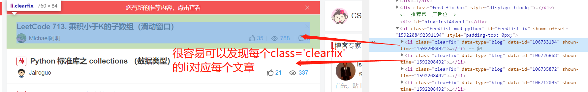

# 爬虫教程

# 第一章：爬虫基础

## 1.1  通用爬虫与聚焦爬虫

通用爬虫：主要将互联网上的网页下载到本地，形成一个互联网的镜像备份。

聚焦爬虫：通过特定的规则对网页内容进行与需求相关的爬取。

## 1.2 http协议

首先看一下在浏览器中是怎么样发送一个http请求的过程：

1. 当你输入网址（也叫url）回车的时候，浏览器会向服务器发送Request请求去获取该网址的html文件。
2. 服务器将对应的html文件作为Response对象返回给浏览器。
3. 当浏览器解析Response中的html文件时，如果发现此文件还引用了其他的文件，例如js文件、css文件、图片等，浏览器会自动再发送请求去获取这些文件。
4. 当所有文件都成功获取了之后，网页会自动解析展示给用户。

## 1.3 URL详解

**`URL`**：是`Uniform Resource Locator`的简写，叫做**统一资源定位符**。

URL的组成：**`scheme://host:post/path?queryString#anchor`**

- scheme：访问协议，一般是http、https、ftp等。
- host：主机名/域名，比如`www.baidu.com`。定位到主机。
- post：端口号。定位到应用。因为一台主机可能作为多个应用的服务器，所以需要用端口号来识别。
- path：查找路径。例如`www.baidu.com/login`。定位到具体的文件。
- queryString：查询字符串/请求参数。例如`www.baidu.com/s?wd=python` 浏览器发送Request请求时会把请求参数解析为{“wd”:”python”}发送到后端，后端会对参数做相应的处理。
- anchor：锚点。前端用做网页定位的。比如很多网络小说的章节跳转，多数用的就是锚点。

**tips：http的端口默认是80，https的端口默认是443**

## 1.4 常见的请求方式

在`HTTP`请求中，定义了八种请求方式，常见的有`get`和`post`：

- get请求：直接从服务器获取数据，不会对服务器资源产生影响。get请求携带的参数长度有限制，携带参数的方式就是在`url`后面加上`queryString`。
- post请求：向后台发送比较重要的数据（如登录）、文件上传。参数长度没有限制，携带参数的方式放在`Request body`中。

更详细的get和post解释可以看：[GET和POST两种基本请求方法的区别](https://www.cnblogs.com/logsharing/p/8448446.html) 这篇博客利用了很形象的例子解释了这两种请求方式之间的联系。

**tips：**

1. get比post更不安全。因为get会把请求参数直接显示到`url`中
2. get跟post在技术上可以相互实现
3. 一般情况下：get产生**一个**TCP数据包；post产生**两个**TCP数据包。
4. 在`HTTP`协议中，向服务器发送一个请求分为三部分：第一是把数据放在`url`中，第二是把`post`请求（如果有）放在`Request body`中，第三是把数据放在`head`中。

## 1.5 请求头常见参数


`User-Agent`：请求时显示的浏览器名称。后期爬虫会经常用到这个，因为我们提供爬虫发送请求时默认的User-Agent是python，所以我们需要改名字，让服务器认不出我们。

`Referer`：表名这个请求时从哪个 **url** 跳转过来的。一般也可以用来做反爬虫技术，因为有些页面必须是要从指定的 **url** 跳转才可以访问。

`cookie`：暂时存储网页的信息。因为`http`协议是无状态的，所谓的无状态就比如当同一个用户发送两次请求时，服务器没有能力知道这两次请求是否来自同一个人，所以需要使用cookie来做标识，这样每次访问的时候cookie就会跟服务器说，我就是那个靓仔。

## 1.6 常见状态码

`200`：一切正常

`301`：永久重定向。以后再访问此网址的时候都会跳转到新的网址。

`302`：临时重定向。在接下来一段时间，访问此网址的时候都会跳转到新的网址。

`404`：资源不存在

`403`：权限不足

`5开头`：服务器内部出错(一般是代码写错)

## 1.7 分析调试界面

在一个页面中，按下`F12`或`右键->检查元素`可以跳转到开发者调试界面，开发者调试界面可以查看一些关于网站的一些信息。以后爬虫需要经常利用它进行抓包，页面的分析等操作。

控制台的样子一般长这样：

**Elements**：网页的html源代码内容。

**Console**：控制台，用来进行一些JS操作。

**Source**：网站所要用到的资源文件。

**Network**：查看该网页向服务器发送了哪些请求。（常用）


## 1.8 urllib库

`urllib`是`python`一个基本的网络请求库，可以模拟浏览器行为，向指定服务器发送一个请求，并可以保存服务器返回的数据。在使用这个库之前需要先导入`from urllib import request`

下面看看这个库里面使用的一些函数吧：

**urlopen函数：** 发送网络请求，返回 `Response` 对象。

格式：`urlopen(url,data=None)`

参数：

- url：要请求的网址。默认为get请求
- data：请求参数。默认值为None，如果设置了此值就变成post请求

```python
from urllib import request  # 1.导入urllib库

url = 'https://www.baidu.com/baidu'
# 2.获取Response对象
res = request.urlopen(url)

print(res.read())  # 获取网页源代码
print(res.status)  # 获取返回状态码
```

***

**urlretrieve函数**：将服务器的一个文件保存到本地

格式：`urlretrieve(url,filename)`

参数：

- url：要请求的网址。默认为get请求
- filename：保存到本地时文件的名字（可以指定路径）

```python
from urllib import request  # 1.导入urllib库

url = 'https://www.baidu.com'
request.urlretrieve(url, 'baidu.html')
```

此时你会发现，当前项目文件夹就多出了个`baidu.html` 的文件。那么如果你想把文件下载到指定的目录可以`request.urlretrieve(url, 'D://baidu.html')` ,执行代码之后文件就跑到D盘下了。

此函数功能很强大，比如你想爬取漂亮美眉的图片，可以写个while循环然后写好美眉图片的路径，那么你就可以为所欲为了。

***

**request.Request类**

前面的`urlopen` 是不知道如何伪装的，只能傻傻的告诉服务器说：我是爬虫，我要爬取你的信息，你给不给我，不给我就走了。这时，“凶”一点的服务器就直接上来打它，MD,还没见过这么嚣张的爬虫呢。

所以，如果我们要能更安全的爬取一些信息，我们需要作出一些伪装，例如前面提到的`User-Agent` 。如果我们需要配置这些信息，那就需要使用到`request.Request` 。

```python
from urllib import request

url = 'https://www.baidu.com/baidu'

# 设置请求头
headers = {'User-Agent': 'Mozilla/5.0 (Windows NT 10.0; Win64; x64) '
                         'AppleWebKit/537.36 (KHTML, like Gecko) '
                         'Chrome/82.0.4077.0 Safari/537.36'
           }
# 伪装User-Agent
req = request.Request(url, headers=headers)

res = request.urlopen(req)  # 此时不再需要传url
print(res.read().decode('utf-8'))  # 将二进制内容解码成utf-8
```

到了这一步，妈妈就不再担心我因为“名字”被打了。

那么问题来了，这个`User-Agent` 要怎么设置呢？

其实很简单，用浏览器随便打开一个网页，然后按`F12` 进入开发者调试工具，然后来到`Network` ，接着随便点击一个请求，找到请求头，然后复制里面的`User-Agent` 到代码中，然后改成字典的形式就可以了。


## 1.9 小实战

Request类除了可以设置`User-Agent`还可以设置参数(data)跟请求方式(method)。

让我们把以上内容跟Request类结合爬取一下拉勾网吧。


首先随便找到个可以分页的地方(这里以爬取分页信息为例)，按`F12` 找到 `Network` 在众多请求中找到获取分页信息的请求（在拉钩网应该是`.json`结尾且type为`xhr` 的请求）,找到该请求之后你会发现，这个请求的方式为`post`，

复制上面的`referer` ,因为我按了第二页，所以他的`referer`的意思是从第一页跳转过来的。

复制`User-Agent` 伪装下自己。

分析`Form Data`，我这里的是Google浏览器其他浏览器的方式大同小异。可以看到

有这样的一些参数：

- `first:true` 表示是否在第一页
- `pn:1` 页数。
- `kd:Python` 搜索的职业是python

下面来看看代码：

```python
from urllib import request
from urllib import parse

url = 'https://www.lagou.com/guangzhou-zhaopin/Python/4/?filterOption=3&sid=4d3fa0ba0cc14b84a9e25164db9ca571'

# 设置请求头和referer
headers = {
    'User-Agent': 'Mozilla/5.0 (Windows NT 10.0; Win64; x64) '
                  'AppleWebKit/537.36 (KHTML, like Gecko) '
                  'Chrome/82.0.4077.0 Safari/537.36',
    "referer": "https://www.lagou.com/guangzhou-zhaopin/Python/4/?filterOption=3&sid=4d3fa0ba0cc14b84a9e25164db9ca571"
}
# 设置请求参数，如这里设置请求第四页的内容
data = {
    "first": "false",
    "pn": 4,
    "kd": "python"
}
# 设置POST请求，且设置POST请求的参数
req = request.Request(url, headers=headers, data=parse.urlencode(data).encode('utf-8'), method='POST')

res = request.urlopen(req)

print(res.read().decode('utf-8'))
```

这里介绍`parse.urlencode` 方法，这个方法的作用就是**帮我们将key:value这样的键值对转换成"key=value"这样的字符串**。

怎么样，到了这一步是不是就小有成就了，这只是初步的爬取一个网页，经过以后的学习就可以爬取自己想要的数据，不仅仅是一个网页啦，而是具体的文字啊，信息啊什么的，加油，让我们一起努力！

总结：

1. 由于很多网站采取的都是**ajax**异步请求，所以找这些异步请求的时候一般找有ajax字眼并且是json文件的
2. 爬虫时能在网页的请求头中复制的就尽量在请求头中复制。

***

由于以后这个爬虫教程主要是学Request库来进行网络爬取，所以在这里就不过多的介绍`urllib` 库了。

# 第二章：requests库使用

`urllib库` 虽然蛮强大的，但是还有很多比较麻烦的地方，比如上一章的实现中，需要把post请求的参数进行编码才可以发送到服务器，还有当我们需要使用到cookie以及其他东西时需要借助一些东西才可以实现。

`requests`库呢，就像个妈妈一样，漂亮的衣服都帮我们织好了，我们需要穿到的时候叫一声妈，就可以穿上好看的衣服了，多方便。

如果需要使用`requests`库，需要先安装`pip install requests` 

**tips：**以后很多库使用pip下载都很方便，另外也可以在`pycharm` 的`Project Interpreter` 那里搜索安装。

## 2.1发送GET请求

```python
import requests

# 获取response对象
res = requests.get("http://www.baidu.com")

print(res.text)  # 查看响应内容(已解码)
print(res.content)  # 查看响应内容(未解码)
print(res.encoding)  # 查看编码
print(res.status_code)  # 查看响应状态码
```

**res.text** 是用request猜测的编码形式解的码，就是说他猜的有时候是不对，这种情况就会产生乱码了。

既然如此，我们可以指定编码，然后让request按照我们指定的编码进行解码。

```python
import requests

res = requests.get("http://www.baidu.com")
# 指定response对象的编码为utf-8
res.encoding = 'utf-8'
print(res.text)
```

***

接下来看看如何传递传递参数跟设置请求头

```python
import requests

# 设置get请求的参数
params = {"wd": "python"}
# 设置请求头
headers = {'User-Agent': 'Mozilla/5.0 (Windows NT 10.0; Win64; x64) '
                         'AppleWebKit/537.36 (KHTML, like Gecko) '
                         'Chrome/82.0.4077.0 Safari/537.36'
           }

res = requests.get("http://www.baidu.com",params=params,headers=headers)

print(r.url)  # 查看url，参数成功传递
```

看到这里，对比一下`urllib库`跟`requests库`，是不是后者更方便一些。后者如果使用`get`请求，直接`requests.get`的形式就可以了，要加什么参数也直接加上去就行了。当然了，其他请求方式也是类似，比如下一节的post。

## 2.2 发送POST请求

接下来用`requests` 的`POST` 请求来进行登录一下吧。下面演示的网址跟data都需要跟我的一样，这里只是为了演示post请求的用法。

```python
import requests
url = 'http://47.115.46.57:8989/api/users/login'

# 设置请求参数
data = {
    "phone": "123456",
    "password": "123456",
}
# 设置POST请求，且设置POST请求的参数
res = requests.post(url, data=data)

print(res.text)
# print(res.json())  # 获取json格式的数据
```

如果返回 `{"status":400}` 就说明请求成功啦！

由于返回的是**json**格式的数据，所以可以使用**`res.json()`** 来代替 **`res.text`**。

tips：

- get请求若需要传递参数则使用 **`params`**
- post请求若需要传递参数则使用的是 **`data`**

## 2.3 使用代理

前面有提到过一个爬虫，在对一些反爬虫比较厉害的网站来说，做一些伪装是必要的，那这节要介绍代理也是伪装的一部分。

那什么是代理呢？

比如有个“办事处”（你发送请求的网站）可以查询到你想要的信息，但是每次进出都要出示身份证。此时你很急切的想要去办事处获取一些信息，于是你每分钟去一次去 “办事处” ，那么此时“办事处” 的工作人员就不耐烦了，每分钟来一次这不是捣乱吗，于是这个工作人员就跟门口的警卫说：“今天别再让身份证为xxx的SB进来了”。下一分钟你再倒回去的时候警卫就可能跟你说：“工作人员有事出去了，你下次再来吧”，此时明显知道，这是在忽悠你的，但是你又无能为力。嘿嘿，可气吧。

这时你灵机一动，在附近找了托，让他帮你查询你想要获取的信息，当然，有些托比较好心，不收你钱，但是这类托比较容易忘记了，或者比较慢去帮你查询信息。还有一类托呢，就是专门收钱然后帮忙去获取消息的。

那么这里说的托就是`IP代理`啦。

IP代理可以在网上找，有免费的也有收费的，这里我推荐一个我自己爬虫的时候偶尔会使用的一些代理：

- **快代理**：免费的，但是不稳定，速度慢
- **芝麻代理**：每天可以获取10条IP地址。前提是要注册登录

***

接下来就看看如何使用代理吧。

使用前介绍一个网站：`http://www.httpbin.org/ip`，此网站可以返回你的IP地址的信息

```python
import requests

proxy = {'http': '112.114.131.183:38387'}
# 设置IP代理
rp = requests.get("http://www.httpbin.org/ip",proxies=proxy)

print(rp.text)
```

执行上面代码后，我这里显示的是`{"origin": "112.114.131.183"}` 

此时你就知道怎么换`IP`代理了。

## 2.4 cookie和session

这里先介绍一下`requests`库里面的`session` 对象，这里的`session` 是不同于前端所说的`session`的，`requests`库里面的`session` 对象仅仅是一个会话的意思，即本次所有的请求都处于同一会话当中，**在同一会话中的所有的数据都可以共享** 。

比如会话可以保存你登录的信息，以致于你访问网站的其他页面时可以直接访问。

使用session发起请求跟之前的请求方式有点不同。这里演示一下

```python
import requests

url = "http://www.renren.com/Login.do"

headers = {'User-Agent': 'Mozilla/5.0 (Windows NT 10.0; Win64; x64) '
                         'AppleWebKit/537.36 (KHTML, like Gecko) '
                         'Chrome/82.0.4077.0 Safari/537.36'
           }

data = {"email":"填你的账号","password":"填你的密码"}
# 创建session对象
session = requests.Session()
# 利用session对象发起登录请求
session.post(url,data=data,headers=header)
# 跳转到个人主页
response = session.get('http://www.renren.com/974589261/profile')
# 将个人主页的页面写到本地
with open('renren.html','w',encoding='utf-8') as fp:
    fp.write(response.text)
```

此时你会看到，当前项目文件夹下多了个 `renren.html` 用浏览器打开它，如果你登录是成功的，那么会显示你的个人信息的页面。

## 2.5 小实战

这节我们来爬取拉钩网的招聘列表信息。

```python
import requests

headers = {
    'User-Agent': 'Mozilla/5.0 (Windows NT 10.0; Win64; x64) '
                  'AppleWebKit/537.36 (KHTML, like Gecko) '
                  'Chrome/82.0.4077.0 Safari/537.36',
    "referer": "https://www.lagou.com/jobs/list_python?labelWords=&fromSearch=true&suginput="
}

url = 'https://www.lagou.com/jobs/list_python?labelWords=&fromSearch=true&suginput='

# 创建session对象
session = requests.Session()
s1 = session.get(url, headers=headers)

data = {
    "first": "false",
    "pn": 2,
    "kd": "python"
}

url2 = 'https://www.lagou.com/jobs/positionAjax.json?city=%E5%B9%BF%E5%B7%9E&needAddtionalResult=false'
s2 = session.post(url2, headers=headers, data=data)
# 返回的数据是json类型
msg = s2.json()
# 直接输出响应信息
print(msg)
# 输出响应信息的content内容
# 分析了msg之后你就会发现，招聘单位的内容都放在这里面
print(msg['content']['hrInfoMap'])
```

到了这一步基本就差不多啦，如果还想要更好的信息，可以再进一步对json数据进行解刨。

比如加上如下代码：

```python
for id in msg['content']['hrInfoMap']:
    print("负责人编号：", msg['content']['hrInfoMap'][id]['userId'])
    print("负责人姓名：",msg['content']['hrInfoMap'][id]['realName'])
    print("负责人岗位：",msg['content']['hrInfoMap'][id]['positionName'])
```

如今的拉钩网反爬虫机制越来越强了，可能是因为几乎每一个爬虫案例都会对它下手的原因吧。你如果分析了Data参数，你会发现他那里还有个`sid`，那为什么我这里的data没有加上呢？因为这个`sid`每次请求都会不一样，所以我猜这个`sid` 是每次会话请求所需要使用的一个类似于验证的东西，所以我使用了`session`，会极大的简化爬虫操作。

当然了，这只是很初略的一个小爬虫案例，你完全可以根据需要自己改写，比如根据自己的输入岗位、城市等来获取相应的职位信息，而且这只是一页的数据，你可以写个`for`循环来爬取多页。等等一系列操作。

# 第三章：信息提取

虽然学了前面两章可以自己爬取网页内容了，但这些内容夹杂了很多html代码啊，不相关的信息啊等等。

那本章就是解决一些手段对想要信息进行精准的提取，进而使爬取下来的信息都是我们想要的。

提取信息的技术有三种：`XPath`、`BeautifulSoup`、`正则表达式` 。

##3.1 XPath

什么是 **XPath** ？（XML Path Language）

```
xpath是一门在XML和HTML文档中查找信息的语言，可用来在XML和HTML文档中对元素和属性进行遍历。
```

***

工欲善其事，必先利其器。当我们掌握了**XPath**语法时，可以利用浏览器自带的插件来帮我们现在浏览器中进行语法测试。

- Goolege浏览器： **XPath Helper** 
- 火狐浏览器：**try XPath** 

来看一下基本用法：（我的是谷歌浏览器，火狐的操作也类似）


***

### 3.1.1 XPath语法：

1. 选取节点：使用路径表达式来选取XML文件中的节点或节点集。
   
   | 表达式        | 描述                    | 实例                | 结果                       |
   |:----------:|:---------------------:|:-----------------:|:------------------------:|
   | `nodename` | (节点名字)选取此节点的**所有子**节点 | div               | 选取div下的所有子节点             |
   | `/`        | 选择某节点下的**直接指定子**节点    | div/p             | div下的子p节点                |
   | `//`       | 查找某节点下的**所有指定子孙**节点   | /div//p           | div下的所有子孙p节点             |
   | `@`        | 选取某个节点的属性             | //div[@class='j'] | 选取所有拥有 class=“j” 的属性的div |

2. 谓词：使用谓词来过滤一些节点，比如上面的 `class=“j”`
   
   - 格式：`[谓词]` 
   
   - | 路径表达式                            | 描述                       |
     |:--------------------------------:|:------------------------:|
     | /body/div[1]                     | body下的第一个直接div元素(下标从1开始) |
     | /body/div[last()]                | 最后一个div                  |
     | /body/div[position()<3]          | 前面两个的div                 |
     | //div[contains(@class,'f1')]     | 模糊匹配：class属性中含有f1的div    |
     | //div[@class='job' and @id='ok'] | class=job并且id=ok的div     |
     | //div[name]                      | 所有拥有name属性的div           |

3. 通配符：
   
   | 通配符  | 描述        | 实例         | 结果              |
   |:----:|:---------:|:----------:|:---------------:|
   | `*`  | 匹配任意节点    | /nook/*    | 选取nook下所有的子元素   |
   | `@*` | 匹配节点的任何属性 | //book[@*] | 选取所有带有属性的book元素 |

4. 选取多个路径： **`|`**
   
   - ```
     同时获取class=‘c’的div和dd元素
     //div[@class='c'] | //dd
     ```

### 3.1.2 lxml库

`lxml`是用`C语言`编写的**HTML/XML解析器**，主要功能是如何解析和提取**HTML/XML数据**。

我们可以利用之前学习的`XPath`语法，来快速定位特定元素以及节点。

使用前需要先安装：`pip install lxml`

基本使用的方式有两种：一个是对**字符串**进行解析，另一个是对**HTML文件**进行解析。

***

**解析HTML文件**

运用场景：当你需要对一个HTML文件进行解析或提取一些信息的时候。

声明：为了方便演示，下面我将假设我在`D://TEST.html`路径下的内容都可以满足要查找的条件

```
# 第一步：从lxml中导入etree。
# 注意，由于lxml是用c写的所以etree会没有提示
from lxml import etree

# 指定HTML解析器
parser = etree.HTMLParser()
# 解析HTML文件
html = etree.parse('D://TEST.html',parser) # 返回的是一个Element对象

# 1、获取所有tr标签
trs = html.xpath("//tr")
for tr in trs:
    print(etree.tostring(tr,encoding='utf-8').decode('utf-8'))

#2、获取第2个tr标签
tr = html.xpath("//tr[2]")[0]  # xpath返回的永远是一个列表
print(etree.tostring(tr,encoding='utf-8').decode('utf-8'))

#3、获取所有class等于even的tr标签
trs = html.xpath("//tr[@class="even"]")

#4、获取所有a标签的href属性（注意）
alist = html.xpath("//tr/@href")
for a in alist:
    print("a")

#5、获取所有职位信息
trs = html.xpath("//tr[position()>1]")
for tr in trs:
    # “.” 表示获取这个标签下的子孙元素。
    href = tr.xpath(".//a/@href")[0]
    print(href)
    text = tr.xpath(".//a/text()")  # 获取a标签下的文本内容
```

**`etree.HTMLParser()`** 是一种解析器方式，如果 **`etree.parse`**不指定解析器则默认使用的是XML解析器。

**`text()`** 表示提取该元素包裹的**直接**内容，比如`<p>aaa</p>` 当你使用`p/text()` 时获取到的内容为`aaa`。在比如`<p><div>aaa</div></p>`此时如果你使用 p/text() 的方法则获取不到内容，为什么呢？因为`text()`获取的是该标签下的内容，而aaa在div标签下，所以获取不到。

**元素 /@ 属性名** 的理解：表示取出该元素的属性名对应的属性值。区别于 **/元素[@属性名=‘属性值’]**

**解析字符串**

运用场景：当从网上爬取到信息时，需要对这些信息进行过滤，而这些爬取下来的信息就是字符串，所以我们可以利用`lxml`来解析它。

那来个小案例吧，这个小案例需要先把上面的5个知识点搞懂，理解起来才会比较容易。

案例：利用`lxml`爬取快代理的`IP`地址。

```
# 第一步：从lxml中导入etree。
from lxml import etree
import requests

# 要爬取的url，这里只爬取第一页内容
Proxy_url = "https://www.kuaidaili.com/free/inha/1/"
pro = ""  # 用来存放拼接好的IP地址
PROXY = []  # 存放爬取下来的IP地址的列表

# 获取爬取内容
response = requests.get(Proxy_url)
text = response.text

# 将爬取的字符串放进lxml中解析
html = etree.HTML(text)  # 返回的也是一个Element对象

# 利用xpath语法查找IP地址内容所在的元素
trs = html.xpath("//table[@class='table table-bordered table-striped']//tr")[1:]

# 把IP、端口号一个个提取出来并拼接在一起形成IP地址
for tr in trs:
    # 提取IP
    IP = tr.xpath("./td[@data-title='IP']/text()")[0]
    # 提取端口号
    PORT = tr.xpath("./td[@data-title='PORT']/text()")[0]
    # 拼接成url
    pro = "HTTP://" + IP + ":" + PORT
    PROXY.append(pro)
print(PROXY)
```

`trs = html.xpath("//table[@class='table table-bordered table-striped']//tr")[1:]` 这句代码的意思是选取**class为table table-bordered table-striped**的`table` 下面除去第一个的所有`tr`。因为你检查元素后会发现，第一个`tr`是没有用的，所以要除去第一个。

**`tr.xpath("./td[@data-title='IP']/text()")[0]`** 表示提取当前的**`tr`**标签下的 含有`data-title='IP'` 的**td** 下面的直接内容，又因为`xpath`返回的是一个列表，所以需要`[0]`。

小结：

1. 解析**html字符串**使用**etree.HTML(string)**解析，此方法默认使用**HTML解析器**。
2. 解析**html文件**使用**etree.parse('文件路径')**解析，此方法默认使用**XML解析器**。
3. `xpath`返回的永远是一个`列表`
4. `etree`在`lxml`库中

## 3.2 BeautifulSoup

和`lxml`一样，`BeautifulSoup`也是一个HTML/XML的解析器，跟`XPath`的功能是一样的。

区别在哪里呢？`lxml`只会局部遍历，如果你想提取`a` 标签的内容，那么我们需要写出相关的`xpath`语法，此时`lxml` 只会对全部的`a` 标签进行遍历，找出满足条件的`a` 标签。

而`BeautifulSoup`会载入整个文档，将文档内容组织成类似于DOM树的结构，然后我们可以根据它提供的`API`来作出相应的操作，此时`BeautifulSoup`会遍历整个树，找出满足条件的标签。因此它的开销比较大，速度慢。

使用`BeautifulSoup` 前需要先安装：`pip install bs4` 。

那现在来看一下几大解析工具对比：

| 解析工具          | 解析速度 | 使用难度 |
| ------------- | ---- | ---- |
| BeautifulSoup | 最慢   | 最简单  |
| lxml          | 快    | 简单   |
| 正则            | 最快   | 最难   |

***

**简单使用**：

```python
# 第一步：从bs4中导入BeautifulSoup
from bs4 import BeautifulSoup
import requests

r = requests.get("http://python123.io/ws/demo.html")
demo = r.text

# 将内容组织成DOM树
soup = BeautifulSoup(demo, 'html.parser')  # 第二个参数是指定一个解析器
print(soup.text)  # 输出纯文本
print(soup.prettify())  # 用比较美化得方式打印出来
```

**soup = beatifulsoup(text, pattern)**

- 参数text 为要提取的内容 

- 参数pattern为解析器（可选）
  
  - `html.parser`(默认)
  - `html5lib`(容错性最强)
  - `lxml` （平时使用最多）
  - `xml` 

这里值得一提的是，`bs4`库将任何读入的`html`文件或字符串都转换为`utf-8`编码。

***

**提升案例**：

```python
from bs4 import BeautifulSoup
import requests

rp = requests.get("http://www.baidu.com")
text = rp.text
soup = BeautifulSoup(text, "lxml")

# 获取30个div标签
trs = soup.find_all('div', limit=30)  # 返回的是列表
for ts in trs:
    print(ts)
    print("-"*30)

# 获取第二个div标签
tr = soup.find_all('div',limit = 3)[1]
print(tr)

# 获取class等于head_wrapper的div标签
# trs = soup.find_all('div',class_='head_wrapper')  # 注意这里是class_ ,因为class在python中是关键字
# 上下这两种方式等价
trs = soup.find_all('div',attrs={'class': 'head_wrapper'})
for tr in trs:
    print(tr)

# 将所有class=lb，并且name=tj_login的a标签
trs = soup.find_all('a', attrs={'class': 'lb', 'name': 'tj_login'})
for tr in trs:
    print(tr)

# 所有a标签的href属性
alist = soup.find_all('a')
for a in alist:
    # 获取标签属性的方法
    href = a['href']
    print(href)

# 获取第一个tr下面的全部文本内容
# infos = tr.strings  # 包含空白符
infos = list(tr.stripped_strings)  # 去掉空白符
print(infos[0])

# 获取所有的职位信息(假设网址中有这个信息)
# trs  = soup.find_all('tr')[1:]  # 获取第一个以后的tr标签
# message = []  # 存放职位信息
# for tr in trs:
#     mess = {}  # 存放单条职位信息
#      # 找到tr下面所有的td标签
#     tds = tr.find_all('td')
#
#     mess['title'] = tds[0].string  # 获取第一个td的内容
#     mess['category'] = tds[1].string  # 获取第二个td的内容
#     message.append(mess)
# print(message)
```

**soup.find(tag)** 查找 *第一个* 匹配的tag标签等价于**soup.tag**，对应的有**soup.find_all(tag[,limit])** 查找 *所有* tag标签，limit表示提取多少条。

**string** 获取某个标签下的直接内容。<u>无法获取多行内容</u>。

**strings** (返回的是生成器，可以转换成list) 获取所有子孙非标签的字符串，有多行时获取不到。

**stripped_strings** 同上，但会去掉空白文本。

**get_text()** 获取所有子孙非标签的文本，返回的是字符串。

***

**CSS选择器：select方式**

此种方式通过`CSS语法`来进行提取特定标签。

```python
import requests
from bs4 import BeautifulSoup

rp = requests.get("http://www.baidu.com")
text = rp.text
soup = BeautifulSoup(text, "lxml")

# 查找p标签  select功能跟find_all一样,就是不能同时筛选类名和id
print(soup.select('p'))

# 查找div下面的所有满足class=‘cp-feedback’的标签
print(soup.select('div .cp-feedback'))
# 查找div下面的所有满足id=‘cp’的标签
print(soup.select('div #cp'))
# 获取class=‘lg’的a标签 注意，中间没有空格
a = soup.select('a.lb')
# a = soup.select('a[class="lb"]') 等价于上面的写法
print(a)

# 查找name="tj_trnews"的a标签
print(soup.select('a[name="tj_trnews"]'))

# 查找div下的子p标签
print(soup.select('div > p'))
```

小结：

- 中间有空格：表示在该标签下找满足筛选条件的标签
- 中间没空格：表示查找满足筛选条件的该标签。
- `select`功能跟find_all一样，返回的都是列表，但`select`无法同时筛选类名和id
- **`>`** 表示在该标签的子元素中查找

***

**四个常用对象**：

`Beautiful Soup` 将复杂的HTML文档转换成一个复杂的树形结构，每个节点都是python对象，这些对象可以分为4种：

- **Tag** ：就是一个个的HTML标签（拥有name、class等属性）。
- **NavigableString**：继承自python本身的str类型。代表标签中的内容字符串。
- **BeautifulSoup**：继承自Tag，本质上就是Tag。所以上面`soup对象`使用的`find_all`等方法实际上是Tag类中的方法，与此同时也说明了 **为什么标签可以像soup一样直接使用find_all等方法** 。它表示的是一个文档的全部内容。
- **Comment**：特殊的`NavigableString`，表示注释的部分。

### 案例：

本次案例是用**requests**库跟**bs4**结合使用，然后爬取CSDN推荐文章列表的一些信息。




其他要爬取的内容的方式跟这两个方式差不多，这里就不一一截图出来了。。。

下面来看看代码吧。

```python
import requests
from bs4 import BeautifulSoup

url = 'https://blog.csdn.net/nav/python'
# 伪装
headers = {
    'User-Agent': 'Mozilla/5.0 (Windows NT 10.0; Win64; x64) '
                  'AppleWebKit/537.36 (KHTML, like Gecko) '
                  'Chrome/82.0.4077.0 Safari/537.36'
}

res = requests.get(url, headers=headers)
text = res.text
# 建立文档树
soup = BeautifulSoup(text, 'lxml')

# 提取所有文章的li
lis = soup.find_all('li', attrs={'class': 'clearfix', 'data-type': 'blog'})

# 遍历lis，单独对每个li进行提取
for li in lis:
    title_div = li.find('div', attrs={'class': 'title'})
    # 获取标题内容，因为stripped_strings返回的是迭代器所以要先转成list
    # "".join()的作用是把列表内容变成字符串
    title = "".join(list(title_div.find('a').stripped_strings))

    # 获取作者名称所在的dd标签
    name_dd = li.find('dd', attrs={'class': 'name'})
    # 获取作者名称
    name = "".join(list(name_dd.find('a').stripped_strings))

    # 获取阅读量所在的dd标签
    readNum_dd = li.find('dd', attrs={'class': 'read_num'})
    # 获取阅读量
    readNum = "".join(list(readNum_dd.stripped_strings))

    # 获取评论数所在的dd标签
    commonNum_dd = li.find('dd', attrs={'class': 'common_num'})
    # 获取评论数
    # 因为有些文章是没有评论的，所以会缺少此标签
    if commonNum_dd != None:
        commonNum = "".join(list(commonNum_dd.stripped_strings))
    else:
        commonNum = 0

    print('文章标题:{}\t作者名称:{}\t浏览量:{}\t评论数:{}'
          .format(title, name, readNum, commonNum))
```

当然，你还可以自己获取更多更好玩的内容，冲冲冲。

那这一节就到这里啦~~~

## 3.3 正则表达式

前面两篇博客介绍了`lxml` 跟`BeautifulSoup` 对信息的提取，这节来介绍最后一种提取信息的方式----正则表达式。

正则表达式相信大家都听过，那什么是正则表达式呢？通俗的讲，**正则表达式就是按照一定的规则，从某个字符串中匹配出满足规则的字符串**。

先来简单的看一下正则表达式的使用：

```python
import re

text = 'hello re'
reg = re.match('he',text)  
print(reg.group())  # 输出he
```

**match(pattern,string)** 作用：在`string`中匹配以`pattern` **开头**的字符串，若匹配到则返回`pattern`，否则返回`None`.

**group()** 作用：暂时知道它是返回匹配到的字符串就可以了。后面再详细讲。

***

接下来看看一些在正则表达式中具有特殊意义的字符。

1. 匹配单个字符 

```
. 匹配除换行符以外的任意字符                         
[] 匹配里面的任意一个字符                           
[^ ] 除了里面的任意一个字符                         
\d 匹配数字（大写的意思就是与小写相反）     如 \D 表示除了数字的都匹配         
\w 等价于 [0~9A~Za~z_]                       \W 表示除了[0~9A~Za~z_]都匹配
\s 匹配空白符，如[\f\n\r\t ] (空白也在里面)   \S  同理
```

**[0~9A~Za~z_]** 表示匹配`0到1、A到Z、a到z、_` 中的任意一个。

**\D** 等价于 `[^0~9]` 、`[^\d]`。

**tips**：如果要匹配一些符号，比如`/ 、, < > ` 等，可以使用 **\S** 来匹配

```python
import re

text = '12A'
reg = re.match('\d',text)  
print(reg.group())  # 输出1
phone = '125421'
print(re.match('[21]',phone).group())  # 输出1
# print(re.match('[245]',phone).group())  # 报错，说明没找到以2或4或5开头的字符串
```

**tips**：若`string` 中拥有特殊意义的字符时需转义`r''` 。

若`pattern` 中拥有特殊意义的字符时需要使用 **`\`** 转义。因为python 本身要转义一次，放到正则还要在转义一次。所以 匹配`\` 需写成 `'\\\\'` ，匹配`+` 需写成 `'\+'`

2. 锚字符：
   
   **`^`** 以…开头（与`[]`里面的`^`不是一个意思）
   **`$`** 以…结尾
   
   ```python
   import re
   
   text1 = 'hello re'
   # 以he开头 等价于match
   reg = re.search('^he', text1)  # search用法后面有详解
   print(reg.group())
   
   # 以re结尾
   r = re.search('re$', text1)
   print(r.group())
   ```

3. 匹配多个字符：
   
   | 特殊符号  | 作用                   | 例子             |
   | ----- | -------------------- | -------------- |
   | *     | 匹配任意多个字符             | x* 匹配任意个x      |
   | ?     | 匹配0个或1个字符（解除贪婪模式）    | x? 匹配0个或1个x    |
   | +     | 匹配1个或多个字符(最少都要匹配到1个) | x+ 匹配1个或多个x    |
   | ()    | 将括号里面的字符看成一个整体       | (xyz)  匹配xyz   |
   | {n}   | 匹配n个字符               | x{4} 匹配4个x     |
   | {n,m} | 匹配n~m个字符             | x{2,5} 匹配2到5个x |
   | \|    | 或                    | x\|y 匹配x或者y    |

**小练习**：

```python
import re

# 1.验证手机号码
phone = '14512545888'
reg = re.match(r'1[345678]\d{9}', phone)
print(reg.group())
```

**`1[345678]\d{9}`** 表示 第一位为1，第二位可以是345678的任意一个，接下来的9位是任意数字。

***

```python
# 2.验证邮箱(邮箱可以包含小数点)
email = '524615@qq.com'
em = re.match(r'[\w.]+@\w+\.\w+', email)
print(em.group())

email2 = r'bill.gates@microsoft.com'
em2 = re.match(r'[\w.]+@\w+\.com$', email2)
print(em2.group())
```

**`[\w.]+`**  表示 至少要匹配到`\w` 或 `.` 

**`@`** 表示 匹配`@`符

**`\w+\.com$`** 表示 `.` 前面至少有一个字符，`.` 后面必须以`com`结尾

***

```python
#3.验证URL
URL = 'https://baidu.com/item/python'

u = re.match(r'(http|https|ftp)://\w+\.\S+', URL)
print(u.group())
```

**`(http|https|ftp)`** 表示匹配`http、https、ftp`的其中一个。注意这里不要使用 **[http|https|ftp]** 因为此时匹配的是`[]`里面的任意一个字符。

***

**贪婪模式**：尽可能多的匹配字符。

何为贪婪模式？比如 有一个字符串 `<h1>段落</h1>` 若你使用`<\w+>` 去匹配，则会匹配到整个字符串，这就叫贪婪模式。而如果你此时只想匹配到`<h1>` ，可以`<\w+?>` 加个问号解除贪婪匹配。 

***

**group分组**：

> 用 () 表示要提取的分组 组的排序：**从外到内，从左到右**

```python
import re

text = '154-555'
m = re.search(r"(?P<name1>\d{3})-(?P<name2>\d{3})", text)

print(m.group('name1'))  # 154
print(m.group(0), '***', m.group())  # 154-555 *** 154-555
print(m.group(1))  # 154
print(m.group(2))  # 555
print(m.groups())  # ('154', '555')
```

**注意：** 

1. **`?P<name1>`** 是给`\d{3}` 所匹配到的该组字符串取名为`name1`，而不是匹配的意思。
2. 需要注意 `groups()` 跟 `m.group()` 的区别

***

re模块常用函数：

| 函数                                         | 作用                                                         |
| ------------------------------------------ | ---------------------------------------------------------- |
| match(pattern,string[,flags=0])            | 从string开头匹配pattern，有则返回，不是开头或者没有返回none                     |
| search(pattern,string[,flags=0])           | 返回第一个匹配成功的pattern                                          |
| findall(pattern,string[,flags=0])          | 返回一个所有成功匹配数据的列表                                            |
| finditer(pattern,string[,flags=0])         | 返回一个所有成功匹配数据的迭代器，可以用next()迭代                               |
| sub(pattern,repl,string[,count=0,flags=0]) | 返回在`string`中利用`repl`替换满足`pattern`的字符串，`count`表示替换多少个满足的字符串 |
| split(pattern, string[, maxsplit])         | 按照满足`pattern`的字符串将string分割后返回列表                            |

**flags**：

<u>编译标志位，用于修改正则表达式的匹配方式，如：是否区分大小写，多行匹配等。</u>

- **`re.I`** 忽略大小写
- **`re.M`** 多行匹配，影响^和$
- **`re.S`** 或者**`re.DOTALL`** 使`.` 可以匹配包括换行符在内的所有字符

```python
import re

s= '12 34\n56 78\n90'
re_f = re.findall(r'^\d+', s, re.M)  # 匹配每行的开头
print(re_f)  # ['12', '56', '90']
print(re.search(r'.+', s, flags=re.S).group())  # 12 34\n56 78\n90
```

***

**compile**：

在上表的前四个函数执行之前，都会执行一个**compile**函数，即正则表达式会先编译模式（即前面的pattern）是否正确然后再进行匹配。

```
reg = re.search(r'.+', s, re.S)
等价于
re_com = re.compile(r'.+')
reg = re_com.search(s, re.S)
```

看到这里你也许会想，直接`search`就完事了，`compile` 还需要两步这么麻烦，还不如直接用`search` 呢。我一开始也是这么觉得的，知道后来，我发现事情并不那么简单。

如果你需要对许多的字符串进行相同模式的匹配，此时`compile`就派上了大用处，你只需要编译一次就可以一直使用。不信你看我下面：

```
re_com = re.compile(r'.+')
reg1 = re_com.search(s1)
reg2 = re_com.search(s2)
reg3 = re_com.search(s3)
......
```

而如果你直接`search`的话，就要编译好多次，如果你要匹配几百万条数据，每条都要编译，那得花多少时间啊。

***

**sub**：

```
string = 'I must be 1个 shuaige.'
string = re.sub(r'\d个', '', string)  # 把 1个 删除
print(string)  # I must be  shuaige.
```

**split:**

```
text = 'hello$$world'
reg = re.split('\W', text)
print(reg)  # ['hello', '', 'world']
```

***

**综合案例**：**爬取哔哩哔哩热门视频**

使用正则表达式进行匹配时，不会像前两章的那两种提取方式有一种结构在里面，可以直接通过方法来筛选，正则能匹配的只有字符串，也就是说即使你匹配的整个网页，在正则看来就是一串很长的字符串而已。所以我们来转变下思路，不要先一个一个的爬取，而是把全部的标题，链接、观看数等一次性爬取下来，分别放到数组里，然后再对数组进行整合即可得到相同效果。


```Python
import requests
import re

# 输出视频的详情 如链接、标题、播放量、评论数、作者
def print_detail(msg_lists):
    for i in msg_lists:
        print(i)

# 解析页面
def html_parse(url):
    msg_lists = []  # 存放所有的视频信息

    res = requests.get(url)
    text = res.text
    # 获取链接跟标题
    msg = re.findall(r'<a href="(.*?)".*?class="title">(.*?)</a>', text)
    # 获取播放量、评论数以及作者名称
    detail = re.findall(r'<span class="data-box">.*?</i>(.*?)</span>', text)

    # 获取前20个视频信息
    for i in range(20):
        detail_dist = {}  # 每次存放单个视频的详细信息

        detail_dist['视频链接'] = msg[i][0]  # 存储视频链接
        detail_dist['标题'] = msg[i][1]  # 存储标题
        detail_dist['播放量'] = detail[i * 3]  # 存储播放量
        detail_dist['评论数'] = detail[i * 3 + 1]  # 存储评论数
        detail_dist['作者'] = detail[i * 3 + 2]  # 存储作者
        msg_lists.append(detail_dist)  # 把每个视频信息存放到列表中

    # 输出视频信息
    print_detail(msg_lists)


if __name__ == '__main__':
    url = 'https://www.bilibili.com/ranking'
    html_parse(url)
```

<u>分析正则表达式</u>：

**`<a href="(.*?)".*?class="title">(.*?)</a>`** 

对需要获取的信息加上 `()` 匹配成功时就会返回该括号内匹配到的内容。

`.*?` 表示提取任意多的除换行外的字符，问号的作用是接触贪婪模式。此时`"(.*?)"` 模式就会告诉正则说，`“ ”` 里面的内容随便你匹配，匹配到了就返回给我。

`.*?class` 表示前面的内容随便你匹配，反正到了`class`这里你就给我停止。

所以，`msg[i]` 存放了第`i`个视频的链接跟标题。

 **`<span class="data-box">.*?</i>(.*?)</span>`** 

你分析了页面之后，你会发现，这个正则表达式第一次匹配到了播放量、第二次匹配到了评论数、第三次匹配到了作者名称，第四次才再次匹配到下一条视频的播放量，第五次才再次匹配到下一条视频的评论数….

所以才会有 `detail[i * 3]` `detail[i * 3 + 1]` `detail[i * 3 + 2]` 

***

**小结**：

1. 正则表达式没有那种层次结构，在它的世界里只有字符串。
2. 在需要匹配的地方加`()` 

好啦，正则表达式就介绍到这里，小伙伴们要多多练习，有问题可以在评论区一起讨论。

# 第四章 信息存储

前面三章介绍了如何爬取以及筛选信息，而这些信息呢都是输出到控制台的。那这一章，我们要学习如何将这些信息持久化存储，方便我们以后的使用。

接下来我们要学习的信息存储技术有：`json` 、`csv` 、`mysql` 。

大家可以根据需要来选择信息存储方式。

## 4.1 JSON

`JSON`(JavaScript Object Notation) 是一种轻量级的数据交换格式。与python的字典很像，用法也差不多。

`JSON` 的数据类型：

- 对象：使用花括号包裹 `{}` 起来的内容。如：`{key:value}` value可以是任何类型的数据
- 列表：方括号 `[]` 包裹起来的内容。如：`[1,"python",{key:value}]`
- 字符串：双引号包裹起来的内容。如：`"python"`

**tips：`JSON`本质是一个字符串**

***

**dumps 跟 dump** 

```python
# 第一步 导入json
import json

books = [
    {
        id: 1,
        name: '三国演义',
        price: ''
    },
    {
        id: 2,
        name: '水浒传',
        price: ''
    },
    {
        id: 3,
        name: '红楼梦',
        price: ''
     }
]
# 使用dumps 将python对象转化成json
text = json.dumps(books)
print(text, '---', type(text))

# 使用dump 将python对象自动转化成json后存入文件
with open('book.json', 'w', encoding='utf-8') as fp:
    json.dump(books, fp, ensure_ascii=False)
```

<u>tips</u>：`dump` 默认使用的编码格式是`ascii` ，在存储中文数据时，需要将其关闭，方式为`ensure_ascii=False`，另外还需要在打开文件的时候指定编码，如`encoding='utf-8'` 。

**loads 跟 load**

```python
import json

text = '{"book":"python"}'
# 使用loads 将json字符串转化成python对象
book = json.loads(text)

# 使用load 读取json文件并自动转化成python对象
with open('book.json', 'r', encoding='utf-8') as fp:
    book = json.load(fp)
```

小结：

- 将python对象转化成`json` 的方式 `dumps` 、 `dump` （写入文件）
- 将`json` 转化成python对象的方式 `loads` 、`load` (从读取中读取)

## 4.2 CSV

**CSV又叫逗号分隔值**，因为在大部分`CSV`的表中每个字段都以`,` 作为分隔符。跟`Excel` 类似

详情可自行百度。

***

读取CSV文件：

```python
import csv

with open('books.csv', 'r') as fp:
    # reader是一个迭代器，存储的是一个个列表
    reader = csv.reader(fp)
    for x in reader:
        # x为列表
        print(x)  # 每次都打印一行数据

with open('books.csv', 'r') as fp:
    # reader是一个迭代器，存储的是一个个字典
    reader = csv.DistReader(fp)
    for x in reader:
        # x为字典
        print(x)  # 每次都打印一行数据
```

写入CSV文件：

```python
import csv

headers = {'name','age'}
values = [
    ('张三', 18), ('李四', 20)
]

# newline='' 每写入一行都不进行换行
with open('person.csv', 'w', encoding='utf-8', newline='') as fp:
    writer = csv.writer(fp)
    # 写入头部
    writer.writerow(headers)
    # 写入内容 一次性写入全部内容
    writer.writerows(values)

# 以字典写入
headers = {'name','age'}
values = [
    {'name':'张三', 'age':'18'},
    {'name':'李四', 'age':'20'},
]   
with open('person.csv', 'w', encoding='utf-8') as fp:
    writer = csv.DistWriter(fp, headers)
    # 写入头部
    writer.writeheader()
    # 写入内容 一次性写入全部内容
    writer.writerows(values)
```

## 4.3 Mysql

`mysql` 的安装及使用教程在我的另一篇博客  [Mysql学习（全）](https://blog.csdn.net/weixin_43521592/article/details/106373962) 写的蛮详细的，这里就只介绍在python中如何通过代码来连接`mysql`。

`python` 可使用`pymysql` 来连接本地的`mysql`

首先，需要先安装`pymysql` ：`pip install pymysql`

简单查询：

```python
# 第一步 导入pymysql
import pymysql

# 第二步 建立连接
conn = pymysql.conn(
    host:'localhost',  # 主机
    user:'root',  # 用户名
    password:'xxx',  # 密码
    database:'test',  # 要连接的数据库
    post:3306  # mysql的端口号，一般为3306
)

# 创建游标
cursor = conn.cursor()
# 定义sql语句
sql = 'select * from user'
# 查询数据
cursor.execute(sql)
# 获取查询内容
result = cursor.fetchone()
print(result)

# 关闭连接
conn.close()
```

**tips**：

- `fetchone()`：每次获取一条数据。
- `fetchall()`：获取全部返回结果。
- `fecthmany(size)`：每次获取size条数据。

增删改：

```python
import pymysql

# 建立连接
conn = pymysql.conn(
    host:'localhost',  # 主机
    user:'root',  # 用户名
    password:'xxx',  # 密码
    database:'test',  # 要连接的数据库
    post:3306  # mysql的端口号，一般为3306
)

cursor = conn.cursor()
# 即使表中的字段是整形或其他类型 都要写成%s格式
sql = "insert into user values(%s,%s)"

# 填好参数
cursor.execute(sql,('杭', 18))
# 提交事务
conn.commit()

# 关闭连接
conn.close()
```

**tips：**

- **连接对象**负责创建游标跟提交事务，**游标对象**负责执行`sql`语句跟获取查询结果。

- 增删改操作都需要`commit()`

# 第五章 爬虫进阶

经过了前面四章的学习，相信小伙伴对爬取基本的网站的时候都可以信手拈来了。那么接下来介绍比较高级一点的东西来帮助我们更顺利更快速的进行爬虫。

首先来看看我们这一章要学哪些进阶技术：**多线程爬虫**、**ajax数据爬取**、**图形验证码识别**。

## 5.1 多线程

连接线程之前先来看看进程的概念。

**进程**通俗的讲就是指正在运行的程序，每个进程之间拥有独立的功能。而每一个进程都有至少一个执行单元来完成任务，这个(些)执行单元就是 **线程**。最简单的比喻是进程是一辆火车，每个线程就是每个车厢，车厢离开火车是无法跑动的。

那什么是**多线程**呢？就是**一个程序中有多个线程在同时执行**。

而当我们爬虫需要下载较多图片的时候，就可以使用多线程来提高效率。 

***

接下来介绍如何使用代码来创建多线程

**`threading` 模块**

```python
import threading
import time

def naicha():
    for i in range(3):
        time.sleep(1)
        print(i, '正在喝奶茶。。。')

def xigua():
    for i in range(3):
        time.sleep(1)
        print(i, '正在吃西瓜。。。')

# 创建子线程 name=''表示给线程取别名
t1 = threading.Thread(target=naicha)
t2 = threading.Thread(target=xigua)

# 开启线程
t1.start()
t2.start()
```


可以看出这两个线程是同时进行的。

我们还有通过**`threading.enumerate()`** 来查看线程数量。

`[<_MainThread(MainThread, started 22596)>, <Thread(Thread-1, started 19476)>, <Thread(Thread-2, started 18868)>]` 此时线程数为 3 个，为什么呢？这是因为每个进程中都默认有一个主线程。

**`threading.current_thread()`** 这个函数可以获取到当前的线程对象。

除此之外还可以给线程取别名，`threading.Thread(target=xigua, name='xg')` ，此时该线程对象就成这样了 `<Thread(xg, started 25368)>` 。

***

**线程封装**：

所谓的线程封装就是将上面一些的步骤封装成类，方便使用。

封装步骤：

1. 编写类(继承`threading.Thread`)
2. 重写 `run` 方法，在此写线程的操作

```python
import threading
import time

class Naicha(threading.Thread):
    def run(self):
        # 在run方法写线程的操作
        for i in range(3):
            time.sleep(1)
            print(i, '正在喝奶茶。。。')

class Xigua(threading.Thread):
    def run(self):
        for i in range(3):
            time.sleep(1)
            print(i, '正在吃西瓜。。。')

if __name__ == '__main__':
    # 创建自己编写的线程对象
    t1 = Naicha()
    t2 = Xigua()
    # 开启线程
    t1.start()
    t2.start()
```

***

**锁机制**：

因为多线程是在同一个进程中运行的，所以在进程中的全局变量对所有线程都是可共享的。然后又因为线程的执行是无序的，这就出现了脏读现象。

比如有全局变量`n=100`，线程1跟线程2同时运行且都需要对`n`进行加1操作，此时对于线程1来说，`n=100` 加完1后`n=101`，因为线程1跟线程2是同时运行的，所以在线程2操作的时候`n=100` 加完1后`n=101`。本来`n` 应该等于102的，现在n却等于101。这种现象就叫做脏读现象。

那如何结果这个问题呢？**给当前运行的线程上锁**。

在线程1进行加`n+1`的时候进行上锁，当其他线程也要使用全局变量`n` 的时候，它们就会**等待**前一个线程释放锁。

在很多语言中都有这样的一把锁，方便我们使用。

```python
import threading

# 全局变量
n = 0
# 创建锁对象
lock = threading.Lock()  # 创建锁对象


def naicha():
    # 声明n为全局变量
    global n
    lock.acquire()  # 加锁
    for i in range(1000000):
        n = n + 1
    print('线程1运行完之后，n=', n)
    lock.release()  # 解锁


def xigua():
    # 声明n为全局变量
    global n
    lock.acquire()  # 加锁
    for i in range(1000000):
        n = n + 1
    print('线程2运行完之后，n=', n)
    lock.release()  # 解锁

# 创建子线程
t1 = threading.Thread(target=naicha)
t2 = threading.Thread(target=xigua)

# 开启线程
t1.start()
t2.start()
```

小结：

- 在多线程需要使用到全局变量时需要给线程加锁。

- **acquire()** 可以加锁，**release()** 可以释放锁。

- 加了锁之后一定要释放锁。不然锁就得不到释放而形成死锁。

***

**生产者与消费者模式**：

生产者与消费者模式是多线程开发中很常见的一种模式。

这种模式有两种模块，生产者模块与消费者模块，生产者模块负责生产数据，然后将数据存储到中间变量中（一般是全局变量），消费者模块负责从全局变量中消费数据。

比如当爬取大量图片时，我们可以创建多个线程来爬取要下载图片的`url`，然后将这些`url`存储到全局的列表中，最后再创建多个线程负责下载这些`url`。负责爬取图片`url`的线程就被称为**生产者**，负责下载的线程就称为**消费者**。

很明显，这种模式中多个线程都在同时使用全局变量，需要怎么保证能正常运行呢，这时你可能会想到加锁，没错，这种模式可以使用加锁，但如果加锁解锁很频繁的情况下最好不要使用加锁的方式，因为加锁解锁需要消耗CPU资源，有一定的开销。

实际上，实现这种模式的方式有多种：

1. 使用 `threading.Condition` （继承自`threading.Lock`）

2. 使用 `theading.Lock`
   
   `threading.Condition`可以在没有数据的时候使用`wait`来使线程处于堵塞等待状态。一旦有合适的数据了，使用`notify` 等一些函数来通知其他处于等待状态的线程。这样就可以不用做频繁的上锁和解锁的操作，可以提高程序的性能。

下面来介绍一下Condition常用函数的用法：

- **acquire()**：加锁
- **release()**：解锁
- **wait()**：挂起该线程并且释放锁，可被`notify`或者`notify_all`唤醒，唤醒后继续执行下面的代码
- **notify()**：通知某个等待的线程，默认是第一个等待的线程。
- **notify_all()**：通知所有等待的线程

**tips：**

- **`notify()`跟`notify_all()`都不会释放锁，只有`release()`才可以释放，所以两者必须放在`release()`前面通知。**
- **使用了wait()之后一定要记得用notify()唤醒**

下面来说看一下Lock版本与Condition版本的区别：


***

**Queue线程安全队列**：

Queue叫做队列，用来在生产者和消费者线程之间的信息传递。自带了锁，可以自己挂起线程自己唤醒线程，全自动化。可以使用队列来实现线程间的同步。

相关的函数如下：

1. **Queue(maxsize)**：创建一个先进先出的最大容量为`maxsize`的队列。
2. **qsize()**：返回队列的大小。
3. **empty()**：判断队列是否为空。
4. **full()**：判断队列是否满了。
5. **get(block=True)**：取出队尾的数据（消费者）。当队空时会将线程挂起，直接队中有数据。
6. **put(block=True)**：将一个数据放到队尾（生产者）。当队满时会将线程挂起，直接队中有位置。

```python
from queue import Queue

q = Queue(4)  # 创建一个大小为4的队列

for i in range(4):
    q.put(i)

while not q.empty():
    print(q.get())
```

***

**案例**：

本节的案例是以生产者消费者模式+Queue的方式来爬取下载表情包。

```python
import requests
from urllib import request
from lxml import etree
import threading
from queue import Queue
import time
import re

img_queue = Queue(1000)  # 存放图片url跟名字的队列
headers = {
    'User-Agent': 'Mozilla/5.0 (Windows NT 10.0; Win64; x64) '
    'AppleWebKit/537.36 (KHTML, like Gecko) '
    'Chrome/82.0.4077.0 Safari/537.36'
}


# 创建生产者 即 爬取要下载图片的url的线程
class parse_html(threading.Thread):
    # *args, **kwargs是获取其他传给Thread类的参数
    def __init__(self, img_queue, *args, **kwargs):
        threading.Thread.__init__(self, *args, **kwargs)
        self.img_queue = img_queue

    def run(self):
        # 解析10页的内容
        for i in range(1, 10):
            url = 'https://www.doutula.com/photo/list/?page=%d' % i
            # 解析网页
            self.parse(url)

    def parse(self, url):
        res = requests.get(url, headers=headers)
        html = etree.HTML(res.text)
        # 获取图片所在的所有a标签
        a_s = html.xpath('//div[@class="page-content text-center"]//a')
        # 遍历获取a标签下的img里的相关属性
        for i in a_s:
            # 获取图片路径
            href = i.xpath('./img/@data-original')[0]
            # 获取图片的alt 作为 图片的名字
            alt = i.xpath('./img/@alt')[0]
            # 去掉特殊符号
            alt = re.sub(r'[=！@？≈，]', '', alt)
            # 以元祖的形式存入队列
            self.img_queue.put((href, alt))


# 创建消费者 即 下载图片的线程
class dowmload_img(threading.Thread):
    def __init__(self, img_queue, *args, **kwargs):
        threading.Thread.__init__(self, *args, **kwargs)
        self.img_queue = img_queue

    def run(self):
        while True:
            # 图片全部下载完时跳出循环
            if self.img_queue.empty():
                print('当前图片队列空啦！')
                break
            # 对元祖进行解构
            href, alt = self.img_queue.get()
            # 将图片下载在本项目的images文件夹下
            request.urlretrieve(href, 'images/' + alt + '.jpg')
            print('images/' + alt + '.jpg')


if __name__ == '__main__':
    # 开启5个生产者
    for i in range(8):
        parse_html(img_queue).start()
    # 先让生产者先爬取网页，再来下载
    time.sleep(5)
    # 开启5个消费者
    for i in range(5):
        dowmload_img(img_queue).start()
```

有一些要注意的点：

1. 你的项目下要有`images`文件夹，不然会报错
2. 给表情包命名是必须去掉一些奇怪的字符，例如`！@？≈，`
3. 给表情包命名要加上后缀

***

总结语：

多线程是比较难理解的一个点，有很多相关的概念本节都没有提及，例如异步与多线程的关系与区别、并发并行等。我在写此篇博客的时候有想过要加上这些，但是我查了一天的资料，感觉都没有可以找到很合适的语言来解释他们，小伙伴们可以自行百度，自行查资料。如果小伙伴们有发现比较好的资料记得分享出来~~

## 5.2 Selenium爬取动态网页

你一定见过“查看更多”的按钮，一点它就会加载更多的内容，此时浏览器是没有刷新的，仅仅通过`Ajax `与服务器进行少量的数据交换。这就是动态网页。

什么是`Ajax `？

Ajax 即`Asynchronous Javascript And XML`（异步 JavaScript 和 XML）。由于Ajax一开始进行传输的数据的格式为`xml` 所以叫`Ajax ` 。但如今基本上都是使用`json` 来进行数据传输，因为习惯了所以`Ajax `就一直没改名了。

获取`Ajax `方式：

1. 手动获取：直接利用开发人员调试窗口直接对`Ajax `调用的接口，对其进行操作。代码量少，难度大。
2. 自动获取：利用`Selenium + Driver` 模拟浏览器行为获取数据。代码量多，性能低。

***

**Selenium**：

`Selenium` 相当于一个机器人，可以模拟人的行为对浏览器作出一些行为。比如点击，输入等。不过前提是要配合`Driver`来打开浏览器。说白了就是`Driver`先打开浏览器，然后`Selenium` 对浏览器作出一系列操作。

其实`Selenium`一开始的目的并不是用于爬虫，而是用于自动化测试，只不过它碰巧可以用来爬虫而已。

以下列出了不同刘览器及其对应的 driver

1. Chrome: http://npm.taobao.org/mirrors/chromedriver/
2. Firefox :https://github.com/mozilla/geckodriver/releases
3. Edge: https://developer.microsoft.com/en-us/microsoft-edge/tools/webdriver/
4. Safari: https://webkit.org/blog/6900/webdriver-support-in-safari-10/

打开不同的浏览器需要不用的Driver。下载好后需要把其放在不需要权限的目录下且文件夹的名字要全英文。

安装Selenium：`pip install selenium`

***

**Selenium初体验**：

```python
from selenium import webdriver
import time

# 驱动路径
Firefox_path = r'D:\driver\geckodriver_win64.exe'
# 启动驱动
driver = webdriver.Firefox(executable_path=Firefox_path)
# 访问页面
driver.get('https://www.baidu.com')
time.sleep(5)

# print(driver.page_source)  # 打印网页源代码
driver.close()  # 关闭当前页面
driver.quit()  # 关闭浏览器
```

启动不同的驱动需要使用不同的方法，如**webdriver.Firefox**是加载火狐，而 **webdriver.Chrome** 则是加载谷歌浏览器。

上面代码你会看到的现象是：火狐浏览器自动启动，然后跳转到百度页面，5秒后关闭页面，退出浏览器。

**Selenium定位html元素**：

`Selenium` 支持`lxml`语法跟`BeautifulSoup` ，可以通过这两个技术来查找`html`元素。

```python
from selenium import webdriver
import time

driver_path  = r'D:\driver\geckodriver_win64.exe'
driver = webdriver.Firefox(executable_path=driver_path)
driver.get('https://www.baidu.com')

# 查找所有 id=kw 的标签，并取出第一个
inputtag = driver.find_elements_by_id('kw')[0]
# 将数据输入到相应元素的文本框
inputtag.send_keys('python')
# 获取 value属性 的值
inputtag.get_attribute("value")
# 查找第一个 id=su 的标签
sumit = driver.find_element_by_id('su')
# 点击
sumit.click()
time.sleep(3)
# 清空输入框的内容
inputtag.clear()
```


**tips**：

1. `find_element`是获取第一个满足条件的元素
2. `find_elements`是获取所有满足条件的元素(**返回的是列表**)

**常用功能补充**：

1. `get_attribute(“”)` 获取标签指定属性的值
2. `save_screenshot(name)` 截图网页并保存到本地，名字为name

很多时候我们会利用`selenium` 与提取数据技术结合来获取到经过`Ajax`请求后的页面信息，比如我们当我们爬取IP地址的时候，我们可以让`selenium`帮我们跳转到第二页，然后我们通过`lxml` 等其他提取数据的方式来获取第二页的IP信息啦。

```python
from selenium import webdriver
from lxml import etree
import time

driver_path  = r'D:\driver\geckodriver_win64.exe'
driver = webdriver.Firefox(executable_path=driver_path)
driver.get('https://www.kuaidaili.com/free/inha/1/')

# 获取页面跳转所在的div
div = driver.find_element_by_id('listnav')
# 获取第二页按钮
a = div.find_elements_by_xpath('//*[@id="listnav"]/ul/li[3]/a')[0]
# 点击第二页按钮
a.click()

# 解析第二页界面
html = etree.HTML(driver.page_source)
PROXY = []
# 利用xpath语法查找IP地址内容所在的元素
trs = html.xpath("//table[@class='table table-bordered table-striped']//tr")[1:]

# 把IP、端口号一个个提取出来并拼接在一起形成IP地址
for tr in trs:
    # 提取IP
    IP = tr.xpath("./td[@data-title='IP']/text()")[0]
    # 提取端口号
    PORT = tr.xpath("./td[@data-title='PORT']/text()")[0]
    # 拼接成url
    pro = "HTTP://" + IP + ":" + PORT
    PROXY.append(pro)
print(PROXY)
```

**tips**：

1. 如果只是想解析网页中的数据，可以将网页源代码扔给`lxml`来解析
2. 如果想对元素进行操作，比如给一个文本框输入值或者是点击某个按钮，就必须用`selenium`

**Selenium操作select标签**：

Selenium操作大部分表单元素时无非就是`click点击`、`send_keys()输入内容`，这些简单的函数，但`select`比较特殊，他需要先包装一下，直接看下面代码：

```python
from selenium import webdriver
# 导入包装select的类
from selenium.webdriver.support.ui import Select

driver_path = r'D:\driver\geckodriver_win64.exe'
driver = webdriver.Firefox(executable_path=driver_path)

# 包装select元素
selectbtn = Select(driver.find_element_by_name(''))
selectbtn.select_by_index(1)  # 通过下标获取下拉列表选中第二个选项
selectbtn.select_by_value("")  # 通过option的value值选中
selectbtn.select_by_visible_text("")  # 通过下拉列表的内容来选中
```

**Selenium行为链**：

当你需要让`Selenium`帮你做一系列的事情，如打开百度、在搜索框中输入搜索内容接着点击搜索按钮，这时你可以先告诉`Selenium`你的计划，然后让他一步一步帮你完成。

这时你就有点疑惑了，我用前面的知识也可以做到这样啊。稍安勿躁，这是行为链为我们提供了更多的功能。

```python
from selenium import webdriver
from selenium.webdriver.common.action_chains import ActionChains

driver_path = r'D:\driver\geckodriver_win64.exe'
driver = webdriver.Firefox(executable_path=driver_path)
driver.get('https://www.baidu.com')
inputtag = driver.find_element_by_id('kw')
submittag = driver.find_element_by_id('su')

# 创建行为链
actions = ActionChains(driver)
# 移动到inputtag元素上
actions.move_to_element(inputtag)
# 发送输入内容到inputtag元素
actions.send_keys_to_element(inputtag,'python')

actions.move_to_element(submittag)
# 点击submittag
actions.click(submittag)
actions.perform()  # 把一系列的动作顺序执行
```

**tips:**

1. `double_click(element)` 双击
2. `context_click(element)` 右键点击
3. `click_and_hold(element)` 点击但不松开鼠标

**Selenium切换页面**：

```python
from selenium import webdriver

driver_path = r'D:\driver\geckodriver_win64.exe'
driver = webdriver.Firefox(executable_path=driver_path)
driver.get('https://www.baidu.com')

# 执行js代码 --- 新建新页面
driver.execute_script("window.open('https://www.douban.com/')")
print(driver.window_handles)  # 所有窗口的列表
# 切换窗口
driver.switch_to_window(driver.window_handles[1])
print(driver.current_url)  # 输出当前url
print(driver.current_window_handle)  # 输出当前窗口
```

需要注意的是，`window.open`了之后窗口并不会自动切换到新页面，需要手动`switch_to_window`来切换窗口。

**隐式等待与显示等待：**

当采用`Ajax`技术时，动态加载的元素并不是立即出现的，会受网速或其他因素的影响。此时如果使用`selenium`来操作，有可能就会获取不到该元素而报错，为了防止这种情况，`selenium`提供了两种等待方式：

1. 隐式等待：等待指定时间后再获取该元素。如果还获取不到就报错。
2. 显示等待：在指定时间内，如果元素出现则去继续操作，如果超时就报异常。（较常用）

```python
from selenium import webdriver
from selenium.webdriver.common.by import By
from selenium.webdriver.support.ui import WebDriverWait
from selenium.webdriver.support import expected_conditions as EC

driver_path = r'D:\driver\geckodriver_win64.exe'
driver = webdriver.Firefox(executable_path=driver_path)

# 隐式等待
# driver.get('https://www.baidu.com/')
# driver.implicitly_wait(10)
# driver.find_element_by_id('dsad')

# 显式等待
driver.get('https://www.baidu.com/')
try:
    element = WebDriverWait(driver,10).until(
        # 获取id=su的元素
        EC.presence_of_element_located((By.ID,'su'))  # 传入一个元祖
    )
finally:
    driver.quit()
```

## 5.3 Tesseract图形验证码识别

相信大家平时在登录或者请求一些数据的时候经常会遇到图形验证码，而我们爬虫有时候就因为图形验证码而手足无措，这一章通过学习**Tesseract** 来解决这个问题，使你的爬虫之路更加的畅通无阻。

`Tesseract`是一个目前最优秀最准确的开源`ORC`库，目前有谷歌赞助，可以经过训练识别任何字体。

`ORC` 即`Optical Character Recognition`，光学字符识别，是指通过扫描字符，然后通过其形状将其翻译成电子文本的过程。

***

### Tesseract 下载安装：

第一步：下载Tesseract并安装

**windows**系统下载地址：https://digi.bib.uni-mannheim.de/tesseract/

安装过程中需要勾选一下下图的操作，其他一直next即可


第二步：配置环境变量


第三步：打开cmd，输入 `tesseract -v` ，如果则输入类似于下图信息。


至此`tesseract` 就安装好了。

### 终端操作tesseract


在此路径下识别图片：`tesseract 图片名称 识别后文本的名称` 


可以看出，`tesseract`识别这种白底黑字数字的能力还是蛮高的。

### python中使用Tesseract

使用前需要安装`pip install pytesseract` 

另外，读取图片时需要借用一个第三方库`PIL` ，可通过pip安装`pip install PIL` 。

```python
import pytesseract
from PIL import Image

# 打开图片
image = Image.open(r'D:\jetbrains\test.png')
# 将图片转为文字
text = pytesseract.image_to_string(image)
# 输出文字
print(text)
```

### 自动识别图形验证码方式


获取到验证码的`url`之后，你复制到浏览器中打开，你会发现每次刷新页面图形都会改变，那这就是图形验证码的`url`了，我们可以把它下载到本地，然后利用`Image`打开，接着用`tesseract`来识别。

但现在的反爬虫机制越来越强了，图形验证码是越来越复杂，这时tesseract就显得吃力了，而如何我们可以对其进行训练的话那么它依旧会很强大，但是训练的过程比较难且复杂，所以我们可以借助专门搞这行的第三方平台来帮助我们。

我们只需要按照第三方平台规定的格式来发送图片`url`及一些参数，就可以很大几率的识别出验证码。

这次案例我们选择阿里云上的图形验证码识别服务，阿里云有给每个用户免费使用识别图形的机会，所以对于平时偶尔爬爬虫的小伙伴来说是个不错的选择。


```python
import requests

# 图形验证码的url
yzm_url = '"http://icode.renren.com/getcode.do?t=web_login&rnd=0.48174523967288096"'

#IMAGE_TYPE 为 1代表图像内容为图像文件URL链接 0代表图像内容为BASE64编码；
bodys = {"IMAGE": yam_url,
         "IMAGE_TYPE": "1"}
# 固定格式
recognize_url = 'http://codevirify.market.alicloudapi.com/icredit_ai_image/verify_code/v1'
# 购买成功后可以在订单那里查看appcode
headers = {
           "Content-Type":"application/x-www-form-urlencoded; charset=utf-8",
           "Authorization":"APPCODE 5222ba0966de4f4ebb0ac0a5b3f8064a"}
# 传参 
response = requests.post(recognize_url,data=bodys,headers=headers)

print(response.json())
# {
#   'VERIFY_CODE_STATUS': '艾科瑞特，让企业业绩长青',
#     ' VERIFY_CODE_ENTITY': {'VERIFY_CODE': 'WFKPT'}  # 其中VERIFY_CODE里面的内容就是验证码的内容
# }
```

所以，一般你要改的就是`yzm_url`，`IMAGE_TYPE` 、`Authorization`的`APPCODE`  。具体可以查看该商品的API接口：[智能图像分析-通用验证码识别-艾科瑞特](https://market.aliyun.com/products/57124001/cmapi00035185.html?spm=5176.11065268.1996646101.searchclickresult.685b400cBDKDiA#sku=yuncode2918500001)

# 第六章 Scrapy框架

回顾一下写一个爬虫需要做的一些步骤，使用requests库发送网络请求、使用lxml等解析技术对数据进行解析、使用数据库等方法进行存储数据，另外还可以在请求网络的时候进行更换IP、设置请求头等。

每次爬虫都要干这么多活，如果每次都从零开始写则比较浪费时间，所以我们需要一个框架，这个框架帮我们把一些基本的爬虫前奏都准备好了，我们只需要“站在巨人的肩膀上”即可。而`Scrapy` 框架就是这个“巨人的肩膀”。

它的工作原理如下：

-1592902405349.jpg)

各模块功能如下：

1. **`Engine（引擎）`**： scrap框架的核心部分。负责每个模块之间的通信、传递数据等。
2. **`spiders（爬虫）`**：将需要爬取的链接发送引擎，最后引擎把其他模块请求回来的数据再发送回爬虫，然后爬虫就可以对数据进行解析。（这部分是开发者自己写的，因为要爬取哪些连接，解析哪些数据是我们自己决定的）
3. **`Scheduler（调度器）`**：负责接收引擎发送过来的请求，并按照一定的方式进行排列和整理，决定了链接爬取的顺序。
4. **`Downloader（下载器）`**：负责接收引擎传过来的下载请求，然后去网络上下载对应的数据再交还给引擎。
5. **`Item Pipelines（管道）`**：负责将`spider（爬虫）`传递过来的数据进行保存。具体保存的方式和位置，也是由开发者自决定。
6. **`Downloader Middlewares（下载中间件）`**：处于引擎跟下载器中间，处理下载请求部分。如在此可以设置请求头、IP地址等。
7. **`Spider Middlewares（爬虫中间件）`**：处于爬虫跟引擎中间，处理解析部分。

各模块执行过程如下：

1. 引擎打开一个网站，找到处理该网站的Spider并向该spider请求第一个要爬取的URL(s)。
2. 引擎从Spider中获取到第一个要爬取的URL并在调度器(Scheduler)以Request调度。
3. 引擎向调度器请求下一个要爬取的URL。
4. 调度器返回下一个要爬取的URL给引擎，引擎将URL通过下载中间件(请求(request)方向)转发给下载器(Downloader)。
5. 一旦页面下载完毕，下载器生成一个该页面的Response，并将其通过下载中间件(返回(response)方向)发送给引擎。
6. 引擎从下载器中接收到Response并通过Spider中间件(输入方向)发送给Spider处理。
7. Spider处理Response并返回爬取到的Item及(跟进的)新的Request给引擎。
8. 引擎将(Spider返回的)爬取到的Item给Item Pipeline，将(Spider返回的)Request给调度器。
9. (从第二步)重复直到调度器中没有更多地request，引擎关闭该网站。

执行过程的描述参考于这篇文章：[Scrapy架构图（工作原理）](https://blog.csdn.net/baidu_32542573/article/details/79415947)

如果觉得很不理解没关系，可以先往下学，之后再回过头来看这张图就会豁然开朗了。

## 6.1 快速入门

使用**Scrapy**之前需要先安装：`pip install scrapy` 。

如果在`window`系统下，还需安装一个东西：`pip install pypiwin32` 

***

创建项目：

进入你想把此项目存放的目录，使用命令**`scrapy startproject 项目名称` **来创建项目。如 `scrapy startproject scrapy_demo`

用pycharm或其他编辑器打开该项目，项目结构如下：


主要文件的作用：

1. **`items.py`**：用来存放爬虫爬取下来数据的模型，即要存储的各字段。
2. **`middlewares.py`**：用来存放下载/爬虫中间件的文件。
3. **`pipelines.py`**：用来将`items.py`中的模型进行存储。
4. **`settings.py`**：爬虫的一些配置信息（比如请求头、多久发送一次请求、IP代理池等许多设置）。
5. **`scrap.cfg`**：项目的配置文件。
6. **`spiders包`**：存放所有的爬虫文件。

以上步骤只是创建了项目，还需要创建爬虫，我们在爬虫文件夹下进行写代码

创建爬虫前需要先进入到刚才创建的项目中，然后通过命令`scrapy genspider 爬虫名字 要爬取网站的域名`如`scrapy genspider demo1 baidu.com`     注意：**爬虫名字不能跟项目名字重复**。

此时，你会发现spiders文件夹下多了个`demo1`文件，内容如下：


`allowed_domains`是指以后所有的爬虫的链接都是在该域名下的，并不会说你要爬取百度的网址，却给你爬了个谷歌的网址。

`stats_urls`是指爬虫刚启动时是向该链接发送网络请求。

这些都创建好之后，就可以运行项目了，需要注意的是，在编辑器中是无法直接运行的，需要进入到爬虫文件夹下运行cmd命令`scrapy crwal 爬虫名字` 运行项目。放心，以后在编辑器中有便捷方式来运行，现在先不介绍。

至此，一个scrapy就成功创建并运行起来了。来回顾一下刚才的操作：

1. 首先创建项目：`scrapy startproject 项目名字`
2. 第二步创建爬虫：`scrapy genspider 爬虫名字 爬取的域名` ，注意爬虫的名字不能与项目名字相同。
3. 第三步运行爬虫：`scrapy crwal 爬虫名字` 

## 6.2 渐渐深入

**pipelines.py**文件函数：

1. `__init__(self)` 构造函数，创建pipelines时执行
2. `open_spider(self,spider)` spider(爬虫) 被打开时自动执行
3. `process_item(self, item, spider) `当爬虫有item传入时被调用
4. `close_spider(self,spider)` 当spider(爬虫)被关闭的时候执行

**tips:** 一般需要存储文件时在`__init__(self)`或者`open_spider(self,spider)` 中编写打开文件的操作或者链接数据库操作，在`process_item(self, item, spider) `中编写写入数据的操作，最后在`close_spider(self,spider)`中关闭文件或数据库

**settings.py**文件常用设置：

1. `ROBOTSTXT_OBEY = True` 是否遵循机器人规则，我们需要把它改成`False`

2. `DEFAULT_REQUEST_HEADERS` 设置请求头
   
   ```python
   DEFAULT_REQUEST_HEADERS = {
     'Accept': 'text/html,application/xhtml+xml,application/xml;q=0.9,*/*;q=0.8',
     'Accept-Language': 'en',
     'User-Agent':'Mozilla/5.0 (Windows NT 10.0; Win64; x64) AppleWebKit/537.36 (KHTML, like Gecko) Chrome/70.0.3538.102 Safari/537.36 Edge/18.18362'
   }
   ```

3. `DOWNLOADER_MIDDLEWARES` 开启下载中间件，例如我这里写了三个下载中间件，后面的**数字越小表示优先级越高**
   
   ```
   DOWNLOADER_MIDDLEWARES = {
       'scrapy_demo.middlewares.ScrapyDemoDownloaderMiddleware': 543,
       'scrapy_demo.middlewares.UserAgentDownloadMiddleware': 500,
       'scrapy_demo.middlewares.IPProxyDownloadMiddlleware': 400,
   }
   ```

4. `SPIDER_MIDDLEWARES` 爬虫中间件，用法同下载中间件。

5. `ITEM_PIPELINES` 开启下载项。

**tips：以上的配置在settings文件中都是注释了的，我们再使用到相应功能的时候，要记得解除注释。**

如何在编辑器中运行项目（怎么样才不用每次都去cmd那里运行项目）：

1. 在项目根目录中创建一个`py`文件，一般我喜欢命名为`start.py`。

2. 内容为：
   
   ```python
   # 导入命令行
   from scrapy import cmdline
   
   # 使用命令行运行项目
   cmdline.execute("scrapy crawl 项目名".split())
   ```

3. 每次要运行项目时运行此文件即可。

**结合案例**介绍文件：

以爬取糗事百科网站为例，假如本次案例我们需要爬取到糗事百科的段子跟作者，并把它保存为json文件。

首先创建好项目、爬虫，在根目录下创建`start.py` ，接着在`settings`文件夹下把规则变成False，设置请求头。

qsbk_spider.py 内容：

```python
# -*- coding: utf-8 -*-
import scrapy
# 从本项目的items中导入模型
from qsbk.items import QsbkItem

class QsbkSpiderSpider(scrapy.Spider):
    name = 'qsbk_spider'
    allowed_domains = ['qiushibaike.com']
    # 将默认的start_urls改成自己想要爬取的网址，这里选择第一页的段子
    start_urls = ['https://www.qiushibaike.com/text/page/1/']

    def parse(self, response):
        # 在scrapy中response可以直接使用xpath、css选择器
        # 返回的是SelectorList(继承自List)
        divs = response.xpath("//div[@class='col1 old-style-col1']/div")
        # SelectorList里面的每个元素都是Selector
        for div in divs:
            # 通过get 获取SelectorList的第一个Selector并将其变成字符串
            author = div.xpath(".//h2/text()").get()

            # text的类型为SelectorList，因为他返回很多的Selector
            # 通过getall 将所有的Selector变成字符串再将这些字符串组成列表
            text = div.xpath(".//div[@class='content']//span//text()").getall()
            # 将列表变成字符串同时去掉头尾的空白符
            text = ''.join(text).strip()
            # 将参数传给item模型，然后自动把item传到pipelines
            yield QsbkItem(author=author, text=text)
```

itmes.py 内容：

```python
import scrapy

class QsbkItem(scrapy.Item):
    # 在item模型中定义好要保存的数据
    # 接收qsbk_spider传过来的参数
    author = scrapy.Field()
    text = scrapy.Field()
```

pipelines.py 内容：

```python
import json

class QsbkPipeline(object):
    def open_spider(self, spider):
        self.fp = open('qsbk.json', 'a', encoding='utf-8')

    def process_item(self, item, spider):
        # 此时的item为QsbkItem类型，需要转成字典才可以变成json
        text = json.dumps(dict(item), ensure_ascii=False)
        self.fp.write(text + '\n')
        return item

    def close_spider(self, spider):
        self.fp.close()
```

- [ ] 记得要在settings中打开pipelines。

小结：

1. 爬虫第一步，对规则说“不”
2. `response` 对象可以执行`xpath`、`css`语法来提取数据。
3. 提取出来的数据类型可能是`Selector`或`SelectorList` ,如果想要获取其中的字符串或列表，应该执行`get`或`getall` 方法
4. 如果要将数据传给pipelines处理，可以使用`yield` 
5. `yield` 与`return` 是有区别的，读者可自行百度查阅资料。

到了这一步，就对一个网页解析完了，现在来看下如何多其他页面发起“进攻”吧。

首先要爬取其他页面，就必须知道其他页面的url或者找到这些url的规律，分析糗事百科段子的url可以发现，

`text/page/1/` page后面的数字就代表了页数，这时你可能想到用个变量来代表页数，实际操作后你会发现，这中操作并不那么理想。而实际我们一般也不会这么干，像这种网站一般都可以用**域名+相对路径**来访问到不同的页面，糗事百科中可以找到 <u>下一页按钮</u> 的 <u>a标签</u>中 的`href` 就是下一页的`url`的相对路径

只需要改动qsbk_spider.py 的内容：

```python
import scrapy
from qsbk.items import QsbkItem

class QsbkSpiderSpider(scrapy.Spider):
    name = 'qsbk_spider'
    allowed_domains = ['qiushibaike.com']
    start_urls = ['https://www.qiushibaike.com/text/page/1/']
    # 设置基本域名 方便连接成完整url
    domains_url = 'https://www.qiushibaike.com'

    def parse(self, response):
        divs = response.xpath("//div[@class='col1 old-style-col1']/div")
        for div in divs:
            author = div.xpath(".//h2/text()").get()
            text = div.xpath(".//div[@class='content']//span//text()").getall()
            text = ''.join(text).strip()
            yield QsbkItem(author=author, text=text)
        # 对一个页面解析完了之后继续解析其他页面
        # 最后一个li标签的href是下一页的相对路径
        hrefs = response.xpath('//div[@class="col1 old-style-col1"]/ul/li[last()]/a/@href').get()
        # 在最后一页的时候无此相对路径，此时结束爬虫
        if not hrefs:
            return
        else:
            # 将要爬取下一页的url传给调度器并告诉他，要用parse函数解析该url
            # 注意parse不要加括号
            yield scrapy.Request(self.domains_url+hrefs, callback=self.parse)
```

还记得工作原理图的第8步吗，引擎会根据 `yield` 返回的实例类型来执行不同的操作。

如果是 `scrapy.Request` 对象，引擎获得该对象指向的链接发送给调度器并在请求完成后调用该对象的回调函数。而该链接就是 `self.domains_url+hrefs` 回调函数为`self.parse`

如果是 `scrapy.Item` 对象，引擎会将这个对象传递给 `pipelines.py`做进一步处理

**tips**：在爬取整个网站的时候，由于爬取的速度很快爬取的数量较大，容易把别人服务器弄垮，所以身为具有良好市民的我们可以在settings中把`DOWNLOAD_DELAY` (下载延迟) 打开，可以设置为1，表示下载完成后等待1秒钟再继续下载。

## 6.3 POST请求

前面的例子是发送get请求的，如果要发送post请求则需要使用`FormRquest` ，而发送post请求情况又分为：爬虫一开始就要发送post请求、爬虫过程中发送post请求。这两种使用post请求的方式有点不同：

爬虫一开始就要发送post请求

1. 需要重写`start_requests` 方法并且请求的url不要使用`start_urls`里面的，要自己写过请求的`url`。因为该方法默认使用的是用get方法来请求`start_urls`中的链接。
2. 在此方法中使用`FromRequest` 来发送post请求。

爬虫过程中发送post请求：使用`FormRequest` 发送post请求

看例子：

```python
import scrapy

class RenrenSpider(scrapy.Spider):
    name = 'renren'
    allowed_domains = ['renren.com']
    start_urls = ['http://renren.com/']

    # 重写start_requests
    def start_requests(self):
        # 重写要请求的url
        url = 'http://www.renren.com/Login.do'
        data = {
            "email": "你的账号",
            "password": "你的密码"
        }
        # 携带数据，发送post请求
        yield scrapy.FormRequest(url, formdata=data, callback=self.htmlParser)

    def htmlParser(self, response):
        # 解析页面或其他对页面的操作
        pass
```

爬虫过程中发送post请求：

```python
# -*- coding: utf-8 -*-
import scrapy

class QsbkSpiderSpider(scrapy.Spider):
    name = 'qsbk_spider'
    allowed_domains = ['qiushibaike.com']
    start_urls = ['https://www.qiushibaike.com/text/page/1/']

    def parse(self, response):
        url = ''
        # 发送post请求
           yield scrapy.FormRequest(url, callback=self.parse)
```

## 6.4 Request跟Response对象

request常用属性：

1. `url`：请求的url
2. `callback`：解析url执行的回调函数
3. `methods`：请求的方法，默认为get。如果是post请求使用`FormRequest`
4. `headers`：请求头，如果非固定的请求头信息可以在此设置，否则在settings中设置。
5. `meta`：在不同请求或请求与响应中传递数据
6. `dont_filter`：是否使用调度器过滤功能，默认为True

response常用属性：

1. `meta`：接收请求传递的meta属性。
2. `text`：返回unicode字符串
3. `xpath`：xpath选择器
4. `css`：css选择器

## 6.5 CrawelSpider

上面的案例中，爬取多个网页时，明明我们已经发现了url的规律，却还需要自己获取相对路径，比较麻烦。而`CrawelSpider` 就可以帮我们解决这个不必要的麻烦，直接告诉它url的规律，他就会屁颠屁颠的帮我们去爬取。

`CrawelSpider` 继承自`Scrapy` ，在scrapy基础上加了新的功能。

创建`CrawelSpider` 的步骤跟scrapy差不多：

1. 创建工程： `scrapy startproject 项目名` 
2. 创建爬虫：`scrapy genspider -t crawl 爬虫名 域名` （就这一步不同）
3. 运行爬虫：`scrapy crawl 爬虫名` 

***

了解`CrawelSpider` 主要了解下面两个东西：

**`LinkExtractors`** 连接提取器：自动爬取满足正则表达式规则的url

主要参数：

1. **allow**：允许爬取的url，即只有满足该条件下的url才会被爬取。
2. **deny**：禁止爬取的url，即满足该条件下的url不会被爬取。（较少用）
3. **allow_domains**：允许爬取的域名。
4. **deny_domains**：禁止爬取的域名。
5. **restrict_xpaths**：严格的xapth，和allow共同过滤链接。

**`Rule`** 规则类：对爬取网站的动作定义了特定的操作。

主要参数：

1. **Link_extractors**：`LinkExtractors`对象，制定爬取规则。
2. **callback**：指定满足规则的url执行的回调函数。
3. **follow**：指定根据该规则从response中提取的链接是否跟进。
4. **process_links**：指定该Spider中哪个的函数将会被调用，从link_extractor中获取到链接列表将会调用该函数。

**tips**：`callback`跟`follow`是“死对头”，callback为None，则follow默认设置为True。

```python
class CrawlDemoSpider(CrawlSpider):
    name = 'crawl_demo'
    allowed_domains = ['qiushibaike.com']
    start_urls = ['https://www.qiushibaike.com/text/page/1/']

    # 规则类的元祖，包含多个规则
    rules = (
        # 规则1：一直爬取满足.+/text/page/\d/的url
        Rule(LinkExtractor(allow=r'.+/text/page/\d/'), follow=True),
        # 规则2：对满足.+article-.+\.html的url使用detail_parse函数进行解析，解析完就结束
        Rule(LinkExtractor(allow=r'.+article/\d'), callback="detail_parse", follow=False)
    )

    def parse_item(self, response):
        # 解析操作
        pass
```

规则1是爬取每一页的段子详情的url，而规则二则是对段子详情的url进行爬取。所以前者需要使用follow一直跟进到最后一页，后者这不需要follow，反而需要callback来对段子详情进行解析。

可以看到，crawlSpider为我们省去了爬取每页的url这一个步骤，我们**只需要指定规则让spider去爬，就不用了手动写yield scrapy.Request函数了**。

## 6.6 下载图片或文件

使用scrapy框架也可以很快速便捷的下载大量的图片或文件，只需要根据它的规定来做就可以了。

如下载图片的`ImagesPipeline` (下载文件就把Images改为Files)
当使用`ImagesPipeline`下载文件的时候，按以下步骤：

1. 在items中定义两个属性，`image_urls`以及`images`
   
   ```python
   # 存储下载图片的链接，为一个列表
   image_urls = scrapy.Field()
   # 当下载完成后，会把下载的相关信息存储到images中。比如下载路径等
   images = scrapy.Field()
   ```

2. 在**settings**中配置**`IMAGE_STROE = '存放路径'`**，设置图片下载存放的路径

3. 在**pipelines**中将原有的设置改为**`scrapy.pipelines.images.ImagesPipeline:100`**

4. 如果觉得scrapy内置的**ImagesPipeline类**满足不了自己，可以自己写一个方法
   
       然后此方法**继承**ImagesPipeline。（具体可以根据源码来改）

## 6.7 下载中间件（设置随机请求头和代理IP）

下载中间件是在引擎将请求发给下载器之前进行一些操作，比如设置随机请求头和代理IP等。要实现下载中间件必须在`middlewares.py`中自己编写下载中间件的类，该类至少实现两个函数的其中一个：`process_request`、`process_response`

这两个函数都是下载中间件自动执行的函数：

**process_request(self,request,spider)** ：在下载器发送请求之前执行，一般在这里设置随机请求头跟IP
参数：

- request：发送请求的request对象
- spider：发送请求的spider对象

返回值：

- 为None时：爬虫会继续处理request，执行其他中间件中的相应方法，直到合适的下载器处理函数被调用(返回response)
- 为response对象时：爬虫不会调用其他的process_request方法。
- 为request对象时：不在使用之前的request对象，而是用此request对象返回数据。

**process_response(self,request,response,spider)** ：下载器将下载的数据传送到引擎中执行。

参数：

- request：发送请求的request对象    

- spider：发送请求的spider对象

- response：被处理的response对象

返回值：

- 为response对象时：会将这个新的response对象传给其他中间件，最终传给引擎。

- 为request对象时：下载器被切断，返回的request会重新被下载器调度。

设置随机请求头和IP代理：

`middlewares.py` 代码如下：

```python
import random

class UserAgentDownloadMiddleware(object):
    user_agent = []  # 写你的请求头列表
    def process_request(self,request,spider):
        # 随机选择一个请求头
        ug = random.choice(self.user_agent)
        # 将该请求头作为本次请求的请求头
        request.headers['User-Agent'] = ug

class IPProxyDownloadMiddlleware(object):
    PROXIES = []  # 写你的代理IP列表
    def process_request(self,request,spider):
        # 随机选择一个代理IP
        proxy = random.choice(self.PROXIES)
        # 将该IP作为本次请求的IP
        request.meta['proxy'] = proxy
```

小结：

1. 设置随机请求头：`request.headers['User-Agent'] = ug`
2. 设置随机IP代理：`request.meta['proxy'] = proxy` 
