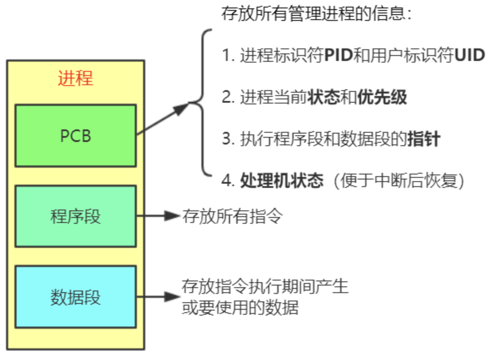
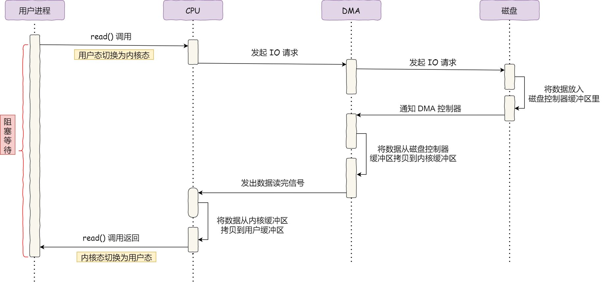

# 计算机组成原理

计算机系统的基本组成：硬件+软件

- 硬件的基本组成：运算器 + 控制器 + 存储器  + 输入设备 + 输出设备

- 软件组成：系统软件（如**操作系统**，数据库管理系统） 和 应用软件（QQ等）。

计算机特点：

1. 指令和数据都使用二进制表示，位于存储器中，需要使用地址访问。

2. **指令有 操作码 和 地址码 组成**。

3. 冯诺依曼计算机强调以运算器为中心，当代计算机强调以存储器为中心，因为如果所有事情都交给运算器的话那么运算器的执行效率会降低。

## 存储器

存储器理解为就是存储数据的地方，可以按照不同的类型来分。这里只介绍主存储器（内存）和辅助存储器（磁盘，硬盘），高速缓冲存储器（Cache）

**主存储器**是由 **存储体**，**地址寄存器(MAR)**，**数据寄存器(MDR)**，**时序控制逻辑**组成。

- 存储体：存放数据的地方，可以理解为就是**内存**。而**主存储器主要有存储体组成，所以可以理解为存储器就是内存**。

- 其他三个组件主要是临时存储要操作的数据，例如地址，数据，时序信号等。

辅助存储器就是辅助主内存的存储器，容量大，但读取速度慢，例如磁盘，硬盘。

**高速缓冲存储器Cache**是为了弥补CPU跟主内存之间读取数据速度的差异（空等现象）。为什么加了缓存就可以解决空等现象呢？因为有时间局部性和空间局部性原理。

- 时间局部性：**如果一个数据现在被访问了，那么以后很有可能也会被访问**

- 空间局部性：**如果一个数据现在被访问了，那么它周围的数据在以后可能也会被访问**

所以CPU 每次获取数据都会先访问 cache，如果获取不到数据则把数据加载到 cache中进行访问。因为 cache 的大小是远远小于主存的，所以还需要在 cache和主存之间维护一个映射关系，这样才能正确找到数据。

缓存与主存之间地址的映射方式有：

1. **直接映射**：每个主存块只能放在一个**特定的位置**。Cache块号=主存块号%Cache块总数，总所周知，只要取模就会出现下标冲突的情况，这个时候就可能出现上一个数据的缓存失效。

2. **组相联**：Cache块分为若干组，每个主存块可以放到**特定分组内的任意一个位置**。组号=主存块号%分组数。较好的解决了直接映射的缓存失效问题。

3. **全相联**：主存块可以放在Cache的任意位置。

由于现在都是多核 CPU，加上CPU内部有缓存且需要数据存在共享的情况，所以需要一种机制保证在不同的CPU中看到的 cache 数据必须时一致的。最常用来处理多核 CPU 之间的缓存一致性协议就是 **MESI 协议**。MESI 协议是一种 **写失效**（Write Invalidate）的协议。在写失效协议里，在这个 CPU 核心将某个数据写入 cache 之后，它会去广播一个“失效”请求告诉所有其他的 CPU 核心更新此数据。

## 运算器

运算器主要是进行 **算术运算**（加减乘除）以及 **逻辑运算**(与& 或| 非^)。主要由以下部分组成：

## 控制器

控制器的作用主要功能是解释指令、调度程序、读写存储器、输入输出数据等。主要组成：程序计数器(PC)、指令寄存器(IR)和控制单元(CU)。

- 程序计数器(PC)：存放下一条指令的地址，地址自动加1（顺序执行），或者根据用户指定的行为进行跳跃（条件分支）。

- 指令寄存器(IR)：存放当前执行的指令。

- 控制单元(CU)：分析指令，给出控制信号

## 中央处理器CPU

CPU是有运算器和控制器组成：

**CPU中除了运算器和控制器还包括 时钟(用于计时) 和 许多的寄存器**用于保存状态和数据，例如：数据寄存器和地址寄存器，程序状态字寄存器，CPU使用数据寄存器和地址寄存器 跟 存储器进行交互。

- 数据寄存器：存放操作数。两个寄存器拼接可存放双字长的数据

- 地址寄存器：存放地址

- 程序状态字寄存器（PSW）：存放条件码和其他状态信息，例如标记操作系统目前处于用户态还是核心态。

CPU的指令执行流程可以分为5个阶段: 取指令、分析指令、执行指令、访问取数、结果写回。

1. 取指令阶段：将内存中的指令读取到CPU中寄存器的过程，程序计数器存储下一条指令所在的地址；

2. 解析执行阶段：指令编码器按照预先的指令格式，对取出的指令进行拆分和解释，识别不同的指令类别和各种获取操作数的方法；

3. 执行指令阶段：完成指令所规定的各种操作，具体实现指令的功能；

4. 访问取数阶段：根据指令地址码，得到操作数在主存中的地址，并从主存中读取该操作数用于运算；

5. 结果写回阶段：把执行指令阶段的运行结果数据“写回”到某种存储形式，结果数据经常被写到CPU的内部寄存器中，以便被后续的指令快速地存取。

# 操作系统

**操作系统**(Operating System，OS) 是一个运行在计算机上的**系统软件** ，管理着计算机硬件和软件资源，可以对资源合理的进行调度和分配。还**提供了统一易用的接口**给用户和其他软件使用。

操作系统主要完成的功能：进程管理、内存管理、文件管理、设备管理。

操作系统的特性

- 并发：在一段时间内，宏观上有多个程序同时运行
- 共享：系统中的资源可以被多个程序访问。包括 互斥访问 和 同时访问。
- 虚拟：通过某种技术把一个物理实体变为若干个逻辑上的对应物，例如内存的管理，内存才几G，但程序数据需要好几十G，这个时候就通过虚拟技术来管理内存。
- 异步：多个进程运行的顺序是无法预知的。

### 用户态和核心态

在计算机系统中，分两种程序：系统程序和应用程序。**为了保证 系统程序 不被 应用程序 有意或无意地破坏**，计算机设置了两种状态—— **用户态、核心态**。

- **用户态**：只能受限的访问内存 ，只能执行非特权指令，运行所有的应用程序。
- **核心态**：可以访问所有数据，可以运行特权指令和非特权指令，运行系统程序。

**用户态 必须使用中断机制才可以切换到 核心态**。计算机使用 **程序状态字寄存器**（PSW）中的某个标志位来标识当前CPU的状态，如0是用户态，1是核心态。

这里的中断机制包含了三种手段，也就是说从用户态转换到内核态有三种手段：

1. **外中断**：程序运行时产生外中断事件（比如 I/O 操作完成），运行程序被中断，转向中断程序处理
   
   1. 外中断与当前执行的指令无关， 中断信号来源于 CPU 外部。如 I/O 完成中断，表示设备输入/输出处理已经完成，CPU 能够发送下一个输入/输出请求。

2. **内中断**：在程序运行时发生内中断（异常）事件，运行程序被打断，转向异常处理程序工作。
   
   1. 内中断与当前执行的指令有关，中断信号来源于 CPU 内部。如非法操作码、地址越界、算术溢出，除数为 0 等

3. **系统调用**：应用程序可以通过系统调用来请求操作系统内核的一些服务（执行系统调用也是发生了一次内中断，只不过不属于异常事件）

## 什么情况下会使用系统调用

凡是与共享资源有关的操作（比如内存分配、I/O 操作、文件管理等），都必须通过系统调用的方式向操作系统内核提出请求，由操作系统内核代为完成。这样可以保证系统的稳定性和安全性，防止用户进行非法操作。这些系统调用按功能大致可分为如下几类：

- 设备管理。完成设备的请求或释放，以及设备启动等功能。
- 文件管理。完成文件的读、写、创建及删除等功能。
- 进程控制。完成进程的创建、撤销、阻塞及唤醒等功能。
- 进程通信。完成进程之间的消息传递或信号传递等功能。
- 内存管理。完成内存的分配、回收以及获取作业占用内存区大小及地址等功能。

进程管理

### 什么是进程

进程由 PCB(进程控制块)、程序段、数据段组成，进程是资源分配的基本单位。

### 进程的五种状态

### 进程间通信

- **管道**：管道的实质是一个内核缓冲区，进程以先进先出的方式从缓冲区存取数据，进程A往管道中写完数据后，进程B才可以读数据。每个通道都是**半双工通信**，进程A不能既往管道写数据又往该管道读数据。
  - 管道又分为**匿名管道**和**命名管道**，匿名管道只能用于有**亲缘关系**的进程间通信，而命名管道则是用于**任意**进程。
- **消息队列**：是一个链表，一个进程可以往另一个进程的消息队列里发送数据。它提供了一种异步通信的方式，发送端和接收端不需要同时存在
- **共享内存**：多个进程 **互斥的访问** 共享内存中的数据（全双工），它往往与其他通信机制，如信号量，配合使用，来实现进程间的同步和通信
- **信号量**Semaphore：信号量是一个计数器，可以用来控制多个进程对共享资源的访问。它常作为一种锁机制，防止某进程正在访问共享资源时，其他进程也访问该资源。因此，主要作为进程间以及同一进程内不同线程之间的同步手段。
- **套接字**Socket：可以实现不同主机之间的进程通信，具有广泛的适用性。

### 进程调度策略

**先来先服务 FCFS**：每次都将CPU分配给最先进入到就绪队列的进程。

**短作业优先 SJF**：优先给 **估计运行时间最短**的进程分配CPU。

**优先权调度**：每个进程都关联一个优先级，内核将CPU分配给最高优先级的进程。具有相同优先级的进程，按照先来先服务的原则进行调度。

**时间片调度**：系统将所有的就绪进程按 先来先服务 的原则排成一个队列，每次调度时CPU只执行一个时间片，当前时间片执行完之后就调度下一个进程。

**响应比优先调度**：

- 如果作业的等待时间相同，则服务的时间愈短，其优先权愈高。
- 如果服务的时间相同，等待时间愈长，其优先权愈高。
- 对于长作业，作业的优先级可以随等待时间的增加而提高

## 什么是线程

线程是CPU调度的最小单位。因为多进程的开销较大，所以诞生了多线程，多线程的开销比多进程小。一个进程包含了一个或多个线程。

线程由线程ID、TCB(线程控制块)、寄存器集合和堆栈组成。通常意义上，一个进程由一个到多个线程组成，各个线程之间共享程序的内存空间(包括代码段、数据段、堆等）及一些进程级的资源（如打开文件和信号)。

## 多线程模型

**用户级线程**：用户级线程**由应用程序通过线程库实现**。所有的线程管理工作都由应用程序负责（包括线程切换），在用户级线程中，线程切换在用户态下即可完成，无需操作系统干预。在用户看来是有多个线程，但是在操作系统内核看来,并意识不到线程的存在。

**内核级线程**：内核级线程的调度、切换等工作都由内核负责，因此内核级线程的切换必然
需要在核心态下才能完成。

线程模型有三种：

**多对一模型**：将多个用户线程映射到一个内核线程中。

- 好处：线程切换在用户态下即可完成，切换速度快

- 缺点：无法发挥多核CPU的作用。并且由于对于操作系统来说只有一个进程，所以当该进程的某个线程阻塞时，该进程的线程全部阻塞。

**一对一模型**：将一个用户线程映射到一个内核线程中。

- 好处：可以充分利用多核CPU。

- 缺点：线程切换需要从用户态切换至内核态。

**多对多模型**：即将n个用户线程映射到m个内核线程中。

## Java线程跟操作系统线程的关系

在了解 Java 线程之前，先了解一下**线程库** Thread library 的概念。

在上面的模型介绍中，我们提到了通过线程库来创建、管理线程，那么什么是线程库呢？**线程库就是为开发人员提供创建和管理线程的一套 API。**

当然，**线程库不仅可以在用户空间中实现，还可以在内核空间中实现**。前者涉及仅在用户空间内实现的 API 函数，没有内核支持。**后者涉及系统调用，也就是说调用库中的一个 API 函数将会导致对内核的系统调用，并且需要具有线程库支持的内核。**

下面简单介绍下三个主要的线程库：

1. Pthreads：可以作为用户或内核库提供，作为 POSIX 标准的扩展

2. Win32 线程：用于 Window 操作系统的内核级线程库

3. Java 线程：**Java 线程 API 通常采用宿主系统的线程库来实现**，也就是说在 Win 系统上，Java 线程 API 通常采用 Win API 来实现，在 UNIX 类系统上，采用 Pthread 来实现。

下面我们来详细讲解 Java 线程：

事实上，在 JDK 1.2 之前，Java 线程是基于称为 "绿色线程"（Green Threads）的用户级线程实现的，也就是说程序员大佬们为 JVM 开发了自己的一套线程库或者说线程管理机制。

而在**JDK 1.2 及以后，JVM 选择了更加稳定且方便使用的操作系统原生的内核级线程**，通过系统调用，将线程的调度交给了操作系统内核。而对于不同的操作系统来说，它们本身的设计思路基本上是完全不一样的，因此它们各自对于线程的设计也存在种种差异，所以 JVM 中明确声明了：**虚拟机中的线程状态，不反应任何操作系统中的线程状态**。

> 需要注意的是，这里指的是主流平台上的主流商用 Java 虚拟机，比如 HotSpot。也就是说是存在例外情况的，比如 Solaris 平台上的 HotSpot 虚拟机就提供了 1：1 和 N：M 两种线程模型。

总结来说，**现今 Java 中线程的本质，其实就是操作系统中的线程，其线程库和线程模型很大程度上依赖于操作系统（宿主系统）的具体实现，比如在 Windows 中 Java 就是基于 Win32 线程库来管理线程，且 Windows 采用的是一对一的线程模型**。 

### 线程调度策略

- **抢占式调度**：每条线程执行的时间、线程的切换都由**系统控制**。系统控制指的是在系统某种运行机制下，每条线程分的执行时间片长度是不尽相同的。在这种机制下，一个线程的堵塞不会导致整个进程堵塞。
- **协同式调度**：某一线程执行完后主动通知系统切换到另一线程上执行，这种模式就像接力赛一样，一个人跑完自己的路程就把接力棒交接给下一个人，下个人继续往下跑。`线程的执行时间由线程本身控制`，线程切换可以预知，不存在多线程同步问题，但它有一个致命弱点：如果一个线程编写有问题，运行到一半就一直堵塞，那么可能导致整个系统崩溃。

> JVM采用抢占式调度模型
> 
> 单核CPU仍然要考虑线程安全问题，因为**因为单核cpu仍然存在线程切换，执行非原子操作的时候**。

### 进程和线程的区别是什么

1. 进程是资源分配的最小单位，线程是资源调度的最小单位
2. 一个进程至少有一个线程，多个线程可共享进程所拥有的资源，线程必须存活在进程中。
3. 进程之间的切换比线程之间切换的开销要大。

### 什么情况下会发生死锁？如何解决

死锁：两个或两个以上的进程（线程）在执行过程中，因为争夺资源而造成相互等待状态，若无外力作用，它们都将永远无法执行下去。

形成死锁的四个必要条件：

- **互斥**：一个资源一次只能被一个进程访问。

- **请求与保持**：一个进程因请求资源而阻塞时，对已获得的资源保持不放。

- **不可剥夺**：进程已经获得的资源，在未使用完之前不能强行剥夺。

- **循环等待**：若干资源形成一种头尾相接的循环等待资源关系。

**解决**死锁的办法：

| 死锁条件  | 解决方案                    |
| ----- | ----------------------- |
| 互斥    | 无法解决                    |
| 请求与保持 | 一次性申请所有的资源              |
| 不可剥夺  | 申请不到资源时，主动释放占有的资源（超时机制） |
| 环路等待  | 顺序执行（注意加锁顺序）            |

## 内存管理

### 什么是内存

**所有数据要放在内存中才可以被CPU使用**。整个内存由一块块连续的 **存储单元** 组成。

不同计算机的存储单元的大小不同，如果计算机**按字节编址**，则一个存储单元为1B（8bit）。如果计算机**按字长编址**，则一个存储单元为一个字（字长由计算机决定）。

> 比如字长为16位的计算机“按字编址”，则每个存储单元大小为1个字，每个字的大小为16bit。

### 从写程序到程序运行

编辑 -- 编译 -- 链接 -- 载入。

- 编译：将程序翻译成机器语言。
- 链接：将每部分的机器语言都链接在一起，形成一个整体的模块。
- 载入：将整体模块载入到内存中

因为机器语言里面所使用的地址是**逻辑地址**（相对地址），所以需要在载入或载入之前将逻辑地址变成内存中的**物理地址**，也叫绝对地址（ **初始地址+逻辑地址=物理地址** ）。

- 物理地址：数据在内存中实际存在的位置。

- 逻辑地址，相对于某个基准地址的地址，例如当进程使用的地址从100开始，然后数据A的逻辑地址是12，那么实际数据A的物理地址为100+12=112。目前所有的程序中使用的地址都是逻辑地址，可以更加的灵活，例如**链表的下个元素的指针也是逻辑地址**。

载入有三种方式：

1. 绝对载入：编译时就将逻辑地址转为物理地址，装入的时候直接装入即可。此种方式要求数据地址从第0位开始计算。
2. 静态重定位：装入时就完成逻辑地址到物理地址转换。此方式需要把所有数据加载到内存中，并且地址不能移动了。
3. **动态重定位**：利用**重定位寄存器**记录起始地址，程序运行时再动态的转换地址。目前基本使用的都是动态重定位技术。

### 内存保护

为了保证进程不发生越界访问，操作系统会对每个进程区域进行存储保护：利用**重定位寄存器**和**界地址寄存器**来判断指令是否发生了地址越界。

> 界地址寄存器：存放 进程内存末端地址 的偏移量。

### 内存分配

传统内存分配方式有两种：连续分配和离散分配。

> 内存中分有 系统区 和 用户区。**每个进程的空间分配到用户区**。

**单一连续分配**：用户区只能分配给一个进程。

**固定分区连续分配**：将用户区分成多个大小固定的区域（大小可相同可不同），每个进程分配到每个区域中。

**动态分区连续分配**：进程需要用到内存时才动态的创建分区。至于如何创建在哪创建需要根据动态分配算法来决定。

- ==首次适应==：空闲分区以**地址递增**的次序排列，每次分配空间时，按顺序查找，放得下就立刻分配，然后更新空闲分区。
- ==最佳适应==：空闲分区以**容量递增**的次序排列，每次分配空间时，按顺序查找，放得下就立刻分配，然后更新空闲分区。
- ==最坏适应==：空闲分区以**容量递减**的次序排列，每次分配空间时，按顺序查找，放得下就立刻分配，然后更新空闲分区。

【总结】连续分配会产生大量的内部碎片。

### 分页式存储

将**内存空间**分为一个个大小相等的**物理块**（比如4KB），每个物理块从0开始编号。

同时将**进程空间**也分为一个个跟**物理块大小相等**的区域，我们叫做**页**，每页从0开始编号。

操作系统以**页**为单位给每个进程分配内存空间，每页都**离散**的分配到物理块中。

**tips**：物理块越大，越容易产生内部碎片。

如何实现地址的转换？

物理地址 = 页面起始地址 + 页内偏移量。

- `页面起始地址 = 块号 * 块大小`，而块号可以根据页号得到。
- `逻辑地址 / 页面大小 = 页号`， `逻辑地址 % 页面大小 = 页内偏移量`

> 为了方便计算，一般页面长度为 2^n ，这样可以用 **低n位** 表示**页内偏移量**，**剩余的高位**表示 **页号**。

如何根据页号得到块号？

操作系统为**每个进程**建立了一个**页表**，每个页表项记录了 页号跟块号 的对应关系，且每个页表项长度都是相等的，连续的存放在**内存**中。

因为页号我们是已知的，所以页表项里只需要存储每个页对应的块号就可以了。当我们拿到页号，通过公式`页表起始地址 + 页号 * 页表项的长度` 得到页表项，因而得到块号。

### 分段式存储

程序按照**自身的逻辑**关系将**进程空间**划分为若干个段，每个段都有一个段名（在低级语言中，程序员使用段名来编程）。内存分配时以段为单位，每个段分配在离散的空间中。

分段系统的逻辑地址结构由 **段号（段名）**和 **段内地址（段内偏移量）**所组成。

操作系统为每个进程建立一个段表，放到内存中。每个段表项包括 **段长**跟**段基址**。

> 物理地址 = 基址 + 段内地址。利用段长判断指令是否越界。

段式跟页式的区别：

- **目的不同**：分页的目的是为了离散分配；而分段的目的是为了满足用户的需求；

- **大小不同**：页的大小固定且由系统决定；而段的长度不固定，由具体功能决定；

- **地址空间不同**： 页向用户提供的是一维地址空间；段向用户提供二维地址空间(段名和段内地址)；

- **内存碎片**：页式存储的优点是没有外部碎片，但会产生内部碎片（一个页可能填充不满）；而段式存储的优点是没有内碎片，但会产生外碎片；

### 段页式存储

用户程序**先分段**，每个段内部**再分页**。逻辑地址为：段号、段内页号、页内地址。

查找的时候先根据 段号 找到 页号(存放在块号中)，然后根据 页号 找到具体的 块号 。

### 虚拟内存

在操作系统管理下，用户看来比实际内存大得多的内存就是虚拟内存。

有三个特性：多次性、对换性、虚拟性

- **多次性**：无需一次性将作业全部载入内存，将要用到的部分才载入。这有区别于传统分配方式，传统方式都是一次性载入。
- **对换性**：允许作业在运行过程中，将作业进行调入和换出。
- **虚拟性**：从逻辑上扩充了内存的容量，使用户感觉内存容量远大于实际容量。

> 工作方式：
> 
> 首先把进程运行所需要的数据加载到内存中。在后续如果需要用到其他数据，则将其加载到内存中，如果此时内存已满，则会使用页面置换算法将某个页或者某些数据移出内存。

实现虚拟存储的方式：

请求分页存储管理 跟 分页存储管理的区别：

- 当请求分页存储管理访问页面不在内存时，会发生**缺页中断**，由操作系统将所需信息从外存载入内存
- 请求分页存储管理若空间不足时，操作系统会使用**页面置换算法**将某些页面移出内存。

因为需要记录页面是否调入内存等信息，所以在页表中新增了四个字段：

| 新增字段 | 作用                                  |
| ---- | ----------------------------------- |
| 状态位  | 是否调入内存，1表示已在内存                      |
| 访问字段 | 记录该页最近访问过几次或最近修改的时间，便于页面置换算法实现      |
| 修改位  | 调入内存后是否被修改过，若有修改，则需要将数据从高速缓冲区重新写回内存 |
| 外存地址 | 页面在外存中的地址                           |

地址转换过程：

1. 根据页号去**快表**(相当于缓存)中查找，若命中直接返回。

2. 否则，根据页号去**页表**中查找该页的相关信息，若其没有调入内存则发生**缺页中断**，此时缺页的进程阻塞，页面被载入内存后 缺页的进程 会被唤醒。

3. 如果此时内存不足，则会使用**页面置换算法**，移除一个页面。

4. 当一个页面被访问或调入调出的时候，需要**修改对应的页表项**。
   
   【注意】在页面被调出的时候，需要在快表中删除该页的页表项。

### 页面置换算法

**最佳置换算法 OPT**：每次淘汰将来最久不会使用的页面。（因为无法预知将来页面，所以该方法是无法实现的）

**先进先出置换算法 FIFO**：每次淘汰最先进入内存的页面。（可以利用指针实现，每次去掉头指针指向的页面即可）

**最近最久未使用 LRU**：每次淘汰已在内存中的，最久没使用到的页面。（利用访问字段记录该页最近的访问时间）

**时钟置换算法**：也叫最近未使用算法。将内存中的页面放入一个循环链表，然后利用 访问字段 记录最近是否访问过。若一个页的访问字段为0，说明该页最近没有被使用过，替换该页；否则将该页的访问字段变为0（不会进行替换），然后往下遍历直到遇到0。如果全都是1，那么第二轮扫描的时候肯定会淘汰第一个页面。

**改进时钟置换算法**：跟时钟置换算法差不多，只不过要考虑修改位，即访问位都是0的情况下，==优先选择修改位为0的页面进行置换==（因为不用把数据从高速缓冲区重新写回内存）。

> **抖动(颠簸)现象**：多个页面被频繁的调入调出。原因是分配给进程的物理块的数量少于需要频繁访问的页面的数量。

磁盘调度算法

- **先来先服务**：根据进程请求访问磁盘的先后顺序进行调度
- **最短寻道时间**：每次选择距离当前磁头最近的磁道进行调度
- **扫描算法（电梯算法）**：在磁头**当前移动方向上**选择与当前磁头所在磁道距离最近的请求作为下一次服务的对象。到达最后一个磁道时，会改变磁头方向，然后根据之前的规则进行调度。
- **循环扫描**：类似于电梯算法，只不过每次到达最后一个进程不是改变磁头方向，而是快速回到起始端重复调用。

### Linux的交换分区

当内存不足时，将暂时用不到的程序放入到交换分区，当内存足够或者需要用到的时候再换回内存。

> 交换分区的最大值不超过物理内存的两倍。

### DMA技术

在没有 DMA 技术前，I/O 的过程是这样的：

- CPU 发出对应的指令给磁盘控制器，然后返回；
- 磁盘控制器收到指令后，于是就开始准备数据，会把数据放入到磁盘控制器的内部缓冲区中，然后产生一个**中断**；
- CPU 收到中断信号后，停下手头的工作，接着把磁盘控制器的缓冲区的数据一次一个字节地读进自己的寄存器，然后再把寄存器里的数据写入到内存，而在数据传输的期间 CPU 是无法执行其他任务的。

什么是 DMA 技术？简单理解就是，**在进行 I/O 设备和内存的数据传输的时候，数据搬运的工作全部交给 DMA 控制器，而 CPU 不再参与任何与数据搬运相关的事情，这样 CPU 就可以去处理别的事务**。

有了 DMA 技术，也就是**直接内存访问（Direct Memory Access）** 技术之后，就可以去除CPU数据搬运的工作量。

### 零拷贝

零拷贝运用在主机之间发送文件的情况。因为发送文件时，需要将**文件从硬盘拷贝到内核缓冲区**，再从**内核缓冲区拷贝到用户进程的缓冲区**，接着把**文件从用户进程的缓冲区拷贝到socket缓冲区**，接着**socket把文件内容发送给网卡**。

以上步骤中一共发生了4次文件拷贝，并且4次的内核切换。

在发送文件的时候，并不需要把文件内容发送给用户程序（因为不会对文件进行修改），它只需要知道文件发送成功没有。所以零拷贝就是去掉了把文件内容拷贝到用户程序，再从用户程序拷贝到socket中的操作，而是直接将文件拷贝到内核缓冲区，然后从内核缓冲区拷贝到网卡中。

零拷贝只发生了2次文件拷贝，并且2次的内核切换。

> 当传输大文件时，不能使用零拷贝，因为PageCache 可能被大文件占据，而导致「热点」小文件无法利用到 PageCache，并且大文件的缓存命中率不高，这时就需要使用「异步 IO + 直接 IO 」的方式。
