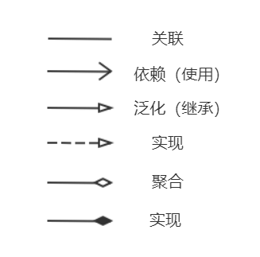

设计模式
===

1. 七大基本原则
---

1. 单一职责原则 (Single Responsibility Principle)
   - 一个类只负责一项职责。
2. 接口隔离原则 (Interface Segregation Principle)
   - 将一个功能比较杂的接口拆成多个接口。
3. 依赖倒置原则 (Dependence Inversion Principle)
   - 面向接口编程，抽象不依赖实现。比如让一个方法的参数变为接口，然后传其实现类就可实现不同的功能。
4. 里氏替换原则 (Liskov Substitution Principle)
   - 子类尽量不要重写父类的方法。
   - 继承实际上会破坏封装，因为继承将基类的实现细节暴露给子类；如果基类的实现发生了改变，则子类的实现也不得不改变。适当情况下，可以让两个类继承更高的父类，然后通过组合聚合依赖的方式避免继承。
5. 开闭原则 (Open-Closed Principle)
   - 尽可能地不要修改已经写好的代码，已有的功能，而是去扩展它。
6. 迪米特法则（Law Of Demeter）
   - 对象之间减少不必要的依赖。也就是说，陌生的类最好不要作为局部变量的形式出现在类的内部，除了形参。
7. 组合复用原则 (Composite/Aggregate Reuse Principle)
   - 尽量使用组合聚合方式，而不是继承。


2. UML类图
---

UML一般指 统一建模语言(Unified Modeling Language，UML)，用图形方式表现典型的面向对象系统的整个结构。

UML的图包括很多，这里只介绍类图。==类图是描述类与类之间的关系的==，每个关系的连接线不一样。

在UML类图中，常见的有以下几种关系: 

**关联**（Association)，**依赖**(Dependency)，**泛化**（Generalization）, **实现**（Realization），**聚合**（Aggregation），**组合**（Composition）



组合：部分离开整体，整体就不可以使用了。

聚合：部分离开整体，整体还可以正常使用。

```java
public class person{
    private IDCard card; // 与person为聚合关系
    private Head head = new Head(); // 与person为组合关系
}
public class IDCard{}
public class Head{}
```


3. 
---


