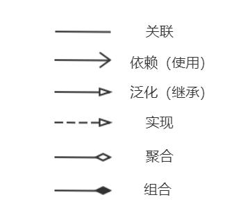
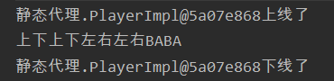
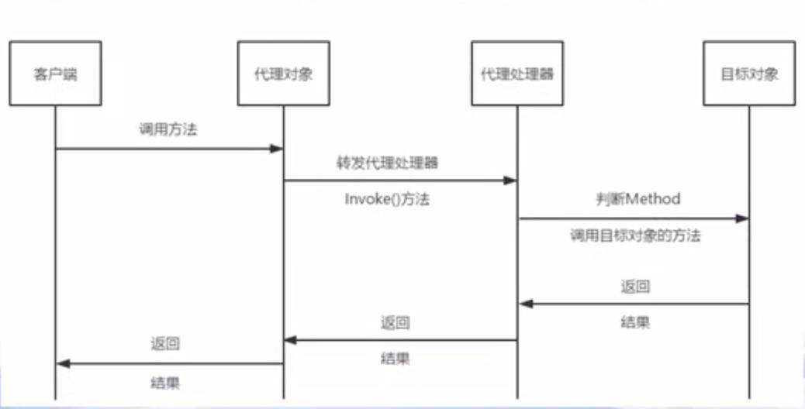
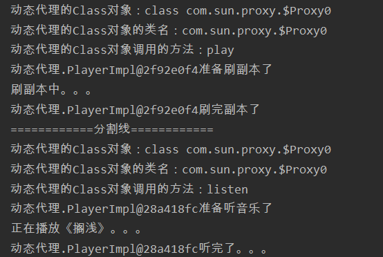

设计模式
===

六大基本原则
---

1. 单一职责原则 (Single Responsibility Principle)
   - 一个类只负责一项职责。
2. 接口隔离原则 (Interface Segregation Principle)
   - 将一个功能比较杂的接口拆成多个接口。
3. 依赖倒置原则 (Dependence Inversion Principle)
   - 面向接口编程，抽象不依赖实现。比如让一个方法的参数类型变为接口，然后传其实现类就可实现不同的功能。
4. 里氏替换原则 (Liskov Substitution Principle)
   - 子类尽量不要重写父类的方法。
   - 继承实际上会破坏封装，因为继承将基类的实现细节暴露给子类；如果基类的实现发生了改变，则子类的实现也不得不改变。适当情况下，可以让两个类继承更高的父类，然后通过组合聚合依赖的方式避免继承。
5. 开闭原则 (Open-Closed Principle)
   - 尽可能地不要修改已经写好的代码或已有的功能，而是去扩展它。
6. 迪米特法则（Law Of Demeter）
   - 对象之间减少不必要的依赖。也就是说，陌生的类最好不要作为局部变量的形式出现在类的内部，除了形参。


UML类图
---

UML一般指 统一建模语言(Unified Modeling Language，UML)，用图形方式表现典型的面向对象系统的整个结构。

UML的图包括很多，这里只介绍类图。==类图是描述类与类之间的关系的==，每个关系的连接线不一样。

在UML类图中，常见的有以下几种关系: 

**关联**（Association)，**依赖**(Dependency)，**泛化**（Generalization）, **实现**（Realization），**聚合**（Aggregation），**组合**（Composition）



组合：部分离开整体，整体就不可以使用了。

聚合：部分离开整体，整体还可以正常使用。

```java
public class person{
    private IDCard card; // 与person为聚合关系
    private Head head = new Head(); // 与person为组合关系
}
public class IDCard{}
public class Head{}
```

***

设计模式分为三个类型，共23种。

- 创建型：单例模型、工厂模式、抽象工厂模式、原型模式、建造者模式
- 结构型：适配器模式、桥接模式、装饰模式、组合模式、外观模式、享元模式、代理模式
- 行为型：模板方法模式、命令模式、访问者模式、迭代器模式、观察者模式、中介者模式、备忘录模式、解释器模式、状态模式、策略模式、责任链模式


创建型
---

### 单例模式

保证在整个系统中，对于某个类只能存在一个对象实例，并且获得该对象的方法也只能有一个。若想使用单例类，必须通过方法来获得对应的对象，而不是new的方式。

**关键代码**：构造函数是私有的。

**使用场景**：需要频繁的创建和销毁对象，且经常要使用该对象。比如mybatis的sqlSessionFactory。

***

#### 饿汉式（静态常量方式）

1. 构造器私有化
2. 本类内部创建对象实例（静态常量）
3. 提供一个公有静态方法获取实例

```java
class Singleton{
    // 1. 构造器私有化
    private Singleton(){}
    
    // 2. 创建对象实例（静态常量）
    private static final Singleton s = new Singleton();
    
    // 3. 提供一个共有静态方法获取实例
    public static Singleton getInstance(){
        return s;
    }
}
```

优点：实现简单，避免了线程同步问题。

缺点：类加载的时候就进行了实例化，如果没有使用，可能造成内存的浪费。

> 如果确保了该实例一定会被使用，那么这种方式最提倡，例如jdk的**Runtime**就是使用此方式实现单例。


#### 懒汉式

```java
class Singleton{
    // 1. 构造器私有化
    private Singleton(){}
    
    private static Singleton s;
    
    // 2. 使用的时候才实例化
    public static Singleton getInstance(){
        if(null == s) s = new Singleton();
        return s;
    }
}
```

优点：有懒加载的效果。

缺点：线程不安全。如果有一个线程在进行if判断的时候，另一个线程也执行到了if这行代码，此时就会产生多个实例。


#### 懒汉式（同步代码块）

```java
class Singleton{
    // 1. 构造器私有化
    private Singleton(){}
    
    private static Singleton s;
    
    // 2. 使用的时候才实例化
    public static Singleton getInstance(){
        if(null == s) {
            synchronized(Singleton.class){
            	s = new Singleton();
            }
        }
        return s;
    }
}
```

看似线程安全，可是跟上一个差不多，如果多线程都进入了if里面，也还是会创建多个实例，不仅不安全还很耗资源。


#### 双重检查 DCL

```java
class Singleton{
    // 1. 构造器私有化
    private Singleton(){}
    
    // 2. 加volatile关键字
    private static volatile Singleton s;
    
    // 3. 进行两次if判断
    public static Singleton getInstance(){
        if(null == s) {
            synchronized(Singleton.class){
                if(null == s){
            	s = new Singleton();
                }
            }
        }
        return s;
    }
}
```

假如一个线程进入了同步代码块，另一个线程进入了第一个if，此时第一个线程实例化完成之后，第二个线程进入同步代码块后对第二个if判断的时候就会发现s已经被实例化了。

那为什么要加volatile关键字。是为了**禁止指令重排序**，因为一个对象被创建的时候分为三步：

1. 分配空间
2. 实例化对象，给属性赋值
3. 引用关系赋值

如果不加volatile，jvm可能会对后面两个指令进行重排序，即先进行引用关系的赋值，然后实例化对象，此时会使用到一个还没有实例化完全的对象而报错。


#### 静态内部类

把实例化的操作放到了静态内部类中，然后直接返回静态内部类中的属性即可。

```java
class test{
    private test(){}
    
    private static class Singleton{
        private static final Singleton s = new Singleton();
    }
   
    public static Singleton getSingleton(){
        return Singleton.s;
    }
}
```

此方式采用了类装载机制来保证线程安全。并且只有使用getSingleton()时，内部类才会被加载。


#### 枚举

```java
public enum Singleton {  
    S; 
}
```

只有枚举方式才可以避免==序列化对单例破坏==以及==防止反射攻击==。


### 工厂模式

**意图**：定义一个创建对象的接口，让其子类自己决定实例化哪一个工厂类，工厂模式使其创建过程延迟到子类进行。

**关键代码**：创建过程在其子类执行。

**使用场景**：需要在不同条件下创建不同实例时。比如数据库访问，用户可以选择数据库的访问类型。

**优点**： 

1. 一个调用者想创建一个对象，只要知道其名称就可以了。 
2. 扩展性高，如果想增加一个产品，只要扩展一个工厂类就可以。 
3. 屏蔽产品的具体实现，调用者只关心产品的接口。

**缺点：**每次增加一个产品时，都需要增加一个具体类和对象实现工厂，使得系统中类的个数成倍增加，在一定程度上增加了系统的复杂度，同时也增加了具体类的依赖。


#### 简单工厂

该模式对对象创建管理方式最为简单，只需要对不同类对象的创建进行了一层薄薄的封装即可，即通过向工厂传递类型来指定要创建的对象。

***

下面我们使用手机生产来讲解该模式：

MiPhone类：制造小米手机

```java
public class MiPhone {
    public MiPhone() {
        System.out.println("制造小米手机!");
    }
}
```

IPhone类：制造苹果手机

```java
public class IPhone implements Phone {
    public IPhone() {
        System.out.println("制造苹果手机!");
    }
}
```

PhoneFactory类：手机制造工厂

```java
public class PhoneFactory {
    public Object makePhone(String phoneType) {
        if(phoneType.equals("MiPhone")){
            return new MiPhone();
        }
        else if(phoneType.equals("IPhone")) {
            return new IPhone();
        }
        return null;
    }
}
```

测试：

```java
public class Demo {
    public static void main(String[] arg) {
        PhoneFactory factory = new PhoneFactory();
        // 制造小米手机!
        MiPhone miPhone = (MiPhone)factory.makePhone("MiPhone");
        // 制造苹果手机!
        IPhone iPhone = (IPhone)factory.makePhone("IPhone");
    }
}
```

缺点：简单工厂模式是违反“开闭原则“；因为如果要新增产品，就需要修改工厂类的代码。

比如我要新增一个华为手机，此时就需要改PhoneFactory的代码。


#### 工厂方法

简单工厂模式中 工厂 负责的是生产所有产品，而工厂方法模式将生产不同产品的任务分发给不同的工厂，正所谓各司其职，减少依赖性。

比如小米就专门生产小米系列的手机，苹果就生产苹果系列的手机。

既然工厂要不同，那就得把工厂抽象出来，具体的厂商自己实现。

AbstractFactory类：生产不同产品的工厂的接口

```java
public interface AbstractFactory {
    Phone makePhone();
}
```

MiFactory类：生产小米手机的工厂

```java
public class MiFactory implements AbstractFactory{
    @Override
    public Phone makePhone() {
        return new MiPhone();
    }
}
```

AppleFactory类：生产苹果手机的工厂

```java
public class AppleFactory implements AbstractFactory {
    @Override
    public Phone makePhone() {
        return new IPhone();
    }
}
```

HuaWeiFactory类：生产华为手机的工厂

```java
public class HuaWeiFactory implements AbstractFactory {
    @Override
    public Phone makePhone() {
        // 假设新增了HuaWeiPhone这个类
        return new HuaWeiPhone();
    }
}
```

测试类：

```java
public class Demo {
    public static void main(String[] arg) {
        AbstractFactory miFactory = new XiaoMiFactory();
        AbstractFactory appleFactory = new AppleFactory();
        AbstractFactory huaWeiFactory = new HuaWeiFactory();
        miFactory.makePhone();	// 制造小米手机!
        appleFactory.makePhone();	// 制造苹果手机!
        huaWeiFactory.makePhone();	// 制造华为手机!
    }
}
```


### 抽象工厂

他与工厂方法模式的区别就在于，工厂方法模式针对的是一个产品；而抽象工厂模式则是针对的多个产品。即**工厂方法**模式提供的所有产品都是衍生自**同一个接口或抽象类**，而**抽象工厂**模式所提供的产品则是衍生自**不同的接口或抽象类**。

比如在工厂方法例子的基础上加一个电脑，即小米、苹果和华为都可以生成电脑。

首先肯定要创建三个电脑类，分别为MiPC、IPC、HuaWeiPC。

AbstractFactory类：生产不同产品的工厂的抽象类

```java
public interface AbstractFactory {
    Phone makePhone();
    PC makePC();
}
```

MiFactory类：生产小米手机的工厂

```java
public class MiFactory implements AbstractFactory{
    @Override
    public Phone makePhone() {
        return new MiPhone();
    }
    
    @Override
    public Phone makePC() {
        return new MiPC();
    }
}
```

AppleFactory类：生产苹果手机的工厂

```java
public class AppleFactory implements AbstractFactory {
    @Override
    public Phone makePhone() {
        return new IPhone();
    }
    
    @Override
    public Phone makePC() {
        return new IPC();
    }
}
```

HuaWeiFactory类：生产华为手机的工厂

```java
public class HuaWeiFactory implements AbstractFactory {
    @Override
    public Phone makePhone() {
        return new HuaWeiPhone();
    }
    
    @Override
    public Phone makePC() {
        return new HuaWeiPC();
    }
}
```

测试类：

```java
public class Demo {
    public static void main(String[] arg) {
        AbstractFactory miFactory = new XiaoMiFactory();
        miFactory.makePhone();	// 制造小米手机!
        miFactory.makePC();
    }
}
```

抽象工厂模式的缺点在于产品类的扩展，将会是十分费力的，假如需要加入新的产品，那么几乎所有的工厂类都需要进行修改，所以在使用抽象工厂模式时，对产品等级结构的划分是十分重要的。


结构型
---

### 适配器模式

适配器模式：将一个类的接口转换成客户希望的另外一个接口。适配器模式使得原本由于接口不兼容而不能一起工作的那些类可以一起工作。

**关键代码**：适配器继承或依赖已有的对象，实现想要的目标接口。

**优点**：

1. 可以让任何两个没有关联的类一起运行。
2. 提高了类的复用。

**缺点**：

1. 过多地使用适配器，会让系统非常零乱。比如，明明看到调用的是 A 接口，其实内部被适配成了 B 接口的实现；


#### 类适配器

让适配器类继承适配者类，实现目标类，然后在目标类的方法使用适配者类中的方法。

拿给电脑充电举例说明，有些电脑需要使用电源适配器把220V变成20V。

voltage20：目标类

```java
interface Voltage20 {
    public void output20V();
}
```

voltage220：适配者

```java
class Voltage220 {
    public int output220V() {       
        return 220;
    }
}
```

Adapter：适配器

```java
class Adapter extends Voltage220 implements Voltage20 {
    @Override
    public void output20V() {
        System.out.println("原电压为" + output220V());
        System.out.println("适配后电压为" + output220V()/11);
    }
}
```

测试类

```java
public class Test {
	public static void main(String[] args) {
		Adapter target = new Adapter();
		target.output5V();
	}
}
```

因为java是单继承机制，所以类适配器模式只能继承一个适配者。而且违背了“组合复用原则”，而下面的对象适配器模式就是对类适配器模式的改进。


#### 对象适配器

对象适配器根据“组合复用原则”，将继承变成了聚合。

voltage20：目标类

```java
interface voltage20 {
    public void output20V();
}
```

voltage220：适配者

```java
class Voltage220 {
    public int output220V() {       
        return 220;
    }
}
```

Adapter：适配器

```java
class Adapter implements voltage20 {
    Voltage220 voltage220;
    
    public Adapter(Voltage220 voltage220){
        this.voltage220 = voltage220;
    }
    
    @Override
    public void output20V() {
        System.out.println("原电压为" + voltage220.output220V());
        System.out.println("适配后电压为" + voltage220.output220V()/11);
    }
}
```

测试类

```java
public class Test {
	public static void main(String[] args) {
		Adapter target = new Adapter();
		target.output5V();
	}
}
```


#### 接口适配器

当<u>不需要全部实现接口</u>提供的方法时，可以设计一个适配器==抽象类==实现接口，并为接口中的==每个方法==提供默认方法，抽象类的子类就可以有选择的覆盖父类的某些方法实现需求，它适用于一个接口不想使用所有的方法的情况。

在java8后，接口中可以有default方法，就不需要这种接口适配器模式了。接口中方法都设置为default，实现为空，这样同样可以达到接口适配器模式的效果。


### 外观模式

外观模式是“迪米特法则”的典型应用，通过为多个复杂的子系统提供一个一致的接口，而使这些子系统更加容易被访问。该模式对外有一个统一接口，外部应用程序不用关心内部子系统的具体细节，这样可以大大降低应用程序的复杂度，提高了程序的可维护性。

**关键代码**：在客户端和复杂系统之间再加一层，这一层将调用顺序、依赖关系等处理好。

**使用场景**：子系统相对独立，外界对子系统的访问只要黑箱操作即可。 例如 MVC三层架构 就是采用外观模式。

**优点**：

1. 降低了子系统与客户端之间的耦合度。
2. 子系统使用起来更加容易。

**缺点**：增加新的子系统可能需要修改外观类或客户端的源代码，违背了“开闭原则”。

***

以购买基金为例：用户只和基金打交道，实际操作为基金经理人与股票和其它投资品打交道

Fund：基金类

```java
public class Fund {
    Stock1 stock1;
    NationalDebt1 nationalDebt1;
    Realty1 realty1;

    public Fund() {
        stock1 = new Stock1();
        nationalDebt1 = new NationalDebt1();
        realty1 = new Realty1();
    }

    // 购买基金：实际是购买不同的股票
    public void buyFund() {
        stock1.buy();
        nationalDebt1.buy();
        realty1.buy();
    }

    // 赎回基金：实际是出售不同的股票
    public void sellFund() {
        stock1.sell();
        nationalDebt1.sell();
        realty1.sell();
    }
}
```

Stock1：股票1（假设其他股票类都已存在）

```java
public class Stock1 {

    //买股票
    public void buy() {
        System.out.println("股票1买入");
    }

    //卖股票
    public void sell() {
        System.out.println("股票1卖出");
    }

}
```

Client：用户

```java
public class Client {
    public static void main(String[] args) {
        Fund fund = new Fund();
        // 基金购买
        fund.buyFund();
        // 基金赎回
        fund.sellFund();
    }
}
```


### 代理模式

代理模式为某一个对象提供一个代理对象，并由代理对象控制对原对象的引用。这样做的好处：扩展目标对象的功能。

代理有不同的形式：静态代理和动态代理。其中动态代理包括 JDK代理和cglib代理。

**关键代码：**实现与被代理类组合。

***

#### 静态代理

实现静态代理的步骤：

1. 代理类跟目标类需要实现同一个接口的方法，
2. 在代理类中定义目标的对象，编写代理方法，在代理方法中使用目标对象的方法及一些扩展操作。
3. 创建代理类对象和目标对象，将目标对象传给代理类对象，代理类对象使用代理方法。

缺点：代理对象需要和目标对象实现一样的接口，所以会产生很多的代理类。一旦增加方法，目标类和代理类都要进行维护。

***

比如我想要个代理帮我刷副本，并且在代理上线的时候输出一下日志。首先刷副本能力在于我本身，代理只是上我的号。

**接口**

```java
package 静态代理;
// 定义玩家接口
public interface Player {
    // 定义刷副本函数
    void DaGuai();
}
```

**被代理类**

```java
package 静态代理;

public class PlayerImpl implements Player {
    @Override
    public void DaGuai() {
        System.out.println("上下上下左右左右BABA");
    }
}
```

**代理类**

```java
package 静态代理;

public class StaticProxy implements Player {
    // 定义被代理类的对象
    private Player player;

    public StaticProxy(Player player){
        this.player = player;
    }

    @Override
    public void DaGuai() {
        // 输出进度
        System.out.println(player + "准备刷副本了");
        // 被代理类的方法
        player.DaGuai();
        System.out.println(player + "刷完副本了");
    }
}
```

**测试类** 

```java
package 静态代理;

public class Test {
    public static void main(String[] args){
        // 创建玩家对象
        Player codekiang = new PlayerImpl();
        // 将玩家对象封装到代理对象中
        StaticProxy proxy = new StaticProxy(codekiang);
        proxy.DaGuai();
    }
}
```

**输出结果**：



到此就完成了静态代理的实现。我们可以在`DaGuai`方法里扩展自己想要的功能。


#### JDK代理

JDK代理使用了**反射**，使其能在程序运行时创建代理类。动态代理可以实现AOP编程、解耦。

实现动态代理的步骤：

1. 在动态代理类中创建代理处理器（实现`InvocationHandler`接口的`invoke`方法）
2. 使用Proxy.newProxyInstance方法创建代理对象并返回
3. 使用代理对象来调用目标对象的方法

流程图：

代理器会自动帮我们创建代理对象，动态代理对象所有的方法在调用时都会被拦截，送到代理处理器的`invoke()`方法来处理。




**实现代码：**

接口（Player跟Listen）

```java
package 动态代理;

public interface Player {
    void play();
}
```

```java
package 动态代理;

public interface Listen {
    void listen();
}
```

目标类（实现了两个接口）

```java
package 动态代理;

public class PlayerImpl implements Player, Listen {

    @Override
    public void play() {
        System.out.println("刷副本中。。。");
    }

    @Override
    public void listen() {
        System.out.println("正在播放《搁浅》。。。");
    }
}
```

动态代理类（只需实现InvocationHandler接口）

```java
package 动态代理;

import java.lang.reflect.InvocationHandler;
import java.lang.reflect.Method;

public class DynamicProxy implements InvocationHandler {
    
    private Object target;
    
    // 获取代理对象
    private Object getProxy(Object target) {
        // 为目标对象target赋值
        this.target = target;
        return Proxy.newProxyInstance(
            target.getClass().getClassLoader(),
            target.getClass().getInterfaces(),
            this);
    }
    
    @Override
    /*
    * Object proxy:被代理的对象
    * Method method:要调用的方法
    * Object[] args:方法调用时所需要参数
     * */
    public Object invoke(Object proxy, Method method, Object[] args) throws Throwable {
        System.out.println("动态代理的Class对象：" + proxy.getClass());
        System.out.println("动态代理的Class对象的类名：" + proxy.getClass().getName());
        System.out.println("动态代理的Class对象调用的方法：" + method.getName());
        
        Object result = null;
        switch (method.getName()){
            case "listen":
                System.out.println(target + "准备听音乐了");
                result = method.invoke(target, args);
                System.out.println(target + "听完了。。。");
                break;
            case "play":
                System.out.println(target + "准备刷副本了");
                result = method.invoke(target, args);
                System.out.println(target + "刷完副本了");
                break;
            default:break;
        }
        return result;
    }
}
```

客户端

```java
package 动态代理;

import java.lang.reflect.Proxy;

public class Test {
    public static void main(String[] args){
        // 创建对象
        Player player = new PlayerImpl();
        // 动态生成代理对象
        Player playerProxy = (Player) DynamicProxy.getProxy(player);
        // 调用被代理类的方法
        playerProxy.play();
        
        System.out.println("============分割线============");
        
        Listen ListenProxy = (Listen) DynamicProxy.getProxy(new Listen());
        ListenProxy.listen();
    }
}
```

运行结果：



**tips**：当实现多个接口时，实现的顺序很重要，当多个接口有同名方法时，代理对象会执行位于前面的接口的方法。


#### cglib代理

前面两个代理都要求目标类要继承一个接口，那如果我是已经写好的一个类，没有实现接口，现在我想对他进行功能扩展，这时cglib的作用就体现出来了。

利用ASM开源包，将代理对象 类的class文件 加载进来，通过修改其字节码生成**子类**来处理。

cglib代理主要是对指定的类生成一个子类，并覆盖其中方法实现增强，但是因为采用的是继承，所以==该类或方法最好不要声明成final，对于final类或方法，是无法继承的==。

实现步骤：

1. 代理类继承`MethodInterceptor`接口并重写 intercept 方法。
2. 创建获取代理对象的方法
   - 设置父类
   - 设置回调
   - 创建代理对象并返回

***

目标类：

```java
public class Player {
    public void play() {
        System.out.println("刷副本中。。。");
    }
}
```

代理类：

```java
public class CglibProxy implements MethodInterceptor {
    // 需要代理的目标对象
    private Object target;

    // 重写拦截方法
    @Override
    public Object intercept(Object obj, Method method, Object[] args, MethodProxy proxy) throws Throwable {
        System.out.println("Cglib动态代理，监听开始！");
        Object invoke = method.invoke(target, args);
        System.out.println("Cglib动态代理，监听结束！");
        return invoke;
    }
    
    // 获取代理对象
    public Object getProxy(Object target){
        // 目标对象赋值
        this.target = target;
        Enhancer enhancer = new Enhancer();
        // 设置父类
        enhancer.setSuperclass(target.getClass());
        // 设置回调
        enhancer.setCallback(this);
        // 创建并返回代理对象
        return enhancer.create();
    }
}
```

测试类：

```java
public static void main(String[] args) {
    // 实例化CglibProxy对象
    CglibProxy cglib = new CglibProxy();
    // 获取代理对象
    Player player =  (Player) cglib.getCglibProxy(new Player());
    // 执行方法
    player.play();
}
```


行为型
---

### 模板方法模式

模板方法模式：定义一个操作中的**算法骨架**，而将算法的一些步骤延迟到子类中，使得子类可以不改变该算法结构的情况下重写该算法的某些特定步骤（方法）。

**关键代码**：在抽象类定义算法骨架，其他步骤在子类实现。另外，为防止恶意操作，一般模板方法都加上 final 关键词。

**使用场景**：知道了算法所需的关键步骤，而且确定了这些步骤的执行顺序，但某些步骤的具体实现还未知。

**优点：**

1. 封装不变部分，扩展可变部分。 
2. 提取公共代码，便于维护。 
3. 行为由父类控制，子类实现。

**缺点：**每一个不同的实现都需要一个子类来实现，导致类的个数增加，使得系统更加庞大。

Game：抽象类

```java
public abstract class Game {
   abstract void initialize();
   abstract void startPlay();
   abstract void endPlay();
 
   // 模板方法，定义游戏步骤
   public final void play() {
      // 第一步：初始化游戏
      initialize();
      // 第二步：开始游戏
      startPlay();
      // 第三步：结束游戏
      endPlay();
   }
}
```

Football：足球游戏

```java
public class Football extends Game {
   @Override
   void initialize() {
      System.out.println("正在初始化足球游戏...");
   }
 
   @Override
   void startPlay() {
      System.out.println("玩足球游戏!");
   }
     
   @Override
   void endPlay() {
      System.out.println("结束足球游戏!");
   }
}
```

测试类：

```java
public class Test {
    public static void main(String[] args) {
        Game game = new Football();
        // 调用模板方法
        game.play();
    }
}
```


### 策略模式


### 职责链模式

职责链模式：避免将一个请求的发送者与接受者耦合在一起，让多个对象都有机会处理请求。将接受请求的对象接成一条链（或者一个环），并且沿着这条链传递请求，直到有一个对象能够处理它为止。

**关键代码**：一个类聚合它自己，在方法处理中判断是否合适，如果没达到条件则向下传递。

> 比较适用于审批、拦截器等场景。

主要优点如下。

1. **降低了对象之间的耦合度**。一个对象无须知道到底是哪一个对象处理其请求以及链的结构，发送者和接收者也无须拥有对方的明确信息。
4. **符合类的单一职责原则**。每个类只需要处理自己该处理的工作，不该处理的传递给下一个对象完成。

其主要缺点如下：

1. 不能保证每个请求一定被处理。
2. 对比较长的职责链，系统性能将受到一定影响。
3. 可能会造成循环调用。

***

假如规定学生请假小于或等于 2 天，班主任可以批准；小于或等于 7 天，系主任可以批准；小于或等于 10 天，院长可以批准；其他情况不予批准；

首先，批假的主任形成一条链，每个主任都有一个属性指向下一级的主任，所以需要给每个主任创建一个类，类有个属性指向下一个处理的类。

领导抽象类：所有领导继承该类

```java
abstract class Leader {
    private Leader next;
    public void setNext(Leader next) {
        this.next = next;
    }
    public Leader getNext() {
        return next;
    }
    // 处理请求的方法
    public abstract void handleRequest(int LeaveDays);
}
```

班主任类：处理小于或等于 2 天的假

```java
class ClassAdviser extends Leader {
    @Override
    public void handleRequest(int LeaveDays) {
        if (LeaveDays <= 2) {
            System.out.println("班主任批准您请假"+LeaveDays+"天");
        } else {
            // 如果还有下一级领导，则交由他处理
            if (getNext() != null) {
                getNext().handleRequest(LeaveDays);
            } else {
                System.out.println("请假天数太多，没有人批准该假条！");
            }
        }
    }
}

```

系主任类

```java
class DepartmentHead extends Leader {
    public void handleRequest(int LeaveDays) {
        if (LeaveDays <= 7) {
            System.out.println("系主任批准您请假"+LeaveDays+"天");
        } else {
            // 如果还有下一级领导，则交由他处理
            if (getNext() != null) {
                getNext().handleRequest(LeaveDays);
            } else {
                System.out.println("请假天数太多，没有人批准该假条！");
            }
        }
    }
}
```

院长类

```java
class Dean extends Leader {
    public void handleRequest(int LeaveDays) {
        if (LeaveDays <= 10) {
            System.out.println("院长批准您请假"+LeaveDays+"天");
        } else {
            // 如果还有下一级领导，则交由他处理
            if (getNext() != null) {
                getNext().handleRequest(LeaveDays);
            } else {
                System.out.println("请假天数太多，没有人批准该假条！");
            }
        }
    }
}
```

测试：

```java
public class LeaveApprovalTest {
    public static void main(String[] args) {
        Leader classAdviser = new ClassAdviser();
        Leader departmentHead = new DepartmentHead();
        Leader dean = new Dean();
        // 设置下级的领导
        classAdviser.setNext(departmentHead);
        departmentHead.setNext(dean);
        /*  如果设置了这行代码，则形成环状，此时无论从哪一级开始审批，都可以顺利执行
        	dean.setNext(classAdviser);
        */
        // 提交请求
        classAdviser.handleRequest(8);
    }
}
```

如果不设置`dean.setNext(classAdviser);` 这句代码，则如果不是从classAdviser开始提交请求的话，会出现处理不了的情况（比如请假一天），此时该请求到达不了班主任那里。


设计模式面试
===

JDK用到的设计模式
---

 单例模式：

```java
java.lang.Runtime # getRuntime() // 饿汉式
```

***

适配器模式：

```java
java.io.InputStreamReader(InputStream) // 继承Reader 属性是StreamDecoder
java.io.OutputStreamWriter(OutputStream) // 继承Writer 属性是StreamEncoder
```

***

代理模式：

```java
java.lang.reflect.Proxy
```

***

责任链模式：

```java
javax.servlet.Filter # doFilter()
```

> 拦截器也是责任链模式。


