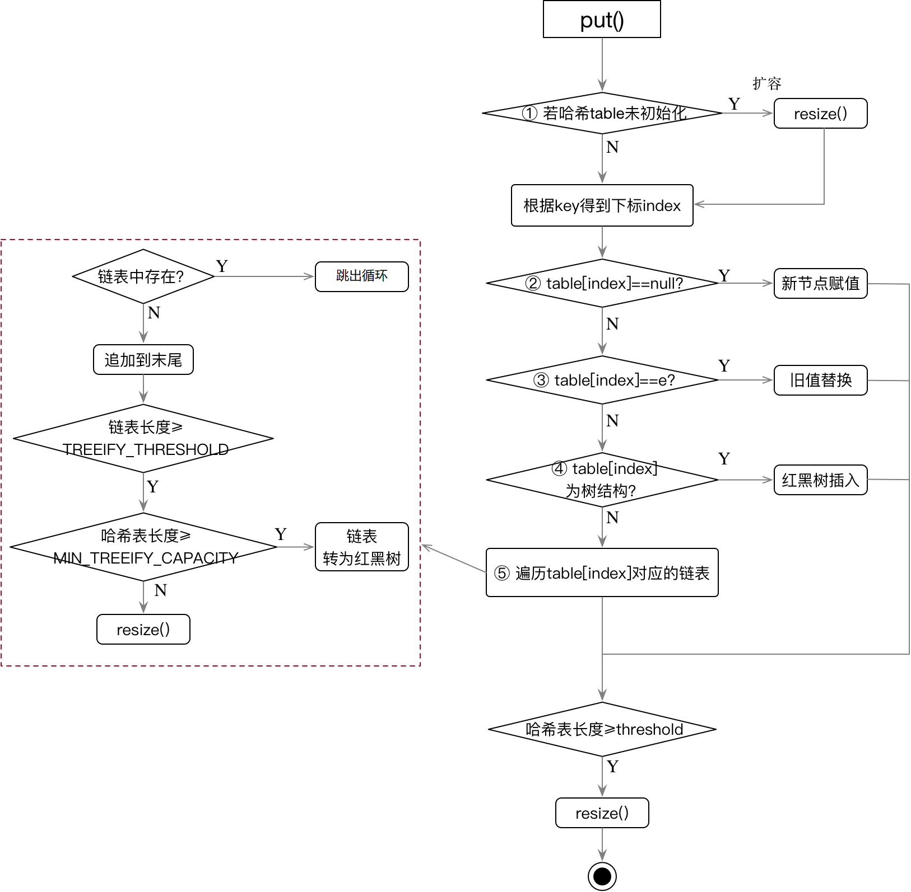
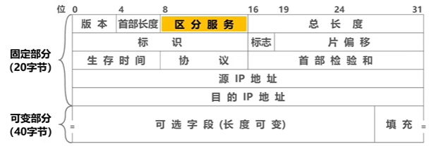

面试题
===

Java SE
===

为什么重写equals还要重写hashcode？
---

object的equals默认是比较内存地址（跟双等号一样），而hashcode默认是内存地址的哈希值，如果equalst重写了，他为true时两个对象的内存地址并不一定相同，这个时候，如果不重写hashcode，那么他会默认用object的hashcode方法，所以他们的hashcode值是不一样的。就导致两个对象equals相等但是hashcode不相等，这个对象应用在hashmap作为key时他们是先判断hashcode是否相等再比较equals，不相等就为不同的key，所以这样的对象不能应用在map和set里作为key。


对于CPU来说，数组对于链表的优势
---

CPU读取内存的时候会根据**空间局部性原理**，把一片连续的内存读取出来，然后放到缓存中。又因为数组所占用的空间是连续的，所以访问数组的时候会把数组的全部或部分元素放到缓存中，这样访问数组的速度就会很快。


Error和Exception的区别
---

Error指的是程序无法解决的错误，比如内存不足OutOfMemoryError

Exception通常指的是代码逻辑的异常，比如下标越界OutOfIndexException


hashmap
---

### 重要属性

**size**：元素个数

**threshold**：扩容阈值，默认是0.75f。==太大会容易造成hash冲突，太小空间利用率低==。

**TREEIFY_THRESHOLD**：树化的链表长度的阈值，默认值8，根据泊松分布得到。

**MIN_TREEIFY_CAPACITY**：树化的数组的容量的阈值，默认是64

**DEFAULT_INITIAL_CAPACITY**：数组默认的初始化长度，值为16

**Node<K,V>[] table**：存放元素的数组，长度一定是$2^n$ 


### put操作

put流程图：



如何得到下标：`(n - 1) & hash` （hash为key的hash值，& 等价于取模操作%）

如何计算key的hash值：`return (key == null) ? 0 : (h = key.hashCode()) ^ (h >>> 16)` 

为什么要n-1然后做&操作：因为数组长度是$2^n$ 一定是个偶数，减去1就是奇数，奇数用二进制表示时，**最低的几位都是连续的1，可以更快的取模以及减少hash冲突**。

如何判断元素是否相等：（**先判断hash再使用 ==或equals**）

```java
if (e.hash == hash &&
    ((k = e.key) == key || (key != null && key.equals(k))))
```

> 需要注意，只有数组中的元素重复时才会发送替换，其他情况直接break跳出循环。


### 扩容操作

创建一个新的数组，其**容量为旧数组的两倍 `oldCap << 1`**，并重新计算旧数组中每个结点的存储位置。结点在新数组中的位置只有两种：**原下标** 或 **原下标+旧数组长度**。

因为数组长度变为原来的2倍，在二进制上就是**最高位左移了一位**。所以可以根据最高位来判断元素位置；==是0则坐标不变，是1则坐标变为原下标+旧数组长度==。

因此，在扩容时，只需要判断最高位是1还是0就好了，这样可以大大提高扩容的速度。

如下：

```java
do {
    next = e.next;
    // oldCap -> 10..0 后面都是0
    if ((e.hash & oldCap) == 0) {
        if (loTail == null)
            loHead = e;
        else
            loTail.next = e;
        loTail = e;
    }
    else {
        if (hiTail == null)
            hiHead = e;
        else
            hiTail.next = e;
        hiTail = e;
    }
} while ((e = next) != null);
```

因为oldCap的最高位是1，后面全是0，跟原hash值做与操作时，只需看最高位的结果即可。

***

实际扩容操作：先查看数组中的元素后面有没有节点，如果没有，则直接采用`e.hash & (newCap - 1)` 方式确定下标。如果有，那么就遍历这个链表然后根据`e.hash & oldCap` 来确定链表上节点的位置，要么在原位置要么在原下标+旧数组长度的位置。


### 1.7和1.8的区别

**初始化时机**：

1.7：new的时候就初始化数组大小

1.8：put的时候才检查数组是否为null，是的话才初始化数组

***

**扩容条件**：

1.7：必须满足元素个数大于等于阈值且新插入的元素发送了hash冲突

1.8：第一种情况，存完新值之后，判断元素个数是否大于阈值。第二种情况，链表长度大于8但是数组长度小于64。第三种：table为null，即一开始put的时候。

***

**底层结构**：

1.7：只有数组加链表

1.8：数组+链表或红黑树。在链表个数大于8且数组长度大于64的时候链表进化成红黑树，在链表小于6时，红黑树退化成链表。


ConcurrentHashMap
---


Java Web
===

请你说说，cookie 和 session 的区别？
---

1. 存放位置不同。cookie数据存放在客户的浏览器上，session数据放在服务器上。
2. 数据大小不同。单个cookie保存的数据不能超过4K，而session没有限制。
3. 数据类型不同。cookie中只能保管ASCII字符串。而session中能够存储任何类型的数据。
4. cookie对客户端是可见的，用户可以通过设置cookie来进行伪装，但session不行。
5. 服务器资源。cookie保管在客户端，不占用服务器资源。session是保管在服务器端的，每个用户都会产生一个session。假如并发访问的用户很多，会产生很多的session，耗费大量的内存。


计算机网络篇
===

网络模型
---


OSI模型每层的作用及相关协议/硬件：

|   对应层   |                作用                | 传输形式 |       协议/硬件        |
| :--------: | :--------------------------------: | :------: | :--------------------: |
|   应用层   |            提供用户服务            |   报文   | http、https、ftp、SMTP |
|   表示层   | 对数据的进行**格式转换**、**加密** |   报文   |                        |
|   会话层   |            管理通信会话            |   报文   |                        |
|   传输层   |      管理点到点的可靠数据传输      |  数据段  |        TCP、UDP        |
|   网络层   |   进行**路由选择**，决定传输路径   |  数据报  |  IP、ICMP、ARP、RARP   |
| 数据链路层 |     管理相邻两个设备之间的通信     |    帧    |                        |
|   物理层   |       提供数据传输的**介质**       |  比特流  |     中继器、集线器     |


MAC地址和IP地址
---

**MAC地址**：6B(48bit)，十六进制表示，是网络上每个设备不同**接口**的唯一标识，在**数据链路层封装**。

**IP地址**：4B(32bit)，点分十进制表示，是网络跟主机的唯一标识，在**网络层封装**。

> 数据包转发过程中，源IP地址和目的IP地址不变，而源MAC地址和目的MAC地址逐跳改变。


ARP地址解析协议
---

**ARP**：可以通过IP地址获取到对应设备的MAC地址。（连接IP跟MAC的桥梁）

**RARP**：可以通过MAC地址获取到对应的IP地址。

> 每台主机都有个ARP高速缓存表，记录了IP地址跟MAC地址的对应关系。

在主机之间要发送数据包时，会根据在下一跳的IP地址，在本机的ARP缓存表查找下一跳的MAC地址，如果没找到，会通过广播形式获取到下一跳的MAC地址并记录在缓存表中。


ICMP网际控制报文协议
---

主机可通过ICMP发送 差错报文 和 询问报文。

> ping命令是利用**询问报文**来探测网络之间的连通性。
>
> traceroute命令是利用**差错报文**和**TTL生存时间**来测试IP数据报从源主机到达目的主机要经过哪些路由器。数据报每到达一个路由器，TTL就减一，TTL=0时路由会向源主机发送差错报文。TTL一开始设置为1，然后每次递增。


IP数据报首部格式
---

每个IP数据报由 数据报头部+数据区 组成

IP**数据报头部**格式如下（固定部分为20B）：



**版本号**：指定IP协议版本，IPv4还是IPv6

**首部长度**：IP数据包头部的长度，以4B为单位，即`该值*4=头部真实长度` 

**服务类型**：声明了数据报在网络系统传输时可以被怎样处理。

**总长度**：整个IP数据报的长度，最长65535

> 每个帧的数据载荷的长度是有限的，如果某个数据报的总长度太大时，会对其进行分片，每片单独作为一个数据报。而标识、标记、片位移三个字段共同协助完成切片的动作。
>
> 如数据载荷的最大长度是500，数据长度为1000；能否给每个数据报分成500？不可以，因为还需要给每个数据报加上头部数据20B。

**标识**：每个数据报的标识。==属于同个数据报的 分片数据报 应该具有相同的标识==。

**标记**：表示是否允许分片或者是否是最后一个分片。DF=0表示允许分片，MF=0表示最后一个分片。

**片位移**：分片数据报 在 原数据报 的偏移量。

**生存时间**：指定数据报在网络中传输的最长时间。每到达一个路由器，TTL就减一。可以防止数据报在网络中一直转发。

**协议标识**：指明该数据报使用的是什么协议。

| 协议名称 | ICMP | TCP  | UDP  |
| :------: | :--: | :--: | :--: |
|  字段值  |  1   |  6   |  17  |

**首部校验和**：对首部的有效性进行校验。每经过一个路由器就要重新计算首部校验和（TTL会变）。

> 校验和原理：
>
> 发送端首先将检验和字段**置0**，然后对头部中**每16位**二进制数进行**累加求和后取反**，把计算结果作为校验和。==如果累加后超出16位，则把超出的数加到低位==。
>
> 接收方进行验证的时候，也是对头部中每16位二进制数进行累加求和后取反，**结果为0表示验证成功**。

**源IP地址**：32位，发送端IP地址

**目的IP地址**：32位，目的端IP地址

**填充字段**：补充0，保证首部长度是4的倍数


TCP报文段首部格式
---

每个TCP报文段由 **首部+数据载荷** 组成。

TCP报文段首部格式如下：


**源端口**：发送方的端口号

**目的端口**：接收方的端口号

**序号**：本TCP报文段的数据载荷的==第一个字节的序号==。

**确认号**：ACK=1时该字段才有效。表示前n-1个序号的数据都已收到，==期望下个报文段的第一个数据的序号为n==。

**数据偏移**：实际是报文段的首部长度，以4B为单位，即`该值*4=头部真实长度` 

**保留**：留给以后使用

**TCP标记位**：

- URG：紧急位，使紧急指针有效。
- ACK：确认位，使确认号生效
- PSH：推送位，尽快把数据交给应用层
- RST：复位标记位，重新建立连接
- SYN：同步标记位，为1表示它是个连接请求报文
- FIN：结束标记位，为1表示它是个释放连接报文

**窗口**：指定接收方的发送窗口大小，用该字段来进行流量控制。

**校验和**：同IP数据报的校验和

**紧急指针**：指定紧急数据在数据载荷中的位置。

**填充**：保证首部长度是4的倍数


TCP和UDP的区别
---

1. TCP是面向连接的，提供可靠的服务，而UDP是无连接的，不保证可靠交付。
2. 每一条TCP连接只能是一对一通信；UDP支持多种的通信方式。
3. TCP面向字节流，传输的时候以字节为单位；UDP是面向报文的，直接发送整个数据包。
4. TCP的首部长度比UDP的大。TCP首部最小是20B，UDP固定是8B。


TCP如何保证可靠
---

- 确认应答与序列号
  
  - 每次接收方收到数据后，都会对传输方进行确认应答，在应答报文中会带着序列号。
- ARQ协议，自动超时重传
  
  - 发送方发出一个报文后，会启动一个**重传计时器**，如果在规定时间内没有收到对方的应答，会重发这个报文。
- 三次握手和四次挥手
- 流量控制
  - 因为双方都有个缓冲空间，超过这个空间的报文将会丢失，所以要实时控制滑动窗口的大小。通过改变**滑动窗口**的大小来改变发送的数据量。
  - 当滑动窗口变为0时，会启动**持续计时器**，防止改变滑动窗口的报文丢失。如果持续计时器超时，则会发送窗口探测报文，获取窗口大小。
- 拥塞控制
  
  - 通过慢启动算法跟拥塞避免算法来进行拥塞控制。一开始使用**慢启动算法**，如果网络不拥堵就将拥塞窗口以指数级($2^n$)增长；当达到慢启动门限值的时候，改为使用**拥塞避免算法**，只要网络不拥堵，则试探性的增大拥塞窗口的大小（每次加一）。
  
  - 无论在慢开始阶段还是在拥塞避免阶段，只要发送方判断网络出现拥塞，就要把**慢启动门限值 设置为出现拥塞时的发送方窗口大小的一半**（但不能小于2），然后重新进入慢开始阶段。
  
    
  
  > 怎么判断网络是否发生拥堵？**没有出现数据包发生超时重传**的情况就说明网络不拥堵。
  >
  > 门限值指的是什么？包的数量还是包的数据量？**包的数量**。
  >
  > 拥塞控制是控制整个网络中包的数量；流量控制是控制通信中包的数据量，避免数据量超过缓冲区的大小。


一个 TCP 连接可以对应几个 HTTP 请求
---

1. 如果tcp连接保持长连接 Connection:keep-alive；则只要在tcp连接（默认两小时）不断开，可以一直串行发送请求，数量没有上限；
2. 如果tcp连接不保持长连接，Connection:close 只能发一次请求；


一个 TCP 连接中 HTTP 请求可以一起发送么（比如一起发三个请求，再三个响应一起接收）
---

在 HTTP/1.1 存在 Pipelining 技术可以完成这个多个请求同时发送，但是由于浏览器默认关闭，所以可以认为这是不可行的。

在 HTTP2 中由于 Multiplexing 特点的存在，多个 HTTP 请求可以在同一个 TCP 连接中并行进行。


HTTP2多路复用
---

多路复用就是并行流的方式发送数据。

相对于Http1.x的文本格式传输，`HTTP/2`引入`二进制数据帧`，数据帧对数据进行顺序标识，这样浏览器收到数据之后，就可以按照序列对数据进行合并。同样是因为有了序列，服务器就可以并行的传输数据 即多路复用。

**HTTP2 中，同域名下所有通信都在单个连接上完成，该连接可以承载任意数量的双向数据流** 。


为什么有的时候刷新页面不需要重新建立 SSL 连接？
---

因为TCP 连接有时候是维持一段时间的，即不需要重新建立连接，SSL 自然也会用之前的。


 简单描述一下，TCP的连接和释放过程
---

### 三次握手的过程

1. 主机A向主机B发送TCP连接请求报文（其中报文中同步标志位SYN=1，序号seq=x），主机A进入同步等待状态。
2. 主机B收到请求后，回复连接确认报文。（其中确认报文中，SYN=1，ACK=1，并含主机B的初始序列号seq(B)=y，以及确认号ack(B)=x+1），主机B进入同步已接收状态。
3. 主机A收到主机B的确认报文后，还需最后发送一个报文，即发送一个ACK=1，序列号seq(A)=x+1；确认号为ack(A)=y+1的报文；完成连接


### 为什么需要三次握手？

TCP的三次握手最主要是 **防止已过期的报文再次传到服务器后导致连接错误**。


### 四次挥手过程

假设主机A为客户端，主机B为服务器，其释放TCP连接的过程如下：

1. 首先客户端发送一个请求断开报文，用来**关闭**客户端到服务器的**数据传送**，然后等待服务器的确认。其中 终止标志位FIN=1，序列号seq=u。
2. 服务器收到数据包之后发回一个确认报文，ACK=1，确认号ack=u+1。此时服务器还可以向客服端发送数据。
3. 当服务器发送完数据之后，会再次发送一个请求断开报文给客户端，表示**关闭**服务器到客户端的**连接**（FIN=1，ACK=1，seq=v，ack=u+1）
4. 客户端收到报文后，发回一个确认报文（ACK=1，seq=u+1，ack=v+1）。此时客户端接着进入等待状态并启用**等待计时器**，等待2MSL后进入关闭状态。


### 为什么要先进入TIME-WAIT状态，等待2MSL时间后才进入CLOSED状态？

为了保证服务器能收到客户端的确认应答。若A发完确认应答后直接进入CLOSED状态，那么如果该应答报文丢失，服务器等待超时后就会重新发送连接释放请求，但此时客户端已经关闭了，不会作出任何响应，此时B永远无法正常关闭。


### 为什么要等待2MSL

MSL表示数据包的最大存活时间。

若A发送的确认报文在一个MSL内还没有发到B，则B会重新发送一个数据包。这样一来一回的最大时间就是2MSL。

并且等待2MSL之后，可以确保所有的数据包都已经失效，不会对重新连接的新报文跟老报文发生冲突。


对称加密与非对称加密
---

==对称加密==是指加密和解密使用同一个密钥，这种方式存在的最大问题就是密钥如何安全地将密钥发给对方；

- DES、AES

==非对称加密==是指使用一对非对称密钥，即公钥和私钥，公钥可以随意发布，但私钥只有自己知道。发送密文的一方使用对方的**公钥进行加密**，对方接收到加密信息后，使用自己的**私钥进行解密**。

- RSA


Http工作原理
---

HTTP协议（HyperText Transfer Protocol，超文本传输协议）在进行网络通信时双方要遵循的规则。

> 超文本：不仅仅是文本，还可以是图片、视频等


### HTTP请求响应模型

HTTP的请求和响应模型：**客户端/服务器模型（B/S）** 

> C/S：客户端/服务器模型，类似于APP，客户端既要做逻辑处理也要做页面展示。服务器发生一次升级，所有客户端的程序都需要升级。
>
> B/S：浏览器/服务器模型，页面渲染展示交给浏览器，逻辑处理交给服务器。

HTTP是一个无状态的协议。无状态是指 当浏览器向服务器发送请求，服务器返回响应之后，连接就被关闭了，服务器不保留与连接有关的信息。

但可以通过设置`Connection: keep-alive` 来保持一段时间的连接。从HTTP/1.1起，**默认都开启了Keep-Alive**，简单地说，当一个网页打开完成后，客户端和服务器之间用于传输HTTP数据的TCP连接不会关闭，如果客户端再次访问这个服务器上的网页，会继续使用这一条已经建立的连接。


### HTTP工作过程

地址栏输入域名网址后回车：

1. 地址解析：

   1.1 查看**浏览器缓存**有无该域名的IP

   1.2 查看**本机的DNS缓存**，看有没有对应域名的IP地址（位于`C:\Windows\System32\drivers\etc\hosts`）

   1.3 到**本地域名服务器**查询得到IP地址

2. 将请求解析成HTTP标准的报文格式

3. 三次握手，建立TCP连接

4. 发送请求，得到数据，在浏览器中渲染

5. 四次挥手，关闭TCP连接


### Http1.x请求报文格式

Http1.x请求报文格式固定如下：


例如：（ **post请求时必须指定 Content-length** ）

```text
POST /abc/a.html HTTP/1.1
content-type: application/json; charset=utf-8
Content-length:20

username=admin&age=3
```


### Http响应报文格式

Http响应报文格式固定如下：


例如：

```text
HTTP/1.1 200 OK
Content-Encoding: gzip
Content-Type: text/html;charset=utf-8

<!DOCTYPE html>
<html lang="en">
<head>
    <meta charset="UTF-8" />
    <title>Document</title>
</head>
<body>
    <p>哈哈哈哈</p>
</body>
</html>
```


### Http请求方法

|  方法   |                       作用                       |
| :-----: | :----------------------------------------------: |
|   GET   |              请求页面信息，获得数据              |
|  HEAD   |    类似于get请求，只不过获取的是HTTP的头信息     |
|  POST   | POST请求可能会导致新的资源的建立或已有资源的修改 |
|   PUT   |                  更新服务器资源                  |
| DELETE  |                  删除服务器资源                  |
| OPTIONS |             获取服务器可以请求的方法             |


### GET和POST的区别

1. **参数传递方式**：GET参数通过URL传递，POST放在Request body中。因为很多浏览器的URL长度是有限制的，所以get参数的大小也有限制。
2. **请求编码**：GET请求只能进行url编码`application/x-www-form-urlencoded`，而POST支持多种编码方式，如 url编码、`application/json`、`multipart/form-data`。
3. **浏览器回退**：GET在浏览器回退时单纯回到页面，而POST会再次提交请求。
4. **浏览器缓存**：GET请求会放入浏览器cache中，而POST不会，除非手动设置。


http与https的区别
---

http运行在tcp之上，使用明文进行传输，是无状态的（客户端和服务端都无法验证对方的身份），端口号是80；

https是http的基础上加了SSL(Secure Socket Layer)，在传输的过程中会进行加密和认证，端口号是443。资源消耗比http大。


响应码
---

1. 1开头：表示成功接收请求，要求客户端**继续提交**下一次请求才能完成整个处理过程。比如发送post请求前，需要先发送一个请求，询问服务器是否处理，得到100响应之后再发送post请求。
2. 2开头：表示成功接收请求，并且已经**完成整个处理过程**。
3. 3开头：重定向。
   - 301：永久重定向
   - 302：临时重定向
4. 4开头：客户端的请求有错误。
   - 400：客户端请求语法有问题
   - 403：禁止访问
   - 404：找不到资源
5. 5开头：服务器端出现错误。
   - 500：服务器内部错误
   - 504：访问超时


https工作原理
---

> SSL/TLS协议+http协议 = https协议
>
> SSL出现在会话层

1. 客户端发出请求

   客户端先向服务器发出加密通信的请求，并生成一个随机数，这被叫做ClientHello请求。

2. 服务器回应

   服务器收到客户端请求后，确定加密算法以及生成一个随机数，向客户端发出回应，把证书发给客户端，这叫做SeverHello。

3. 客户端回应

   客户端收到服务器回应以后，首先会验证服务器证书，如果证书可靠，则生成第三个随机数，接着取出证书里面的公钥对新生成随机数（pre-master key）进行加密，然后发给服务器。

4. 服务器的最后回应

   服务器收到客户端的加密后的随机数之后，通过私钥进行解密，此时客户端和服务器都拥有了三个随机数，然后两者根据约定好的加密算法生成本次会话所用的"会话密钥"。然后，服务器向客户端发送下面信息。

   编码改变通知，表示随后的信息都将用双方商定的加密方法和密钥发送。

   服务器握手结束通知，表示服务器的握手阶段已经结束。

至此，整个握手阶段全部结束。接下来，客户端与服务器进入加密通信，就完全是使用普通的HTTP协议，只不过用"会话密钥"加密内容，此步骤是对称加密。

> ==证书包含哪些内容==？证书的发布机构、证书的有效期、公钥等。
>
> ==客户端如何检测数字证书是合法的==？
>
> 首先应用程序读取证书中的**发布机构**，然后会在**操作系统或浏览器**内置的受信任的发布机构中去找该机构的证书，如果找到，则**取出该机构证书中的公钥**，然后对服务器发送的证书**进行验签**，看有没有该证书是不是合法的，有没有被修改过。
>
> 【注意】CA机构在签发证书的时候，都会使用自己的私钥对证书进行签名


SSL握手的目的
---

保证客户端与服务器之间密钥的交换是安全的。握手期间使用的加密算法是非对称加密，通信期间使用的是对称加密。


URI 和 URL 的区别是什么？
---

- **URI**：是统一资源**标识符**，是一个**资源的标识**。
- **URL**：是统一资源**定位符**，是一个**资源的路径**。URL 是 URI 的一个子集，它不仅唯一标识资源，还可以提供资源的定位信息。


操作系统
===

什么是操作系统
---

操作系统是一个运行在计算机上的**软件程序** ，管理着计算机硬件和软件资源，并且可以对资源合理的进行调度和分配。

操作系统主要完成的功能：进程管理、内存管理、文件管理、设备管理


### 操作系统的特性

- 并发：在一段时间内，宏观上有多个程序同时运行
- 共享：系统中的资源可以被多个程序访问。包括 互斥访问 和 同时访问。
- 虚拟：通过某种技术把一个物理实体变为若干个逻辑上的对应物。
- 异步：进程运行的顺序是无法预知的。


### 用户态和核心态

在计算机系统中，分两种程序：系统程序和应用程序。**为了保证 系统程序 不被 应用程序 有意或无意地破坏**，计算机设置了两种状态—— **用户态、核心态**。

- **用户态**：只能受限的访问内存 ，只能执行非特权指令，运行所有的应用程序。
- **核心态**：可以访问所有数据，可以运行特权指令和非特权指令，运行系统程序。

> 使用 ==程序状态字寄存器==（PSW）中的某个标志位来标识当前CPU的状态。如0是用户态，1是核心态。
>
> 用户态 必须使用**中断**才可以切换到 核心态，然后修改PSW的标记位。
>
> 核心态 切换到用户态则可以直接修改PSW的标记位。


进程管理
---

### 什么是进程

进程由 PCB(进程控制块)、程序段、数据段组成。


### 进程的五种状态


### 进程间通信

- **管道**：管道就是一份文件，进程A往管道中写完数据后，进程B才可以读数据。每个通道都是**半双工通信**，进程A不能既往管道写数据又往该管道读数据。
  - 管道又分为**匿名管道**和**命名管道**，匿名管道只能用于有**亲缘关系**的进程间通信，而命名管道则是用于**任意**进程。
- **消息队列**：是一个链表，一个进程可以往另一个进程的消息队列里发送数据。
- **共享内存**：多个进程可以 **互斥的访问** 共享内存中的数据。（全双工）


### 进程调度

**先来先服务 FCFS**：每次都将CPU分配给最先进入到就绪队列的进程。

**短作业优先 SJF**：优先给 **估计运行时间最短**的进程分配CPU。

**优先权调度**：每个进程都关联一个优先级，内核将CPU分配给最高优先级的进程。具有相同优先级的进程，按照先来先服务的原则进行调度。

**时间片调度**：系统将所有的就绪进程按 先来先服务 的原则排成一个队列，每次调度时CPU只执行一个时间片，当前时间片执行完之后就调度下一个进程。

**响应比优先调度**：

- 如果作业的等待时间相同，则服务的时间愈短，其优先权愈高。
- 如果服务的时间相同，等待时间愈长，其优先权愈高。
- 对于长作业，作业的优先级可以随等待时间的增加而提高


### 进程和线程的区别是什么

1. 进程是资源分配的最小单位，线程是资源调度的最小单位
2. 一个进程至少有一个线程，多个线程可共享进程所拥有的资源，线程必须存活在进程中。
3. 进程之间的切换比线程之间切换的开销要大。 


### 什么情况下会发生死锁？如何解决

死锁：两个或两个以上的进程（线程）在执行过程中，因为争夺资源而造成相互等待状态，若无外力作用，它们都将永远无法执行下去。

形成死锁的四个必要条件：

- **互斥**：一个资源一次只能被一个进程访问。

- **请求与保持**：一个进程因请求资源而阻塞时，对已获得的资源保持不放。

- **不可剥夺**：进程已经获得的资源，在未使用完之前不能强行剥夺。

- **循环等待**：若干资源形成一种头尾相接的循环等待资源关系。

**解决**死锁的办法：

|  死锁条件  |                    解决方案                    |
| :--------: | :--------------------------------------------: |
|    互斥    |                    无法解决                    |
| 请求与保持 |              一次性申请所有的资源              |
|  不可剥夺  | 申请不到资源时，主动释放占有的资源（超时机制） |
|  环路等待  |            顺序执行（注意加锁顺序）            |


内存管理
---

### 什么是内存

**所有数据要放在内存中才可以被CPU使用**。整个内存由一块块连续的 **存储单元** 组成。


不同计算机的存储单元的大小不同，如果计算机**按字节编址**，则一个存储单元为1B（8bit）。如果计算机**按字长编址**，则一个存储单元为一个字（字长由计算机决定）。

> 比如字长为16位的计算机“按字编址”，则每个存储单元大小为1个字，每个字的大小为16bit。


### 从写程序到程序运行

编辑 -- 编译 -- 链接 -- 载入。

- 编译：将程序翻译成机器语言。
- 链接：将每部分的机器语言都链接在一起，形成一个整体的模块。
- 载入：将整体模块载入到内存中

因为机器语言里面所使用的地址是**逻辑地址**（相对地址），所以需要在载入或载入之前将逻辑地址变成内存中的物理地址，也叫绝对地址（ **初始地址+逻辑地址=物理地址** ）。

载入有三种方式：

1. 绝对载入：编译时就将逻辑地址转为物理地址，装入的时候直接装入即可。
2. 静态重定位：装入时就完成逻辑地址到物理地址转换。
3. 动态重定位：利用**重定位寄存器**记录起始地址，程序运行时再动态的转换地址。


### 内存保护

为了保证进程不发生越界访问，操作系统会对每个进程区域进行存储保护：利用**重定位寄存器**和**界地址寄存器**来判断指令是否发生了地址越界。

> 界地址寄存器：存放 进程内存末端地址 的偏移量。


### 内存分配

传统内存分配方式有两种：连续分配和离散分配。


> 内存中分有 系统区 和 用户区。**每个进程的空间分配到用户区**。

**单一连续分配**：用户区只能分配给一个进程。

**固定分区连续分配**：将用户区分成多个大小固定的区域（大小可相同可不同），每个进程分配到每个区域中。

**动态分区连续分配**：进程需要用到内存时才动态的创建分区。至于如何创建在哪创建需要根据动态分配算法来决定。

- ==首次适应==：空闲分区以**地址递增**的次序排列，每次分配空间时，按顺序查找，放得下就立刻分配，然后更新空闲分区。
- ==最佳适应==：空闲分区以**容量递增**的次序排列，每次分配空间时，按顺序查找，放得下就立刻分配，然后更新空闲分区。
- ==最坏适应==：空闲分区以**容量递减**的次序排列，每次分配空间时，按顺序查找，放得下就立刻分配，然后更新空闲分区。

【总结】连续分配会产生大量的内部碎片。


### 页式存储

将**内存空间**分为一个个大小相等的**物理块**（比如4KB），每个物理块从0开始编号。

同时将**进程空间**也分为一个个跟**物理块大小相等**的区域，我们叫做**页**，每页从0开始编号。

操作系统以**页**为单位给每个进程分配内存空间，每页都**离散**的分配到物理块中。

**tips**：物理块越大，越容易产生内部碎片。


如何实现地址的转换？

物理地址 = 页面起始地址 + 页内偏移量。

- `页面起始地址 = 块号 * 块大小`，而块号可以根据页号得到。
- `逻辑地址 / 页面大小 = 页号` 
- `逻辑地址 % 页面大小 = 页内偏移量` 

> 为了方便计算，一般页面长度为 $2^n$ ，这样可以用 **低n位** 表示**页内偏移量**，**剩余的高位**表示 **页号**。

如何根据页号得到块号？

操作系统为**每个进程**建立了一个**页表**，每个页表项记录了 页号跟块号 的对应关系，且每个页表项长度都是相等的，连续的存放在**内存**中。

因为页号我们是已知的，所以页表项里只需要存储每个页对应的块号就可以了。当我们拿到页号，通过公式`页表起始地址 + 页号 * 页表项的长度` 得到页表项，因而得到块号。


### 段式存储

程序按照**自身的逻辑**关系将**进程空间**划分为若干个段，每个段都有一个段名（在低级语言中，程序员使用段名来编程）。内存分配时以段为单位，每个段分配在离散的空间中。

分段系统的逻辑地址结构由 **段号（段名）**和 **段内地址（段内偏移量）**所组成。

操作系统为每个进程建立一个段表，放到内存中。每个段表项包括 **段长**跟**段基址**。

> 物理地址 = 基址 + 段内地址。利用段长判断指令是否越界。


***

段式跟页式的区别：

- **目的不同**：分页的目的是为了离散分配；而分段的目的是为了满足用户的需求；

- **大小不同**：页的大小固定且由系统决定；而段的长度不固定，由具体功能决定；

- **地址空间不同**： 页向用户提供的是一维地址空间；段向用户提供二维地址空间(段名和段内地址)；

- **内存碎片**：页式存储的优点是没有外部碎片，但会产生内部碎片（一个页可能填充不满）；而段式存储的优点是没有内碎片，但会产生外碎片；


### 段页式存储

用户程序**先分段**，每个段内部**再分页**。逻辑地址为：段号、段内页号、页内地址。

查找的时候先根据 段号 找到 页号(存放在块号中)，然后根据 页号 找到具体的 块号 。


### 虚拟内存

在操作系统管理下，用户看来比实际内存大得多的内存就是虚拟内存。

有三个特性：多次性、对换性、虚拟性

- **多次性**：无需一次性将作业全部载入内存，将要用到的部分才载入。
- **对换性**：允许作业在运行过程中，将作业进行调入和换出。
- **虚拟性**：从逻辑上扩充了内存的容量，使用户感觉内存容量远大于实际容量。

> 工作方式：
>
> 首先把进程运行所需要的数据加载到内存中。在后续如果需要用到其他数据，则将其加载到内存中，如果此时内存已满，则会使用页面置换算法将某个页或者某些数据移出内存。

实现虚拟存储的方式：


请求分页存储管理 跟 分页存储管理的区别：

- 当访问页面不在内存时，会发生**缺页中断**，由操作系统将所需信息从外存载入内存
- 若空间不足时，操作系统会使用**页面置换算法**将某些页面移出内存。

因为需要记录页面是否调入内存等信息，所以在页表中新增了四个字段：


| 新增字段 | 作用                                                         |
| -------- | :----------------------------------------------------------- |
| 状态位   | 是否调入内存，1表示已在内存                                  |
| 访问字段 | 记录该页最近访问过几次或最近修改的时间，便于页面置换算法实现 |
| 修改位   | 调入内存后是否被修改过，若有修改，则需要重新写回内存         |
| 外存地址 | 页面在外存中的地址                                           |

地址转换过程：

1. 根据页号去**快表**(相当于缓存)中查找，若命中直接返回。

2. 否则，根据页号去**页表**中查找该页的相关信息，若其没有调入内存则发生**缺页中断**，此时缺页的进程阻塞，页面被载入内存后 缺页的进程 会被唤醒。

3. 如果此时内存不足，则会使用**页面置换算法**，移除一个页面。

4. 当一个页面被访问或调入调出的时候，需要**修改对应的页表项**。

   【注意】在页面被调出的时候，需要在快表中删除该页的页表项。


### 页面置换算法


**最佳置换算法 OPT**：每次淘汰将来最久不会使用的页面。（因为无法预知将来页面，所以该方法是无法实现的）

**先进先出置换算法 FIFO**：每次淘汰最先进入内存的页面。（可以利用指针实现，每次去掉头指针指向的页面即可）

**最近最久未使用 LRU**：每次淘汰已在内存中的，最久没使用到的页面。（利用访问字段记录该页最近的访问时间）

**时钟置换算法**：也叫最近未使用算法。将内存中的页面放入一个循环链表，然后利用 访问字段 记录最近是否访问过。若一个页的访问字段为0，说明该页最近没有被使用过，替换该页；否则将该页的访问字段变为0（不会进行替换），然后往下遍历。如果全都是1，那么第二轮扫描的时候肯定会淘汰第一个页面。

**改进时钟置换算法**：跟时钟置换算法差不多，只不过要考虑修改位，即访问位都是0的情况下，==优先选择修改位为0的页面进行置换==（因为不用重新写回内存）。

> **抖动(颠簸)现象**：多个页面被频繁的调入调出。原因是分配给进程的物理块的数量少于需要频繁访问的页面的数量。


磁盘调度算法
---

- **先来先服务**：根据进程请求访问磁盘的先后顺序进行调度
- **最短寻道时间**：每次选择距离当前磁头最近的磁道进行调度
- **扫描算法（电梯算法）**：在磁头**当前移动方向上**选择与当前磁头所在磁道距离最近的请求作为下一次服务的对象。到达最后一个磁道时，会改变磁头方向，然后根据之前的规则进行调度。
- **循环扫描**：类似于电梯算法，只不过每次到达最后一个进程不是改变磁头方向，而是快速回到起始端重复调用。


Linux的交换分区
---

当内存不足时，将暂时用不到的程序放入到交换分区，当内存足够或者需要用到的时候再换回内存。

> 交换分区的最大值不超过物理内存的两倍。


计算机组成原理
===

ieee754
---

在计算机中，通常采用ieee754来存储浮点数，存储格式如下：


公式为：**$m_s$M × $2^{E}$** , 【注意】M其实是1.M，因为第一位肯定是1，所以省略。

- `移码 = 真值 + 偏置值` 


- [x] 为什么要使用移码表示阶码？将阶码都变成正数，可以方便浮点数在进行加减运算时的对阶操作。


### 为什么浮点数精度会丢失？

因为计算机表示浮点数时，尾数部分决定了浮点数的精度，而**尾数部分的位数是固定的**，超出了位数的值会按某种规定舍去，所以会出现**精度丢失或溢出**的问题。


场景题
===

从大数据量的找出出现次数最多的，或者前多少大/小的
---

**问题**：

1. 假设有1kw个身份证号，以及他们对应的数据。身份证号可能重复，要求找出出现次数最多的前100个身份证号。
2. 怎么在海量数据中找出重复次数最多的一个
3. 有一个1G大小的一个文件，里面每一行是一个词，词的大小不超过16字节，内存限制大小是1M。返回频数最高的100个词。

**解题思路**：都是采用分支然后归并的方法。

1. 对数据取hash值然后除以一个数n取模，然后将数据分到n个小文件中
2. 对于每个小文件，可以把 数据 作为key，出现次数作为value 存入 hashMap中。
3. 分别对这些小文件进行处理，如排序，取出次数最多的
4. 合并所有的小文件，得出结果

***

比如第一题

1. hash(身份证号)%1000，将身份证号存储到1000个小文件中，每个小文件就只有1w条的数据
2. 对于每个小文件，把身份证作为key，出现次数作为value存入hashMap中。
3. 然后读取每个文件hashMap的次数最多的前100个身份证号使用归并排序存入到一个文件中。
4. 然后读取每个文件出现次数最多的前100个身份证。


JWT生成token有几个部分
---

JWT是 JSON Web Token的缩写，是一种安全的规范，使用JWT可以让我们在用户端和服务端建立一种可靠的通信保障。

JWT有三个部分组成：

1. **header**：描述JWT的元数据，定义了生成签名的算法以及token的类型
   - 这里指定为RSA256非对称加密算法，类型默认是jwt
2. **payload**：负载，用来存放要传递的数据，比如用户的基本信息和token过期时间
3. **signature**：签名，使用 密钥和指定的算法 对header和payload进行签名。

token验证流程：

1. 用户登录时后端返回一个token，前端将其保存在sessionstroage中
2. 前端每次请求中携带token字段，该字段中携带token信息
3. 后端拦截器拦截请求后验证token字段
   - 公钥对签名解密，解密出来的header和payload的信息是否和传过来的一致。


网络安全
===

文件上传漏洞
---

文件上传漏洞顾名思义，就是在上传文件的时候，攻击者利用 开发人员没有对上传文件进行检测或者检测逻辑不全面的漏洞，上传了一个可执行文件（如木马，病毒，恶意脚本）到服务器执行，并最终获得网站控制权限的高危漏洞。

**常见的上传文件校验方式**：

1. 客户端校验：在前端使用js对==文件后缀名进行检测==。

   > 破解方法：
   >
   > 1. 直接在浏览器禁用Javascript。
   >
   > 2. 先改成允许上传的文件类型，然后用Burpsuite改成脚本文件类型，即可绕过。

2. 服务端 content-type校验：==指定content-type字段类型==，如果文件不是指定类型就返回错误。

   > 破解方法：可以通过抓包，将content-type字段改为服务端允许的类型。

3. 服务端 文件后缀名检测：通过自己写==正则匹配文件后缀名==，判断其是否符合要求

   > 破解方法：
   >
   > 1. 文件名大小写可能可以破解，例如Php，AsP等类似的文件名
   > 2. 00截断。例如：/123.php%00.jpg/123.jpg -> /123.php

**防护方法**：

1. 文件上传的目录设置为不可执行。
3. 上传文件重命名。
4. 隐藏上传文件的路径。


SQL注入
---

SQL注入就是利用一些查询语句的漏洞，将SQL语句传递到服务器解析并执行的一种攻击手段。

**危害**：

1. 绕过网页或Web应用程序的身份验证和授权
2. 修改和删除数据库中的记录

**常见sql注入场景**：

原理：用户进行用户名和密码验证时，网站需要查询数据库。查询数据库就是执行SQL语句，但在查询过程中，并未对一些特殊符号进行过滤，如单引号(')。

（1）用户登录时，后台执行的数据库执行的SQL语句是：`Select * From users Where user_id='用户名' And password='密码'` 

（2）由于网站后台在进行数据库查询的时候没有对单引号进行过滤，当输入用户名【admin】和万能密码【`1' or' 1=1`】时，执行的SQL语句变为：`Select * From users Where user_id='admin' And password='1' or '1=1'` 

（3）由于SQL语句中逻辑运算符具有优先级，`=`优先于`and`，`and`优先于`or`，且适用传递性。因此，SQL语句的查询结果为TRUE，就意味着认证成功，也可以登录到系统中。

或者狠一点，把表都删了：`Select * From users Where user_id='admin' And password='1' or '1=1; drop table users'` 

**应对方法**：

1. 使用PreparedStatement。


XSS
---


